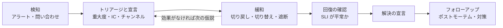

# 10.5 インシデント対応とポストモーテム

> 障害は必ず起きます。差がつくのは、起きた後です。誰が指揮を執り、誰が顧客に何を伝え、どの順に手を打つのか。深夜 3 時に呼び出された人が、疲れと焦りの中でも正しく動けるのは、仕組みと訓練があるときだけです。そして障害から学べる組織は、「誰が悪かったか」ではなく「なぜそれが起こりえたのか」を問います。この章では、重大度の定義・オンコールの設計・インシデント対応の役割と流れ・コミュニケーション・ブレームレスなポストモーテム・指標の扱いを、公開された実際の障害の報告から学びます。

| 項目 | 内容 |
|---|---|
| 学習時間の目安 | 本文 3.5h ＋ 演習 4h |
| 前提となる章 | [10.3 信頼性設計とSLO](../03-reliability-engineering/README.md)、[10.4 オブザーバビリティ](../04-observability/README.md) |
| 演習 | [exercises/](exercises/)（Python）と記述演習（ポストモーテムの作成） |
| キーワード | インシデント, 重大度（SEV）, オンコール, エスカレーション, フォロー・ザ・サン, インシデントコマンダー, ICS, 緩和, ステータスページ, ポストモーテム, ブレームレス, 寄与要因, 5 Whys, アクションアイテム, MTTR, ゲームデー |

## この章のゴール

- [ ] インシデントを定義し、影響に基づく重大度（SEV1〜4）の基準と、それぞれの対応の水準を設計できる
- [ ] 持続可能なオンコールの体制（ローテーション・エスカレーション・負荷の上限・フォロー・ザ・サン）を設計し、公平な当番表を生成できる
- [ ] インシデントコマンダーを中心とした役割分担と、「まず緩和する」対応の流れを説明し、実践できる
- [ ] 社内外へのコミュニケーション（ステータスページ・更新の頻度・顧客への連絡）を計画できる
- [ ] ブレームレスなポストモーテムを書き、単一の根本原因ではなく寄与要因とアクションアイテムを導ける
- [ ] MTTR などの指標の落とし穴を説明し、分布に基づく指標と SLA のクレジットを計算できる

## なぜ学ぶのか

2017 年 2 月 28 日、Amazon S3 の米国東部（us-east-1）リージョンで数時間にわたる障害が起き、S3 に依存する多数の Web サービスが影響を受けました。AWS が公開した報告によれば、原因は、確立された手順書に沿って少数のサーバーを外すはずのコマンドの入力を誤り、意図より多くのサーバーを外してしまったことでした。さらに、障害の初期には、AWS 自身のサービス状況ダッシュボードの管理機能が S3 に依存していたため、状況の表示を更新できなかったとされています。

この事例には、この章で扱うテーマが凝縮されています。人は必ず誤る（だから誤りの影響を小さくする仕組みが要る）。復旧の手順は、使われていなければ想定より時間がかかる。そして、顧客への連絡の手段そのものが、障害に巻き込まれることがある。

インシデント対応の質は、技術力だけでは決まりません。同じ障害でも、役割が決まっていて、情報が 1 か所に集まり、まず影響を止めることに集中できるチームは、全員がばらばらに原因を探すチームより、はるかに早く復旧します。そして、障害の後に「担当者の不注意」と結論づける組織では、次から誰も正直に話さなくなり、同じ種類の障害が繰り返されます。日本の組織では、障害の報告書が責任の所在の確認や謝罪のための文書になりがちだとも指摘されます。**障害から学び、組織として強くなる仕組み** を作ることは、CTO の重要な仕事です。

## 1. インシデントとは何か

### 1.1 定義と宣言

**インシデント（incident）** は、サービスの計画外の停止や品質の低下、またはその恐れがあり、通常の業務の流れとは別に、組織的な対応が必要な事象です。セキュリティの事故もインシデントですが、その固有の対応は [11.5](../../11-security/05-security-operations/README.md) と [14.6](../../14-cto/06-crisis-management/README.md) で扱います。

大切なのは、**インシデントを「宣言」する** という行為です。宣言すると、専用のチャンネルが作られ、役割が割り当てられ、関係者に通知され、記録が始まります。宣言の基準は低くしておき、後から重大度を下げるか取り消せばよい、というのが定石です。宣言をためらって 30 分遅れる損失は、誤報で数人の時間を使う損失よりずっと大きいからです。

### 1.2 重大度（SEV）の定義

重大度は、**原因の技術的な深刻さではなく、利用者と事業への影響** で決めます。例を示します（数字や基準は組織ごとに決めます）。

| 重大度 | 基準の例 | 対応の水準の例 |
|---|---|---|
| SEV1 | 主要な機能が全面的に停止、多数の利用者に影響、データの消失や漏えい、法令・契約上の重大な影響 | 24 時間即時呼び出し。インシデントコマンダー必須。経営層へ即時報告。社内外への更新は 30 分ごと。ポストモーテム必須 |
| SEV2 | 主要な機能の一部の停止や大きな劣化、一部の顧客に大きな影響、SLO を急速に消費 | 即時呼び出し。インシデントコマンダーを置く。更新は 1 時間ごと。ポストモーテム必須 |
| SEV3 | 軽微な機能の障害、回避策がある、少数の利用者に影響 | 営業時間内に対応。チケットで管理。ポストモーテムは任意 |
| SEV4 | 利用者への影響がほぼない不具合、将来の障害の予兆 | 通常のバックログで対応 |

基準は具体的に書きます。「重大な影響」ではなく「決済の成功率が 5 分以上 95% を下回る」「影響を受けた顧客が 100 社を超える」のように、当番の人が迷わず判断できる形にします。判断に迷ったら高い方を選ぶ、というルールも明記しておきましょう。

## 2. オンコールの設計

### 2.1 ローテーション

**オンコール（on-call）** は、決められた期間、呼び出しに応じて障害に対応する当番です。典型的には 1 週間ごとの輪番で、主担当（プライマリー）と、応答がないときや手が足りないときの副担当（セカンダリー）を置きます。当番の交代時には、進行中の問題・直近の変更・注意点を引き継ぎます。

持続可能な体制には人数が要ります。Google の SRE 本は、1 拠点だけで 24 時間のオンコールを回すなら最低 8 人、2 拠点で分担するなら各拠点 6 人程度を目安としています。人数が少ないと、当番が頻繁に回ってきて、休息と通常業務が削られ、やがて人が辞めます。

### 2.2 フォロー・ザ・サン

時差のある複数の拠点を持つ組織では、各拠点が自分たちの昼間だけを担当する **フォロー・ザ・サン（follow-the-sun）** の体制をとれます。夜中に起こされる人がいなくなる一方で、拠点間の引き継ぎが増え、各拠点に十分な知識と権限が必要になります。演習 3 で、拠点の勤務時間から UTC のカバー範囲と空白を計算します。

```python
from oncall import Site, coverage_gaps, utc_coverage

sites = [Site("tokyo", 9), Site("dublin", 0), Site("sf", -8)]   # すべて現地 9〜17 時
for hour, names in enumerate(utc_coverage(sites)):
    if hour % 4 == 0 or not names:
        print(f"UTC {hour:2}時: {', '.join(names) or '（誰もいない）'}")
print(coverage_gaps(sites))
print(coverage_gaps([Site("tokyo", 9, 8, 17), Site("dublin", 0, 8, 17), Site("sf", -8, 8, 17)]))
```

```text
UTC  0時: sf, tokyo
UTC  4時: tokyo
UTC  8時: （誰もいない）
UTC 12時: dublin
UTC 16時: dublin
UTC 20時: sf
[(8, 9)]
[]
```

東京・ダブリン・サンフランシスコがそれぞれ現地の 9〜17 時を担当すると、UTC 8 時台（東京 17 時・ダブリン 8 時）に誰もいない 1 時間が生まれます。勤務時間を 8〜17 時に広げれば埋まります。夏時間の切り替えで、この境目がずれることにも注意が必要です（演習は固定の時差で簡略化しています）。

### 2.3 エスカレーション

呼び出しに一定時間（例: 5 分）応答がなければ副担当へ、さらに応答がなければチームの責任者へ、と自動で上げていく規則を **エスカレーションポリシー** と呼びます。専門知識が必要なときに、他チームの当番や DB の専門家を呼び出す経路も決めておきます。呼び出しのツールは、電話・SMS・アプリの通知を組み合わせ、1 つの経路の障害で呼び出しが届かないことを防ぎます。

### 2.4 負荷の上限と持続可能性

- **呼び出しの数に上限を設ける**: SRE 本は、1 件のインシデントの対応（原因の分析・修正・ポストモーテムを含む）に平均 6 時間ほどかかるという経験から、12 時間の当番あたり 2 件程度を上限の目安としています。これを超えるなら、アラートの見直しや信頼性への投資が必要というシグナルです（→ [10.4](../04-observability/README.md) のアラート疲れ）。
- **当番中の時間の使い方を決める**: 当番の週は機能開発の予定を入れず、トイルの自動化や小さな改善に使う。
- **夜間の対応の後は休ませる**: 深夜に対応した翌朝は出社を遅らせるなど、回復の時間を制度として保証する。
- **報酬と公平性**: 当番手当や代休の制度を設け、祝日や長期休暇の時期の当番を公平に分担する。演習 4 では、祝日の週に重みを付けて負荷を公平にする当番表を作ります。

```python
from oncall import Engineer, build_schedule

engineers = [Engineer(f"tokyo-{i}", "tokyo") for i in range(4)] + [
    Engineer("sf-0", "sf"), Engineer("sf-1", "sf", frozenset({2})), Engineer("sf-2", "sf")]
holidays = {("tokyo", 1): 5, ("sf", 3): 1}                    # 東京の GW、米国の祝日
s = build_schedule(engineers, weeks=6, holidays=holidays)
for week in range(6):
    print(f"第{week}週  tokyo: {s.assignments[(week, 'tokyo')]:8}  sf: {s.assignments[(week, 'sf')]}")
print(s.load)
```

```text
第0週  tokyo: tokyo-0   sf: sf-0
第1週  tokyo: tokyo-1   sf: sf-1
第2週  tokyo: tokyo-2   sf: sf-2
第3週  tokyo: tokyo-3   sf: sf-0
第4週  tokyo: tokyo-0   sf: sf-1
第5週  tokyo: tokyo-2   sf: sf-2
{'tokyo-0': 14.0, 'tokyo-1': 12.0, 'tokyo-2': 14.0, 'tokyo-3': 7.0, 'sf-0': 15.0, 'sf-1': 14.0, 'sf-2': 14.0}
```

ゴールデンウィークの週（祝日 5 日、重み 12）を担当した tokyo-1 は、単純な輪番なら第 5 週に回ってくるはずですが、負荷の小さい tokyo-2 が先に入っています。sf-1 の休暇の週（第 2 週）も避けられています。この演習の方法は貪欲法による近似で、最適とは限りません。大きな組織では、希望や技能を含めた多くの制約を、制約ソルバーなどで解くこともあります。

### 2.5 日本の労務上の論点

日本でオンコールを制度化するときは、労働法上の扱いを確認する必要があります。一般論として、判例（三菱重工業長崎造船所事件・最高裁 2000 年判決）は労働時間を「使用者の指揮命令下に置かれている時間」と解しており、呼び出しへの即応が義務づけられているなど拘束の程度が強い待機時間は、労働時間と評価される可能性があります（大星ビル管理事件・最高裁 2002 年判決では、仮眠時間中も警報などへの即時対応が義務づけられていたことから、仮眠時間が労働時間にあたると判断されました）。実際に対応した時間は労働時間であり、深夜（22 時〜5 時）の労働には割増賃金が必要で、時間外労働には 36 協定の範囲内であることが求められます。待機中の場所や応答時間の制約をどう定めるか、手当をどう設計するかは、制度によって評価が変わりえます。**具体的な制度の設計は、社会保険労務士や弁護士などの専門家に確認してください**（→ [14.5](../../14-cto/05-governance-risk-compliance/README.md)）。

## 3. インシデント対応の役割

大規模な障害では、全員が同時に原因を調べ、誰も全体を見ておらず、顧客への連絡が後回しになる、という混乱が起きがちです。これを防ぐ役割分担の考え方は、1970 年代に米国カリフォルニア州の山火事への対応から生まれた **ICS（Incident Command System）** に由来し、Google の SRE 本や、PagerDuty が公開しているインシデント対応の文書などで IT 向けに整理されています。

| 役割 | 責任 | しないこと |
|---|---|---|
| インシデントコマンダー（IC） | 全体の指揮。状況の把握、優先順位と役割の決定、意思決定、重大度の判断、エスカレーション、終了の宣言 | 自分で原因を調べたり、コマンドを打ったりしない（全体が見えなくなる） |
| オペレーションリード（技術リード） | 技術的な調査と対処の指揮。仮説を立て、作業を割り振り、変更を実行する | 顧客への連絡に時間を使わない |
| コミュニケーションリード | 社内（経営層・サポート・営業）と社外（ステータスページ・顧客）への定期的な更新 | 技術的な推測を確定した事実として伝えない |
| 書記（スクライブ） | 時刻付きの記録: 観察した事実、仮説、実行した操作、決定 | 記録の粒度を「重要そうなものだけ」にしない（後で何が重要だったか分かる） |
| 専門家（SME） | IC や技術リードの依頼に応じて、DB・ネットワーク・特定のサービスなどの調査と対処を行う | 独断で本番を変更しない |

小さな組織では 1 人が複数の役割を兼ねますが、**IC と技術的な作業は分ける** のが原則です。IC は「今、何が分かっていて、何が分かっていないか」「次に何をするか、誰がやるか」「次の更新はいつか」を常に把握します。長時間の障害では、疲労による判断の質の低下を防ぐため、IC を含む役割を明示的に引き継ぎます。

## 4. 対応の流れ



### 4.1 まず緩和する

インシデント対応の最優先は、**原因の究明ではなく、利用者への影響を止めること（緩和, mitigation）** です。原因が完全に分からなくても、影響を止める手段はたいていあります。

| 緩和の手段 | 使う場面 |
|---|---|
| 直近の変更の切り戻し（ロールバック） | デプロイや設定変更の直後に悪化した。**最初に疑う** |
| フィーチャーフラグで機能を無効化 | 特定の新機能が原因と思われる |
| 別の AZ・リージョン・レプリカへの切り替え | インフラの一部の障害 |
| 容量の追加（スケールアウト） | 負荷の増加が原因と確認できた（原因が別なら悪化させることもある） |
| 特定のトラフィックの遮断・制限 | 攻撃、特定の顧客や機能からの異常な負荷 |
| 縮退運転 | 重要でない機能を止めて、中核の機能を守る |

最初に問うべきは **「何が変わったか」** です。障害の多くは変更によって起きるので（[10.3](../03-reliability-engineering/README.md)）、直近のデプロイ・設定変更・依存先の変更・トラフィックの変化を、まず確認します。変更が見つかったら、それが原因だという確信がなくても、**安全に戻せるなら先に戻す** のが基本です。戻して直らなければ、その仮説が消えるだけです。そのためにも、変更は素早く安全に戻せる形で出しておく必要があります（→ [8.4](../../08-software-engineering/04-ci-cd-and-release/README.md)）。

### 4.2 最初の 15 分

1. 呼び出しに応答（ack）し、影響を確かめる（SLI のダッシュボード、利用者からの報告）。
2. 基準に照らして重大度を決め、インシデントを宣言する。専用のチャンネルを作り、IC を決める。
3. 「何が変わったか」を確認する（デプロイ、設定、依存先の状況ページ）。
4. 緩和の手段を 1 つ選んで実行し、効果を確かめる。
5. 最初の状況報告を出す（分かっていること・分からないこと・次の更新の時刻）。

## 5. コミュニケーション

### 5.1 社内の更新

更新は、決めた間隔で、決めた形式で出します。「何も進展がない」ことも更新する価値のある情報です。

```text
【SEV1 更新 #3 21:15】決済でクーポンが利用できない障害
現状: 影響継続中。クーポンを使う決済の約 25% が失敗している（クーポンなしの決済は正常）
対応: 19:41 のクーポン API の設定変更を切り戻し中（21:25 完了見込み）
分かっていないこと: 設定変更との因果関係は未確定
依頼: サポートは、テンプレート 2 でお客様に案内してください
次回の更新: 21:45
```

経営層には、技術的な詳細よりも、影響（誰に・どれだけ・いつから）、事業への影響の見込み、顧客対応の判断事項、次の報告の時刻を簡潔に伝えます。

### 5.2 社外への連絡

- **ステータスページ**: 利用者が状況を確認できる公開ページ。**自社のシステムとは独立した基盤に置く**（S3 の事例の教訓）。障害を検知してから掲載するまでの目標時間を決めておく。
- **文面のテンプレート**: 初報（影響と調査中である旨）、続報、復旧の報告のテンプレートを事前に用意し、承認の手順を決めておく。障害の最中に文面を一から書くと、掲載が遅れる。
- **書くべきこと・書くべきでないこと**: 影響を受けている機能と範囲、回避策、次回の更新の時刻は書く。原因についての推測、依存先の事業者への責任転嫁、守れるか分からない復旧時刻は書かない。
- **事後の報告**: 大きな障害では、顧客向けに原因と再発防止策をまとめた報告を出す。日本の法人顧客は、正式な障害報告書を求めることが多いので、ポストモーテムから社外向けの版を作る手順を決めておくと、対応が速くなります。

## 6. プレッシャーの下での意思決定

障害の最中の人間は、判断を誤りやすい状態にあります。

- **視野の狭窄（固着）**: 最初の仮説にこだわり、反する証拠を見落とす。IC は定期的に「他の可能性は？」「この仮説を検証するのに何分使うか」を問い、仮説に時間の上限を設ける。
- **可逆な操作を優先する**: 戻せる操作（切り戻し、フラグの切り替え、トラフィックの移動）を、戻せない操作（データの削除、スキーマの変更）より先に試す。戻せない操作は、2 人で確認してから実行する。
- **決めるべき時刻を決める**: 「DR 環境に切り替えるか」のような重い判断は、「21:30 までに回復の兆しがなければ切り替える」のように、判断の期限と基準を先に決めておく。情報が揃うのを待っているうちに、影響が拡大する。
- **英雄に頼らない**: 1 人の熟練者が夜通し一人で直す状態は、その人の疲労と、知識の偏りという二重のリスクを抱える。交代と記録を強制する。

AWS の S3 の事例でも、GitLab.com の事例（後述）でも、深夜や長時間の作業の中で、正しいつもりのコマンドが誤った対象に実行されました。**人の注意力に頼らず、ツールと手順の側で誤りを防ぐ**（対象の確認を求める、影響の大きい操作に上限を設ける）ことが、対策の中心になります。

## 7. ポストモーテム

### 7.1 目的とブレームレス

**ポストモーテム（postmortem）** は、インシデントの事実・影響・経緯・寄与要因・対策をまとめ、組織として学ぶための文書と、そのレビューの過程です。日本では「障害報告書」や「振り返り」とも呼ばれます。

**ブレームレス（blameless, 非難しない）** とは、個人を責めることを目的にせず、「その人がその時点で持っていた情報と状況で、なぜその行動が合理的に見えたのか」を理解しようとする姿勢です。Etsy の John Allspaw が 2012 年に書いた "Blameless PostMortems and a Just Culture" は、この考え方を広めた文章として知られています。非難が目的になると、当事者は事実を隠し、記憶を自分に都合よく語るようになり、組織は本当の原因にたどり着けません。ブレームレスは「誰も責任を持たない」ことではなく、**個人を責める代わりに、仕組みを変える責任を組織が持つ** ことです。

### 7.2 テンプレート

| 節 | 内容 |
|---|---|
| 概要 | 何が起き、どれだけの影響があり、どう収束したかを 3 行で |
| 影響 | 誰が（顧客数・機能）、何を（失敗・遅延・データ）、どれだけ（件数・時間・金額・SLO の消費） |
| 検知 | どう気づいたか。アラート・問い合わせ・社員。検知までの時間 |
| タイムライン | 時刻付きの事実（観察・判断・操作）。推測と事実を区別する |
| 寄与要因 | 障害を起こし、あるいは大きくした要因。技術・プロセス・組織の各層で |
| うまくいったこと | 次も続けるべきこと |
| うまくいかなかったこと、運が良かったこと | 「たまたま詳しい人がいた」は仕組みの穴 |
| アクションアイテム | 対策・担当者・期限・優先度・種類（予防・検知・緩和・プロセス） |
| 学び | 他のチームにも伝えたいこと |

### 7.3 寄与要因と「根本原因は 1 つではない」

複雑なシステムの障害には、ほとんどの場合 **単一の根本原因はありません**。Richard Cook の "How Complex Systems Fail"（1998 年）は、複雑なシステムの障害は複数の小さな欠陥が重なったときに起き、事後に単一の「根本原因」を指定することは本質的に誤りだと論じています。「作業者がコマンドを誤入力した」は出発点であって結論ではありません。「なぜその誤りが、それほど大きな影響を持ちえたのか」「なぜ防ぐ仕組みがなかったのか」「なぜ検知と復旧に時間がかかったのか」を問います。

トヨタ生産方式で知られる **5 Whys（なぜなぜ分析）** は手軽な手法ですが、ソフトウェアの障害に機械的に適用すると限界があります。

- 1 本の因果の鎖しかたどらず、並行する複数の要因を見落とす。
- 問う人の先入観で、どの「なぜ」を選ぶかが決まる。
- 「担当者の確認不足」のような、人に行き着いたところで止まりやすい。

代わりに、**「どのように（how）」起こりえたのか** を問い、技術（設計・ツール・監視）、プロセス（変更管理・レビュー・訓練）、組織（人員・優先順位・情報の流れ）の各層で寄与要因を洗い出します。

### 7.4 アクションアイテム

対策は、次の条件を満たすものにします。

- **具体的**: 「監視を強化する」ではなく「DB の接続数が上限の 80% を超えたらチケット、95% で呼び出すアラートを追加する」。
- **担当者と期限がある**: 担当者のいない対策は実行されない。チケットとして追跡し、完了率をレビューする。
- **優先度が付いている**: 全部をすぐにはできない。影響の大きさと実現のしやすさで順位を付ける。
- **種類のバランスがとれている**: 再発の予防、次の発生の早期検知、影響の緩和（素早く戻せる・範囲を限る）、プロセスの改善。「二度と起こさない」だけでなく「次は小さく済ませる」対策が重要。

「担当者を注意した」「手順書を読み直すよう周知した」は、人の注意力に依存するので、対策としては弱いものです。人が誤っても影響が出ない仕組み（ツールの確認、上限、自動化）を優先します。

### 7.5 共有と学習

ポストモーテムは、書いて終わりではありません。関係者を集めたレビューの会を開き、組織の中で検索できる場所に保存し、重要なものは全社に共有します。他チームのポストモーテムを読む会を定期的に開くのも有効です。公開できる範囲で顧客や社会に共有することは、信頼の回復にもつながります。

## 8. 公開ポストモーテムから学ぶ

各社が公開した報告から、広く知られた事実と教訓を整理します。詳細は各社の報告の原文で確認してください。

| 事例 | 何が起きたか（公開された報告の要点） | 教訓 |
|---|---|---|
| Amazon S3（us-east-1）、2017 年 2 月 28 日 | 手順書に沿った保守作業のコマンドの入力を誤り、意図より多くのサーバーを外した。影響を受けたサブシステムは長年完全な再起動をしていなかった大規模なもので、再起動に想定以上の時間がかかり、数時間の障害になった。状況ダッシュボードの更新も S3 への依存で妨げられた | 影響の大きい操作のツールに安全装置を入れる（容量を一度に減らしすぎない、最低限の容量を下回る操作を拒否する）。めったに行わない復旧（再起動）を定期的に試す。影響範囲を小さく分割する。連絡の手段を依存から切り離す |
| GitLab.com のデータベース、2017 年 1 月 31 日 | 負荷とレプリケーションの遅延への深夜の対応中に、エンジニアがレプリカのつもりでプライマリーのデータディレクトリを削除した。復元しようとしたところ、複数のバックアップの仕組みが機能していなかったことが判明し、約 6 時間前のスナップショットから復元して、その間のデータ（課題やコメントなど）を失った。復旧の過程は公開で配信された | バックアップは復元を試して初めて意味を持つ。バックアップの失敗を確実に通知する。疲労した深夜の作業と、似た名前のサーバーでの破壊的な操作の危険。透明性の高い情報公開は信頼につながりうる |
| Cloudflare、2019 年 7 月 2 日 | WAF（Web アプリケーションファイアウォール）の新しいルールに含まれる正規表現が過度なバックトラッキングを起こし、世界中のサーバーの CPU を使い切って、約 27 分間 502 エラーを返した。ルールは全世界に一度に展開される仕組みだった。緩和は WAF のルールの全体停止（キルスイッチ）で行われた | 設定やルールもコードと同じく段階的に展開する。計算量の保証のある方式を選ぶ（線形時間の正規表現エンジン）。影響を即座に止めるキルスイッチを用意する（10.1 の演習で、バックトラックしないワイルドカード照合を実装したのはこのため） |
| CrowdStrike、2024 年 7 月 19 日 | Windows 向けセキュリティ製品のセンサーに配信されたコンテンツの更新（設定ファイル）が、センサーの境界外のメモリ読み出しを引き起こし、世界中の多数の Windows 端末が起動できなくなった。Microsoft は影響を受けた端末を約 850 万台と推計した。多くの端末で、1 台ずつ手作業の復旧が必要になった | 「コードではなく設定・コンテンツだから安全」という前提は成り立たない。段階的な配信・検証・入力の境界チェックはすべての変更に必要。顧客の側でも、自動更新の範囲と、大規模に端末を復旧する手段を持つ。1 社のソフトウェアが社会の多くの領域の単一障害点になりうる |

4 つに共通するのは、**人やツールの小さな誤りが、影響範囲の広さと復旧の難しさによって、大きな障害に増幅された** ことです。そして、それぞれの報告は個人を責めるのではなく、仕組みの改善を中心に書かれています。

## 9. インシデントの指標

### 9.1 よく使われる指標と定義の揺れ

| 指標 | よくある定義 | 注意 |
|---|---|---|
| MTTD（平均検知時間） | 影響の開始 → 検知 | 影響の開始時刻は事後の調査で決まるので、精度にばらつきがある |
| MTTA（平均応答時間） | 検知（呼び出し）→ 応答 | オンコールの体制の健全さを見るのに使える |
| MTTR | 影響の開始 → 復旧（緩和）、または → 解決 | "R" が Recovery / Repair / Resolve / Respond のどれかは組織によって違う。**定義を明文化しないと比較できない** |

### 9.2 平均はなぜ誤解を招くのか

インシデントの継続時間は、ほとんどが短く、ごく一部が極端に長い、**裾の長い分布** になりがちです。平均は少数の長いインシデントに大きく引っ張られ、インシデントの件数が少ない期間には四半期ごとに大きく揺れます。Verica 社が公開した VOID（Verica Open Incident Database）のレポート（2021 年〜）も、公開されたインシデントの報告を分析し、継続時間の分布は大きく偏っているため、MTTR のような平均値は信頼できる指標にならないと論じています。演習 1 で確かめます。

```python
from datetime import timedelta
from incident_metrics import Incident, summarize, utc

def make(iid, sev, start_min, ttd, tta, ttm, ttr):
    s = utc(2026, 7, 1) + timedelta(minutes=start_min)
    return Incident(iid, sev, s, s + timedelta(minutes=ttd), s + timedelta(minutes=ttd + tta),
                    s + timedelta(minutes=ttm), s + timedelta(minutes=ttr))

incidents = [
    make("INC-1", "SEV2", 0, ttd=5, tta=2, ttm=30, ttr=60),
    make("INC-2", "SEV2", 1000, ttd=3, tta=1, ttm=12, ttr=40),
    make("INC-3", "SEV1", 2000, ttd=1, tta=1, ttm=45, ttr=120),
    make("INC-4", "SEV2", 3000, ttd=10, tta=5, ttm=600, ttr=900),   # 1 件だけ長引いた
    make("INC-5", "SEV3", 4000, ttd=30, tta=20, ttm=90, ttr=300),
    make("INC-6", "SEV2", 5000, ttd=4, tta=3, ttm=20, ttr=35),
]
for key, s in summarize(incidents, "ttm").items():
    print(f"{key:5} 件数 {s['count']}  中央値 {s['median']:6.1f} 分  p90 {s['p90']:6.1f} 分  平均 {s['mean']:6.1f} 分")
```

```text
ALL   件数 6  中央値   37.5 分  p90  600.0 分  平均  132.8 分
SEV1  件数 1  中央値   45.0 分  p90   45.0 分  平均   45.0 分
SEV2  件数 4  中央値   25.0 分  p90  600.0 分  平均  165.5 分
SEV3  件数 1  中央値   90.0 分  p90   90.0 分  平均   90.0 分
```

SEV2 の 4 件のうち 3 件は 30 分以内に緩和されていますが、1 件の 10 時間の障害のせいで、平均は 165.5 分になっています。「MTTR が先期の 2 倍に悪化した」という報告は、1 件の長い障害で簡単に起きます。実務では次のように扱います。

- 平均ではなく **中央値と p90 などの分位点** を、件数とともに報告する。
- 件数が少ないうちは、統計より **個々のインシデントの内容** から学ぶ。
- 時間の指標を目標にしすぎない。「MTTR を下げろ」と求めると、インシデントの早すぎる終了宣言や、宣言そのもののためらいを生む（指標が目標になると、良い指標でなくなる）。
- **SLO とエラーバジェットの消費** のような、利用者への影響を直接表す指標と組み合わせる。

### 9.3 SLA のクレジット

SLA を結んでいる場合、停止時間から返金（サービスクレジット）を計算します。演習 2 では、重複した停止の記録をまとめ、月をまたぐ停止を月ごとに分け、段階的なクレジットの表を適用します。

```python
from datetime import timedelta
from incident_metrics import credit_yen, month_range, monthly_downtime, sla_credit_percent, uptime_percent, utc

tiers = [(99.9, 10), (99.0, 25), (95.0, 100)]       # 稼働率がこれを下回ったら、月額のこの % を返金（例）
outages = [
    (utc(2026, 9, 3, 1, 0), utc(2026, 9, 3, 1, 25)),
    (utc(2026, 9, 3, 1, 20), utc(2026, 9, 3, 1, 40)),     # 別チームが起票した、同じ停止の重複
    (utc(2026, 9, 18, 10, 0), utc(2026, 9, 18, 10, 12)),
]
down = monthly_downtime(outages, 2026, 9)
start, end = month_range(2026, 9)
percent = sla_credit_percent(down, end - start, tiers)
print(down, f"{uptime_percent(down, end - start):.4f}%", percent, credit_yen(480_000, percent))
for days in (28, 30, 31):
    print(days, "日の月で 99.9% を守れる停止時間:", timedelta(days=days) * 0.001)
```

```text
0:52:00 99.8796% 10 48000
28 日の月で 99.9% を守れる停止時間: 0:40:19.200000
30 日の月で 99.9% を守れる停止時間: 0:43:12
31 日の月で 99.9% を守れる停止時間: 0:44:38.400000
```

重複した記録をそのまま足すと停止時間は 57 分になり、実際（52 分）より多く返金してしまいます。月の長さによって許される停止時間が変わることも、契約の解釈で問題になりえます。SLA の文言（何を停止とみなすか、計画メンテナンスを除くか、測定の方法、請求の手続き）は法務と一緒に定め、**計算方法を実装とテストで固定しておく** と、顧客との食い違いを防げます。

## 10. 訓練とツール

### 10.1 訓練

- **机上演習（テーブルトップ演習）**: 「決済の DB のプライマリーが応答しなくなった」のようなシナリオを進行役が提示し、参加者が役割に沿って対応を議論する。手順や連絡の穴が安全に見つかる。
- **Wheel of Misfortune**: 過去のインシデントを再現し、新しいオンコール担当者に対応させる訓練（Google の SRE 本で紹介されている）。
- **ゲームデー**: 実際の環境（ステージングや本番の一部）で障害を起こし、検知・対応・復旧を訓練する（→ [10.3](../03-reliability-engineering/README.md) のカオスエンジニアリング）。

新しいメンバーは、いきなり一人で当番に入るのではなく、副担当として経験を積み、訓練を経てから主担当になるようにします。

### 10.2 ツール

- **呼び出し（ページング）**: 当番表、エスカレーション、複数の通知経路、応答の記録。
- **チャットオプス**: インシデントごとの専用チャンネル。そこから切り戻しや状況の照会を実行できれば、操作と記録が 1 か所に残る。
- **インシデント用のボット**: 宣言したらチャンネルを作り、役割を割り当て、関係者を招待し、タイムラインを自動で記録し、更新の時刻を知らせ、ステータスページの下書きを作る。
- **ステータスページ**: 自社の基盤から独立した場所で運用する。

ツールは手順を強制し、記録を自動化するためのものです。ツールを入れるだけで、役割や訓練の代わりにはなりません。

## よくある落とし穴

1. **インシデントの宣言をためらう**。「もう少し調べてから」の 30 分で影響が広がり、関係者の招集も遅れる。基準を低くし、迷ったら宣言して後で下げる。
2. **全員が原因を調べ、誰も指揮を執らない**。優先順位がぶれ、同じ調査が重複し、顧客への連絡が抜ける。IC を決め、IC は手を動かさない。
3. **原因が分かるまで緩和しない**。影響が続いている間は、切り戻しや切り替えで影響を止めることが先。原因は後で落ち着いて調べる。
4. **ステータスページを自社の基盤に置く、または更新を後回しにする**。顧客は SNS で障害を知り、不信感を持つ。独立した基盤に置き、検知から掲載までの目標時間を決め、テンプレートを用意する。
5. **ポストモーテムで個人を責める、または「担当者の不注意」で終わる**。次から誰も正直に話さなくなる。「なぜその行動が合理的に見えたのか」「なぜ仕組みが誤りを止められなかったのか」を問う。
6. **アクションアイテムに担当者と期限がない**。ポストモーテムを書いて満足し、同じ障害が再発する。チケットで追跡し、完了率を定期的にレビューする。
7. **MTTR の平均を目標にする**。裾の長い分布では平均は数件の長い障害で大きく揺れ、目標化するとインシデントの過少申告を招く。中央値や p90、SLO の消費、個々の事例からの学びを組み合わせる。
8. **オンコールの負荷を放置する**。呼び出しの多い当番が続くと、判断の質が落ち、人が辞める。呼び出しの回数と対応不要な割合を計測し、上限を超えたら信頼性の改善を優先する。

## CTOの視点

1. **重大度とエスカレーションの基準を、経営の言葉で定義する**。「SEV1 なら CTO と CEO に何分以内に連絡する」「どの規模の障害で顧客に個別連絡し、誰が決めるか」「どの時点で広報や法務を呼ぶか」を事前に決めておきます。障害の最中にこれを議論すると、最も重要な時間を失います。セキュリティ事故を含む重大な危機への備えは [14.6](../../14-cto/06-crisis-management/README.md) で扱います。
2. **ブレームレスの文化は、CTO の最初の反応で決まる**。大きな障害の直後に経営層が「誰がやったのか」と問えば、どれだけ制度を整えても組織は萎縮します。CTO が最初に問うべきは「利用者への影響は止まったか」「当事者は大丈夫か」であり、事後には「仕組みの何を変えるか」です。当事者を守ることは、事実を集めるための投資です。
3. **オンコールは制度と報酬の問題でもある**。手当・代休・夜間対応後の休息・呼び出し回数の上限を制度として整え、日本では労務上の扱いを専門家と確認します。「エンジニアの善意」に依存したオンコールは、疲弊と離職を通じて、いずれ信頼性そのものを損ないます。
4. **ポストモーテムを経営の学習に使う**。四半期ごとに重大なインシデントを横断的に振り返り、共通する寄与要因（変更管理、特定の依存先、監視の穴、人員の不足）を見つけ、投資の優先順位に反映させましょう。アクションアイテムの完了率は、組織が本当に学んでいるかの指標です。
5. **顧客への説明に責任を持つ**。大きな障害では、法人顧客への説明や報告書の提出を CTO が求められます。技術的に正確で、推測と事実を区別し、責任転嫁をせず、具体的な再発防止策と期限を示すこと。SLA のクレジットの計算根拠を即座に示せることも、信頼の回復に効きます（→ [14.4](../../14-cto/04-executive-communication/README.md)）。

## 演習

演習コードは [exercises/incident_metrics.py](exercises/incident_metrics.py) と [exercises/oncall.py](exercises/oncall.py) にあります。関数の docstring に仕様が書いてあるので、`raise NotImplementedError(...)` を実装に置き換えてください。解答例は [solutions/](solutions/) にあります。

```bash
python3 tools/check.py 10.5        # リポジトリのルートで実行
python3 tools/check.py -v 10.5     # 詳しい出力
```

| # | 難易度 | 内容 | 対象ファイル / 関数 |
|---|---|---|---|
| 1 | ★☆☆〜★★☆ | インシデントの所要時間（ttd・tta・ttm・ttr）と、重大度ごとの中央値・p90・平均 | `incident_metrics.py`: `durations`, `percentile`, `summarize` |
| 2 | ★★☆ | 月間の停止時間（重複の統合・月への切り詰め）、稼働率、段階的な SLA のクレジット | `incident_metrics.py`: `month_range`, `downtime`, `monthly_downtime`, `uptime_percent`, `sla_credit_percent`, `credit_yen` |
| 3 | ★★☆ | フォロー・ザ・サンの UTC のカバー範囲と空白 | `oncall.py`: `utc_coverage`, `coverage_gaps` |
| 4 | ★★★ | 休暇・連続禁止・祝日の重みを守る、公平で決定的な当番表 | `oncall.py`: `slot_weight`, `build_schedule`, `load_spread` |
| 5 | ★★☆ | 記述: チャットの記録からポストモーテムを書く（下記） | — |

### 演習 5（記述）: ポストモーテムを書く

架空の EC サイトで、セールの当日に起きた障害の対応チャンネルの記録です（時刻は日本時間）。この記録と 7.2 のテンプレートを使って、ブレームレスなポストモーテムを書いてください。特に、寄与要因を「技術」「プロセス」「組織」の層に分けて挙げ、アクションアイテムには種類（予防・検知・緩和・プロセス）・担当の役割・期限の目安・優先度を付けてください。

```text
[19:38] tanaka: セール対策として coupon-api の DB コネクションプールの上限を 1 Pod あたり 50 → 500 に変更する PR をマージしました
[19:41] deploy-bot: coupon-api v2.31.0 を本番にデプロイしました（全 10 Pod を同時に更新）
[20:00] （セール開始。トラフィックが平常時の約 5 倍に）
[20:03] cs-sato: SNS に「クーポンが使えない」という投稿が出ています。何か起きていますか？
[20:07] alertmanager: [PAGE] checkout-api の SLO のバーンレートが 1 時間窓で 14.4 を超過（5 分窓も超過）
[20:12] suzuki (オンコール): 応答しました。見ます
[20:15] suzuki: checkout-api のエラー率 18%。coupon-api への呼び出しがタイムアウトしている
[20:17] suzuki: アクセスの増加で coupon-api が詰まっていそう。Pod を 10 → 30 に増やします
[20:18] yamada: SEV2 を宣言します。インシデントコマンダーは yamada。このチャンネルで進めます
[20:24] suzuki: Pod を増やしたが、エラー率が 25% に悪化
[20:26] yamada: 直近の変更は？
[20:27] tanaka: 19:41 に coupon-api のコネクションプールの設定を変えています
[20:31] kimura (DBA): coupon DB の接続数が max_connections（1000）に張り付いています。Pod ごとに最大 500 接続を開こうとしていて上限を超えている
[20:33] yamada: SEV1 に引き上げ。コネクションプールの設定を切り戻す。suzuki は Pod 数を 10 に戻す準備
[20:35] tanaka: 切り戻しの PR を作ります。この設定は環境変数なので再デプロイが必要です（15 分ほど）
[20:41] yamada: ito さん、ステータスページに「一部のお客様でクーポンが利用できない」と掲載をお願いします。cs-sato さん、お客様への案内をお願いします
[20:45] ito (広報): ステータスページを更新しました
[20:52] deploy-bot: coupon-api v2.30.4 を本番にデプロイしました
[20:58] suzuki: エラー率 3% まで低下。DB の接続数は 900 前後（Pod 30 × 最大 50）
[21:05] suzuki: Pod を 30 → 10 に戻しました。DB の接続数 400 前後
[21:10] yamada: エラー率 0.1%、平常値に戻りました。緩和完了とします。影響は 20:00〜21:05 ごろ。ポストモーテムの下書きは tanaka さん、明日 17 時まで
[21:40] cs-sato: セール中にクーポンを使えなかったお客様への対応（ポイントの付与）について、経営の判断を仰ぎます
```

<details>
<summary>解答例</summary>

**タイトル**: セール当日のクーポン適用の失敗（2026-11-11、SEV1）

**概要**: セール開始（20:00）から約 65 分間、coupon-api の応答がタイムアウトし、checkout-api のエラー率が最大で約 25% に達して、クーポンを使う決済が失敗した。直前に行った coupon-api の DB コネクションプールの上限の変更により、トラフィックの増加時に DB の最大接続数を超えたことが主な要因。設定の切り戻しと Pod 数の復元で 21:05 ごろに緩和した。

**影響**:

- 期間: 20:00〜21:05 ごろ（約 65 分）。セールの開始直後という、最も売上の大きい時間帯。
- 範囲: checkout-api のエラー率 18〜25%（観測値。クーポンを使う決済に限った失敗率と、クーポンを使わない決済にも影響したかは、決済のログで確かめて記載する）。失敗した注文の件数と金額、再試行で成功した割合も、決済のログから算出する。
- SLO: checkout-api の 30 日のエラーバジェットの大半を消費（正確な値を記載）。
- 顧客対応: SNS での苦情、ポイント付与の検討（経営判断）。

**検知**: 最初の兆候はサポート担当が SNS の投稿で把握（20:03）。アラートは 20:07（影響開始から 7 分）、応答は 20:12。DB の接続数の飽和は監視されておらず、DBA が 20:31 に手動で確認した。

**タイムライン**: （チャットの記録を整理し、「観察」「判断」「操作」を区別して記載。例: 20:17 判断「負荷の増加が原因」→ 操作「Pod を 30 に増加」→ 20:24 観察「悪化」）

**寄与要因**:

| 層 | 寄与要因 |
|---|---|
| 技術 | Pod 数 × Pod あたりの上限が DB の最大接続数を超えうる設定が、検証なしに適用できた（上限の合計を検査する仕組みがない） |
| 技術 | DB の接続数（飽和）の監視とアラートがなく、原因の特定が遅れた |
| 技術 | 設定が環境変数でイメージのデプロイと結びついており、切り戻しに 15 分以上かかった |
| 技術 | スケールアウトが接続数を増やし、障害を悪化させた（アプリの台数と DB の容量の関係が文書化されていない） |
| プロセス | 大きなイベントの 20 分前に、負荷試験をしていない変更を全台同時にデプロイした（カナリアも、イベント前の変更凍結もない） |
| プロセス | 対応の初期に「直近の変更」の確認が行われず（20:26）、最初の仮説（負荷の増加）に基づいて操作が行われた |
| プロセス | ステータスページの掲載が影響の開始から 45 分後。掲載の基準と担当が事前に決まっていなかった |
| 組織 | セールの準備の変更が、DBA を含む関係者のレビューを経ずに行われた。サポートからの SNS の情報がエンジニアに届く経路が非公式だった |

※ 「tanaka さんの設定ミス」は要因として書かない。善意の変更が、検証の仕組みなしに本番に入れたこと、その影響が大きくなる状況がそろっていたことが問題。

**うまくいったこと**: IC が早期に宣言して役割を割り振った。DBA が呼ばれてからの原因の特定は速かった（4 分）。切り戻しの判断は迷わず行われた。

**うまくいかなかったこと・運が良かったこと**: 変更の確認が遅れた。スケールアウトで悪化させた。切り戻しが遅い。たまたま DBA がオンラインだった（DB の当番がいない）。

**アクションアイテム**:

| # | 種類 | 内容 | 担当 | 期限 | 優先度 |
|---|---|---|---|---|---|
| 1 | 予防 | 「Pod の最大数 × Pod あたりの接続数の上限 ≤ DB の最大接続数 × 0.8」を CI で検査する | coupon チームのテックリード | 2 週間 | 高 |
| 2 | 検知 | DB の接続数が上限の 80% でチケット、95% で呼び出すアラートを全 DB に追加 | SRE | 1 週間 | 高 |
| 3 | 緩和 | コネクションプールの設定を動的に変更できる設定管理に移し、切り戻しを 1 分以内にする | coupon チーム | 1 か月 | 中 |
| 4 | 緩和 | 接続の集約（コネクションプーラー）の導入を検討し、アプリの台数と DB の接続数を切り離す | DBA・SRE | 検討 1 か月 | 中 |
| 5 | プロセス | 大型イベントの 48 時間前からの変更凍結と、例外の承認手順を定める。イベント前の変更には負荷試験を必須にする | エンジニアリングマネージャー | 次のイベントまで | 高 |
| 6 | プロセス | 設定変更もカナリアで段階的にデプロイする | プラットフォームチーム | 1 か月 | 中 |
| 7 | プロセス | 対応の手順書の最初の項目に「直近の変更の確認」を入れる。IC の訓練で扱う | SRE | 2 週間 | 中 |
| 8 | プロセス | ステータスページの掲載基準（SEV2 以上は宣言から 10 分以内）と担当を定め、テンプレートを用意する | サポート・広報 | 2 週間 | 高 |
| 9 | 組織 | サポートがインシデントを起票・通知できる公式の経路を作る | サポート・SRE | 2 週間 | 中 |

**学び**: 設定の変更もコードの変更と同じ危険を持つ。台数を増やせば直る、とは限らない（共有資源の上限）。「何が変わったか」を最初に問う。

採点の観点:

- 影響を定量的に書き、タイムラインで事実と判断を区別し、寄与要因を個人ではなく仕組みとして複数の層で挙げていれば合格ライン。
- 検知の遅れ（顧客が先に気づいた）、スケールアウトによる悪化、切り戻しの遅さ、ステータスページの遅れ、イベント前の変更管理まで拾い、種類のバランスがとれたアクションアイテムに担当と期限を付けていれば、実務でそのまま使える水準です。

</details>

## 理解度チェック

**Q1. 重大度を「原因の技術的な深刻さ」ではなく「利用者と事業への影響」で決めるのはなぜですか。**

<details>
<summary>解答</summary>

重大度は、どれだけの人と資源を、どれだけ急いで投入するかを決めるためのものだからです。技術的には深刻な問題（DB のレプリカが 1 台落ちた）でも利用者への影響がなければ急ぐ必要はなく、技術的には単純な問題（設定の 1 行の誤り）でも全利用者の決済が止まっていれば最優先で対応すべきです。また、影響に基づく基準なら、原因が分からない障害の初期でも判断でき、当番の人が迷わずに済みます。

</details>

**Q2. インシデントコマンダーが自分で調査や作業をしてはいけないのはなぜですか。**

<details>
<summary>解答</summary>

調査や作業に入り込むと、全体の状況（どの仮説が検証済みか、誰が何をしているか、顧客への連絡はどうなっているか、次の判断はいつか）を見る人がいなくなるからです。IC の価値は、優先順位を決め、作業の重複と抜けを防ぎ、判断の期限を管理し、関係者に状況を伝えることにあります。小さな組織で兼任せざるを得ない場合でも、指揮と作業を意識的に切り替え、状況が大きくなったら IC を別の人に引き継ぎます。

</details>

**Q3. 直近にデプロイがあり、障害との関係はまだ確認できていません。切り戻すべきですか。**

<details>
<summary>解答</summary>

切り戻しが安全に行えるなら、原因と確定していなくても先に切り戻すのが基本です。インシデント対応の最優先は影響を止めることであり、障害の多くは変更によって起きるので、直近の変更は最も有力な容疑者です。切り戻して直れば影響が止まり、直らなければその仮説が消えて調査の範囲が狭まります。ただし、データのスキーマ変更を伴うデプロイのように、切り戻し自体に危険がある場合は、その危険を評価してから判断します。そのためにも、変更は普段から「安全に戻せる形」で出しておく必要があります。

</details>

**Q4. 「根本原因は担当者のコマンドの誤入力」と書かれたポストモーテムを、どう改善すべきですか。**

<details>
<summary>解答</summary>

誤入力は出発点であり、結論ではありません。次のような問いで、仕組みの寄与要因を掘り下げます。なぜ 1 つの誤入力でそれほど大きな影響が出たのか（ツールに影響の上限や確認がない）。なぜ誤りに気づけなかったのか（実行前に対象を表示しない、似た名前のサーバー）。なぜ作業が深夜に 1 人で行われたのか。なぜ復旧に時間がかかったのか（復旧の手順が訓練されていない、バックアップが検証されていない）。そして対策は「注意する」ではなく、ツールの安全装置、2 人での確認、自動化、復旧の訓練のような、人が誤っても影響が出ない仕組みにします。当事者を責める書き方をやめ、「その時点の情報と状況で、なぜその操作が合理的に見えたのか」を記述します。

</details>

**Q5. 5 Whys をソフトウェアの障害の分析に使うときの限界を 2 つ挙げてください。**

<details>
<summary>解答</summary>

- 1 本の因果の鎖しかたどらないので、同時に存在した複数の寄与要因（監視の穴、変更管理の不備、人員不足など）を見落とす。
- どの「なぜ」を選ぶかが分析者の先入観に左右され、しばしば「担当者の確認不足」のような人に行き着いたところで止まってしまう。

代わりに、「どのように起こりえたのか」を技術・プロセス・組織の各層で問い、複数の寄与要因を並べて、それぞれに対策を考えます。

</details>

**Q6. 今期の MTTR が先期の 2 倍になったと報告されました。どう解釈し、何を確認しますか。**

<details>
<summary>解答</summary>

インシデントの継続時間は裾の長い分布なので、平均値は数件の長いインシデントで大きく変わります。まず、件数、中央値、p90、そして長かった個々のインシデントの内容を確認します。1 件の特殊な長い障害が平均を押し上げているだけなら、組織の対応力が落ちたとは言えません。また、MTTR の定義（影響の開始から緩和までか、解決までか）が期間で揃っているか、インシデントの宣言の基準が変わっていないかも確認します。そのうえで、SLO の消費や顧客への影響といった、利用者の体験を直接表す指標と合わせて判断します。

</details>

**Q7. ステータスページを自社の本番環境と同じ基盤で運用することの問題点を説明してください。**

<details>
<summary>解答</summary>

本番環境の障害（リージョンの障害、DNS や CDN の障害、依存するクラウドサービスの障害）で、ステータスページも同時に見られなくなるか、更新できなくなる恐れがあるからです。2017 年の S3 の障害でも、AWS のダッシュボードの管理機能が S3 に依存していたため、初期に状況を更新できなかったと報告されています。障害のときこそ顧客は状況を知りたいので、ステータスページは別の事業者やリージョン、別のドメインなど、本番と運命を共にしない基盤に置き、更新の手順も本番の認証基盤に依存しないようにします。

</details>

**Q8. オンコールの負荷が高すぎることを示す兆候と、その対策を挙げてください。**

<details>
<summary>解答</summary>

兆候: 当番 1 回あたりの呼び出しが多い（12 時間で 2 件を大きく超える）、対応不要な呼び出しの割合が高い、夜間の呼び出しが多い、当番の後に体調を崩す・休む人が多い、当番を嫌がる・交代を頼む人が増える、離職が増える、アラートへの応答が遅くなる。

対策: 対応不要なアラートの削除と、症状（SLO）に基づくアラートへの置き換え。頻発する障害の原因への投資（エラーバジェットポリシーに基づく機能開発の一時停止を含む）。当番の人数を増やすか、フォロー・ザ・サンにする。夜間対応後の休息や手当の制度化。当番の週の機能開発の予定を外す。

</details>

## さらに学ぶために

- Betsy Beyer ほか編 "Site Reliability Engineering"（O'Reilly, 2016。邦訳『SRE サイトリライアビリティエンジニアリング』オライリー・ジャパン）の "Being On-Call"、"Managing Incidents"、"Postmortem Culture" の章 — オンコールの負荷の上限、インシデント対応の役割、ポストモーテムの文化の原典。
- PagerDuty が公開しているインシデント対応の文書（Incident Response Documentation）— IC・書記・連絡役などの役割と、訓練の方法を具体的にまとめた、無料で読める実践的な資料。
- John Allspaw "Blameless PostMortems and a Just Culture"（2012）— ブレームレスなポストモーテムの考え方を広めた短い文章。
- Richard I. Cook "How Complex Systems Fail"（1998）— 複雑なシステムの障害の性質を 18 の短い命題でまとめた古典。「単一の根本原因」という考え方の限界を理解できる。
- Sidney Dekker "The Field Guide to Understanding 'Human Error'" — 「ヒューマンエラー」を原因ではなく症状として捉える、安全工学の視点からの入門書。
- 本章で取り上げた各社の公開ポストモーテム（AWS の S3 障害の概要、GitLab.com のデータベース障害の報告、Cloudflare の 2019 年 7 月 2 日の障害の詳細、CrowdStrike の根本原因分析）— 原文を読み、自分ならどう書くかを考えると良い訓練になる。
- The VOID（Verica Open Incident Database）のレポート — 公開されたインシデントの報告を集めて分析し、MTTR などの指標の問題を論じている。

## まとめ

- インシデントは影響に基づいて重大度を決め、**迷ったら早く宣言する**。重大度ごとに、呼び出し・役割・連絡の頻度・ポストモーテムの要否を決めておく。
- オンコールは人数・エスカレーション・呼び出しの上限・休息と報酬で持続可能にする。フォロー・ザ・サンはカバーの空白と引き継ぎに注意し、祝日を含めて公平に分担する。日本では労務上の扱いを専門家と確認する。
- ICS に由来する役割分担で、**IC は指揮に専念し**、技術リード・連絡役・書記と分担する。
- 対応の最優先は **原因の究明ではなく緩和**。最初に「何が変わったか」を問い、安全に戻せる変更は先に戻す。可逆な操作を優先し、重い判断には期限を設ける。
- 社内外への更新は決めた間隔と形式で行い、**ステータスページは本番と運命を共にしない基盤に置く**。
- ポストモーテムはブレームレスに書き、単一の根本原因ではなく、技術・プロセス・組織の寄与要因と、担当と期限のあるアクションアイテムを導く。**人が誤っても影響が出ない仕組み** を対策の中心にする。
- MTTR の平均は裾の長い分布で誤解を招く。中央値・分位点・SLO の消費・個々の事例からの学びを組み合わせ、SLA のクレジットは計算方法を実装とテストで固定する。
