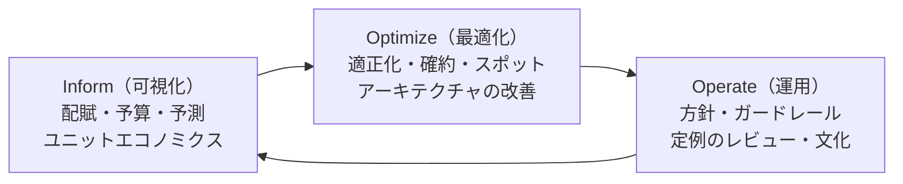

# 10.6 クラウドコスト管理（FinOps）

> クラウドの請求書は、エンジニアリングの意思決定の記録です。インスタンスの種類を選ぶとき、ログのレベルを決めるとき、サービスを別の AZ に置くとき、エンジニアは毎日お金を使う判断をしています。自社のデータセンターなら購買部門が止めてくれた支出も、クラウドでは API の呼び出し一つで始まります。この章では、クラウドの費用の構造と料金モデルを理解し、確約利用割引やスポットの損益を計算し、費用を「誰の・何のための」ものか見える化して、事業の価値に見合った使い方を組織で続ける FinOps の実践を学びます。

| 項目 | 内容 |
|---|---|
| 学習時間の目安 | 本文 3.5h ＋ 演習 4h |
| 前提となる章 | [10.1 クラウドコンピューティングとIaC](../01-cloud-and-iac/README.md)、[10.2 コンテナオーケストレーションとKubernetes](../02-containers-and-kubernetes/README.md)、[10.4 オブザーバビリティ](../04-observability/README.md)（監視の費用） |
| 演習 | [exercises/](exercises/)（Python） |
| キーワード | FinOps, Inform・Optimize・Operate, オンデマンド, 確約利用割引, リザーブドインスタンス, Savings Plans, スポット, 損益分岐, カバー率, 利用率, タグ, 配賦, ショーバック, チャージバック, ユニットエコノミクス, 適正化, データ転送料, 異常検知, 為替リスク |

## この章のゴール

- [ ] クラウドの費用の構造（計算・ストレージ・データ転送・マネージドサービスの割増・サポート・ライセンス・監視）を説明し、請求の主な要因を特定できる
- [ ] オンデマンド・確約利用割引・スポットを比較し、損益分岐・確約する量・中断を考慮したスポットの費用を計算できる
- [ ] FinOps の原則とライフサイクル（Inform・Optimize・Operate）を説明し、タグ付け・共有費用の配賦・ユニットエコノミクスの仕組みを設計できる
- [ ] 主な最適化の手段を、効果・手間・リスクで優先順位付けし、正しい順序（捨てる → 止める → 適正化する → 確約する）で進められる
- [ ] 予算・アラート・異常検知とガードレールで、費用の変化を早期に捉える運用を設計できる
- [ ] アーキテクチャの選択、信頼性の水準、AI・GPU、為替が費用に与える影響を説明できる

## なぜ学ぶのか

SaaS 企業にとって、クラウドの費用の多くは **売上原価（COGS）** であり、粗利益率を直接左右します。粗利益率は、投資家が企業の価値を評価する際の重要な指標の一つです（→ [14.3 事業と財務のリテラシー](../../14-cto/03-business-and-finance/README.md)）。[10.1](../01-cloud-and-iac/README.md) で触れた a16z の論考（2021 年）が議論を呼んだのも、規模が大きくなった企業では、クラウドの費用が利益率を大きく圧迫しうると指摘したからでした。

クラウドの費用の特徴は、**意思決定が分散していて、結果が遅れて見える** ことです。

- 費用の大半を決めるのは、エンジニアが日々選ぶインスタンスの種類、ログの量、データの置き場所、通信の経路です。購買の承認を経ずに、数分で月数十万円の支出が始まります。
- 請求は月単位で、しかも費目が細かく分かれているので、「何が増えたのか」がすぐには分かりません。オートスケールの設定ミス、止め忘れた GPU インスタンス、本番で出力され続けたデバッグログは、翌月の請求書で初めて気づかれることがあります。
- 日本企業には為替の問題もあります。多くのクラウドサービスの価格はドル建てで決まっており、2022 年初めに 1 ドル 115 円前後だった為替は、2024 年には一時 160 円前後まで円安が進みました。月 10 万ドルの利用なら、使い方が同じでも、円での支払いは 1,150 万円から 1,600 万円へ約 4 割増えます。

費用の管理は、経理や購買部門だけでは実行できず、エンジニアだけでも優先順位を決められません。**エンジニアリング・財務・事業の部門が同じ数字を見て、事業の価値に基づいて判断する** ための実践が FinOps です。

## 1. クラウドの費用の構造

| 費目 | 課金の単位の例 | 見落としやすい点 |
|---|---|---|
| 計算（仮想マシン・コンテナ・関数） | 秒・時間単位の稼働、関数はリクエスト数と「実行時間 × メモリ」 | 使っていない時間（夜間・休日の開発環境）も課金される。requests の過大な見積もり（→ [10.2](../02-containers-and-kubernetes/README.md)） |
| ストレージ | GB・月、リクエスト数（読み書きの回数） | スナップショットや古いバックアップが積み上がる。アーカイブ向けの安いクラスには最低保存期間や取り出しの料金がある |
| データ転送 | GB 単位。インターネットへの送信（egress）は段階料金 | 受信は無料のことが多いが、送信・リージョン間・（事業者によっては）AZ 間の通信は有料。NAT ゲートウェイは通過するデータ量にも課金される |
| マネージドサービスの割増 | サービスごと | 同じ性能の仮想マシンより高いが、運用の人件費を買っている（→ [10.1](../01-cloud-and-iac/README.md)）。割増が見合っているかを時々確かめる |
| サポートプラン | 利用額に対する割合などで決まるものが多い | 利用額に比例して増える |
| ライセンス | OS・DB・商用ソフトウェア | 持ち込みライセンスの条件、コア数の数え方 |
| 監視・ログ | 取り込んだデータ量・保存期間・系列数 | 本番でのデバッグログ、高いカーディナリティのメトリクス（→ [10.4](../04-observability/README.md)） |
| AI・GPU | GPU インスタンスの時間、生成 AI の API のトークン数 | 単価が高く、止め忘れや非効率な使い方の影響が大きい（→ [12.5](../../12-data-and-ai/05-mlops-llmops/README.md)） |
| その他の「見えない」費用 | 公開 IPv4 アドレス、ロードバランサの時間料金、キーの管理など | AWS は 2024 年から、使用中のものも含むすべての公開 IPv4 アドレスに時間単位の料金をかけている。小さな単価も数が増えると効く |

段階料金（使うほど単価が下がる）は、データ転送やストレージでよく使われます。演習 1 で計算します（単価は架空です）。

```python
import math
from cloudcost import tiered_cost

egress = [(10_000, 15.0), (50_000, 12.0), (math.inf, 10.0)]   # GB あたりの円（架空の単価）
for gb in (5_000, 30_000, 120_000):
    print(f"{gb:>7} GB → {tiered_cost(gb, egress):>12,.0f} 円（平均 {tiered_cost(gb, egress) / gb:.2f} 円/GB）")
```

```text
   5000 GB →       75,000 円（平均 15.00 円/GB）
  30000 GB →      390,000 円（平均 13.00 円/GB）
 120000 GB →    1,330,000 円（平均 11.08 円/GB）
```

各段の単価は、その段に入る量にだけ掛かります。「12 万 GB なら全量が 10 円」ではありません。見積もりでこれを誤ると、数十 % ずれます。

## 2. 料金モデル

### 2.1 3 つの買い方

| モデル | 仕組み | 向いている使い方 | 主なサービス名（2026 年時点） |
|---|---|---|---|
| オンデマンド | 使った分だけ払う。いつでも止められる | 変動する負荷、短期間、実験 | 各社の通常料金 |
| 確約利用割引 | 1 年や 3 年の期間、一定の利用（台数や 1 時間あたりの金額）を約束する代わりに割り引く | 常に動いている安定した負荷（ベースライン） | AWS の Savings Plans・リザーブドインスタンス、Google Cloud の確約利用割引、Azure の予約・コンピューティング向け節約プラン |
| スポット（余剰の容量） | 事業者の余った容量を大幅な割引で使う。事業者の都合で中断される | 中断されてもやり直せる処理（バッチ、CI、ステートレスなワーカー） | AWS のスポットインスタンス（2 分前に通知）、Google Cloud の Spot VM と Azure の Spot VM（少なくとも 30 秒前に通知） |

割引の率や条件（前払いの有無、対象の範囲、途中での変更の可否、Google Cloud の継続利用割引のような自動の割引）は、事業者とサービスによって異なり、頻繁に変わります。**実際の購入の前に、必ず公式の料金ページと契約条件を確認してください。** 以下の計算の数値はすべて架空です。

### 2.2 確約の損益分岐

確約は、使っても使わなくても毎時間払います。オンデマンドは使った時間だけ払います。したがって、稼働率 u で「u × オンデマンドの単価 = 確約の単価」となる u が損益分岐点です。

```python
from cloudcost import breakeven_utilization, commitment_savings

od, committed = 100, 62          # 1 時間あたりの円（架空）。確約は 38% 引き
print(breakeven_utilization(od, committed))
for u in (1.0, 0.8, 0.62, 0.5):
    print(f"稼働率 {u:.0%}: 月 {commitment_savings(od, committed, u):>8,.0f} 円")
```

```text
0.62
稼働率 100%: 月   27,740 円
稼働率 80%: 月   13,140 円
稼働率 62%: 月        0 円
稼働率 50%: 月   -8,760 円
```

38% 引きの確約は、その容量を 62% 以上の時間使うなら得、それ未満なら損です。3 年の確約は割引が大きい一方で、アーキテクチャの変更（コンテナやサーバーレスへの移行、別の CPU アーキテクチャへの移行）で使わなくなる危険も大きくなります。インスタンスの種類に縛られない柔軟な確約を選ぶ、一度に全部を買わずに時期をずらして少しずつ買う（満期も分散する）、といった工夫でリスクを抑えます。

### 2.3 確約する量を決める

実際の負荷は時間帯や曜日で変動します。「いちばん少ないときの量」だけ確約すれば無駄はありませんが、節約も小さくなります。「平均」や「ピーク」で確約すると、使わない時間の分を払うことになります。演習 5 で、1 時間ごとの使用量から最適な確約の量を求めます。

```python
from cloudcost import commitment_cost, coverage_and_utilization, optimal_commitment

# 4 週間の 1 時間ごとの台数: 夜 20 台、平日の昼 60 台、朝夕 40 台。週末の昼 30 台・朝夕 25 台
usage = []
for day in range(28):
    weekend = day % 7 in (5, 6)
    for hour in range(24):
        if 9 <= hour < 21:
            usage.append(30 if weekend else 60)
        elif 7 <= hour < 9 or 21 <= hour < 23:
            usage.append(25 if weekend else 40)
        else:
            usage.append(20)

od, cm = 100, 60                 # 1 台・1 時間あたりの円（架空）。確約は 40% 引き
base = commitment_cost(usage, 0, od, cm)
print("確約  費用（4週間）  節約率  カバー率  利用率")
for level in (0, 20, 25, 30, 40, 60):
    cost = commitment_cost(usage, level, od, cm)
    coverage, utilization = coverage_and_utilization(usage, level)
    print(f"{level:>4}  {cost:>12,.0f}  {1 - cost / base:>6.1%}  {coverage:>7.1%}  {utilization:>6.1%}")
print(optimal_commitment(usage, od, cm))
```

```text
確約  費用（4週間）  節約率  カバー率  利用率
   0     2,576,000    0.0%     0.0%    0.0%
  20     2,038,400   20.9%    52.2%  100.0%
  25     2,016,000   21.7%    60.9%   93.3%
  30     2,009,600   22.0%    68.9%   88.1%
  40     2,092,800   18.8%    81.4%   78.0%
  60     2,419,200    6.1%   100.0%   63.9%
(30.0, 566400.0)
```

最適なのは 30 台で、そのときの確約の **利用率は 88%** です。利用率 100%（最低の 20 台だけ確約）は、無駄がないように見えて、最適ではありません。理由は、確約を 1 台増やしたときの損得を考えると分かります。追加の 1 台が使われる時間の割合を p とすると、その 1 台の確約は「毎時間 60 円払う」代わりに「p の時間だけオンデマンドの 100 円を節約する」ので、**p > 60/100 = 0.6 である限り、増やす価値があります**。この例では、26〜30 台目は 62% の時間使われるので確約すべきで、31 台目以降は 48% しか使われないので確約すべきではありません。在庫理論の「新聞売り子問題」と同じ構造です。

FinOps では、確約について 2 つの指標を追います。

- **カバー率**: 使用量のうち確約でまかなえた割合。低すぎれば割引を取り逃している。
- **利用率**: 買った確約のうち実際に使った割合。低すぎれば無駄な確約を買っている。

どちらも 100% が目標ではなく、負荷の形と単価の比から決まる最適な水準があります。

### 2.4 スポットの使いどころ

スポットは大幅に安い代わりに中断されます。中断の影響は、**処理を途中から再開できるか** で大きく変わります。演習 2 では、中断がランダムに（ポアソン過程で）起き、中断されたら直前のチェックポイントからやり直すモデルで、期待実行時間を計算します。

```python
from cloudcost import expected_runtime, spot_vs_on_demand

# 24 時間のバッチ。平均 10 時間に 1 回中断され、再開の準備に 15 分かかる。スポットは 70% 引き（架空）
for ckpt in (None, 4, 1):
    runtime = expected_runtime(24, 0.1, 0.25, ckpt)
    spot, od = spot_vs_on_demand(24, 100, 30, 0.1, 0.25, ckpt)
    label = "なし" if ckpt is None else f"{ckpt} 時間ごと"
    print(f"チェックポイント {label:8}: 期待実行時間 {runtime:6.1f} 時間、スポット {spot:7,.0f} 円 / オンデマンド {od:,} 円")
```

```text
チェックポイント なし      : 期待実行時間  102.7 時間、スポット   3,082 円 / オンデマンド 2,400 円
チェックポイント 4 時間ごと  : 期待実行時間   30.2 時間、スポット     907 円 / オンデマンド 2,400 円
チェックポイント 1 時間ごと  : 期待実行時間   25.9 時間、スポット     776 円 / オンデマンド 2,400 円
```

チェックポイントのない 24 時間の処理は、平均 10 時間に 1 回の中断で何度もやり直しになり、期待実行時間は 100 時間を超えて、70% 引きでもオンデマンドより高くつきます。長さ w の仕事を中断なしで終える確率は e^(−λw) と指数関数的に小さくなるからです。チェックポイントを取れば、同じスポットで 6〜7 割安くなります。スポットは次の条件を満たす処理に向いています。

- 処理を小さく分割できる、または途中の状態を保存して再開できる（バッチ、機械学習の学習、CI のジョブ、キューのワーカー）
- 中断の通知を受けて、処理中の仕事を安全に返せる（グレースフルシャットダウン、→ [10.2](../02-containers-and-kubernetes/README.md)）
- 複数のインスタンスの種類や AZ に分散して、同時に中断される危険を下げられる
- 最低限の容量はオンデマンドや確約で持ち、上乗せ分をスポットで賄える

## 3. FinOps とは

**FinOps** は、エンジニアリング・財務・事業の部門が協力して、クラウド（や SaaS・データセンターなどのテクノロジー）への支出から得る事業の価値を最大化するための、運用の枠組みと文化の実践です。Linux Foundation 傘下の FinOps Foundation が、フレームワークと用語を整備しています。

フレームワークは、次のような原則を掲げています（2026 年時点の正確な表現は公式サイトで確認してください）。

1. チームは協力する必要がある
2. 技術の意思決定は事業の価値に基づく
3. 誰もが自分の技術の利用に責任を持つ
4. FinOps のデータは、アクセスしやすく、タイムリーで、正確であるべき
5. FinOps は中央のチームが推進する
6. クラウドの変動費のモデルを活用する

実践は、次の 3 つの段階を繰り返すライフサイクルとして描かれます。



- **Inform**: 誰が何にいくら使っているかを、正確に、タイムリーに見えるようにする。配賦・予算・予測・ユニットエコノミクス。
- **Optimize**: 見えた無駄を減らし、料金モデルを最適化する。
- **Operate**: 方針・自動化・定例のレビューで、改善を組織の習慣にする。

成熟度は「Crawl（はう）・Walk（歩く）・Run（走る）」の 3 段階で表され、最初から完璧を目指さず、効果の大きいところから段階的に成熟させることが推奨されています。事業者ごとに違う請求データの形式を揃えるための共通仕様（FOCUS: FinOps Open Cost and Usage Specification）も、2024 年に最初の正式版が公開されています。

## 4. 可視化と配賦（Inform）

### 4.1 タグ付けの戦略

費用を「誰の・どのサービスの・どの環境の」ものか分けるための基本の道具が、リソースに付ける **タグ**（Google Cloud ではラベル）です。

- **必須のタグを少数に絞る**: 例えば `team`（所有チーム）、`env`（prod / stg / dev）、`cost-center`（会計上の部門）、`service`。多すぎると誰も守らない。
- **値の表記を決める**: `prod` と `Prod` と `production` が混在すると、集計で別物になる。許される値を列挙し、キーの大文字・小文字も統一する（多くの事業者でタグのキーは大文字・小文字を区別する）。
- **作成時に強制する**: IaC のモジュールで既定のタグを付け、タグのないリソースの作成をポリシーで拒否する（AWS の SCP やタグポリシー、Azure Policy、Google Cloud の組織ポリシーなど）。後から付けて回るのは、ほぼ不可能に近い。
- **タグの付かない費用を知る**: データ転送・サポート・一部のマネージドサービスの費用など、リソースに付かない費用がある。これは共有費用として配賦する。
- **アカウント（プロジェクト）の構成を第一の配賦の軸にする**: [10.1](../01-cloud-and-iac/README.md) のように、チームや環境ごとにアカウントを分けておけば、タグが漏れても大まかな配賦はできる。

演習 6 で、タグの規約への準拠を監査し、配賦できない費用を報告します。

```python
from tag_audit import EXAMPLE_POLICY, Resource, audit, cost_report

inventory = [
    Resource("i-001", "vm", 120_000, {"team": "payments", "env": "prod", "cost-center": "CC-100"}),
    Resource("db-01", "rds", 300_000, {"Team": "payments", "env": "prod", "cost-center": "CC-100"}),
    Resource("i-003", "vm", 40_000, {"team": "search", "env": "Prod", "cost-center": "CC-200"}),
    Resource("nat-1", "nat", 150_000, {}),
    Resource("i-005", "vm", 30_000, {"team": "search", "env": "dev", "cost-center": "CC-200"}),
]
for rid, problems in audit(inventory, EXAMPLE_POLICY).items():
    print(rid, problems)
report = cost_report(inventory, EXAMPLE_POLICY)
print(f"数の準拠率 {report['compliance_by_count']:.0%}、金額の準拠率 {report['compliance_by_cost']:.0%}")
print(report["by_group"])
```

```text
db-01 ['missing:team (found Team)']
i-003 ['invalid:env=Prod']
nat-1 ['missing:cost-center', 'missing:env', 'missing:team']
数の準拠率 40%、金額の準拠率 23%
{'(未配賦)': 490000, 'payments': 120000, 'search': 30000}
```

リソースの数では 40% が規約を満たしていても、金額では 23% しか配賦できていません。DB や NAT ゲートウェイのような **高価なリソースほどタグが漏れている** と、こうなります。FinOps で追うべきなのは金額ベースの準拠率（配賦できた費用の割合）です。

### 4.2 共有費用の配賦

共有の Kubernetes クラスタ、監視の基盤、ネットワーク、サポート料金のような共有費用は、何らかの基準でチームや顧客に配ります。

| 方法 | 基準 | 長所 | 短所 |
|---|---|---|---|
| 比例配分 | 使用量（CPU 時間、requests、リクエスト数、データ量） | 使った分だけ負担するので公平で、削減の動機になる | 使用量の計測が必要。基準の選び方で結果が変わる |
| 均等配分 | チーム数・サービス数で等分 | 単純 | 使用量と無関係で、不公平感が出る |
| 固定の比率 | 事前に合意した比率（売上・人数など） | 予測しやすい | 実態とずれていく。定期的な見直しが必要 |

演習 3 では、配賦した金額の合計が **必ず請求額と一致する** ように、最大剰余法で円単位に丸めます。

```python
from cloudcost import allocate, unit_cost

shared = 1_000_000                               # 共有の Kubernetes クラスタと監視の月額（円）
cpu_hours = {"search": 5_120, "payments": 2_990, "catalog": 1_890}
print(allocate(shared, cpu_hours))
print(allocate(shared, cpu_hours, "even"))
print(sum(allocate(shared, cpu_hours).values()))
print(unit_cost(12_400_000, 830_000))            # 月のクラウド費用 ÷ 月の注文数 = 注文 1 件あたりの費用
```

```text
{'catalog': 189000, 'payments': 299000, 'search': 512000}
{'catalog': 333334, 'payments': 333333, 'search': 333333}
1000000
14.939759036144578
```

均等配分で 100 万円を 3 等分すると、どうしても 1 円の端数が出ます。それぞれを四捨五入すると合計が請求額と数円ずれ、経理の突き合わせで説明が必要になります。端数の大きいものから 1 円ずつ配れば、合計は常に一致します。Kubernetes の共有クラスタでは、Pod の requests（と実際の使用量）を基準に名前空間やチームへ配賦するのが一般的で、CNCF のプロジェクトである OpenCost のようなツールも使われています。

### 4.3 ショーバックとチャージバック

- **ショーバック（showback）**: 各チームに「あなたたちの費用はこれだけ」と見せる。予算上の負担は移さない。
- **チャージバック（chargeback）**: 各チームや事業部の予算・損益に、実際に費用を付け替える。

チャージバックは当事者意識を強く生みますが、配賦の正確さへの要求が高く、配賦の基準をめぐる社内の議論も増えます。多くの組織はショーバックから始め、配賦の精度が上がってからチャージバックに進みます。部門別の管理会計の扱いは、財務・経理部門と設計してください。

### 4.4 ユニットエコノミクス

総額だけを見ていると、「事業が伸びて費用が増えた」のか「非効率で費用が増えた」のか区別できません。**事業の単位あたりの費用**（注文 1 件あたり、アクティブな顧客 1 社あたり、API 呼び出し 100 万回あたり、処理した動画 1 時間あたり）を追うと、効率の変化が見えます。上の例では、注文 1 件あたり約 15 円です。

- 総額が増えていても、単位あたりの費用が下がっていれば、規模の経済が効いている健全な成長。
- 総額が横ばいでも、単位あたりの費用が上がっていれば、効率が悪化している。
- 単位あたりの費用を、顧客 1 社あたりの売上と比べれば、価格設定や粗利益率の議論に直結する（→ [14.3](../../14-cto/03-business-and-finance/README.md)）。

「どの単位で測るか」は、事業の価値の単位（顧客が対価を払っているもの）に合わせて選びます。

## 5. 最適化のレバー（Optimize）

主な手段を、効果・手間・リスクで整理します。

| 手段 | 効果 | 手間 | リスク・注意 |
|---|---|---|---|
| 不要なリソースの削除（つながっていないディスク、古いスナップショット、使われていないロードバランサや IP アドレス、放置された検証環境） | 中 | 小 | 所有者の確認。消してよいかの判断にタグが要る |
| 非本番環境のスケジュール停止 | 中〜大 | 小 | 平日の 12 時間だけ動かせば、稼働時間は 60/168 ≈ 36%（約 64% の削減） |
| 適正化（ライトサイジング） | 大 | 中 | CPU は分位点、メモリは最大値で判断する。性能の検証が必要 |
| 自動スケーリング | 大 | 中 | 最小台数と、スケールの遅れ（→ [10.2](../02-containers-and-kubernetes/README.md)） |
| ストレージの階層化・ライフサイクルの設定 | 中 | 小 | アーカイブ向けのクラスは、最低保存期間・取り出しの料金と時間に注意 |
| データ転送の最適化 | 中〜大 | 中 | 下記。可用性とのトレードオフがある |
| 確約利用割引 | 大 | 小 | 適正化の **後に** 行う。アーキテクチャの変更で使わなくなる危険 |
| スポット | 大 | 中 | 中断に耐える処理に限る |
| 新しい世代・別の CPU アーキテクチャ（ARM など）への移行 | 中 | 中 | 事業者は ARM ベースのインスタンスの価格性能比の良さを公称している。互換性と性能の検証が必要 |
| ログ・メトリクスの削減 | 中 | 小〜中 | → [10.4](../04-observability/README.md) の費用の管理 |

### 5.1 正しい順序

最適化には順序があります。**捨てる → 止める → 適正化する → 確約する** です。適正化の前に確約を買うと、過大なインスタンスという無駄に 1〜3 年縛られます。止められる開発環境を確約で賄うのも同じ誤りです。確約は、無駄を取り除いた後に残る、安定したベースラインにだけ使います。

### 5.2 適正化（ライトサイジング）

演習 4 では、使用量の時系列から、要件を満たす最も安いインスタンスタイプを選びます。

```python
import random
from cloudcost import InstanceType, monthly_savings, rightsize

catalog = [
    InstanceType("gp.large", 2, 8, 14), InstanceType("gp.xlarge", 4, 16, 28), InstanceType("gp.2xlarge", 8, 32, 56),
    InstanceType("cpu.xlarge", 4, 8, 24), InstanceType("cpu.2xlarge", 8, 16, 48),
    InstanceType("mem.large", 2, 16, 18), InstanceType("mem.xlarge", 4, 32, 36),
]
rng = random.Random(606)
cpu = [max(0.1, rng.gauss(1.0, 0.3)) for _ in range(24 * 14)]    # 2 週間の 1 時間ごとの使用 vCPU
mem = [rng.uniform(8.5, 10.0) for _ in range(24 * 14)]           # 使用メモリ（GiB）
current = catalog[2]                                              # 今は gp.2xlarge（8 vCPU・32 GiB）を 10 台
recommended = rightsize(cpu, mem, catalog)
print(recommended.name, f"月 {monthly_savings(current, recommended, count=10):,.0f} 円の節約")
```

```text
mem.large 月 277,400 円の節約
```

CPU は p95 に 20% の余裕を足して約 1.8 vCPU、メモリは最大値に 20% を足して約 12 GiB が必要なので、2 vCPU・16 GiB のメモリ最適化型が最安になります。**CPU は一時的に足りなくても遅くなるだけですが、メモリは一瞬でも足りなければプロセスが強制終了される** ので、メモリは分位点ではなく最大値で見ます。適正化の提案は、観測期間（月末の締めや季節の山を含むか）と、性能への影響の検証を経てから適用します。

### 5.3 データ転送の最適化

データ転送の費用は、アーキテクチャ図には現れにくい一方で、請求の大きな部分を占めることがあります。

- **オブジェクトストレージへの通信を NAT ゲートウェイに通さない**: プライベートなサブネットから S3 などへの通信が NAT ゲートウェイを通ると、処理したデータ量に料金がかかる。AWS の S3 や DynamoDB には、追加料金のかからないゲートウェイ型の VPC エンドポイントがある（他のサービスのインターフェイス型エンドポイントは有料なので、量と料金を比べて選ぶ）。
- **AZ をまたぐ通信を減らす**: マイクロサービス間の通信が AZ をまたぐたびに料金がかかる事業者では、同じ AZ 内の相手を優先する経路制御（Kubernetes のトポロジーを考慮したルーティングなど）で費用を減らせる。ただし、1 つの AZ に偏ると AZ 障害の影響が大きくなるので、可用性とのトレードオフとして判断する。
- **インターネットへの配信は CDN を通す**: キャッシュで元のサーバーからの送信量を減らし、CDN の段階料金を活用する。
- **圧縮と、不要な複製の削減**: リージョン間の複製や、大きなデータの定期的な全件転送を見直す。

### 5.4 アーキテクチャによる最適化

最大の節約は、しばしば設定ではなく設計から生まれます。キャッシュで DB への問い合わせを減らす、細かい処理をまとめてバッチにする、データの保存形式（列指向、圧縮）を見直す、処理の頻度を必要十分にする、といった改善は、インスタンスの単価の交渉よりも大きな効果を持ちます（→ [9.5](../../09-architecture/05-scalability-and-performance/README.md)）。

## 6. 予算・アラート・異常検知（Operate）

- **予算と予測**: チーム・サービス・アカウントごとに予算を設定し、実績と月末の予測がしきい値（例: 予算の 80%、100%、予測が予算を超えた時点）に達したら所有者に通知する。
- **異常検知**: 日ごとの費用を、サービスやチームの単位で過去の傾向と比べ、急な変化を検知する。事業者の異常検知の機能もある。原理は単純で、例えば直近の平均と標準偏差からのずれを見る。

```python
import statistics

# ある事業部の 1 日あたりのクラウド費用（千円、架空）。最終日にログの設定ミスで急増した
daily = [412, 405, 398, 420, 415, 401, 409, 418, 404, 411, 399, 415, 407, 690]
history, today = daily[-8:-1], daily[-1]          # 直近 7 日を基準にする
mean, sd = statistics.fmean(history), statistics.stdev(history)
z = (today - mean) / sd
print(f"平均 {mean:.1f}、標準偏差 {sd:.1f}、今日 {today} → z = {z:.1f}")
print("異常" if z > 3 and today - mean > 50 else "正常")   # 率（z）と絶対額の両方で判定する
```

```text
平均 409.0、標準偏差 6.5、今日 690 → z = 43.5
異常
```

実際の費用には曜日や月末の周期があるので、同じ曜日との比較や季節性を考慮した予測と組み合わせます。**率だけで判定すると、ごく小さな費用の変動で誤報が出る** ので、絶対額の条件も併用します。異常を検知したら、誰が調べ、何を止めてよいかを事前に決めておきます（→ [10.5](../05-incident-management/README.md) のように、費用の異常もインシデントとして扱う組織もあります）。

- **ガードレール**: 検証用アカウントの予算上限と自動停止、高価なインスタンスの種類やリージョンの利用の制限（SCP など）、サービスクォータの見直し。
- **変更の時点で費用を見る**: IaC の差分から費用の変化を見積もるツールを CI に組み込み、プルリクエストで「この変更で月 +30 万円」と見えるようにする。事後の請求書ではなく、判断の時点で費用が見えることが、最も効果の大きい FinOps の仕組みです。
- **定例のレビュー**: 月に 1 回、チームごとの費用・ユニットコスト・確約のカバー率と利用率・最適化の進捗を、エンジニアリングと財務が一緒に確認する。

## 7. アーキテクチャ・信頼性・為替と費用

### 7.1 サーバーレス・コンテナ・仮想マシン

料金の形が違うので、損益分岐があります。関数実行のサービスはリクエストと実行時間に比例し、常時稼働のコンテナや仮想マシンは使っていない時間にも課金されます（単価は架空です）。

```python
def faas_monthly(requests, ms=200, gb=0.5, per_million=30.0, per_gb_second=0.0025):
    """関数実行サービスの月額（円、架空の単価）: リクエスト料金 + 実行時間 × メモリの料金"""
    return requests / 1_000_000 * per_million + requests * ms / 1000 * gb * per_gb_second

container_monthly = 2 * 6.0 * 730      # 常時 2 タスク（冗長化のため最低 2）、1 タスク 1 時間 6 円（架空）
print(f"コンテナ（常時稼働）: {container_monthly:,.0f} 円/月")
for requests in (1_000_000, 10_000_000, 30_000_000, 100_000_000):
    print(f"{requests:>11,} 回/月: 関数 {faas_monthly(requests):>8,.0f} 円")
print(f"損益分岐: 約 {container_monthly / faas_monthly(1):,.0f} 回/月")
```

```text
コンテナ（常時稼働）: 8,760 円/月
  1,000,000 回/月: 関数      280 円
 10,000,000 回/月: 関数    2,800 円
 30,000,000 回/月: 関数    8,400 円
100,000,000 回/月: 関数   28,000 円
損益分岐: 約 31,285,714 回/月
```

この架空の条件では、月約 3,100 万回（平均 12 回/秒ほど）を超えると常時稼働のコンテナの方が安くなります。ただし、比べるべきは請求額だけではありません。サーバーレスは運用の手間（パッチ、スケーリング、容量計画）を減らし、負荷がゼロの時間の多い処理や、急激な負荷の変動に強い一方、実行時間の制限やコールドスタートがあります。**インフラの費用と、運用に必要な人の時間の合計** で比べましょう。

### 7.2 信頼性と費用

信頼性の水準は、費用の水準を決めます。マルチ AZ は容量の予備と AZ 間の通信の費用を、マルチリージョンはほぼ二重のインフラとリージョン間の複製の費用を伴います（→ [10.3](../03-reliability-engineering/README.md)）。すべてのサービスに最高の信頼性を持たせるのではなく、SLO と事業への影響から水準を決めることが、費用の最適化でもあります。逆に、費用の削減が信頼性を損なっていないか（予備の容量を削りすぎていないか、単一の AZ に寄せすぎていないか）も、同時に確認します。

### 7.3 AI と GPU

GPU インスタンスや生成 AI の API は単価が高く、利用の仕方で費用が桁違いに変わります。GPU の利用率、推論のバッチ化、モデルの大きさの選択、キャッシュ、トークン数の管理といった論点は [12.5 AI システムの本番運用](../../12-data-and-ai/05-mlops-llmops/README.md) で扱います。GPU は供給が限られることもあり、確約や予約の判断も通常のインスタンスより難しくなります。

### 7.4 為替と日本企業

ドル建てのクラウドの費用は、使い方が変わらなくても為替で円建ての支払いが変わります。

- **予算は想定レートを明示して立てる**: 「1 ドル何円で計算したか」を予算の前提として書き、実績との差を「利用量の差」と「為替の差」に分けて報告する。そうしないと、エンジニアリングの努力による削減が円安で見えなくなる。
- **為替の変動への備え**: 支払いの時期と金額がある程度読めるなら、為替予約などの手段がある。円建ての請求や、国内の販売代理店を通じた契約を選べる場合もある（条件は 2026 年時点の契約内容を確認）。
- **会計と税務**: 前払いの確約（一括前払い）の会計処理や、国外の事業者との取引の税務上の扱いは、**具体的な判断は会計士・税理士などの専門家に確認してください**。

## よくある落とし穴

1. **適正化の前に確約を買う**。過大なインスタンスという無駄に 1〜3 年縛られる。捨てる → 止める → 適正化する → 確約する、の順で進める。
2. **確約の利用率 100% を目標にする**。無駄はないが節約も小さい。最適な確約の量は負荷の形と単価の比で決まり、利用率は 100% より低くなるのが普通。カバー率と利用率の両方を見る。
3. **長いバッチをチェックポイントなしでスポットに載せる**。やり直しの時間が指数関数的に増え、オンデマンドより高くつくことがある。処理を分割するか、状態を保存して再開できるようにする。
4. **タグを後から付けようとする**。何千ものリソースの所有者を後から調べるのは現実的でない。作成時に IaC とポリシーで強制し、金額ベースの準拠率を追う。
5. **総額だけを見て一喜一憂する**。事業の成長による増加と、非効率による増加を区別できない。注文 1 件あたりなどのユニットコストを併せて見る。
6. **データ転送の費用を設計で考えない**。NAT ゲートウェイの処理料金や AZ 間の通信は、アーキテクチャ図に現れないまま請求の大きな部分を占めうる。設計レビューで通信の経路と量を確認する。
7. **費用の削減を 1 回きりのプロジェクトにする**。数か月後には元に戻る。予算・異常検知・定例のレビュー・変更時点での費用の見積もりで、習慣にする。
8. **為替の影響とエンジニアリングの成果を混ぜて報告する**。円安で円建ての費用が増えると、削減の努力が評価されない。想定レートを明示し、利用量の差と為替の差を分けて報告する。

## CTOの視点

1. **クラウドの費用を粗利益率の言葉で語る**。「クラウドの費用が売上の 20% を占め、粗利益率を押し下げている」「注文 1 件あたりの費用を 1 年で 15 円から 10 円に下げる」のように、財務の言葉と事業の単位で目標を設定しましょう。取締役会や投資家は総額より、売上に対する比率とその推移を見ます（→ [14.3](../../14-cto/03-business-and-finance/README.md)、[14.4](../../14-cto/04-executive-communication/README.md)）。
2. **責任を分散し、仕組みを集中させる**。費用の意思決定はエンジニアが日々行うので、各チームが自分の費用を見て責任を持てるように（ショーバック）し、タグの規約・配賦のルール・確約の購入・ツールは中央の FinOps の担当が整備します。確約の購入のような全社で最適化すべき判断を個々のチームに任せると、無駄が生じます。
3. **確約は財務の判断として扱う**。1〜3 年の確約は、数千万円から数億円の支払い義務を伴うことがあり、事業計画・アーキテクチャの方針・為替の見通しと整合させる必要があります。CFO と一緒に、どれだけの割合を確約するか（カバー率の目標）と、アーキテクチャの変更の予定を確認してから購入しましょう。
4. **費用と信頼性・速度のトレードオフを明示する**。「DR 環境を止めれば月 300 万円の削減、ただし RTO は 1 時間から 1 日になる」のように、削減案には失うものを必ず添えさせます。費用の削減の数字だけが報告され、失った信頼性に誰も気づかない状態が、最も危険です。
5. **採用と育成で費用の感覚を育てる**。設計レビューで「このアーキテクチャの月額はいくらか」「負荷が 10 倍になったら費用は何倍になるか」「最も大きな費目は何か」を問い、エンジニアが費用を設計の品質の一部として考える文化を作ります。費用の見積もりを設計書のテンプレートに入れるだけでも、意識は大きく変わります。

## 演習

演習コードは [exercises/cloudcost.py](exercises/cloudcost.py) と [exercises/tag_audit.py](exercises/tag_audit.py) にあります。関数の docstring に仕様が書いてあるので、`raise NotImplementedError(...)` を実装に置き換えてください。解答例は [solutions/](solutions/) にあります。演習の単価はすべて架空です。

```bash
python3 tools/check.py 10.6        # リポジトリのルートで実行
python3 tools/check.py -v 10.6     # 詳しい出力
```

| # | 難易度 | 内容 | 対象ファイル / 関数 |
|---|---|---|---|
| 1 | ★☆☆ | 段階的な料金（データ転送など）の計算 | `cloudcost.py`: `tiered_cost` |
| 2 | ★★☆ | スポットの中断とやり直しを考慮した期待実行時間と費用（チェックポイントの効果） | `cloudcost.py`: `expected_runtime`, `spot_vs_on_demand` |
| 3 | ★★☆ | 共有費用の配賦（比例・均等・重み付き、最大剰余法で合計を一致させる）と単位あたりの費用 | `cloudcost.py`: `allocate`, `unit_cost` |
| 4 | ★★☆ | 使用率の分布に基づく適正化（CPU は分位点、メモリは最大値） | `cloudcost.py`: `rightsize`, `monthly_savings` |
| 5 | ★★★ | 確約利用割引の損益分岐、カバー率と利用率、費用を最小にする確約の量 | `cloudcost.py`: `breakeven_utilization`, `commitment_savings`, `commitment_cost`, `coverage_and_utilization`, `optimal_commitment` |
| 6 | ★☆☆ | タグの規約の監査と、金額ベースの準拠率・未配賦の費用 | `tag_audit.py`: `check_resource`, `audit`, `cost_report` |
| 7 | ★★☆ | 記述: 月次の請求のレビュー（下記） | — |

演習 2 のテストは、公式の結果を乱数によるシミュレーションと比べて確かめます。演習 5 のテストは、ランダムな使用量の系列で総当たりの答えと一致するかを確かめます。

### 演習 7（記述）: 月次の請求のレビュー

あなたは、顧客 400 社・月の売上 5,000 万円の BtoB SaaS 企業の CTO です。先月のクラウドの請求は 1,000 万円で、CEO から「売上の 2 割はおかしい。どうにかならないか」と相談されました。請求の内訳と、チームから聞き取った状況は次の通りです（数値は架空）。

| 費目 | 月額（万円） | 状況 |
|---|---|---|
| 仮想マシン（すべてオンデマンド） | 380 | 本番 60 台（平均 CPU 使用率 12%、メモリ使用率 25%）、開発・検証 40 台（24 時間稼働） |
| マネージド DB | 160 | 本番（マルチ AZ）と、開発用に本番と同じ大きさの複製が 3 つ（24 時間稼働） |
| ログ（取り込みと保存） | 110 | 本番で DEBUG レベルのログを出力。全ログを 1 年間、検索できる状態で保存 |
| NAT ゲートウェイ | 90 | 処理量の 8 割は、プライベートサブネットからオブジェクトストレージへの通信 |
| オブジェクトストレージ | 70 | すべて標準のクラス。データの 9 割は 1 年以上読まれていない |
| AZ 間のデータ転送 | 60 | マイクロサービス間の通信がランダムに AZ をまたいでいる |
| ブロックストレージ | 50 | うち 15 万円は、どのサーバーにもつながっていないボリューム |
| サポート | 40 | 利用額に比例 |
| その他 | 40 | — |

次の内容を含む計画を書いてください。

1. 削減の施策の一覧（概算の削減額・手間・リスク）と、実施の順序とその理由
2. 施策の後の費用の見込みと、売上に対する比率・顧客 1 社あたりの費用の変化
3. 再発を防ぐための仕組み（Operate）
4. CEO への 5 行程度の報告

<details>
<summary>解答例</summary>

**1. 施策と順序**（削減額は仮定を置いた概算）

| 順 | 施策 | 概算の削減（万円/月） | 手間 | リスク・注意 |
|---|---|---|---|---|
| 1 | つながっていないボリュームの削除（スナップショットを取ってから） | 15 | 小 | 所有者の確認 |
| 2 | S3 などへの通信をゲートウェイ型の VPC エンドポイント経由に変更 | 60〜70（NAT の処理料金の大半） | 小 | 経路の変更のテスト |
| 3 | 本番のログを INFO 以上にし、保存を階層化（直近 30 日だけ検索可能、以降は安価な保存） | 50〜70 | 小〜中 | 障害調査に必要なログの確認 |
| 4 | 開発・検証の VM と DB を平日の昼だけ稼働（稼働時間は約 36%）。開発用 DB は小さくし、1 つに集約 | VM で 90 前後（40 台分の費用を約 150 万と仮定し、その 64%）、DB で 60 前後 | 中 | 開発者の働き方との調整、自動起動の仕組み |
| 5 | オブジェクトストレージのライフサイクルの設定（古いデータを低頻度・アーカイブ向けのクラスへ） | 40 前後 | 小 | 最低保存期間と取り出しの料金・時間 |
| 6 | 本番の VM の適正化（CPU 12%・メモリ 25% なら半分以下の大きさで足りる可能性） | 100 前後（本番 VM を 230 万と仮定し、その半分弱） | 中 | 性能の検証、段階的な適用 |
| 7 | 同じ AZ を優先する経路制御 | 20〜30 | 中 | AZ への偏りと可用性のトレードオフ |
| 8 | 残った安定したベースライン（本番の VM と DB）に確約利用割引を適用 | 30〜50 | 小 | **適正化の後に**。アーキテクチャの変更の予定を確認し、柔軟な確約を選ぶ |

順序の理由: 手間が小さく確実なもの（削除・経路の変更・ログ）から着手して早く効果を出し、次に止める・小さくする、最後に確約する。適正化の前に確約を買うと、過大な構成に 1〜3 年縛られる。

**2. 見込み**

合計の削減は概算で 450〜550 万円/月（施策の重なりと、サポート料金の連動した減少を含めて見積もりを精査する）。費用は約 450〜550 万円となり、売上に対する比率は 20% から 9〜11% に、顧客 1 社あたりは 2.5 万円から約 1.1〜1.4 万円に下がる見込み。粗利益率は 9〜11 ポイント改善する。

**3. 再発を防ぐ仕組み**

- 必須タグ（team・env・service）を IaC とポリシーで強制し、チームごとのショーバックを毎月共有する。
- 非本番環境の自動停止を標準にし、例外は申請制にする。
- 予算と異常検知の通知を、チームの当番に届くように設定する。
- プルリクエストで IaC の変更による費用の増減を表示する。
- 月次の FinOps レビュー（エンジニアリング・財務）で、ユニットコスト・確約のカバー率と利用率・施策の進捗を確認する。
- ログの出力レベルと保存期間の規約を決める。

**4. CEO への報告**

- クラウドの費用は月 1,000 万円（売上の 20%）。主因は、使われていない容量・止められる開発環境・不要なログとデータ転送の経路で、事業の成長に必要な費用ではない。
- 3 か月で月 450〜550 万円の削減を見込み、売上に対する比率を約 10% に下げる（粗利益率が約 10 ポイント改善）。
- 最初の 1 か月で、リスクの小さい施策により月 150 万円以上を削減する。
- 必要な投資はエンジニア 2 名の 2〜3 か月の工数。信頼性を下げる施策は含まない（AZ の経路制御は可用性への影響を検証してから）。
- 再発を防ぐため、チームごとの費用の可視化と月次のレビューを始め、顧客 1 社あたりの費用を経営の指標として報告する。

採点の観点:

- 不要なボリューム・NAT とエンドポイント・ログ・開発環境の停止・適正化・確約の 6 つを挙げ、「確約は適正化の後」と順序の理由を書けていれば合格ライン。
- 削減額の概算に仮定を明示し、売上比率やユニットコストの変化、信頼性とのトレードオフ（AZ の経路）、再発防止の仕組み、経営向けの簡潔な報告まで書けていれば、CTO として十分な水準です。

</details>

## 理解度チェック

**Q1. クラウドの費用の中で、アーキテクチャ図には現れにくいのに請求の大きな部分を占めうる費目を 3 つ挙げてください。**

<details>
<summary>解答</summary>

- データ転送: インターネットへの送信、リージョン間の通信、事業者によっては AZ 間の通信。
- NAT ゲートウェイの処理料金: 通過するデータ量に比例する。オブジェクトストレージへの大量の通信を NAT 経由にしていると大きくなる。
- ログ・メトリクス: 取り込み量と保存期間、系列数に比例する。本番でのデバッグログや高いカーディナリティのメトリクス。

ほかに、積み上がったスナップショット、つながっていないディスク、公開 IPv4 アドレス、止め忘れた検証環境や GPU インスタンスなども挙げられます。

</details>

**Q2. オンデマンドで 1 時間 100 円のインスタンスに、1 時間 65 円相当の確約利用割引があります。どんな条件なら確約を買うべきですか。**

<details>
<summary>解答</summary>

損益分岐の稼働率は 65 / 100 = 65% です。確約の期間中、そのインスタンス（またはその確約が適用される容量）を 65% を超える時間使い続ける見込みがあるなら買う価値があります。ただし、判断の前に、そのインスタンスが適正な大きさか（適正化の前に買わない）、期間中にアーキテクチャの変更（コンテナやサーバーレスへの移行、CPU アーキテクチャの変更）の予定がないか、柔軟性のある確約を選べるかを確認します。

</details>

**Q3. 確約のカバー率 70%・利用率 88% という報告を受けた財務担当者が「利用率を 100% にすべきだ」と言っています。どう説明しますか。**

<details>
<summary>解答</summary>

利用率を 100% にするには、使用量が最も少ない時間の量まで確約を減らす必要がありますが、そうすると割引を受けられる量が減り、節約額はかえって小さくなります。確約を 1 単位増やす価値があるのは、その 1 単位が使われる時間の割合が「確約の単価 ÷ オンデマンドの単価」を上回るときです。例えば単価の比が 0.6 なら、60% 以上の時間使われる分までは確約した方が得で、その結果として利用率は 100% を下回ります。目標にすべきは利用率そのものではなく、総費用の最小化です。

</details>

**Q4. 24 時間かかるバッチをスポットで動かしたところ、オンデマンドより高くつきました。なぜ起こりうるのか、どう改善するかを説明してください。**

<details>
<summary>解答</summary>

スポットは事業者の都合で中断され、中断されるとチェックポイントがなければ最初からやり直しになります。長さ w の仕事を中断なしで終える確率は e^(−λw) で、w が長いほど指数関数的に小さくなるため、やり直しの回数と時間が急増します（平均 10 時間に 1 回中断される環境では、24 時間の仕事の期待実行時間は 100 時間を超えることがある）。スポットの単価が安くても、実行時間が何倍にもなれば高くつきます。

改善: 処理を小さく分割する、定期的にチェックポイントを保存して途中から再開できるようにする、中断の通知を受けて状態を保存する、複数のインスタンスの種類・AZ に分散する、期限のある処理はオンデマンドと組み合わせる。

</details>

**Q5. 共有費用 100 万円を 3 チームに均等に配賦し、それぞれを四捨五入して 333,333 円としました。何が問題で、どうすべきですか。**

<details>
<summary>解答</summary>

合計が 999,999 円になり、請求額と 1 円ずれます。わずかな差でも、配賦の合計が請求額と一致しないと、経理の突き合わせで説明が必要になり、配賦の仕組みへの信頼を損ないます。最大剰余法（全員に切り捨てた額を配り、残りを端数の大きい順に 1 円ずつ配る）を使えば、合計は常に請求額と一致し、各チームの誤差も 1 円未満に収まります。

</details>

**Q6. 「リソースの 90% にタグが付いている」という報告の問題点を説明してください。**

<details>
<summary>解答</summary>

数の割合と金額の割合は大きく異なることがあります。安価なリソース（小さな VM、バケット）の多くにタグが付いていても、DB・NAT ゲートウェイ・大きなクラスタのような高価なリソースにタグが漏れていれば、配賦できる費用の割合は低くなります。FinOps で追うべきなのは「費用のうち何 % を所有者に配賦できたか」という金額ベースの指標です。さらに、タグが付いていても値の表記ゆれ（prod と Prod）やキーの大文字・小文字の違いがあれば集計で別物になるので、規約への準拠を確認する必要があります。

</details>

**Q7. 総額のクラウド費用が前年比 30% 増えました。これが良いことか悪いことかを判断するには、何を見ればよいですか。**

<details>
<summary>解答</summary>

ユニットエコノミクス（事業の単位あたりの費用）を見ます。例えば注文数が 60% 増えていて、注文 1 件あたりの費用が下がっているなら、規模の経済が効いた健全な増加です。逆に、注文数が 10% しか増えていないのに費用が 30% 増えているなら、効率が悪化しています。あわせて、売上に対するクラウド費用の比率（粗利益率への影響）、為替の影響（ドル建ての費用の円換算の差）、新しい機能や DR 環境の追加のような意図した投資による増加を分けて評価します。

</details>

**Q8. 適正化・確約・スポット・スケジュール停止・不要なリソースの削除を、どの順で進めるべきですか。その理由は。**

<details>
<summary>解答</summary>

基本の順序は「捨てる（不要なリソースの削除）→ 止める（非本番のスケジュール停止）→ 適正化する → 確約する」で、スポットは中断に耐える処理から並行して導入できます。

理由: 確約は 1〜3 年の支払い義務を伴うので、無駄を取り除いた後に残る安定したベースラインにだけ適用すべきだからです。先に確約を買うと、過大な構成や止められたはずの環境に長期間縛られ、後の最適化の効果も消えてしまいます。不要なリソースの削除やスケジュール停止は手間が小さく効果が確実なので、最初に行います。

</details>

## さらに学ぶために

- J.R. Storment, Mike Fuller "Cloud FinOps"（O'Reilly, 第 2 版 2023）— FinOps Foundation の創設に関わった著者による、FinOps の原則・組織・実践の定番書。
- FinOps Foundation の FinOps Framework（公式サイト）— 原則・ライフサイクル・成熟度・役割の定義と、FOCUS 仕様などの一次資料。用語は頻繁に更新されるので、最新版を確認する。
- AWS Well-Architected Framework のコスト最適化の柱（および各社の同様の設計指針）— 費用を設計の品質として扱うための、事業者の公式な設計指針。
- 各クラウド事業者の料金ページと料金計算ツール — 本章の架空の単価ではなく、実際の単価と課金の単位（段階料金、データ転送、確約の条件）を確かめる一次情報。
- AWS Builders' Library や各社の技術ブログにある、データ転送とアーキテクチャの費用に関する記事 — NAT やリージョン間の通信など、設計が費用に与える影響の具体例。
- Andreessen Horowitz の論考 "The Cost of Cloud, a Trillion Dollar Paradox"（Sarah Wang, Martin Casado, 2021）— 大規模な企業にとってのクラウドの費用と利益率の関係を論じ、クラウド回帰の議論のきっかけになった文章。

## まとめ

- クラウドの費用は、計算・ストレージ・データ転送・マネージドサービスの割増・サポート・ライセンス・監視・AI から成り、**多くはエンジニアの日々の設計判断で決まる**。データ転送や NAT、ログのような図に現れない費目に注意する。
- 料金モデルは、オンデマンド・確約・スポット。**確約の損益分岐は単価の比**、最適な確約の量は「使われる時間の割合 > 単価の比」となる水準で、利用率 100% は目標ではない。スポットは中断からやり直せる処理に限る。
- FinOps は、エンジニアリング・財務・事業が同じ数字で判断する実践で、**Inform → Optimize → Operate** を繰り返す。
- タグは作成時に強制し、**金額ベースの準拠率** を追う。共有費用は合計が請求額と一致するように配賦し、ユニットコストで効率を見る。
- 最適化は **捨てる → 止める → 適正化する → 確約する** の順。CPU は分位点、メモリは最大値で適正化し、データ転送は経路の設計で減らす。
- 予算・異常検知・ガードレール・変更時点での費用の見積もり・定例のレビューで、削減を 1 回きりにせず習慣にする。
- アーキテクチャ・信頼性の水準・GPU・為替は費用を大きく左右する。**削減には失うもの（信頼性・速度）を必ず添え**、為替の影響は分けて報告する。
