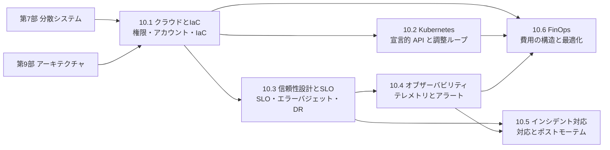

# 第10部 クラウドとSRE

> 優れた設計も、本番で動き続けなければ価値を生みません。この部では、クラウドの上でシステムを構築し、落ちたら立て直し、何が起きているかを見て、障害から学び、費用に見合った使い方を続けるための原理と実践を学びます。IAM の評価器、Terraform 風の plan エンジン、Kubernetes のスケジューラとコントローラ、SLO のアラート、ヒストグラムとトレースの解析器、オンコール表、確約利用割引の最適化を自分で実装しながら、「どこまで信頼できれば十分か」を SLO という数字で判断し、組織で運用し続けられるようになることが目標です。

## この部で身につくこと

- **クラウドを安全に使う**: クラウドの本質・責任共有モデル・リージョンと AZ を理解し、最小権限の IAM、マルチアカウントのランディングゾーン、IaC による再現可能な環境を設計できる。IAM の評価順序と、plan が依存グラフから実行順序と置き換えの連鎖を決める仕組みを実装で説明できる。
- **コンテナの実行基盤を理解する**: Kubernetes の宣言的 API と調整ループ、スケジューラ、ローリングアップデートを実装を通して理解し、requests/limits・probe・PDB の誤設定が障害になる経路を説明できる。Kubernetes を採用すべきでない場面も判断できる。
- **SLO で判断する**: 可用性を依存構造から計算し、利用者の体験に基づく SLI・SLO とエラーバジェットを設計し、多窓・多バーンレートのアラートを実装できる。影響範囲を小さくする設計と、RPO・RTO と費用に基づく DR の選択ができる。
- **システムを観測する**: ログ・メトリクス・トレースを正しく設計し、分位点の集計の落とし穴やカーディナリティの問題を避け、W3C Trace Context とクリティカルパスで遅延の原因を特定できる。人を起こすに値するアラートだけを設計できる。
- **障害に強い組織を作る**: 重大度の定義、持続可能なオンコール、インシデントコマンダーを中心とした対応、ブレームレスなポストモーテム、指標の正しい扱いを実践できる。
- **費用を事業の言葉で管理する**: クラウドの費用の構造と料金モデルを理解し、確約・スポット・適正化を計算に基づいて判断し、タグと配賦とユニットエコノミクスで費用を見える化できる。

## 章の一覧

| 章 | タイトル | 学習時間 | 主な演習 | キーワード |
|---|---|---|---|---|
| 10.1 | [クラウドコンピューティングとIaC](01-cloud-and-iac/README.md) | 本文 4h ＋ 演習 5h | `iam_eval.py`（ワイルドカード照合、条件・明示的拒否・権限境界・SCP を含む IAM ポリシー評価器）・`iac_plan.py`（依存グラフとトポロジカルソート、plan・apply、置き換えの連鎖、create_before_destroy、ドリフト検出）、記述: アカウント構成と権限の設計 | 責任共有モデル, リージョン, AZ, IAM, OIDC フェデレーション, SCP, ランディングゾーン, Terraform, OpenTofu, state, ドリフト, ロックイン, ISMAP |
| 10.2 | [コンテナオーケストレーションとKubernetes](02-containers-and-kubernetes/README.md) | 本文 4h ＋ 演習 5h | `kube_scheduler.py`（数量の解析、フィルタ・スコア・バインド、プリエンプション）・`reconciler.py`（ReplicaSet と Deployment のコントローラ、ローリングアップデート、ロールバック）、記述: マニフェストのレビュー | コントロールプレーン, 調整ループ, Deployment, Service, Gateway API, requests/limits, QoS, probe, PDB, taint, RBAC, GitOps |
| 10.3 | [信頼性設計とSLO](03-reliability-engineering/README.md) | 本文 4h ＋ 演習 4h | `slo_calc.py`（可用性の合成、エラーバジェット、バーンレート、多窓・多バーンレートのアラート）・`dr_planner.py`（DR 戦略の選択、期待損失、予算の配分）、記述: SLO とエラーバジェットポリシー | SRE, トイル, SLI, SLO, SLA, エラーバジェット, バーンレート, セル, シャッフルシャーディング, RPO, RTO, カオスエンジニアリング |
| 10.4 | [オブザーバビリティ](04-observability/README.md) | 本文 4h ＋ 演習 5h | `histo.py`（カウンタの rate、ヒストグラムの分位点と合算）・`logstats.py`（構造化ログから RED メトリクス）・`tracectx.py`（traceparent、自己時間、クリティカルパス）、記述: アラートルールのレビュー | 構造化ログ, Prometheus, PromQL, カーディナリティ, 分位点, 分散トレーシング, OpenTelemetry, RED, USE, アラート疲れ |
| 10.5 | [インシデント対応とポストモーテム](05-incident-management/README.md) | 本文 3.5h ＋ 演習 4h | `incident_metrics.py`（所要時間の分布、SLA のクレジット）・`oncall.py`（フォロー・ザ・サンのカバー範囲、公平な当番表）、記述: チャットの記録からポストモーテムを書く | 重大度, オンコール, インシデントコマンダー, 緩和, ステータスページ, ブレームレス, 寄与要因, MTTR |
| 10.6 | [クラウドコスト管理（FinOps）](06-finops/README.md) | 本文 3.5h ＋ 演習 4h | `cloudcost.py`（段階料金、スポットの期待費用、配賦、適正化、確約の損益分岐と最適な量）・`tag_audit.py`（タグの監査と未配賦の費用）、記述: 月次の請求のレビュー | FinOps, 確約利用割引, スポット, カバー率, 利用率, タグ, 配賦, ユニットエコノミクス, 為替リスク |

合計の目安は、本文 約 23 時間、演習 約 27 時間です。コード演習は `python3 tools/check.py 10` でまとめてテストできます（章を指定するなら `python3 tools/check.py 10.3` のように）。

## 学習の進め方

### 章の順序と依存関係

- **10.1 → 10.2 → 10.3 → 10.4 → 10.5 → 10.6 の順が基本です**。10.1 の「あるべき状態と現在の状態の差を埋める」という IaC の考え方は、10.2 の Kubernetes のコントローラと同じです。10.3 の SLO とエラーバジェットは、10.4 のアラート設計と 10.5 のインシデントの重大度・指標の土台になります。10.6 は、10.1 のアカウント構成とタグ、10.2 の requests とビンパッキング、10.4 の監視の費用を前提にしています。
- **この部の中心は 10.3 です**。時間が限られているなら、10.3 を最初に読み、SLO という共通の言葉を手に入れてから他の章に進んでも構いません。
- **演習にクラウドのアカウントは不要です**。IAM の評価器、架空のクラウド API（`FakeCloud`）、架空のクラスタ（`Cluster`）、分単位の合成データなど、すべて手元の Python だけで動くシミュレーションです。実際のクラウドで試す場合は、無料枠の範囲でも必ず予算のアラートを設定し、試した後はリソースを削除してください（10.6 で学ぶ「止め忘れ」は、学習用のアカウントでも起きます）。
- **前提**: [第7部 分散システム](../07-distributed-systems/README.md)（故障・合意・レプリケーション）と [第9部 アーキテクチャとシステム設計](../09-architecture/README.md)（特に 9.5 のスケーラビリティ）を学んでいると、各章の「なぜ」がよく分かります。[8.4 CI/CD とリリースエンジニアリング](../08-software-engineering/04-ci-cd-and-release/README.md) は、10.1・10.3・10.5 の変更管理と深く関わります。

### つまずきやすい点

- **IAM の評価順序（10.1）**: 「明示的な拒否は常に勝つ」「SCP と権限境界は権限を与えず、上限を決めるだけ」の 2 点が腹落ちするまで、演習 2 のテストのポリシーを読み、結果を予想してから実行してみてください。
- **plan の順序（10.1）と Deployment の不変条件（10.2）**: どちらも「なぜこの順序なら安全か」を問う演習です。テストが通った後に、規則を 1 つ外すとどのテストが落ちるかを試すと、各規則の役割がよく分かります。
- **バーンレートの算数（10.3）**: 「30 日の予算の 2% を 1 時間で消費 = バーンレート 14.4」を、自分で導けるまで繰り返し計算しましょう。検知までの時間（窓 × 閾値 ÷ バーンレート）も同じ考え方で導けます。
- **分位点の扱い（10.4・10.5）**: 「分位点は平均できない」「裾の長い分布では平均が誤解を招く」は、何度でも出てきます。演習で実際に数字がずれるのを確かめることが、最も記憶に残る学び方です。
- **文化の章（10.5）**: ブレームレスなポストモーテムは、知識よりも習慣の問題です。記述演習のポストモーテムを実際に書き、「担当者の不注意」という言葉を使わずに寄与要因を説明できるか試してください。
- **経験者の進め方**: 理解度チェックに答えられる章は、★★★ の演習（plan、Deployment コントローラ、多窓アラート、クリティカルパス、当番表、確約の量）だけ解いて先へ進んで構いません。CTO 準備トラックでは 10.3・10.5・10.6 が必修です。10.1・10.2・10.4 は、少なくとも「なぜ学ぶのか」と「CTOの視点」を読んでおきましょう（[学習ガイド](../00-guide/README.md)）。

## 到達度チェック

この部を修了したと言えるのは、次のことができるときです。

- [ ] サービスモデルごとの責任分担と、リージョン・AZ という障害ドメインを踏まえて、クラウド上の配置を設計し、その理由を説明できる
- [ ] 最小権限・短命な認証情報・OIDC フェデレーション・マルチアカウントによる権限設計を提案し、IAM ポリシーで何が許可されるかを評価の順序に沿って説明できる
- [ ] IaC の state・plan・依存グラフ・置き換えの連鎖・ドリフトを説明し、plan の出力から本番への影響を読み取れる
- [ ] Kubernetes の構成要素と調整ループを説明し、Pending・CrashLoopBackOff・OOMKilled・止まったロールアウトの原因を切り分けられる。Kubernetes を採用すべきかを判断できる
- [ ] 依存構造から可用性を計算し、利用者の体験に基づく SLI・SLO・エラーバジェットポリシーを設計し、バーンレートに基づくアラートを設計できる
- [ ] RPO・RTO・費用・期待損失から DR 戦略を選び、バックアップの復元訓練とカオスエンジニアリングの計画を立てられる
- [ ] 構造化ログ・メトリクス・トレースを設計し、分位点を正しく集計し、クリティカルパスで遅延の原因を特定できる。カーディナリティと監視の費用を管理できる
- [ ] 重大度・オンコール・インシデント対応の役割と流れを設計し、ブレームレスなポストモーテムを書いて、担当と期限のある対策を導ける
- [ ] クラウドの費用の構造を説明し、確約・スポット・適正化を計算で判断し、タグ・配賦・ユニットエコノミクスで費用を事業の言葉で報告できる
- [ ] 第10部の演習のテストがすべて通る（`python3 tools/check.py 10`）

## この部の推薦図書・教材

- Betsy Beyer ほか編『SRE サイトリライアビリティエンジニアリング』（オライリー・ジャパン）と『サイトリライアビリティワークブック』（オライリー・ジャパン）— この部全体の中心となる教材。原書の英語版は Google の SRE のサイトで無料公開されている。10.3〜10.5 の多くの考え方の原典。
- Kief Morris "Infrastructure as Code"（O'Reilly）— 特定のツールに依存しない IaC の原則とパターン。10.1 の延長として。
- 青山真也『Kubernetes 完全ガイド』（インプレス）と Brendan Burns ほか "Kubernetes: Up and Running"（O'Reilly）— Kubernetes のリソースと設計思想を学ぶための定番書。10.2 の延長として。
- Charity Majors ほか『オブザーバビリティ・エンジニアリング』（オライリー・ジャパン）— オブザーバビリティの考え方と、SLO に基づくアラートを体系的に論じた本。10.4 の延長として。
- J.R. Storment, Mike Fuller "Cloud FinOps"（O'Reilly）— FinOps の原則・組織・実践の定番書。10.6 の延長として。
- AWS Well-Architected Framework（および Google Cloud・Azure の同様の設計指針）— 信頼性・セキュリティ・コストの観点から設計を点検するための公式な指針。この部の内容を実際の設計レビューに使うときのチェックリストになる。

## 次に進む

- [第11部 セキュリティ](../11-security/README.md) では、10.1 の IAM を [11.3 認証と認可](../11-security/03-authn-authz/README.md) で一般化し、10.2 のイメージの署名や 10.4 のログの扱いを [11.5 セキュリティ運用とサプライチェーン](../11-security/05-security-operations/README.md) で深めます。
- [第12部 データとAI](../12-data-and-ai/README.md) の [12.5 AI システムの本番運用](../12-data-and-ai/05-mlops-llmops/README.md) では、この部の SLO・オブザーバビリティ・費用の考え方を、モデルと GPU を含むシステムに適用します。
- [第13部 技術リーダーシップ](../13-technical-leadership/README.md) では、Kubernetes やクラウドの基盤を提供するプラットフォームチームの設計を [13.6 チームと組織の設計](../13-technical-leadership/06-team-and-org-design/README.md) で、変更の頻度や復旧の速さといったデリバリーの指標を [13.7 デリバリーと生産性](../13-technical-leadership/07-delivery-and-productivity/README.md) で扱います。
- [第14部 CTO の仕事](../14-cto/README.md) では、重大障害を経営の危機として扱う [14.6 危機管理](../14-cto/06-crisis-management/README.md) と、クラウドの費用を粗利益率として扱う [14.3 事業と財務のリテラシー](../14-cto/03-business-and-finance/README.md) が、この部の直接の続きです。
- [15.1 実装プロジェクト](../15-capstone/01-engineering-capstone/README.md) では、この部で学んだ SLO・オブザーバビリティ・デプロイの実践を、自分で作るサービスに組み込みます。
