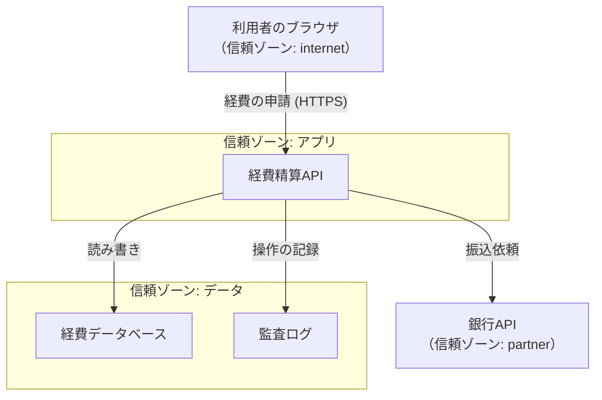

# 11.1 セキュリティの基本原則と脅威モデリング

> 「うちのシステムは安全ですか？」という問いには、そのままでは答えられません。安全とは「誰から・何を・どの程度守るか」を決めて初めて意味を持つ、相対的で終わりのない性質だからです。この章では、セキュリティを「気合い」や「勘」ではなく、脅威を体系的に洗い出し、リスクとして測り、原則に沿って設計する工学として扱う土台をつくります。

| 項目 | 内容 |
|---|---|
| 学習時間の目安 | 本文 3h ＋ 演習 4h |
| 前提となる章 | なし（[9.1 ソフトウェアアーキテクチャの基礎](../../09-architecture/01-architecture-fundamentals/README.md) を学んでいると理解が深まります） |
| 演習 | [exercises/](exercises/)（Python） |
| キーワード | CIA, リスク, 脅威モデリング, STRIDE, 攻撃ツリー, 多層防御, ゼロトラスト, 最小権限 |

## この章のゴール

- [ ] 機密性・完全性・可用性（CIA）に真正性・否認防止を加えたセキュリティの目標を、具体例とともに説明できる
- [ ] リスクを「発生可能性 × 影響度」として捉え、定性的・定量的（ALE）に見積もって優先順位を付けられる
- [ ] Saltzer と Schroeder の設計原則（最小権限・フェイルセーフ・完全な仲介など）を、実際の設計判断に結び付けられる
- [ ] 多層防御・ゼロトラスト・攻撃対象領域の削減という戦略の違いと使いどころを説明できる
- [ ] DFD と STRIDE を使って、あるシステムの脅威を体系的に洗い出し、対策の優先順位を付けられる
- [ ] セキュリティと使いやすさのトレードオフ、人間という攻撃対象（ソーシャルエンジニアリング）の重要性を説明できる

## なぜ学ぶのか

セキュリティ事故は、高度なゼロデイ攻撃よりも「基本の欠落」から起きることが圧倒的に多いのが現実です。

- **設計段階で防げたはずの事故**: 2019 年に発生した Capital One の情報漏えいでは、7 年ぶんの与信申込者の情報など約 1 億件が流出しました。米国上院の調査報告書などによれば、誤設定されたファイアウォールを突いた **SSRF（サーバーサイドリクエストフォージェリ）** を起点に、クラウドのメタデータサービスから認証情報が取得され、権限を持ちすぎた役割（ロール）で大量のデータが読み出されたと報告されています（詳しくは [11.4 Webアプリケーションセキュリティ](../04-web-security/README.md)）。「最小権限」「攻撃対象領域の削減」という原則を設計に織り込んでいれば、被害はここまで広がらなかったと考えられます。
- **脅威を「洗い出していない」ことによる見落とし**: 攻撃者は、開発者が「まさかそこは攻撃されない」と思い込んだ場所を突いてきます。脅威モデリングは、この思い込みを体系的につぶす作業です。Microsoft が 2000 年代に開発プロセスに脅威モデリングを組み込んだ（Security Development Lifecycle, SDL）ことは、その後の業界標準になりました。
- **人間が最も狙われる**: IPA の「情報セキュリティ10大脅威 2026［組織編］」（2026 年 1 月公開）では、1 位が「ランサム攻撃による被害」、2 位が「サプライチェーンや委託先を狙った攻撃」で、これらは複数年にわたり上位を占めています。その多くの入口はフィッシングメールや認証情報の窃取であり、技術だけでなく人間と組織を守ることが不可欠です。

この章で学ぶのは、個別の攻撃手法の暗記ではありません。「守るべきものを定め、攻撃者の視点で脅威を洗い出し、原則に沿って設計し、残ったリスクを測って意思決定する」という、セキュリティのすべての土台になる考え方です。

## 1. セキュリティとは何か — CIA と、その先

### 1.1 3 つの基本目標（CIA）

情報セキュリティが守ろうとするものは、古典的に 3 つに整理されます。頭文字をとって **CIA トライアド** と呼びます。

| 目標 | 意味 | 破られると | 主な対策 |
|---|---|---|---|
| 機密性（Confidentiality） | 認可された人だけが情報を読める | 情報漏えい | 暗号化、アクセス制御 |
| 完全性（Integrity） | 情報が正しく、勝手に改ざんされない | データ改ざん、なりすまし送金 | ハッシュ、署名、MAC、入力検証 |
| 可用性（Availability） | 必要なときに使える | サービス停止、DDoS | 冗長化、レート制限、バックアップ |

この 3 つは、しばしば **互いに緊張関係** にあります。機密性を高めるために暗号化と多要素認証を厳しくすると、可用性（使いやすさ・障害時の復旧性）が下がることがあります。「バックアップを暗号化して鍵を厳重に保管したら、鍵をなくして復旧できなくなった」というのは、機密性を追求して可用性を失う典型例です。セキュリティ設計とは、この 3 つのバランスを、守るべき対象ごとに決めていく作業です。

### 1.2 CIA だけでは足りない — 真正性と否認防止

CIA は基本ですが、現代のシステムではさらに 2 つが重要になります。

- **真正性（Authenticity）**: 「その相手が本当に主張どおりの人・システムか」。なりすましを防ぐ性質で、認証（[11.3 認証と認可](../03-authn-authz/README.md)）が支えます。
- **否認防止（Non-repudiation）**: 「後から『やっていない』と言い逃れできない」こと。電子署名や改ざんできない監査ログが支えます。送金指示や契約の電子化では、この性質が法的な意味を持ちます。

これらを加えた 5 要素（あるいはさらに責任追跡性 accountability を加えた枠組み）で考えると、後述する STRIDE の 6 つの脅威分類がちょうど裏返しの関係になっていることが見えてきます。

## 2. リスクで考える

### 2.1 なぜ「リスク」で考えるのか

すべての脅威に完璧に対処する予算も時間もありません。だから **限られた資源を、最も重要なリスクから順に投じる** 必要があります。ここでリスクを次のように捉えます。

```text
リスク = 発生可能性（likelihood） × 影響度（impact）
```

たとえば「発生可能性は低いが影響が壊滅的（本番 DB の全消失）」と「発生可能性は高いが影響が軽微（管理画面の軽微な表示崩れ）」では、対応の優先順位も対策の性質も変わります。この掛け算により、両者を同じ土俵で比較できます。

### 2.2 定性的評価と定量的評価

現場では 2 つのアプローチを使い分けます。

- **定性的評価**: 発生可能性と影響度をそれぞれ 5 段階などで見積もり、ヒートマップ（下図）で「高・中・低」に色分けする。手早く、関係者の合意を得やすい。演習 `risk_register.py` で実装します。
- **定量的評価**: 金額で見積もる。次の指標を使います。

```text
SLE（単一損失予想額）  = 資産価値 AV × 暴露係数 EF     （1 回の事故でいくら失うか）
ALE（年間予想損失額）  = SLE × ARO（年間発生率）        （1 年あたりの期待損失）
```

たとえば、顧客データベース（資産価値 5,000 万円相当）が漏えいすると 4 割の価値が損なわれ（EF=0.4）、そうした事故が 4 年に 1 回起きる（ARO=0.25）と見積もるなら、SLE は 2,000 万円、ALE は 500 万円です。年間コスト 150 万円の対策で発生率を 1/5 に下げられるなら、期待損失は 500 万円から 100 万円に減り、差し引き 250 万円の価値がある、と議論できます。この計算は演習 `risk_register.py` で実装します。

### 2.3 定量的評価の限界

ALE は経営に説明しやすい反面、**発生率も暴露係数も「あてずっぽうの数字」になりがち** です。セキュリティ事故の頻度は本質的に予測が難しく、桁が違えば結論も逆転します。また、5 段階の順序尺度（1〜5）を掛け算するのも、数学的には乱暴です（「2」が「1」のちょうど 2 倍危険とは限らない）。

だから、リスクスコアは **「議論と優先順位付けの出発点」であって「答え」ではありません**。数字を鵜呑みにせず、「なぜこの発生可能性なのか」「最悪の場合どうなるか」をチームで議論する道具として使います。この限界を理解したうえで使うのが、成熟したセキュリティ組織です。

### 2.4 脅威アクターと動機

「誰から守るか」を明確にすると、対策の優先順位が定まります。攻撃者（脅威アクター）は動機も能力も大きく異なります。

| アクター | 主な動機 | 能力・特徴 |
|---|---|---|
| 愉快犯・スクリプトキディ | 腕試し、いたずら | 公開ツールで既知の脆弱性を機械的に突く。数は多い |
| サイバー犯罪組織 | 金銭 | ランサムウェア、フィッシング、認証情報の売買。分業化・サービス化（RaaS）が進む |
| 内部関係者 | 金銭、恨み、過失 | 正規のアクセス権を持つ。検知が難しい |
| ハクティビスト | 主義・主張 | 情報公開や DDoS、Web 改ざん |
| 国家支援型（APT） | 諜報、破壊 | 潤沢な資源、ゼロデイ、長期潜伏。特定の組織を執拗に狙う |

「国家支援型の攻撃者」を想定するか「金銭目当ての自動化された攻撃」を想定するかで、必要な対策は桁違いに変わります。**多くの組織にとって、まず守るべきは後者（自動化された、広く浅い攻撃）** です。基本（多要素認証・パッチ・バックアップ）を固めることが、最も費用対効果の高い防御になります。

## 3. 攻撃者の視点 — 攻撃のライフサイクル

防御を設計するには、攻撃がどう進むかを知る必要があります。攻撃は一発で決まるのではなく、複数の段階を踏みます。この各段階に「検知」と「妨害」の機会があります。

### 3.1 Cyber Kill Chain と MITRE ATT&CK

- **Lockheed Martin の Cyber Kill Chain**: 攻撃を偵察 → 武器化 → 配送 → 攻撃コード実行 → インストール → 遠隔操作（C2）→ 目的の実行、という一連の流れで捉えるモデルです。「どこか 1 つの段階を断ち切れば攻撃は失敗する」という発想を与えてくれます。
- **MITRE ATT&CK**: 実際に観測された攻撃者の戦術（Tactics: 何をしたいか）と技術（Techniques: どうやるか）を体系的にまとめた、知識ベースです。「初期アクセス」「権限昇格」「横展開」「持ち出し」などの戦術ごとに、具体的な技術が整理されています。防御の網羅性の点検（このテクニックは検知できるか）や、脅威ハンティング、レッドチーム演習の共通言語として、2026 年時点で事実上の標準になっています。


重要なのは、**攻撃者は「初期アクセス」の 1 点だけで勝つのではない** ということです。1 台のマシンに侵入しても、そこから権限を昇格させ、横展開し、目的のデータに到達するまでには多くの段階があります。各段階で検知・妨害できれば、被害を食い止められます。これが次節の「多層防御」の根拠です。

## 4. セキュリティ設計の原則

### 4.1 Saltzer と Schroeder の 8 原則（1975 年）

Jerome Saltzer と Michael Schroeder が 1975 年の論文 "The Protection of Information in Computer Systems" で示した設計原則は、半世紀を経た今も色あせません。**流行の技術は変わっても、これらの原則は変わらない** からこそ、暗記ではなく理解する価値があります。

| 原則 | 意味 | 現代での例 |
|---|---|---|
| 機構の経済性（economy of mechanism） | 仕組みは単純に。単純なものほど検証しやすく、バグが少ない | 複雑な自作認証より、枯れたライブラリ |
| フェイルセーフなデフォルト（fail-safe defaults） | 既定は「拒否」。明示的に許可したものだけ通す | ホワイトリスト方式、既定で非公開のバケット |
| 完全な仲介（complete mediation） | すべてのアクセスを毎回チェックする | キャッシュした権限を信用しない、すべての API で認可 |
| 開かれた設計（open design） | 安全性を「仕組みの秘密」に頼らない（ケルクホフスの原則） | 公開された暗号アルゴリズム、鍵だけが秘密 |
| 権限の分離（separation of privilege） | 重要な操作は複数の条件を要求する | 多要素認証、本番デプロイの二人承認 |
| 最小権限（least privilege） | 各主体には必要最小限の権限だけ与える | 読み取り専用ロール、期限付きの権限 |
| 共通機構の最小化（least common mechanism） | 利用者間で共有する仕組みを減らす | テナントごとの分離、プロセス分離 |
| 心理的受容性（psychological acceptability） | 使いにくい安全策は、回避されて無意味になる | 分かりやすい認証、邪魔にならない仕組み |

このうち **最小権限とフェイルセーフなデフォルトは、あらゆる設計判断で最初に思い出すべき 2 つ** です。「この役割に、この権限は本当に必要か」「これは既定で拒否になっているか」を問うだけで、多くの事故を防げます。

### 4.2 多層防御（defense in depth）

単一の防御は必ず破られると考え、**独立した防御を何層も重ねます**。1 つの層が破られても、次の層が攻撃を止める、あるいは検知します。

演習 `risk_register.py` では、独立した対策を重ねる効果を「攻撃がすべての層をすり抜ける確率の掛け算」として計算します。効果 50% の対策と 60% の対策を重ねると、すり抜ける確率は 0.5 × 0.4 = 0.2 になり、合計の効果は 80%（0.5 + 0.4 = 0.9 ではありません）になります。これが多層防御の数学的な根拠です。

ただし、**独立していない層を重ねても効果は薄い** ことに注意します。同じ WAF ベンダーの製品を 2 段重ねても、同じ回避手法で両方すり抜けられます。「攻撃者が別々の技術で破らなければならない」層を重ねることが肝心です。

### 4.3 ゼロトラスト

伝統的なネットワークは「境界の内側は信頼する」モデル（境界防御、いわゆる「M&M モデル: 外は固く中は柔らかい」）でした。しかしクラウド・リモートワーク・内部不正の時代には、「内側」という安全地帯はもう存在しません。**ゼロトラスト** は「決して信頼せず、常に検証する（never trust, always verify）」という考え方です。

- ネットワーク上の位置（社内 LAN にいるか）を信頼の根拠にしない。
- すべてのアクセスを、そのつど「認証されたアイデンティティ」と「デバイスの状態」に基づいて認可する（完全な仲介）。
- NIST SP 800-207 がアーキテクチャの参照モデルを示しています。Google が自社で実装した **BeyondCorp** が有名な実例です。

ゼロトラストは製品を買えば実現するものではなく、**アイデンティティ管理・デバイス管理・きめ細かい認可を段階的に積み上げる長い道のり** です。「ゼロトラスト製品を導入した＝ゼロトラスト完成」ではない点に注意します。

### 4.4 攻撃対象領域（アタックサーフェス）の削減

攻撃対象領域とは、攻撃者が接触できる入口の総体（公開ポート、API エンドポイント、依存ライブラリ、権限を持つアカウント、など）です。**最も安全なコードは、存在しないコードです**。使っていない機能・エンドポイント・ライブラリ・アカウントを減らすことは、それ自体が最も確実な防御になります。「この管理エンドポイントは本当にインターネットに公開する必要があるか」「この依存ライブラリは本当に必要か」を問い続けます。

## 5. 脅威モデリング

### 5.1 Shostack の 4 つの問い

脅威モデリングとは、「設計段階で、攻撃者の視点からシステムを眺め、脅威を洗い出して対策する」作業です。Adam Shostack は、これを 4 つのシンプルな問いに整理しました。

1. **何を作っているのか？**（What are we working on?）— システムを図にする。
2. **何がうまくいかないか？**（What can go wrong?）— 脅威を洗い出す。
3. **それに対して何をするか？**（What are we going to do about it?）— 対策を決める。
4. **うまくやれたか？**（Did we do a good enough job?）— 見直す。

大切なのは、**脅威モデリングは特別なツールより「チームで一緒に考えること」に価値がある** という点です。設計をホワイトボードに描き、「ここが攻撃されたら？」と問い合う 1 時間が、後の重大な手戻りを防ぎます。

### 5.2 DFD と信頼境界

まず「何を作っているのか」を **データフロー図（DFD）** で描きます。DFD の要素は 4 種類です。

- **外部エンティティ**（利用者、外部サービス）: システムの外にいる、制御できない相手。
- **プロセス**（アプリ、API）: データを処理する主体。
- **データストア**（DB、ファイル、ログ）: データが静止する場所。
- **データフロー**: 要素間のデータの流れ。

そして最も重要なのが **信頼境界（trust boundary）** です。これは「信頼レベルが変わる線」で、たとえば「インターネットと社内ネットワークの境目」「アプリと DB の境目」です。**攻撃は信頼境界をまたぐところで起きる** ので、脅威モデリングは境界に注目します。



### 5.3 STRIDE

「何がうまくいかないか」を体系的に洗い出すために、Microsoft が考案した **STRIDE** という分類を使います。これは 6 つの脅威の頭文字で、前述の CIA＋真正性・否認防止のちょうど裏返しです。

| 分類 | 脅威 | 破られる性質 | 対策の方向 |
|---|---|---|---|
| **S**poofing | なりすまし | 真正性 | 認証（MFA、mTLS、署名） |
| **T**ampering | 改ざん | 完全性 | 署名・MAC、入力検証、権限限定 |
| **R**epudiation | 否認 | 否認防止 | 改ざんできない監査ログ |
| **I**nformation disclosure | 情報漏えい | 機密性 | 暗号化、アクセス制御、最小化 |
| **D**enial of service | サービス拒否 | 可用性 | レート制限、冗長化 |
| **E**levation of privilege | 権限昇格 | 認可 | 最小権限、認可チェック |

**STRIDE-per-element** という手法では、DFD の要素の種類ごとに「考えるべき脅威」が決まっています。たとえば外部エンティティにはなりすまし（S）と否認（R）を、データストアには改ざん（T）・情報漏えい（I）・サービス拒否（D）を検討します。これにより「何を考え忘れたか」を防げます。演習 `threatmodel.py` で、この STRIDE-per-element を自動化します。

### 5.4 攻撃ツリーと LINDDUN

- **攻撃ツリー（attack tree）**: 「攻撃者の目標」を根に置き、それを達成する手段を枝として分解していく木構造です。「金庫を開ける」の下に「暗証番号を知る」「こじ開ける」「持ち主を脅す」と枝分かれし、さらに細分化します。特定の資産に対する攻撃経路を深く分析するのに向きます。
- **LINDDUN**: STRIDE がセキュリティの脅威を扱うのに対し、**プライバシー** の脅威（リンク可能性、識別可能性、追跡など）を体系的に洗い出す手法です。個人データを扱うシステムでは、セキュリティとプライバシーの両面から脅威を見る必要があります（[14.5 ガバナンス・リスク・コンプライアンスと法務](../../14-cto/05-governance-risk-compliance/README.md)）。

## 6. 人間という攻撃対象

### 6.1 ソーシャルエンジニアリングとフィッシング

どれだけ技術的な防御を固めても、**人間をだませば突破できます**。ソーシャルエンジニアリングは、技術ではなく人の心理（権威への服従、緊急性、親切心、恐怖）を突く攻撃です。その代表がフィッシング（偽のログイン画面などで認証情報をだまし取る）で、標的を絞ったものを **スピアフィッシング**、経営層を狙うものを **ホエーリング**、経営者になりすまして送金を指示する詐欺を **ビジネスメール詐欺（BEC）** と呼びます。

実際、多くの重大な侵害の起点はフィッシングです。[11.5 セキュリティ運用とサプライチェーン](../05-security-operations/README.md) で扱う 2024 年以降のサプライチェーン攻撃の多くも、メンテナーがフィッシングで認証情報を奪われたことが発端でした。

### 6.2 セキュリティと使いやすさ、そして文化

**使いにくいセキュリティは回避されて無意味になります**（心理的受容性）。「パスワードを 90 日ごとに変更させる」ルールが、かえって `Password1!` → `Password2!` という弱いパスワードを生んだのは有名な失敗です（この点は [11.3 認証と認可](../03-authn-authz/README.md) で NIST のガイドラインとともに詳述します）。

技術的対策と同じくらい重要なのが **セキュリティ文化** です。「フィッシングの疑いを報告した人が褒められる」「事故を報告しても責められない（非難しない文化）」組織は、脅威を早期に検知できます。逆に、報告すると叱られる組織では、事故が隠され、被害が拡大します。セキュリティは技術部門だけの仕事ではなく、組織全体の文化の問題です。

## よくある落とし穴

1. **「安全ですか？」に「はい」と答えてしまう**。安全は絶対的な状態ではなく、「どの脅威アクターから、何を、どの程度守れているか」という相対的なものです。答えるべきは「この脅威モデルに対して、これらの対策で、残存リスクはこの程度」です。
2. **隠すことをセキュリティと勘違いする（security by obscurity）**。「URL を秘密にしているから大丈夫」「独自の暗号だから解読されない」は、開かれた設計の原則に反します。仕組みは公開されても、鍵と権限だけで守れる設計にします。
3. **すべてのリスクを同じ重さで扱う**。あるいは逆に、派手な脅威（ゼロデイ）ばかり気にして基本（パッチ・MFA・バックアップ）を怠る。リスクの大きさで優先順位を付け、費用対効果の高い基本から固めます。
4. **リスクスコアの数字を鵜呑みにする**。ALE や 5 段階評価は議論の出発点であって答えではありません。「なぜこの数字なのか」を問わないスコアリングは、精密に見えるだけの当てずっぽうです。
5. **脅威モデリングを一度きりのイベントにする**。システムは変わり続けます。新しいエンドポイント、新しい連携、新しいデータを追加するたびに、脅威モデルを見直す必要があります。
6. **人間を無視して技術だけを固める**。最新の WAF を入れても、経理担当者がフィッシングで送金してしまえば意味がありません。人と組織（教育、報告しやすい文化、権限の分離）への投資を忘れないことです。
7. **多層防御のつもりで、独立していない層を重ねる**。同じ前提・同じ弱点を持つ対策を重ねても、1 つの手法で全部すり抜けられます。「別々の技術で破らなければならない」層を重ねます。

## CTOの視点

1. **設計レビューで脅威モデリングを「問い」として持ち込む**。新機能の設計レビューで、CTO が投げるべき問いは「Shostack の 4 つの問い」に集約されます。特に「この機能で新しく増える信頼境界はどこか」「ここが攻撃されたら最悪何が起きるか」「既定は拒否になっているか、最小権限か」の 3 つを習慣的に問うだけで、多くの重大な設計ミスを設計段階で捕まえられます。脅威モデリングを専門家だけの作業にせず、開発チームの日常にすることが目標です。
2. **限られたセキュリティ予算をリスクで配分する**。「流行っているから」ではなく「自社にとってのリスク（発生可能性 × 影響度）が大きいから」で投資先を決めます。多くの組織にとって、最も費用対効果が高いのは高価な製品ではなく、基本（全社 MFA・パッチ適用・バックアップ・ログ・最小権限）の徹底です。ALE の計算は、経営陣や取締役会に投資を説明する共通言語として使えますが、その数字の不確かさも正直に伝えます。
3. **「一方通行のドア」になるセキュリティ判断を見極める**。認証基盤の選定、テナント分離のモデル、監査ログの設計は、後から変えるのが極めて難しい判断です。逆に、個別の WAF ルールなどは後から調整できます。前者には設計段階で時間をかけ、脅威モデリングと専門家のレビューを投じる価値があります。
4. **セキュリティ文化を作るのは経営の仕事**。「事故を報告しても罰されない」「セキュリティ上の懸念を上げた人が評価される」文化は、CTO と経営陣の態度で決まります。フィッシング訓練の結果で個人を罰するのではなく、報告率を評価する。事故対応の事後検証で個人を責めない（[10.5 インシデント対応とポストモーテム](../../10-cloud-and-sre/05-incident-management/README.md)）。この文化が、最終的に最強の防御になります。
5. **採用で見極める**。セキュリティ人材を採用・評価する際は、特定の攻撃手法の知識量より「攻撃者の視点で考えられるか」「リスクで優先順位を付けられるか」「開発者と協働してセキュリティを作り込めるか（対立するのではなく）」を見ます。「セキュリティ部門が開発を止める人」ではなく「開発を安全に速くする人」を採れるかが、組織のセキュリティを左右します。

## 演習

演習コードは [exercises/](exercises/) にあります。関数の docstring に仕様があります。

```bash
python3 tools/check.py 11.1        # リポジトリのルートで実行
python3 tools/check.py -v 11.1     # 詳しい出力
```

| # | 難易度 | 内容 | 対象ファイル / 関数 |
|---|---|---|---|
| 1 | ★★☆ | DFD から STRIDE-per-element で脅威を生成し、リスクスコアで優先順位を付け、対策チェックリストを出力する | `threatmodel.py`（`validate_model`, `stride_for_element`, `generate_threats`, `prioritize`, `render_checklist`） |
| 2 | ★☆☆ | 固有リスク・残存リスク（対策効果つき）を計算し、ヒートマップとトップリスク報告を作る | `risk_register.py`（`single_loss_expectancy`, `combined_effectiveness`, `assess`, `top_risks`, `render_report`） |
| 3 | ★★☆ | 記述: 社内経費精算 SaaS の脅威モデリング（下記） | — |

### 演習 3（記述）: 経費精算 SaaS の脅威モデリング

あなたは、社内向けの **経費精算 SaaS** の設計レビューを担当しています。このシステムは次の要素からなります。

- 従業員がブラウザから経費を申請する（レシート画像をアップロードできる）。
- アプリ API がリクエストを処理し、経費データベースに保存する。
- 承認者が申請を承認すると、外部の銀行 API を通じて振込が実行される。
- すべての操作は監査ログに記録される。マルチテナント（複数の顧客企業が同じシステムを共有）である。

この構成について、(1) DFD を描いて信頼境界を示し、(2) STRIDE を使って各要素・各フローの主要な脅威を最低 6 つ挙げ、(3) それぞれに対策と、リスクの優先度（高・中・低）を付けてください。

<details>
<summary>解答例</summary>

**(1) DFD と信頼境界**（本文 5.2 の図を参照）。信頼境界は少なくとも 4 つ: 「インターネット↔アプリ」「アプリ↔データ層」「アプリ↔銀行 API（外部の第三者）」、そしてマルチテナントなので「テナント A のデータ↔テナント B のデータ」の論理的な境界。

**(2)(3) 主要な脅威と対策**（抜粋）:

| 要素/フロー | STRIDE | 脅威 | 対策 | 優先度 |
|---|---|---|---|---|
| 利用者→API | S（なりすまし） | 他人になりすまして申請・承認する | MFA、フィッシング耐性のある認証、セッション管理 | 高 |
| 経費API | E（権限昇格） | 一般社員が承認者の権限を得る、他テナントのデータにアクセス（BOLA/IDOR） | すべての操作で認可チェック、テナント ID をサーバー側で判定（[11.3](../03-authn-authz/README.md)） | 高 |
| 経費DB | I（情報漏えい） | 他社（他テナント）の経費・口座情報が見える | テナント分離、保存時暗号化、最小権限 | 高 |
| 振込依頼（API→銀行） | T（改ざん） | 振込先口座や金額を改ざんされる | TLS、リクエスト署名、承認額の再確認 | 高 |
| 承認操作 | R（否認） | 「私は承認していない」と後から主張される | 改ざんできない監査ログ（誰が・いつ・何を） | 中 |
| レシートのアップロード | T/E | 悪意あるファイル、SSRF（画像取得機能があれば）、パストラバーサル | ファイル検証、SSRF 対策、保存パスの検証（[11.4](../04-web-security/README.md)） | 中 |
| 経費API | D（サービス拒否） | 大量申請でサービス停止、月末の負荷集中 | レート制限、クォータ、オートスケール | 中 |

**採点の観点**:

- 信頼境界を「インターネット↔アプリ」だけでなく「テナント間」「外部銀行 API」まで挙げられているか。
- マルチテナントの認可（他テナントのデータにアクセスできないこと = BOLA/IDOR）を最重要級の脅威として挙げられているか。これは経費精算 SaaS で最も起きやすく影響の大きい脅威です。
- 振込という「お金が動く」フローの完全性（改ざん）と否認防止（誰が承認したか）に触れられているか。
- 各脅威に、STRIDE の分類・具体的な対策・優先度がそろっているか。

</details>

## 理解度チェック

**Q1. CIA の 3 要素が互いに緊張関係になる例を 1 つ挙げてください。**

<details>
<summary>解答</summary>

機密性と可用性の緊張が典型例です。たとえばバックアップを強力に暗号化して鍵を厳重に管理すると（機密性↑）、鍵を紛失したときに復旧できなくなります（可用性↓）。また、認証を厳格にすると（機密性↑）、正規利用者がロックアウトされやすくなります（可用性↓）。完全性と可用性でも、「改ざん検知でエラーを厳しく弾くと、軽微な破損でもサービスが止まる」といった緊張が生じます。セキュリティ設計は、守る対象ごとにこのバランスを決める作業です。

</details>

**Q2. 「発生可能性は低いが影響が壊滅的なリスク」と「発生可能性は高いが影響が軽微なリスク」は、リスクスコア（発生可能性 × 影響度）だけで優先順位を決めてよいですか。**

<details>
<summary>解答</summary>

スコアは出発点として有用ですが、それだけで決めるのは危険です。第一に、順序尺度の掛け算には数学的な問題があり、「影響度 5・発生可能性 1」と「影響度 1・発生可能性 5」が同じスコア 5 になっても、対応の性質はまったく異なります。第二に、影響が壊滅的なリスク（事業の存続に関わる）は、発生可能性が低くても優先的に対策すべきことがあります（許容できない損失は、期待値が小さくても避ける）。だからスコアで機械的に決めず、「最悪の場合どうなるか」「その損失は組織が受け入れられるか」を必ず併せて議論します。演習の `risk_register.py` でも、同点のときは影響度の大きい方を優先しています。

</details>

**Q3. Saltzer と Schroeder の「フェイルセーフなデフォルト」と「最小権限」は、それぞれどういう原則ですか。具体例とともに説明してください。**

<details>
<summary>解答</summary>

**フェイルセーフなデフォルト**は「既定を拒否にし、明示的に許可したものだけを通す」原則です。ファイアウォールを「既定で全遮断、必要なポートだけ開ける」設定にする、クラウドストレージを「既定で非公開」にする、といった例です。許可リスト方式なので、設定漏れがあっても安全側（拒否）に倒れます。

**最小権限**は「各主体に、業務に必要な最小限の権限だけを与える」原則です。バッチ処理用のアカウントに読み取り専用の権限だけ与える、管理者権限は必要なときだけ期限付きで付与する、といった例です。侵害されたアカウントの被害範囲（blast radius）を最小化します。この 2 つは、あらゆる設計判断で最初に確認すべき原則です。

</details>

**Q4. 「多層防御」で、効果 70% の対策と効果 50% の対策（互いに独立）を重ねたとき、合計の防御効果は何 % ですか。**

<details>
<summary>解答</summary>

効果は足し算（120%）ではありません。攻撃が「両方の対策をすり抜ける」確率を掛け算します。1 つ目をすり抜ける確率は 30%（0.3）、2 つ目をすり抜ける確率は 50%（0.5）なので、両方すり抜ける確率は 0.3 × 0.5 = 0.15。したがって合計の防御効果は 1 − 0.15 = **85%** です。ただしこれは 2 つの対策が独立している（同じ弱点を共有しない）場合の計算です。同じ回避手法で両方破られるなら、この効果は得られません。演習 `risk_register.py` の `combined_effectiveness` がこの計算です。

</details>

**Q5. DFD における「信頼境界」とは何ですか。なぜ脅威モデリングで重要なのですか。**

<details>
<summary>解答</summary>

信頼境界とは、信頼レベルが変わる境目のことです。たとえば「インターネットと社内アプリの境目」「アプリとデータベースの境目」「自社と外部 API の境目」「マルチテナントでのテナント間の境目」です。攻撃は、信頼できない側から信頼できる側へ、この境界をまたいで侵入します。境界をまたぐデータフローこそが検証（認証・認可・入力検証）を最も厳格に行うべき場所なので、脅威モデリングでは信頼境界に注目して脅威を洗い出します。演習 `threatmodel.py` でも、信頼境界をまたぐフローだけを脅威分析の対象にしています。

</details>

**Q6. STRIDE の各文字が対応する脅威と、破られるセキュリティ特性を答えてください。**

<details>
<summary>解答</summary>

- **S**poofing（なりすまし）→ 真正性
- **T**ampering（改ざん）→ 完全性
- **R**epudiation（否認）→ 否認防止
- **I**nformation disclosure（情報漏えい）→ 機密性
- **D**enial of service（サービス拒否）→ 可用性
- **E**levation of privilege（権限昇格）→ 認可

STRIDE は、守りたいセキュリティ特性（CIA ＋ 真正性・否認防止・認可）のちょうど裏返しになっています。だから「この要素で守りたい特性は何か」を考えれば、対応する脅威が見えてきます。

</details>

**Q7. 「security by obscurity（隠蔽によるセキュリティ）」がなぜ危ういのか、ケルクホフスの原則に触れて説明してください。**

<details>
<summary>解答</summary>

隠蔽によるセキュリティとは、「仕組みを秘密にすること」を安全性の根拠にする考え方です（独自の暗号方式、秘密の URL、非公開の認証手順など）。これが危ういのは、秘密は必ず漏れるからです。退職者、リバースエンジニアリング、ソースコードの流出などで仕組みが露見した瞬間に、防御が丸ごと崩壊します。ケルクホフスの原則（開かれた設計）は「暗号システムは、鍵以外のすべてが公知になっても安全であるべき」と述べます。つまり、守るべき秘密は「鍵」や「権限」といった、交換・失効・管理ができる小さなものに限定し、仕組み自体は公開されても安全な設計にすべきだ、ということです。ただし「攻撃対象領域を減らすために不要な情報を公開しない」ことは別の話で、これは有効な多層防御の一部です（隠蔽を唯一の防御にしないことが肝心）。

</details>

## さらに学ぶために

- Adam Shostack『Threat Modeling: Designing for Security』（Wiley, 2014）— 脅威モデリングの決定版。DFD・STRIDE・攻撃ツリーを実践的に解説。この章の 5 節の元ネタであり、次に読むべき一冊。
- Jerome Saltzer, Michael Schroeder "The Protection of Information in Computer Systems"（1975）— 8 つの設計原則の原典。短く、今も読む価値のある古典。
- Ross Anderson『Security Engineering』（Wiley, 第 3 版 2020）— セキュリティ工学の百科事典的名著。技術・人間・経済・法制度まで広く深い。第 2 版は著者サイトで無料公開されている。
- NIST SP 800-207 "Zero Trust Architecture"（2020）— ゼロトラストの参照アーキテクチャの一次情報。米国政府機関の文書だが、考え方は普遍的。
- 情報処理推進機構（IPA）「情報セキュリティ10大脅威」（毎年更新）— 日本の組織・個人が直面する脅威を毎年ランキングで示す。自組織の脅威モデルの出発点として、日本の文脈で有用。
- MITRE ATT&CK（https://attack.mitre.org/）— 攻撃者の戦術・技術の知識ベース。防御の網羅性チェックや脅威ハンティングの共通言語。

## まとめ

- セキュリティとは絶対的な状態ではなく、「誰から・何を・どの程度守るか」を決めて初めて意味を持つ、相対的で終わりのない工学である。
- 守るべき目標は CIA（機密性・完全性・可用性）に真正性・否認防止を加えた枠組みで捉える。これらはしばしば互いに緊張関係にある。
- 限られた資源は「リスク = 発生可能性 × 影響度」で優先順位を付けて配分する。ALE などの定量評価は議論の出発点であり、数字を鵜呑みにしてはいけない。
- Saltzer と Schroeder の設計原則（特に最小権限とフェイルセーフなデフォルト）は半世紀を経ても有効な、あらゆる設計判断の土台である。
- 多層防御・ゼロトラスト・攻撃対象領域の削減は、「単一の防御は必ず破られる」という前提に立った戦略である。
- 脅威モデリングは、DFD で信頼境界を描き、STRIDE で脅威を洗い出し、リスクで優先順位を付ける体系的な作業。特別なツールより「チームで一緒に考えること」に価値がある。
- 最強の防御は、技術だけでなく、フィッシングに強い人と、事故を報告できるセキュリティ文化にある。それを作るのは経営の仕事である。
