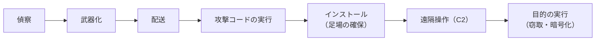
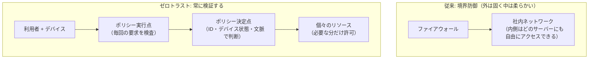
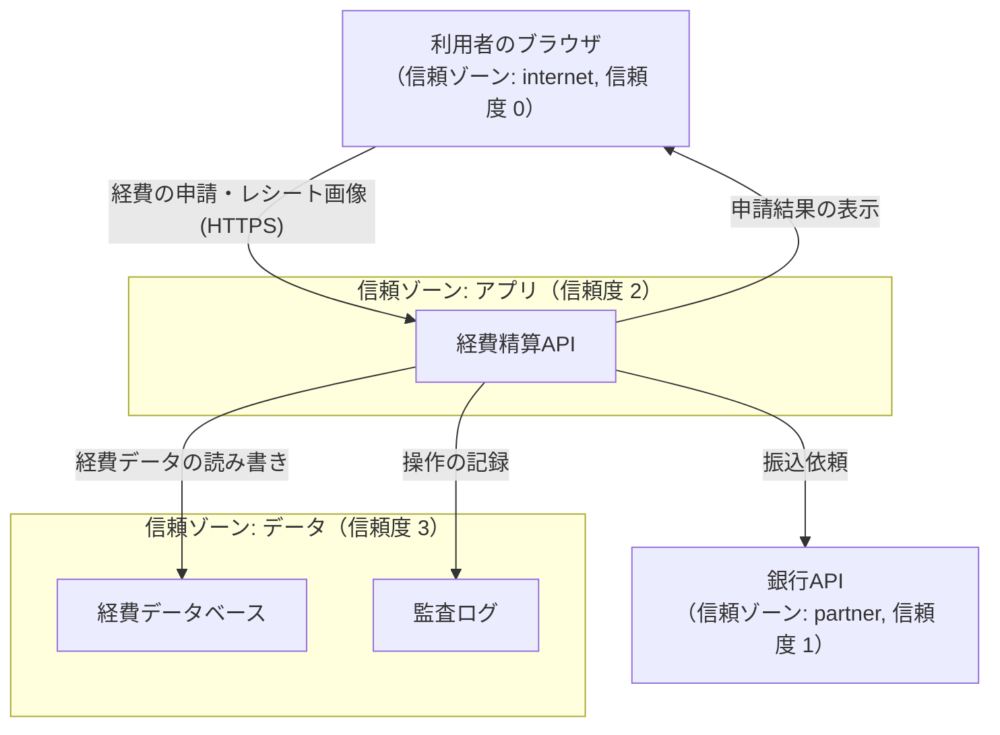

# 11.1 セキュリティの基本原則と脅威モデリング

> 「うちのシステムは安全ですか？」という問いには、そのままでは答えられません。安全とは「誰から・何を・どの程度守るか」を決めて初めて意味を持つ、相対的で終わりのない性質だからです。この章では、セキュリティを「気合い」や「勘」ではなく、守るべきものを定め、脅威を体系的に洗い出し、リスクとして測り、原則に沿って設計する工学として扱う土台をつくります。

| 項目 | 内容 |
|---|---|
| 学習時間の目安 | 本文 4h ＋ 演習 4h |
| 前提となる章 | なし（[9.1 ソフトウェアアーキテクチャの基礎](../../09-architecture/01-architecture-fundamentals/README.md) を学んでいると理解が深まります） |
| 演習 | [exercises/](exercises/)（Python） |
| キーワード | CIA, リスク, ALE, モンテカルロ, キルチェーン, ATT&CK, 設計原則, 多層防御, ゼロトラスト, 脅威モデリング, STRIDE, 攻撃ツリー, セキュリティ文化 |

## この章のゴール

- [ ] 機密性・完全性・可用性（CIA）に真正性・否認防止を加えたセキュリティの目標を使って、あるシステムで守るべきものを具体的に言語化できる
- [ ] リスクを「発生可能性 × 影響度」として定性的に、また ALE や損失の分布として定量的に見積もり、対策の優先順位と投資判断を説明できる
- [ ] 攻撃のライフサイクル（キルチェーン、MITRE ATT&CK）を使って、どの段階で検知・阻止するかを議論できる
- [ ] Saltzer と Schroeder の設計原則、多層防御、ゼロトラスト、攻撃対象領域の削減を使って、設計レビューで具体的な指摘ができる
- [ ] DFD と STRIDE でシステムの脅威を体系的に洗い出し、リスクスコアで優先順位を付けた対策リストを作れる（演習でも実装する）
- [ ] 脅威モデリングをチームの開発プロセスに組み込む方法を説明できる
- [ ] ソーシャルエンジニアリングと人的要因を踏まえ、「人を責める」のではなく「仕組みで守る」設計とセキュリティ文化を提案できる

## なぜ学ぶのか

セキュリティ事故は、高度なゼロデイ攻撃よりも「基本の欠落」と「想定していなかった経路」から起きることの方が圧倒的に多いのが現実です。

- **設計段階で防げたはずの事故**: 2019 年に公表された Capital One の情報漏えいでは、同社の発表によれば米国の約 1 億人とカナダの約 600 万人の個人情報が流出しました。刑事訴追の資料や各種の分析によれば、設定に不備のあったファイアウォールを経由して、クラウドのメタデータサービスから一時的な認証情報が取得され、その認証情報に与えられていた広すぎる権限でストレージのデータが読み出されたとされています（SSRF と呼ばれる手法。[11.4 Webアプリケーションセキュリティ](../04-web-security/README.md)）。「最小権限」「攻撃対象領域の削減」という原則が設計に織り込まれていれば、被害の範囲は大きく変わったはずです。
- **防御の機会はいくつもあった**: 2013 年の米小売大手 Target の事件では、同社の発表によればカード情報約 4,000 万件と約 7,000 万人分の顧客情報が流出しました。米国上院商業委員会のスタッフによる報告書「A "Kill Chain" Analysis of the 2013 Target Data Breach」（2014 年）は、取引先の空調業者から盗まれた認証情報が侵入の起点となったこと、そして攻撃の途中の複数の段階に阻止の機会があり、検知システムの警告も活かされなかったことを指摘しています。攻撃は「一発で決まる」のではなく段階を踏む、という理解が防御の設計を変えます。
- **人間が最も狙われる**: IPA の「情報セキュリティ10大脅威 2026［組織編］」（2026 年 1 月公開）では、1 位が「ランサム攻撃による被害」、2 位が「サプライチェーンや委託先を狙った攻撃」で、どちらも複数年にわたり上位を占めています。その入口の多くは、フィッシングや盗まれた認証情報です。2017 年には日本航空が、取引先を装った偽の請求メールで合計約 3 億 8,400 万円をだまし取られたと発表しました（ビジネスメール詐欺）。技術だけでなく、人と組織を守る仕組みが要ります。

この章で学ぶのは、個別の攻撃手法の暗記ではありません。「守るべきものを定め、攻撃者の視点で脅威を洗い出し、原則に沿って設計し、残ったリスクを測って意思決定し、組織として回し続ける」という、セキュリティのすべての土台になる考え方です。

## 1. セキュリティとは何か — 守るものを定める

### 1.1 基本の用語

議論がかみ合わない原因の多くは、言葉の混同です。まず 5 つの用語を区別します。

| 用語 | 意味 | 例 |
|---|---|---|
| 資産（asset） | 守る価値があるもの | 顧客の個人情報、決済機能、ソースコード、ブランドへの信頼 |
| 脅威（threat） | 資産に害を与えうる事象・主体 | 認証情報を盗む攻撃者、内部不正、設定ミス、災害 |
| 脆弱性（vulnerability） | 脅威に悪用されうる弱点 | 認可チェックの漏れ、パッチの当たっていないサーバー、弱いパスワード |
| リスク（risk） | 脅威が脆弱性を突いて資産に害を与える可能性と、その大きさ | 「未修正の脆弱性が突かれ、顧客情報が漏えいする可能性」 |
| 管理策（control） | リスクを下げる対策 | 多要素認証、パッチ適用、暗号化、監視、教育、契約 |

「脆弱性があるから危険だ」だけでは不十分で、「どの脅威が」「どの資産に」「どれくらいの可能性と大きさで」害を与えるか（リスク）まで言語化して初めて、対策の優先順位が付けられます。

### 1.2 3 つの基本目標（CIA）

情報セキュリティが守ろうとするものは、古典的に 3 つに整理されます。頭文字をとって **CIA トライアド** と呼びます。

| 目標 | 意味 | 破られると | 主な対策 |
|---|---|---|---|
| 機密性（Confidentiality） | 認可された人だけが情報を読める | 情報漏えい | 暗号化、アクセス制御、データの最小化 |
| 完全性（Integrity） | 情報が正しく、勝手に改ざんされない | データ改ざん、不正送金 | 署名、MAC、入力検証、変更権限の限定 |
| 可用性（Availability） | 必要なときに使える | サービス停止 | 冗長化、レート制限、バックアップ |

この 3 つは、しばしば **互いに緊張関係** にあります。機密性を高めるために暗号化を厳しくすると、鍵をなくしたときに復旧できなくなる（可用性の低下）。完全性を守るために改ざん検知でエラーを厳しく弾くと、軽微な破損でもサービスが止まる。セキュリティ設計とは、この 3 つのバランスを、守る対象ごとに決めていく作業です。決済データなら完全性と機密性、ニュースサイトの記事なら完全性と可用性、というように、重みは資産によって違います。

### 1.3 CIA だけでは足りない — 真正性と否認防止

現代のシステムでは、さらに 2 つが重要になります。

- **真正性（Authenticity）**: 「その相手が本当に主張どおりの人・システムか」。なりすましを防ぐ性質で、認証（[11.3 認証と認可](../03-authn-authz/README.md)）と署名（[11.2 暗号技術の基礎](../02-cryptography/README.md)）が支えます。
- **否認防止（Non-repudiation）**: 「後から『やっていない』と言い逃れできない」こと。電子署名や、改ざんできない監査ログが支えます。送金の指示や契約の電子化では、この性質が法的な意味を持ちます。

これに **責任追跡性（accountability）** —— 誰が何をしたかを後から追えること —— を加えた枠組みで考えると、第 5 節の STRIDE の 6 分類が、ちょうどこれらの裏返しになっていることが見えてきます。

### 1.4 「安全」は脅威モデルに対して相対的

「安全か」に答えるには、前提となる **脅威モデル**（どんな攻撃者が、何を狙い、どこまでできると想定するか）が必要です。次の 1 文を書けるかどうかが、議論の出発点です。

```text
このシステムは、［想定する攻撃者］から、［守る資産］を、［どの程度（何を許容し、何を許容しないか）］守る。
例: この経費精算サービスは、インターネット上の不特定の攻撃者と、他テナントの利用者から、
    各社の経費データと振込指示の完全性・機密性を守る。国家レベルの標的型攻撃は想定の範囲外とし、
    その前提は年 1 回見直す。
```

最後の「範囲外」を明記することも大切です。想定しないものを明文化しておけば、状況が変わったとき（たとえば防衛関連の顧客を獲得したとき）に、前提を見直すきっかけになります。

## 2. リスクで考える

### 2.1 リスク = 発生可能性 × 影響度

すべての脅威に完璧に対処する予算も時間もありません。だから **限られた資源を、最も重要なリスクから順に投じる** 必要があります。そのための基本の式が次の通りです。

```text
リスク = 発生可能性（likelihood） × 影響度（impact）
```

実務では、発生可能性と影響度をそれぞれ 5 段階で見積もり、掛け算したスコアを **ヒートマップ** に置いて色分けします（演習 `risk_register.py` の区分）。

```text
影響度 →      1     2     3     4     5
発生可能性 5 │  5    10    15    20    25      1〜4  : 低（受容しうる）
          4 │  4     8    12    16    20      5〜9  : 中（計画的に対応）
          3 │  3     6     9    12    15      10〜16: 高（優先して対応）
          2 │  2     4     6     8    10      17〜25: 重大（直ちに対応・経営判断）
          1 │  1     2     3     4     5
```

### 2.2 定性的評価とリスク登録簿

組織としてリスクを管理するには、**リスク登録簿（リスクレジスター）** に一元的に記録します。重要なのは、各リスクに **オーナー**（対応と受容を決める責任者）を置き、対策前の **固有リスク** と対策後の **残存リスク** を分けて記録することです。

| ID | リスク | オーナー | 固有（L×I） | 主な対策 | 残存（L×I） | 判断 |
|---|---|---|---|---|---|---|
| R-01 | ランサムウェアで基幹業務が停止する | CIO | 4×5=20 | 全社 MFA、パッチ管理、オフラインバックアップ | 2×5=10 | 追加対策（復旧訓練） |
| R-02 | 退職者アカウントからの情報持ち出し | 人事部長 | 3×4=12 | 退職時のアカウント棚卸し | 2×4=8 | 受容（四半期レビュー） |
| R-03 | クラウドの設定ミスによるデータ公開 | CTO | 3×5=15 | 設定の自動検査（CSPM） | 2×5=10 | 追加対策 |

独立した対策を重ねたときの効果は、「足し算」ではなく「すり抜ける確率の掛け算」で考えます。効果 50% の対策と 40% の対策を重ねると、すり抜ける確率は 0.5 × 0.6 = 0.3 で、合計の効果は 70% です（50% + 40% = 90% ではありません）。この計算とヒートマップ、上位リスクの報告表は、演習 `risk_register.py` で実装します。

### 2.3 定量的評価 — SLE と ALE

経営に説明するときは、金額で見積もることがあります。古典的な指標は次の 2 つです。

```text
SLE（単一損失予想額）= 資産価値 AV × 暴露係数 EF    … 1 回の事故でいくら失うか
ALE（年間予想損失額）= SLE × ARO（年間発生率）      … 1 年あたりの損失の期待値
```

顧客データベース（資産価値 5,000 万円相当）が漏えいすると 4 割の価値が損なわれ（EF = 0.4）、そうした事故が 4 年に 1 回起きる（ARO = 0.25）と見積もるなら、SLE は 2,000 万円、ALE は 500 万円です。年間 150 万円の対策で発生率を 5 分の 1 に下げられるなら、ALE は 100 万円に下がり、差し引き 250 万円の価値がある、と議論できます。

### 2.4 平均だけを見ない — 損失の分布を見る

ALE は分かりやすい反面、**「平均」しか表さない** という大きな弱点があります。セキュリティ事故の損失は、ほとんどの年はゼロで、まれに巨額になる、という **裾の重い分布** をしています。平均値だけでは、経営が本当に気にすべき「最悪の年」が見えません。

そこで、発生回数と 1 件あたりの損失を確率分布で表し、何万年分もシミュレーションして損失の分布を眺める、という方法（モンテカルロ法）がよく使われます。FAIR（Factor Analysis of Information Risk）と呼ばれるリスク定量化の枠組みも、この考え方に立っています。

```python
import math
import random

rng = random.Random(2026)

def simulate_year() -> float:
    """1 年分の損失（円）を 1 回シミュレーションする。"""
    # 事故の発生: 平均で年 0.3 回（到着間隔が指数分布 = 件数がポアソン分布）
    losses, t = 0.0, rng.expovariate(0.3)
    while t < 1.0:
        # 1 件あたりの損失: 中央値 2,000 万円の対数正規分布（ばらつきが大きく、裾が重い）
        losses += rng.lognormvariate(math.log(20_000_000), 1.0)
        t += rng.expovariate(0.3)
    return losses

years = sorted(simulate_year() for _ in range(100_000))
mean = sum(years) / len(years)
def pct(p): return years[int(p / 100 * (len(years) - 1))]
print(f"年間損失の平均（≒ALE）: {mean / 1e4:,.0f} 万円")
print(f"中央値: {pct(50) / 1e4:,.0f} 万円 / 90%点: {pct(90) / 1e4:,.0f} 万円 / 99%点: {pct(99) / 1e4:,.0f} 万円")
print(f"年間損失が 1 億円を超える確率: {sum(y > 1e8 for y in years) / len(years):.1%}")
```

```text
年間損失の平均（≒ALE）: 988 万円
中央値: 0 万円 / 90%点: 3,167 万円 / 99%点: 13,543 万円
年間損失が 1 億円を超える確率: 1.9%
```

平均（ALE）は約 1,000 万円ですが、**中央値は 0 円**（大半の年は何も起きない）で、**100 年に 1 度の悪い年には 1.3 億円を超えます**。「期待損失 1,000 万円」とだけ報告すると、経営は「毎年 1,000 万円ほどかかる」と誤解しがちです。実際には「ほとんどの年は無事だが、50 年に 1 度くらい 1 億円を超える損失が出る」と伝える方が、保険（リスク移転）の検討や手元資金の判断に役立ちます。

### 2.5 対策の選び方 — 頻度を下げるか、影響を下げるか

同じモデルで、性質の違う 2 つの対策を比べてみます。対策 A（多要素認証とパッチ管理の徹底など）は事故の **頻度** を 60% 下げ、対策 B（変更不能なバックアップとネットワーク分割など）は 1 件あたりの **損失** を半分にする、と仮定します（数字は説明のための仮定です）。

```python
import math
import random

def simulate(rate: float, median: float, years: int = 100_000, seed: int = 2026) -> list[float]:
    """年間の事故件数がポアソン分布（平均 rate）、1 件の損失が対数正規分布（中央値 median）のときの年間損失。"""
    rng = random.Random(seed)
    out = []
    for _ in range(years):
        total, t = 0.0, rng.expovariate(rate)
        while t < 1.0:
            total += rng.lognormvariate(math.log(median), 1.0)
            t += rng.expovariate(rate)
        out.append(total)
    return sorted(out)

def summary(label: str, losses: list[float], annual_cost: float) -> None:
    mean = sum(losses) / len(losses)
    p99 = losses[int(0.99 * (len(losses) - 1))]
    over = sum(x > 1e8 for x in losses) / len(losses)
    print(f"{label:<28} 期待損失 {mean / 1e4:6,.0f} 万円  99%点 {p99 / 1e4:7,.0f} 万円  "
          f"1億円超 {over:5.1%}  対策費 {annual_cost / 1e4:4,.0f} 万円")

base = simulate(0.3, 20_000_000)
summary("対策なし", base, 0)
summary("A: 発生頻度を 60% 減らす", simulate(0.3 * 0.4, 20_000_000), 3_000_000)
summary("B: 1 件の損失を半分にする", simulate(0.3, 10_000_000), 2_000_000)
```

```text
対策なし                         期待損失    988 万円  99%点  13,543 万円  1億円超  1.9%  対策費    0 万円
A: 発生頻度を 60% 減らす             期待損失    391 万円  99%点   8,066 万円  1億円超  0.7%  対策費  300 万円
B: 1 件の損失を半分にする              期待損失    494 万円  99%点   6,772 万円  1億円超  0.4%  対策費  200 万円
```

期待損失の削減額から対策費を引いた「純便益」は、A が 988 − 391 − 300 ≈ 297 万円、B が 988 − 494 − 200 ≈ 294 万円で、ほぼ同じです。しかし **99% 点や「1 億円超の確率」で見ると、B の方が裾（最悪の年）を大きく削っています**。A は「事故が起きる年を減らす」対策、B は「起きても致命傷にしない」対策で、性質が違うのです。事業の存続に関わる損失を避けたいなら B を優先する、という判断もありえます。

この分析から得られる教訓は 3 つです。

1. **頻度を下げる対策（予防）と影響を下げる対策（被害の局所化・復旧）は、組み合わせて初めて効く**。予防だけに投資する組織は、「起きたとき」に脆い。
2. **平均だけでなく裾を見る**。取締役会が知りたいのは「最悪どうなるか」であることが多い（[14.4 経営陣・取締役会・投資家とのコミュニケーション](../../14-cto/04-executive-communication/README.md)）。
3. **入力の数字は当てずっぽうになりがち**。だから「発生率が 2 倍だったら結論は変わるか」と数字を振ってみる（感度分析）ことで、結論の頑健さを確かめる。

### 2.6 リスク対応の 4 つの選択肢

リスクへの対応は、対策を講じること（低減）だけではありません。

| 選択肢 | 意味 | 例 |
|---|---|---|
| 低減（mitigate） | 管理策で発生可能性か影響度を下げる | MFA の導入、バックアップ、暗号化 |
| 移転（transfer） | 損失の一部を他者に移す | サイバー保険、責任分担を明記した委託契約 |
| 回避（avoid） | リスクの原因となる活動をやめる | 不要な個人情報を収集しない、危険な機能を提供しない |
| 受容（accept） | 残存リスクを理解したうえで受け入れる | 影響が小さく、対策費が見合わないリスク |

特に見落とされがちなのが **回避** です。「クレジットカード番号を自社で保存しない（決済代行に任せる）」「使っていない個人情報は削除する」は、どんな暗号化より確実な対策です。そして **受容** は、「何もしない」こととは違います。誰が（リスクオーナーが）、どんな根拠で、いつまで受け入れるかを記録し、期限が来たら見直します。組織が受け入れてよいリスクの水準（**リスク許容度、risk appetite**）を経営が決めておくことが、現場の判断を速くします（[14.5 ガバナンス・リスク・コンプライアンスと法務](../../14-cto/05-governance-risk-compliance/README.md)）。

### 2.7 脅威アクターと動機

「誰から守るか」を明確にすると、対策の優先順位が定まります。攻撃者（脅威アクター）は動機も能力も大きく異なります。

| アクター | 主な動機 | 能力・特徴 |
|---|---|---|
| 愉快犯・機会主義的な攻撃者 | 腕試し、いたずら | 公開ツールで既知の脆弱性を機械的に探す。数は非常に多い |
| サイバー犯罪組織 | 金銭 | ランサムウェア、フィッシング、認証情報の売買。分業化・サービス化（RaaS）が進む |
| 内部関係者 | 金銭、恨み、過失 | 正規のアクセス権を持つ。検知が難しい。過失（誤送信・設定ミス）も含む |
| ハクティビスト | 主義・主張 | 情報の暴露や DDoS、Web の改ざん |
| 国家の支援を受けた集団（APT） | 諜報、破壊 | 潤沢な資源と長期の潜伏。特定の組織を執拗に狙う |

どのアクターを想定するかで、必要な対策の水準は桁違いに変わります。**多くの組織にとって、まず守るべきは「自動化された、広く浅い攻撃」と「内部の過失」** です。基本（多要素認証・パッチ・バックアップ・最小権限）を固めることが、最も費用対効果の高い防御になります。

## 3. 攻撃のライフサイクルと防御の機会

防御を設計するには、攻撃がどう進むかを知る必要があります。攻撃は一発で決まるのではなく、複数の段階を踏みます。**各段階に「検知」と「阻止」の機会がある** というのが、この節の要点です。

### 3.1 サイバーキルチェーン — 段階ごとに断ち切る

Lockheed Martin の研究者が 2011 年の論文で示した **サイバーキルチェーン（Cyber Kill Chain）** は、侵入型の攻撃を 7 つの段階で捉えます。防御側にとっての意味は、「どこか 1 つの段階を断ち切れば、攻撃は目的を達成できない」という発想です。



| 段階 | 防御側の主な打ち手（検知・阻止・被害の軽減） |
|---|---|
| 偵察 | 公開する情報の最小化、自社の攻撃対象領域（公開サーバー・漏えいした認証情報）の把握 |
| 武器化 | 防御側からは直接見えない。脅威インテリジェンスで攻撃者の手口を知る |
| 配送 | メールのフィルタリング、添付ファイルの無害化、Web アクセスの制限 |
| 攻撃コードの実行 | パッチ適用、マクロの無効化、EDR による挙動の検知 |
| インストール | アプリケーションの許可リスト、管理者権限の最小化、EDR |
| 遠隔操作（C2） | 外向き通信の制限（プロキシ・送信先の許可リスト）、DNS の監視 |
| 目的の実行 | データの暗号化と最小化、大量持ち出しの検知（DLP）、変更不能なバックアップ |

キルチェーンは「外部からの侵入とマルウェア」を想定したモデルなので、内部不正やクラウドの設定ミスによる漏えいには当てはまりにくい、という限界もあります。

### 3.2 MITRE ATT&CK — 防御の網羅性を点検する共通言語

**MITRE ATT&CK** は、実際に観測された攻撃者の **戦術（Tactics: 何を達成したいか）** と **技術（Techniques: どうやって達成するか）** を体系化した知識ベースです。企業向けの ATT&CK は、次の 14 の戦術で整理されています（2026 年時点）。

| 戦術 | 防御側が自問すること |
|---|---|
| 偵察（Reconnaissance） | 自社について何が公開されているか把握しているか |
| 資源開発（Resource Development） | 自社を装ったドメインや偽サイトを監視しているか |
| 初期アクセス（Initial Access） | フィッシング対策、公開サーバーのパッチ、MFA は十分か |
| 実行（Execution） | 不審なスクリプトやプロセスの実行を検知できるか |
| 永続化（Persistence） | 新しいアカウントや自動起動の設定の追加を検知できるか |
| 権限昇格（Privilege Escalation） | 一般権限から管理者権限への昇格を防ぎ、検知できるか |
| 防御回避（Defense Evasion） | ログの削除やセキュリティ機能の無効化に気づけるか |
| 認証情報アクセス（Credential Access） | 認証情報の窃取（メモリダンプ、総当たり）を防げるか |
| 探索（Discovery） | 内部ネットワークの探索・アカウント列挙を検知できるか |
| 横展開（Lateral Movement） | 1 台の侵害が全体に広がらないよう分離できているか |
| 収集（Collection） | 持ち出し前のデータ収集に気づけるか |
| C2（Command and Control） | 外向きの不審な通信を検知・遮断できるか |
| 持ち出し（Exfiltration） | 大量のデータ送信を検知・制限できるか（DLP） |
| 影響（Impact） | 暗号化・破壊・改ざんに対し、変更不能なバックアップがあるか |

キルチェーンが「攻撃の時間的な流れ」を捉えるのに対し、ATT&CK は「観測された具体的な手口のカタログ」です。ATT&CK の使い方の 1 つが **カバレッジの可視化** です。自社の検知・防御が、どの戦術・技術に対応できていて、どこに穴があるかを ATT&CK のマトリクス上で色分けすると、「初期アクセスは手厚いが、横展開と持ち出しの検知が手薄」といった弱点が一目で分かります。レッドチーム（攻撃側の演習）とブルーチーム（防御側）が、この共通言語で会話することも、ATT&CK の大きな価値です。

## 4. セキュリティ設計の原則

### 4.1 Saltzer と Schroeder の 8 原則（1975 年）

Jerome Saltzer と Michael Schroeder が 1975 年の論文 "The Protection of Information in Computer Systems" で示した設計原則は、半世紀を経た今も色あせません。**流行の技術は変わっても、これらの原則は変わらない** からこそ、暗記ではなく理解する価値があります。

| 原則 | 意味 | 現代での例 |
|---|---|---|
| 機構の経済性（economy of mechanism） | 仕組みは単純に。単純なものほど検証しやすく、バグが少ない | 複雑な自作認証より、枯れたライブラリ |
| フェイルセーフなデフォルト（fail-safe defaults） | 既定は「拒否」。明示的に許可したものだけ通す | ホワイトリスト方式、既定で非公開のバケット |
| 完全な仲介（complete mediation） | すべてのアクセスを毎回チェックする | キャッシュした権限を信用しない、すべての API で認可 |
| 開かれた設計（open design） | 安全性を「仕組みの秘密」に頼らない（ケルクホフスの原則） | 公開された暗号アルゴリズム、鍵だけが秘密 |
| 権限の分離（separation of privilege） | 重要な操作は複数の条件を要求する | 多要素認証、本番デプロイの二人承認 |
| 最小権限（least privilege） | 各主体には必要最小限の権限だけ与える | 読み取り専用ロール、期限付きの権限 |
| 共通機構の最小化（least common mechanism） | 利用者間で共有する仕組みを減らす | テナントごとの分離、プロセス分離 |
| 心理的受容性（psychological acceptability） | 使いにくい安全策は、回避されて無意味になる | 分かりやすい認証、邪魔にならない仕組み |

このうち **最小権限とフェイルセーフなデフォルトは、あらゆる設計判断で最初に思い出すべき 2 つ** です。「この役割に、この権限は本当に必要か」「これは既定で拒否になっているか」を問うだけで、多くの事故を防げます。

### 4.2 多層防御（defense in depth）

単一の防御は必ず破られると考え、**独立した防御を何層も重ねます**。1 つの層が破られても、次の層が攻撃を止める、あるいは検知します。

演習 `risk_register.py` では、独立した対策を重ねる効果を「攻撃がすべての層をすり抜ける確率の掛け算」として計算します。効果 50% の対策と 60% の対策を重ねると、すり抜ける確率は 0.5 × 0.4 = 0.2 になり、合計の効果は 80%（0.5 + 0.4 = 0.9 ではありません）になります。これが多層防御の数学的な根拠です。

ただし、**独立していない層を重ねても効果は薄い** ことに注意します。同じ WAF ベンダーの製品を 2 段重ねても、同じ回避手法で両方すり抜けられます。「攻撃者が別々の技術で破らなければならない」層を重ねることが肝心です。1 つの Web リクエストが辿る層で考えると、次のように「予防・検知・被害の局所化」を組み合わせます。

```text
攻撃リクエスト
   ↓  ① ネットワーク: WAF・レート制限・DDoS 対策           （予防）
   ↓  ② 認証・認可: MFA・セッション・最小権限の認可          （予防）
   ↓  ③ アプリ: 入力検証・出力エスケープ・パラメータ化       （予防）
   ↓  ④ データ: 保存時暗号化・テナント分離・最小権限のDB接続  （被害の局所化）
   ↓  ⑤ 監視: 監査ログ・異常検知・アラート                  （検知）
   ↓  ⑥ 復旧: 変更不能なバックアップ・封じ込め手順            （被害の局所化・回復）
```

### 4.3 ゼロトラスト

伝統的なネットワークは「境界の内側は信頼する」モデル（境界防御、いわゆる「M&M モデル: 外は固く中は柔らかい」）でした。しかしクラウド・リモートワーク・内部不正の時代には、「内側」という安全地帯はもう存在しません。**ゼロトラスト** は「決して信頼せず、常に検証する（never trust, always verify）」という考え方です。



- ネットワーク上の位置（社内 LAN にいるか）を信頼の根拠にしない。
- すべてのアクセスを、そのつど「認証されたアイデンティティ」と「デバイスの状態」と「文脈（時刻・場所・リスクスコア）」に基づいて認可する（完全な仲介）。
- NIST SP 800-207 がアーキテクチャの参照モデルを示しています。Google が自社で実装した **BeyondCorp** が有名な実例です。

| 観点 | 境界防御 | ゼロトラスト |
|---|---|---|
| 信頼の根拠 | ネットワーク上の位置（社内かどうか） | アイデンティティ・デバイス・文脈 |
| 侵入後の横展開 | 内側に入られると自由に動かれる | リソースごとに再認可され、動きにくい |
| リモートワーク | VPN で「内側」に入れる（境界が薄まる） | 場所を問わず同じ基準で認可 |
| 導入 | ファイアウォールで境界を引く | ID 基盤・デバイス管理・認可を積み上げる長い道のり |

ゼロトラストは製品を買えば実現するものではなく、**アイデンティティ管理・デバイス管理・きめ細かい認可を段階的に積み上げる長い道のり** です。「ゼロトラスト製品を導入した＝ゼロトラスト完成」ではない点に注意します。まず全社 MFA と ID 基盤への集約（[11.3](../03-authn-authz/README.md)）から始めるのが現実的です。

### 4.4 攻撃対象領域（アタックサーフェス）の削減

攻撃対象領域とは、攻撃者が接触できる入口の総体（公開ポート、API エンドポイント、依存ライブラリ、権限を持つアカウント、など）です。**最も安全なコードは、存在しないコードです**。使っていない機能・エンドポイント・ライブラリ・アカウントを減らすことは、それ自体が最も確実な防御になります。「この管理エンドポイントは本当にインターネットに公開する必要があるか」「この依存ライブラリは本当に必要か」を問い続けます。攻撃対象領域の削減は、[11.5](../05-security-operations/README.md) のサプライチェーン対策（不要な依存を持たない）や、11.2 のリスク回避（不要なデータを保存しない）とも地続きです。

## 5. 脅威モデリング

### 5.1 Shostack の 4 つの問い

脅威モデリングとは、「設計段階で、攻撃者の視点からシステムを眺め、脅威を洗い出して対策する」作業です。Adam Shostack は、これを 4 つのシンプルな問いに整理しました。

1. **何を作っているのか？**（What are we working on?）— システムを図にする。
2. **何がうまくいかないか？**（What can go wrong?）— 脅威を洗い出す。
3. **それに対して何をするか？**（What are we going to do about it?）— 対策を決める。
4. **うまくやれたか？**（Did we do a good enough job?）— 見直す。

大切なのは、**脅威モデリングは特別なツールより「チームで一緒に考えること」に価値がある** という点です。設計をホワイトボードに描き、「ここが攻撃されたら？」と問い合う 1 時間が、後の重大な手戻りを防ぎます。以下では、経費精算 SaaS を題材に、この 4 つの問いを最後まで通してやってみます。

### 5.2 問い 1「何を作っているのか」— DFD と信頼境界

まず **データフロー図（DFD）** で描きます。DFD の要素は 4 種類です。

- **外部エンティティ**（利用者、外部サービス）: システムの外にいる、制御できない相手。
- **プロセス**（アプリ、API）: データを処理する主体。
- **データストア**（DB、ファイル、ログ）: データが静止する場所。
- **データフロー**: 要素間のデータの流れ。

そして最も重要なのが **信頼境界（trust boundary）** です。これは「信頼レベルが変わる線」で、たとえば「インターネットと社内ネットワークの境目」「アプリと DB の境目」です。**攻撃は信頼境界をまたぐところで起きる** ので、脅威モデリングは境界に注目します。



この図には少なくとも 4 つの信頼境界があります。「インターネット↔アプリ」「アプリ↔データ層」「アプリ↔外部の銀行 API」、そしてマルチテナントなので「テナント A のデータ↔テナント B のデータ」という論理的な境界です。演習 `threatmodel.py` は、この図をデータ構造として受け取り、信頼境界をまたぐフローを自動で見つけます。

### 5.3 問い 2「何がうまくいかないか」— STRIDE

「何がうまくいかないか」を体系的に洗い出すために、Microsoft が考案した **STRIDE** という分類を使います。これは 6 つの脅威の頭文字で、前述の CIA＋真正性・否認防止のちょうど裏返しです。

| 分類 | 脅威 | 破られる性質 | 対策の方向 |
|---|---|---|---|
| **S**poofing | なりすまし | 真正性 | 認証（MFA、mTLS、署名） |
| **T**ampering | 改ざん | 完全性 | 署名・MAC、入力検証、権限限定 |
| **R**epudiation | 否認 | 否認防止 | 改ざんできない監査ログ |
| **I**nformation disclosure | 情報漏えい | 機密性 | 暗号化、アクセス制御、最小化 |
| **D**enial of service | サービス拒否 | 可用性 | レート制限、冗長化 |
| **E**levation of privilege | 権限昇格 | 認可 | 最小権限、認可チェック |

**STRIDE-per-element** という手法では、DFD の要素の種類ごとに「考えるべき脅威」が決まっています。外部エンティティにはなりすまし（S）と否認（R）を、プロセスには 6 種類すべてを、データストアには改ざん（T）・情報漏えい（I）・サービス拒否（D）（監査ログなら否認（R）も）を検討します。これにより「何を考え忘れたか」を防げます。

### 5.4 問い 3「何をするか」— 脅威の一覧とリスクスコア

洗い出した脅威に、リスクスコア（発生可能性 × 影響度、各 1〜5）を付けて優先順位を決めます。次は、上の経費精算 SaaS について STRIDE-per-element で脅威を洗い出し、対策と優先度を付けた表です（抜粋。これがまさに演習 `threatmodel.py` が生成するものです）。

| 対象 | STRIDE | 具体的な脅威 | 発生 | 影響 | スコア | 優先 | 対策 |
|---|---|---|---|---|---|---|---|
| 利用者→API | S | 盗んだ認証情報で他人になりすまし申請・承認する | 4 | 4 | 16 | 高 | MFA、フィッシング耐性のある認証、セッション管理 |
| 経費API | E | 一般社員が承認者に昇格、他テナントのデータへ越境（BOLA/IDOR） | 4 | 5 | 20 | 高 | すべての要求で認可、テナントIDをサーバー側で判定（[11.3](../03-authn-authz/README.md)） |
| 経費DB | I | 他社（他テナント）の経費・口座情報が読める | 3 | 5 | 15 | 高 | テナント分離、保存時暗号化、最小権限のDB接続 |
| 振込依頼（API→銀行） | T | 振込先口座や金額を改ざんされる | 2 | 5 | 10 | 高 | TLS、リクエスト署名、承認額の再確認 |
| 監査ログ | R | 承認の記録を消して「承認していない」と主張する | 2 | 4 | 8 | 中 | 追記のみ・改ざん検知つきの監査ログ |
| レシート取得機能 | I/E | 画像URLを悪用したSSRFでメタデータや内部へ到達 | 3 | 4 | 12 | 中 | SSRF対策、保存パス検証（[11.4](../04-web-security/README.md)） |
| 経費API | D | 月末の集中や大量申請でサービス停止 | 3 | 3 | 9 | 中 | レート制限、クォータ、オートスケール |

この表から、最優先は **権限昇格・越境アクセス（BOLA/IDOR、スコア 20）** と **なりすまし（16）** だと分かります。マルチテナント SaaS では、これらが最も起きやすく影響が大きい脅威です。演習ではこのスコアリングと、対策チェックリストの生成を実装します。

### 5.5 攻撃ツリー — 1 つの目標を深掘りする

STRIDE が「広く漏れなく」洗い出す道具なのに対し、**攻撃ツリー（attack tree）** は「1 つの重要な目標」を深掘りする道具です。攻撃者の目標を根に置き、それを達成する手段を **OR（どれか 1 つ）** と **AND（すべて必要）** で分解します。次は「他テナントの予約データを盗む」を根にした例で、各葉に攻撃者のコスト（手間・費用・発覚リスクの目安）を付けています。

```text
[目標] 他テナントの予約データを盗む   (OR)
├─ API の IDOR で予約IDを総当たりする ................ コスト 1  ← 最も安い！
├─ バックアップ置き場の公開設定ミスを突く ............ コスト 3
├─ 正規スタッフのアカウントを乗っ取る          (AND)
│  ├─ フィッシングでパスワードを盗む ................. コスト 2
│  └─ SMS認証コードをSIMスワップで奪う ............... コスト 8   （AND なので合計 10）
└─ 内部不正                                    (AND)
   ├─ サポート担当を買収する ........................ コスト 30
   └─ 管理画面に全テナント閲覧権限がある ............. コスト 0    （AND なので合計 30）
```

OR ノードは「子の最小コスト」、AND ノードは「子の合計コスト」を取ります。すると、この目標を達成する **最も安い経路はコスト 1 の IDOR** だと分かります。攻撃者は最も楽な道を通るので、防御は「最も安い経路から順に塞ぐ」のが合理的です。IDOR を塞げば次に安いのはコスト 3 の設定ミス、その次がコスト 10 のアカウント乗っ取り（MFA を SMS からパスキーに変えればさらに上がる）、というように、投資の順序が見えてきます。攻撃ツリーは、この「攻撃者にとっての一番安い道」を可視化するのが値打ちです。

なお、プライバシーの脅威（リンク可能性・識別可能性・追跡など）を STRIDE と同じように体系的に洗い出す **LINDDUN** という手法もあります。個人データを扱うシステムでは、セキュリティとプライバシーの両面から脅威を見ます（[14.5 ガバナンス・リスク・コンプライアンスと法務](../../14-cto/05-governance-risk-compliance/README.md)）。

### 5.6 問い 4「うまくやれたか」— 脅威モデリングを開発プロセスに組み込む

脅威モデリングは、一度きりの儀式ではなく、開発プロセスに織り込んで初めて効きます。

- **いつやるか**: 大きな設計の節目（新サービス、新しい外部連携、認証・決済など重要な機能）で行い、システムが変わるたびに更新します。「新しい信頼境界が増えるか」が、実施の良い判断基準です。
- **誰とやるか**: セキュリティ専門家だけでなく、その機能を作る開発者と一緒に。作る人自身が「ここが危ない」と気づけるようになることが目標です。1 時間、ホワイトボードに DFD を描いて STRIDE を一巡させるだけでも大きな効果があります。
- **軽量に回す**: 完璧な文書を目指すと続きません。「4 つの問い」に沿って、脅威と対策を課題管理システムのチケットにする程度で十分です。出てきた対策は、設計レビューや受け入れ条件（Definition of Done）に反映します。
- **記録を残す**: 出した結論（特に「これは受容する」という判断）と、その前提を残します。前提が変わったとき（想定外の攻撃者が現れたとき）に見直せます。

このように「設計 → 脅威モデリング → 対策をバックログへ → 実装 → レビューで確認」という流れを回すことが、セキュリティを開発ライフサイクル（SDLC）に組み込む（DevSecOps の）出発点になります。

## 6. 人間という攻撃対象

### 6.1 ソーシャルエンジニアリングとフィッシング

どれだけ技術的な防御を固めても、**人間をだませば突破できます**。ソーシャルエンジニアリングは、技術ではなく人の心理（権威への服従、緊急性、親切心、恐怖）を突く攻撃です。その代表がフィッシング（偽のログイン画面などで認証情報をだまし取る）で、標的を絞ったものを **スピアフィッシング**、経営層を狙うものを **ホエーリング**、経営者や取引先になりすまして送金を指示する詐欺を **ビジネスメール詐欺（BEC）** と呼びます。

実際、多くの重大な侵害の起点はフィッシングです。前述のとおり、2017 年には日本航空が取引先を装った偽の請求メールで合計約 3 億 8,400 万円をだまし取られたと発表しました。[11.5 セキュリティ運用とサプライチェーン](../05-security-operations/README.md) で扱う 2024 年以降のサプライチェーン攻撃の多くも、メンテナーがフィッシングで認証情報を奪われたことが発端でした。だから技術的な対策も、「人はいつかだまされる」前提で設計します。フィッシング耐性のある MFA（パスキー）、送金の二人承認、振込先変更時の別経路での確認——人の判断ミスがあっても被害に直結しない仕組みが要点です。

### 6.2 セキュリティと使いやすさ、そして文化

**使いにくいセキュリティは回避されて無意味になります**（心理的受容性）。「パスワードを 90 日ごとに変更させる」ルールが、かえって `Password1!` → `Password2!` という弱いパスワードを生んだのは有名な失敗です（この点は [11.3 認証と認可](../03-authn-authz/README.md) で NIST のガイドラインとともに詳述します）。安全な道を「最も楽な道」にする（例: パスワードマネージャーとパスキーを標準にし、そもそもパスワードを覚えさせない）のが、うまい設計です。

技術的対策と同じくらい重要なのが **セキュリティ文化** です。それを育てる具体的な実践には、次のようなものがあります。

- **報告を歓迎する**: フィッシングの疑いを報告した人を褒める。訓練でクリックしてしまった人を罰するのではなく、報告率を評価指標にする。罰は「隠す」動機を生む。
- **セキュリティを「開発を止める人」にしない**: セキュリティチームが、レビューで拒否するだけの存在になると、開発者は相談しなくなります。安全な部品（テンプレート、ライブラリ、CI のチェック）を提供して「安全な道を楽にする」役割に変えます。
- **セキュリティチャンピオン**: 各開発チームに、セキュリティに詳しい担当（チャンピオン）を置き、専門チームと橋渡しする。
- **経営が態度で示す**: 経営層自身が MFA を使い、フィッシング訓練を受け、事故対応の事後検証で個人を責めない。文化はトップの態度で決まります。

セキュリティは技術部門だけの仕事ではなく、組織全体の文化の問題です。そして文化を作るのは、最終的に経営の責任です。

## よくある落とし穴

1. **「安全ですか？」に「はい」と答えてしまう**。安全は絶対的な状態ではなく、「どの脅威アクターから、何を、どの程度守れているか」という相対的なものです。答えるべきは「この脅威モデルに対して、これらの対策で、残存リスクはこの程度」です。
2. **隠すことをセキュリティと勘違いする（security by obscurity）**。「URL を秘密にしているから大丈夫」「独自の暗号だから解読されない」は、開かれた設計の原則に反します。仕組みは公開されても、鍵と権限だけで守れる設計にします。
3. **すべてのリスクを同じ重さで扱う**。あるいは逆に、派手な脅威（ゼロデイ）ばかり気にして基本（パッチ・MFA・バックアップ）を怠る。リスクの大きさで優先順位を付け、費用対効果の高い基本から固めます。
4. **リスクスコアの数字を鵜呑みにする**。ALE や 5 段階評価は議論の出発点であって答えではありません。「なぜこの数字なのか」「発生率が 2 倍なら結論は変わるか」を問わないスコアリングは、精密に見えるだけの当てずっぽうです。
5. **脅威モデリングを一度きりのイベントにする**。システムは変わり続けます。新しいエンドポイント、新しい連携、新しいデータを追加するたびに、脅威モデルを見直す必要があります。
6. **人間を無視して技術だけを固める**。最新の WAF を入れても、経理担当者がフィッシングで送金してしまえば意味がありません。人と組織（教育、報告しやすい文化、権限の分離）への投資を忘れないことです。
7. **多層防御のつもりで、独立していない層を重ねる**。同じ前提・同じ弱点を持つ対策を重ねても、1 つの手法で全部すり抜けられます。「別々の技術で破らなければならない」層を重ねます。
8. **予防にばかり投資し、検知と復旧を軽視する**。侵入は必ず起きる前提で、検知（ログ・監視）と復旧（変更不能なバックアップ・封じ込め手順）にも投資します。第 2.5 節のとおり、「起きても致命傷にしない」対策は裾のリスクを大きく削ります。

## CTOの視点

1. **設計レビューで脅威モデリングを「問い」として持ち込む**。新機能の設計レビューで、CTO が投げるべき問いは「Shostack の 4 つの問い」に集約されます。特に「この機能で新しく増える信頼境界はどこか」「ここが攻撃されたら最悪何が起きるか」「既定は拒否になっているか、最小権限か」の 3 つを習慣的に問うだけで、多くの重大な設計ミスを設計段階で捕まえられます。脅威モデリングを専門家だけの作業にせず、開発チームの日常にすることが目標です。
2. **限られたセキュリティ予算をリスクで配分する**。「流行っているから」ではなく「自社にとってのリスク（発生可能性 × 影響度）が大きいから」で投資先を決めます。多くの組織にとって、最も費用対効果が高いのは高価な製品ではなく、基本（全社 MFA・パッチ適用・バックアップ・ログ・最小権限）の徹底です。ALE や損失分布の計算は、経営陣や取締役会に投資を説明する共通言語として使えますが、その数字の不確かさも正直に伝えます。
3. **「一方通行のドア」になるセキュリティ判断を見極める**。認証基盤の選定、テナント分離のモデル、監査ログの設計は、後から変えるのが極めて難しい判断です。逆に、個別の WAF ルールなどは後から調整できます。前者には設計段階で時間をかけ、脅威モデリングと専門家のレビューを投じる価値があります。
4. **セキュリティ文化を作るのは経営の仕事**。「事故を報告しても罰されない」「セキュリティ上の懸念を上げた人が評価される」文化は、CTO と経営陣の態度で決まります。フィッシング訓練の結果で個人を罰するのではなく、報告率を評価する。事故対応の事後検証で個人を責めない（[10.5 インシデント対応とポストモーテム](../../10-cloud-and-sre/05-incident-management/README.md)）。この文化が、最終的に最強の防御になります。
5. **採用で見極める**。セキュリティ人材を採用・評価する際は、特定の攻撃手法の知識量より「攻撃者の視点で考えられるか」「リスクで優先順位を付けられるか」「開発者と協働してセキュリティを作り込めるか（対立するのではなく）」を見ます。「セキュリティ部門が開発を止める人」ではなく「開発を安全に速くする人」を採れるかが、組織のセキュリティを左右します。

## 演習

演習コードは [exercises/](exercises/) にあります。関数の docstring に仕様があります。

```bash
python3 tools/check.py 11.1        # リポジトリのルートで実行
python3 tools/check.py -v 11.1     # 詳しい出力
```

| # | 難易度 | 内容 | 対象ファイル / 関数 |
|---|---|---|---|
| 1 | ★★☆ | DFD から STRIDE-per-element で脅威を生成し、リスクスコアで優先順位を付け、対策チェックリストを出力する | `threatmodel.py`（`validate_model`, `stride_for_element`, `generate_threats`, `prioritize`, `render_checklist`） |
| 2 | ★☆☆ | 固有リスク・残存リスク（対策効果つき）を計算し、ヒートマップとトップリスク報告を作る | `risk_register.py`（`single_loss_expectancy`, `combined_effectiveness`, `assess`, `top_risks`, `render_report`） |
| 3 | ★★☆ | 記述: 社内経費精算 SaaS の脅威モデリング（下記） | — |

### 演習 3（記述）: 経費精算 SaaS の脅威モデリング

あなたは、社内向けの **経費精算 SaaS** の設計レビューを担当しています。このシステムは次の要素からなります。

- 従業員がブラウザから経費を申請する（レシート画像をアップロードできる）。
- アプリ API がリクエストを処理し、経費データベースに保存する。
- 承認者が申請を承認すると、外部の銀行 API を通じて振込が実行される。
- すべての操作は監査ログに記録される。マルチテナント（複数の顧客企業が同じシステムを共有）である。

この構成について、(1) DFD を描いて信頼境界を示し、(2) STRIDE を使って各要素・各フローの主要な脅威を最低 6 つ挙げ、(3) それぞれに対策と、リスクの優先度（高・中・低）を付けてください。

<details>
<summary>解答例</summary>

**(1) DFD と信頼境界**（本文 5.2 の図を参照）。信頼境界は少なくとも 4 つ: 「インターネット↔アプリ」「アプリ↔データ層」「アプリ↔銀行 API（外部の第三者）」、そしてマルチテナントなので「テナント A のデータ↔テナント B のデータ」の論理的な境界。

**(2)(3) 主要な脅威と対策**は、本文 5.4 の表がそのまま解答例になります。要点は次の通りです。

- **最優先は権限昇格・越境アクセス（BOLA/IDOR）となりすまし**。マルチテナント SaaS で最も起きやすく、影響が大きい。
- **お金が動くフロー（振込依頼）の完全性（改ざん）と、承認の否認防止（誰が承認したか）**。
- **レシートのアップロード／取得**に潜む SSRF・パストラバーサル・悪意あるファイル。

**採点の観点**:

- 信頼境界を「インターネット↔アプリ」だけでなく「テナント間」「外部銀行 API」まで挙げられているか。
- マルチテナントの認可（他テナントのデータにアクセスできないこと = BOLA/IDOR）を最重要級の脅威として挙げられているか。
- 振込という「お金が動く」フローの完全性と否認防止に触れられているか。
- 各脅威に、STRIDE の分類・具体的な対策・優先度（できればリスクスコア）がそろっているか。

</details>

## 理解度チェック

**Q1. CIA の 3 要素が互いに緊張関係になる例を 1 つ挙げてください。**

<details>
<summary>解答</summary>

機密性と可用性の緊張が典型例です。たとえばバックアップを強力に暗号化して鍵を厳重に管理すると（機密性↑）、鍵を紛失したときに復旧できなくなります（可用性↓）。また、認証を厳格にすると（機密性↑）、正規利用者がロックアウトされやすくなります（可用性↓）。完全性と可用性でも、「改ざん検知でエラーを厳しく弾くと、軽微な破損でもサービスが止まる」といった緊張が生じます。セキュリティ設計は、守る対象ごとにこのバランスを決める作業です。

</details>

**Q2. 「発生可能性は低いが影響が壊滅的なリスク」と「発生可能性は高いが影響が軽微なリスク」は、リスクスコア（発生可能性 × 影響度）だけで優先順位を決めてよいですか。**

<details>
<summary>解答</summary>

スコアは出発点として有用ですが、それだけで決めるのは危険です。第一に、順序尺度の掛け算には数学的な問題があり、「影響度 5・発生可能性 1」と「影響度 1・発生可能性 5」が同じスコア 5 になっても、対応の性質はまったく異なります。第二に、影響が壊滅的なリスク（事業の存続に関わる）は、発生可能性が低くても優先的に対策すべきことがあります（許容できない損失は、期待値が小さくても避ける）。だからスコアで機械的に決めず、「最悪の場合どうなるか」「その損失は組織が受け入れられるか」を必ず併せて議論します。本文 2.5 のとおり、平均だけでなく損失の分布の裾を見ることが重要です。

</details>

**Q3. Saltzer と Schroeder の「フェイルセーフなデフォルト」と「最小権限」は、それぞれどういう原則ですか。具体例とともに説明してください。**

<details>
<summary>解答</summary>

**フェイルセーフなデフォルト**は「既定を拒否にし、明示的に許可したものだけを通す」原則です。ファイアウォールを「既定で全遮断、必要なポートだけ開ける」設定にする、クラウドストレージを「既定で非公開」にする、といった例です。許可リスト方式なので、設定漏れがあっても安全側（拒否）に倒れます。

**最小権限**は「各主体に、業務に必要な最小限の権限だけを与える」原則です。バッチ処理用のアカウントに読み取り専用の権限だけ与える、管理者権限は必要なときだけ期限付きで付与する、といった例です。侵害されたアカウントの被害範囲（blast radius）を最小化します。この 2 つは、あらゆる設計判断で最初に確認すべき原則です。

</details>

**Q4. 「多層防御」で、効果 70% の対策と効果 50% の対策（互いに独立）を重ねたとき、合計の防御効果は何 % ですか。**

<details>
<summary>解答</summary>

効果は足し算（120%）ではありません。攻撃が「両方の対策をすり抜ける」確率を掛け算します。1 つ目をすり抜ける確率は 30%（0.3）、2 つ目をすり抜ける確率は 50%（0.5）なので、両方すり抜ける確率は 0.3 × 0.5 = 0.15。したがって合計の防御効果は 1 − 0.15 = **85%** です。ただしこれは 2 つの対策が独立している（同じ弱点を共有しない）場合の計算です。同じ回避手法で両方破られるなら、この効果は得られません。演習 `risk_register.py` の `combined_effectiveness` がこの計算です。

</details>

**Q5. DFD における「信頼境界」とは何ですか。なぜ脅威モデリングで重要なのですか。**

<details>
<summary>解答</summary>

信頼境界とは、信頼レベルが変わる境目のことです。たとえば「インターネットと社内アプリの境目」「アプリとデータベースの境目」「自社と外部 API の境目」「マルチテナントでのテナント間の境目」です。攻撃は、信頼できない側から信頼できる側へ、この境界をまたいで侵入します。境界をまたぐデータフローこそが検証（認証・認可・入力検証）を最も厳格に行うべき場所なので、脅威モデリングでは信頼境界に注目して脅威を洗い出します。演習 `threatmodel.py` でも、信頼境界をまたぐフローだけを脅威分析の対象にしています。

</details>

**Q6. STRIDE の各文字が対応する脅威と、破られるセキュリティ特性を答えてください。**

<details>
<summary>解答</summary>

- **S**poofing（なりすまし）→ 真正性
- **T**ampering（改ざん）→ 完全性
- **R**epudiation（否認）→ 否認防止
- **I**nformation disclosure（情報漏えい）→ 機密性
- **D**enial of service（サービス拒否）→ 可用性
- **E**levation of privilege（権限昇格）→ 認可

STRIDE は、守りたいセキュリティ特性（CIA ＋ 真正性・否認防止・認可）のちょうど裏返しになっています。だから「この要素で守りたい特性は何か」を考えれば、対応する脅威が見えてきます。

</details>

**Q7. 攻撃ツリーで、OR ノードと AND ノードのコストはそれぞれどう計算しますか。それが防御にどう役立ちますか。**

<details>
<summary>解答</summary>

OR ノード（どれか 1 つの手段で達成できる）は「子の中の最小コスト」、AND ノード（すべての手段が必要）は「子のコストの合計」を取ります。根まで計算すると、攻撃者にとっての「最も安い攻撃経路」が分かります。攻撃者は最も楽な道を通るので、防御はその最も安い経路から順に塞ぐのが合理的です。本文 5.5 の例では、コスト 1 の IDOR が最安なので最優先で塞ぎ、塞ぐと次に安い経路（設定ミス、アカウント乗っ取り）へと投資の順序が見えます。攻撃ツリーは、この「一番安い道」を可視化するのに役立ちます。

</details>

**Q8. 「security by obscurity（隠蔽によるセキュリティ）」がなぜ危ういのか、ケルクホフスの原則に触れて説明してください。**

<details>
<summary>解答</summary>

隠蔽によるセキュリティとは、「仕組みを秘密にすること」を安全性の根拠にする考え方です（独自の暗号方式、秘密の URL、非公開の認証手順など）。これが危ういのは、秘密は必ず漏れるからです。退職者、リバースエンジニアリング、ソースコードの流出などで仕組みが露見した瞬間に、防御が丸ごと崩壊します。ケルクホフスの原則（開かれた設計）は「暗号システムは、鍵以外のすべてが公知になっても安全であるべき」と述べます。つまり、守るべき秘密は「鍵」や「権限」といった、交換・失効・管理ができる小さなものに限定し、仕組み自体は公開されても安全な設計にすべきだ、ということです。ただし「攻撃対象領域を減らすために不要な情報を公開しない」ことは別の話で、これは有効な多層防御の一部です（隠蔽を唯一の防御にしないことが肝心）。

</details>

## さらに学ぶために

- Adam Shostack『Threat Modeling: Designing for Security』（Wiley, 2014）— 脅威モデリングの決定版。DFD・STRIDE・攻撃ツリーを実践的に解説。この章の 5 節の元ネタであり、次に読むべき一冊。
- Jerome Saltzer, Michael Schroeder "The Protection of Information in Computer Systems"（1975）— 8 つの設計原則の原典。短く、今も読む価値のある古典。
- Ross Anderson『Security Engineering』（Wiley, 第 3 版 2020）— セキュリティ工学の百科事典的名著。技術・人間・経済・法制度まで広く深い。第 2 版は著者サイトで無料公開されている。
- NIST SP 800-207 "Zero Trust Architecture"（2020）— ゼロトラストの参照アーキテクチャの一次情報。米国政府機関の文書だが、考え方は普遍的。
- 情報処理推進機構（IPA）「情報セキュリティ10大脅威」（毎年更新）— 日本の組織・個人が直面する脅威を毎年ランキングで示す。自組織の脅威モデルの出発点として、日本の文脈で有用。
- MITRE ATT&CK（https://attack.mitre.org/）— 攻撃者の戦術・技術の知識ベース。防御の網羅性チェックや脅威ハンティングの共通言語。

## まとめ

- セキュリティとは絶対的な状態ではなく、「誰から・何を・どの程度守るか」を決めて初めて意味を持つ、相対的で終わりのない工学である。
- 守るべき目標は CIA（機密性・完全性・可用性）に真正性・否認防止を加えた枠組みで捉える。これらはしばしば互いに緊張関係にある。
- 限られた資源は「リスク = 発生可能性 × 影響度」で優先順位を付けて配分する。ALE などの定量評価は議論の出発点であり、平均だけでなく損失の分布の裾を見る。数字を鵜呑みにしてはいけない。
- Saltzer と Schroeder の設計原則（特に最小権限とフェイルセーフなデフォルト）は半世紀を経ても有効な、あらゆる設計判断の土台である。
- 多層防御・ゼロトラスト・攻撃対象領域の削減は、「単一の防御は必ず破られる」という前提に立った戦略である。予防だけでなく検知と復旧にも投資する。
- 脅威モデリングは、DFD で信頼境界を描き、STRIDE で脅威を洗い出し、リスクで優先順位を付け、攻撃ツリーで重要な目標を深掘りする体系的な作業。特別なツールより「チームで一緒に考え、開発プロセスに組み込むこと」に価値がある。
- 最強の防御は、技術だけでなく、フィッシングに強い人と、事故を報告できるセキュリティ文化にある。それを作るのは経営の仕事である。