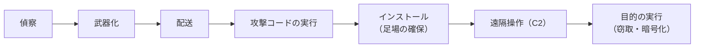

# 11.1 セキュリティの基本原則と脅威モデリング

> 「うちのシステムは安全ですか？」という問いには、そのままでは答えられません。安全とは「誰から・何を・どの程度守るか」を決めて初めて意味を持つ、相対的で終わりのない性質だからです。この章では、セキュリティを「気合い」や「勘」ではなく、守るべきものを定め、脅威を体系的に洗い出し、リスクとして測り、原則に沿って設計する工学として扱う土台をつくります。

| 項目 | 内容 |
|---|---|
| 学習時間の目安 | 本文 4h ＋ 演習 4h |
| 前提となる章 | なし（[9.1 ソフトウェアアーキテクチャの基礎](../../09-architecture/01-architecture-fundamentals/README.md) を学んでいると理解が深まります） |
| 演習 | [exercises/](exercises/)（Python） |
| キーワード | CIA, リスク, ALE, モンテカルロ, キルチェーン, ATT&CK, 設計原則, 多層防御, ゼロトラスト, 脅威モデリング, STRIDE, 攻撃ツリー, セキュリティ文化 |

## この章のゴール

- [ ] 機密性・完全性・可用性（CIA）に真正性・否認防止を加えたセキュリティの目標を使って、あるシステムで守るべきものを具体的に言語化できる
- [ ] リスクを「発生可能性 × 影響度」として定性的に、また ALE や損失の分布として定量的に見積もり、対策の優先順位と投資判断を説明できる
- [ ] 攻撃のライフサイクル（キルチェーン、MITRE ATT&CK）を使って、どの段階で検知・阻止するかを議論できる
- [ ] Saltzer と Schroeder の設計原則、多層防御、ゼロトラスト、攻撃対象領域の削減を使って、設計レビューで具体的な指摘ができる
- [ ] DFD と STRIDE でシステムの脅威を体系的に洗い出し、リスクスコアで優先順位を付けた対策リストを作れる（演習でも実装する）
- [ ] 脅威モデリングをチームの開発プロセスに組み込む方法を説明できる
- [ ] ソーシャルエンジニアリングと人的要因を踏まえ、「人を責める」のではなく「仕組みで守る」設計とセキュリティ文化を提案できる

## なぜ学ぶのか

セキュリティ事故は、高度なゼロデイ攻撃よりも「基本の欠落」と「想定していなかった経路」から起きることの方が圧倒的に多いのが現実です。

- **設計段階で防げたはずの事故**: 2019 年に公表された Capital One の情報漏えいでは、同社の発表によれば米国の約 1 億人とカナダの約 600 万人の個人情報が流出しました。刑事訴追の資料や各種の分析によれば、設定に不備のあったファイアウォールを経由して、クラウドのメタデータサービスから一時的な認証情報が取得され、その認証情報に与えられていた広すぎる権限でストレージのデータが読み出されたとされています（SSRF と呼ばれる手法。[11.4 Webアプリケーションセキュリティ](../04-web-security/README.md)）。「最小権限」「攻撃対象領域の削減」という原則が設計に織り込まれていれば、被害の範囲は大きく変わったはずです。
- **防御の機会はいくつもあった**: 2013 年の米小売大手 Target の事件では、同社の発表によればカード情報約 4,000 万件と約 7,000 万人分の顧客情報が流出しました。米国上院商業委員会のスタッフによる報告書「A "Kill Chain" Analysis of the 2013 Target Data Breach」（2014 年）は、取引先の空調業者から盗まれた認証情報が侵入の起点となったこと、そして攻撃の途中の複数の段階に阻止の機会があり、検知システムの警告も活かされなかったことを指摘しています。攻撃は「一発で決まる」のではなく段階を踏む、という理解が防御の設計を変えます。
- **人間が最も狙われる**: IPA の「情報セキュリティ10大脅威 2026［組織編］」（2026 年 1 月公開）では、1 位が「ランサム攻撃による被害」、2 位が「サプライチェーンや委託先を狙った攻撃」で、どちらも複数年にわたり上位を占めています。その入口の多くは、フィッシングや盗まれた認証情報です。2017 年には日本航空が、取引先を装った偽の請求メールで合計約 3 億 8,400 万円をだまし取られたと発表しました（ビジネスメール詐欺）。技術だけでなく、人と組織を守る仕組みが要ります。

この章で学ぶのは、個別の攻撃手法の暗記ではありません。「守るべきものを定め、攻撃者の視点で脅威を洗い出し、原則に沿って設計し、残ったリスクを測って意思決定し、組織として回し続ける」という、セキュリティのすべての土台になる考え方です。

## 1. セキュリティとは何か — 守るものを定める

### 1.1 基本の用語

議論がかみ合わない原因の多くは、言葉の混同です。まず 5 つの用語を区別します。

| 用語 | 意味 | 例 |
|---|---|---|
| 資産（asset） | 守る価値があるもの | 顧客の個人情報、決済機能、ソースコード、ブランドへの信頼 |
| 脅威（threat） | 資産に害を与えうる事象・主体 | 認証情報を盗む攻撃者、内部不正、設定ミス、災害 |
| 脆弱性（vulnerability） | 脅威に悪用されうる弱点 | 認可チェックの漏れ、パッチの当たっていないサーバー、弱いパスワード |
| リスク（risk） | 脅威が脆弱性を突いて資産に害を与える可能性と、その大きさ | 「未修正の脆弱性が突かれ、顧客情報が漏えいする可能性」 |
| 管理策（control） | リスクを下げる対策 | 多要素認証、パッチ適用、暗号化、監視、教育、契約 |

「脆弱性があるから危険だ」だけでは不十分で、「どの脅威が」「どの資産に」「どれくらいの可能性と大きさで」害を与えるか（リスク）まで言語化して初めて、対策の優先順位が付けられます。

### 1.2 3 つの基本目標（CIA）

情報セキュリティが守ろうとするものは、古典的に 3 つに整理されます。頭文字をとって **CIA トライアド** と呼びます。

| 目標 | 意味 | 破られると | 主な対策 |
|---|---|---|---|
| 機密性（Confidentiality） | 認可された人だけが情報を読める | 情報漏えい | 暗号化、アクセス制御、データの最小化 |
| 完全性（Integrity） | 情報が正しく、勝手に改ざんされない | データ改ざん、不正送金 | 署名、MAC、入力検証、変更権限の限定 |
| 可用性（Availability） | 必要なときに使える | サービス停止 | 冗長化、レート制限、バックアップ |

この 3 つは、しばしば **互いに緊張関係** にあります。機密性を高めるために暗号化を厳しくすると、鍵をなくしたときに復旧できなくなる（可用性の低下）。完全性を守るために改ざん検知でエラーを厳しく弾くと、軽微な破損でもサービスが止まる。セキュリティ設計とは、この 3 つのバランスを、守る対象ごとに決めていく作業です。決済データなら完全性と機密性、ニュースサイトの記事なら完全性と可用性、というように、重みは資産によって違います。

### 1.3 CIA だけでは足りない — 真正性と否認防止

現代のシステムでは、さらに 2 つが重要になります。

- **真正性（Authenticity）**: 「その相手が本当に主張どおりの人・システムか」。なりすましを防ぐ性質で、認証（[11.3 認証と認可](../03-authn-authz/README.md)）と署名（[11.2 暗号技術の基礎](../02-cryptography/README.md)）が支えます。
- **否認防止（Non-repudiation）**: 「後から『やっていない』と言い逃れできない」こと。電子署名や、改ざんできない監査ログが支えます。送金の指示や契約の電子化では、この性質が法的な意味を持ちます。

これに **責任追跡性（accountability）** —— 誰が何をしたかを後から追えること —— を加えた枠組みで考えると、第 5 節の STRIDE の 6 分類が、ちょうどこれらの裏返しになっていることが見えてきます。

### 1.4 「安全」は脅威モデルに対して相対的

「安全か」に答えるには、前提となる **脅威モデル**（どんな攻撃者が、何を狙い、どこまでできると想定するか）が必要です。次の 1 文を書けるかどうかが、議論の出発点です。

```text
このシステムは、［想定する攻撃者］から、［守る資産］を、［どの程度（何を許容し、何を許容しないか）］守る。
例: この経費精算サービスは、インターネット上の不特定の攻撃者と、他テナントの利用者から、
    各社の経費データと振込指示の完全性・機密性を守る。国家レベルの標的型攻撃は想定の範囲外とし、
    その前提は年 1 回見直す。
```

最後の「範囲外」を明記することも大切です。想定しないものを明文化しておけば、状況が変わったとき（たとえば防衛関連の顧客を獲得したとき）に、前提を見直すきっかけになります。

## 2. リスクで考える

### 2.1 リスク = 発生可能性 × 影響度

すべての脅威に完璧に対処する予算も時間もありません。だから **限られた資源を、最も重要なリスクから順に投じる** 必要があります。そのための基本の式が次の通りです。

```text
リスク = 発生可能性（likelihood） × 影響度（impact）
```

実務では、発生可能性と影響度をそれぞれ 5 段階で見積もり、掛け算したスコアを **ヒートマップ** に置いて色分けします（演習 `risk_register.py` の区分）。

```text
影響度 →      1     2     3     4     5
発生可能性 5 │  5    10    15    20    25      1〜4  : 低（受容しうる）
          4 │  4     8    12    16    20      5〜9  : 中（計画的に対応）
          3 │  3     6     9    12    15      10〜16: 高（優先して対応）
          2 │  2     4     6     8    10      17〜25: 重大（直ちに対応・経営判断）
          1 │  1     2     3     4     5
```

### 2.2 定性的評価とリスク登録簿

組織としてリスクを管理するには、**リスク登録簿（リスクレジスター）** に一元的に記録します。重要なのは、各リスクに **オーナー**（対応と受容を決める責任者）を置き、対策前の **固有リスク** と対策後の **残存リスク** を分けて記録することです。

| ID | リスク | オーナー | 固有（L×I） | 主な対策 | 残存（L×I） | 判断 |
|---|---|---|---|---|---|---|
| R-01 | ランサムウェアで基幹業務が停止する | CIO | 4×5=20 | 全社 MFA、パッチ管理、オフラインバックアップ | 2×5=10 | 追加対策（復旧訓練） |
| R-02 | 退職者アカウントからの情報持ち出し | 人事部長 | 3×4=12 | 退職時のアカウント棚卸し | 2×4=8 | 受容（四半期レビュー） |
| R-03 | クラウドの設定ミスによるデータ公開 | CTO | 3×5=15 | 設定の自動検査（CSPM） | 2×5=10 | 追加対策 |

独立した対策を重ねたときの効果は、「足し算」ではなく「すり抜ける確率の掛け算」で考えます。効果 50% の対策と 40% の対策を重ねると、すり抜ける確率は 0.5 × 0.6 = 0.3 で、合計の効果は 70% です（50% + 40% = 90% ではありません）。この計算とヒートマップ、上位リスクの報告表は、演習 `risk_register.py` で実装します。

### 2.3 定量的評価 — SLE と ALE

経営に説明するときは、金額で見積もることがあります。古典的な指標は次の 2 つです。

```text
SLE（単一損失予想額）= 資産価値 AV × 暴露係数 EF    … 1 回の事故でいくら失うか
ALE（年間予想損失額）= SLE × ARO（年間発生率）      … 1 年あたりの損失の期待値
```

顧客データベース（資産価値 5,000 万円相当）が漏えいすると 4 割の価値が損なわれ（EF = 0.4）、そうした事故が 4 年に 1 回起きる（ARO = 0.25）と見積もるなら、SLE は 2,000 万円、ALE は 500 万円です。年間 150 万円の対策で発生率を 5 分の 1 に下げられるなら、ALE は 100 万円に下がり、差し引き 250 万円の価値がある、と議論できます。

### 2.4 平均だけを見ない — 損失の分布を見る

ALE は分かりやすい反面、**「平均」しか表さない** という大きな弱点があります。セキュリティ事故の損失は、ほとんどの年はゼロで、まれに巨額になる、という **裾の重い分布** をしています。平均値だけでは、経営が本当に気にすべき「最悪の年」が見えません。

そこで、発生回数と 1 件あたりの損失を確率分布で表し、何万年分もシミュレーションして損失の分布を眺める、という方法（モンテカルロ法）がよく使われます。FAIR（Factor Analysis of Information Risk）と呼ばれるリスク定量化の枠組みも、この考え方に立っています。

```python
import math
import random

rng = random.Random(2026)

def simulate_year() -> float:
    """1 年分の損失（円）を 1 回シミュレーションする。"""
    # 事故の発生: 平均で年 0.3 回（到着間隔が指数分布 = 件数がポアソン分布）
    losses, t = 0.0, rng.expovariate(0.3)
    while t < 1.0:
        # 1 件あたりの損失: 中央値 2,000 万円の対数正規分布（ばらつきが大きく、裾が重い）
        losses += rng.lognormvariate(math.log(20_000_000), 1.0)
        t += rng.expovariate(0.3)
    return losses

years = sorted(simulate_year() for _ in range(100_000))
mean = sum(years) / len(years)
def pct(p): return years[int(p / 100 * (len(years) - 1))]
print(f"年間損失の平均（≒ALE）: {mean / 1e4:,.0f} 万円")
print(f"中央値: {pct(50) / 1e4:,.0f} 万円 / 90%点: {pct(90) / 1e4:,.0f} 万円 / 99%点: {pct(99) / 1e4:,.0f} 万円")
print(f"年間損失が 1 億円を超える確率: {sum(y > 1e8 for y in years) / len(years):.1%}")
```

```text
年間損失の平均（≒ALE）: 988 万円
中央値: 0 万円 / 90%点: 3,167 万円 / 99%点: 13,543 万円
年間損失が 1 億円を超える確率: 1.9%
```

平均（ALE）は約 1,000 万円ですが、**中央値は 0 円**（大半の年は何も起きない）で、**100 年に 1 度の悪い年には 1.3 億円を超えます**。「期待損失 1,000 万円」とだけ報告すると、経営は「毎年 1,000 万円ほどかかる」と誤解しがちです。実際には「ほとんどの年は無事だが、50 年に 1 度くらい 1 億円を超える損失が出る」と伝える方が、保険（リスク移転）の検討や手元資金の判断に役立ちます。

### 2.5 対策の選び方 — 頻度を下げるか、影響を下げるか

同じモデルで、性質の違う 2 つの対策を比べてみます。対策 A（多要素認証とパッチ管理の徹底など）は事故の **頻度** を 60% 下げ、対策 B（変更不能なバックアップとネットワーク分割など）は 1 件あたりの **損失** を半分にする、と仮定します（数字は説明のための仮定です）。

```python
import math
import random

def simulate(rate: float, median: float, years: int = 100_000, seed: int = 2026) -> list[float]:
    """年間の事故件数がポアソン分布（平均 rate）、1 件の損失が対数正規分布（中央値 median）のときの年間損失。"""
    rng = random.Random(seed)
    out = []
    for _ in range(years):
        total, t = 0.0, rng.expovariate(rate)
        while t < 1.0:
            total += rng.lognormvariate(math.log(median), 1.0)
            t += rng.expovariate(rate)
        out.append(total)
    return sorted(out)

def summary(label: str, losses: list[float], annual_cost: float) -> None:
    mean = sum(losses) / len(losses)
    p99 = losses[int(0.99 * (len(losses) - 1))]
    over = sum(x > 1e8 for x in losses) / len(losses)
    print(f"{label:<28} 期待損失 {mean / 1e4:6,.0f} 万円  99%点 {p99 / 1e4:7,.0f} 万円  "
          f"1億円超 {over:5.1%}  対策費 {annual_cost / 1e4:4,.0f} 万円")

base = simulate(0.3, 20_000_000)
summary("対策なし", base, 0)
summary("A: 発生頻度を 60% 減らす", simulate(0.3 * 0.4, 20_000_000), 3_000_000)
summary("B: 1 件の損失を半分にする", simulate(0.3, 10_000_000), 2_000_000)
```

```text
対策なし                         期待損失    988 万円  99%点  13,543 万円  1億円超  1.9%  対策費    0 万円
A: 発生頻度を 60% 減らす             期待損失    391 万円  99%点   8,066 万円  1億円超  0.7%  対策費  300 万円
B: 1 件の損失を半分にする              期待損失    494 万円  99%点   6,772 万円  1億円超  0.4%  対策費  200 万円
```

期待損失の削減額から対策費を引いた「純便益」は、A が 988 − 391 − 300 ≈ 297 万円、B が 988 − 494 − 200 ≈ 294 万円で、ほぼ同じです。しかし **99% 点や「1 億円超の確率」で見ると、B の方が裾（最悪の年）を大きく削っています**。A は「事故が起きる年を減らす」対策、B は「起きても致命傷にしない」対策で、性質が違うのです。事業の存続に関わる損失を避けたいなら B を優先する、という判断もありえます。

この分析から得られる教訓は 3 つです。

1. **頻度を下げる対策（予防）と影響を下げる対策（被害の局所化・復旧）は、組み合わせて初めて効く**。予防だけに投資する組織は、「起きたとき」に脆い。
2. **平均だけでなく裾を見る**。取締役会が知りたいのは「最悪どうなるか」であることが多い（[14.4 経営陣・取締役会・投資家とのコミュニケーション](../../14-cto/04-executive-communication/README.md)）。
3. **入力の数字は当てずっぽうになりがち**。だから「発生率が 2 倍だったら結論は変わるか」と数字を振ってみる（感度分析）ことで、結論の頑健さを確かめる。

### 2.6 リスク対応の 4 つの選択肢

リスクへの対応は、対策を講じること（低減）だけではありません。

| 選択肢 | 意味 | 例 |
|---|---|---|
| 低減（mitigate） | 管理策で発生可能性か影響度を下げる | MFA の導入、バックアップ、暗号化 |
| 移転（transfer） | 損失の一部を他者に移す | サイバー保険、責任分担を明記した委託契約 |
| 回避（avoid） | リスクの原因となる活動をやめる | 不要な個人情報を収集しない、危険な機能を提供しない |
| 受容（accept） | 残存リスクを理解したうえで受け入れる | 影響が小さく、対策費が見合わないリスク |

特に見落とされがちなのが **回避** です。「クレジットカード番号を自社で保存しない（決済代行に任せる）」「使っていない個人情報は削除する」は、どんな暗号化より確実な対策です。そして **受容** は、「何もしない」こととは違います。誰が（リスクオーナーが）、どんな根拠で、いつまで受け入れるかを記録し、期限が来たら見直します。組織が受け入れてよいリスクの水準（**リスク許容度、risk appetite**）を経営が決めておくことが、現場の判断を速くします（[14.5 ガバナンス・リスク・コンプライアンスと法務](../../14-cto/05-governance-risk-compliance/README.md)）。

### 2.7 脅威アクターと動機

「誰から守るか」を明確にすると、対策の優先順位が定まります。攻撃者（脅威アクター）は動機も能力も大きく異なります。

| アクター | 主な動機 | 能力・特徴 |
|---|---|---|
| 愉快犯・機会主義的な攻撃者 | 腕試し、いたずら | 公開ツールで既知の脆弱性を機械的に探す。数は非常に多い |
| サイバー犯罪組織 | 金銭 | ランサムウェア、フィッシング、認証情報の売買。分業化・サービス化（RaaS）が進む |
| 内部関係者 | 金銭、恨み、過失 | 正規のアクセス権を持つ。検知が難しい。過失（誤送信・設定ミス）も含む |
| ハクティビスト | 主義・主張 | 情報の暴露や DDoS、Web の改ざん |
| 国家の支援を受けた集団（APT） | 諜報、破壊 | 潤沢な資源と長期の潜伏。特定の組織を執拗に狙う |

どのアクターを想定するかで、必要な対策の水準は桁違いに変わります。**多くの組織にとって、まず守るべきは「自動化された、広く浅い攻撃」と「内部の過失」** です。基本（多要素認証・パッチ・バックアップ・最小権限）を固めることが、最も費用対効果の高い防御になります。

## 3. 攻撃のライフサイクルと防御の機会

防御を設計するには、攻撃がどう進むかを知る必要があります。攻撃は一発で決まるのではなく、複数の段階を踏みます。**各段階に「検知」と「阻止」の機会がある** というのが、この節の要点です。

### 3.1 サイバーキルチェーン — 段階ごとに断ち切る

Lockheed Martin の研究者が 2011 年の論文で示した **サイバーキルチェーン（Cyber Kill Chain）** は、侵入型の攻撃を 7 つの段階で捉えます。防御側にとっての意味は、「どこか 1 つの段階を断ち切れば、攻撃は目的を達成できない」という発想です。



| 段階 | 防御側の主な打ち手（検知・阻止・被害の軽減） |
|---|---|
| 偵察 | 公開する情報の最小化、自社の攻撃対象領域（公開サーバー・漏えいした認証情報）の把握 |
| 武器化 | 防御側からは直接見えない。脅威インテリジェンスで攻撃者の手口を知る |
| 配送 | メールのフィルタリング、添付ファイルの無害化、Web アクセスの制限 |
| 攻撃コードの実行 | パッチ適用、マクロの無効化、EDR による挙動の検知 |
| インストール | アプリケーションの許可リスト、管理者権限の最小化、EDR |
| 遠隔操作（C2） | 外向き通信の制限（プロキシ・送信先の許可リスト）、DNS の監視 |
| 目的の実行 | データの暗号化と最小化、大量持ち出しの検知（DLP）、変更不能なバックアップ |

キルチェーンは「外部からの侵入とマルウェア」を想定したモデルなので、内部不正やクラウドの設定ミスによる漏えいには当てはまりにくい、という限界もあります。

### 3.2 MITRE ATT&CK — 防御の網羅性を点検する共通言語

**MITRE ATT&CK** は、実際に観測された攻撃者の **戦術（Tactics: 何を達成したいか）** と **技術（Techniques: どうやって達成するか）** を体系化した知識ベースです。企業向けの ATT&CK は、次の 14 の戦術で整理されています（2026 年時点）。

| 戦術 | 防御側が自問すること |
|---|---|
| 偵察（Reconnaissance） | 自社について何が公開されているか把握しているか |
| 資源開発（Resource Development） | 自社を装ったドメインや偽サイトを監視しているか |
| 初期アクセス（Initial Access） | フィッシング対策、公開サーバーのパッチ、MFA は十分か |
| 実行（Execution） | 不審なスクリプトやプロセスの実行を検知できるか |
| 永続化（Persistence） | 新しいアカウントや自動起動の設定の追加に