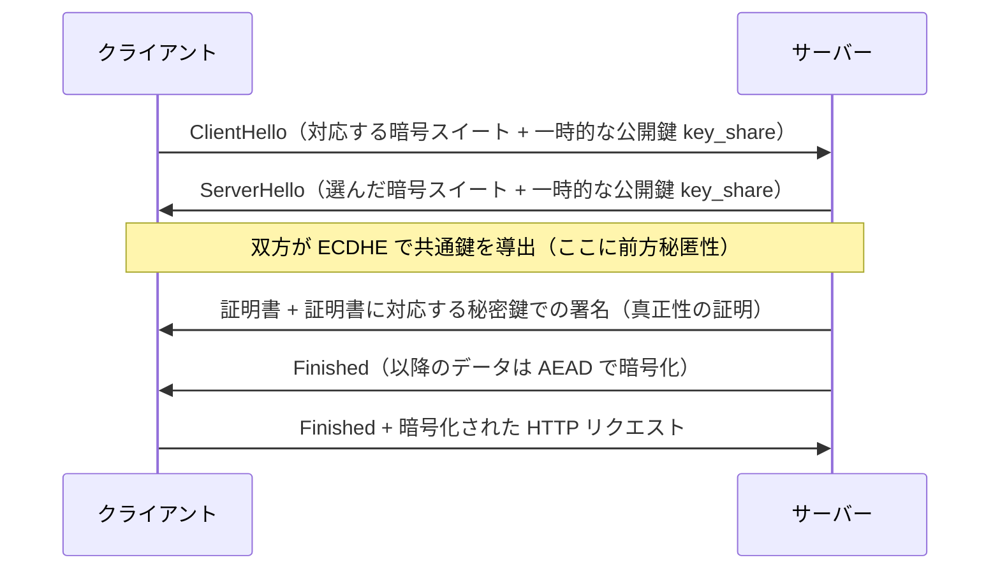
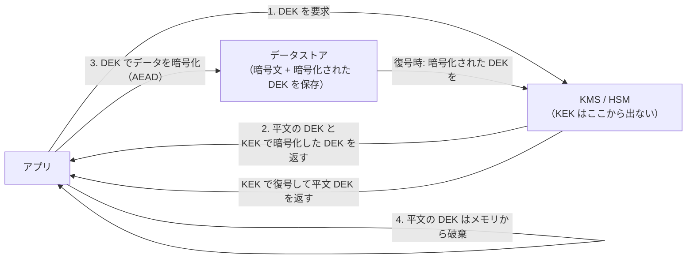

# 11.2 暗号技術の基礎

> パスワードはどう保存すべきか。通信はなぜ盗聴・改ざんされないのか。なぜ「自作の暗号」は使ってはいけないのか。暗号は魔法ではなく、限られた数の道具（対称暗号・ハッシュ・公開鍵）を、正しい組み合わせと正しいパラメータで使う工学です。この章では、それぞれの道具が「何を保証し、何を保証しないか」を理解し、正しく選べるようになることを目指します。

| 項目 | 内容 |
|---|---|
| 学習時間の目安 | 本文 4h ＋ 演習 5h |
| 前提となる章 | [1.1 情報の表現](../../01-computer-systems/01-data-representation/README.md)、[11.1 セキュリティの基本原則](../01-security-principles/README.md) |
| 演習 | [exercises/](exercises/)（Python） |
| キーワード | AES, AEAD, GCM, ハッシュ, HMAC, RSA, 楕円曲線, 鍵交換, 前方秘匿性, Argon2, 耐量子暗号 |

## この章のゴール

- [ ] 対称暗号・ハッシュ・公開鍵暗号がそれぞれ何を保証するか（機密性・完全性・真正性）を説明できる
- [ ] AEAD（GCM・ChaCha20-Poly1305）を「なぜ暗号化だけでは不十分か」とともに説明し、ECB や nonce 再利用の危険を指摘できる
- [ ] ハッシュの 3 つの耐性と、MD5/SHA-1 が破られた意味、HMAC が長さ拡張攻撃を防ぐ仕組みを説明できる
- [ ] 公開鍵暗号・鍵交換・署名の役割と、前方秘匿性（forward secrecy）の意味を説明できる
- [ ] パスワードを「ソルト付きの遅いハッシュ（Argon2id など）」で保存し、乱数には `secrets` を使う理由を説明・実装できる
- [ ] 耐量子暗号（PQC）への移行がなぜ今始まっているか（"harvest now, decrypt later"）を説明できる

## なぜ学ぶのか

暗号の失敗は、静かに、しかし壊滅的に効きます。

- **パスワードの保存ミス**: 過去の大規模な漏えい事件では、パスワードが平文や、ソルトなしの MD5・SHA-1 で保存されていた例が繰り返し報告されています。ソルトなしの高速ハッシュは、レインボーテーブルや GPU による総当たりで、流出後ほぼ即座に解読されます。正しくは「ソルト付きの、わざと遅いハッシュ（Argon2id など）」で保存します。この違いが、漏えいが「大惨事」になるか「まだ持ちこたえられる」かを分けます。
- **壊れたハッシュを使い続ける**: 2017 年、Google と CWI Amsterdam は **SHAttered** 攻撃で、異なる内容なのに同じ SHA-1 ハッシュを持つ 2 つの PDF を実際に作って見せました。MD5 の衝突はそれ以前から悪用され、2012 年の Flame マルウェアは MD5 衝突を突いて Microsoft の署名を偽造しました。「まだ動いているから」と壊れたハッシュを使い続けることの危険を示しています。
- **自作暗号と誤用**: 暗号アルゴリズム自体は堅牢でも、使い方を誤ると簡単に破れます。ECB モードでの暗号化（パターンが漏れる）、nonce（使い捨ての値）の再利用、非定数時間の比較（タイミング攻撃）。これらは「暗号を使っているのに安全でない」典型例で、この章で実際に攻撃を再現して理解します。

暗号は「難しいから避ける」のではなく、「正しく使うための最小限の理解」を持つことが重要です。細部の実装は検証済みライブラリに任せますが、**どの道具をどう組み合わせ、どのパラメータを選ぶか** はエンジニアが判断せねばなりません。

> ⚠️ **この章の演習で作る暗号（教科書的 RSA・toy Feistel 暗号）は、教育目的であり、本番では絶対に使わないでください。** 仕組みを理解するために意図的に単純化・弱体化しています。本番では、必ず検証済みのライブラリ（Python なら `cryptography` など）を、この章で学ぶ正しい設定で使います。

## 1. 暗号の目標とケルクホフスの原則

暗号技術が提供するのは、主に次の 4 つです。どの道具が何を提供するかを取り違えないことが第一歩です。

| 目標 | 提供する道具 | 提供しない例 |
|---|---|---|
| 機密性（読まれない） | 対称暗号、公開鍵暗号 | ハッシュは機密性を提供しない |
| 完全性（改ざんされない） | MAC、署名、AEAD | 素の暗号化は完全性を保証しない |
| 真正性（相手が本物） | MAC、署名 | 素のハッシュは真正性を保証しない |
| 否認防止（後で否定できない） | 電子署名（公開鍵） | MAC は否認防止にならない（鍵を共有するため） |

**ケルクホフスの原則（Kerckhoffs's principle）**: 暗号システムは、鍵以外のすべて（アルゴリズム、実装）が公知になっても安全でなければなりません。これが「自作の秘密アルゴリズムに頼るな、公開され検証されたアルゴリズムを使え」という鉄則の根拠です。世界中の暗号研究者が何年も攻撃を試みて破れなかったアルゴリズムだけが、信頼に値します。

## 2. 対称暗号 — 同じ鍵で暗号化・復号

### 2.1 AES と、ブロック暗号の「利用モード」

**対称暗号（symmetric cryptography）** は、暗号化と復号に同じ鍵を使います。現代の標準は **AES**（Advanced Encryption Standard、鍵長 128/192/256 ビット）で、16 バイト（128 ビット）の「ブロック」単位でデータを変換する **ブロック暗号** です。

しかしブロック暗号そのものは「16 バイトを別の 16 バイトに変換する」だけです。任意の長さのデータをどう暗号化するかを決めるのが **利用モード（mode of operation）** で、ここに落とし穴があります。

### 2.2 ECB モードはなぜ危険か

最も素朴な **ECB（Electronic Codebook）モード** は、データをブロックに分け、各ブロックを独立に暗号化します。問題は **同じ平文ブロックが、常に同じ暗号文ブロックになる** ことです。すると、データの「模様」が暗号文に残ります。演習の toy 暗号で、同じ模様の行を含む「画像」を暗号化してみると、これが目に見えます。

```text
平文（16 バイト = 1 ブロックの行が並んだ「画像」）:
  ................    ← 行A
  ......####......    ← 行B
  ....########....    ← 行C
  ......####......    ← 行B（Aと同じ、Bと同じ行が再び現れる）
  ................    ← 行A

ECB で暗号化 → 同じ行は同じ暗号文になる:
  a3f1...  ← 行A の暗号文
  9c22...  ← 行B の暗号文
  71e8...  ← 行C の暗号文
  9c22...  ← 行B と同一！（模様が漏れる）
  a3f1...  ← 行A と同一！
```

演習の toy 暗号で重複ブロック数を数えると、この漏れが数字で見えます。

```text
（演習 block_modes.py の出力）
ECB 重複ブロック数: 2      ← 同じ平文ブロックが同じ暗号文になり、模様が残る
CTR 重複ブロック数: 0      ← 同じ平文でも位置ごとに違う暗号文になる
```

有名な「ECB ペンギン」（ペンギンの画像を ECB で暗号化すると、暗号化後もペンギンの輪郭が見える）は、この弱点を視覚的に示したものです。**ECB は使ってはいけません。**

### 2.3 CBC・CTR・そして AEAD

より安全なモードは、各ブロックの暗号化に「初期化ベクトル（IV）」や「カウンタ」を混ぜて、同じ平文でも違う暗号文になるようにします。

| モード | 特徴 | 注意 |
|---|---|---|
| CBC | 前のブロックの暗号文を次に混ぜる | IV はランダムに。パディングオラクル攻撃に注意 |
| CTR | カウンタを暗号化して鍵ストリームを作り XOR する | **nonce（カウンタの初期値）を絶対に再利用しない** |
| GCM | CTR に認証（改ざん検知）を加えた AEAD | nonce 再利用は致命的 |

ただし、CBC も CTR も **暗号化だけで、改ざんを検知できません**。演習でこれを攻撃として再現します（CTR の暗号文のビットを反転すると、鍵を知らなくても復号結果を書き換えられる）。だから現代では **AEAD（Authenticated Encryption with Associated Data、認証付き暗号）** を使うのが鉄則です。

### 2.4 AEAD — 暗号化と認証を一体で

**AEAD は「機密性（暗号化）」と「完全性・真正性（改ざん検知）」を一体で提供します。** 代表格が **AES-GCM** と **ChaCha20-Poly1305** です。復号時に認証タグを検証し、改ざんされていれば復号自体を拒否します。「関連データ（AD）」として、暗号化はしないが改ざんは検知したいデータ（ヘッダなど）も一緒に認証できます。

- **AES-GCM**: ハードウェアに AES 支援命令（AES-NI）がある環境で高速。広く使われる。
- **ChaCha20-Poly1305**: ソフトウェア実装が高速で、AES 支援のないモバイル端末などで有利。TLS でも広く採用されています。

**どちらも nonce（使い捨ての値）を絶対に再利用してはいけません。** 同じ鍵・同じ nonce で 2 つのメッセージを暗号化すると、鍵ストリームが同じになり、2 つの平文の XOR が漏れ、さらに GCM では認証鍵まで復元されて任意のメッセージを偽造できるようになります。これは「nonce 再利用は破滅的（catastrophic）」と呼ばれる、現実に何度も起きている失敗です。演習 `block_modes.py` で、nonce 再利用による平文の漏えいを実際に再現します。

### 2.5 IV / nonce のルール早見表

利用モードごとに、初期化ベクトル（IV）や nonce の扱いのルールが違います。ここを間違えると、アルゴリズムが堅牢でも破れます。

| モード | IV / nonce に求められる性質 | 再利用したら | 完全性 |
|---|---|---|---|
| ECB | （IV を使わない） | 常に同じ平文→同じ暗号文でパターンが漏れる | なし |
| CBC | 予測不可能（ランダム）であること | 同じ先頭ブロックが分かる。予測可能だと選択平文攻撃 | なし |
| CTR | 一意であればよい（ランダムでなくてよい） | 破滅的（鍵ストリームが再利用され平文の XOR が漏れる） | なし |
| GCM（AEAD） | 一意であること（96 ビット推奨） | 破滅的（平文漏えい＋認証鍵の復元→偽造） | あり |

ポイントは、**CTR と GCM の nonce は「秘密である必要はないが、同じ鍵で二度使ってはいけない」** ことです。カウンタ方式（1 ずつ増やす）か、十分に長い乱数（96 ビット以上）で一意性を確保します。大量に暗号化する場合、ランダムな nonce では誕生日のパラドックスで衝突しうるので（[2.2 確率・統計](../../02-math-and-algorithms/02-probability-statistics/README.md)）、鍵をこまめに変えるか、nonce を使い切る前にローテーションします。

### 2.6 本番での AEAD の使い方（概念コード）

演習では仕組みを学ぶために自作しますが、本番では検証済みライブラリの AEAD を使います。次は Python の `cryptography` パッケージ（標準ライブラリ外）を使う例です（この節は使い方を示す概念コードで、演習は標準ライブラリだけで動きます）。

```python
# 【本番向けの概念コード】pip install cryptography が必要
import os
from cryptography.hazmat.primitives.ciphers.aead import AESGCM

key = AESGCM.generate_key(bit_length=256)     # 32 バイトの鍵（KMS から取得するのが望ましい）
aead = AESGCM(key)
nonce = os.urandom(12)                          # 96 ビットの nonce。メッセージごとに新しく作る
aad = b"invoice-id:12345"                       # 認証するが暗号化しない付随データ（ヘッダなど）

ciphertext = aead.encrypt(nonce, b"amount=10000", aad)   # 末尾に 16 バイトの認証タグが付く
plaintext = aead.decrypt(nonce, ciphertext, aad)          # タグと AAD を検証。改ざんなら例外
# 保存・送信するのは (nonce, ciphertext, aad)。nonce は秘密でなくてよいが再利用しないこと
```

使い方の要点は 3 つです。第一に、`encrypt` の戻り値には暗号文と認証タグが含まれ、`decrypt` は改ざんや nonce・AAD の食い違いを検知すると **復号せずに例外を投げます**（だから「復号できた＝本物」と扱えます）。第二に、`nonce` はメッセージごとに一意にします。第三に、`aad`（関連データ）に「この暗号文が使われるべき文脈」（宛先 ID、バージョン、有効期限など）を入れておくと、暗号文を別の文脈で使い回す攻撃を防げます。

## 3. ハッシュ関数

### 3.1 3 つの耐性

**暗号学的ハッシュ関数** は、任意長の入力を固定長の値（ダイジェスト）に変換する一方向関数です。安全なハッシュには 3 つの耐性が求められます。

| 耐性 | 意味 |
|---|---|
| 原像計算困難性（preimage resistance） | ハッシュ値から元の入力を求められない |
| 第二原像計算困難性（second preimage resistance） | ある入力と同じハッシュになる別の入力を見つけられない |
| 衝突困難性（collision resistance） | 同じハッシュになる 2 つの入力の組を見つけられない |

衝突困難性が最も破られやすい（誕生日のパラドックスにより、n ビットのハッシュは約 2^(n/2) の試行で衝突が見つかる）ため、ハッシュの実効的な強度は出力長の半分です。SHA-256 の衝突耐性は約 128 ビット相当です。

```text
（Python 標準ライブラリでの確認）
>>> import hashlib
>>> hashlib.sha256(b"abc").hexdigest()
'ba7816bf8f01cfea414140de5dae2223b00361a396177a9cb410ff61f20015ad'
```

### 3.2 使ってよいハッシュ、いけないハッシュ

- **使ってよい**: SHA-256 / SHA-512（SHA-2 ファミリー）、SHA-3。BLAKE2/BLAKE3 も高速で安全。
- **使ってはいけない（衝突が現実に作れる）**: **MD5**、**SHA-1**。前述の SHAttered（2017）で SHA-1 の衝突が実証され、MD5 はそれ以前から破られています。署名・証明書・整合性チェックには決して使いません。

注意: これは「衝突困難性が必要な用途」の話です。HMAC のように衝突困難性に依存しない使い方では、SHA-1 は今のところ実用上安全とされますが、新規設計では SHA-256 以上を選ぶべきです。

### 3.3 MAC と HMAC、そして長さ拡張攻撃

ハッシュは「改ざん検知」に使えそうですが、**素のハッシュ `H(メッセージ)` は、誰でも再計算できる** ので、真正性を保証しません。攻撃者はメッセージもハッシュも書き換えられます。

そこで **MAC（Message Authentication Code）** を使います。秘密鍵を知っている者だけが正しい MAC を計算・検証できます。ここで素朴に `H(鍵 ‖ メッセージ)` としてはいけません。SHA-256 のような **Merkle–Damgård 構造** のハッシュには **長さ拡張攻撃（length extension attack）** があり、攻撃者は鍵を知らなくても「元のメッセージ ＋ パディング ＋ 追加データ」に対する正しい MAC を計算できてしまうからです。

長さ拡張攻撃を具体的に見てみましょう。SHA-256 は 64 バイトのブロックを処理し、**内部状態がそのまま最終出力になる** ので、攻撃者は `H(鍵 ‖ メッセージ)` の値を「途中経過」として、続きを計算できます。攻撃者が鍵を知らなくても、鍵の長さを推測できれば、サーバーが内部で足すパディングを再現して、末尾に任意のデータを追加した正しい MAC を作れます。

```python
import hashlib

# サーバーが H(鍵 ‖ メッセージ) を「MAC」として発行しているとする（これが誤り）
secret = b"SUPER_SECRET_KEY"                       # 攻撃者は知らない（長さ 16 だけ推測）
message = b"amount=100&to=alice"
# 攻撃者は message と、SHA-256 のパディング規則を使って「のり」を作る
def sha256_padding(msglen):
    return b"\x80" + b"\x00" * ((55 - msglen) % 64) + (msglen * 8).to_bytes(8, "big")
glue = sha256_padding(len(secret) + len(message))
forged = message + glue + b"&admin=true"           # 末尾に権限昇格のパラメータを追加
# 本物のツール（hashpumpy 等）なら鍵なしで forged の MAC を計算できる。
# ここでは、サーバーが素直に検証したとき一致することを確かめる:
print(hashlib.sha256(secret + forged).hexdigest()[:32], "... と一致する MAC を鍵なしで作れる")
```

```text
8f7cb9044158bc8d75e961d7ab28f440 ... と一致する MAC を鍵なしで作れる
```

正しい MAC は **HMAC** です。`HMAC(K, m) = H((K ⊕ opad) ‖ H((K ⊕ ipad) ‖ m))` という二重構造により、外側のハッシュの内部状態が攻撃者に渡らないので、長さ拡張攻撃を防ぎます。演習 `hmac_impl.py` で HMAC-SHA256 を RFC 4231 のテストベクタに照らして実装し、長さ拡張攻撃の「のり」となる SHA-256 のパディングも実装します。なお、SHA-3 や BLAKE2 はこの構造上の弱点を持たないので、`H(鍵 ‖ メッセージ)` でも長さ拡張は起きません（それでも新規設計では HMAC か、鍵付きハッシュの正しい API を使うのが無難です）。

## 4. 公開鍵暗号

### 4.1 なぜ公開鍵が必要か

対称暗号には「どうやって最初に鍵を共有するか」という根本問題があります。会ったこともない相手と、盗聴されている通信路の上で、どうやって共通の鍵を安全に決めるのか。これを解くのが **公開鍵暗号（public-key / asymmetric cryptography）** です。各主体は「公開鍵（誰でも知ってよい）」と「秘密鍵（本人だけが持つ）」の対を持ちます。

### 4.2 RSA と楕円曲線（ECC）

- **RSA**: 「大きな合成数の素因数分解は難しい」という仮定に基づきます。演習 `toy_rsa.py` で、拡張ユークリッドの互除法・Miller–Rabin 素数判定から鍵生成・暗号化・署名までを実装し、**教科書的 RSA（パディングなし）が可鍛（malleable）で危険なこと**（暗号文を細工して平文を 2 倍にできる、2 つの署名から第 3 の署名を偽造できる）を攻撃として再現します。だから本番では必ず OAEP（暗号化）や PSS（署名）といったパディングを使います。RSA の数論的な背景（合同・モジュラ逆元）は [2.1 離散数学](../../02-math-and-algorithms/01-discrete-math/README.md) につながります。
- **楕円曲線暗号（ECC）**: 「楕円曲線上の離散対数問題は難しい」という仮定に基づきます。RSA より **はるかに短い鍵で同等の強度** を実現できます。そのため現代の新しいシステムでは ECC（Curve25519 など）が主流です。

鍵の長さは、アルゴリズムごとに「同じ強度」の値が大きく異なります。「何ビットなら安全か」を鍵長の数字だけで比べてはいけません。

| 対称鍵の強度 | RSA / 有限体 DH の鍵長 | 楕円曲線（ECC）の鍵長 | 位置づけ |
|---|---|---|---|
| 112 ビット | 2048 ビット | 224 ビット | 最低ライン（RSA-2048 は 2030 年以降は非推奨の方向） |
| 128 ビット | 3072 ビット | 256 ビット | 現在の標準（AES-128、P-256、Curve25519 相当） |
| 192 ビット | 7680 ビット | 384 ビット | 高強度 |
| 256 ビット | 15360 ビット | 512 ビット | 最高強度（AES-256 相当） |

RSA で 256 ビット強度を得るには 15360 ビットもの鍵が必要で、計算が非現実的になります。ECC が主流になったのは、この効率の差が理由です（NIST SP 800-57 の対応表による、2026 年時点の目安）。

### 4.3 鍵交換と前方秘匿性

**Diffie–Hellman（DH）鍵交換** は、盗聴されている通信路の上で、双方が共通の秘密鍵を作り出す方法です。楕円曲線版が **ECDHE** です。

ここで重要な概念が **前方秘匿性（forward secrecy）** です。**通信のたびに使い捨ての鍵ペアで鍵交換すれば、後で長期の秘密鍵が漏れても、過去に録画された通信は復号できません。** ECDHE の "E"（ephemeral、一時的）がこれを表します。前方秘匿性は現代の TLS で標準的に使われ、後述する "harvest now, decrypt later" 攻撃への基本的な備えでもあります。

TLS 1.3 のハンドシェイクで、これがどう組み合わさるかを見てみましょう（詳細は [5.3 DNS・HTTP・TLS](../../05-networking/03-dns-http-tls/README.md)）。



ここでは 3 つの道具が役割分担しています。**ECDHE（鍵交換）** が通信ごとの共通鍵を作って前方秘匿性を与え、**署名（公開鍵）** がサーバーの真正性を証明し（証明書の持ち主だけが署名できる）、導出した共通鍵で **AEAD（対称暗号）** が実際のデータを高速に暗号化・認証します。「公開鍵は遅いが鍵共有と認証に使い、大量のデータは速い対称暗号で守る」という組み合わせは、TLS に限らず暗号システムの定石です。

### 4.4 電子署名

署名は暗号化の逆で、**秘密鍵で署名し、公開鍵で検証** します。「その人が確かにこのメッセージを承認した（真正性）」「後から否定できない（否認防止）」を提供します。

- **RSA-PSS**: RSA 署名の安全なパディング方式。
- **ECDSA**: 楕円曲線版。ただし署名ごとに使う乱数を再利用・予測されると秘密鍵が漏れる（2010 年の PlayStation 3 の署名鍵漏えいはこの失敗）。
- **Ed25519**: Curve25519 ベースの署名。決定的（乱数の失敗が起きない）で高速、実装ミスに強く、新規採用の第一候補。

証明書（PKI）と TLS での使われ方は [5.3 DNS・HTTP・TLS](../../05-networking/03-dns-http-tls/README.md) で詳しく扱います。

## 5. 鍵管理と乱数

### 5.1 鍵管理 — 暗号の一番弱いところ

アルゴリズムが堅牢でも、**鍵の管理がずさんなら意味がありません**。鍵をソースコードにハードコードする、Git にコミットする、といった事故は後を絶ちません（[11.5 セキュリティ運用とサプライチェーン](../05-security-operations/README.md) で秘密情報スキャンを扱います）。

- **KMS（Key Management Service）**: クラウドの鍵管理サービス。鍵を安全に保管し、鍵そのものを外に出さずに暗号化・復号を代行する。
- **HSM（Hardware Security Module）**: 鍵を物理的に取り出せないハードウェア。
- **エンベロープ暗号化（envelope encryption）**: データは「データ暗号鍵（DEK）」で暗号化し、その DEK を「鍵暗号鍵（KEK）」で暗号化する。KEK だけを KMS で厳重に守れば、大量のデータを効率よく守れる。

エンベロープ暗号化の流れは次の通りです。DEK は使い捨てで、KEK は KMS/HSM の中から出ません。



- **鍵のローテーション**: 鍵は定期的に、また漏えいが疑われたときに交換できる設計にしておきます。エンベロープ暗号化なら、**KEK を新しくして、各 DEK を「新しい KEK で暗号化し直す」だけ** で済み、巨大なデータ本体を再暗号化する必要はありません（DEK は変わらないため）。データ自体の鍵（DEK）を変えたい場合は、読み書きのタイミングで少しずつ入れ替える（lazy re-encryption）のが実務的です。鍵には「有効期間」と「用途」を決め、1 つの鍵を暗号化・署名など複数用途で使い回さないことも重要です。

### 5.2 乱数 — `random` を暗号に使わない

暗号鍵・nonce・トークン・ソルトには、**予測不可能な乱数（CSPRNG、暗号学的擬似乱数生成器）** が必要です。Python の `random` モジュールは高速ですが **予測可能** で、暗号用途には使ってはいけません。

```text
（Python での確認: random はシードが同じなら完全に再現する）
>>> import random
>>> random.Random(42).randrange(1000000)   # → 670487
>>> random.Random(42).randrange(1000000)   # → 670487（毎回同じ！）
```

同じシードから同じ列が出るということは、内部状態を推測されれば以降の値が全部読まれるということです。暗号用途では必ず **`secrets`** モジュール（OS の CSPRNG を使う）を使います。`secrets.token_bytes(32)`、`secrets.token_urlsafe()` など。演習でも、鍵やソルトの生成には `secrets` を使います（`toy_rsa.py` はテストの再現性のために `random` を使いますが、これは「本番では `secrets` を使う」と明記した例外です）。

## 6. パスワードの保存

パスワードは、この章で最も実務的で、最も間違えられているテーマです。原則は明快です。

1. **平文で保存しない**（当然）。
2. **高速なハッシュ（SHA-256 単体など）で保存しない**。GPU で毎秒数十億回計算でき、総当たりされる。
3. **ソルト（利用者ごとに異なるランダム値）を付ける**。同じパスワードが同じハッシュにならないようにし、レインボーテーブルを無効化する。
4. **わざと遅い（計算コストの高い）ハッシュを使う**。攻撃者の総当たりを現実的な時間で不可能にする。

「わざと遅いハッシュ」の選択肢（2026 年時点、OWASP Password Storage Cheat Sheet を参照）:

| アルゴリズム | 特徴 | パラメータの例（OWASP の最小推奨） |
|---|---|---|
| **Argon2id** | 第一候補。メモリも時間も消費し、GPU/ASIC に強い | m=19 MiB, t=2, p=1 |
| **scrypt** | メモリ困難性を持つ。標準ライブラリにある | N=2^17, r=8, p=1 |
| **bcrypt** | 実績が長い。ただし入力は 72 バイトまで | コスト係数 10 以上 |
| **PBKDF2** | FIPS 準拠が必要な場合。メモリ困難性はない | HMAC-SHA256 で 60 万回以上 |

パラメータ選びの勘所は、**「自社のサーバーで、ログイン 1 回あたり許容できる時間（数百ミリ秒程度が目安）になるよう、コストを上げられるだけ上げる」** ことです。標準ライブラリで実際に計ってみると、コストと時間の関係が見えます。

```python
import hashlib, time
for label, fn in [
    ("SHA-256 単体（保存には不適）", lambda: hashlib.sha256(b"password").digest()),
    ("PBKDF2-HMAC-SHA256 100,000 回", lambda: hashlib.pbkdf2_hmac("sha256", b"password", b"s"*16, 100_000)),
    ("PBKDF2-HMAC-SHA256 600,000 回", lambda: hashlib.pbkdf2_hmac("sha256", b"password", b"s"*16, 600_000)),
    ("scrypt N=2^14 (16 MiB)", lambda: hashlib.scrypt(b"password", salt=b"s"*16, n=2**14, r=8, p=1, maxmem=32*1024*1024)),
    ("scrypt N=2^17 (128 MiB)", lambda: hashlib.scrypt(b"password", salt=b"s"*16, n=2**17, r=8, p=1, maxmem=256*1024*1024)),
]:
    t = time.perf_counter(); fn(); print(f"{label:<32}{(time.perf_counter()-t)*1000:7.1f} ms")
```

```text
SHA-256 単体（保存には不適）                 0.0 ms   ← 攻撃者は毎秒数十億回試せる
PBKDF2-HMAC-SHA256 100,000 回          30.0 ms
PBKDF2-HMAC-SHA256 600,000 回         182.0 ms   ← OWASP 推奨。約 6,000 倍遅い
scrypt N=2^14 (16 MiB)                 44.3 ms
scrypt N=2^17 (128 MiB)               444.6 ms   ← メモリも 128 MiB 使うため GPU/ASIC に強い
```

SHA-256 単体は 0.0 ms（測定限界以下）で、攻撃者は漏えいしたハッシュを毎秒数十億回の速度で総当たりできます。一方、OWASP 推奨のパラメータは 1 回あたり数百ミリ秒かかるので、同じ総当たりが数億倍遅くなります。scrypt/Argon2id が PBKDF2 より優れるのは、時間だけでなく **メモリ** も消費するため、安価な並列ハードウェア（GPU・ASIC）での大量計算が割に合わなくなる点です（メモリ困難性）。

さらに **ペッパー（pepper）** を加えることもあります。ソルトが利用者ごとの公開値（ハッシュと一緒に保存する）なのに対し、ペッパーは全利用者共通の秘密値で、DB とは別の場所（KMS・HSM・環境変数など）に保管します。DB だけが漏れてもハッシュを解読しにくくする多層防御です。実装としては、遅いハッシュにかける前に `HMAC(pepper, password)` を通す形が安全です（bcrypt の 72 バイト制限を避ける効果もあります）。

演習 `passwords.py` では、`hashlib.scrypt`（使えなければ PBKDF2 にフォールバック）で、**アルゴリズム・パラメータ・ソルトを 1 つの文字列に埋め込む形式**（`$scrypt$ln=17,r=8,p=1$<ソルト>$<ハッシュ>`）で保存し、定数時間で検証し、パラメータが古くなったハッシュを検出して作り直す（`needs_rehash`）実装を作ります。この「パラメータを保存して後から強化できる」設計が実務では重要です。ログイン成功時（平文が手に入る唯一の機会）に、古いパラメータのハッシュを新しいパラメータで作り直すことで、ユーザーに負担をかけずに段階的に強化できます。

## 7. よくある誤用と、耐量子暗号

### 7.1 暗号のよくある誤用

- **自作の暗号を使う（roll your own crypto）**: 検証されていない暗号は、ほぼ必ず破れます。
- **ECB モード、静的な IV/nonce**: パターンが漏れ、nonce 再利用は破滅的。
- **非定数時間の比較**: MAC やトークンを `==` で比較すると、一致する先頭バイト数が処理時間に漏れ、1 バイトずつ推測される（タイミング攻撃）。`hmac.compare_digest` を使う。演習でも徹底します。
- **JWT のアルゴリズム混同**: `alg=none` を受理する、公開鍵を HMAC の鍵として使わせる、といった検証の手抜き（[11.3 認証と認可](../03-authn-authz/README.md) で攻撃として再現します）。

### 7.2 耐量子暗号（PQC）

大規模な量子コンピュータが実現すると、Shor のアルゴリズムにより **RSA と楕円曲線暗号は破られます**（対称暗号やハッシュは、鍵長・出力長を伸ばせば当面持ちこたえるとされる）。まだ実用的な量子コンピュータは存在しませんが、問題は **"harvest now, decrypt later"（今のうちに暗号文を収集し、将来解読する）** 攻撃です。今日盗聴・保存された通信が、数年後に解読される恐れがあるため、**長期間秘匿したいデータの移行は今から始める必要があります**。

NIST は 2024 年 8 月に最初の耐量子暗号標準を確定しました（2026 年時点）。

| 標準 | 通称 | 用途 |
|---|---|---|
| FIPS 203 | ML-KEM（CRYSTALS-Kyber） | 鍵カプセル化（鍵交換） |
| FIPS 204 | ML-DSA（CRYSTALS-Dilithium） | 電子署名 |
| FIPS 205 | SLH-DSA（SPHINCS+） | ハッシュベース署名（保守的な代替） |

実際の TLS では、**既存の楕円曲線と ML-KEM を組み合わせた「ハイブリッド鍵交換」**（X25519MLKEM768 など）の導入が 2025 年以降進んでいます。ハイブリッドにするのは、「万一 ML-KEM に未知の弱点が見つかっても、既存の X25519 の安全性は残る」という保険です。主要ブラウザや OpenSSL 3.5、OpenSSH 10 などが対応を進めており、NIST は移行の目安として量子に弱い公開鍵暗号（RSA・楕円曲線）を 2030 年以降は非推奨、2035 年以降は禁止とする方向を示していますが（NIST IR 8547 の草案、2026 年時点でドラフト）、状況は流動的なので採用時には一次情報で最新を確認してください。

CTO として今から着手できる **PQC 移行計画** は、次の順序です。

1. **暗号インベントリを作る**: どのシステムが、どこで、どの暗号アルゴリズム・鍵長・証明書を使っているかを棚卸しする。これができていない組織がほとんどで、移行の最大の障害はここです。
2. **暗号アジリティを確保する**: アルゴリズムをコードにハードコードせず、設定で差し替えられる構造にする。証明書や鍵の更新を自動化しておく。
3. **優先順位を付ける**: "harvest now, decrypt later" のリスクが高いもの——長期間秘匿すべきデータ（医療・国家機密・長期契約）を扱う通信——から、ハイブリッド鍵交換に移す。署名（PQC 署名は鍵・署名が大きい）は、危殆化の緊急度が鍵交換より低いので後回しでよいことが多い。
4. **サプライチェーンに要求する**: 使っているライブラリ・製品・クラウドが PQC 対応の計画を持っているかを確認する（[11.5](../05-security-operations/README.md)）。

### 7.3 保存時・通信時・処理中の暗号化

- **通信時の暗号化（in transit）**: TLS。ネットワーク上の盗聴・改ざんを防ぐ。
- **保存時の暗号化（at rest）**: ディスク・DB・バックアップの暗号化。物理的な媒体の盗難に備える。
- **処理中の暗号化（in use）**: メモリ上のデータも守る（機密コンピューティング、準同型暗号など）。まだ発展途上だが、規制の厳しい分野で使われ始めている。

## よくある落とし穴

1. **自作の暗号やプロトコルを使う**。「独自だから解読されない」は隠蔽によるセキュリティ。検証済みライブラリを、正しい設定で使う。
2. **暗号化すれば改ざんも防げると思い込む**。素の暗号化（CBC・CTR）は完全性を保証しない。必ず AEAD（GCM・ChaCha20-Poly1305）を使うか、暗号化＋MAC を正しい順序で行う。
3. **nonce/IV を再利用する、あるいは固定値にする**。CTR/GCM での nonce 再利用は破滅的で、平文の漏えいや署名の偽造につながる。
4. **パスワードを高速ハッシュ（SHA-256 など）で保存する**。ソルト付きでも高速では総当たりされる。Argon2id / scrypt / bcrypt / PBKDF2 のような「わざと遅い」ハッシュを使う。
5. **暗号用途に `random` を使う**。予測可能。鍵・nonce・トークン・ソルトには必ず `secrets`（CSPRNG）を使う。
6. **MAC やトークンを `==` で比較する**。タイミング攻撃の的になる。`hmac.compare_digest` などの定数時間比較を使う。
7. **MD5・SHA-1 を署名や整合性チェックに使い続ける**。衝突が現実に作れる。SHA-256 以上に移行する。
8. **鍵管理を軽視する**。鍵をコードに埋め込む・Git にコミットするのは最悪。KMS/HSM とエンベロープ暗号化、ローテーション、秘密情報スキャンを使う。

## CTOの視点

1. **「暗号を自作していないか」を設計レビューで確認する**。自社で暗号アルゴリズムやプロトコルを発明していたら、赤信号です。検証済みライブラリ（`cryptography` など）の高レベル API を、AEAD・Argon2id・`secrets` といった正しい部品で使っているかを問います。「なぜ ECB を使っているのか」「nonce はどう管理しているか」「パスワードはどのアルゴリズムで、どのパラメータで保存しているか」は、レビューで必ず投げるべき質問です。
2. **鍵管理を組織の仕組みにする**。鍵とシークレットが「誰かのローカル環境」や「コード」に散らばっている状態は、時限爆弾です。KMS/シークレット管理・ローテーション・秘密情報スキャン（[11.5](../05-security-operations/README.md)）を標準の開発基盤に組み込み、「新しいサービスは自動的に正しく鍵を扱う」状態を作るのが CTO の仕事です。
3. **暗号アジリティと PQC 移行に今から備える**。耐量子暗号への移行は数年がかりの大仕事です。まず「どこで、どの暗号を、どんな鍵長で使っているか」のインベントリを作れる状態にすること。そして暗号を差し替え可能な設計（アルゴリズムをハードコードしない）にすること。「長期間秘匿すべきデータ（医療・国家機密・長期契約）」を扱う事業なら、"harvest now, decrypt later" のリスク評価を 2026 年時点で始める価値があります。
4. **「暗号は難しいから専門家に」と丸投げしない**。細かい実装は任せてよいですが、「どの道具が何を保証するか」「パスワード保存やトークン比較の基本」は、チーム全体が理解している必要があります。この基礎知識の有無が、レビューで誤用を捕まえられるかを左右します。採用でも、「AEAD がなぜ必要か」「パスワードをどう保存するか」を理由とともに説明できるかは、実務力の良い指標です。

## 演習

演習コードは [exercises/](exercises/) にあります。**すべて教育目的で、本番では使いません。**

```bash
python3 tools/check.py 11.2
python3 tools/check.py -v 11.2
```

| # | 難易度 | 内容 | 対象ファイル / 関数 |
|---|---|---|---|
| 1 | ★★★ | 教科書的 RSA: 拡張ユークリッド・Miller–Rabin・鍵生成・暗号化・署名と、可鍛性（malleability）の実演 | `toy_rsa.py` |
| 2 | ★★☆ | HMAC-SHA256 をゼロから実装（RFC 4231 で検証）、定数時間比較、SHA-256 パディング | `hmac_impl.py` |
| 3 | ★★☆ | 自作 toy 暗号での ECB と CTR、ECB のパターン漏れと nonce 再利用・ビット反転攻撃の実演 | `block_modes.py` |
| 4 | ★★☆ | scrypt/PBKDF2 でのパスワード保存（パラメータ埋め込み形式）、定数時間検証、`needs_rehash` | `passwords.py` |

> モジュール名は `hmac.py` や `secrets.py` のように標準ライブラリと衝突しない名前にしています（`hmac_impl.py` など）。演習の中でも、本番用途では標準ライブラリの `hmac` / `secrets` を使ってください。

## 理解度チェック

**Q1. 「暗号化すれば、盗聴も改ざんも防げる」——この主張のどこが誤りですか。**

<details>
<summary>解答</summary>

暗号化（機密性）と改ざん検知（完全性・真正性）は別の性質で、素の暗号化は後者を保証しません。たとえば CTR モードの暗号文は、攻撃者が鍵を知らなくても、暗号文のビットを反転させれば復号結果の対応するビットを反転できます（演習 `block_modes.py` の `ctr_bitflip`）。だから改ざんを防ぐには、AEAD（AES-GCM や ChaCha20-Poly1305）を使うか、暗号化に加えて MAC を正しく併用する必要があります。「盗聴を防ぐ」と「改ざんを防ぐ」を分けて考えることが重要です。

</details>

**Q2. なぜ ECB モードを使ってはいけないのですか。**

<details>
<summary>解答</summary>

ECB は各ブロックを独立に暗号化するため、同じ平文ブロックが常に同じ暗号文ブロックになります。その結果、データの繰り返しパターン（構造・模様）が暗号文に残ります。画像を ECB で暗号化すると輪郭が見えてしまう「ECB ペンギン」が有名な例です。攻撃者は、暗号文の繰り返しから平文の構造を推測したり、既知のブロックを差し替えたりできます。同じ平文でも位置ごとに異なる暗号文になるモード（CTR など、できれば AEAD の GCM）を使います。

</details>

**Q3. `H(鍵 ‖ メッセージ)` を MAC として使うと、なぜ危険なのですか。**

<details>
<summary>解答</summary>

SHA-256 などの Merkle–Damgård 構造のハッシュには長さ拡張攻撃があります。攻撃者は、鍵を知らなくても、`H(鍵 ‖ メッセージ)` の値と元のメッセージ長さえ分かれば、「メッセージ ＋ パディング ＋ 攻撃者が選んだ追加データ」に対する正しい MAC 値を計算できてしまいます。ハッシュの内部状態が最終出力そのものであり、そこから計算を「続けられる」ためです。これを防ぐのが HMAC で、`H((K⊕opad) ‖ H((K⊕ipad) ‖ m))` という二重のハッシュ構造により、長さ拡張攻撃を無効化します。

</details>

**Q4. 前方秘匿性（forward secrecy）とは何ですか。それがあると、どんな攻撃を防げますか。**

<details>
<summary>解答</summary>

前方秘匿性とは、「長期の秘密鍵が将来漏えいしても、過去の通信は復号できない」性質です。通信のたびに使い捨て（ephemeral）の鍵ペアで鍵交換（ECDHE）を行い、セッション鍵を毎回作り直すことで実現します。これがあると、"harvest now, decrypt later"（攻撃者が暗号文を録画しておき、後でサーバーの秘密鍵を盗んで過去の通信を解読する）攻撃を防げます。前方秘匿性がないと、1 つの長期鍵の漏えいが、過去のすべての通信の漏えいにつながります。

</details>

**Q5. パスワードを「ソルト付きの SHA-256」で保存するのは、なぜ不十分なのですか。**

<details>
<summary>解答</summary>

ソルトはレインボーテーブルを無効化し、同じパスワードが同じハッシュにならないようにする点で有効です。しかし SHA-256 は高速に計算できる（GPU で毎秒数十億回）ため、ソルトがあっても、個々のパスワードを総当たり（辞書攻撃・ブルートフォース）で解読されてしまいます。パスワード保存には「わざと遅い」「メモリも消費する」ハッシュ（Argon2id、scrypt、bcrypt、または反復回数を十分に上げた PBKDF2）を使い、攻撃者の 1 回の試行に大きなコストを強いる必要があります。演習 `passwords.py` で、パラメータを埋め込んで保存し、後から強化できる形を実装します。

</details>

**Q6. 暗号用途の乱数に Python の `random` モジュールを使ってはいけないのはなぜですか。何を使うべきですか。**

<details>
<summary>解答</summary>

`random` は高速な擬似乱数生成器（メルセンヌ・ツイスタ）ですが、暗号学的に安全ではありません。同じシードからは必ず同じ列が生成され、出力を十分に観測すれば内部状態を復元でき、以降の（および過去の）値をすべて予測できます。鍵・nonce・トークン・ソルト・ソルトのような「予測されると破られる」値には、OS のエントロピー源を使う暗号学的擬似乱数生成器（CSPRNG）である `secrets` モジュール（`secrets.token_bytes`, `secrets.token_urlsafe` など）を使います。

</details>

**Q7. 大規模な量子コンピュータはまだ存在しないのに、なぜ耐量子暗号への移行を今から考える必要があるのですか。**

<details>
<summary>解答</summary>

"harvest now, decrypt later"（今収集し、後で解読する）という攻撃モデルのためです。攻撃者は、今日の通信を盗聴・保存しておき、将来量子コンピュータが実現したときに RSA/楕円曲線暗号を破って解読できます。したがって、「今日暗号化して送ったデータが、将来も秘密であってほしい」用途（長期契約、医療情報、国家機密など）では、量子コンピュータの実現を待ってから対応するのでは手遅れです。2024 年に NIST が最初の耐量子暗号標準（ML-KEM など）を確定し、TLS ではハイブリッド鍵交換の導入が始まっています。CTO としては、暗号の棚卸しと差し替え可能な設計（暗号アジリティ）を今から準備することが重要です。

</details>

## さらに学ぶために

- Jean-Philippe Aumasson『Serious Cryptography』（No Starch Press, 2017。邦訳『暗号技術のすべて』翔泳社）— 実務エンジニア向けの現代暗号の解説。数学は最小限で、AEAD・鍵管理・落とし穴まで実践的。この章の次に読むのに最適。
- 結城浩『暗号技術入門』（SBクリエイティブ）— 日本語で書かれた定番の入門書。対称暗号・公開鍵・ハッシュ・署名・PKI を、丁寧な図解で基礎から解説。
- Dan Boneh, Victor Shoup "A Graduate Course in Applied Cryptography"（無料公開、https://toc.cryptobook.us/）— より理論的に踏み込みたい人向け。Boneh のオンライン講義（Coursera の Cryptography I）も定評がある。
- OWASP Cheat Sheet Series（Password Storage / Cryptographic Storage / Transport Layer Security）— 実装時に参照すべき、簡潔で最新の実務ガイド。パラメータの推奨値はここで確認する。
- NIST の暗号標準（FIPS 197 AES、FIPS 180-4 SHA-2、FIPS 202 SHA-3、FIPS 203/204/205 PQC）— 一次情報。標準そのものを一度眺めておくと、規格の位置づけが分かる。

## まとめ

- 暗号は「機密性・完全性・真正性・否認防止」を提供する限られた道具の集まりで、どの道具が何を保証するかを取り違えないことが第一歩。
- 対称暗号は AEAD（AES-GCM / ChaCha20-Poly1305）を使う。ECB は使わず、nonce は絶対に再利用しない。素の暗号化は改ざんを防がない。
- ハッシュには 3 つの耐性があり、MD5/SHA-1 は衝突が破られている。改ざん検知には HMAC を使い、素の `H(鍵‖メッセージ)` は長さ拡張攻撃で危険。
- 公開鍵暗号は鍵共有・署名の問題を解く。ECDHE による前方秘匿性で、長期鍵の漏えいから過去の通信を守る。
- パスワードはソルト付きの「わざと遅い」ハッシュ（Argon2id など）で保存し、パラメータを埋め込んで後から強化できるようにする。乱数は `secrets`、比較は定数時間で。
- 耐量子暗号への移行は "harvest now, decrypt later" のため今から準備が要る。CTO は暗号アジリティ（差し替え可能な設計）と鍵・暗号の棚卸しを整える。
- 細部は検証済みライブラリに任せるが、「どの道具をどう組み合わせ、どのパラメータを選ぶか」の判断はエンジニアの責任である。
