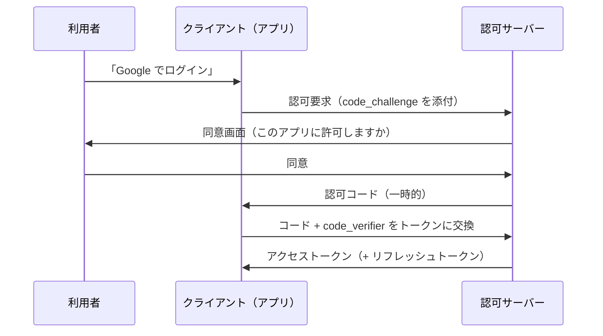

# 11.3 認証と認可

> 「あなたは誰ですか（認証）」と「あなたは何をしてよいですか（認可）」は、別の問いです。この 2 つを混同したり、片方を手抜きしたりすることが、最も多く、最も深刻な脆弱性を生みます。この章では、パスワードから多要素認証・パスキー、セッションと JWT、OAuth と OpenID Connect、そして RBAC から Google Zanzibar 流の関係ベース認可まで、「誰が・何をしてよいか」を正しく決める仕組みを体系的に学びます。

| 項目 | 内容 |
|---|---|
| 学習時間の目安 | 本文 4h ＋ 演習 5h |
| 前提となる章 | [11.2 暗号技術の基礎](../02-cryptography/README.md)、[5.3 DNS・HTTP・TLS](../../05-networking/03-dns-http-tls/README.md) |
| 演習 | [exercises/](exercises/)（Python） |
| キーワード | 認証, 認可, MFA, TOTP, WebAuthn, セッション, OAuth, OIDC, JWT, RBAC, ReBAC, IDOR |

## この章のゴール

- [ ] 識別・認証・認可の違いと、認証の 3 要素（知識・所持・生体）を説明できる
- [ ] TOTP を仕様どおりに実装でき、SMS の弱点とフィッシング耐性のある MFA（WebAuthn/パスキー）を説明できる
- [ ] セッション管理の要点（ランダム ID、Cookie 属性、ログイン時の再生成、失効）を説明できる
- [ ] OAuth 2.0（認可コード＋PKCE）と OpenID Connect の役割の違いを説明し、OAuth が「認可の委譲」であって認証ではないことを説明できる
- [ ] JWT の落とし穴（alg=none、鍵の取り違え、aud/iss/exp の未検証）を挙げ、厳格に検証する実装を書ける
- [ ] RBAC・ABAC・ReBAC の違いと、マルチテナントで最も起きやすい認可欠陥（BOLA/IDOR）の防ぎ方を説明できる

## なぜ学ぶのか

認証・認可の欠陥は、Web アプリの脆弱性の中でも常に上位を占めます。

- **アクセス制御の不備が最多の脆弱性**: OWASP Top 10 では「アクセス制御の不備（Broken Access Control）」が 2021 年版・2025 年版ともに 1 位でした。他人の ID を指定するだけで他人のデータが見えてしまう **IDOR/BOLA**（[11.4 Webアプリケーションセキュリティ](../04-web-security/README.md) でも扱います）は、あまりに単純なのに繰り返し起きます。認可を「機能ごと」ではなく「オブジェクトごと」に、しかも毎回チェックしていないことが原因です。
- **MFA のない世界の脆さ**: 認証情報の使い回しと漏えいにより、パスワードだけの認証は破られ続けています。多要素認証（MFA）は最も費用対効果の高い対策の 1 つですが、SMS を使った MFA は **SIM スワップ**（攻撃者が携帯番号を乗っ取る）で回避され、プッシュ通知型は **プッシュ疲れ**（何度も承認を求められ、うんざりして承認してしまう）で突破されます。だから「フィッシング耐性のある MFA」が求められます。
- **JWT の検証の手抜き**: JWT は正しく使えば強力ですが、「署名を検証しない」「`alg=none` を受理する」「有効期限や宛先（aud）を確認しない」といった手抜きが、そのまま認証バイパスになります。これらは実在のライブラリでも過去に見つかった、典型的な失敗です。

この章では、TOTP・JWT・PKCE を仕様どおりに実装し、RBAC と Zanzibar 流の ReBAC を作ることで、「認証と認可を正しく組み立てる」感覚を身につけます。

## 1. 識別・認証・認可

まず 3 つの言葉を厳密に区別します。この区別が、設計の議論の土台になります。

- **識別（Identification）**: 「私は alice です」と名乗ること。ユーザー名やメールアドレスを提示する段階。
- **認証（Authentication, AuthN）**: 「本当に alice である」ことを証明すること。パスワードや生体情報で確かめる。
- **認可（Authorization, AuthZ）**: 「alice はこの操作をしてよい」かを判断すること。

順序は識別 → 認証 → 認可です。**認証と認可の混同が事故を生みます**。「ログインできた（認証）＝すべての操作ができる（認可）」ではありません。ログイン済みの利用者が、他人のデータにアクセスできてしまう（IDOR）のは、認証は通っているが認可が抜けている、典型的な例です。

### 1.1 認証の 3 要素

認証の根拠は 3 種類に分類されます。

| 要素 | 例 | 弱点 |
|---|---|---|
| 知識（something you know） | パスワード、PIN | 漏えい・使い回し・推測 |
| 所持（something you have） | スマホ、セキュリティキー、TOTP | 紛失・盗難 |
| 生体（something you are） | 指紋、顔 | 変更できない、なりすまし |

**多要素認証（MFA）** は、異なる種類の要素を 2 つ以上組み合わせることです。「パスワード ＋ SMS コード」は知識 ＋ 所持ですが、「パスワード ＋ 秘密の質問」は知識 ＋ 知識なので、真の多要素とは言えません。

## 2. パスワードと MFA

### 2.1 パスワードの現代的なガイドライン

パスワードの常識は、この 10 年で大きく変わりました。NIST SP 800-63B（デジタルアイデンティティのガイドライン。2026 年時点では改訂版が公開されており、内容は改訂で変わりうるので一次情報を確認してください）は、次のような方針を示しています。

- **長さを重視する**（短く複雑なものより、長いパスフレーズ）。
- **複雑さの強制ルール（大文字・数字・記号を必ず含める等）をやめる**。かえって `Password1!` のような弱い定型を生む。
- **定期的な強制変更をやめる**。漏えいの兆候があるときだけ変更させる。強制変更は弱いパスワードへの退化を招く。
- **漏えいしたパスワードのリスト（breached passwords）と照合して拒否する**。

保存方法（ソルト付きの遅いハッシュ）は [11.2 暗号技術の基礎](../02-cryptography/README.md) で扱いました。ここで重要なのは、**「ユーザーに複雑さを強いる」より「長さ ＋ 漏えいチェック ＋ MFA」の方が、実際に安全で使いやすい** という転換です。

### 2.2 TOTP — 時刻ベースのワンタイムパスワード

**TOTP（Time-based One-Time Password、RFC 6238）** は、認証アプリが表示する 6 桁のコードの仕組みです。サーバーと端末が共有する秘密鍵と「現在時刻を 30 秒で割った値」を HMAC にかけ、そこから 6 桁を取り出します。時刻さえ合っていれば、通信なしで両者が同じコードを計算できます。

演習 `totp.py` で、その土台である HOTP（RFC 4226）から実装し、RFC の公式テストベクタで検証します。

```text
（演習 totp.py の出力。RFC 4226/6238 の公式テストベクタと一致）
RFC4226 HOTP counter0: 755224
RFC6238 TOTP T=59 8桁: 94287082
```

サーバー側の検証では、端末とサーバーの時計のずれを許すために **前後 1 ステップ程度の猶予（window）** を設け、さらに **一度使ったコードの再利用（リプレイ）を防ぐ** ために、受理した時間ステップを記録します。演習でこの両方を実装します。

### 2.3 SMS の弱点とフィッシング耐性のある MFA

- **SMS の MFA は弱い**: SMS は **SIM スワップ**（攻撃者が携帯キャリアをだまして被害者の番号を自分の SIM に移す）で乗っ取られ、コードが攻撃者に届きます。NIST も SMS を推奨から格下げしています。ないよりはましですが、重要なアカウントには使うべきではありません。
- **プッシュ疲れ（MFA fatigue）**: プッシュ通知型の MFA は、攻撃者が何度も承認要求を送りつけ、利用者が根負けして承認してしまう攻撃で突破されます。番号照合（number matching）で緩和します。
- **フィッシング耐性のある MFA**: **FIDO2 / WebAuthn** と、その利用者体験を改善した **パスキー（passkey）** が、現時点で最も強力です。公開鍵暗号を使い、**認証情報がアクセス先のドメインに紐づく** ため、偽サイト（フィッシング）に入力しても認証が成立しません。TOTP はコードを偽サイトに入力させられる（中継される）のに対し、WebAuthn はこの中継が原理的にできません。これが「フィッシング耐性」の意味です。

## 3. セッション管理

認証は「ログインの瞬間」だけの話ではありません。一度ログインした後、リクエストのたびに認証をやり直さずに「この人はログイン済みの alice だ」と識別し続ける仕組みが **セッション** です。

セッションの要点は次の通りです。

- **セッション ID は予測不可能な乱数**（`secrets` で生成。[11.2](../02-cryptography/README.md)）。連番や推測可能な値は他人のセッションを乗っ取られる。
- **Cookie の属性を正しく設定する**: `HttpOnly`（JavaScript から読めない → XSS でのセッション窃取を防ぐ）、`Secure`（HTTPS でのみ送信）、`SameSite`（他サイトからのリクエストで送らない → CSRF を防ぐ。[11.4](../04-web-security/README.md)）。
- **ログイン時にセッション ID を再生成する**: ログイン前に攻撃者が用意した ID を使わせる **セッション固定化（session fixation）** を防ぐ。
- **失効と期限**: 一定時間で失効させ、ログアウトや異常検知で無効化できるようにする。

### 3.1 サーバー側セッション vs JWT

セッション情報をどこに持つかで、2 つの方式があります。

| 方式 | 状態の保持 | 失効 | 向く場面 |
|---|---|---|---|
| サーバー側セッション | サーバー（DB/Redis）に保存し、Cookie には ID だけ | サーバー側で即座に無効化できる | 一般的な Web アプリ。失効が重要な用途 |
| JWT（自己完結トークン） | トークン自体に情報を入れ、署名で保護 | **即座の失効が難しい**（有効期限まで有効） | ステートレスな API、マイクロサービス間 |

**JWT の最大の弱点は「失効の難しさ」** です。署名が正しく期限内なら、盗まれたトークンも有効です。だから JWT のアクセストークンは短命（数分〜数十分）にし、長期の再認証は別の仕組み（リフレッシュトークン、サーバー側で失効可能）で行うのが定石です。「JWT を使えばセッション管理が不要になる」というのは誤解で、失効要件を無視した設計は危険です。

## 4. OAuth 2.0 と OpenID Connect

### 4.1 OAuth は「認可の委譲」であって認証ではない

**OAuth 2.0 は、「あるサービスに、別のサービスのあなたのデータへのアクセスを、パスワードを渡さずに許可する」ための認可の委譲フレームワークです。** 「このアプリに、あなたの Google カレンダーの読み取りを許可しますか？」という画面がそれです。

重要な誤解を正します。**OAuth は認証プロトコルではありません。** OAuth が答えるのは「このアプリはこのリソースにアクセスしてよいか（認可）」であって「この人は誰か（認証）」ではありません。OAuth を認証に流用した「OAuth でログイン」の実装には、古典的な脆弱性がありました。認証には、次節の OpenID Connect を使います。

### 4.2 認可コードフローと PKCE

OAuth にはいくつかの流れ（グラント）がありますが、現代の推奨は **認可コードフロー ＋ PKCE** です。登場人物は、リソース所有者（利用者）・クライアント（アプリ）・認可サーバー・リソースサーバーの 4 者です。



**PKCE（Proof Key for Code Exchange、RFC 7636）** は、認可コードの横取りを防ぐ仕組みです。クライアントは最初に秘密の値（code_verifier）を作り、そのハッシュ（code_challenge）だけを認可要求に添えます。トークン交換のときに verifier そのものを提示し、認可サーバーがハッシュを検証します。途中で認可コードを盗んだ攻撃者は verifier を知らないので、トークンに交換できません。

```text
（演習 pkce.py の出力。RFC 7636 Appendix B の例と一致）
PKCE verifier:  dBjftJeZ4CVP-mB92K27uhbUJU1p1r_wW1gFWFOEjXk
PKCE challenge(S256): E9Melhoa2OwvFrEMTJguCHaoeK1t8URWbuGJSstw-cM
```

PKCE はもともとモバイルアプリ向けでしたが、現在は **すべてのクライアントで必須** とされます（OAuth 2.0 のセキュリティ最良実践 RFC 9700、および統合を進める OAuth 2.1 のドラフト。2026 年時点でドラフト段階なので最新を確認）。演習 `pkce.py` で S256 方式を実装します。

- **スコープ（scope）**: アクセスの範囲（`calendar.read` など）。最小限のスコープだけ要求する。
- **アクセストークンとリフレッシュトークン**: アクセストークンは短命。期限が切れたらリフレッシュトークンで再取得する。
- **クライアントクレデンシャルフロー**: 利用者が介在しない、サービス間の認可に使う。

### 4.3 OpenID Connect（OIDC）

**OpenID Connect は、OAuth 2.0 の上に「認証」を乗せた層です。** OAuth のトークンに加えて、「誰がいつ認証されたか」を表す **ID トークン**（JWT 形式）を発行します。「Google でログイン」を正しく実装するには、OAuth ではなく OIDC を使います。ID トークンには、発行者（iss）・対象者（aud）・有効期限（exp）などが含まれ、これらを検証することが安全性の要です（次節）。

### 4.4 エンタープライズ SSO

- **SAML**: 企業のシングルサインオン（SSO）で長く使われてきた XML ベースの規格。新規は OIDC が主流だが、既存の企業システムには SAML が根強い。
- **SCIM**: ユーザーのプロビジョニング（入社時のアカウント作成、退社時の削除）を自動化する規格。
- **「SSO tax」論争**: SaaS の多くが SSO 機能を最上位の高額プランでしか提供しないことへの批判。セキュリティの基本機能を「有料オプション」にすべきでない、という議論があります。CTO は SaaS 選定時にこの点を確認すべきです。

## 5. JWT を正しく検証する

JWT（JSON Web Token）は「ヘッダ.ペイロード.署名」を base64url で連結した文字列です。署名により改ざんを検知できますが、**中身は暗号化されていません**（誰でも読めます）。JWT の脆弱性の大半は、暗号の弱さではなく **検証の手抜き** です。

演習 `jwt_hs256.py` で HS256 の JWT を発行・検証し、次の攻撃をすべて防ぐ「厳格な検証」を実装します。

| 落とし穴 | 攻撃 | 対策 |
|---|---|---|
| `alg=none` の受理 | 署名なしのトークンを受け入れさせる | 許可アルゴリズムを明示し、none を必ず拒否 |
| アルゴリズムの取り違え | RS256 用の公開鍵を HS256 の鍵として使わせ、公開情報だけで署名を偽造 | トークンの alg を信じず、検証側が許可リストで固定する |
| aud/iss を検証しない | 別サービス向けのトークンを流用される | 発行者（iss）と対象者（aud）を必ず確認 |
| exp/nbf を検証しない | 期限切れトークンを使い続けられる | 有効期限を検証（多少の時計ずれは leeway で許容） |
| 長い有効期限 | 盗まれたトークンが長く有効 | 短命にし、失効の仕組みを別に持つ |
| 機密情報をペイロードに入れる | 誰でも読める | 秘密はペイロードに入れない |
| 署名を非定数時間で比較 | タイミング攻撃 | `hmac.compare_digest` で比較 |

特に「アルゴリズムの取り違え（algorithm confusion）」は巧妙です。サーバーが「トークンのヘッダに書かれた alg」を信じて検証方式を選ぶと、攻撃者は alg を RS256 から HS256 に変え、サーバーが持つ RSA 公開鍵（公開情報）を HMAC の鍵として使って署名を偽造できます。**検証側が使うアルゴリズムは、トークンではなくサーバーの設定で固定する** のが鉄則です。演習では、これらすべてを攻撃ケースとして防ぎます。

## 6. 認可モデル

「誰が何をしてよいか」を表現・判定するモデルには、いくつかの段階があります。

### 6.1 ACL・RBAC・ABAC・ReBAC

| モデル | 判断の基準 | 例 | 向く場面 |
|---|---|---|---|
| ACL | オブジェクトごとに「誰が何できるか」の一覧 | ファイルのパーミッション | 単純な、対象が少ない場合 |
| RBAC | 役割（ロール）に権限を紐づけ、人に役割を割り当てる | 「管理者」「編集者」「閲覧者」 | 組織的な権限管理。最も普及 |
| ABAC | 属性（部署・時刻・場所など）に基づくポリシー | 「営業部かつ勤務時間内なら」 | 細かい条件が必要な場合 |
| ReBAC | オブジェクト間・人との「関係」に基づく | 「このフォルダの所有者」「このドキュメントを共有された人」 | 共有・階層・グループが複雑な場合 |

**RBAC** は最も広く使われるモデルです。ロールに階層（「管理者」は「編集者」の権限をすべて含む）を持たせ、マルチテナントでは「どのテナントで」の役割かを分けます。演習 `authz.py` で、ロール階層とテナント分離を実装します。

### 6.2 ReBAC と Google Zanzibar

Google のドキュメント共有（Google Docs など）のような「誰がこのファイルを誰と共有したか」という関係が複雑に絡む認可は、RBAC では表現しきれません。Google は 2019 年の論文で、全社の認可を担う **Zanzibar** というシステムを公開しました。その核心は **関係タプル（relation tuple）** です。

```text
document:readme#owner@user:alice          alice は readme の所有者
document:readme#editor@group:eng#member   eng グループのメンバーは readme の編集者
group:eng#member@user:bob                 bob は eng グループのメンバー
```

そして「owner なら editor でもある」「editor なら viewer でもある」（owner ⊇ editor ⊇ viewer）や「親フォルダの閲覧者は中の文書も閲覧できる」といった **計算される関係** を定義します。`check(object, relation, user)`（この人はこのオブジェクトにこの関係を持つか）を、関係をたどって判定します。演習 `authz.py` で、この Zanzibar 風のミニ ReBAC（関係タプル、グループの入れ子、計算される関係、親からの継承、循環への耐性）を実装します。OpenFGA や SpiceDB は、この Zanzibar を元にしたオープンソース実装です。

### 6.3 マルチテナントと BOLA/IDOR

複数の顧客企業（テナント）が同じシステムを共有するマルチテナントでは、**「テナント A の利用者が、テナント B のデータにアクセスできない」ことを保証するのが最重要** です。

最も多い失敗が **BOLA（Broken Object Level Authorization）/ IDOR（Insecure Direct Object Reference）** です。`/api/invoices/101` の `101` を `102` に変えるだけで他人・他テナントの請求書が見える、という単純な欠陥です。原因は、オブジェクトを ID で取得するときに「その ID がこの利用者のものか」を確認していないこと。対策は、**すべてのオブジェクトアクセスで、リクエストのテナント ID を信じず、認証済みの利用者に紐づくテナント・所有者と一致するかをサーバー側で確認する** ことです。演習 `authz.py` の RBAC と [11.4](../04-web-security/README.md) の `secure_app.py` で、この防ぎ方を実装します。

### 6.4 ポリシーエンジンとサービス間認証

- **ポリシーエンジン**: 認可のルールをアプリのコードから切り出し、専用のエンジンで評価する。**OPA（Open Policy Agent）の Rego** や **AWS Cedar** が代表的。ポリシーを一元管理・テスト・監査できる利点があります。
- **サービス間認証**: マイクロサービス間では、人ではなくサービスが相手を認証します。**mTLS**（相互 TLS。双方が証明書で認証）、**ワークロードアイデンティティ**、**SPIFFE/SPIRE**（サービスに検証可能な ID を発行する標準）が使われます。
- **ワークフォースアイデンティティ**: 従業員の ID 管理。入社・異動・退社（joiner-mover-leaver）に応じた権限の付与・変更・剥奪と、定期的なアクセス権の棚卸し（access review）が、内部不正と権限の肥大化を防ぎます。

## よくある落とし穴

1. **認証と認可を混同する**。「ログインできた＝何でもできる」ではない。ログイン後も、操作ごと・オブジェクトごとに「してよいか」を毎回確認する。
2. **オブジェクトの認可を忘れる（IDOR/BOLA）**。ID で取得するとき、それが利用者のものかを確認しない。URL の ID を変えるだけで他人のデータが見える。マルチテナントでは最重要の脆弱性。
3. **JWT の検証を手抜きする**。`alg=none` の受理、アルゴリズムの取り違え、aud/iss/exp の未検証。検証アルゴリズムはトークンでなくサーバー設定で固定する。
4. **JWT を「失効できる前提」で使う**。署名が正しく期限内なら、盗まれたトークンも有効。アクセストークンは短命にし、失効が必要ならサーバー側セッションかリフレッシュトークンを併用する。
5. **SMS の MFA を過信する**。SIM スワップで回避される。重要なアカウントにはフィッシング耐性のある MFA（WebAuthn/パスキー）を使う。
6. **OAuth を認証に流用する**。OAuth は認可の委譲であり、「誰か」を保証しない。認証には OpenID Connect（ID トークン）を使い、iss/aud を検証する。
7. **セッション ID をログイン時に再生成しない**。セッション固定化攻撃を許す。ログインの前後で ID を必ず作り直す。
8. **複雑さルールと定期変更でパスワードを「守った気になる」**。かえって弱いパスワードを生む。長さ・漏えいチェック・MFA の方が効果的。

## CTOの視点

1. **認可を「機能」ではなく「基盤」として設計する**。認可のロジックが各エンドポイントに散らばっていると、必ずどこかで抜け（IDOR）が生じます。設計レビューでは「認可は一元化されているか」「すべてのオブジェクトアクセスでテナント・所有者を確認しているか」を問います。規模が大きくなるなら、OPA や Zanzibar 流のシステム（OpenFGA/SpiceDB）で認可を基盤化する判断も検討します。これは後から入れ替えにくい「一方通行のドア」なので、早い段階で方針を決めます。
2. **MFA を全社の前提にする**。フィッシングは最大の侵入経路であり、フィッシング耐性のある MFA（パスキー/WebAuthn）は最も費用対効果の高い投資の 1 つです。「重要システムだけ MFA」ではなく「全システムで MFA、可能な限りパスキー」を目標にします。SMS の MFA は経過措置と位置づけます。
3. **アイデンティティ基盤（IdP）への集約を決断する**。認証をサービスごとにばらばらに実装すると、退職者のアカウント剥がし漏れ・権限の棚卸し不能・監査困難といった問題が積み上がります。IdP に集約し、SCIM で入退社を自動化し、定期的なアクセスレビューを回す仕組みは、セキュリティと監査（[14.5](../../14-cto/05-governance-risk-compliance/README.md)）の両面で効きます。SaaS 選定では「SSO tax」（SSO が高額プラン限定か）も確認します。
4. **JWT の失効要件を最初に決める**。「ステートレスで格好いいから」と JWT を選ぶと、後で「不正利用されたトークンを今すぐ無効化したい」という要件に応えられず苦労します。失効の要件（どれだけ速く無効化する必要があるか）を最初に定義し、それに合う方式（短命 JWT ＋ リフレッシュ、あるいはサーバー側セッション）を選びます。
5. **採用で「認証と認可の区別」を確認する**。「OAuth と OpenID Connect の違いは」「IDOR をどう防ぐか」「JWT を検証するとき何をチェックするか」に、理由とともに答えられるかは、Web セキュリティの実務力を見極める良い質問です。「ライブラリに任せています」で止まらず、何を検証すべきかを説明できる人材が、レビューで手抜きを捕まえられます。

## 演習

演習コードは [exercises/](exercises/) にあります。

```bash
python3 tools/check.py 11.3
python3 tools/check.py -v 11.3
```

| # | 難易度 | 内容 | 対象ファイル / 関数 |
|---|---|---|---|
| 1 | ★★☆ | HOTP/TOTP を RFC 4226/6238 のテストベクタで実装、時計ずれの許容とリプレイ防止 | `totp.py` |
| 2 | ★★☆ | HS256 JWT の発行と厳格な検証（alg 許可リスト、none 拒否、exp/nbf/aud/iss、定数時間比較） | `jwt_hs256.py` |
| 3 | ★★★ | RBAC（ロール階層＋テナント分離）と、Zanzibar 風のミニ ReBAC（関係タプル・グループ・継承） | `authz.py` |
| 4 | ★☆☆ | PKCE（RFC 7636）の verifier/challenge（S256）を、RFC の例で検証 | `pkce.py` |

## 理解度チェック

**Q1. 「認証（authentication）」と「認可（authorization）」の違いを、例とともに説明してください。**

<details>
<summary>解答</summary>

認証は「あなたが本当に主張どおりの人か」を確かめること（パスワードや生体で本人確認）、認可は「その人がこの操作をしてよいか」を判断することです。たとえば、alice がパスワードでログインするのが認証、ログイン済みの alice が「請求書 101 を閲覧してよいか」を判断するのが認可です。両者は独立していて、認証を通っても、すべての認可が通るわけではありません。ログイン済みの利用者が他人のデータにアクセスできてしまう IDOR は、「認証は通っているが、オブジェクト単位の認可が抜けている」典型例です。

</details>

**Q2. SMS を使った MFA より、WebAuthn/パスキーが「フィッシング耐性がある」と言われるのはなぜですか。**

<details>
<summary>解答</summary>

SMS や TOTP のコードは、利用者が偽サイト（フィッシングサイト）に入力してしまえば、攻撃者がそれを本物のサイトに中継して認証を成立させられます（コードは「入力できる情報」だから）。一方、WebAuthn/パスキーは公開鍵暗号を使い、認証情報が「アクセス先のドメイン（オリジン）」に紐づいています。ブラウザが、今アクセスしているドメインに対応する鍵でしか署名しないため、偽ドメインのサイトでは正しい署名が作れず、認証が成立しません。この「認証がドメインに束縛される」性質が、原理的にフィッシング（中継）を防ぎます。加えて、SMS は SIM スワップという別の弱点も抱えています。

</details>

**Q3. 「OAuth でログイン機能を実装した」という説明のどこが問題になりうるか、指摘してください。**

<details>
<summary>解答</summary>

OAuth 2.0 は「認可の委譲」のフレームワークであり、認証プロトコルではありません。OAuth のアクセストークンが証明するのは「このアプリがこのリソースにアクセスする許可を得た」ことであって、「今ログインしようとしているのが本人である」ことではありません。OAuth を認証に流用すると、たとえば別のアプリ向けに発行されたトークンを使い回される、といった脆弱性が生じえます。ログイン（認証）には、OAuth の上に認証層を定義した OpenID Connect を使い、ID トークンの発行者（iss）・対象者（aud）・有効期限（exp）を検証する必要があります。

</details>

**Q4. JWT の検証で「alg=none」と「アルゴリズムの取り違え（RS256↔HS256）」は、それぞれどういう攻撃で、どう防ぎますか。**

<details>
<summary>解答</summary>

**alg=none**: JWT のヘッダで署名アルゴリズムを "none" と指定し、署名なしのトークンを作る攻撃です。検証側が alg を鵜呑みにして「none なら署名検証しない」と実装していると、任意のペイロード（管理者になりすますなど）が通ってしまいます。

**アルゴリズムの取り違え**: サーバーが RS256（RSA 公開鍵で検証）を使っているとき、攻撃者は alg を HS256 に変え、サーバーが公開している RSA 公開鍵を HMAC の鍵として使って署名を作ります。検証側が「ヘッダの alg に従って検証方式を選ぶ」実装だと、公開鍵（公開情報）だけで有効な署名を偽造されます。

**防ぎ方（共通）**: 検証に使うアルゴリズムを、トークンのヘッダではなく **サーバー側の設定（許可リスト）で固定する**。none は許可リストに入れず、明示的に拒否する。演習 `jwt_hs256.py` でこれらをすべて防ぎます。

</details>

**Q5. マルチテナントの API で `/api/invoices/{id}` を実装するとき、IDOR/BOLA を防ぐには何が必要ですか。**

<details>
<summary>解答</summary>

ID でオブジェクトを取得するだけでなく、「その ID のオブジェクトが、認証済みの利用者がアクセスしてよいものか」を毎回確認します。具体的には、リクエストに含まれるテナント ID を信用せず、認証済みトークンから得た利用者のテナント・所有者と、オブジェクトのテナント・所有者が一致するかを、データ取得のクエリ自体に条件として含めます（例: `WHERE id=? AND tenant_id=? AND owner_id=?`）。ID を連番にしない（推測しにくくする）ことも緩和にはなりますが、それだけに頼ってはいけません。本質的な対策はサーバー側での所有権・テナントの確認です。演習 `authz.py` と [11.4](../04-web-security/README.md) の `secure_app.py` で実装します。

</details>

**Q6. RBAC で表現しにくく、ReBAC（Zanzibar 流）が向いている認可の例を挙げてください。**

<details>
<summary>解答</summary>

「誰がどのオブジェクトを誰と共有したか」という、オブジェクト間・人との関係が動的に絡む認可です。たとえば Google Docs のように、「alice がこのドキュメントの所有者」「alice がこのドキュメントを bob に編集者として共有」「このドキュメントは eng グループの全員が閲覧可」「このフォルダの閲覧者は中の全ドキュメントを閲覧可」といった関係が、オブジェクトごとに違い、グループや階層で継承されるケースです。RBAC は「役割 → 権限」の静的な対応なので、こうした「オブジェクトごとに異なる、関係に基づく」認可を表現しきれません。ReBAC は関係タプルとその展開規則（owner⊇editor⊇viewer、親フォルダからの継承など）で、これを自然に表現します。演習 `authz.py` で実装します。

</details>

**Q7. JWT（自己完結トークン）とサーバー側セッションの、失効に関する違いを説明してください。**

<details>
<summary>解答</summary>

サーバー側セッションは、状態をサーバー（DB や Redis）に持ち、Cookie にはセッション ID だけを入れます。だから「このセッションを無効化する」とサーバー側で記録すれば、即座に失効させられます。一方 JWT は、トークン自体に情報を入れて署名で保護する自己完結型なので、署名が正しく有効期限内であれば、サーバーに問い合わせずに有効と判断されます。つまり、盗まれた JWT を「今すぐ無効化する」のが原理的に難しいのです。対策として、アクセストークンを短命（数分）にして被害の窓を狭め、長期の再認証はサーバー側で失効可能なリフレッシュトークンで行う、あるいは失効リスト（denylist）を別に持つ、といった設計をします。失効要件が厳しいなら、そもそもサーバー側セッションを選ぶべきです。

</details>

## さらに学ぶために

- Justin Richer, Antonio Sanso『OAuth 2 in Action』（Manning, 2017）— OAuth 2.0 を手を動かして理解する定番。認可サーバー・クライアント・リソースサーバーを自分で作りながら学べる。
- Neil Madden『API Security in Action』（Manning, 2020）— API の認証・認可・トークン・OAuth・ケイパビリティを網羅的かつ実践的に解説。この章の内容を深めるのに最適。
- Google "Zanzibar: Google's Consistent, Global Authorization System"（USENIX ATC 2019）— ReBAC の元になった論文。大規模認可システムの設計思想が学べる。OpenFGA / SpiceDB の公式ドキュメントも実装の参考になる。
- NIST SP 800-63B "Digital Identity Guidelines: Authentication and Lifecycle Management"— パスワード・MFA の現代的なガイドラインの一次情報。改訂版が出ているので最新を確認する。
- RFC 6749（OAuth 2.0）、RFC 6238（TOTP）、RFC 7636（PKCE）、RFC 9700（OAuth Security BCP）— 演習で実装する仕様の一次情報。RFC は読みにくいが、テストベクタや厳密な定義の確認に役立つ。
- OWASP Cheat Sheet Series（Authentication / Session Management / JSON Web Token / Authorization）— 実装時に参照すべき簡潔な実務ガイド。

## まとめ

- 識別・認証・認可は別の問い。特に「ログインできた（認証）」と「その操作をしてよい（認可）」を混同しないことが、多くの脆弱性を防ぐ。
- パスワードは長さ・漏えいチェック・MFA を重視する。SMS の MFA は SIM スワップで弱く、フィッシング耐性のある WebAuthn/パスキーが最も強い。
- セッションはランダムな ID・正しい Cookie 属性・ログイン時の再生成・失効が要点。JWT は失効が難しいので短命にし、失効要件を最初に決める。
- OAuth 2.0 は認可の委譲であって認証ではない。認証には OpenID Connect を使う。現代の推奨は認可コードフロー ＋ PKCE。
- JWT の脆弱性の大半は検証の手抜き（alg=none、アルゴリズム取り違え、aud/iss/exp の未検証）。検証アルゴリズムはサーバー設定で固定する。
- 認可モデルは RBAC が基本、共有・階層が複雑なら Zanzibar 流の ReBAC。マルチテナントでは BOLA/IDOR が最重要の脅威で、すべてのオブジェクトアクセスでサーバー側の所有権確認が要る。
- 認可は各所に散らばると必ず抜ける。基盤として一元化し、MFA とアイデンティティ基盤を全社の前提にするのが CTO の仕事。
