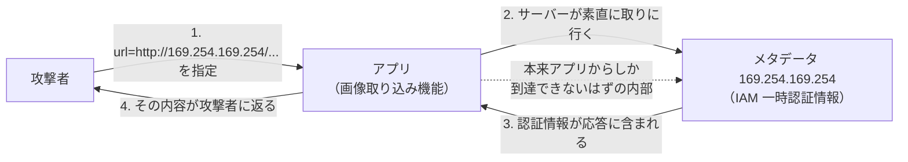

# 11.4 Webアプリケーションセキュリティ

> Web アプリは、世界中の攻撃者に 24 時間さらされています。そして攻撃の多くは、高度な暗号解読ではなく「入力を信用してしまった」という、単純だが根深い一点から生まれます。この章では、OWASP Top 10 を地図に、注入・XSS・CSRF・SSRF・アクセス制御の不備といった主要な脆弱性を「攻撃の仕組み」から理解し、脆弱なコードを自分の手で安全に直します。

| 項目 | 内容 |
|---|---|
| 学習時間の目安 | 本文 4h ＋ 演習 5h |
| 前提となる章 | [11.3 認証と認可](../03-authn-authz/README.md)、[5.3 DNS・HTTP・TLS](../../05-networking/03-dns-http-tls/README.md)、[6.1 リレーショナルモデルとSQL](../../06-databases/01-relational-model-and-sql/README.md) |
| 演習 | [exercises/](exercises/)（Python） |
| キーワード | OWASP Top 10, SQLi, XSS, CSRF, SSRF, IDOR, パストラバーサル, CSP, 安全なコーディング |

## この章のゴール

- [ ] OWASP Top 10 を地図として、主要な Web 脆弱性の分類と関係を説明できる
- [ ] 注入（SQLi・コマンド・テンプレート）の原理と、パラメータ化による根本的な防ぎ方を説明・実装できる
- [ ] XSS の 3 種類と、文脈に応じた出力エスケープ・CSP による防御を説明・実装できる
- [ ] CSRF・SSRF・IDOR・パストラバーサルの仕組みと対策を、攻撃を再現しながら実装できる
- [ ] 「入力を信用しない」「出力は文脈に応じてエスケープする」という 2 つの原則をあらゆる場面に適用できる
- [ ] SAST/DAST/SCA、脆弱性診断、バグバウンティといった、脆弱性を見つける手段を使い分けられる

## なぜ学ぶのか

Web の脆弱性は、単純さゆえに繰り返し悪用されます。

- **注入は数十年破られ続けている**: SQL インジェクションは 1998 年から知られていますが、いまだに侵害の主要因です。原因はいつも同じで、「利用者の入力を、コードの一部として解釈させてしまう」ことです。根本的な対策（パラメータ化）は単純なのに、文字列連結でクエリを組む習慣が消えません。
- **SSRF が引き起こした大規模漏えい**: 2019 年の Capital One の情報漏えい（約 1 億件）は、SSRF を起点にクラウドのメタデータサービス（169.254.169.254）から認証情報を取得された、と米国上院の報告書などで分析されています。「サーバーが指定された URL を取りに行く」という一見無害な機能が、内部ネットワークへの侵入口になりました。
- **アクセス制御の不備が Top 10 の 1 位**: OWASP Top 10 では、2021 年版・2025 年版ともに「アクセス制御の不備」が 1 位です。他人の ID を指定するだけでデータが見える IDOR は、実装も攻撃も単純なのに、最も多い脆弱性であり続けています。

この章の演習は、他の章と違い **「動くけれど脆弱なコード」を、あなたが安全に直す** 形式です。攻撃を再現するテストを通すことで、「なぜ危ないか」を攻撃者の視点で体感し、正しい直し方を体で覚えます。

> ⚠️ この章で学ぶ攻撃手法は、**自分が管理するシステムや、許可された演習環境でのみ** 試してください。許可なく他者のシステムを攻撃することは、日本では不正アクセス禁止法などに触れる犯罪です。目的は攻撃ではなく防御です。

## 1. OWASP Top 10 という地図

**OWASP Top 10** は、Web アプリで最も重大な 10 のリスクを、非営利団体 OWASP が数年ごとにまとめたものです。網羅的なチェックリストではありませんが、「まずどこを固めるか」の共通言語・出発点として、業界で広く使われます。

**版によってカテゴリが変わるので、実務では最新版を確認してください。** 2021 年版と、2025 年版（リリース候補が 2025 年 11 月に公開され、2026 年初頭にかけて確定。数字は変わりうるので一次情報を確認）を並べると、傾向が見えます。

| 順位 | 2021 年版 | 2025 年版（候補） | 変化 |
|---|---|---|---|
| A01 | アクセス制御の不備 | アクセス制御の不備 | 1 位を維持。SSRF がここに統合 |
| A02 | 暗号化の失敗 | セキュリティ設定ミス | 設定ミスが 5 位から上昇 |
| A03 | インジェクション | ソフトウェアサプライチェーンの失敗 | 新設（依存の汚染を重視。[11.5](../05-security-operations/README.md)） |
| A04 | 安全でない設計 | 暗号化の失敗 | — |
| A05 | セキュリティ設定ミス | インジェクション | インジェクションは 3→5 位に |
| A06 | 脆弱で古いコンポーネント | 安全でない設計 | — |
| A07 | 識別と認証の失敗 | 認証の失敗 | — |
| A08 | ソフトウェアとデータの整合性の不備 | ソフトウェアとデータの整合性の不備 | — |
| A09 | ログとモニタリングの不足 | ログとアラートの失敗 | — |
| A10 | SSRF | 例外的状況の不適切な処理 | 新設。SSRF は A01 へ |

読み取れる傾向は 3 つです。**アクセス制御の不備が一貫して 1 位**（IDOR/BOLA が最大の脅威）、**設定ミスとサプライチェーンの比重が増している**（自作コード以外の守りが重要に。[11.5](../05-security-operations/README.md)）、そして **インジェクションは対策（パラメータ化・自動エスケープ）の普及で相対的に順位を下げた**（が、まだ上位で油断はできない）。

Top 10 の底流にあるのは、たった 2 つの原則です。**「入力を信用しない（すべての入力を検証する）」** と **「出力は、埋め込む文脈に応じてエスケープする」**。この章の攻撃と対策は、ほぼすべてこの 2 つの応用です。この章では、2021 年版をベースに、注入（2・3 節）・CSRF（4 節）・SSRF（5 節）・アクセス制御（6 節）・設定とヘッダ（7 節）を扱い、サプライチェーンと運用は [11.5](../05-security-operations/README.md) に譲ります。

## 2. インジェクション — 入力をコードとして解釈させる

### 2.1 SQL インジェクション

**インジェクション（injection）** は、利用者の入力を、データではなく「コードの一部」として解釈させる攻撃の総称です。最も有名なのが **SQL インジェクション（SQLi）** です。

```python
# 脆弱: 入力を文字列連結で SQL に埋め込む
query = "SELECT * FROM users WHERE name = '" + user_input + "'"
# user_input = "' OR '1'='1" だと…
# → SELECT * FROM users WHERE name = '' OR '1'='1'   （全件が返る）
# user_input = "'; DROP TABLE users; --" なら破壊的
```

根本的な対策は、**プレースホルダ（パラメータ化クエリ）** です。SQL の構造と値を分けてデータベースに渡すことで、値の中に何が書かれていても「値」として扱われ、決してコードにはなりません。

```python
# 安全: 値はプレースホルダで渡す（値として扱われ、SQL 構造に影響しない）
cursor.execute("SELECT * FROM users WHERE name = ?", (user_input,))
```

ログインでの認証回避を、実際に動かして確かめてみましょう（脆弱な実装 → 攻撃 → 修正）。

```python
import sqlite3
db = sqlite3.connect(":memory:")
db.executescript("CREATE TABLE users(id INTEGER, name TEXT, pw TEXT);"
                 "INSERT INTO users VALUES (1,'alice','pw-a'),(2,'bob','pw-b');")

def login_vulnerable(user, pw):                      # 脆弱: 文字列連結
    q = "SELECT id FROM users WHERE name='%s' AND pw='%s'" % (user, pw)
    return db.execute(q).fetchone()

def login_safe(user, pw):                            # 安全: プレースホルダ
    return db.execute("SELECT id FROM users WHERE name=? AND pw=?", (user, pw)).fetchone()

# 攻撃: パスワードを知らずに、ユーザー名に  alice' --  を入れて条件を打ち切る
print("脆弱 + (alice'-- / wrong):", login_vulnerable("alice' --", "wrong"))
print("安全 + (alice'-- / wrong):", login_safe("alice' --", "wrong"))
print("安全 + (alice / pw-a):    ", login_safe("alice", "pw-a"))
```

```text
脆弱 + (alice'-- / wrong): (1,)      ← 認証回避に成功（alice でログインできてしまう）
安全 + (alice'-- / wrong): None      ← 正しく拒否
安全 + (alice / pw-a):     (1,)      ← 正常なログインは通る
```

脆弱な実装では、`alice' --` によってクエリが `... WHERE name='alice' --' AND pw='wrong'` となり、`--` 以降（パスワード判定）がコメントアウトされて認証を回避されます。演習 `secure_app.py` では、検索とログインの SQL インジェクションを、パラメータ化で直します。ログインの認証回避が防げること、そして「名前に `'` を含む正当なユーザー」がパラメータ化で正しく動くことの両方を確認します。エスケープを自前で頑張るのではなく、**構造と値を分離する** のが正解です。ORM を使う場合も、生 SQL を文字列結合で組む箇所（`WHERE` の生成、`ORDER BY` にカラム名を入れる箇所など）に注意します。SQL の基礎は [6.1 リレーショナルモデルとSQL](../../06-databases/01-relational-model-and-sql/README.md) を参照してください。

### 2.2 その他の注入

- **OS コマンドインジェクション**: 入力をシェルコマンドに渡す。`os.system("ping " + host)` に `host="8.8.8.8; rm -rf /"` を入れられる。対策は、シェルを介さず引数を配列で渡す（`subprocess.run(["ping", host])`）こと。
- **テンプレートインジェクション（SSTI）**: サーバー側テンプレートに利用者の入力を式として評価させる。テンプレートエンジンに生の入力を渡さない。
- 共通の原則: **インタプリタ（SQL、シェル、テンプレート）に渡すデータと命令を分離する**。

## 3. XSS（クロスサイトスクリプティング）

### 3.1 XSS の 3 種類

**XSS** は、攻撃者の JavaScript を、被害者のブラウザ上で（そのサイトの権限で）実行させる攻撃です。セッション Cookie の窃取、なりすまし操作、偽の入力画面の表示などができます。

| 種類 | 経路 | 例 |
|---|---|---|
| 反射型（Reflected） | 入力が、そのレスポンスにそのまま反射される（悪意ある URL を踏ませる） | 検索結果に検索語をそのまま表示 |
| 蓄積型（Stored） | 入力が DB に保存され、他の利用者の画面で実行される。最も影響が大きい | 掲示板のコメント、プロフィール名 |
| DOM 型（DOM-based） | サーバーを介さず、クライアント側 JS が入力を危険に扱う | `element.innerHTML = location.hash` |

蓄積型が最も危険なのは、攻撃者が 1 度投稿すれば、そのページを見る **すべての利用者** のブラウザで悪意あるスクリプトが動くからです（管理者が見れば管理者権限で動く）。実際、SNS で「プロフィールを見ただけで自分もそのプロフィールを拡散する」自己増殖型 XSS（ワーム）が過去に発生しています。

### 3.2 文脈に応じた出力エスケープ

XSS の根本原因は、利用者の入力を **HTML の文脈に応じてエスケープせずに** 出力することです。重要なのは、**「どこに埋め込むか」で必要なエスケープが違う** ことです。

```text
（演習 secure_app.py: 要素の内容としての自動エスケープ）
render('<p>{{ c }}</p>', c='')
→ <p>&lt;img src=x onerror=alert(1)&gt;</p>     （スクリプトが無害な文字列になる）
```

- **要素の内容**（`<p>ここ</p>`）: `< > &` を実体参照にする。
- **属性値**（`<a title="ここ">`）: 上記に加えて `" '` もエスケープする。しないと `"` で属性を抜け出して `onerror=` を注入できる。
- **URL・JavaScript・CSS の文脈**: さらに別のルールが要る。

属性値でクォートをエスケープしないと、次のように属性を「抜け出して」イベントハンドラを注入できます（脆弱 → 攻撃 → 修正）。

```text
テンプレート:  <a title="{{ name }}">プロフィール</a>

攻撃入力:      name = "  onmouseover="alert(document.cookie)
脆弱な出力:    <a title="" onmouseover="alert(document.cookie)">プロフィール</a>
              （title="" で閉じ、onmouseover= という別の属性を注入。マウスを乗せると発火）

属性用エスケープ後（" を &quot; に）:
修正後の出力:  <a title="&quot; onmouseover=&quot;alert(document.cookie)">プロフィール</a>
              （すべて title 属性の中の文字列になり、スクリプトは実行されない）
```

演習 `secure_app.py` で、要素用・属性用のエスケープと、**自動エスケープするテンプレートエンジン**（値は既定でエスケープし、明示的に「安全」と印を付けたものだけ生で出す）を実装します。この「既定で安全、opt-out は明示的に」という設計が、モダンなフレームワーク（React の JSX、多くのテンプレートエンジン）が XSS を減らせた理由です。危険なのは、フレームワークの「エスケープを無効化する抜け道」（React の `dangerouslySetInnerHTML` など）を安易に使うことです。

### 3.3 CSP と Trusted Types

出力エスケープが第一の防御ですが、多層防御として **CSP（Content Security Policy）** があります。これは「どこからスクリプトを読み込んでよいか」「インラインスクリプトを許すか」をブラウザに指示するヘッダで、万一 XSS があっても **スクリプトの実行を止める** もう一枚の壁になります。

```text
# 弱い（インラインを全許可。ほぼ意味がない）
Content-Security-Policy: script-src 'self' 'unsafe-inline'

# 強い（nonce 方式。サーバーが毎回ランダムな nonce を発行し、その nonce を持つ <script> だけ実行）
Content-Security-Policy: script-src 'nonce-r4nd0m' 'strict-dynamic'; object-src 'none'; base-uri 'none'
```

CSP は既存サイトにいきなり適用すると、正当なスクリプトまで壊れがちです。**段階的な導入** が定石です。

1. **まず観測する**: `Content-Security-Policy-Report-Only` ヘッダで配信する。これは違反を **ブロックせず報告だけ** するので、本番を壊さずに「何が引っかかるか」を集められます。
2. **違反を潰す**: 報告を見て、インラインスクリプトを外部ファイルや nonce 方式に直す。
3. **強制に切り替える**: 違反がなくなったら `Content-Security-Policy`（Report-Only を外す）に切り替えて、実際にブロックする。
4. **維持する**: 新しい違反の報告を監視し続ける。

さらに **Trusted Types** は、DOM ベース XSS を型レベルで防ぐ仕組みです。`innerHTML` のような危険な DOM 操作に、検証を通した専用の型の値しか渡せないようにし、文字列を直接渡すとエラーにします。これにより「危険な代入」をコードから機械的に排除できます。主要ブラウザでの対応が進んでいます（2026 年時点。最新状況は要確認）。

## 4. CSRF（クロスサイトリクエストフォージェリ）

**CSRF** は、利用者がログイン済みの状態を悪用し、攻撃者のサイトから利用者のブラウザを使って、意図しないリクエスト（送金、設定変更）を送らせる攻撃です。ブラウザが Cookie を自動的に送ってしまう性質を突きます。

対策は 2 つです。

- **SameSite Cookie**: Cookie に `SameSite=Lax`（または `Strict`）を設定し、他サイトからのリクエストでは Cookie を送らせない。現代のブラウザの既定が `Lax` になったことで、CSRF は大きく減りました。
- **CSRF トークン**: フォームに、推測できないトークンを埋め込み、送信時に検証する。攻撃者はこのトークンを知らないので、偽のリクエストは弾かれます。演習 `csrf_tokens.py` で、HMAC 署名付きの同期トークン（セッションに紐づき、有効期限を持つ）と、double-submit cookie 方式の定数時間比較を実装します。

## 5. SSRF（サーバーサイドリクエストフォージェリ）

**SSRF** は、「サーバーが指定された URL を取りに行く」機能（画像取り込み、Webhook、URL プレビュー）を悪用し、**本来アクセスできない内部リソースにサーバーを踏み台にしてアクセスさせる** 攻撃です。前述の Capital One の事例では、クラウドのメタデータエンドポイント `169.254.169.254`（IAM の一時認証情報が取れる）が狙われました。攻撃者の視点では、こう見えています。



攻撃者はインターネットから直接 `169.254.169.254` に到達できませんが、**アプリを踏み台にすれば** 内部に手が届きます。だから「アプリが取りに行く先」を厳しく検証する必要があります。

SSRF 対策の URL 検証は、思ったより難しく、攻撃者はあらゆる抜け道を突いてきます。

```text
（演習 ssrf_guard.py: 「緩い」IP 記法を正規化して内部アドレスを検出）
2130706433 -> 127.0.0.1            （10 進数表記でループバックを隠す）
0x7f000001 -> 127.0.0.1            （16 進数表記）
classify 169.254.169.254 -> link-local     （クラウドのメタデータ）
classify ::ffff:127.0.0.1 -> loopback      （IPv4 射影 IPv6）
http://2130706433/ → blocked: 内部向けのアドレスへの接続は禁止です（… loopback）
```

演習 `ssrf_guard.py` で、次を防ぐ堅牢な URL 検証器を実装します。

- スキームを http/https に限定する。
- ホスト名を（注入したリゾルバで）IP に解決し、**プライベート・ループバック・リンクローカル・マルチキャスト・予約済み・CGNAT** のアドレスをブロックする。
- **IPv4 射影 IPv6**（`::ffff:127.0.0.1`）や、**変則的な IPv4 記法**（10 進 `2130706433`、16 進 `0x7f000001`、8 進 `0177.0.0.1`）を正規化して見破る。
- **リダイレクト先を毎回再検査する**（入口は安全な公開 URL、302 の Location が 169.254.169.254、という古典的なすり抜けを防ぐ）。

**DNS リバインディング** は、IP チェックだけでは防げない巧妙な手口です。攻撃者が管理するドメイン（`evil.example`）を、検証時には正当な外部 IP を返し、実際にサーバーが接続する瞬間には内部 IP（127.0.0.1 など）を返すよう、DNS の応答を切り替えます。「検証したホスト名」と「実際に接続する IP」がずれるのが弱点です。対策は、**名前解決の結果（IP）を検証し、その同じ IP に接続する**（解決とアクセスの間で再解決させない、= IP をピン留めする）ことです。演習 `ssrf_guard.py` がリゾルバを注入可能にしているのは、この「解決した IP をそのまま使う」設計を表しています。

クラウドでは、メタデータサービスを **IMDSv2** にすることも、SSRF に対する重要な多層防御です。従来の IMDSv1 は `169.254.169.254` に GET するだけで一時認証情報が取れましたが（Capital One 事件の一因）、IMDSv2 は「まず PUT でトークンを取得し、以降のリクエストにそのトークンを付ける」方式にすることで、単純な SSRF（GET を送るだけ）ではメタデータに到達できなくします。ホップ制限（TTL）で、コンテナやプロキシ経由のアクセスも制限できます。SSRF の URL 検証（アプリ層）と IMDSv2（インフラ層）の両方を重ねるのが多層防御です。

## 6. アクセス制御の不備とその他

### 6.1 IDOR/BOLA

`/api/invoices/101` の `101` を `102` に変えるだけで他人のデータが見える——これが **IDOR（Insecure Direct Object Reference）/ BOLA（Broken Object Level Authorization）** です。OWASP Top 10 の 1 位を占める、単純だが最頻出の脆弱性です。

対策は、**オブジェクトを取得するたびに「それが認証済み利用者のものか」を確認する** こと。演習 `secure_app.py` で、請求書アクセスの IDOR を、テナント・所有者の確認をクエリに含めることで直します（詳しくは [11.3 認証と認可](../03-authn-authz/README.md)）。関連して、**マスアサインメント**（リクエストのパラメータをオブジェクトにそのまま束縛し、`is_admin=true` を送られる）にも注意します。

### 6.2 パストラバーサル

利用者が指定したパスのファイルを返す機能で、`../../etc/passwd` のように公開ディレクトリの外を指定される攻撃です。演習 `safe_files.py` で、パスを解決してベースディレクトリ内に収まるか確認し、**絶対パス・NUL バイト・シンボリックリンクでの脱出** を防ぐファイル配信を実装します。ポイントは、文字列で `..` を数えるのではなく、`resolve()` で実体パスにしてから「ベースの中か」を判定することです。

### 6.3 その他の重要な脆弱性

- **認証の失敗**: クレデンシャルスタッフィング（漏えいしたパスワードの使い回し攻撃）にはレート制限とアカウントロックで対抗。エラーメッセージで「そのユーザーは存在しない」と漏らさない（アカウント列挙の防止）。
- **安全でない逆シリアライズ**: 信頼できないデータを `pickle` で復元すると、任意コード実行につながる。外部入力を pickle で受け取らない。
- **オープンリダイレクト**: `?redirect=` に外部 URL を入れられ、フィッシングに悪用される。リダイレクト先を許可リストで検証する。
- **クリックジャッキング**: 透明な iframe で偽のクリックを誘う。`frame-ancestors`（CSP）や `X-Frame-Options` で対策。
- **ファイルアップロード**: アップロードされたファイルの種類・保存場所・実行可否を厳しく制御する。実行可能な場所に保存しない、拡張子と中身を検証する、別ドメインから配信する。

### 6.4 ビジネスロジックの欠陥と競合状態

技術的な脆弱性がなくても、**業務ロジックの穴** は突かれます。典型が **競合状態（race condition）** で、「チェック」と「実行」の間に別のリクエストを割り込ませる **TOCTOU（Time of Check to Time of Use）** 攻撃です。

```python
# 脆弱: 残高チェックと引き落としが別々の操作。並行リクエストで二重支払いできる
def withdraw(account, amount):
    balance = db.get_balance(account)       # ① チェック（残高 1000）
    if balance >= amount:                    #    2 つのリクエストが同時にここを通過
        db.set_balance(account, balance - amount)   # ② 実行（両方が 1000-1000 を書く）
        return True                          # → 残高 1000 で 2000 引き出せてしまう
    return False
```

同じ口座に対する 2 つの引き出しリクエストがほぼ同時に来ると、両方が「残高は十分」と判断し、両方が引き落としを実行してしまいます（ギフトカードの二重利用、クーポンの多重適用、在庫のオーバーセルなども同じ構造）。対策は、**チェックと更新を 1 つの原子的な操作にする** ことです。

```python
# 安全: データベースの原子的な条件付き更新で、チェックと更新を分離させない
def withdraw(db, account, amount):
    # 「残高が足りるときだけ引く」を 1 つの UPDATE で行い、更新された行数で成否を判定
    rows = db.execute(
        "UPDATE accounts SET balance = balance - ? WHERE id = ? AND balance >= ?",
        (amount, account, amount),
    ).rowcount
    return rows == 1        # 同時に来ても、DB のロックで片方だけが成功する
```

行ロック・楽観ロック・一意制約・冪等キーなど、正しい並行制御の道具は [6.3 トランザクションと同時実行制御](../../06-databases/03-transactions/README.md) で扱います。ビジネスロジックの欠陥は、ツールでは見つけにくく、**その業務を理解した人によるレビューと設計時の脅威モデリング**（[11.1](../01-security-principles/README.md)）が要ります。

### 6.5 API セキュリティ

API 特有の脆弱性は、OWASP が別途「API Security Top 10」（2023 年版）としてまとめています。中でも **BOLA（オブジェクトレベル認可の不備、=IDOR）** と **BFLA（機能レベル認可の不備。一般ユーザーが管理者用 API を叩ける）** が上位を占めます。SPA やモバイルアプリの普及で API が主戦場になった今、「画面に出していないから安全」は通用しません（API は直接叩けます）。**すべての API エンドポイントで、オブジェクト単位・機能単位の認可を確認する** ことが重要です。関連して、**マスアサインメント**（リクエストのパラメータをオブジェクトにそのまま束縛し、`is_admin=true` を送られる）や、**過剰なデータ露出**（API が必要以上のフィールドを返し、クライアント側で隠しているだけ）にも注意します。

## 7. セキュリティヘッダと、脆弱性を見つける手段

### 7.1 セキュリティヘッダ

いくつかの HTTP レスポンスヘッダは、多層防御として有効です。

| ヘッダ | 効果 | 設定例 |
|---|---|---|
| `Content-Security-Policy` | XSS の緩和（スクリプトの出所を制限） | `script-src 'nonce-...' 'strict-dynamic'; object-src 'none'` |
| `Strict-Transport-Security`（HSTS） | HTTPS を強制し、ダウングレードを防ぐ | `max-age=63072000; includeSubDomains` |
| `X-Content-Type-Options` | MIME タイプの推測を防ぐ | `nosniff` |
| `X-Frame-Options` / CSP `frame-ancestors` | クリックジャッキングを防ぐ | `frame-ancestors 'none'` |
| `Referrer-Policy` | リファラでの情報漏れを抑える | `strict-origin-when-cross-origin` |
| `Set-Cookie` の属性 | セッションの保護 | `HttpOnly; Secure; SameSite=Lax`（[11.3](../03-authn-authz/README.md)） |

これらは「付けておけば減点されない」ものが多く、フレームワークやリバースプロキシで一括設定できます。まず観測（CSP は Report-Only）してから強制に切り替えるのが安全です。

### 7.2 脆弱性を見つける手段と、CI への組み込み

作った後に脆弱性を見つける手段には、それぞれ得意・不得意があります。守備範囲が違うので **組み合わせて** 使い、できるものは CI に組み込んで「毎回自動で回る」状態にします。

| 手段 | 何を見るか | 得意 | CI への組み込み |
|---|---|---|---|
| SAST（静的解析） | ソースコード | 自作コードの実装ミス（危険な関数、文字列連結の SQL） | プルリクエストごとに自動実行。誤検知の抑制が課題 |
| SCA | 依存ライブラリ | 既知の脆弱性（CVE）を持つ依存（[11.5](../05-security-operations/README.md)） | プルリクエスト・定期実行。ロックファイルを走査 |
| DAST（動的解析） | 動いているアプリ | 実際に発火する脆弱性 | ステージング環境に対して夜間・定期実行 |
| IAST | 実行時のコード内部 | 実行経路に沿った脆弱性（SAST と DAST の中間） | テスト実行時に併走 |
| 脆弱性診断（手動） | 全体 | ビジネスロジックの欠陥、複合的な攻撃 | CI 外。リリース前・定期に外部委託 |
| バグバウンティ | 本番全体 | 継続的・多様な視点 | 常時。運用のプロセスとして |

**脆弱性診断（ペネトレーションテスト）** は、専門家が手動で攻撃を試みるもので、日本では「脆弱性診断」として広く行われ、外部委託が一般的です。うまく使うには、(1) **範囲（スコープ）を明確にする**（どのシステム・どの環境・どこまでやってよいか。本番かステージングか）、(2) **時期を決める**（大きなリリース前、年 1 回など）、(3) **結果を修正まで追う**（報告書を受け取って終わりにせず、優先度を付けて直し、再テストする）ことが肝心です。すべてを一度に完璧にはできないので、**リスクの高いところ（決済、認証、個人情報を扱う機能）から** 診断します。

日本では、IPA が公開する「安全なウェブサイトの作り方」が、実装レベルの具体的な対策を日本語でまとめた定番の資料です。脆弱性を報告する外部窓口（`security.txt`、報告受付フォーム）を用意し、報告者を敵視しないことも、脆弱性を闇市場ではなく自社に届かせるために重要です。

## よくある落とし穴

1. **文字列連結でクエリやコマンドを組む**。エスケープを自前で頑張るのではなく、パラメータ化（構造と値の分離）や引数配列で、データをコードとして解釈させない。
2. **出力を一律の方法でエスケープする**。要素の内容・属性値・URL・JS では必要なエスケープが違う。文脈に応じてエスケープする。フレームワークの自動エスケープを無効化しない。
3. **入力検証だけで XSS/SQLi を防ごうとする**。入力検証は有用だが、根本対策は「出力時のエスケープ」「クエリのパラメータ化」。入口のフィルタは必ず抜け道がある。
4. **SSRF 対策で、ホスト名の文字列チェックだけをする**。`2130706433` や `::ffff:127.0.0.1` や DNS リバインディングで抜けられる。IP に解決してから範囲を判定し、リダイレクトも再検査する。
5. **オブジェクトを ID で取るだけで所有権を確認しない（IDOR）**。ID を推測されるだけで他人のデータが漏れる。すべてのアクセスで、認証済み利用者との紐づきを確認する。
6. **CSRF 対策を「POST だから大丈夫」と誤解する**。SameSite Cookie と CSRF トークンで明示的に防ぐ。GET で状態を変える設計自体を避ける。
7. **信頼できないデータを `pickle` で復元する**。任意コード実行につながる。外部データには JSON など安全な形式を使う。
8. **セキュリティを「最後にまとめてやる」**。脆弱性は設計と実装に織り込まれるので、後付けでは取り切れない。脅威モデリング（[11.1](../01-security-principles/README.md)）と、開発中の SAST/レビューで早期に潰す。

## CTOの視点

1. **「入力を信用しない・出力を文脈でエスケープする」を組織の標準にする**。個別の脆弱性を一つずつ潰すより、この 2 原則を実装するフレームワーク・ライブラリ・レビュー観点を整えることが効きます。自動エスケープするテンプレート、パラメータ化を強制する DB アクセス層、SSRF 安全な HTTP クライアントを共通基盤として提供し、「危険なやり方をするには、わざわざ抜け道を使わねばならない」状態を作ります。これは開発速度も上げます。
2. **脆弱性を見つける仕組みを CI に組み込む**。SAST・SCA を CI に入れ、DAST を定期実行し、重要なリリース前には第三者の脆弱性診断（ペネトレーションテスト）を入れる。日本では脆弱性診断は外部委託が一般的なので、予算と計画に組み込みます。成熟したら、バグバウンティで継続的に外部の目を入れることも検討します。
3. **設計レビューで「この機能に潜む Web 脆弱性」を問う**。「この URL 取得機能は SSRF 対策があるか」「この一覧 API は他テナントのデータを返さないか（BOLA）」「このファイル配信はパストラバーサルを防いでいるか」。新機能ごとに、この章の脆弱性を当てはめて問うのが、脅威モデリングの実践です。特に「サーバーが外部リソースを取りに行く」機能と「ID でオブジェクトを返す」API は、要注意の定番です。
4. **報告しやすい窓口と、直せる体制を持つ**。脆弱性は必ず見つかります。外部の研究者や利用者が報告できる窓口（セキュリティ連絡先、`security.txt`）を用意し、報告を受けたら評価・修正・公表できるプロセス（[11.5](../05-security-operations/README.md) の脆弱性管理、[10.5](../../10-cloud-and-sre/05-incident-management/README.md) のインシデント対応）を整えます。報告者を敵視せず感謝する文化が、脆弱性を闇市場ではなく自社に届かせます。

## 演習

演習コードは [exercises/](exercises/) にあります。**この章の演習は「動くけれど脆弱なコード」を安全に直す形式です**（`secure_app.py`）。テストには「機能テスト」（正常系。最初から通る）と「攻撃テスト」（最初は失敗し、脆弱性を直すと通る）があります。`ssrf_guard.py`・`safe_files.py`・`csrf_tokens.py` はゼロから実装します。

```bash
python3 tools/check.py 11.4
python3 tools/check.py -v 11.4
```

| # | 難易度 | 内容 | 対象ファイル |
|---|---|---|---|
| 1 | ★☆☆ | 検索とログインの SQL インジェクションをパラメータ化で直す | `secure_app.py` |
| 2 | ★★☆ | 文脈に応じたエスケープ（要素・属性）と、自動エスケープテンプレート | `secure_app.py` |
| 3 | ★☆☆ | 請求書アクセスの IDOR を所有者・テナント確認で直す | `secure_app.py` |
| 4 | ★★★ | SSRF 安全な URL 検証（内部アドレスの網羅的ブロック、変則記法、リダイレクト再検査） | `ssrf_guard.py` |
| 5 | ★★☆ | パストラバーサル安全なファイル配信（ベース内解決、絶対パス・NUL・シンボリックリンク拒否） | `safe_files.py` |
| 6 | ★★☆ | CSRF トークンの生成・検証（HMAC 署名付き同期トークン、double-submit の定数時間比較） | `csrf_tokens.py` |

## 理解度チェック

**Q1. SQL インジェクションの根本的な対策が「入力のエスケープ」ではなく「パラメータ化」なのはなぜですか。**

<details>
<summary>解答</summary>

エスケープ（危険な文字を自前で無害化する）は、エスケープ漏れや文字コードの違い、DB ごとの方言などで抜け道が残りがちで、「いたちごっこ」になります。一方パラメータ化（プレースホルダ）は、SQL の構造（クエリ文）と値を分けてデータベースに渡すので、値の中に何が書かれていても、それが SQL の構造として解釈されることは原理的にありません。つまり「エスケープを頑張る」のではなく「そもそもデータとコードを混ぜない」という、より根本的な解決です。演習 `secure_app.py` では、パラメータ化により、認証回避（`' OR '1'='1`）を防ぎつつ、名前に `'` を含む正当なユーザーも正しく扱えることを確認します。

</details>

**Q2. XSS 対策の「文脈に応じたエスケープ」とは何ですか。要素の内容と属性値で、どう違いますか。**

<details>
<summary>解答</summary>

同じ「エスケープ」でも、値を埋め込む HTML の場所（文脈）によって、無害化すべき文字が違うということです。要素の内容（`<p>ここ</p>`）では `< > &` を実体参照にすれば、タグとして解釈されなくなります。しかし属性値（`<a title="ここ">`）では、それに加えて `"` や `'` もエスケープしないと、値を囲むクォートを閉じて `" onerror="..."` のように新しい属性（イベントハンドラ）を注入できてしまいます。さらに URL 属性（`href`）や、JavaScript・CSS の中では、また別のルールが必要です。だから「一律にエスケープ」ではなく、埋め込む文脈に応じて適切なエスケープを選ぶ必要があります。演習 `secure_app.py` で、要素用・属性用のエスケープを実装します。

</details>

**Q3. SSRF 対策で、ホスト名を文字列で `127.0.0.1` や `localhost` と比較するだけでは不十分な理由を、具体例を挙げて説明してください。**

<details>
<summary>解答</summary>

攻撃者は同じ内部アドレスを、文字列比較をすり抜ける様々な形で表現できるからです。例: 10 進数表記（`http://2130706433/` は 127.0.0.1）、16 進数（`0x7f000001`）、8 進数（`0177.0.0.1`）、IPv4 射影 IPv6（`::ffff:127.0.0.1`）、内部 IP を返す独自ドメイン、さらに DNS リバインディング（検証時は外部 IP を返し、実際のアクセス時に内部 IP に切り替える）。だから文字列比較ではなく、ホスト名を実際に IP アドレスに解決し、その IP がプライベート・ループバック・リンクローカル・予約済みなどの範囲に入らないかを判定する必要があります。さらにリダイレクト先も毎回同じ検証をかけます。演習 `ssrf_guard.py` で、これらの変則記法の正規化を含めて実装します。

</details>

**Q4. `/api/orders/1024` というエンドポイントで、IDOR/BOLA を防ぐには何が必要ですか。**

<details>
<summary>解答</summary>

注文 ID `1024` でデータを取得する際に、「その注文が、認証済みの利用者（およびそのテナント）のものか」を必ず確認することです。単に `SELECT * FROM orders WHERE id = 1024` では、ID を変えるだけで他人の注文が見えます。正しくは、認証トークンから得た利用者 ID・テナント ID を条件に含めます（`WHERE id = ? AND tenant_id = ? AND user_id = ?`)。リクエストに含まれるテナント ID を信用してはいけません（それも改ざんできる）。ID を推測しにくいランダム値にするのは緩和にはなりますが、本質的な対策はサーバー側での所有権確認です。演習 `secure_app.py` で実装します。

</details>

**Q5. CSRF はどういう攻撃で、SameSite Cookie と CSRF トークンはそれぞれどう防ぎますか。**

<details>
<summary>解答</summary>

CSRF は、利用者がサイト A にログイン済みのとき、攻撃者のサイト B から利用者のブラウザを使って、サイト A への意図しないリクエスト（送金など）を送らせる攻撃です。ブラウザがサイト A の Cookie を自動的に付けてしまうことを悪用します。

**SameSite Cookie**: Cookie に `SameSite=Lax`（または `Strict`）を設定すると、他サイト（B）からサイト A へのリクエストでは Cookie が送られなくなり、リクエストが認証されずに弾かれます。現代ブラウザの既定が Lax になり、CSRF は大きく減りました。

**CSRF トークン**: サイト A がフォームに推測不可能なトークンを埋め込み、送信時に検証します。攻撃者のサイト B はこのトークンの値を知り得ない（サイト A のページを読めない、同一オリジンポリシー）ので、偽のリクエストはトークン不一致で弾かれます。演習 `csrf_tokens.py` で、HMAC 署名付きの同期トークンを実装します。

</details>

**Q6. パストラバーサル対策で、「入力に `..` が含まれていたら拒否する」という方法が不十分なのはなぜですか。より良い方法は何ですか。**

<details>
<summary>解答</summary>

`..` の文字列チェックは、様々な表現で抜けられます。URL エンコード（`%2e%2e`）、二重エンコード、シンボリックリンク（`..` を含まないのにリンク先が外を指す）、絶対パスの指定（`/etc/passwd` には `..` がない）など。より良い方法は、パスを実際に解決（`resolve()`）して実体の絶対パスにし、それがベースディレクトリの中に収まっているかを判定することです。`resolve()` は `..` とシンボリックリンクの両方をたどるので、1 か所でまとめて安全性を判定できます。加えて、絶対パスと NUL バイトは明示的に拒否します。演習 `safe_files.py` で実装します。

</details>

**Q7. SAST・DAST・SCA・脆弱性診断（ペネトレーションテスト）は、それぞれどんな脆弱性を見つけるのが得意ですか。なぜ組み合わせる必要がありますか。**

<details>
<summary>解答</summary>

- **SAST（静的解析）**: ソースコードを解析し、危険なパターン（文字列連結の SQL など）を早期に見つける。誤検知が多い。
- **DAST（動的解析）**: 動いているアプリに攻撃を投げ、実際に発火する脆弱性を見つける。コードは見ないので網羅性に欠け、認証の裏側などは届きにくい。
- **SCA**: 依存ライブラリの既知の脆弱性（CVE）を検出する。自作コードのバグは見ない。
- **脆弱性診断（手動）**: 専門家が、自動ツールが見逃すビジネスロジックの欠陥や複合的な攻撃を見つける。コストと時間がかかる。

それぞれ守備範囲が違い、単独では抜けが出ます。SAST は「自作コードの実装ミス」、SCA は「依存ライブラリの既知脆弱性」、DAST は「実際に動く脆弱性」、手動診断は「ロジックの欠陥」を主に見つけます。多層防御と同じく、複数を組み合わせて初めて広くカバーできます。

</details>

## さらに学ぶために

- OWASP Top 10（https://owasp.org/Top10/）と OWASP Cheat Sheet Series — Web セキュリティの出発点であり実務の参照先。カテゴリごとの解説と、実装レベルの対策集。最新版を確認する。
- IPA「安全なウェブサイトの作り方」（独立行政法人 情報処理推進機構）— 日本語で書かれた、実装レベルの脆弱性対策の定番資料。SQLi・XSS・CSRF などを具体的なコードとともに解説。無料で入手できる。
- Michal Zalewski『The Tangled Web』（No Starch Press, 2011。邦訳あり）— ブラウザのセキュリティモデルの複雑さを深く解説した古典。同一オリジンポリシーや XSS の根っこを理解できる。
- 徳丸浩『体系的に学ぶ 安全なWebアプリケーションの作り方』（SBクリエイティブ）— 日本語の Web セキュリティ実装本の定番。手を動かして攻撃と対策を学べる。通称「徳丸本」。
- PortSwigger Web Security Academy（https://portswigger.net/web-security）— 無料で、実際に攻撃を試せる演習が充実したオンライン教材。SSRF・XSS・SQLi などを手を動かして学べる。

## まとめ

- OWASP Top 10 は「まずどこを固めるか」の地図。底流にあるのは「入力を信用しない」「出力は文脈に応じてエスケープする」の 2 原則。
- インジェクション（SQLi・コマンド・テンプレート）は、データとコードを分離する（パラメータ化・引数配列）ことで根本的に防ぐ。自前エスケープに頼らない。
- XSS は文脈に応じた出力エスケープが第一の防御。自動エスケープするフレームワークと CSP を多層で使う。抜け道の安易な使用が危険。
- CSRF は SameSite Cookie と CSRF トークンで、SSRF は IP 解決による内部アドレスのブロックとリダイレクト再検査で防ぐ。SSRF の URL 検証は変則記法まで見破る必要がある。
- IDOR/BOLA は最頻出の脆弱性。すべてのオブジェクトアクセスで、認証済み利用者との紐づきをサーバー側で確認する。パストラバーサルは実体パスの解決で防ぐ。
- SAST・DAST・SCA・脆弱性診断・バグバウンティは守備範囲が違うので組み合わせる。CI に組み込み、報告を受けられる体制を持つ。
- 演習では「動くが脆弱なコード」を自分で直すことで、攻撃者の視点と正しい直し方を体で覚える。
