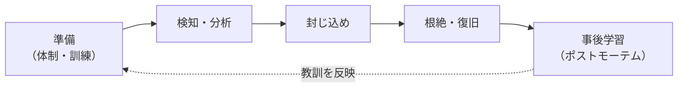

# 11.5 セキュリティ運用とサプライチェーン

> セキュリティは「作って終わり」ではありません。毎日公表される脆弱性の洪水から重要なものを選び、依存する何百ものライブラリが汚染されていないか気を配り、秘密情報の漏えいを防ぎ、事故が起きたら対応する——この「運用」こそが、実際の安全性を左右します。この章では、脆弱性管理・ソフトウェアサプライチェーン・秘密情報管理・インシデント対応を、実務のツールを自作しながら学び、組織としてのセキュリティプログラムをどう育てるかを考えます。

| 項目 | 内容 |
|---|---|
| 学習時間の目安 | 本文 4h ＋ 演習 4h |
| 前提となる章 | [11.1 セキュリティの基本原則](../01-security-principles/README.md)、[8.4 CI/CDとリリースエンジニアリング](../../08-software-engineering/04-ci-cd-and-release/README.md)、[10.5 インシデント対応とポストモーテム](../../10-cloud-and-sre/05-incident-management/README.md) |
| 演習 | [exercises/](exercises/)（Python） |
| キーワード | CVE, CVSS, EPSS, KEV, SBOM, SLSA, サプライチェーン, 秘密情報管理, CI/CD, インシデント対応 |

## この章のゴール

- [ ] CVE・CVSS・EPSS・KEV を使い分け、脆弱性に現実的な優先順位を付けられる
- [ ] ソフトウェアサプライチェーン攻撃（依存関係の汚染・依存混同）の仕組みと、SBOM・署名・ピン留めによる防御を説明できる
- [ ] 秘密情報の漏えいを防ぐ仕組み（vault・短命クレデンシャル・秘密情報スキャン）を説明・実装できる
- [ ] CI/CD とクラウドのセキュリティの要点（最小権限・OIDC・設定ミスの防止・監査ログ）を説明できる
- [ ] インシデント対応のライフサイクルと、ランサムウェアへの備えを説明できる
- [ ] セキュリティプログラムを「基本から段階的に」築く順序を、優先順位とともに説明できる

## なぜ学ぶのか

近年の重大な侵害の多くは、自社のコードのバグではなく **運用とサプライチェーン** から起きています。

- **サプライチェーン攻撃の激化**: 2020 年の **SolarWinds** 事件では、ビルドパイプラインに侵入され、正規の署名付きアップデートにバックドアが仕込まれ、多数の政府機関・企業に配布されました。2021 年 12 月の **Log4Shell**（CVE-2021-44228）は、広く使われる Java ログライブラリ Log4j の脆弱性で、世界中が緊急対応に追われました。2024 年 3 月に発覚した **xz utils のバックドア**（CVE-2024-3094）は、攻撃者が数年かけてオープンソースプロジェクトのメンテナーの信頼を得て、圧縮ライブラリにバックドアを仕込んだ、というサプライチェーン攻撃の新たな形を示しました。IPA の「情報セキュリティ10大脅威 2026［組織編］」でも「サプライチェーンや委託先を狙った攻撃」は 2 位です。
- **依存混同（dependency confusion）**: 2021 年、研究者の Alex Birsan は、企業の内部パッケージ名と同じ名前のパッケージを公開レジストリに登録すると、ビルドツールが誤って公開側を取得してしまうことを示し、多数の大企業のシステムでコードを実行させました。2018 年の **event-stream**（npm の人気パッケージが乗っ取られ悪意あるコードが混入）、2021 年の **Codecov** の Bash Uploader 改ざんも、サプライチェーンの脆さを示す事例です。
- **秘密情報の漏えい**: API キーやトークンを誤って Git にコミットする事故は日常的に起きています。公開リポジトリにコミットされた AWS キーが数分でスキャンされ悪用される、という話は珍しくありません。
- **委託先・取引先が踏み台になる（日本の事例）**: 2022 年、大阪急性期・総合医療センターがランサムウェアの被害を受け、電子カルテが使えず外来診療などが長期間停止しました。同センターの調査報告書（2023 年）によれば、攻撃者は **給食の委託事業者** のシステムの脆弱性を突いて侵入し、そこから病院のネットワークへ横展開したとされています。自社のセキュリティが強くても、つながっている委託先や取引先が弱ければ、そこが侵入口になります。

これらに共通するのは、**「自分たちのコードが完璧でも、依存や運用の隙、そしてつながった先の弱さから破られる」** という現実です。この章では、この現実に対処する運用の技術を学びます。

## 1. 脆弱性管理 — 洪水から重要なものを選ぶ

### 1.1 CVE・CVSS・EPSS・KEV

毎日大量の脆弱性が公表される中で、すべてに即対応はできません。優先順位付けのための指標を使い分けます。

| 指標 | 何を表すか | 注意 |
|---|---|---|
| **CVE** | 脆弱性の一意な識別子（CVE-2021-44228 など） | 「深刻さ」ではなく「名前」 |
| **CVSS** | 脆弱性そのものの深刻度（0.0〜10.0）。v3.1 / v4.0 | 「どれだけ危険か」だが「悪用されるか」は表さない |
| **EPSS** | 今後 30 日以内に悪用される確率（0.0〜1.0） | 「悪用されそうか」を予測。実データに基づく |
| **KEV** | CISA が公表する「悪用が確認された脆弱性」カタログ | 「もう悪用されている」——最優先の根拠 |

**CVSS だけで優先順位を付けるのは失敗のもと** です。CVSS が高い脆弱性は毎月大量に出ますが、実際に悪用されるのはごく一部です。CVSS（深刻度）に、EPSS（悪用されやすさ）・KEV（悪用の実績）・**自社での露出（インターネットに面しているか）と資産の重要度** を組み合わせて、初めて現実的な優先順位が付きます。

これらのエコシステムも動いています（2026 年時点。一次情報で最新を確認）。EPSS は 2025 年に v4 に更新され、予測に使うデータが拡充されました。CVE 番号を採番する CVE プログラム（MITRE が運営）は 2025 年 4 月に運営資金の契約が期限切れ寸前になり、CISA が延長して危機を回避する一幕がありました——脆弱性管理の根幹インフラが、こうした運営上のリスクを抱えていることも意識しておく価値があります。

演習 `vuln_triage.py` で、この多面的なトリアージを実装します。

```text
（演習 vuln_triage.py の出力）
Log4Shell 風（CVSS 10.0, EPSS 0.94, KEV, 外部公開, 重要資産）: P1 期限 7 日 critical
低リスク例（CVSS 6.5, EPSS 0.02, 内部, 低重要度）:            P4 期限 180 日
```

実際に、この 5 つを組み合わせて優先順位を付けると、CVSS だけで並べた場合とは順序が変わります。演習 `vuln_triage.py` を使った例です。

```text
脆弱性                        CVSS  EPSS KEV 公開 重要度  優先 期限(日)
CVE-2021-44228 (Log4Shell)   10.0  0.94  Y   Y    5    P1    7
CVE-2024-3094 (xz)           10.0  0.10  Y   -    4    P1    7
CVE-2099-BBBB 公開だが低EPSS    7.5  0.03  -   Y    3    P2   30
CVE-2099-AAAA 内部のみ          9.8  0.02  -   -    2    P3   90   ← CVSS は高いが後回し
CVE-2099-CCCC 情報漏えい低       4.3  0.01  -   -    1    P4  180
```

注目すべきは、**CVSS 9.8 の「内部のみ」の脆弱性（P3）より、CVSS 7.5 でも「外部公開」の脆弱性（P2）が優先される** 点です。CVSS の点数だけで並べると、実際には攻撃者が到達できない内部の脆弱性に労力を吸い取られ、外部公開の危ないものが後回しになりかねません。KEV（悪用の実績）と外部露出を効かせることで、この逆転を正します。

### 1.2 パッチ SLA

優先度に応じて「いつまでに直すか」の目標（SLA）を定めます。深刻度と露出を組み合わせた SLA の例です（自社のリスク許容度に応じて決めます）。

| 優先度 | 条件の例 | 修正期限（外部公開） | 修正期限（内部のみ） |
|---|---|---|---|
| P1 | KEV 掲載、または CVSS 重大 × 外部公開 | 7 日 | 14 日 |
| P2 | EPSS 高、または CVSS 高 × 外部公開 | 30 日 | 60 日 |
| P3 | CVSS 高、または EPSS 中 | 90 日 | 90 日 |
| P4 | それ以外 | 180 日 | 次の定期更新で |

CISA は米政府機関向けに KEV の是正期限を定めており、多くの組織がこれを参考にします。重要なのは、**SLA を定め、達成率を測り（期限内に直せた割合をダッシュボードで追う）、守れない場合は例外承認とリスク受容を記録する** 運用です。SLA は「守れない飾り」にしないこと——達成率が低いなら、SLA が厳しすぎるか、体制が足りないかのどちらかで、経営の判断が要ります。

## 2. ソフトウェアサプライチェーン

### 2.1 攻撃の類型

現代のソフトウェアは、大部分が外部の依存関係（ライブラリ、コンテナイメージ、ビルドツール、CI アクション）でできています。この「供給網」のどこかが汚染されると、自社のコードが完璧でも侵害されます。

- **既知の脆弱性を持つ依存**: 使っているライブラリに CVE がある（Log4Shell が典型）。SCA で検出する。
- **タイポスクワッティング**: 人気パッケージに似た名前（`reqeusts` など）で悪意あるパッケージを公開し、打ち間違いを狙う。
- **依存混同（dependency confusion）**: 内部パッケージと同名のものを公開レジストリに置き、ビルドツールに公開側を取らせる。
- **正規パッケージの乗っ取り**: メンテナーのアカウントをフィッシングで奪う、または信頼を得て権限を得てから、正規パッケージに悪意あるコードを注入する（xz utils、event-stream）。
- **ビルドパイプラインへの侵入**: ビルド環境を侵害し、正規の成果物にバックドアを仕込む（SolarWinds）。

主要な事件から、それぞれ異なる教訓が得られます。

| 事件 | 何が起きたか | 教訓 |
|---|---|---|
| SolarWinds（2020） | ビルドシステムに侵入され、正規の署名付きアップデートにバックドアが混入。多数の組織に配布された | 署名だけでは不十分。ビルド環境自体の完全性（SLSA、ビルドの出所）が要る |
| Log4Shell（CVE-2021-44228, 2021） | 広く使われる Log4j の脆弱性で、リモートコード実行が可能に | 「どこで何を使っているか」を即答できる SBOM が、緊急対応の速度を決める |
| Codecov（2021） | CI で使う Bash Uploader が改ざんされ、CI 上の秘密情報が流出 | CI が扱う秘密の管理と、CI ツールの完全性検証 |
| xz utils（CVE-2024-3094, 2024） | 攻撃者が数年かけてメンテナーの信頼を得て、圧縮ライブラリにバックドアを仕込んだ | 人の信頼を悪用する攻撃。単独メンテナーの重要 OSS の脆さ |
| npm の chalk/debug など（2025） | 人気パッケージのメンテナーがフィッシングされ、悪意ある版が公開された | メンテナーの MFA（パスキー）と、依存の即時追従を避けること |

これらに共通する構造は、「自分たちのコードが完璧でも、信頼して取り込んでいる外部の何か（依存・ビルド・CI・メンテナー）が汚染される」ことです。だから防御も、自作コードだけでなく供給網全体に広げます。

### 2.2 SBOM — 部品表

**SBOM（Software Bill of Materials、ソフトウェア部品表）** は、「このソフトウェアが、どのライブラリのどのバージョンを含むか」の一覧です。新しい脆弱性（次の Log4Shell）が公表されたとき、SBOM があれば「自社のどの製品が影響を受けるか」を即座に答えられます。SBOM がないと、この問いに何日もかかります。

標準フォーマットは 2 つ: **SPDX**（ISO/IEC 5962 として標準化）と **CycloneDX**（ECMA-424 として標準化。OWASP 発）です。CycloneDX の中身は、次のようなコンポーネントの一覧です（簡略版。演習のフィクスチャと同じ形）。

```json
{
  "bomFormat": "CycloneDX", "specVersion": "1.5",
  "components": [
    { "type": "library", "name": "log4j-core", "version": "2.14.1",
      "purl": "pkg:maven/org.apache.logging.log4j/log4j-core@2.14.1" },
    { "type": "library", "name": "requests", "version": "2.31.0",
      "purl": "pkg:pypi/requests@2.31.0" }
  ]
}
```

`purl`（package URL）が、エコシステム（maven, pypi, npm）・名前・バージョンを一意に表します。演習 `sbom_match.py` で、この CycloneDX を読み、脆弱性フィードのバージョン範囲と突き合わせて「どの依存に、どの脆弱性があり、どのバージョンで直るか」を出すツールを作ります。核心は **バージョンの正しい比較** です。

```text
（演習 sbom_match.py の出力）
1.10.0 vs 1.9.0 の比較: 1        （文字列順ではなく数値順で 1.10.0 > 1.9.0）
2.14.1 は <2.15.0 を満たすか: True   （log4j 2.14.1 は Log4Shell の影響範囲）
```

`"1.10.0" < "1.9.0"`（文字列比較では真になってしまう）を正しく `1.10.0 > 1.9.0` と判定できないと、脆弱なバージョンを見逃します。演習でセマンティックバージョニング風の比較を実装します。

### 2.3 防御 — 署名・ピン留め・SLSA

- **ロックファイル**: 依存の正確なバージョンとハッシュを固定し、ビルドの再現性を保つ。
- **署名（Sigstore/cosign）**: 成果物やコンテナイメージに署名し、「本物か」を検証できるようにする。Sigstore は署名を手軽にした仕組み。
- **再現可能ビルド（reproducible builds）**: 同じソースから誰がビルドしても同じ成果物になるようにし、ビルドの改ざんを検知可能にする。
- **SLSA（Supply-chain Levels for Software Artifacts）**: サプライチェーンの成熟度を段階（レベル）で示すフレームワーク。ビルドの出所（provenance）を検証可能にすることを目指します（ビルドトラックの例）。

  | レベル | 求められること | 防げる脅威 |
  |---|---|---|
  | L0 | 何もなし | — |
  | L1 | ビルドの出所（どのソースから・どう作ったか）を記録・提供する | 出所の詐称の一部 |
  | L2 | 署名付きの出所を、ホスト型のビルドサービスが生成する | ビルド後の改ざん |
  | L3 | ビルドが分離・改ざん耐性のある環境で行われる | ビルド環境への侵入（SolarWinds 型） |

  SLSA v1.2（2025 年）では、ソースの管理を対象にする「ソーストラック」も加わりました（2026 年時点、最新は一次情報で確認）。

- **依存のピン留めとレビュー**: 依存を最新に自動追従させず、更新をレビューする。GitHub Actions などの CI アクションは、タグではなく **コミット SHA でピン留め** する（タグは書き換えられる。後述の CI 事故の教訓）。

## 3. 秘密情報の管理

### 3.1 秘密をコードに置かない

API キー・パスワード・トークン・秘密鍵といった **秘密情報（secrets）** をソースコードや設定ファイルに直接書くのは、最も多い事故の 1 つです。Git にコミットされた秘密は、後から履歴を消しても「一度漏れたもの」として扱い、必ずローテーション（無効化して再発行）せねばなりません。

秘密情報を守るパターンは、「漏れにくくする」だけでなく「漏れても被害が小さい・気づける」方向に進化しています。

| パターン | 内容 | 効果 |
|---|---|---|
| vault（秘密管理サービス） | 秘密を一元管理し、アクセスを制御・監査する（HashiCorp Vault、クラウドの Secrets Manager など） | 散在をなくし、誰がいつ使ったか追える |
| 短命クレデンシャル | 長期の固定鍵ではなく、必要なときに発行され数分〜数時間で失効する認証情報 | 漏れても被害の窓が狭い |
| 動的シークレット | DB の認証情報などを、要求時にその場で発行し使い捨てる | 固定パスワードをなくす |
| 秘密情報スキャン | コミット・コードベースを走査し漏れた秘密を検知（pre-commit と CI） | そもそもコミットさせない／早期に気づく |
| ローテーション | 定期的に、また漏えい時に鍵を交換する | 古い秘密を無効化する |

原則は、**「長期の固定秘密をできるだけ持たない」** ことです。人にもサービスにも短命の認証情報を動的に配る方向（[11.3](../03-authn-authz/README.md) のワークロードアイデンティティ、[10.1](../../10-cloud-and-sre/01-cloud-and-iac/README.md) の IAM ロール）が主流です。

### 3.2 秘密情報スキャンを作る

演習 `secret_scan.py` で、秘密情報スキャナを実装します。2 つの見つけ方を組み合わせます。

- **既知の形式を正規表現で捕まえる**: AWS のアクセスキー ID（`AKIA` で始まる 20 文字）、GitHub トークン（`ghp_` で始まる）、秘密鍵のヘッダ（`-----BEGIN ... PRIVATE KEY-----`）。
- **ランダムに見える文字列をエントロピーで捕まえる**: 形式が分からない秘密は、**シャノンエントロピー**（文字のばらつき）が高いことを手がかりに検出する。ただし誤検知が多いので、長さの閾値や許可リスト（`# pragma: allowlist secret` のようなコメント）と組み合わせる。

```text
（演習 secret_scan.py の出力。値はすべて偽物）
1 行目 aws-access-key-id  AKIA...LE
2 行目 github-token       ghp_...cd
（3 行目は許可コメント付きなので検出しない）
```

## 4. CI/CD とクラウドのセキュリティ

### 4.1 CI/CD パイプラインを守る

CI/CD パイプラインは、コードを本番に届ける経路であり、強力な権限を持ちます。ここが侵害されると、正規の経路で悪意あるコードが本番に流れます。2025 年 3 月に発覚した GitHub Actions の **tj-actions/changed-files** の改ざん事件（CVE-2025-30066）では、広く使われる CI アクションのタグが書き換えられ、多くのリポジトリのワークフローログに秘密情報が露出しました。教訓は明確です。

CI を固めるチェックリスト:

- [ ] サードパーティのアクション・イメージは **タグではなくコミット SHA / ダイジェストでピン留め** する（タグは書き換えられる）。更新は自動 PR にしてレビューする。
- [ ] パイプラインの **権限は最小限**（既定を読み取り専用にし、必要なジョブにだけ必要な権限を付与）。
- [ ] クラウドへの認証は **OIDC で短命クレデンシャル**。CI に長期の固定鍵を保存しない。信頼する条件をリポジトリ・ブランチで絞る。
- [ ] **秘密情報スキャン** をコミットフックと CI に入れ、秘密がコミットされないようにする。
- [ ] **フォークからの PR に秘密を渡さない**（`pull_request_target` のような強い権限のトリガーで、信頼できないコードを実行しない）。
- [ ] 本番へのデプロイは **保護ブランチ・環境と承認** に限定する。ビルドの出所（SLSA）を記録する。

これらは、前述の tj-actions（SHA ピン留めで防げた）や Codecov（CI の秘密の管理）の教訓そのものです。

### 4.2 クラウドのセキュリティ

クラウドの侵害原因は、多くの調査で **「設定ミス」が最上位** とされます。攻撃の高度化より、「公開設定のままのストレージ」「広すぎる IAM 権限」「開けっぱなしのポート」が問題です。

よくある設定ミスと、その対策を挙げます。

| 設定ミス | 何が起きるか | 対策 |
|---|---|---|
| ストレージ（バケット）を公開設定のまま | 個人情報や機密データが誰でも読める | 既定で非公開、公開はレビュー必須、CSPM で検知 |
| IAM 権限が広すぎる（`*:*` や管理者権限を常用） | 1 つの侵害が全体に波及する | 最小権限、権限の棚卸し、短命な昇格 |
| セキュリティグループでポートを全開放（`0.0.0.0/0`） | 管理ポート（SSH/RDP/DB）が世界に開く | 必要な送信元だけ許可、踏み台や VPN 経由 |
| 監査ログ（CloudTrail 等）が無効・保存期間が短い | 事故調査ができない、証拠が消える | 全リージョンで有効化、改ざん不能な保管、十分な保存期間 |
| 暗号化・MFA が未設定 | 媒体盗難やアカウント乗っ取りに弱い | 保存時暗号化を既定に、ルートアカウントに MFA |

- **設定ミスの検知（CSPM）**: クラウドの設定を継続的にスキャンし、危険な設定（公開バケットなど）を自動検出する。IaC（[10.1](../../10-cloud-and-sre/01-cloud-and-iac/README.md)）の段階でポリシーチェックを回すと、そもそも危険な設定をデプロイさせない（シフトレフト）。
- **IAM の最小権限**: 役割・ポリシーを必要最小限にする。「とりあえず管理者権限」を避ける（[11.1](../01-security-principles/README.md) の最小権限）。
- **監査ログ**: すべての操作を記録する（AWS の CloudTrail など）。「誰が・いつ・何をしたか」が後から追えることが、検知と事故調査の土台。
- **ログと SIEM**: ログを集約・分析し、異常を検知する（SIEM）。[10.4 オブザーバビリティ](../../10-cloud-and-sre/04-observability/README.md) の技術基盤の上に、セキュリティの視点を加える。

## 5. 検知・対応・復旧

### 5.1 検知と対応の体制

侵入は防ぎきれない前提で、「早く気づいて、早く対応する」体制を作ります。主な道具と役割は次の通りです。

| 略語 | 何をするか | 見るもの |
|---|---|---|
| EDR | 端末・サーバー上の不審な挙動を検知・対応（隔離など） | エンドポイントのプロセス・ファイル・通信 |
| SIEM | ログを集約・相関分析し、異常やルール違反を検知 | あらゆるログ（認証・ネットワーク・アプリ） |
| SOAR | 検知後の対応を自動化する（プレイブック） | アラートと対応手順 |
| SOC | セキュリティ監視を担う専門チーム（自前） | 上記ツールのアラート |
| MDR | SOC を外部に委託するサービス | 同上（24 時間の監視を外注） |

24 時間の監視を自前（SOC）で持つのは重いので、多くの組織は **MDR**（外部委託）を使います。ツールを入れるだけでなく、**アラートに人が対応できる体制**（オンコール、エスカレーション。[10.5](../../10-cloud-and-sre/05-incident-management/README.md)）とセットにしないと、アラートは鳴りっぱなしで見過ごされます（アラート疲れ）。検知の網羅性は、[11.1](../01-security-principles/README.md) の MITRE ATT&CK で「どの攻撃技術を検知できているか」を点検します。

### 5.2 インシデント対応のライフサイクル

セキュリティ事故への対応は、体系立てておく必要があります。NIST SP 800-61 が参照モデルで、Rev. 3（2025 年）ではサイバーセキュリティフレームワーク（CSF 2.0）と整合するよう再編されました（2026 年時点。最新を確認）。伝統的なライフサイクルは次の流れです。



技術的な障害対応（[10.5 インシデント対応とポストモーテム](../../10-cloud-and-sre/05-incident-management/README.md)）と共通点が多いですが、セキュリティ事故には特有の注意があります。**証拠の保全**（フォレンジックのため、慌てて再起動・初期化せず、ログ・メモリ・ディスクを保全する）、法的・規制上の**報告義務**（個人情報の漏えいは個人情報保護委員会への報告義務など。[14.5 ガバナンス・リスク・コンプライアンス](../../14-cto/05-governance-risk-compliance/README.md) と [14.6 危機管理](../../14-cto/06-crisis-management/README.md)）、そして **非難しない文化**（誰が悪いかではなく、なぜ起きたか）です。

具体的な初動を、簡単なランナーブックの形にすると次のようになります（「認証情報の漏えいが疑われる」ケースの例）。平時にこれを用意し、訓練しておくのが要点です。

```text
インシデント対応ランブック例: 認証情報の漏えい疑い
0. 記録開始    : 対応開始時刻・担当・判断を、時系列の意思決定ログに書き始める
1. 招集        : インシデント指揮官（IC）を決め、必要な担当（インフラ・法務・広報）を招集
2. 証拠保全    : 関連ログ（監査ログ・アクセスログ）を保全。保存期間が短いものから先に確保
3. 封じ込め    : 漏れた疑いのある認証情報を無効化（ローテーション）。不審なセッションを失効
4. 影響範囲    : その認証情報で何にアクセスできたか、実際に何が行われたかをログで特定
5. 根絶        : 侵入経路（フィッシング・漏えいした鍵）を塞ぐ。他に同種の穴がないか確認
6. 復旧        : 正常な状態に戻す。監視を強化して再発・再侵入を見張る
7. 報告        : 個人情報の漏えい等なら報告義務を確認（→ 14.5）。契約上の通知義務も確認
8. 事後学習    : ブレームレスなポストモーテムで、仕組みの改善点をアクションにする（→ 10.5）
```

「封じ込め（3）を急ぐと証拠（2）が消える」といったトレードオフがあるため、判断の根拠を意思決定ログに残します。詳しい危機対応（身代金の是非、対外広報、日本の報告義務の期限）は [14.6 危機管理](../../14-cto/06-crisis-management/README.md) で扱います。

**フォレンジック（証拠保全）の基礎** も押さえておきます。事故の原因究明や、場合によっては法的手続きのために、証拠は「壊さず・変えず・後から検証できる形で」保全します。要点は、(1) **揮発性の高いものから先に**（メモリ上のプロセスや接続は再起動で消えるので、ディスクより先に取得する）、(2) **原本を変えない**（調査は複製に対して行い、原本はハッシュ値を取って封印する）、(3) **取り扱いの記録（chain of custody）を残す**（誰が・いつ・何をしたか。証拠が改ざんされていないことを示すため）です。慌てて再起動・初期化すると、侵入経路の手がかりが消えます。自前で対応が難しければ、専門のインシデント対応（DFIR）業者に依頼します。クラウドの監査ログは保存期間が短い設定だと消えるので、真っ先に保全します。

### 5.3 ランサムウェアへの備え

ランサムウェアは、IPA の脅威ランキングで長年 1 位を占める最大の脅威です。備えの要点は「侵入を防ぐ」だけでなく「侵入されても事業を続けられる」ことです。

- **バックアップを、オフライン/変更不能（イミュータブル）に保つ**: バックアップまで暗号化されては意味がない。ネットワークから切り離した、または上書き・削除できないバックアップを持つ。そして **復旧を実際に試す**（テストしていないバックアップは、ないのと同じ）。
- **ネットワーク分割（セグメンテーション）**: 侵入が全社に広がらないよう、ネットワークを分ける。横展開を止める。
- **MFA と EDR とパッチ**: 侵入経路（フィッシング、露出した RDP、未パッチの脆弱性）を塞ぐ。

## 6. セキュリティプログラムを段階的に築く

セキュリティは、高価な製品を一度に買えば実現するものではありません。**基本から順に、費用対効果の高いものから積み上げる** のが鉄則です。多くの組織にとっての優先順位は、おおむね次の通りです。

1. **基本の徹底（まずこれ）**: 全社 MFA、パッチ適用、バックアップ（と復旧テスト）、ログ収集、最小権限。これだけで攻撃の大半を防げる。
2. **可視化**: 資産の棚卸し、SBOM、脆弱性スキャン、秘密情報スキャン。「何を持っているか」を知る。
3. **プロセス**: 脆弱性管理の SLA、インシデント対応計画、セキュアな開発（脅威モデリング・SAST/DAST）。
4. **高度化**: SIEM、EDR/MDR、ゼロトラスト、バグバウンティ、レッドチーム。

**順序を飛ばさないこと** が重要です。MFA もパッチもないのに高価な SIEM を買うのは、玄関の鍵をかけずに監視カメラを増やすようなものです。

### 6.1 会社のステージ別ロードマップ

投資できる余力と、抱えるリスクは、会社の成長段階で変わります。段階ごとの「まずやること」の目安です（事業内容で前後します）。

| ステージ | 状況 | 優先して着手すること |
|---|---|---|
| シード（〜数十人） | 人も金も限られる。まず基本 | 全社 MFA（できればパスキー）、パスワードマネージャー、クラウドの最小権限と監査ログ有効化、バックアップ、秘密情報スキャン、依存の SCA。専任は置けないので「安全な既定」を仕組みで |
| 成長期（数十〜数百人） | 顧客が増え、攻撃対象と規制要求が拡大 | 脆弱性管理の SLA、SBOM、CI の堅牢化、SSO/IdP への集約と入退社の自動化（SCIM）、脆弱性診断の定期実施、インシデント対応計画、セキュリティ専任・チャンピオン制度 |
| IPO 準備・エンタープライズ | 監査・認証・大口顧客の要求 | ISMS/SOC 2 などの認証、IT 全般統制（J-SOX。[14.5](../../14-cto/05-governance-risk-compliance/README.md)）、SIEM/EDR/MDR による 24 時間監視、ゼロトラストの本格導入、バグバウンティ、机上演習、取締役会への定期報告 |

どのステージでも、土台（MFA・パッチ・バックアップ・ログ・最小権限）は共通です。上のステージの施策は、下の土台があって初めて効きます。CTO の仕事は、**自社が今どのステージにいて、次に何に投資すべきかを見極め、経営に説明する** ことです。

### 6.2 日本の枠組みと組織

- **METI「サイバーセキュリティ経営ガイドライン」（Ver 3.0, 2023 年）**: 経営者が認識すべき原則と、指示すべき重要 10 項目をまとめた、日本の経営層向けの定番。CTO・経営層が自組織のセキュリティを点検する枠組みとして有用。
- **IPA「情報セキュリティ10大脅威」（毎年）**: 日本の組織・個人が直面する脅威のランキング。自組織の脅威モデルの出発点。
- **JPCERT/CC**: 日本のインシデント対応の調整機関。脆弱性情報の届け出・調整や、インシデントの相談先。
- 2025 年には政府のサイバーセキュリティ体制も再編され（国家サイバー統括室の発足など）、能動的サイバー防御に向けた法整備が進みました。制度は動いているので、最新を一次情報で確認してください。

## よくある落とし穴

1. **CVSS の点数だけで優先順位を付ける**。深刻度が高くても悪用されない脆弱性は多い。EPSS・KEV・自社の露出・資産重要度を組み合わせる。
2. **依存ライブラリを「自分のコードではない」と軽視する**。ソフトウェアの大半は依存でできている。SCA・SBOM・ピン留め・署名検証で供給網を守る。
3. **秘密情報をコードや設定に直書きする**。一度コミットした秘密は必ずローテーションする。vault・短命クレデンシャル・秘密情報スキャンを使う。
4. **CI アクションをタグでピン留めする**。タグは書き換えられる。サードパーティのアクションはコミット SHA で固定する。CI には長期鍵を置かず OIDC を使う。
5. **バックアップを取っているが復旧を試していない**。テストしていないバックアップは、いざというとき使えないことが多い。ランサムウェア対策には、変更不能なバックアップと定期的な復旧訓練が要る。
6. **クラウドの設定ミスを軽視する**。侵害原因の最上位は高度な攻撃ではなく設定ミス（公開バケット、広すぎる IAM）。CSPM と最小権限で継続的に点検する。
7. **セキュリティ事故で証拠を保全せずに復旧を急ぐ**。慌てて初期化・再起動すると、原因究明と法的対応に必要な証拠が消える。保全してから対応する。
8. **基本を飛ばして高度な製品を買う**。MFA・パッチ・バックアップ・ログ・最小権限という土台なしに SIEM や EDR を入れても効果は薄い。順序を守る。

## CTOの視点

1. **脆弱性トリアージを「回る仕組み」にする**。脆弱性はゼロにできないので、「重要なものから確実に直る」プロセスが要です。CVSS だけでなく EPSS・KEV・自社の露出・資産重要度で優先順位を付け、優先度ごとのパッチ SLA を定め、達成率を測る。この仕組みがないと、チームは大量の脆弱性に埋もれて、結局どれも直せません。演習の `vuln_triage.py` のような多面的な優先順位付けを、自社のポリシーとして定義します。
2. **サプライチェーンを「見える化」する**。「次の Log4Shell が来たとき、自社のどの製品が影響を受けるか、何時間で答えられるか」を自問します。答えが「何日もかかる」なら、SBOM の生成と管理を仕組み化すべきです。あわせて、依存の SHA ピン留め・署名検証・OIDC による CI の脱・長期鍵を、開発基盤の標準にします。これらは事故が起きてから慌てて入れるより、平時に組み込む方がはるかに安い。
3. **秘密情報とクラウド設定の事故を「起きない仕組み」で防ぐ**。秘密の直書きとクラウドの設定ミスは、最も多く、最も防ぎやすい事故です。秘密情報スキャンをコミットフックと CI に、CSPM をクラウドに常時走らせ、「危険なことをするには意図的な操作が要る」状態を作ります。これは個人の注意力に頼るより確実です。
4. **セキュリティプログラムを段階で設計し、経営に説明する**。「基本（MFA・パッチ・バックアップ・ログ・最小権限）→ 可視化 → プロセス → 高度化」という順序を、自社の現在地とともに経営陣・取締役会に示します（[14.4](../../14-cto/04-executive-communication/README.md)）。METI の「サイバーセキュリティ経営ガイドライン」は、経営層と対話する共通言語として使えます。予算は「流行の製品」ではなく「今の段階で最も効くもの」に配分します。
5. **事故は「起きる前提」で準備する**。インシデント対応計画を作り、訓練し、証拠保全・報告義務（個人情報保護委員会、JPCERT/CC など）・広報の手順を平時に整えます（[14.6 危機管理](../../14-cto/06-crisis-management/README.md)）。事故の最中に手順を考えるのでは遅い。そして事後のポストモーテムでは、個人を責めず、仕組みを直す文化を CTO が守ります。この備えの有無が、事故を「学びのある試練」にするか「事業の致命傷」にするかを分けます。

## 演習

演習コードは [exercises/](exercises/) にあります。テストで使う秘密情報の値は、すべて明らかに偽物です。

```bash
python3 tools/check.py 11.5
python3 tools/check.py -v 11.5
```

| # | 難易度 | 内容 | 対象ファイル |
|---|---|---|---|
| 1 | ★★☆ | CVSS＋EPSS＋KEV＋露出＋資産重要度で脆弱性をトリアージし、優先度とパッチ期限を出す | `vuln_triage.py` |
| 2 | ★★☆ | CycloneDX の SBOM を解析し、脆弱性フィードのバージョン範囲と突き合わせる（バージョン比較を実装） | `sbom_match.py` |
| 3 | ★★☆ | 秘密情報スキャナ（既知パターン＋シャノンエントロピー＋許可リスト、行番号付き） | `secret_scan.py` |

## 理解度チェック

**Q1. 「CVSS 9.8 の脆弱性 A」と「CVSS 6.5 だが KEV に載っていて自社の外部公開サーバーにある脆弱性 B」、どちらを優先すべきですか。**

<details>
<summary>解答</summary>

一概に A とは言えず、多くの場合 B を優先すべきです。CVSS は「脆弱性そのものの深刻度」を表しますが、「実際に悪用されるか」「自社が露出しているか」は表しません。B は KEV に載っている（＝実際に悪用が確認されている）うえ、外部公開サーバーにある（＝攻撃者が到達できる）ので、現実の危険は高いと言えます。A が CVSS 9.8 でも、悪用コードが存在せず（EPSS が低く）、内部ネットワークの奥にしかないなら、緊急度は下がります。脆弱性管理では、CVSS 単独ではなく、EPSS・KEV・自社での露出・資産の重要度を組み合わせて優先順位を付けます。演習 `vuln_triage.py` がこの考え方を実装します。

</details>

**Q2. SBOM（ソフトウェア部品表）があると、次の Log4Shell 級の脆弱性が公表されたときに何ができますか。**

<details>
<summary>解答</summary>

「自社のどの製品・サービスが、その脆弱なライブラリ（の脆弱なバージョン）を含んでいるか」を即座に特定できます。SBOM は「各成果物がどの依存のどのバージョンを含むか」の一覧なので、脆弱性フィードのバージョン範囲と突き合わせれば、影響を受ける箇所が機械的に分かります。SBOM がないと、この問いに答えるために全リポジトリを手作業で調べることになり、対応が何日も遅れます。緊急対応では、この「影響範囲を何時間で特定できるか」が被害の大きさを左右します。演習 `sbom_match.py` で、この突き合わせを実装します。

</details>

**Q3. 依存混同（dependency confusion）攻撃とは何ですか。どう防ぎますか。**

<details>
<summary>解答</summary>

企業が使う内部（プライベート）パッケージと同じ名前のパッケージを、攻撃者が公開レジストリ（npm や PyPI）に登録する攻撃です。ビルドツールの設定によっては、公開レジストリの方を（しばしばバージョンが高いという理由で）優先して取得してしまい、攻撃者のコードが社内のビルドで実行されます。2021 年に Alex Birsan が多数の大企業で実証しました。防ぎ方は、内部パッケージの名前空間（スコープ）を予約する、内部レジストリを優先するようビルドツールを明示的に設定する、依存をロックファイルとハッシュで固定する、などです。

</details>

**Q4. API キーを誤って Git にコミットしてしまいました。「履歴から削除すれば大丈夫」でしょうか。**

<details>
<summary>解答</summary>

大丈夫ではありません。一度でもコミット・プッシュされた秘密は「漏れた」と扱い、**必ずローテーション（そのキーを無効化し、新しいキーを発行）** しなければなりません。理由は、履歴を書き換えても、既にクローン・フォーク・キャッシュ・スキャンされている可能性があるからです。公開リポジトリでは、コミットされたキーが自動スキャンで数分以内に発見・悪用される事例が知られています。加えて、再発防止として秘密情報スキャンをコミットフック（pre-commit）や CI に組み込み、そもそもコミットされないようにします。演習 `secret_scan.py` がそのスキャナです。

</details>

**Q5. CI/CD で「サードパーティのアクションをコミット SHA でピン留めする」「OIDC で短命クレデンシャルを使う」のは、それぞれ何を防ぎますか。**

<details>
<summary>解答</summary>

**SHA でのピン留め**: タグ（`@v1` など）は、後からリポジトリ所有者や攻撃者に書き換えられます。2025 年の tj-actions/changed-files 事件では、既存のタグが悪意あるコミットを指すよう書き換えられ、多くのワークフローが汚染されました。コミット SHA でピン留めすれば、参照先の中身が固定されるので、この種の書き換えの影響を受けません。

**OIDC による短命クレデンシャル**: CI にクラウドの長期アクセスキーを保存すると、それが漏れれば長期間悪用されます。OIDC を使うと、CI ジョブがその都度クラウドに「自分は正当な CI だ」と証明し、数分〜数十分で失効する短命トークンを受け取ります。長期鍵を保存しないので、漏えいのリスクと被害の窓が大幅に減ります。

</details>

**Q6. ランサムウェア対策として、バックアップに関して特に重要なことは何ですか。**

<details>
<summary>解答</summary>

2 つあります。第一に、バックアップを **オフラインまたは変更不能（イミュータブル）** に保つこと。ランサムウェアは、ネットワーク上でアクセスできるバックアップも暗号化・削除しようとするので、ネットワークから切り離した、あるいは一定期間上書き・削除できないバックアップが必要です。第二に、**復旧を実際にテストする** こと。「バックアップを取っている」だけでは不十分で、いざというときに本当に復旧できるか（データが完全か、手順が機能するか、時間内に戻せるか）を定期的に試していないと、事故のときに使えないことが多いのです。加えて、ネットワーク分割で横展開を止め、MFA・EDR・パッチで侵入経路を塞ぐことも重要です。

</details>

**Q7. セキュリティ予算が限られている組織が、まず投資すべきことは何ですか。なぜですか。**

<details>
<summary>解答</summary>

高価な製品（SIEM や高度な EDR）より、まず「基本」に投資すべきです。具体的には、全社の多要素認証（MFA）、パッチ適用の徹底、バックアップ（と復旧テスト）、ログ収集、最小権限。理由は、攻撃の大半が「基本の欠落」を突くからです。フィッシングで奪ったパスワード（MFA で防げる）、未パッチの既知脆弱性（パッチで防げる）、広すぎる権限（最小権限で被害を限定）といった、ありふれた手口が主流です。基本が固まっていないのに高度な監視製品を買うのは、玄関の鍵をかけずに監視カメラを増やすようなもので、費用対効果が悪い。セキュリティは「基本 → 可視化 → プロセス → 高度化」の順で、飛ばさずに積み上げます。

</details>

## さらに学ぶために

- NIST SP 800-61「Computer Security Incident Handling Guide」（Rev. 3, 2025）— インシデント対応の参照モデル。最新版はサイバーセキュリティフレームワーク（CSF 2.0）と整合。一次情報として押さえる。
- SLSA（https://slsa.dev/）と Sigstore（https://www.sigstore.dev/）の公式ドキュメント — サプライチェーンの成熟度フレームワークと、成果物署名の仕組み。実装の指針になる。
- METI「サイバーセキュリティ経営ガイドライン」（経済産業省・IPA）— 日本の経営層向けの定番。経営がセキュリティにどう関与すべきかの枠組み。CTO は一読の価値がある。
- IPA「情報セキュリティ10大脅威」「安全なウェブサイトの作り方」— 日本の脅威動向と実装対策の定番資料。毎年更新される脅威ランキングは、優先順位付けの出発点。
- Google/Microsoft などの SRE・セキュリティ関連書籍と、各社が公開するサプライチェーンセキュリティのポストモーテム — SolarWinds・Log4Shell・xz utils の分析記事は、攻撃の実態と教訓を学ぶ生きた教材（一次情報・公式発表を優先する）。

## まとめ

- 脆弱性は洪水のように出るので、CVSS 単独でなく EPSS・KEV・自社の露出・資産重要度で優先順位を付け、パッチ SLA を定めて回す。
- ソフトウェアの大半は依存でできており、サプライチェーン攻撃（依存の汚染・依存混同・ビルド侵入）が主要な脅威。SBOM・署名・ピン留め・SLSA で供給網を守る。
- 秘密情報はコードに置かず、vault・短命クレデンシャル・秘密情報スキャンで管理する。一度漏れた秘密は必ずローテーションする。
- CI/CD はアクションを SHA でピン留めし、OIDC で長期鍵を排する。クラウドの侵害原因の最上位は設定ミスなので、CSPM と最小権限で継続的に点検する。
- インシデント対応は「起きる前提」で準備する。証拠保全・報告義務・非難しない文化が、セキュリティ事故特有の要点。ランサムウェアには変更不能なバックアップと復旧訓練で備える。
- セキュリティプログラムは「基本（MFA・パッチ・バックアップ・ログ・最小権限）→ 可視化 → プロセス → 高度化」の順で、飛ばさずに積み上げる。
- CTO は、脆弱性トリアージ・サプライチェーンの見える化・秘密とクラウド設定の事故防止・段階的なプログラム設計・事故への備えを、仕組みとして組織に根づかせる。
