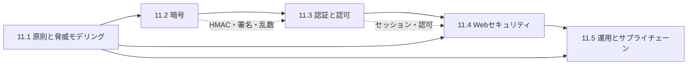

# 第11部 セキュリティ

> 「うちのシステムは安全か」という問いに、勘ではなく根拠を持って答えられるようになるための部です。攻撃者は、暗号を正面から破るより、検証の手抜き・設定ミス・使い回されたパスワード・汚染された依存関係といった「基本の隙」を突いてきます。この部では、攻撃者の視点と防御の原則を理解し、安全なシステムを設計・実装・運用し、組織としてのセキュリティプログラムを主導できるようになることを目指します。

## この部で身につくこと

- **脅威をリスクとして扱う**: CIA・真正性・否認防止で守るべきものを定め、DFD と STRIDE で脅威を洗い出し、発生可能性 × 影響度（と ALE）で優先順位を付けられる。Saltzer と Schroeder の原則・多層防御・ゼロトラストで設計をレビューできる（11.1）。
- **暗号を正しく選んで使う**: AEAD・ハッシュ・HMAC・公開鍵暗号・鍵交換・署名が「何を保証し、何を保証しないか」を説明し、ECB や nonce の再利用、非定数時間比較といった誤用を見抜ける。パスワードをソルト付きの遅いハッシュで保存し、鍵を KMS とエンベロープ暗号化で管理し、耐量子暗号への移行を計画できる（11.2）。
- **「誰が何をしてよいか」を正しく決める**: パスワード・TOTP・パスキー、セッション、OAuth 2.0 と OpenID Connect、JWT の厳格な検証、RBAC と Zanzibar 流の ReBAC を実装し、マルチテナントの認可（BOLA/IDOR）を設計で防げる（11.3）。
- **Web の脆弱性を攻撃の仕組みから理解して直す**: OWASP Top 10 を地図に、注入・XSS・CSRF・SSRF・アクセス制御の不備・パストラバーサル・競合状態を「脆弱なコード → 攻撃 → 修正」で理解し、SAST・DAST・脆弱性診断を開発プロセスに組み込める（11.4）。
- **セキュリティを運用し、組織に根づかせる**: CVSS・EPSS・KEV で脆弱性に優先順位を付け、SBOM・署名・ピン留めでサプライチェーンを守り、秘密情報・CI/CD・クラウド設定の事故を仕組みで防ぎ、インシデントに対応し、会社のステージに合ったセキュリティプログラムを段階的に築ける（11.5）。

## 章の一覧

| 章 | タイトル | 学習時間 | 主な演習 | キーワード |
|---|---|---|---|---|
| 11.1 | [セキュリティの基本原則と脅威モデリング](01-security-principles/README.md) | 本文 4h ＋ 演習 4h | `threatmodel.py`（DFD から STRIDE-per-element で脅威を生成し、リスクスコアで優先順位付け）、`risk_register.py`（固有・残存リスク、ALE、ヒートマップ）、記述: 経費精算 SaaS の脅威モデリング | CIA, リスク, ALE, キルチェーン, ATT&CK, 設計原則, 多層防御, ゼロトラスト, STRIDE, 攻撃ツリー |
| 11.2 | [暗号技術の基礎](02-cryptography/README.md) | 本文 5h ＋ 演習 5h | `toy_rsa.py`（Miller–Rabin・鍵生成・可鍛性の実演）、`hmac_impl.py`（RFC 4231 で検証する HMAC）、`block_modes.py`（自作 toy 暗号で ECB・CTR と nonce 再利用）、`passwords.py`（scrypt/PBKDF2 と needs_rehash）、記述: 暗号の設計レビュー | AES, AEAD, GCM, ハッシュ, HMAC, 長さ拡張攻撃, RSA, ECDHE, 前方秘匿性, Argon2id, KMS, 耐量子暗号 |
| 11.3 | [認証と認可](03-authn-authz/README.md) | 本文 5h ＋ 演習 5h | `totp.py`（RFC 4226/6238）、`jwt_hs256.py`（厳格な JWT 検証）、`authz.py`（RBAC とテナント分離、Zanzibar 風 ReBAC）、`pkce.py`（RFC 7636）、記述: B2B SaaS の認証・認可設計 | MFA, TOTP, パスキー, セッション, OAuth 2.0, PKCE, OIDC, SAML, SCIM, JWT, RBAC, ReBAC, BOLA |
| 11.4 | [Webアプリケーションセキュリティ](04-web-security/README.md) | 本文 5h ＋ 演習 5h | `secure_app.py`（脆弱な実装を直す: SQLi・XSS・IDOR）、`ssrf_guard.py`（変則的な IP 表記とリダイレクトまで防ぐ URL 検証）、`safe_files.py`（パストラバーサル）、`csrf_tokens.py`、記述: 脆弱なハンドラのコードレビュー | OWASP Top 10, SQLi, XSS, CSP, CSRF, SSRF, IMDSv2, IDOR, 競合状態, 脆弱性診断 |
| 11.5 | [セキュリティ運用とサプライチェーン](05-security-operations/README.md) | 本文 5h ＋ 演習 4h | `vuln_triage.py`（CVSS・EPSS・KEV・露出・重要度で優先度と期限）、`sbom_match.py`（CycloneDX とバージョン範囲の照合）、`secret_scan.py`（パターンとエントロピーによる秘密情報検出）、記述: 漏えいしたアクセスキーの初動 | CVE, CVSS, EPSS, KEV, SBOM, SLSA, Sigstore, 秘密情報管理, CI/CD, CSPM, インシデント対応, ランサムウェア |

合計の目安は、本文 約 24 時間、演習 約 23 時間です。コード演習は `python3 tools/check.py 11` でまとめてテストできます（章を指定するなら `python3 tools/check.py 11.3` のように）。

> ⚠️ この部で扱う攻撃の知識は、防御のためのものです。攻撃手法を試すのは、自分が管理するシステムか、許可された演習環境だけにしてください。許可なく他者のシステムに攻撃を試みることは、日本では不正アクセス禁止法などに触れる犯罪になり得ます。演習で自作する暗号（教科書的 RSA・toy Feistel 暗号）は **教育目的であり、本番では使いません**。

## 学習の進め方

### 章の順序と依存関係

- **11.1 は土台**: 脅威モデリング（DFD・信頼境界・STRIDE）と設計原則（最小権限・フェイルセーフ）は、以降のすべての章で「何を、なぜ守るか」を考える共通の言葉になります。
- **11.2 → 11.3 → 11.4 は一続き**: TOTP と JWT は HMAC の上に、パスキーは公開鍵署名の上に、CSRF トークンは HMAC と定数時間比較の上に成り立ちます。IDOR や CSRF の対策は、11.3 のセッションと認可の理解が前提です。
- **11.5 は最後に**: 脆弱性管理・サプライチェーン・インシデント対応は、ここまでの技術を組織として回す話です。CTO 準備トラックの人にとって最も比重の大きい章でもあります。
- **他の部とのつながり**: TLS・HTTP・Cookie の基礎は [5.3 DNS・HTTP・TLS](../05-networking/03-dns-http-tls/README.md)、SQL は [6.1](../06-databases/01-relational-model-and-sql/README.md)、RSA の数論は [2.1 離散数学](../02-math-and-algorithms/01-discrete-math/README.md)、CI/CD は [8.4](../08-software-engineering/04-ci-cd-and-release/README.md)、クラウドの IAM は [10.1](../10-cloud-and-sre/01-cloud-and-iac/README.md)、障害対応とポストモーテムは [10.5](../10-cloud-and-sre/05-incident-management/README.md) を前提または並行して読むと理解が深まります。

| トラック | 進め方 |
|---|---|
| フルトラック | 11.1 から順に。演習はすべて解く。特に 11.4 の「脆弱なコードを直す」演習は、攻撃テストを一つずつ通すことで攻撃者の視点が身につく |
| 経験者トラック | 各章の「理解度チェック」に答えてみて、答えられない章を重点的に。実務経験者ほど 11.2（AEAD・nonce・パスワード保存のパラメータ）と 11.3（JWT の検証項目、OAuth の落とし穴）に発見が多い |
| CTO 準備トラック | 11.1 と 11.5 は必修。11.2〜11.4 は「なぜ学ぶのか」「よくある落とし穴」「CTOの視点」と記述演習を中心に。11.5 の「ステージ別のセキュリティプログラム」は、自社の現在地と照らして読む |

### この部の学び方

- **攻撃を再現してから直す**: 11.2 の nonce 再利用やビット反転、11.3 の alg=none や署名の取り違え、11.4 の SQL インジェクションや SSRF は、テストの「攻撃ケース」として用意してあります。まず攻撃が成立する（テストが失敗する）ことを確かめ、次に防御を実装して通す、という順で進めると、対策の意味が腹落ちします。
- **テストベクタで仕様を確かめる**: HMAC（RFC 4231）、HOTP/TOTP（RFC 4226/6238）、PKCE（RFC 7636）、JWS（RFC 7515）は、RFC に掲載された公式のテストベクタで検証します。「仕様と 1 ビットも違わない」実装を体験すると、暗号やプロトコルを自作せずライブラリを使うべき理由もよく分かります。
- **本文のコードは実行してみる**: 本文のコード例は実際に実行して出力を確かめてあります。一部（AES-GCM や X25519 の例）は標準ライブラリにない `cryptography` パッケージを使うので、試すときは `pip install cryptography` が必要です（演習は標準ライブラリだけで動きます）。
- **時点の情報は一次情報で確かめる**: OWASP Top 10 の版、NIST のガイドライン、耐量子暗号の標準化、IPA の脅威ランキング、法令の報告義務などは変化します。本文は 2026 年時点の情報で書いていますが、実務では必ず最新の一次情報を確認してください。

### つまずきやすい点

- **暗号の「何を保証するか」の取り違え**: 「暗号化すれば改ざんも防げる」「ハッシュすればパスワードは安全」はどちらも誤りです。11.2 の最初の表（目標と道具の対応）を、迷ったら何度でも見返してください。
- **認証と認可の混同**: 「ログインできたなら操作してよい」ではありません。11.3 の第 1 節と第 7 節、11.4 の IDOR の節は、この区別を体に覚えさせるための構成です。
- **OAuth と OpenID Connect**: OAuth は認可の委譲であって認証ではない、という点で多くの人がつまずきます。11.3 の図を自分で描き直してみるのが近道です。
- **数字を鵜呑みにしない**: リスクスコア、CVSS、EPSS はどれも意思決定の材料であって答えではありません。11.1 と 11.5 で、数字の意味と限界を必ず押さえてください。

## 到達度チェック

この部を修了したと言えるのは、次のことができるときです。

- [ ] あるシステムの DFD を描いて信頼境界を示し、STRIDE で脅威を洗い出し、発生可能性 × 影響度で優先順位を付けた対策リストを作れる
- [ ] 最小権限・フェイルセーフなデフォルト・完全な仲介・多層防御・ゼロトラストを使って、設計レビューで具体的な指摘ができる
- [ ] 目的に応じて AEAD・HMAC・署名・鍵交換を選び、ECB・nonce の再利用・非定数時間比較・`random` の使用といった誤用を指摘できる
- [ ] パスワードの保存方式とパラメータを根拠とともに決め、パラメータを後から強化できる形式で実装できる
- [ ] KMS とエンベロープ暗号化による鍵管理と鍵のローテーション、耐量子暗号への移行計画（暗号の棚卸しと暗号アジリティ）を説明できる
- [ ] TOTP・パスキー・セッション管理・OAuth 2.0（認可コード＋PKCE）・OpenID Connect の要点と落とし穴を説明し、JWT を厳格に検証するコードを書ける
- [ ] マルチテナントの認可をデータ層まで含めて設計し、BOLA/IDOR をどこでどう防ぐかを説明できる
- [ ] SQL インジェクション・XSS・CSRF・SSRF・パストラバーサル・競合状態を、脆弱なコードから攻撃と修正まで説明でき、CSP やセキュリティヘッダを設定できる
- [ ] SAST・DAST・SCA・脆弱性診断・バグバウンティを、開発プロセスのどこでどう使うかを設計できる
- [ ] CVSS・EPSS・KEV・露出・資産の重要度を組み合わせて脆弱性に優先順位を付け、パッチの SLA を設計できる
- [ ] SBOM・署名・ピン留め・SLSA でソフトウェアサプライチェーンを守る方針を立て、主要なサプライチェーン事件の教訓を説明できる
- [ ] 秘密情報・CI/CD・クラウド設定の事故を仕組みで防ぐ対策を挙げ、秘密情報の漏えいに対する初動の手順を書ける
- [ ] 会社のステージ（シード・成長期・IPO 準備期）に応じて、セキュリティプログラムの優先順位とロードマップを経営陣に説明できる

## この部の推薦図書・教材

- Adam Shostack『Threat Modeling: Designing for Security』（Wiley）— 脅威モデリングの定番。DFD・STRIDE・攻撃ツリーを実践的に学べる（11.1）。
- Ross Anderson『Security Engineering』（Wiley, 第 3 版）— 技術・人間・経済・制度まで含めたセキュリティ工学の大著。辞書的に使うとよい（部全体）。
- Jean-Philippe Aumasson『Serious Cryptography』（No Starch Press。邦訳『安全な暗号をどう実装するか』）— 実務者向けの現代暗号の解説。AEAD・鍵交換・落とし穴まで（11.2）。
- 結城浩『暗号技術入門 第3版』（SBクリエイティブ）— 暗号の基礎を日本語で丁寧に解説した入門書（11.2）。
- Neil Madden『API Security in Action』（Manning）— API の認証・認可・トークン・OAuth を実践的に解説（11.3）。
- 徳丸浩『体系的に学ぶ 安全なWebアプリケーションの作り方 第2版』（SBクリエイティブ）— 日本語の Web セキュリティの定番書。脆弱性の原理と対策を手を動かして学べる（11.4）。
- IPA「安全なウェブサイトの作り方」「情報セキュリティ10大脅威」、経済産業省・IPA「サイバーセキュリティ経営ガイドライン」— 日本の実務と経営の文脈で押さえておくべき無料の資料（11.4、11.5）。
- OWASP の各種資料（Top 10、Cheat Sheet Series、ASVS）と PortSwigger Web Security Academy（無料）— 実装時の参照先と、攻撃と防御を手を動かして学べる演習環境（11.3、11.4）。

## 次に進む

- [第12部 データとAI](../12-data-and-ai/README.md) では、データ基盤と機械学習・LLM アプリケーションを扱います。プロンプトインジェクションやデータの取り扱いといった AI 固有のリスクも、この部で学んだ「入力を信用しない」「最小権限」「脅威モデリング」の応用として考えられます。
- セキュリティは技術だけでは完結しません。ガバナンス・認証制度・個人情報の法規制は [14.5 ガバナンス・リスク・コンプライアンスと法務](../14-cto/05-governance-risk-compliance/README.md)、重大なセキュリティ事故の危機対応は [14.6 危機管理](../14-cto/06-crisis-management/README.md)、AI のガバナンスは [14.8 AI戦略とAIガバナンス](../14-cto/08-ai-strategy/README.md) で、経営の視点から扱います。
- [第15部 総仕上げ](../15-capstone/README.md) の実装プロジェクト・設計プロジェクトでは、この部の脅威モデリングと認証・認可・Web セキュリティの知識を、実際のサービスの設計と実装に組み込みます。
