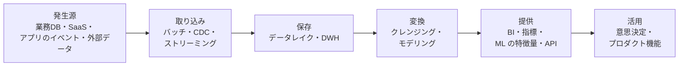
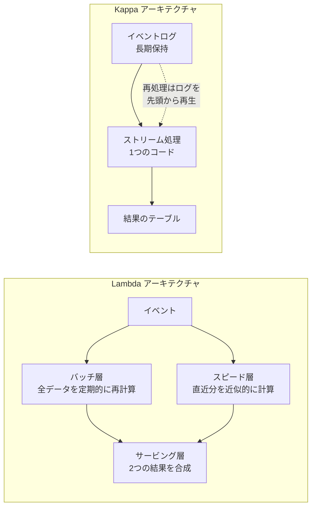
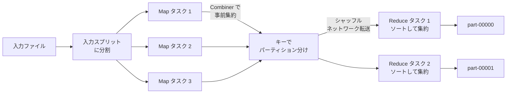
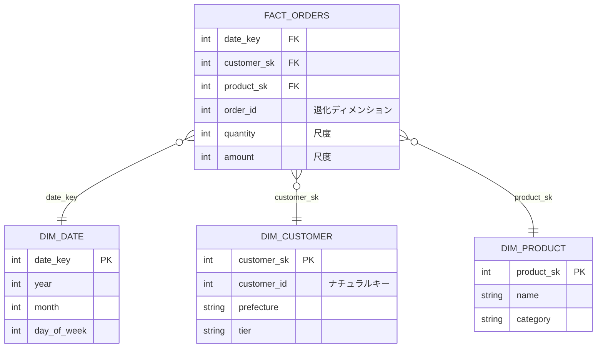

# 12.1 データ基盤とデータエンジニアリング

> 「売上の数字が部署ごとに違う」「ダッシュボードが昨日から更新されていない」「機械学習モデルの精度が急に落ちた」——こうした問題の原因の多くは、グラフやモデルではなく、その手前のデータにあります。この章では、業務で生まれたデータを分析や AI に使える形で届ける「データ基盤」を、分散処理の原理からデータモデリング、品質管理、組織設計まで通して学びます。

| 項目 | 内容 |
|---|---|
| 学習時間の目安 | 本文 4h ＋ 演習 5h |
| 前提となる章 | [6.1 リレーショナルモデルとSQL](../../06-databases/01-relational-model-and-sql/README.md)、[6.5 データモデルの多様性とデータストアの選定](../../06-databases/05-beyond-relational/README.md)、[7.3 パーティショニング](../../07-distributed-systems/03-partitioning/README.md) |
| 演習 | [exercises/](exercises/)（Python） |
| キーワード | OLTP/OLAP, DWH, データレイク, レイクハウス, ETL/ELT, CDC, MapReduce, Spark, シャッフル, スキュー, スタースキーマ, SCD, Parquet, オーケストレーション, 冪等性, データ品質, データ契約, データメッシュ |

## この章のゴール

- [ ] データのバリューチェーン（収集 → 保存 → 変換 → 提供 → 活用）と、各段階の代表的な技術を説明できる
- [ ] OLTP と OLAP、DWH・データレイク・レイクハウスの違いを説明し、要件に応じて選べる
- [ ] MapReduce と Spark の処理モデル（シャッフル・パーティショニング・スキュー）を説明し、分散処理が遅くなる原因を推測できる
- [ ] スタースキーマ（事実・ディメンション・粒度）と SCD Type 1/2 を使って、分析用のデータモデルを設計できる
- [ ] 冪等で再実行・バックフィルができるパイプラインを設計・実装できる
- [ ] データ品質テスト・データ契約・オブザーバビリティ・リネージ・ガバナンスを組み合わせ、信頼できるデータを提供する仕組みを設計できる
- [ ] データメッシュやセマンティックレイヤーといった組織・アーキテクチャ上の選択肢を、利点と批判の両面から評価できる

## なぜ学ぶのか

データの問題は静かに起き、気づいたときには意思決定や顧客に影響が出ています。

- **形式の上限による欠損**: 2020 年 10 月、イングランド公衆衛生庁（Public Health England）は、新型コロナウイルスの陽性者約 1 万 6,000 件が日次の集計から漏れていたと発表しました。検査機関から届いた CSV を、行数の上限が 65,536 行の旧形式の Excel ファイル（.xls）で処理していたことが原因と報じられています。件数の急な変化を監視する仕組み（6 節で扱うボリュームの監視）があれば、早く気づけた種類の問題です。
- **不正なデータが AI の精度を落とす**: 2022 年 5 月、Unity Software は、広告ターゲティングの機械学習ツールが大口顧客からの不正なデータを取り込んで精度が落ち、同年の売上に約 1 億 1,000 万ドルの影響が出る見込みだと発表しました。モデルの品質は、学習データの品質を超えられません。
- **インターフェースの単位の不一致**: 1999 年、NASA の火星探査機マーズ・クライメート・オービターは、地上のソフトウェアがヤード・ポンド法の単位（ポンド重・秒）で出力した値を、航法側が SI 単位（ニュートン・秒）として解釈したことが一因となり失われました（NASA の事故調査委員会の報告）。データの「意味の合意」の失敗であり、6 節のデータ契約が扱う問題そのものです。

データ基盤は、分析チームのためだけのものではありません。経営会議の数字、請求、機械学習の特徴量、生成 AI が参照する社内知識まで、会社の意思決定と AI 活用はすべてこの上に乗っています。

## 1. データ基盤の全体像

### 1.1 データのバリューチェーン

データは、生まれてから価値になるまでに次の段階を通ります。



| 段階 | 主な問い | 代表的な技術 | 主に担う人 |
|---|---|---|---|
| 取り込み | どのデータを、どの頻度・遅延で集めるか | ELT の SaaS、CDC（Debezium など）、Kafka | データエンジニア |
| 保存 | どこに、どの形式で、何年保存するか | オブジェクトストレージ、Parquet、DWH | データエンジニア |
| 変換 | 分析しやすい形・正しい定義にどう整えるか | SQL、dbt、Spark | アナリティクスエンジニア |
| 提供 | 誰に、どの品質保証で渡すか | BI ツール、セマンティックレイヤー、特徴量ストア | アナリティクスエンジニア、ML エンジニア |
| 活用 | どの意思決定・機能に使うか | ダッシュボード、A/B テスト、ML モデル | アナリスト、データサイエンティスト |

**アナリティクスエンジニア（analytics engineer）** は、dbt の普及とともに広まった職種名で、SQL によるデータ変換とモデリングにソフトウェア工学の手法（バージョン管理・テスト・レビュー）を持ち込む役割です。

### 1.2 OLTP と OLAP

業務システムのデータベースと、分析用のデータベースは、得意なことが正反対です（[6.5 データストアの選定](../../06-databases/05-beyond-relational/README.md) も参照）。

| 観点 | OLTP（オンライントランザクション処理） | OLAP（オンライン分析処理） |
|---|---|---|
| 典型的な処理 | 注文を 1 件登録する、残高を更新する | 過去 3 年の月別・地域別の売上を集計する |
| 1 回に触る行数 | 数行（インデックスで特定） | 数百万〜数十億行（全体を走査） |
| 読むもの | 1 行のすべての列 | 多数の行の、少数の列 |
| 更新 | 頻繁な INSERT/UPDATE | 主に追記・一括ロード |
| 保存形式 | 行指向（1 行を連続して置く） | 列指向（1 列を連続して置く） |
| 重視するもの | 低遅延・高い同時実行性・整合性 | スキャンの速度・圧縮率 |

本番の業務 DB（またはそのリードレプリカ）に直接分析クエリを投げ続ける運用は、次の理由で行き詰まります。

1. **負荷**: 全表走査がバッファプール（DB のページキャッシュ）を押し流し、業務のクエリが遅くなる（[6.4 ストレージエンジンと障害回復](../../06-databases/04-storage-and-recovery/README.md)）。
2. **履歴がない**: 業務 DB は「現在の状態」を持つように設計されており、UPDATE で過去の値が消える。「3 か月前の時点で会員ランクが何だったか」は答えられない。
3. **データが散らばっている**: 売上は業務 DB、広告費は広告 SaaS、問い合わせはサポートツールにあり、結合するには 1 か所に集める必要がある。
4. **スキーマが分析向きでない**: 正規化されたテーブルを毎回 10 個 JOIN するのは、遅く、間違えやすい。

### 1.3 DWH・データレイク・レイクハウス

分析用の保存先には 3 つの系譜があります。

**データウェアハウス（DWH）** は、分析用に整理・統合されたデータを置く SQL データベースです（現在の主流は列指向）。書き込む時点でスキーマを決める（schema-on-write）ので、品質と使いやすさが高い代わりに、未整理のデータを気軽に置く場所ではありません。近年のクラウドの DWH（BigQuery、Snowflake、Amazon Redshift など）の多くは **ストレージと計算の分離** を特徴とし、データは安価なストレージに置いたまま、クエリのときに必要な計算資源を割り当てます。

**データレイク** は、オブジェクトストレージ（Amazon S3、Google Cloud Storage など）に、あらゆる形式のファイルを生のまま置く方式です。読むときにスキーマを解釈する（schema-on-read）ので、安く柔軟ですが、次の問題を抱えます。

- **トランザクションがない**: 書き込み途中のファイルを読んでしまう、同時書き込みで壊れる。
- **更新・削除が難しい**: 個人データの削除要求に応えるには、該当行を含むファイルを探して書き直す必要がある。
- **誰も中身が分からない**: カタログと品質管理がないと、「データの沼（data swamp）」になる。

**レイクハウス（lakehouse）** は、この 2 つを統合する考え方です（Armbrust ほか, CIDR 2021 の論文で体系化されました）。鍵になるのが、Apache Iceberg（Netflix 発）、Delta Lake（Databricks 発）、Apache Hudi（Uber 発）といった **オープンテーブルフォーマット** です。これらは Parquet ファイルの集まりの上に **メタデータの層** を置きます。

```text
          テーブルの「現在」を指すポインタ（カタログ）
                      │  コミット = ポインタを原子的に差し替える
                      ▼
 スナップショット v3 ─→ マニフェスト（どのファイルが属し、各列の min/max は何か）
                      │
             ┌────────┼────────┐
             ▼        ▼        ▼
         a.parquet b.parquet c.parquet   ← ファイルは不変。更新は新しいファイルを書く
```

- **ACID トランザクション**: 新しいデータファイルを書いてから、「現在のスナップショット」を指すポインタを原子的に差し替える。差し替えの競合は楽観的並行性制御（[6.3 トランザクション](../../06-databases/03-transactions/README.md)）で検出する。読み手は常に完全なスナップショットを見る。
- **タイムトラベル**: 古いスナップショットを指定すれば、過去の時点のテーブルを読める（保持期間の範囲で）。
- **スキーマの進化・パーティションの進化**: 列の追加や改名、パーティションの切り方の変更を、ファイルを書き直さずに行える。

| | DWH | データレイク | レイクハウス |
|---|---|---|---|
| 保存 | DWH 独自の形式 | オープンなファイル（Parquet、JSON など） | オープンなファイル ＋ テーブルフォーマット |
| トランザクション | あり | なし | あり |
| 得意なこと | SQL 分析、BI、同時実行 | 生データの安価な長期保存、ML の学習データ | 両方を 1 つのデータのコピーで |
| 注意点 | ベンダー固有の形式、計算コスト | 品質・ガバナンスの欠如 | 運用（小さなファイルの圧縮、古いスナップショットの削除）が必要 |

2026 年時点では、主要なクラウド DWH がオープンテーブルフォーマットの読み書きに対応しつつあり、DWH とレイクハウスの境界は薄れています。製品の対応状況は変化が速いので、選定時には一次情報を確認してください。選定で大切なのは製品名ではなく、「データをベンダー固有の形式に閉じ込めないか」「どの計算エンジンから読めるか」という **ロックインと相互運用性** の問いです。

## 2. 取り込みと変換

### 2.1 ETL と ELT

**ETL（Extract, Transform, Load）** は、抽出したデータを専用のサーバーで変換してから DWH にロードする方式です。DWH の計算資源が高価だった時代の標準でした。**ELT** は、生データをまずそのまま DWH（またはレイクハウス）にロードし、変換は DWH の中で SQL によって行います。

クラウドで ELT が主流になった理由は 3 つあります。

1. ストレージが安く、計算資源を必要なときだけ伸縮できるので、「生データを全部置いてから変換する」ことが経済的になった。
2. 生データが残るので、変換ロジックのバグを直したら **生データから作り直せる**（ETL では変換前のデータが残らないことが多い）。
3. 変換が SQL で書けるので、アナリストも変換を書いてレビューできる。

変換を管理する定番のツールが **dbt** です。dbt では、1 つのモデル（テーブル）を 1 つの `SELECT` 文として書き、`ref()` で他のモデルを参照します。dbt はその参照関係から依存グラフ（DAG）を作り、正しい順序で実行し、テスト（6 節）とドキュメント・リネージを生成します。

```sql
-- 例示（dbt のモデルの書き方。このままでは実行できません）: models/marts/fct_orders.sql
select
    o.order_id,
    c.customer_sk,
    o.ordered_at,
    o.amount
from {{ ref('stg_orders') }} as o
join {{ ref('dim_customer') }} as c
  on c.customer_id = o.customer_id
 and o.ordered_at >= c.valid_from
 and (c.valid_to is null or o.ordered_at < c.valid_to)
```

変換は層に分けるのが定石です。生データをほぼそのまま写す **staging**（型の変換・列名の統一だけ）、業務ロジックを組み立てる **intermediate**、利用者に提供する **marts**（スタースキーマや集計表）です。Databricks はこれを bronze / silver / gold と呼び、「メダリオンアーキテクチャ」として広めました。呼び方は違っても、**生データは変更せず残し、変換は再現可能なコードで行う** という原則は共通です。

### 2.2 取り込みの方式: 全件・増分・CDC

| 方式 | 仕組み | 長所 | 弱点 |
|---|---|---|---|
| 全件抽出 | 毎回テーブル全体をコピー | 単純。削除も反映される | 大きなテーブルでは遅く高価 |
| 増分抽出 | `updated_at > 前回の最大値（ウォーターマーク）` の行だけ取る | 軽い | 下記の取りこぼし |
| ログベース CDC | DB の変更ログ（MySQL の binlog、PostgreSQL の WAL）を読む | 削除も中間状態も取れる。業務 DB への負荷が小さい | 仕組みが複雑。ログの保持期間・スキーマ変更への追従が必要 |

`updated_at` による増分抽出は手軽ですが、次の穴があります。演習 2 はこの方式で作るので、弱点を知ったうえで使ってください。

- **物理削除が見えない**: 行が消えると `updated_at` も消える。論理削除（削除フラグ）にしてもらうか、定期的に全件の主キーを突き合わせる。
- **遅れてコミットされる行**: トランザクション A が `updated_at = 10:00:00` の行を書き、コミットが 10:00:05 になった。その間に B が `updated_at = 10:00:02` の行をコミットし、10:00:04 に抽出が走ると、B の行は見えるが未コミットの A の行は見えない。ウォーターマークを 10:00:02 に進めると、あとでコミットされた A の行（10:00:00）は二度と拾われない。
- **`updated_at` を更新しない書き込み**: バッチの一括 UPDATE や手作業の修正で、`updated_at` が変わらないことがある。
- **中間状態が消える**: 抽出の間に 2 回変更されたら、最後の状態しか見えない。

実務では「ウォーターマークから一定時間さかのぼって再抽出する（lookback）」ことで遅延コミットを救いますが、これは **ロードが冪等であること**（同じ行を 2 回処理しても結果が変わらないこと）が前提です。冪等性については 6.2 で詳しく扱います。中間状態まで必要なら、ログベース CDC を使います。

### 2.3 ストリーミングと Lambda / Kappa アーキテクチャ

数秒〜数分の鮮度が必要な用途（不正検知、在庫、リアルタイムの推薦）では、Kafka などのログ（[7.5 メッセージングとイベント駆動](../../07-distributed-systems/05-messaging-and-events/README.md)）にイベントを流し、Flink、Spark Structured Streaming、Kafka Streams などで逐次処理します。ストリーム処理では **イベント時刻**（出来事が起きた時刻）と **処理時刻**（システムが受け取った時刻）を区別し、遅れて届くイベントをどこまで待つかを「ウォーターマーク」で決めます（増分抽出のウォーターマークとは別の概念なので注意してください）。

バッチとストリームをどう組み合わせるかには、2 つの有名な設計があります。



- **Lambda アーキテクチャ**（Nathan Marz が提唱）: 正確だが遅いバッチ層と、速いが近似的なスピード層を並べ、結果を合成する。欠点は、**同じロジックを 2 つのコードベースで書き、両者の結果を一致させ続けなければならない** ことです。
- **Kappa アーキテクチャ**（Jay Kreps が 2014 年の記事 "Questioning the Lambda Architecture" で提唱）: すべてをストリーム処理 1 本で行い、ロジックを変えたらログを先頭から再生して作り直す。ログを長期間保持でき、再生が現実的な時間で終わることが前提です。

2026 年時点の実務では、「大半はバッチ（1 時間〜1 日ごと）、鮮度が売上や安全に直結する少数の用途だけストリーミング」という構成が多く見られます。ストリーミングは運用の難しさ（状態の管理、遅延データ、再処理）が桁違いなので、**「その鮮度で、誰のどの意思決定が変わるのか」** を問うてから導入するのが健全です。

## 3. 分散処理 — MapReduce から Spark へ

### 3.1 なぜ分散するのか

1 台のディスクから 10TB を読むことを考えます。HDD の順次読み出しを 200MB/秒 とすると、10TB ÷ 200MB/秒 = 50,000 秒、約 14 時間かかります。1,000 台のマシンに分けて並列に読めば約 50 秒です。Google が 2004 年に発表した **MapReduce**（Jeffrey Dean, Sanjay Ghemawat, OSDI 2004）は、安価なマシンを大量に並べ、**計算をデータのある場所へ運び**、故障を前提に処理を再実行するという設計で、この規模の処理を普通のプログラマが書けるようにしました。オープンソースの実装である Hadoop が広まり、「ビッグデータ」の時代が始まりました。

### 3.2 MapReduce のプログラミングモデル

プログラマが書くのは 2 つの関数だけです。

```text
map(k1, v1)          → list(k2, v2)       レコード 1 件から (キー, 値) を出力
reduce(k2, list(v2)) → list(v3)           同じキーの値をまとめて受け取り、集約する
```

フレームワークは、その間の面倒な部分をすべて引き受けます。



1. **入力スプリット**: 入力を塊に分け、それぞれを 1 つの Map タスクにする。スケジューラは、データのブロックを持つマシンで Map タスクを動かす（データの局所性）。
2. **Map と Combiner**: Map の出力をメモリにため、キーでソートしてローカルディスクに書き出す。**Combiner**（Map 側の事前集約）があれば、このとき同じキーをまとめて件数を減らす。
3. **パーティション**: 各 (キー, 値) を `hash(キー) mod R`（R は Reduce タスク数）番の Reducer に割り当てる。**同じキーは必ず同じ Reducer に届く** ことが、集約の正しさの前提です。
4. **シャッフル**: 各 Reducer が、すべての Map タスクから自分の担当分をネットワーク越しに取ってくる。M 個の Map と R 個の Reduce なら M × R 本の転送が発生する。
5. **ソートと Reduce**: 受け取ったデータをキーでマージソートし、キーごとに reduce を呼ぶ。

故障への対策も単純です。Map も Reduce も **決定的な関数** なので、失敗したタスクは別のマシンで最初からやり直せばよい。極端に遅いタスク（ストラグラー）には、同じタスクを別マシンで並行実行して先に終わった方を採用する「バックアップタスク」で対処します。

演習 1 では、この流れを 1 プロセスの中で再現します。解き終えたら次のコードで、Combiner がシャッフル量をどれだけ減らすかを確かめてください（`exercises/` で実行。出力は解答例のものです）。

```python
from mapreduce import word_count

lines = ["to be or not to be that is the question"] * 1000
for use_combiner in (False, True):
    r = word_count(lines, num_map_tasks=4, num_partitions=3, use_combiner=use_combiner)
    print(f"combiner={use_combiner!s:5}  map出力={r.counters['map_output_records']:5}"
          f"  シャッフル={r.counters['shuffle_records']:5}  Reducer別={r.shuffle_sizes}")
```

```text
combiner=False  map出力=10000  シャッフル=10000  Reducer別=[4000, 5000, 1000]
combiner=True   map出力=10000  シャッフル=   32  Reducer別=[12, 16, 4]
```

Combiner は各 Map タスクの中で「to が 500 回」のように部分和を取るので、シャッフルされるのは「Map タスク数 × 単語の種類数」（4 × 8 = 32）件だけになります。ただし Combiner を使えるのは、集約が **結合的かつ可換**（和・最大値・件数など）な場合に限られます。平均値をそのまま Combiner で平均すると、件数の違う部分平均を平均することになり間違えます。平均が必要なら (合計, 件数) の組を集約し、最後に割ります。

### 3.3 シャッフルはなぜ高いのか

分散処理の実行時間を支配するのは、たいてい計算ではなくシャッフルです。

- **ネットワーク**: 全 Map から全 Reduce への多対多の転送。データセンター内でも、ディスクやメモリよりはるかに遅く、帯域はクラスタ全体で共有される。
- **ディスク**: Map の出力はメモリに収まらなければディスクに書き出され（spill）、Reducer 側でもマージのために読み書きされる。
- **シリアライズとソート**: オブジェクトをバイト列に変換し、キーでソートする CPU コスト。
- **同期点**: すべての Map が終わらないと Reduce は完了できない。一番遅いタスクが全体の完了時刻を決める。

だから、分散処理の最適化は「シャッフルを減らす・なくす・均等にする」ことにほぼ尽きます。

### 3.4 Spark: メモリ上の DAG

MapReduce は、1 つのジョブが終わるたびに結果を分散ファイルシステムに書き出します。機械学習のように同じデータを何十回も読む反復処理では、この書き出しが致命的に遅くなります。UC Berkeley の AMPLab で開発された **Apache Spark** は、RDD（Resilient Distributed Datasets, Zaharia ほか, NSDI 2012）という抽象で、この問題を解決しました。

- **遅延評価と DAG**: `filter` や `map` を呼んでも、すぐには計算しない。結果が必要になった時点で、処理全体を依存グラフ（DAG）として最適化して実行する。
- **系譜（lineage）による耐障害性**: 失われたパーティションは、それを作った処理の系譜をたどって再計算する。中間結果を複製して保存する必要がない。
- **メモリへのキャッシュ**: 何度も使うデータをメモリに置ける。

Spark は処理を **ステージ** に分けて実行します。`map` や `filter` のように、入力の 1 パーティションだけから出力の 1 パーティションが決まる処理（狭い依存）は、1 つのステージにまとめてパイプライン実行できます。`groupByKey`、`reduceByKey`、`join` のように、全パーティションのデータを並べ替える処理（広い依存）が **シャッフル＝ステージの境界** になります。現在は SQL や DataFrame API で書くのが主流で、オプティマイザが実行計画を選びます（[6.2 インデックスとクエリ処理](../../06-databases/02-indexes-and-query-processing/README.md) のクエリ最適化と同じ考え方です）。

結合（join）の戦略は、シャッフルのコストで理解できます。

| 戦略 | 仕組み | 向いている場面 |
|---|---|---|
| ブロードキャストハッシュ結合 | 小さい表を全ワーカーに配り、大きい表はその場で結合 | 片方が十分小さい（ディメンション表など）。シャッフルが不要 |
| ソートマージ結合 | 両方の表を結合キーでシャッフル・ソートしてから突き合わせる | 両方が大きい |
| Reduce 側結合（演習 1） | 両方にタグを付けてシャッフルし、Reducer で直積をとる | MapReduce での基本形 |

### 3.5 パーティショニングとスキュー

同じキーは同じ Reducer に届くので、**1 つのキーにデータが集中すると、その Reducer だけが遅くなります**。これをスキュー（skew、偏り）と呼びます。「100 タスク中 99 個は 1 分で終わったのに、1 個だけ 40 分かかる」という症状が典型です。原因になりやすいのは次のようなキーです。

- NULL や空文字、`"unknown"`、`guest` のような既定値（全体の数十 % を占めることがある）
- 巨大な顧客・出品者・人気商品
- 日付でパーティション分けした集計での、セール当日

演習 1 のエンジンで、1 社が注文の半分を占める状況を再現してみます。対策の 1 つが **ソルティング**（salting）で、ホットキーに接尾辞を付けて複数のキーに分散させ、2 段階で集計します。

```python
import random
from mapreduce import run_mapreduce

rng = random.Random(0)
# 注文ログ (注文ID, 出品者): 1 社（seller-0）だけで全体の約半分を占める
orders = [(oid, "seller-0" if rng.random() < 0.5 else f"seller-{rng.randrange(1, 1000)}")
          for oid in range(100_000)]

def sum_reducer(key, values):
    yield key, sum(values)

def mapper(rec):
    _oid, seller = rec
    yield seller, 1

r = run_mapreduce(orders, mapper, sum_reducer, num_partitions=8)
print("そのまま      :", r.shuffle_sizes)

# ソルティング: ホットキーに「注文ID mod 8」を付けて 8 つのキーに分け、2 段階で集計する
# （乱数ではなく入力から決まる値を使うと、タスクを再実行しても同じ結果になる）
def salted_mapper(rec):
    oid, seller = rec
    salt = oid % 8 if seller == "seller-0" else 0
    yield (seller, salt), 1

stage1 = run_mapreduce(orders, salted_mapper, sum_reducer, num_partitions=8)
print("ソルティング後:", stage1.shuffle_sizes)

def unsalt_mapper(rec):
    (seller, _salt), partial = rec
    yield seller, partial

stage2 = run_mapreduce(stage1.records(), unsalt_mapper, sum_reducer, num_partitions=8)
print("seller-0 の注文数:", stage2.as_dict()["seller-0"], "/ 2段目のシャッフル:", stage2.counters["shuffle_records"])
```

```text
そのまま      : [6182, 56250, 6246, 6295, 6289, 6313, 6155, 6270]
ソルティング後: [12527, 12314, 12557, 12625, 12533, 12526, 12378, 12540]
seller-0 の注文数: 50121 / 2段目のシャッフル: 1007
```

ほかの対策として、NULL キーを結合の前に除外する、小さい側をブロードキャストして結合する、実行時にスキューを検出して大きなパーティションを分割する仕組み（Spark 3 の Adaptive Query Execution など）を使う、といった方法があります。

もう 1 つ、見落としやすい落とし穴があります。**パーティショナは、どのマシンで計算しても同じ結果を返す必要があります**。Python の組み込み `hash()` は、文字列に対してプロセスごとにランダムな値を返します（ハッシュ衝突を狙う DoS 攻撃への対策）。

```python
import os, subprocess, sys

code = "import zlib; print(hash('apple') % 8, zlib.crc32(repr('apple').encode()) % 8)"
for seed in ("1", "2", "3"):
    out = subprocess.run([sys.executable, "-c", code], capture_output=True, text=True,
                         env={**os.environ, "PYTHONHASHSEED": seed})
    print(f"PYTHONHASHSEED={seed}: hash() → {out.stdout.split()[0]}  crc32 → {out.stdout.split()[1]}")
```

```text
PYTHONHASHSEED=1: hash() → 5  crc32 → 5
PYTHONHASHSEED=2: hash() → 5  crc32 → 5
PYTHONHASHSEED=3: hash() → 4  crc32 → 5
```

`hash()` でパーティションを決めると、プロセスによって同じキーが別の Reducer に送られ、集計が静かに壊れます。分散処理のキーには、入力だけで決まる安定したハッシュ（CRC32、MurmurHash など）を使います。

なお、ここでいうシャッフルのパーティショニングと、ストレージ上のテーブルのパーティショニング（日付ごとのディレクトリなど、5 節）は別の概念です。分散データベースのパーティショニング全般は [7.3 パーティショニング](../../07-distributed-systems/03-partitioning/README.md) で扱います。

## 4. 分析のためのデータモデリング

### 4.1 次元モデリングとスタースキーマ

分析用のテーブル設計で最も広く使われているのが、Ralph Kimball が体系化した **次元モデリング（dimensional modeling）** です。中心に **事実テーブル（fact table）** を置き、周りに **ディメンションテーブル（dimension table）** を並べた形が星に見えるので、**スタースキーマ** と呼ばれます。



Kimball は設計を 4 つの手順で進めることを勧めています。

1. **業務プロセスを選ぶ**: 「受注」「出荷」「問い合わせ」など、計測したい出来事。
2. **粒度（grain）を宣言する**: 事実テーブルの 1 行が何を表すか。「注文明細 1 行」「1 日 × 1 店舗」など。**最も重要な決定** です。
3. **ディメンションを決める**: 誰が・いつ・どこで・何を。集計の切り口になる説明的な属性。
4. **事実（尺度）を決める**: 金額・数量など、集計する数値。

尺度には、足し合わせてよいかどうかで 3 種類あります。

| 種類 | 例 | 注意 |
|---|---|---|
| 加算的（additive） | 売上金額、数量 | どの軸で合計してもよい |
| 半加算的（semi-additive） | 口座残高、在庫数 | 時間方向に合計してはいけない（月末残高を 30 日分足しても意味がない） |
| 非加算的（non-additive） | 単価、率、比率 | 合計できない。分子と分母を別々に持ち、集計後に割る |

**粒度を混ぜると二重計上が起きます**。注文ヘッダー（送料 500 円）と注文明細（3 行）を結合してから送料を合計すると、送料が 1,500 円と集計されます。送料はヘッダーの粒度の事実なので、明細の粒度の事実テーブルに入れるなら明細に按分するか、ヘッダー粒度の別の事実テーブルに分けます。

ディメンション側の主キーには、業務システムの ID（**ナチュラルキー**）ではなく、DW の中で採番する **サロゲートキー** を使うのが定石です。理由は、①複数の業務システムの ID を統合できる、②業務側の ID の再利用や採番ルールの変更から DW を守れる、③次に説明する SCD Type 2 で同じ顧客の複数のバージョンを区別できる、④「不明」「未着」のような特別な行を表せる、の 4 つです。

複数の事実テーブルが同じディメンション（同じ `dim_date`、同じ `dim_customer`）を共有すると、「受注」と「出荷」を同じ切り口で比較できます。これを **適合ディメンション（conformed dimension）** と呼び、組織全体でデータの定義をそろえる土台になります。

列指向の DWH では JOIN のコストが下がり、ストレージも安いので、ディメンションの属性を事実テーブルに持たせた横長の 1 テーブル（One Big Table）を提供する設計もよく使われます。利用者には使いやすい一方、属性の変更時に巨大なテーブルを作り直す必要があり、定義が複製されて食い違う危険もあります。**スタースキーマを正本として持ち、利用者向けに横長のテーブルを派生させる** のが扱いやすい折衷です。

### 4.2 SCD — ゆっくり変化するディメンション

顧客の住所や会員ランクは、ときどき変わります。これを DW でどう扱うかを **SCD（Slowly Changing Dimension）** の型として整理します。

| 型 | 扱い方 | 向いている属性 |
|---|---|---|
| Type 0 | 変更しない（最初の値を保持） | 生年月日、初回登録日 |
| Type 1 | 上書きする（履歴を持たない） | 氏名の誤記の訂正 |
| Type 2 | 新しい行（バージョン）を追加し、有効期間で区別する | 会員ランク、所属地域、担当営業 |
| Type 3 | 「前回の値」の列を追加する | 直前の値だけ比較できればよい属性 |

「会員ランク別の売上」を例に、Type 1 と Type 2 の違いを見てみます。顧客 42 は 4 月 10 日に regular から gold に昇格し、昇格の前に 5,000 円、後に 8,000 円購入しました。

```python
import sqlite3

db = sqlite3.connect(":memory:")
db.executescript("""
CREATE TABLE dim_customer (customer_sk INTEGER PRIMARY KEY, customer_id INTEGER, tier TEXT,
                           valid_from TEXT, valid_to TEXT, is_current INTEGER);
INSERT INTO dim_customer VALUES
  (1, 42, 'regular', '0001-01-01', '2026-04-10', 0),   -- 4/10 に gold へ昇格
  (2, 42, 'gold',    '2026-04-10', NULL,         1);
CREATE TABLE fact_orders (order_id INTEGER, customer_sk INTEGER, ordered_at TEXT, amount INTEGER);
INSERT INTO fact_orders VALUES
  (1, 1, '2026-04-01', 3000), (2, 1, '2026-04-05', 2000), (3, 2, '2026-04-12', 8000);
""")
print("注文時点の会員ランク別（Type 2 の正しい集計）:")
for row in db.execute("""SELECT d.tier, SUM(f.amount) FROM fact_orders f
                          JOIN dim_customer d USING (customer_sk) GROUP BY d.tier ORDER BY d.tier"""):
    print("  ", row)
print("現在の会員ランク別（Type 1 で上書きした場合と同じ結果）:")
for row in db.execute("""SELECT cur.tier, SUM(f.amount) FROM fact_orders f
                          JOIN dim_customer d USING (customer_sk)
                          JOIN dim_customer cur ON cur.customer_id = d.customer_id AND cur.is_current = 1
                          GROUP BY cur.tier"""):
    print("  ", row)
```

```text
注文時点の会員ランク別（Type 2 の正しい集計）:
   ('gold', 8000)
   ('regular', 5000)
現在の会員ランク別（Type 1 で上書きした場合と同じ結果）:
   ('gold', 13000)
```

Type 1 で上書きすると、昇格前の購入まで gold の売上に数えられ、「gold 会員施策の効果」を過大評価します。さらに、先月作ったレポートを今日再集計すると数字が変わるので、「過去のレポートの数字が変わった」という問い合わせが来ます。どちらが正しいかは分析の問いによります（「現在の gold 会員は過去にいくら買ったか」なら現在の値で集計します）が、**Type 2 で履歴を持っていれば両方に答えられ、Type 1 では片方にしか答えられません**。

Type 2 を実装するときの要点は次の通りです（演習 2 で実装します）。

- **事実テーブルはサロゲートキーを持つ**。ロード時に「注文時点で有効だったバージョン」を引いてキーを埋める（point-in-time lookup）。こうしておけば、集計のたびに期間の条件で結合する必要がない。
- **有効期間は半開区間 `[valid_from, valid_to)`** にする。`BETWEEN`（閉区間）だと、ちょうど切り替わりの時刻の事実が 2 つのバージョンに一致する。
- **「現行バージョンは 1 つだけ」を DB に保証させる**。SQLite や PostgreSQL なら部分一意インデックス（`CREATE UNIQUE INDEX … WHERE is_current = 1`）で表現できる。
- **事実が先に届いたら「推定メンバー（inferred member）」を作る**。顧客マスタの取り込みが遅れても、仮の行を作ってキーを確定させ、あとで本物の属性を上書きする。事実を直す必要がない。
- **履歴は DW にしかない**。業務 DB が現在の状態しか持たないなら、SCD Type 2 の履歴はあとから作り直せない。DW の該当テーブルは「再計算できる派生データ」ではなく「失うと戻らない記録」として、バックアップや変更管理の対象にする。

### 4.3 指標の定義とセマンティックレイヤー

経営会議で営業部と開発部の「アクティブユーザー数」が食い違う——これはデータ基盤で最もよくある、そして最も信頼を損なう問題です。多くの場合、原因は計算ミスではなく **定義の違い** です（ログインしたら？ 購入したら？ 30 日以内？ テストアカウントを除く？）。

指標（メトリクス）は、次の要素を明文化して初めて定義したことになります。

| 要素 | 例（月間アクティブ購入者） |
|---|---|
| 計算式 | 期間内に 1 回以上購入した顧客のユニーク数 |
| 時間の窓と基準 | 暦月、日本時間（JST）で区切る |
| 除外条件 | 社員・テストアカウント、全額返金された注文 |
| 集計してよい切り口 | 都道府県、会員ランク（注文時点）、流入チャネル |
| オーナー | EC 事業部のデータ担当 |
| 変更履歴 | 2026-04 に返金の扱いを変更（旧定義との差は約 2%） |

**セマンティックレイヤー（semantic layer）** は、こうした指標の定義を 1 か所にコードとして置き、BI ツールやノートブック、API から同じ定義で呼び出せるようにする層です。dbt の Semantic Layer、Looker の LookML、Cube などがあります（2026 年時点）。生成 AI に「先月の売上は？」と自然言語で質問させる仕組み（text-to-SQL）でも、生のテーブルではなく定義済みの指標を参照させると、誤った集計をしにくくなります。

## 5. 保存形式とクエリのコスト

### 5.1 列指向フォーマット

分析クエリは「多数の行の、少数の列」を読みます。列ごとにまとめて保存すれば、必要な列だけを読めます。さらに、同じ列の値は似ているので、よく圧縮できます。

```python
import random, zlib

rng = random.Random(0)
prefs = ["東京都", "大阪府", "神奈川県", "愛知県", "福岡県"]
rows = [(i, rng.choice(prefs), rng.randrange(100, 50_000)) for i in range(100_000)]

# 行指向: 1 行ずつ「id,都道府県,金額」を並べる（CSV と同じ）
row_major = "\n".join(f"{i},{p},{a}" for i, p, a in rows).encode()
print("行指向（全列・圧縮後）          :", len(zlib.compress(row_major)))

# 列指向: 列ごとに値を並べて保存する（Parquet / ORC の基本的な考え方）
pref_col = "\n".join(p for _, p, _ in rows).encode()
print("列指向・都道府県の列だけ（圧縮後）:", len(zlib.compress(pref_col)))

# 辞書エンコーディング: 種類の少ない値を小さな整数に置き換えてから圧縮する
code = {p: i for i, p in enumerate(prefs)}
dict_col = bytes(code[p] for _, p, _ in rows)
print("  〃 ＋辞書エンコーディング      :", len(zlib.compress(dict_col)))
```

```text
行指向（全列・圧縮後）          : 604346
列指向・都道府県の列だけ（圧縮後）: 58228
  〃 ＋辞書エンコーディング      : 34348
```

「都道府県別の件数」を数えるのに、行指向なら 604KB を読む必要がありますが、列指向なら 34KB で済みます（約 18 分の 1）。**Apache Parquet** と **Apache ORC** は、この考え方を実用化した列指向のファイル形式です。Parquet は Google の Dremel（Melnik ほか, VLDB 2010）の入れ子データの表現法を取り入れて、Twitter と Cloudera が 2013 年に開発しました。

```text
Parquet ファイル
├── 行グループ 1（例: 数十万行）
│   ├── 列チャンク: order_id   ─ ページ ─ ページ …（辞書・RLE・ビットパッキングで符号化し、圧縮）
│   ├── 列チャンク: prefecture
│   └── 列チャンク: amount
├── 行グループ 2
└── フッター: スキーマ、各行グループ・各列の統計（min / max / NULL 数）
```

クエリエンジンは、この構造を使って読む量を減らします。

| 手法 | 仕組み | 効く条件 |
|---|---|---|
| 射影プッシュダウン | 必要な列の列チャンクだけを読む | `SELECT *` を避ける |
| 述語プッシュダウン | フッターの min/max を見て、条件に合う行がない行グループを読み飛ばす | 条件の列でデータが並んでいる（ソート・クラスタリングされている）ほど効く |
| パーティションの刈り込み | `dt=2026-04-01/` のようなディレクトリ（パーティション）単位で、条件に合わないものを読まない | 条件にパーティション列が含まれる |

述語プッシュダウンは、値がファイル全体にばらけていると効きません。どの行グループにも 1 月〜12 月のデータが混ざっていれば、「3 月だけ」という条件でもすべてを読むことになります。よく絞り込む列でソートしておく（クラスタリング）のはこのためです。逆に、パーティションを細かくしすぎると（例: 日付 × 顧客 ID）、小さなファイルが大量にできてメタデータの処理が重くなる **スモールファイル問題** が起きます。定期的な小ファイルの圧縮（コンパクション）もテーブル運用の一部です。

### 5.2 コストモデル

クラウドの DWH の料金体系は、大きく 2 種類に分かれます（2026 年時点。具体的な単価と課金単位は各社の最新の料金表を確認してください）。

| 方式 | 課金の対象 | 代表例 | コストを押し上げるもの |
|---|---|---|---|
| スキャン量課金 | クエリが読んだデータ量 | BigQuery のオンデマンド料金 | `SELECT *`、パーティション条件のないクエリ、自動更新のダッシュボード |
| 計算時間課金 | 計算資源（ウェアハウス・スロット）の稼働時間 | Snowflake のクレジット、予約済みのスロット | 停止されない計算資源、過大なサイズ、同時実行のためのスケールアウト |

スキャン量課金の感覚を数字でつかんでおきましょう。3 年分（1,095 日）・50 列・10TB のテーブルが日付でパーティション分けされているとします。直近 7 日分の 3 列だけを読むクエリなら、列のサイズが均等だとして 10TB × 7/1,095 × 3/50 ≈ 3.8GB で済みます。パーティション条件を書き忘れて `SELECT *` にすると 10TB 全体で、約 2,600 倍です。これが 5 分ごとに自動更新されるダッシュボードに組み込まれていたら、1 日に 288 回実行されます。

コストの管理では、①パーティション条件を必須にする設定、②実行前のスキャン量の見積もり（ドライラン）、③チームごとの予算とアラート、④大きなテーブルの増分更新（毎回の全件作り直しをやめる）、⑤利用されていないテーブルやダッシュボードの棚卸し、が定番です。組織的なコスト管理は [10.6 クラウドコスト管理（FinOps）](../../10-cloud-and-sre/06-finops/README.md) で扱います。

## 6. パイプラインの運用 — オーケストレーション・冪等性・品質

### 6.1 オーケストレーション

データパイプラインは、依存関係を持つ多数のタスクの集まりです。cron で時刻をずらして並べる方式は、「上流が遅れたら下流が古いデータで走る」「失敗しても誰も気づかない」「過去の日付の再実行ができない」ためにすぐ破綻します。**オーケストレーター** は、タスクの依存グラフ（DAG）、スケジュール、リトライ、タイムアウト、通知、過去分の再実行（バックフィル）、実行履歴の可視化を提供します。

| ツール | 特徴（2026 年時点） |
|---|---|
| Apache Airflow | Airbnb で 2014 年に生まれた。Python で DAG を定義するタスク中心の設計で、最も広く使われている |
| Dagster | 「タスク」ではなく「データ資産（asset）」を中心に定義する。資産間のリネージや鮮度を扱いやすい |
| Prefect | Python の関数に近い書き方でフローを定義できる |

どれを選ぶかより重要なのは、次に述べる **タスクの性質** です。

### 6.2 冪等でバックフィル可能なタスク

**冪等（idempotent）** とは、同じ入力で何度実行しても結果が同じになる性質です。データパイプラインでは、リトライ、障害後の再実行、バグ修正後の過去分の作り直し（**バックフィル**）が日常的に起きるので、冪等でないタスクは必ず事故を起こします。

```python
import sqlite3

db = sqlite3.connect(":memory:")
db.execute("CREATE TABLE daily_sales (sales_date TEXT, shop TEXT, amount INTEGER)")
source = [("2026-04-01", "渋谷店", 120_000), ("2026-04-01", "梅田店", 98_000)]

def load_append(date):
    db.executemany("INSERT INTO daily_sales VALUES (?, ?, ?)", [r for r in source if r[0] == date])
    db.commit()

def load_overwrite(date):
    with db:  # 「その日の分を消して入れ直す」を 1 トランザクションで行う
        db.execute("DELETE FROM daily_sales WHERE sales_date = ?", (date,))
        db.executemany("INSERT INTO daily_sales VALUES (?, ?, ?)", [r for r in source if r[0] == date])

for loader in (load_append, load_overwrite):
    db.execute("DELETE FROM daily_sales")
    loader("2026-04-01")
    loader("2026-04-01")  # リトライやバックフィルで同じ日付を再実行
    total = db.execute("SELECT SUM(amount) FROM daily_sales").fetchone()[0]
    print(f"{loader.__name__:15s} 2回実行後の合計: {total:,} 円")
```

```text
load_append     2回実行後の合計: 436,000 円
load_overwrite  2回実行後の合計: 218,000 円
```

冪等なタスクを作るための定石は次の通りです。

- **パーティション単位の上書き**: 「2026-04-01 の分を消して入れ直す」を 1 トランザクションで行う（多くの DWH では `INSERT OVERWRITE` や `MERGE` で表現する）。
- **ナチュラルキーによるアップサート**: 注文 ID が同じなら更新、なければ挿入。
- **論理日付を引数で受け取る**: タスクの中で `now()` や「最新のデータ」を使わず、オーケストレーターから渡される処理対象の日付だけを使う。そうすれば、3 か月前の日付を指定して再実行しても、当時と同じ入力を処理できる。
- **原子的な公開**: 一時テーブルに書いてから名前を差し替える、またはトランザクションでまとめる。書きかけの状態を利用者に見せない。
- **状態の更新も同じトランザクションに**: 演習 2 のように、データの書き込みとウォーターマークの更新を同時にコミットする。

バックフィルには、冪等性に加えて **上流の生データが残っていること**（保持期間）と、**再計算のコストの見積もり** が必要です。ELT で生データを残しておく価値は、ここで効いてきます。

### 6.3 データ品質: テスト・契約・オブザーバビリティ

データ品質は、次のような観点で測ります。

| 観点 | 問い | チェックの例 |
|---|---|---|
| 完全性 | 欠けていないか | 必須列が NULL でない、件数が急減していない |
| 一意性 | 重複していないか | 主キーが一意 |
| 妥当性 | 取りうる値か | ステータスが定義済みの値、金額が 0 以上 |
| 整合性 | 他のデータと矛盾しないか | 参照先の顧客が存在する（参照整合性） |
| 適時性（鮮度） | 新しいか | 最新の行が 1 時間以内 |
| 正確性 | 現実と一致するか | 会計システムの売上合計と突き合わせる |

**テスト**: dbt では `not_null`、`unique`、`accepted_values`、`relationships` の 4 つが標準のテストとして用意されており、YAML に書くだけで SQL が生成されます。重要なのは、テストの結果で **下流への公開を止める** かどうかを決めておくことです。請求や経営指標のような重要なデータは、テストが失敗したら公開を止め（サーキットブレーカー）、古いが正しいデータを見せ続ける方が、新しいが壊れたデータを見せるより安全です。演習 3 では、こうしたチェックとレポートの仕組みを作ります。

```text
[PASS] not_null(order_id)
[FAIL] unique(order_id) — 重複した値が 1 種類あります 例: 2
[WARN] accepted_values(status) — 許可されていない値が 1 行あります 例: 'cancelled'
[FAIL] relationships(customer_id -> id) — 親が存在しない値が 1 行あります 例: 99
[WARN] freshness(created_at) — 最新のデータが 1:30:00 前です（警告 1:00:00）
[PASS] row_count_anomaly — 今回 3 件、過去の平均 3.7 件、z = -0.94
結果: FAIL（pass 2 / warn 2 / fail 2 / skip 0）
```

**データ契約（data contract）**: データ基盤の障害の典型的な原因は、上流のアプリケーションチームが、データチームの存在を知らずに列名を変えたり、ステータスの値を追加したりすることです。データ契約は、データを **生み出す側（プロデューサー）と使う側（コンシューマー）の間の API 仕様** です。スキーマ（列と型）、意味（単位・タイムゾーン・値の定義）、品質の約束（NULL にならない、など）、鮮度の SLA、オーナー、変更の手続き（互換性のない変更は新バージョンとして出し、旧版に移行期間を設ける）を明文化し、**プロデューサー側の CI でチェックする** のがポイントです。イベントデータなら、スキーマレジストリ（Avro や Protocol Buffers のスキーマの互換性を検査する仕組み）で機械的に強制できます。マーズ・クライメート・オービターの事故は、単位という「意味」の契約がなかった例です。

**データオブザーバビリティ**: 事前に書いたテストは、想定した壊れ方しか検知できません。そこで、鮮度・件数（ボリューム）・スキーマの変化・値の分布・リネージを継続的に監視し、過去からの逸脱を異常として検知する考え方が広まりました（[10.4 オブザーバビリティ](../../10-cloud-and-sre/04-observability/README.md) のデータ版です）。件数の監視では、過去の平均と標準偏差から z スコア（平均から標準偏差いくつ分離れているか）を計算するのが基本ですが、**曜日などの季節性** に注意が必要です。

```python
import random, statistics

rng = random.Random(1)
# 過去 4 週間の日次件数。平日は約 1,000 件、土日は約 400 件（曜日による季節性）
history = [(day % 7, (400 if day % 7 >= 5 else 1000) + rng.randint(-20, 20)) for day in range(28)]
today_dow, today_count = 0, 600  # 月曜日なのに 600 件しかない（本当の異常）

def z(values, x):
    return (x - statistics.fmean(values)) / statistics.stdev(values)

last7 = [c for _, c in history[-7:]]
same_dow = [c for d, c in history if d == today_dow]
print(f"直近7日と比較     : z = {z(last7, today_count):6.2f}")
print(f"同じ曜日だけと比較: z = {z(same_dow, today_count):6.2f}")
```

```text
直近7日と比較     : z =  -0.76
同じ曜日だけと比較: z = -31.82
```

直近 7 日と比べると、土日の少なさで標準偏差が膨らみ、4 割の減少を見逃します。比べる相手（ベースライン）の選び方が検知の精度を決めます。統計的な考え方は [2.2 確率・統計と定量的思考](../../02-math-and-algorithms/02-probability-statistics/README.md) を参照してください。

### 6.4 カタログとリネージ

データが数百〜数千のテーブルになると、「どのテーブルを使えばよいか」「この列の意味は」「誰に聞けばよいか」が分からなくなります。**データカタログ** は、テーブルと列の説明、オーナー、鮮度、利用頻度、個人情報のタグなどを検索できるようにする仕組みです（オープンソースでは DataHub、OpenMetadata など。クラウド各社も提供しています）。

**リネージ（lineage、系譜）** は、「このテーブルのこの列は、どのテーブルのどの列から、どの変換で作られたか」の依存関係です。リネージがあると、次の 2 つの問いにすぐ答えられます。

- **影響分析**: 「業務 DB のこの列を削除したら、どのダッシュボードと ML モデルが壊れるか」（変更の前に）
- **原因分析**: 「このダッシュボードの数字がおかしい。上流のどこで壊れたか」（障害のときに）

dbt やオーケストレーターは実行時にリネージを収集でき、OpenLineage のようなオープンな標準形式もあります。

### 6.5 ガバナンス

データガバナンスは、「データを、誰が、何のために、どこまで使ってよいか」を決めて守らせる仕組みです。

- **オーナーシップ**: すべてのデータセットにオーナー（チーム）を決める。オーナーのいないデータは品質も説明も維持されない。
- **アクセス制御**: 役割ベース（RBAC）に加え、行レベル（自分の部署の行だけ見える）や列レベル（個人情報の列はマスキング）の制御を使う（[11.3 認証と認可](../../11-security/03-authn-authz/README.md)）。
- **個人情報の分類**: 列に「氏名」「メールアドレス」「位置情報」などのタグを付け、タグに応じてアクセス制御・マスキング・保持期間を自動で適用する。
- **保持と削除**: 法令や契約で定められた期間を過ぎたデータを削除する。削除要求に応えるには、どのテーブルのどの行が該当するかを追える必要がある（ここでもリネージとカタログが効く）。
- **仮名化**: 分析に個人を特定する必要がなければ、ID を仮名に置き換える。単純なハッシュ（`SHA-256(電話番号)`）は、電話番号の候補が少ないため総当たりで元に戻せてしまう。秘密鍵を使う HMAC などで仮名化し、鍵を分析者から分離する（[11.2 暗号技術の基礎](../../11-security/02-cryptography/README.md)）。

日本では個人情報保護法が、利用目的の特定、第三者提供の制限、仮名加工情報・匿名加工情報といった制度を定めています。EU の個人データを扱うなら GDPR も関係します。どのデータをどの目的で使えるかは、法令・利用規約・同意の内容によって決まるので、具体的な判断は専門家に確認してください。全社的なガバナンス体制は [14.5 ガバナンス・リスク・コンプライアンスと法務](../../14-cto/05-governance-risk-compliance/README.md) で扱います。

## 7. データの組織と活用

### 7.1 データメッシュ

会社が大きくなると、中央のデータチームがボトルネックになります。あらゆる部署の依頼が集まり、しかもデータチームは各部署の業務の意味を深く知りません。Zhamak Dehghani は 2019 年の記事と 2022 年の書籍 "Data Mesh" で、この問題への答えとして **データメッシュ** を提唱しました。4 つの原則から成ります。

1. **ドメインによるオーナーシップ**: データは、それを生み出し最もよく理解している業務ドメインのチームが持つ（[9.3 ドメイン駆動設計](../../09-architecture/03-domain-driven-design/README.md) の境界づけられたコンテキストと対応する）。
2. **プロダクトとしてのデータ**: ドメインは自分のデータを、利用者のための「製品」として提供する。発見でき、説明があり、品質が保証され、安全に使えることに責任を持つ。
3. **セルフサービスのデータ基盤**: 各ドメインがデータ製品を作れるよう、共通の基盤（ストレージ、パイプライン、カタログ、アクセス制御）をプラットフォームチームが提供する。
4. **連邦型の計算されたガバナンス**: 相互運用性やセキュリティの標準は全体で決め、その適用はプラットフォームに組み込んで自動化する。

データメッシュには、次のような批判や注意点もあります。

- **成熟度と人員の前提が重い**: すべてのドメインにデータを製品として運用できる人材が必要。小〜中規模の組織では、むしろ分散による重複と品質のばらつきが増える。
- **ドメインをまたぐ分析が難しくなる**: 顧客・商品のような全社共通のディメンションを誰が持つのかが曖昧になりやすい。
- **組織図を変えただけの「名ばかりメッシュ」**: プラットフォームとガバナンスの自動化なしに責任だけを各部署に移すと、データの沼が分散するだけになる。

現実的には、中央のプラットフォームチームが基盤と標準を持ち、各ドメインに埋め込まれたアナリティクスエンジニアがデータ製品を作る「ハブ・アンド・スポーク」型の中間形が多く見られます。組織の規模・データの成熟度・ドメインの独立性を見て、段階的に選びましょう（チーム設計の考え方は [13.6 チームと組織の設計](../../13-technical-leadership/06-team-and-org-design/README.md)）。

### 7.2 実験基盤・リバース ETL・CDP

- **実験基盤**: A/B テストを安全に回すには、ユーザーの割り付け、どの変種を見たかのログ（露出ログ）、DWH 上での指標計算、ガードレール指標（遅延・エラー率・解約など、悪化させてはいけない指標）、割り付け比率の異常検知（SRM: sample ratio mismatch）が必要です。統計的な判断は [2.2 確率・統計と定量的思考](../../02-math-and-algorithms/02-probability-statistics/README.md) で学びます。データ基盤側の要件は、**イベントのログが信頼でき、指標の定義がセマンティックレイヤーで統一されていること** です。
- **リバース ETL**: DWH で作ったデータ（顧客のスコア、利用状況のセグメントなど）を、CRM・広告配信・サポートツールといった業務の SaaS へ書き戻す仕組みです。分析の結果を現場の行動につなげます。
- **CDP（Customer Data Platform）**: 顧客に関するデータを統合してマーケティングに使う基盤です。近年は、DWH を正本として CDP の機能を組み合わせる構成も増えています。いずれも個人データを外部のツールに送るので、同意の範囲と委託先の管理を確認してください。

## よくある落とし穴

1. **本番の業務 DB に分析クエリを直接投げ続ける**。負荷で業務が遅くなるうえ、履歴がないので過去の状態を再現できない。早い段階で分析用の保存先に取り込み、生データを残しておく。
2. **追記（append）だけのロードで、リトライのたびに重複する**。パーティションの上書きかアップサートで冪等にし、処理対象の日付は引数で受け取る。
3. **`updated_at` の増分抽出を万能だと思う**。物理削除・遅延コミット・`updated_at` を更新しない書き込みを取りこぼす。lookback と冪等なロード、必要ならログベース CDC を使う。
4. **粒度を宣言せずに事実テーブルを作る**。ヘッダーの送料を明細の粒度で合計するような二重計上が起きる。「1 行は何を表すか」をテーブルの説明の 1 行目に書く。
5. **会員ランクなどを Type 1 で上書きする**。過去のレポートの数字が再集計で変わり、施策の効果を誤って評価する。分析の切り口になる属性は Type 2 で履歴を持つ。
6. **`SELECT *` やパーティション条件のないクエリをダッシュボードに組み込む**。スキャン量課金では毎回テーブル全体の料金がかかる。パーティション条件の必須化とクエリのコストの可視化を行う。
7. **指標の定義をダッシュボードごとに SQL で書く**。同じ名前の指標が部署ごとに違う値になり、データへの信頼が失われる。定義・オーナー・変更履歴を 1 か所で管理する。
8. **ホットキーを想定しない**。NULL・ゲストユーザー・巨大顧客にデータが集中し、1 タスクだけが終わらない。キーの分布を確認し、除外・ソルティング・ブロードキャスト結合で対処する。
9. **分散処理のキーに言語組み込みのハッシュを使う**。Python の `hash()` はプロセスごとに値が変わる。安定したハッシュ関数を使う。

## CTOの視点

1. **データ基盤の「一方通行のドア」を早く閉じる**。プロダクトの初期に決めたイベントの設計、顧客 ID の体系、タイムゾーン（UTC で保存）、生データの保持方針は、あとから変えるのが極めて高くつきます。特に「業務 DB は現在の状態しか持たない」ことを理解し、履歴が必要な属性の変更をイベントとして残すか、早期に DW へ取り込むかを決めておきましょう。失った履歴は、どれだけ予算をかけても戻りません。
2. **データの信頼性を SLO として扱う**。経営報告・請求・ML の特徴量に使う重要なデータセットには、鮮度と品質の目標（例: 毎朝 7 時までに更新、主要テスト全合格）とオーナーを決め、違反を本番障害と同じ手順で扱います（[10.3 信頼性設計とSLO](../../10-cloud-and-sre/03-reliability-engineering/README.md)、[10.5 インシデント対応とポストモーテム](../../10-cloud-and-sre/05-incident-management/README.md)）。データ障害のポストモーテムでは「どのテストで検知すべきだったか」「リネージで影響範囲をどう特定したか」「上流の変更をなぜ事前に知れなかったか（データ契約の欠如）」を問います。
3. **コストの構造を理解して統制する**。DWH の請求は「誰かが書いた 1 本のクエリ」で跳ね上がります。「このダッシュボードを 1 回開くといくらかかるか」「最も高いクエリの上位 10 本は何か」に即答できる状態を作り、チームごとの予算とアラートを設定しましょう。料金体系（スキャン量か計算時間か）によって、最適化の打ち手が変わることも押さえておきます。
4. **組織設計は規模に合わせて段階的に**。数十人規模の会社がいきなりデータメッシュを目指すと、少ない人材が分散して誰も基盤を持たない状態になります。まず中央のチームで基盤と標準（命名規約、テスト、指標の定義）を作り、ドメインが増えたら埋め込み型へ移るのが現実的です。採用では、ツールの経験よりも「冪等性」「粒度」「スキュー」といった原理を説明でき、データの利用者と会話できる人を見極めます。
5. **AI の取り組みの前にデータを確認する**。「生成 AI や機械学習で何かしたい」という提案が来たら、最初に「必要なデータはあるか、誰が持っていて、品質は測られていて、使ってよい契約・同意になっているか」を問います。多くの AI プロジェクトは、モデルではなくデータの入手・品質・権利の問題で止まります（[12.2 機械学習の基礎](../02-machine-learning/README.md)、[14.8 AI戦略とAIガバナンス](../../14-cto/08-ai-strategy/README.md)）。

## 演習

演習コードは [exercises/](exercises/) にあります。各ファイルの docstring に仕様が書いてあるので、`raise NotImplementedError(...)` を実装に置き換えてください。解答例は [solutions/](solutions/) にありますが、まず自力で取り組みましょう。

```bash
python3 tools/check.py 12.1        # リポジトリのルートで実行
python3 tools/check.py -v 12.1     # 詳しい出力
```

| # | 難易度 | 内容 | ファイル / 関数 |
|---|---|---|---|
| 1 | ★★☆ | インプロセス MapReduce: 安定したパーティショナ、入力分割、Combiner・シャッフル・ソート・Reduce のエンジン、ワードカウント・転置インデックス・Reduce 側結合 | [mapreduce.py](exercises/mapreduce.py): `hash_partitioner`, `split_input`, `run_mapreduce`, `word_count`, `inverted_index`, `reduce_side_join` |
| 2 | ★★★ | 増分・冪等な ETL: sqlite3 の業務 DB からスタースキーマへ。SCD Type 2 の顧客ディメンション、時点の正しいサロゲートキーの解決、推定メンバー、トランザクションによる原子性 | [scd_etl.py](exercises/scd_etl.py): `extract_changed`, `apply_customer_change`, `lookup_customer_sk`, `apply_order_change`, `run_etl` |
| 3 | ★★☆ | データ品質チェックのフレームワーク: not_null・unique・accepted_values・range・参照整合性・スキーマ（データ契約）・鮮度（時計の注入）・件数の異常（z スコア）とレポート | [dq_checks.py](exercises/dq_checks.py): `check_*`, `SuiteReport`, `run_suite` |
| 4 | ★★☆ | 記述: データ基盤の設計レビュー（下記） | — |

### 演習 4（記述）: データ基盤の設計レビュー

あなたは社員 80 人の EC 企業の CTO です。現状は次の通りです。

- アナリスト 2 名が、本番 MySQL のリードレプリカに直接 SQL を書いて週次レポートを作っている。
- 広告費は広告管理画面から毎週 CSV をダウンロードし、スプレッドシートで売上と突き合わせている。
- 経営会議で、マーケティング部とプロダクト部の「月間アクティブユーザー数」が 15% 食い違った。
- 来期、機械学習による需要予測と、生成 AI による社内問い合わせ対応を始めたいという提案が出ている。

1 年以内に整備するデータ基盤の方針を、①アーキテクチャ（取り込み・保存・変換・提供）、②最初の 3 か月でやること、③データ品質とガバナンス、④体制、⑤あえて今はやらないこと、の観点で A4 1 枚程度にまとめてください。

<details>
<summary>解答例と採点の観点</summary>

**解答例（要旨）**

1. **アーキテクチャ**: マネージドのクラウド DWH（またはレイクハウス）を 1 つ選び、ELT で構成する。業務 DB はマネージドの取り込みサービスか CDC で日次（重要テーブルは 1 時間ごと）に取り込み、広告費は API 連携の取り込みツールで自動化する。変換は dbt で staging → marts の層に分け、Git でレビューする。提供は BI ツールと、主要指標のセマンティックレイヤー。ストリーミングは今は不要（日次〜時間単位の鮮度で意思決定は変わらない）。
2. **最初の 3 か月**: ①生データの取り込みと保持（履歴が必要な会員ランク等は SCD Type 2 で DW に残し始める。失った履歴は戻らないので最優先）、②「アクティブユーザー」など経営指標 5〜10 個の定義をオーナー付きで合意し、コードにする、③経営会議の数字を DWH 由来に一本化する。
3. **品質とガバナンス**: 主要テーブルに主キーの一意性・NULL・参照整合性・鮮度のテストを入れ、失敗したら経営向けダッシュボードの更新を止める。個人情報の列にタグを付け、アナリストには仮名化したビューを提供する。DWH のコストに予算アラートを設定する。プロダクト開発チームとの間で、主要テーブルとイベントのスキーマ変更を事前に共有するルール（簡易なデータ契約）を作る。
4. **体制**: データエンジニア 1 名（基盤）とアナリティクスエンジニア 1 名を確保し、アナリストと合わせて中央チームにする。データメッシュは採用しない。
5. **今はやらないこと**: 自前の Spark/Hadoop クラスタ、リアルタイムの基盤、データメッシュ化。需要予測は、上記の基盤で過去の販売データの品質が確認できてから着手する。生成 AI の社内問い合わせ対応は、社内文書の整備とアクセス権の整理を先に行う（[12.4 LLMアプリケーション開発](../04-llm-applications/README.md)）。

**採点の観点**

- 指標の食い違いの原因を「定義の違い」と捉え、定義の一元化とオーナーを提案できているか。
- 履歴の喪失（業務 DB は現在の状態しか持たない）の緊急性に気づいているか。
- 規模に見合った選択（マネージドサービス、中央チーム、ストリーミングやメッシュを見送る判断）とその理由を説明できているか。
- 品質テストが「公開を止める」運用と結びついているか。個人情報とコストの統制に触れているか。
- AI の提案に対して、データの準備状況を前提条件として位置づけているか。

</details>

## 理解度チェック

**Q1. OLAP のワークロードで列指向の保存形式が有利な理由を、I/O と圧縮の 2 つの観点から説明してください。**

<details>
<summary>解答</summary>

- **I/O**: 分析クエリは多数の行の少数の列だけを読むことが多い。列指向なら必要な列のデータだけを読めばよく（射影プッシュダウン）、行指向のように不要な列まで読み込まずに済む。さらに行グループごとの min/max 統計で、条件に合わない塊を読み飛ばせる（述語プッシュダウン）。
- **圧縮**: 同じ列の値は型が同じで値の種類も似ているため、辞書エンコーディング・ランレングス符号化・ビットパッキングなどがよく効き、行指向より高い圧縮率になる。読む量が減るだけでなく、スキャン量課金の DWH では料金も下がる。

</details>

**Q2. ワードカウントでは Reducer をそのまま Combiner として使えます。平均値を求めるジョブで同じことをすると、なぜ誤りになりますか。どう直せばよいですか。**

<details>
<summary>解答</summary>

Combiner は Map タスクごとの部分的なデータに適用されるので、集約が結合的かつ可換でなければ結果が変わります。平均の平均は、各部分の件数が違うと全体の平均と一致しません（例: {1, 2, 3} の平均 2 と {10} の平均 10 を平均すると 6 だが、全体の平均は 4）。

直し方は、Map（と Combiner）で (合計, 件数) の組を出力し、Combiner と Reducer ではそれぞれを足し合わせ、Reducer の最後で合計 ÷ 件数を計算することです。和は結合的・可換なので、Combiner を何回適用しても結果が変わりません。

</details>

**Q3. Spark のジョブで、200 個のタスクのうち 199 個は 1 分で終わるのに、1 個だけが 40 分かかっています。考えられる原因と対策を挙げてください。**

<details>
<summary>解答</summary>

典型的な原因は **データのスキュー** です。group by や join のキーのうち 1 つ（NULL、`guest` のような既定値、巨大な顧客など）にデータが集中し、そのキーを担当するタスクだけが大量のデータを処理しています。

対策:

- キーの分布を確認する（上位のキーの件数を数える）。
- NULL や既定値が原因なら、結合・集計の前に除外するか別処理にする。
- ホットキーにソルト（接尾辞）を付けて複数のタスクに分散し、2 段階で集計する。
- 片方の表が小さければブロードキャスト結合にしてシャッフルをなくす。
- 実行時にスキューを検出して分割する機能（Spark 3 の Adaptive Query Execution など）を有効にする。

ほかに、そのタスクが動いているマシンの不調（ストラグラー）や、入力ファイルのサイズの偏り（分割できない巨大な圧縮ファイル）も疑います。

</details>

**Q4. 注文ヘッダー（送料を持つ）と注文明細を結合したテーブルで「月別の送料合計」を集計したら、会計の数字の約 2.5 倍になりました。原因と、正しいモデリングを説明してください。**

<details>
<summary>解答</summary>

**粒度の混在** が原因です。送料は注文ヘッダーの粒度（注文 1 件に 1 つ）の事実ですが、明細の粒度（注文 1 件に複数行）のテーブルに複製されたため、明細の行数分だけ重複して合計されています（平均 2.5 明細なら約 2.5 倍）。

正しくは、①ヘッダーの粒度の事実テーブル（注文単位: 送料・注文合計）と、明細の粒度の事実テーブル（明細単位: 商品・数量・金額）を分ける、または②送料を何らかのルールで明細に按分して、明細の粒度の加算的な事実にする、のどちらかです。どちらの場合も、事実テーブルの粒度を明示的に宣言し、ドキュメントに書いておきます。

</details>

**Q5. SCD Type 2 のディメンションを使うとき、事実テーブルにナチュラルキー（顧客 ID）ではなくサロゲートキーを持たせる利点は何ですか。ロード時には何をする必要がありますか。**

<details>
<summary>解答</summary>

Type 2 では同じ顧客 ID に複数のバージョンがあるので、ナチュラルキーだけでは「どのバージョンの属性で集計するか」が決まりません。事実テーブルがバージョンごとのサロゲートキーを持っていれば、単純な等値結合だけで「事実が発生した時点の属性」で集計できます。期間の条件を毎回書く必要がなく、書き間違い（閉区間による二重一致など）も防げます。また、業務システムの ID の変更・統合から DW を切り離せます。

ロード時には、事実の発生時刻（注文日時）で有効だったバージョンを、半開区間 `valid_from <= 時刻 < valid_to` で探してキーを埋めます（point-in-time lookup）。該当する顧客がまだディメンションにいなければ、推定メンバーの行を作ってそのキーを使い、あとで本物の属性を上書きします。

</details>

**Q6. 毎日「前日分の注文を集計テーブルに INSERT する」ジョブがあります。障害でジョブが 2 回実行され、売上が二重になりました。どう設計し直すべきですか。**

<details>
<summary>解答</summary>

ジョブを **冪等** にします。

- 処理対象の日付をオーケストレーターから引数で受け取り、`now()` や「最新のデータ」に依存しない。
- 「その日付のパーティション（行）を削除してから挿入する」を 1 トランザクションで行う、またはパーティションの上書き（`INSERT OVERWRITE`）や、キーによる `MERGE`（アップサート）を使う。
- 一時テーブルに書いてから差し替えるなど、書きかけの状態を利用者に見せない。

こうしておけば、リトライ・障害後の再実行・過去の日付のバックフィルを安全に行えます。

</details>

**Q7. 社員 60 人のスタートアップで、「データメッシュを導入して各部署にデータの責任を持たせたい」という提案が出ました。どう評価しますか。**

<details>
<summary>解答</summary>

データメッシュの前提（各ドメインにデータ製品を運用できる人材がいる、セルフサービスの基盤とガバナンスの自動化をプラットフォームチームが提供できる、ドメインが十分に独立している）が、60 人規模ではほぼ満たせないため、慎重に評価します。基盤も標準もない段階で責任だけを分散すると、各部署がばらばらのツールと定義でデータを作り、重複と品質のばらつきが増えるおそれが高いからです。

ただし「データを生み出すチームが品質に責任を持つ」「データを製品として扱う」という考え方自体は有用です。現実的な提案は、中央の小さなチームが基盤・命名規約・テスト・指標の定義を整備し、主要な上流チームとの間でデータ契約（スキーマ変更の事前共有、品質の約束）を結ぶことです。組織が大きくなりドメインが増えた段階で、埋め込み型のアナリティクスエンジニアやドメインへの権限委譲を段階的に進めます。

</details>

**Q8. スキャン量課金の DWH に、3 年分・10TB・50 列の注文テーブルがあります（日付でパーティション分け済み）。直近 30 日の 5 列を読むクエリと、条件なしの `SELECT *` では、読む量はそれぞれ概算でいくらですか（列のサイズは均等とします）。**

<details>
<summary>解答</summary>

- 直近 30 日・5 列: 10TB × 30/1,095 × 5/50 ≈ 0.027TB（約 27GB）。
- `SELECT *`（条件なし）: 10TB。

約 365 倍の差です。さらにパーティション条件がないクエリがダッシュボードで 1 日に何百回も実行されれば、料金は日次で数百倍になります。実際の料金は列ごとのサイズの偏りや圧縮率、最小課金単位などで変わるので、ドライランで見積もって確認します。

</details>

## さらに学ぶために

- Martin Kleppmann "Designing Data-Intensive Applications"（邦訳『データ指向アプリケーションデザイン』オライリー・ジャパン）第 10・11 章 — バッチ処理とストリーム処理の原理を、MapReduce から Kafka・Flink まで一貫した視点で解説。第 6・7 部の総まとめとしても最良の一冊。
- Joe Reis, Matt Housley "Fundamentals of Data Engineering"（O'Reilly, 2022）— 特定の製品に依存せず、データエンジニアリングのライフサイクル全体を整理した入門書。
- Ralph Kimball, Margy Ross "The Data Warehouse Toolkit"（第 3 版, Wiley, 2013）— 次元モデリングの定番。粒度・事実の種類・SCD・適合ディメンションを業種別の事例で学べる。
- Jeffrey Dean, Sanjay Ghemawat "MapReduce: Simplified Data Processing on Large Clusters"（OSDI 2004）と Matei Zaharia ほか "Resilient Distributed Datasets"（NSDI 2012）— 分散データ処理の 2 つの転換点。どちらも短く読みやすい。
- Michael Armbrust ほか "Lakehouse: A New Generation of Open Platforms that Unify Data Warehousing and Advanced Analytics"（CIDR 2021）— レイクハウスの設計思想と、テーブルフォーマットが解決する問題の整理。
- Zhamak Dehghani "Data Mesh: Delivering Data-Driven Value at Scale"（O'Reilly, 2022）— データメッシュの原典。批判的に読み、自社の規模に当てはめて考える題材に。
- dbt の公式ドキュメント（"Best practices" のガイド）— staging / intermediate / marts の層分け、テスト、ドキュメントの実践的な指針。

## まとめ

- データ基盤は「収集 → 保存 → 変換 → 提供 → 活用」のバリューチェーンであり、OLTP の業務 DB とは別に、列指向で履歴を持つ分析用の保存先（DWH・レイクハウス）が必要になる。
- レイクハウスは、オープンなファイルの上にテーブルフォーマットのメタデータ層を置き、スナップショットの原子的な差し替えで ACID・タイムトラベルを実現する。
- 分散処理のコストはシャッフルが支配する。Combiner（結合的・可換な集約）、ブロードキャスト結合、スキューへの対策（除外・ソルティング）でシャッフルを減らし・均等にする。パーティショナには安定したハッシュを使う。
- 次元モデリングでは粒度の宣言が最重要。サロゲートキーと SCD Type 2（半開区間・時点の正しいキー解決・推定メンバー）で、過去の時点の属性による分析を可能にする。業務 DB が現在の状態しか持たないなら、履歴は DW にしか残らない。
- パイプラインは冪等に作る（パーティションの上書き・アップサート・論理日付の引数化・原子的な公開）。冪等性がリトライ・lookback・バックフィルを安全にする。
- 品質はテスト（公開を止める判断とセット）、データ契約（プロデューサー側の CI で強制）、オブザーバビリティ（鮮度・件数・分布の監視、季節性に注意）、カタログとリネージ、ガバナンス（オーナー・アクセス制御・個人情報の分類・保持）の組み合わせで守る。
- データメッシュやセマンティックレイヤーは組織のスケールの問題への答えであり、規模と成熟度に応じて段階的に採用する。AI の取り組みは、データの入手・品質・権利の確認から始める。
