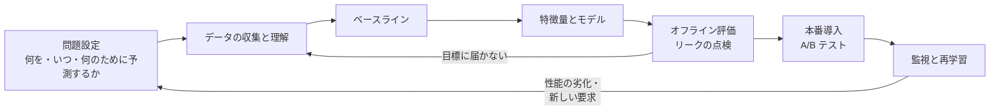

# 12.2 機械学習の基礎

> 機械学習は「ルールを人が書く代わりに、データから学ばせる」技術です。しかし、学習データでは 99% 当たるのに本番ではまったく役に立たないモデルや、正解率は高いのに肝心の不正を 1 件も見つけないモデルが、簡単にできてしまいます。この章では、モデルが何を最適化しているのか、なぜ学習データでの成績が当てにならないのか、どの指標で何を判断すべきかを、線形回帰から決定木までを自分で実装しながら理解します。

| 項目 | 内容 |
|---|---|
| 学習時間の目安 | 本文 4h ＋ 演習 6h |
| 前提となる章 | [2.2 確率・統計と定量的思考](../../02-math-and-algorithms/02-probability-statistics/README.md)、[12.1 データ基盤とデータエンジニアリング](../01-data-engineering/README.md) |
| 演習 | [exercises/](exercises/)（Python） |
| キーワード | 教師あり学習, 損失関数, 勾配降下法, 凸性, 線形回帰, ロジスティック回帰, 正則化, 汎化, 交差検証, バイアスとバリアンス, データリーク, 適合率と再現率, ROC-AUC, PR-AUC, キャリブレーション, 決定木, 勾配ブースティング, k-means, 公平性 |

## この章のゴール

- [ ] 機械学習を使うべき問題と、ルールで十分な問題を見分けられる
- [ ] 損失関数と勾配降下法でモデルが学習する仕組みを説明し、線形回帰・ロジスティック回帰を実装できる
- [ ] 汎化・過学習・バイアスとバリアンス・正則化・交差検証を説明し、データリークを見抜ける
- [ ] 目的に合った評価指標を選び、ビジネス上のコストから分類のしきい値を決められる
- [ ] 決定木・アンサンブル・k-means などの代表的な手法の性質と使いどころを比較できる
- [ ] ML プロジェクトのライフサイクルと典型的な失敗パターンを知り、解釈性・公平性を含めて計画をレビューできる

## なぜ学ぶのか

機械学習の失敗は、コードのバグのようにエラーで止まってはくれません。もっともらしい数字を出しながら、静かに間違えます。

- **予測の誤差が事業を止めた**: 2021 年 11 月、米国の不動産テック企業 Zillow は、住宅を買い取って転売する事業（Zillow Offers）からの撤退を発表しました。CEO は住宅価格の予測の不確実性が想定をはるかに超えていたと説明し、従業員の約 25% を削減するとしました。予測モデルの誤差が、在庫という形で直接損失になる事業設計だったのです。
- **過去のデータの偏りを学習した**: 2018 年、ロイターは、Amazon が開発していた採用向けの AI ツールが、男性の応募者が多かった過去 10 年分の履歴書から学習した結果、「women's」という語を含む履歴書を低く評価する傾向を示し、開発が打ち切られたと報じました（Amazon は、このツールが採用担当者による候補者の評価に使われたことはないと説明しています）。データに含まれる過去の偏りは、そのままモデルの判断になります。
- **高精度でも使われないモデル**: Netflix は 2009 年、推薦精度を競うコンテスト（Netflix Prize）の優勝チームに 100 万ドルを授与しましたが、2012 年の公式ブログで、優勝チームの最終的なアンサンブルは、精度の向上幅がそれを本番で動かすエンジニアリングの労力に見合わないとして導入しなかったと説明しています。

Google のエンジニアがまとめた "Rules of Machine Learning" の第 1 のルールは「機械学習なしでプロダクトを出すことを恐れるな」です。機械学習を正しく使うには、まず「使わない」という選択肢を持つ必要があります。

## 1. 機械学習とは何か

### 1.1 ルールを書くか、データから学ぶか

従来のプログラミングでは、人がルールを書き、データを入れて答えを得ます。機械学習では、データと答え（ラベル）の組を大量に与え、**ルール（モデル）をデータから推定** します。

```text
従来のプログラミング :  ルール + データ → 答え
機械学習（学習）     :  データ + 答え   → ルール（モデル）
機械学習（推論）     :  モデル + 新しいデータ → 答えの予測
```

| 機械学習が向いている | ルールや従来の方法で十分・向いていない |
|---|---|
| パターンが複雑で、人がルールを書き切れない（画像・音声・自然言語、多数の要因が絡む予測） | ルールが明確（税額計算、権限チェック） |
| パターンが時間とともに変わり、ルールの保守が追いつかない（スパム、不正） | 100% の正しさや完全な説明が求められる |
| 個人ごとに最適化したい（推薦、パーソナライズ） | 学習に使えるデータ・正解ラベルがない |
| 多少の誤りを許容でき、誤りのコストが限定的 | 誤りの影響が甚大で、人の確認を挟めない |

実務では、まず単純なルール（ヒューリスティック）で出して、効果とデータを蓄積してから機械学習に置き換える、という順序が堅実です。ルールは **ベースライン**（後で機械学習モデルが超えるべき基準）にもなります。

### 1.2 学習の種類

| 種類 | 与えるもの | 代表的なタスク | 例 |
|---|---|---|---|
| 教師あり学習 | 入力と正解ラベルの組 | 回帰（数値を予測）、分類（カテゴリを予測） | 需要予測、不正検知、スパム判定 |
| 教師なし学習 | 入力だけ | クラスタリング、次元削減、異常検知 | 顧客のセグメント分け、ログの異常検知 |
| 強化学習 | 環境と報酬 | 行動の方策（ポリシー）の学習 | ゲーム、ロボット制御、LLM の人間の好みへの適合（12.3） |
| 自己教師あり学習 | 大量の生データ（データ自身から正解を作る） | 次の単語の予測など | 大規模言語モデルの事前学習（12.3） |

この章では主に教師あり学習を扱い、教師なし学習の代表として k-means を実装します。

### 1.3 学習の 3 要素: モデル・損失・最適化

どんな教師あり学習も、次の 3 つの組み合わせとして理解できます。

1. **モデル（仮説の族）**: パラメータ θ を持つ関数 f(x; θ)。例: 線形モデル ŷ = w·x + b。
2. **損失関数（loss function）**: 予測がどれだけ悪いかを測る関数 L(ŷ, y)。回帰では二乗誤差 (ŷ − y)²、分類では交差エントロピー −[y log p + (1 − y) log(1 − p)] が標準です。
3. **最適化**: 学習データ全体の平均損失を最小にする θ を探す手順。多くの場合、勾配降下法です。

交差エントロピーは恣意的に選ばれたものではなく、「モデルが出す確率 p のもとで、観測したラベルが得られる確率（尤度）を最大にする」こと（最尤推定）と同値です。二乗誤差も、ノイズが正規分布だと仮定したときの最尤推定と一致します。損失関数の選択は、データについての仮定の選択でもあります。

## 2. 線形モデルと勾配降下法

### 2.1 線形回帰

入力が 1 つの単回帰 ŷ = w x + b では、二乗誤差を最小にする解は閉じた式で求まります。

```text
w = Σ(x − x̄)(y − ȳ) / Σ(x − x̄)²    （x と y の共分散 ÷ x の分散）
b = ȳ − w x̄                          （回帰直線は必ず平均の点 (x̄, ȳ) を通る）
```

特徴量が d 個ある重回帰でも、正規方程式 (XᵀX) w = Xᵀy を解けば厳密解が得られますが、データ n 件に対して O(nd² + d³) の計算が必要で、特徴量が非常に多い場合には現実的ではありません。また、L1 正則化（2.4 節）やロジスティック回帰（2.3 節）のように、閉じた式で解けない損失も多くあります。そこで、少しずつ解に近づく **勾配降下法** を使います。ニューラルネットワーク（12.3）も同じ原理で学習するので、ここで仕組みをつかんでおきましょう。

係数の解釈には注意が必要です。「広告費の係数が正だから、広告を増やせば売上が増える」とは限りません。係数は相関の構造を表しているだけで、因果関係を示すものではありません（季節要因が両方を動かしているかもしれません）。因果を知りたいなら、A/B テストなどの実験が必要です（[2.2 確率・統計と定量的思考](../../02-math-and-algorithms/02-probability-statistics/README.md)）。

### 2.2 勾配降下法

関数の勾配（各パラメータで偏微分したベクトル）は、関数が最も急に増える方向を指します。その逆向きに少しずつ進めば、関数の値は下がります。

```text
θ ← θ − η ∇L(θ)       η: 学習率（learning rate）
```

学習率の影響を、f(w) = (w − 3)² という最も簡単な関数で確かめてみます。

```python
# f(w) = (w - 3)² を勾配降下法で最小化する。勾配は f'(w) = 2(w - 3)
for lr in (0.01, 0.1, 0.9, 1.1):
    w = 0.0
    for step in range(20):
        w -= lr * 2 * (w - 3)
    print(f"学習率 {lr:<4}: 20 ステップ後の w = {w:10.4f}")
```

```text
学習率 0.01: 20 ステップ後の w =     0.9972
学習率 0.1 : 20 ステップ後の w =     2.9654
学習率 0.9 : 20 ステップ後の w =     2.9654
学習率 1.1 : 20 ステップ後の w =  -112.0128
```

1 ステップごとに、最適値 3 との差は (1 − 2η) 倍になります。η = 0.01 では 0.98 倍ずつしか縮まらず遅すぎ、η = 0.9 では −0.8 倍（符号が反転しながら縮む＝振動しながら収束）、η = 1.1 では −1.2 倍で **発散** します。学習率は、小さすぎると遅く、大きすぎると発散する、最も重要なハイパーパラメータです。

**凸性**: 線形回帰の二乗誤差とロジスティック回帰の交差エントロピーは、パラメータについて **凸関数** です。凸関数には「局所的な最小値 ＝ 大域的な最小値」という性質があるので、学習率さえ適切なら、勾配降下法は最良の解（大域的な最小値）に近づいていきます（ただし、線形分離できるデータでのロジスティック回帰のように、重みを大きくするほど損失が下がり続けて有限の最小解がない場合もあり、その場合は正則化が必要です）。ニューラルネットワークの損失は凸ではなく、どこに収束するかは初期値や学習の手順に依存します（12.3）。

**確率的勾配降下法（SGD）**: 全データで勾配を計算すると、1 ステップに全データを読む必要があります。1 件（または数十〜数千件のミニバッチ）だけで勾配を推定して頻繁に更新するのが SGD です。勾配にノイズが乗りますが、1 ステップが安く、巨大なデータでも学習できます。データを一巡することを 1 **エポック** と呼びます。

**特徴量のスケール**: 特徴量の単位がばらばら（年齢は数十、年収は数百万）だと、損失の等高線が極端に細長い谷になり、ある方向には学習率が大きすぎ、別の方向には小さすぎるという状態になります。演習 1 のモデルで、スケールが 1 : 100 : 0.01 の特徴量を学習させると、標準化（平均 0・標準偏差 1 への変換）の有無で結果がまったく変わります（演習を解いた後に `exercises/` で実行。出力は解答例のもの）。

```python
from ml_datasets import make_regression
from ml_scratch import LinearRegressionGD

# 特徴量のスケールが 1 : 100 : 0.01 と大きく違うデータ
X, y = make_regression(200, [2.0, -3.0, 0.5], 1.0, scales=[1.0, 100.0, 0.01], seed=1)
for standardize in (True, False):
    m = LinearRegressionGD(learning_rate=0.1, n_epochs=50, standardize=standardize).fit(X, y)
    print(f"standardize={standardize!s:5}: 損失 {m.loss_history_[0]:.3g} → {m.loss_history_[-1]:.3g}"
          f"（{len(m.loss_history_)} エポック）")
```

```text
standardize=True : 損失 7.57e+04 → 0.0109（50 エポック）
standardize=False: 損失 7.57e+04 → inf（48 エポック）
```

### 2.3 ロジスティック回帰

分類では、「クラス 1 である確率」を出したいので、線形モデルの出力 z = w·x + b（**ロジット**）を **シグモイド関数** σ(z) = 1 / (1 + e⁻ᶻ) で 0〜1 に押し込みます。

```text
p = σ(w·x + b)          log(p / (1 − p)) = w·x + b
```

右の式の通り、ロジスティック回帰は **対数オッズ** を線形で表すモデルです。係数 w_j は「x_j が 1 増えると対数オッズが w_j 増える（オッズが exp(w_j) 倍になる）」と解釈できます。医療や与信の分野で今も広く使われるのは、この解釈のしやすさのためです。

交差エントロピー損失の勾配は、驚くほど簡単な形になります。

```text
∂ℓ/∂w_j = (p − y) · x_j       （予測確率 − 正解）× 入力
```

実装上の注意は、シグモイドの数値的な安定性です。z = −1000 のとき e⁻ᶻ = e¹⁰⁰⁰ は浮動小数点数の範囲を超えます（[1.1 情報の表現](../../01-computer-systems/01-data-representation/README.md) の IEEE 754 の話です）。z < 0 のときは同じ値を e^z / (1 + e^z) で計算すれば安全です（演習 2）。

ロジスティック回帰の決定境界（p = 0.5 となる点の集合）は直線（超平面）です。曲がった境界が必要なら、特徴量を工夫する（x², x₁x₂ などを加える）か、決定木やニューラルネットワークのような非線形なモデルを使います。

### 2.4 正則化

パラメータが大きくなりすぎないように、損失に罰則項を加えるのが **正則化（regularization）** です。

| 手法 | 罰則項 | 効果 |
|---|---|---|
| L2（Ridge） | λ Σ w_j² | 係数全体を 0 に向けて縮める。相関の強い特徴量があっても解が安定する |
| L1（Lasso） | λ Σ \|w_j\| | 多くの係数をちょうど 0 にする（特徴量の選択） |
| Elastic Net | L1 と L2 の組み合わせ | 両方の性質 |

λ（正則化の強さ）はデータから学ぶパラメータではなく、人が決める **ハイパーパラメータ** で、検証データ（次節）での成績を見て選びます。罰則は係数の大きさに対してかかるので、**特徴量を標準化してから正則化する** のが原則です。そうしないと、値のスケールが小さい特徴量（同じ効果を表すのに大きな係数が必要になる）ほど不当に強く罰せられます。

## 3. 汎化 — 学習データで良くても意味がない

### 3.1 過学習とバイアス・バリアンス

機械学習の目的は、学習データを当てることではなく、**まだ見ていないデータ** を当てること（**汎化**）です。モデルが学習データのノイズまで覚えてしまい、新しいデータで成績が落ちる現象を **過学習（overfitting）** と呼びます。

演習 5 の決定木で、木の深さを変えながら、学習データでの正解率と交差検証（3.2 節）での正解率を比べてみます。2 つのクラスがかなり重なり合ったデータです。

```python
import statistics
from ml_datasets import make_two_gaussians
from ml_scratch import DecisionTreeClassifier, accuracy, cross_val_score

X, y = make_two_gaussians(300, distance=1.0, seed=7)   # 2 クラスが重なり合うデータ
print("max_depth  学習データの正解率  交差検証の正解率  葉の数")
for depth in (1, 2, 3, 5, 8, None):
    tree = DecisionTreeClassifier(max_depth=depth).fit(X, y)
    cv = cross_val_score(lambda: DecisionTreeClassifier(max_depth=depth), X, y, k=5, seed=0)
    print(f"{str(depth):>9}  {accuracy(y, tree.predict(X)):18.3f}  {statistics.fmean(cv):16.3f}  {tree.n_leaves():6d}")
```

```text
max_depth  学習データの正解率  交差検証の正解率  葉の数
        1               0.773             0.760       2
        2               0.823             0.780       4
        3               0.840             0.787       8
        5               0.870             0.737      25
        8               0.937             0.717      52
     None               1.000             0.703      76
```

深さ無制限の木は学習データを 100% 当てますが、見ていないデータでは深さ 3 の木より悪くなります。76 枚の葉は、データの構造ではなく個々の点の偶然の配置を覚えているのです。

この現象は **バイアスとバリアンス** の分解で説明できます。二乗誤差の期待値は、次の 3 つの和に分解できます。

```text
期待される誤差 = バイアス² + バリアンス + 削減できないノイズ
```

- **バイアス**: モデルが単純すぎて、真の関係を表せないことによる誤差（深さ 1 の木、直線で曲線を近似）。学習データでも成績が悪い（**未学習**）。
- **バリアンス**: 学習データが少し変わるだけでモデルが大きく変わることによる誤差（深い木）。学習データでは良く、新しいデータで悪い（**過学習**）。
- **ノイズ**: データそのものに含まれる、どんなモデルでも減らせない誤差。

モデルを複雑にするとバイアスは下がりバリアンスは上がるので、検証データでの誤差が最小になる複雑さを選びます。データを増やすとバリアンスは下がりますが、バイアスは下がりません。「データを倍にすべきか、モデルを変えるべきか」は、学習データと検証データの誤差の差（学習曲線）を見て判断します。

### 3.2 検証の設計: ホールドアウトと交差検証

データは役割ごとに分けます。

| 集合 | 用途 | 注意 |
|---|---|---|
| 学習データ（train） | パラメータの学習 | |
| 検証データ（validation） | ハイパーパラメータやモデルの選択 | 何度も見るので、少しずつ検証データに過適合していく |
| テストデータ（test） | 最終的な性能の見積もり | **最後に 1 回だけ** 使う。見て選び直したら、それはもう検証データ |

データが少ないときは **k 分割交差検証（k-fold cross-validation）** を使います。データを k 個に分け、1 つを検証、残りを学習に使うことを k 回繰り返して平均します（演習 5）。全データが 1 回ずつ検証に使われるので、見積もりのばらつきが小さくなります。分割の仕方は、データの性質に合わせて選びます。

- **層化（stratified）**: 正例が 1% しかないなら、各分割の正例の割合をそろえる。
- **グループ単位**: 同じユーザーのデータが学習と検証の両方に入ると、「そのユーザーを覚えた」だけで成績が良く見える。ユーザー単位で分ける。
- **時系列**: 未来のデータで学習して過去を予測するのは反則。必ず「過去で学習し、その後の期間で検証する」。

### 3.3 データリーク

**データリーク（data leakage）** は、本番の予測時には手に入らない情報が学習や評価に紛れ込み、性能を過大評価することです。オフラインの評価は素晴らしいのに本番で性能が出ない、という事故の最大の原因です。

- **ターゲットリーク**: 正解ラベルの結果として生まれる特徴量を使ってしまう。例: 解約予測に「解約受付の問い合わせ回数」、延滞予測に「督促状の送付フラグ」を入れる。予測したい時点では、まだ存在しない情報です。
- **時間のリーク**: 時系列データをランダムに分割する。特徴量の計算に未来のデータを使う（「前後 7 日の移動平均」など）。過去の時点の特徴量は、その時点で見えていた値（[12.1 の SCD Type 2](../01-data-engineering/README.md) のような時点の正しいデータ）で作る必要があります。
- **前処理のリーク**: 標準化・欠損値の補完・特徴量の選択を、分割の **前に** 全データで行う。検証データの情報が学習に漏れます。

最後の例がどれほど危険かを確かめてみます。ラベルが完全にランダム（予測できるはずがない）なデータで、ラベルとの相関が高い特徴量を選んでから交差検証します。

```python
import random, statistics

rng = random.Random(5)
n, p, top = 100, 2000, 20
X = [[rng.gauss(0, 1) for _ in range(p)] for _ in range(n)]
y = [rng.randrange(2) for _ in range(n)]          # ラベルは完全にランダム（予測は不可能なはず）

def select_features(idx):
    """idx の行だけを使い、ラベルとの相関（の絶対値）が大きい特徴量を top 個選ぶ"""
    def corr(j):
        xs = [X[i][j] for i in idx]; ys = [y[i] for i in idx]
        return abs(statistics.correlation(xs, ys))
    return sorted(range(p), key=corr, reverse=True)[:top]

def nearest_centroid_accuracy(train, test, feats):
    cent = {c: [statistics.fmean(X[i][j] for i in train if y[i] == c) for j in feats] for c in (0, 1)}
    def pred(i):
        return min((0, 1), key=lambda c: sum((X[i][j] - m) ** 2 for j, m in zip(feats, cent[c])))
    return statistics.fmean(pred(i) == y[i] for i in test)

folds = [list(range(k, n, 5)) for k in range(5)]
leaky = select_features(range(n))                      # 誤り: 全データで特徴量を選んでから交差検証
wrong = [nearest_centroid_accuracy([i for i in range(n) if i not in f], f, leaky) for f in folds]
right = []
for f in folds:                                        # 正しい: 各分割の学習データだけで選ぶ
    train = [i for i in range(n) if i not in f]
    right.append(nearest_centroid_accuracy(train, f, select_features(train)))
print(f"全データで選んでから CV : {statistics.fmean(wrong):.2f}")
print(f"分割の中で選んで CV     : {statistics.fmean(right):.2f}")
```

```text
全データで選んでから CV : 0.91
分割の中で選んで CV     : 0.53
```

2,000 個のランダムな特徴量の中には、偶然ラベルと相関するものが必ずあります。全データで選べば、検証データにも偶然当てはまる特徴量が選ばれ、「予測不可能な問題で 91%」という幻が生まれます（シードを変えると、正しい手順の値は 0.4〜0.65 程度でばらつきます。本来は 0.5 前後です）。**「良すぎる結果」を見たら、まずリークを疑う** のが鉄則です。前処理を含めたすべての学習手順を、分割の内側で行いましょう。

## 4. 評価指標 — 何をもって「良い」とするか

### 4.1 回帰の指標

| 指標 | 定義 | 性質 |
|---|---|---|
| MAE | mean(\|y − ŷ\|) | 外れ値に強い。「平均して何円ずれるか」と説明しやすい |
| RMSE | √mean((y − ŷ)²) | 大きな誤差を重く罰する。単位は y と同じ |
| MAPE | mean(\|y − ŷ\| / \|y\|) | 割合で分かりやすいが、y が 0 に近いと爆発し、過小予測と過大予測を非対称に扱う |

どの指標でも、**単純なベースライン**（常に平均値を予測する、前日と同じ値を予測する）と比べて初めて意味を持ちます。「RMSE が 120」は、ベースラインが 118 なら何の価値もありません。

### 4.2 分類の指標

2 値分類の結果は **混同行列** にまとめられます。

| | 予測: 陽性 | 予測: 陰性 |
|---|---|---|
| 実際: 陽性 | 真陽性 TP | 偽陰性 FN（見逃し） |
| 実際: 陰性 | 偽陽性 FP（誤検知） | 真陰性 TN |

**正解率（accuracy）の罠**: 取引の 99% が正常なら、「すべて正常」と答えるだけで正解率 99% です。不正を 1 件も見つけないモデルでも、です。クラスが不均衡な問題では、正解率はほとんど何も語りません。

- **適合率（precision）** = TP / (TP + FP): 「陽性と言ったもののうち、本当に陽性だった割合」。誤検知のコストが高いとき（スパム判定で大事なメールを捨てる）に重視する。
- **再現率（recall）** = TP / (TP + FN): 「本当の陽性のうち、見つけられた割合」。見逃しのコストが高いとき（がん検診、不正検知）に重視する。
- **F1** = 2PR / (P + R): 両者の調和平均。どちらかが低いと大きく下がる。

多くのモデルはスコア（確率）を出し、しきい値を動かすと適合率と再現率がトレードオフで動きます。しきい値に依存しない評価として、2 つの曲線があります。

- **ROC 曲線**: 横軸に偽陽性率 FP/(FP+TN)、縦軸に再現率をとる。その下の面積 **ROC-AUC** は「ランダムに選んだ正例のスコアが、ランダムに選んだ負例のスコアより高い確率」（同点は 1/2 と数える）に等しい（Mann–Whitney の U 統計量。演習 3 ではこの性質を使って計算します）。
- **PR 曲線**: 横軸に再現率、縦軸に適合率をとる。その面積の推定値が **平均適合率（average precision, PR-AUC）**。

同じ「識別の力」を持つスコアで、正例の割合だけを変えて 2 つを比べてみます（演習 3 の関数を使用）。

```python
import random
from ml_scratch import average_precision, roc_auc

rng = random.Random(0)
print("正例の割合   ROC-AUC   平均適合率(PR-AUC)")
for prevalence in (0.5, 0.05, 0.005):
    y = [int(rng.random() < prevalence) for _ in range(40_000)]
    # 同じ「識別の力」を持つスコア: 正例は平均 1.5、負例は平均 0 の正規分布
    s = [rng.gauss(1.5 if t else 0.0, 1.0) for t in y]
    print(f"{prevalence:10.3f}   {roc_auc(y, s):7.3f}   {average_precision(y, s):7.3f}")
```

```text
正例の割合   ROC-AUC   平均適合率(PR-AUC)
     0.500     0.855     0.853
     0.050     0.858     0.338
     0.005     0.856     0.087
```

ROC-AUC は正例の割合に関係なくほぼ一定ですが、平均適合率は正例が 0.5% になると 0.09 まで落ちます。ROC-AUC 0.86 のモデルでも、正例が 200 件に 1 件しかない問題では、陽性と判定したもののほとんどが誤検知になるということです。**正例がまれな問題（不正・故障・がん）では PR 曲線を見る** のが原則です。

### 4.3 しきい値はビジネスが決める

「確率 0.5 以上なら陽性」という既定値に、根拠はありません。しきい値は **誤りのコスト** から決めます。

不正検知で、不正を見逃すと平均 30,000 円の損失（FN のコスト）、正常な取引を保留して人が確認すると 500 円のコスト（FP のコスト）がかかるとします。モデルの確率 p が正しく較正されている（次節）なら、ある取引を保留すべきなのは、保留しない場合の期待損失 p × 30,000 が、保留した場合の期待コスト (1 − p) × 500 を上回るときです。

```text
p × 30,000 > (1 − p) × 500   ⇔   p > 500 / (500 + 30,000) ≈ 0.016
```

つまり、不正の確率が 1.6% を超えたら保留するのが最適で、0.5 よりはるかに低いしきい値になります。実際には「確認担当者が 1 日 200 件しか処理できない」といった容量の制約もあるので、スコアの上位 200 件を確認する、という運用になることもあります。演習 3 の `best_threshold` は、コストの総和が最小になるしきい値をデータから探します。

### 4.4 キャリブレーション（較正）

「確率 0.8」と予測した事例のうち、実際に約 80% が陽性なら、そのモデルは **よく較正されている（well-calibrated）** といいます。前節のようにコストから期待値を計算するなら、ROC-AUC が高いだけでは不十分で、確率の値そのものが正しい必要があります。

- 確認方法: 予測確率を区間（0〜0.1, 0.1〜0.2, …）に分け、区間ごとの平均予測確率と実際の陽性率を比べる（信頼性図、reliability diagram）。Brier スコア（確率と 0/1 の二乗誤差の平均）も使われる。
- 崩れる原因: 不均衡データのためのオーバーサンプリングやクラスの重み付けは、確率を系統的に歪める。モデルの種類によっても、確率が極端に寄ったり中央に寄ったりする。
- 直し方: 検証データを使って、スコアを確率に写す関数をあとから学習する（Platt scaling はロジスティック回帰で、isotonic regression は単調な階段関数で写す）。

### 4.5 ベースラインを必ず置く

新しいモデルを評価するときは、次のようなベースラインと並べて報告させましょう。

- 多数派のクラスを常に予測する（不均衡データでの正解率の罠を暴く）
- 現行のルールやヒューリスティック
- 前回の値・同じ曜日の値（時系列）
- ロジスティック回帰などの単純なモデル

複雑なモデルがベースラインをわずかにしか上回らないなら、その差は運用コストや説明のしにくさに見合わないかもしれません。

## 5. 代表的なアルゴリズム

### 5.1 決定木

決定木は「年収 ≤ 500 万円？」のような質問を繰り返してデータを分けていくモデルです。各ノードで、分けた後の **不純度**（Gini 不純度 1 − Σ p_c² など。1 つのクラスだけなら 0）が最も下がる質問を選びます（CART、Breiman ほか, 1984）。

- 長所: 非線形な関係や特徴量の組み合わせ（交互作用）を自然に扱える。標準化が不要。浅い木なら人が読める。
- 短所: バリアンスが大きく（データが少し変わると木の形が大きく変わる）、深くすると容易に過学習する。境界が軸に平行な階段状になる。

各ノードで「その場で最良の」分割を選ぶ **貪欲法** なので、先を見越した分割はできません。XOR のデータ（2 つの特徴量 x0 と x1 の符号が同じならクラス 0、違えばクラス 1）で確かめます（演習 5）。

```python
from ml_datasets import make_xor
from ml_scratch import DecisionTreeClassifier, accuracy

X, y = make_xor(200, seed=4)
for depth in (1, 2, None):
    t = DecisionTreeClassifier(max_depth=depth).fit(X, y)
    print(f"max_depth={depth}: 正解率 {accuracy(y, t.predict(X)):.2f}, 根の分割 x{t.root_.feature} <= {t.root_.threshold:.3f}, 深さ {t.depth()}")
```

```text
max_depth=1: 正解率 0.58, 根の分割 x0 <= 0.268, 深さ 1
max_depth=2: 正解率 0.92, 根の分割 x0 <= 0.268, 深さ 2
max_depth=None: 正解率 1.00, 根の分割 x0 <= 0.268, 深さ 4
```

理想は「x0 ≤ 0 で分け、次に x1 ≤ 0 で分ける」深さ 2 の木ですが、最初の分割では x0 = 0 で切っても不純度はほとんど下がらない（左右とも 0 と 1 が半々）ため、偶然わずかに不純度が下がる 0.268 が選ばれ、深さ 2 では解き切れません。

### 5.2 アンサンブル: ランダムフォレストと勾配ブースティング

1 本の木の弱点を、多数の木を組み合わせて補うのが **アンサンブル** です。

- **ランダムフォレスト**（Breiman, 2001）: データの復元抽出（ブートストラップ）と、分割ごとに使う特徴量の無作為な制限によって、互いに似ていない木を多数作り、多数決（平均）をとる。個々の木のバリアンスが打ち消し合う。ハイパーパラメータに鈍感で、手堅い。
- **勾配ブースティング**（Friedman, 2001）: 浅い木を 1 本ずつ順に追加し、各木が「それまでの予測の誤り（損失の勾配）」を補正するように学習する。バイアスを下げていく方法で、精度は高いが、学習率・木の数・深さの調整が必要。XGBoost（2016）、LightGBM（2017）、CatBoost といった実装が広く使われている。

表形式のデータ（DB のテーブルのようなデータ）では、2026 年時点でも勾配ブースティングがまず試すべき強力な手法です。表形式のベンチマークで木のアンサンブルが深層学習を上回るという報告もあります（Grinsztajn ほか, NeurIPS 2022）。一方、画像・音声・テキストのような非構造データでは深層学習が圧倒的です（12.3）。

| モデル | 非線形性 | 解釈のしやすさ | 必要なデータ量 | 表形式データでの位置づけ |
|---|---|---|---|---|
| 線形・ロジスティック回帰 | なし（特徴量の工夫で補う） | 高い | 少なくてよい | ベースライン、規制の厳しい領域 |
| 決定木（単体） | あり | 浅ければ高い | 少なくてよい | 説明用、アンサンブルの部品 |
| ランダムフォレスト | あり | 中（重要度で） | 中 | 手堅い初手 |
| 勾配ブースティング | あり | 中（SHAP 等で） | 中〜多 | 精度重視の本命 |
| ニューラルネットワーク | あり | 低い | 多い | 非構造データ、超大規模データ |

### 5.3 k-means とクラスタリング

**k-means** は、データを k 個のクラスタに分ける教師なし学習の代表です。目的は、各点と所属するクラスタの中心との距離の 2 乗和（**慣性**, inertia）を最小にすることで、Lloyd のアルゴリズムでは次の 2 手順を繰り返します（演習 4）。

1. **割り当て**: 各点を最も近い中心のクラスタに入れる。
2. **更新**: 各クラスタの中心を、属する点の平均に移す。

どちらの手順も慣性を増やさないので必ず収束しますが、行き着く先は **局所解** で、初期値に依存します。**k-means++**（Arthur & Vassilvitskii, 2007）は、既存の中心から遠い点ほど選ばれやすいように（最も近い中心までの距離の 2 乗に比例する確率で）初期中心を選ぶ方法で、慣性の期待値が最適値の O(log k) 倍以内に収まることが証明されています。

使うときの注意:

- k は自分で決める必要がある。k を増やせば慣性は必ず下がるので、慣性の減り方が鈍る点（エルボー）やシルエット係数を参考にしつつ、最終的には用途（施策を打ち分けられる数か）で決める。
- 距離に基づくので、特徴量のスケールに強く影響される（標準化する）。丸くて同じくらいの大きさのクラスタを前提にしている。
- クラスタは「データの中の真実」ではなく、分析の道具である。「優良顧客クラスタ」のような名前を付けると、境界に近い顧客も同じように扱ってしまいやすい。

### 5.4 推薦システム（概要）

- **コンテンツベース**: アイテムの属性（ジャンル、説明文）と、ユーザーが好んだアイテムの類似度で推薦する。新しいアイテムにも使える。
- **協調フィルタリング**: 「似たユーザーが好んだものを推薦する」。ユーザー × アイテムの評価行列を低ランクの行列の積に分解する **行列分解** は、Netflix Prize で広く知られるようになった。
- **実務の構成**: 大量のアイテムから候補を数百件に絞る段階と、候補を精密に並べ替える段階の 2 段構成が一般的（YouTube の推薦についての論文, Covington ほか, 2016 など）。
- **固有の難しさ**: 新規ユーザー・新規アイテムのコールドスタート、クリックのような暗黙のフィードバックの解釈、人気のあるものばかり推薦されるバイアス、そして推薦がユーザーの行動（＝次の学習データ）を変えてしまうフィードバックループ（[12.5 AIシステムの本番運用](../05-mlops-llmops/README.md)）。オフラインの指標よりも、A/B テストでの効果が最終的な判断基準になる。

## 6. 特徴量・解釈性・公平性

### 6.1 特徴量エンジニアリング

表形式のデータでは、アルゴリズムの選択より **特徴量** の良し悪しが性能を左右することが多くあります。

- **ドメイン知識を形にする**: 比率（返品数 ÷ 購入数）、期間の集計（過去 30 日の購入回数）、最終購入からの経過日数、日付の分解（曜日・月末・祝日）。
- **カテゴリ変数**: one-hot エンコーディング。種類が非常に多い場合はターゲットエンコーディング（カテゴリごとの正解の平均）も使うが、分割の内側で計算しないとリークする。
- **分布の歪み**: 金額のように右に裾が長い値は対数変換する（線形モデルで特に効く）。
- **欠損**: 「欠損していること」自体が情報を持つことがある（欠損フラグを加える）。
- **時点の正しさ**: 期間の集計は、予測を行う時点までのデータだけで計算する。学習時と本番の推論時で同じ計算になるように、特徴量の定義を 1 か所で管理する（特徴量ストア、[12.5](../05-mlops-llmops/README.md)）。

### 6.2 解釈性

「なぜこの予測になったのか」を説明する必要は、デバッグ、利害関係者の信頼、規制への対応のいずれでも生じます。

- **大域的な説明**（モデル全体としてどの特徴量が効いているか）: 線形モデルの（標準化後の）係数、決定木の不純度に基づく重要度、**permutation importance**（ある特徴量の値をシャッフルしたときに性能がどれだけ落ちるか）。不純度に基づく重要度は、値の種類が多い特徴量を過大評価しやすいことが知られています。
- **局所的な説明**（この 1 件の予測の理由）: **SHAP**（Lundberg & Lee, 2017）は、ゲーム理論のシャープレイ値に基づき、予測値とベースラインの差を各特徴量の寄与に公平に配分する方法で、木のモデル向けの高速な計算法もあり広く使われています。
- **注意**: 説明は「モデルがどう計算したか」であって「現実の因果関係」ではありません。相関の強い特徴量どうしの間では、寄与の配分が不安定になります。

### 6.3 公平性とバイアス

モデルは、データに含まれる社会的な偏りを学習し、ときに増幅します。

- **偏りの源泉**: 過去の判断の偏り（採用の例）、データの代表性の偏り（特定の集団のデータが少ない）、測定の偏り（ラベルそのものが偏った判断の結果）、**代理変数**（性別や人種を特徴量から除いても、郵便番号や購買履歴がそれを代弁してしまう）。
- **公平性の指標**: 集団間で陽性と予測される割合を等しくする（demographic parity）、実際に陽性の人の再現率を等しくする（equal opportunity）、偽陽性率と再現率の両方を等しくする（equalized odds）、スコアの較正を集団ごとに成り立たせる、など複数の定義があります。
- **不可能性**: 集団間で実際の陽性率（基準率）が異なる場合、較正と誤り率の均等を同時に満たすことは一般にできないことが示されています（Kleinberg ほか, 2016; Chouldechova, 2017）。2016 年に ProPublica が報じた再犯予測ツール COMPAS をめぐる論争は、まさにこの定義の違いをめぐるものでした。

つまり公平性は「技術的に最適化すれば終わる」問題ではなく、**どの公平性を優先するかという価値判断** を含みます。技術者の役割は、集団別の指標を測って見える化し、トレードオフを意思決定者に説明できる形で示すことです。日本では、経済産業省・総務省の「AI事業者ガイドライン」（2024 年 4 月に第 1.0 版を公表。2026 年時点の最新版を確認してください）が、公平性を含む事業者の取り組みの指針を示しています。組織としての AI ガバナンスは [14.8 AI戦略とAIガバナンス](../../14-cto/08-ai-strategy/README.md) で扱います。

## 7. ML プロジェクトの進め方

### 7.1 ライフサイクル



後半の本番導入・監視・再学習は [12.5 AIシステムの本番運用（MLOps/LLMOps）](../05-mlops-llmops/README.md) で扱います。

### 7.2 問題設定がすべてを決める

「解約を予測したい」という依頼を、そのまま学習の問題にしてはいけません。次の問いに答えて初めて、ML の問題になります。

| 問い | 例 |
|---|---|
| 予測結果で **誰が何をする** のか | 解約しそうな顧客にカスタマーサクセスが電話する |
| **いつ** 予測するのか。その時点で使えるデータは何か | 毎週月曜に、前週までの利用ログで予測する |
| 何を正解ラベルとするか | 「90 日以内の解約」。予告期間のある契約なら定義に注意 |
| 誤りのコストは何か | 電話 1 件のコスト、解約 1 件の損失 |
| 成功をどう測るか | オフライン: PR-AUC。本番: 電話した群としない群での解約率の差（A/B テスト） |

特に「予測の後に打つ手が効くか」は重要です。解約しそうな顧客を正確に当てても、電話で引き留められないなら価値はありません。本当に知りたいのは「電話すると解約しなくなる顧客」であり、それは解約の予測とは別の問題（施策の効果の予測、uplift modeling）です。

### 7.3 ML プロジェクトはなぜ失敗するのか

- **問題設定の誤り**: 予測の後の行動や効果の測り方が決まっていない。
- **データがない・使えない**: 必要なラベルが記録されていない、品質が低い、利用の同意や契約の範囲外（[12.1](../01-data-engineering/README.md)）。
- **リーク**: オフラインでは素晴らしく、本番で性能が出ない。
- **ベースラインとの比較がない**: 複雑なモデルが単純なルールと大差ないことに、本番導入後に気づく。
- **運用コストの過小評価**: 学習のパイプライン、監視、再学習、データの変化への追従が必要になる。Sculley ほか（2015）は、ML のコードはシステム全体のごく一部にすぎず、周辺のインフラと保守が大半を占めると指摘しました（12.5）。
- **利害関係者の信頼**: 現場がモデルの出力を理解・信頼できず、使われない。

## よくある落とし穴

1. **学習データでの成績で性能を報告する**。深い木は学習データを 100% 当てる。必ず、学習に使っていないデータで評価する。
2. **分割の前に前処理や特徴量の選択を行う**。検証データの情報が漏れ、偶然の相関で性能を過大評価する。前処理も含めて分割の内側で行う。
3. **時系列データをランダムに分割する**。未来のデータで過去を当てる評価になる。時間で分け、特徴量も予測時点までのデータで作る。
4. **不均衡データを正解率で評価する**。「すべて陰性」で 99% になる。適合率・再現率・PR-AUC を使い、ベースラインと比較する。
5. **しきい値を 0.5 のままにする**。誤りのコストは非対称なことが多い。コストと処理能力からしきい値を決める。
6. **確率の値をそのまま信じる**。オーバーサンプリングやモデルの性質で確率は歪む。較正を確認し、必要なら較正し直す。
7. **標準化せずに勾配降下法や正則化を使う**。学習が発散・停滞し、罰則が単位に依存する。
8. **敏感な属性を特徴量から外せば公平だと考える**。代理変数が偏りを運ぶ。集団別の指標を測って確認する。
9. **「良すぎる結果」を喜ぶ**。まずリークを疑い、特徴量が予測時点で本当に手に入るかを 1 つずつ確認する。

## CTOの視点

1. **「ML を使うか」から問う**。ML の提案を受けたら、①ルールやヒューリスティックでどこまでできるか、②予測の後に誰が何をするのか、③誤りのコストと、誤ったときに人が介入できるか、④ラベル付きのデータが今あるか、を最初に確認します。ML はモデルを作って終わりではなく、データパイプライン・監視・再学習という継続的な運用コストを生む「負債」でもあります。
2. **評価のレビューで投げるべき質問**。「ベースラインは何で、どれだけ上回ったか」「検証の分割はどうしたか（時間・ユーザー単位）」「この特徴量は予測時点で本当に手に入るか」「しきい値はどう決めたか」「集団別の性能はどうか」。オフラインの指標が良すぎる報告には、リークの点検を求めます。最終判断は、可能な限り A/B テストなどの本番での効果で行います。
3. **期待値を管理する**。経営陣は「AI なら 100% 正しい」と期待しがちです。予測には誤りが必ずあり、その誤りがどこに・どれだけ出るか（例: 月に何件の見逃しと何件の誤検知）を、事業の言葉で合意しておくことが、導入後の信頼を守ります。Zillow の例のように、予測誤差がそのまま財務リスクになる事業設計では、誤差の分布と最悪の場合の損失を経営判断に組み込む必要があります。
4. **公平性と説明責任を設計段階で扱う**。与信・採用・保険・医療のように人の機会に影響する用途では、集団別の性能の測定、説明の仕組み、人による確認と異議申し立ての手順を、リリース後ではなく要件として定めます。どの公平性の定義を採るかは技術だけでは決まらない価値判断なので、法務・事業側と一緒に決め、記録を残します。
5. **人材の見極め**。ML 人材の採用では、最新のモデル名を知っているかより、「リークの例を挙げて、どう防ぐか」「不均衡データの評価指標の選び方」「なぜこのしきい値なのか」を説明できるかを見ます。表形式のデータの多くの問題は、勾配ブースティングと良い特徴量、正しい検証で解けます。高度な手法を使いたがることよりも、問題設定とデータの質にこだわれることの方が価値があります。

## 演習

演習コードは [exercises/ml_scratch.py](exercises/ml_scratch.py) にあります。データの生成には [exercises/ml_datasets.py](exercises/ml_datasets.py)（実装済み）を使います。解答例は [solutions/ml_scratch.py](solutions/ml_scratch.py) です。

```bash
python3 tools/check.py 12.2        # リポジトリのルートで実行
python3 tools/check.py -v 12.2     # 詳しい出力
```

| # | 難易度 | 内容 | 関数・クラス |
|---|---|---|---|
| 1 | ★★☆ | 線形回帰: 閉じた式による単回帰、標準化、勾配降下法による重回帰（L2 正則化、係数を元のスケールに戻す） | `simple_linear_regression`, `Standardizer`, `LinearRegressionGD` |
| 2 | ★★☆ | ロジスティック回帰: 数値的に安定なシグモイド、SGD、L2 正則化 | `sigmoid`, `LogisticRegressionSGD` |
| 3 | ★★☆ | 評価指標: 混同行列、適合率・再現率・F1、ROC-AUC（順位統計量・同点対応）、PR 曲線と平均適合率、log loss、RMSE/MAE、コストに基づくしきい値 | `confusion_matrix`, `precision_recall_f1`, `roc_auc`, `pr_curve`, `average_precision`, `best_threshold` ほか |
| 4 | ★★☆ | k-means と k-means++ 初期化（シード付き・空クラスタの処理） | `kmeans_plus_plus_init`, `kmeans` |
| 5 | ★★★ | 決定木（Gini、max_depth、min_samples_split、特徴量の重要度）と k 分割交差検証 | `gini`, `DecisionTreeClassifier`, `k_fold_indices`, `cross_val_score` |
| 6 | ★★☆ | 記述: ML プロジェクト計画のレビュー（下記） | — |

### 演習 6（記述）: ML プロジェクト計画のレビュー

あなたはサブスクリプション型のサービスを運営する会社の CTO です。データサイエンティストから次の計画が提出されました。問題点を指摘し、改善案を示してください。

> 目的: 解約（チャーン）を減らす。
> 方法: 過去 3 年分の全顧客データ（約 50 万件、うち解約 4%）をランダムに 8:2 に分け、勾配ブースティングで「解約したか」を予測する。特徴量は、利用ログの集計、契約プラン、問い合わせ履歴（解約手続きの問い合わせを含む）、最終ログイン日など 300 個。評価指標は正解率で、目標は 95% 以上。上位 10% のスコアの顧客に割引クーポンを送る。

<details>
<summary>解答例と採点の観点</summary>

| 問題点 | 理由 | 改善案 |
|---|---|---|
| 正解率 95% という目標 | 解約率 4% なので、全員「解約しない」と予測するだけで正解率 96% になる | PR-AUC、上位 k% での適合率・再現率で評価し、ベースライン（全員陰性、現行のルール）と比較する |
| ランダムな分割 | 時間の構造を無視しており、未来の情報で過去を当てる評価になる | 「ある時点までのデータで学習し、その後の期間で検証する」時系列の分割にする |
| 解約手続きの問い合わせ | 解約の結果として生じる情報（ターゲットリーク） | 予測時点より前に確定している情報だけを使う。各特徴量について「予測時点で手に入るか」を点検する |
| ラベルと予測時点の定義がない | 「いつ時点で、何日以内の解約を当てるか」が曖昧だと、特徴量の時点も決まらない | 例: 毎月 1 日に、その時点までのデータで「60 日以内の解約」を予測する |
| クーポンの効果を前提にしている | 解約しそうな人を当てても、クーポンで引き留められるとは限らない。そもそも解約しない人にもクーポンを配ることになる | 対象者の一部をランダムにクーポンなしとする A/B テストで、施策の効果（解約率の差とクーポンの費用）を測る。将来的には施策の効果が高い顧客を予測する（uplift） |
| 300 個の特徴量の全データでの選択（の可能性） | 分割前に選ぶとリークする | 前処理・特徴量の選択は学習データの内側で行う |
| 運用の計画がない | データの変化で性能が劣化する | 性能の監視と再学習の頻度、担当者を決める（12.5） |

採点の観点:

- 不均衡データでの正解率の罠、時系列の分割、ターゲットリークの 3 点を指摘できれば合格ライン。
- 予測と施策の効果の区別（A/B テスト・uplift）、予測時点とラベルの定義、運用計画まで踏み込めていれば、ML プロジェクトをリードできる水準です。

</details>

## 理解度チェック

**Q1. 勾配降下法で学習率を大きくしすぎると何が起き、小さくしすぎると何が起きますか。特徴量の標準化はこの問題とどう関係しますか。**

<details>
<summary>解答</summary>

大きすぎると、最小値を飛び越えて振動し、さらに大きいと損失が増え続けて発散します。小さすぎると、収束が遅く、限られたエポック数では最小値に届きません。

特徴量のスケールがばらばらだと、損失の等高線が細長い谷になり、スケールの大きい特徴量の方向には学習率が大きすぎ（発散）、小さい特徴量の方向には小さすぎる（停滞）という状態が同時に起きます。標準化で各特徴量のスケールをそろえると、谷が丸くなり、1 つの学習率ですべての方向に適切な速さで進めるようになります。

</details>

**Q2. 深さ無制限の決定木が学習データで 100% の正解率を出しました。これは良いモデルといえますか。バイアスとバリアンスの言葉で説明してください。**

<details>
<summary>解答</summary>

いえません。深さ無制限の木は、学習データのノイズまで記憶できるほど表現力が高く（バイアスが低い）、学習データが少し変わるだけで木の形が大きく変わります（バリアンスが高い）。学習データでの 100% は記憶の結果であり、新しいデータでの性能は交差検証や検証データで測る必要があります。本文の例では、学習データで 100% の木より、深さ 3 の木の方が交差検証の正解率が高くなりました。深さの制限や剪定、アンサンブル（ランダムフォレスト）でバリアンスを下げます。

</details>

**Q3. 「全データを標準化してから学習データと検証データに分ける」手順のどこが問題ですか。影響が大きくなるのはどんな前処理ですか。**

<details>
<summary>解答</summary>

標準化に使う平均と標準偏差に検証データの情報が含まれ、検証データが「学習時に見えていた」状態になります（前処理のリーク）。標準化程度では影響は小さいことが多いですが、原理的には評価が楽観的になります。

影響が特に大きいのは、ラベルを使う前処理です。ラベルとの相関で特徴量を選ぶ、カテゴリごとのラベルの平均で置き換える（ターゲットエンコーディング）、ラベルを見て外れ値を除く、などは、分割の前に行うと本文の例のように「予測不可能な問題で 9 割当たる」ほどの過大評価を生みます。前処理を含むすべての手順を、交差検証の各分割の学習データだけで行います。

</details>

**Q4. 正例が 0.5% しかない不正検知で、ROC-AUC 0.95 のモデルができました。これだけで「実用的」と判断してよいですか。**

<details>
<summary>解答</summary>

不十分です。ROC-AUC は正例の割合の影響を受けにくい指標なので、正例がまれな問題では楽観的に見えます。偽陽性率が 1% でも、陰性が 99.5% を占めるため、誤検知の件数は正例の件数を大きく上回りえます。PR 曲線（平均適合率）や、実際に運用するしきい値での適合率・再現率（例: 上位 200 件を確認したときに何件が本当の不正か）を確認し、確認作業のコストと見逃しの損失に照らして判断します。

</details>

**Q5. 誤検知 1 件のコストが 1,000 円、見逃し 1 件のコストが 9,000 円のとき、よく較正されたモデルの確率に対する最適なしきい値はいくらですか。**

<details>
<summary>解答</summary>

確率 p の事例を陽性と判定すべきなのは、見逃しの期待コスト p × 9,000 が、誤検知の期待コスト (1 − p) × 1,000 を上回るときです。

p × 9,000 > (1 − p) × 1,000 ⇔ p > 1,000 / (1,000 + 9,000) = 0.1

したがってしきい値は 0.1 です。一般に、しきい値は C_FP / (C_FP + C_FN) で、確率が正しく較正されていることが前提です。

</details>

**Q6. k-means の結果が実行するたびに変わります。原因と対策を説明してください。**

<details>
<summary>解答</summary>

Lloyd のアルゴリズムは局所解に収束し、どこに収束するかが初期の中心に依存するためです（乱数で初期化している）。

対策: ①k-means++ で初期中心を選ぶ（既存の中心から遠い点を選びやすくし、悪い局所解に陥りにくくする）、②異なるシードで複数回実行し、慣性が最小の結果を採用する、③再現性が必要ならシードを固定する。加えて、特徴量の標準化や k の選び方が不適切だと結果が不安定になるので、それらも見直します。

</details>

**Q7. 採用の審査モデルから性別の列を削除しました。これで性別による偏りはなくなったといえますか。**

<details>
<summary>解答</summary>

いえません。性別と相関する別の特徴量（所属していたクラブ、趣味、職歴の中断期間、使われる語彙など）が **代理変数** として働き、モデルは間接的に性別の情報を使えるからです。Amazon の事例でも「women's」という語が評価に影響したと報じられました。

実際に偏りがないかは、性別などの属性ごとに、陽性と予測される割合・再現率・誤り率などを測って確認する必要があります（そのためには、学習には使わなくても、評価のために属性のデータを適切に管理する必要がある場合があります）。また、どの公平性の指標を優先するかは価値判断を含むため、法務・人事を含めて決めます。

</details>

**Q8. 決定木の分割の選び方が「貪欲」であることは、どんな問題を生みますか。それを補う方法を 2 つ挙げてください。**

<details>
<summary>解答</summary>

各ノードで、その場で不純度が最も下がる分割だけを選ぶので、「今は改善しないが、次の分割と組み合わせると大きく改善する」分割を選べません。XOR のように、1 回の分割では改善しない構造を見落としたり、偶然わずかに改善する不自然な分割を選んだりします。

補う方法: ①ランダムフォレストのように、多数の異なる木を作って平均する（個々の木の選択の偶然性を打ち消す）、②勾配ブースティングのように、木を順に追加して前の木の誤りを補正する、③木を十分に深く育ててから検証データで剪定する、④特徴量を工夫する（XOR なら x0 × x1 という特徴量を加えれば 1 回の分割で解ける）。

</details>

## さらに学ぶために

- 有賀康顕・中山心太・西林孝『仕事ではじめる機械学習 第2版』（オライリー・ジャパン, 2021）— 問題設定・評価・運用といった「モデルの外側」を日本の実務の視点で解説。ML プロジェクトを任される前に読んでおきたい。
- Gareth James, Daniela Witten, Trevor Hastie, Robert Tibshirani "An Introduction to Statistical Learning"（Python 版もあり。著者のサイトで PDF が無料公開）— 汎化・交差検証・正則化・木のモデルを、数式を抑えて丁寧に説明する定番の入門書。
- Trevor Hastie, Robert Tibshirani, Jerome Friedman "The Elements of Statistical Learning"（邦訳『統計的学習の基礎』共立出版）— 上の本の数理的な上位版。バイアスとバリアンス、ブースティングの理論を深く知りたいときに。
- Martin Zinkevich "Rules of Machine Learning: Best Practices for ML Engineering"（Google）— 43 のルールで ML プロダクト開発の実践知をまとめた短い文書。「最初はシンプルなモデルと良いパイプライン」の思想が学べる。
- Andrew Ng "Machine Learning Specialization"（DeepLearning.AI / Coursera）— 線形回帰から決定木・推薦までを、直感と実装の両面から学べる講座。
- Christoph Molnar "Interpretable Machine Learning"（オンラインで無料公開）— permutation importance・SHAP などの解釈手法を、限界も含めて体系的に解説。
- Solon Barocas, Moritz Hardt, Arvind Narayanan "Fairness and Machine Learning"（MIT Press, 2023。オンラインで無料公開）— 公平性の定義・不可能性・社会的文脈を扱う教科書。

## まとめ

- 機械学習は「データからルールを推定する」技術で、ルールで書けない複雑なパターンに向く。まずルールで十分でないかを検討し、ルールはベースラインとして使う。
- 学習は「モデル・損失関数・最適化」の組み合わせで理解できる。勾配降下法は学習率と特徴量のスケールに敏感で、線形回帰とロジスティック回帰の損失は凸なので最適解に収束する。
- 目的は汎化であり、学習データでの成績は当てにならない。バイアスとバリアンスのバランスを、検証データと交差検証（層化・グループ・時系列の分割）で選ぶ。
- データリーク（ターゲット・時間・前処理）は「良すぎる結果」を生む最大の原因。すべての前処理を分割の内側で行い、特徴量が予測時点で手に入るかを確認する。
- 評価指標は目的で選ぶ。不均衡データでは正解率ではなく適合率・再現率・PR-AUC を使い、しきい値は誤りのコストから決める。確率を使うなら較正を確認する。
- 表形式のデータでは勾配ブースティングが強力だが、決定木の貪欲さ、k-means の局所解など、各手法の前提と限界を理解して使う。
- ML プロジェクトの成否は問題設定・データ・運用で決まる。予測の後の行動と効果の測り方、公平性と説明責任を、最初から計画に含める。
