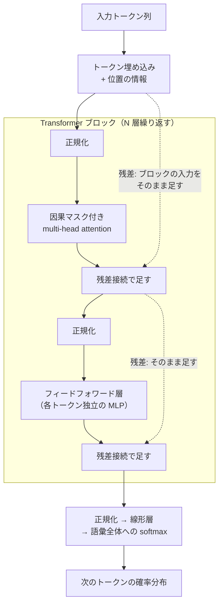
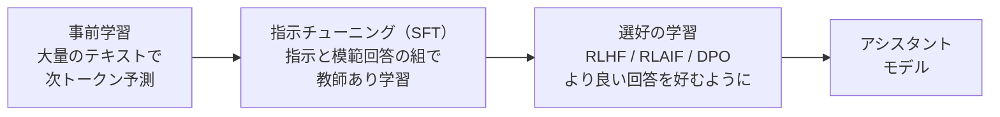

# 12.3 深層学習とTransformer

> 画像認識、音声認識、機械翻訳、そして対話やコード生成を行う大規模言語モデル（LLM）。これらはすべて、ニューラルネットワークを勾配で学習させるという同じ原理の上に成り立っています。この章では、自動微分の仕組みから注意機構と Transformer、言語モデルの学習、スケーリング則、推論のメモリと計算量の見積もりまでを、自分で実装しながら一続きに理解します。モデルの名前は数か月で入れ替わりますが、ここで学ぶ原理と見積もりの方法は長く使えます。

| 項目 | 内容 |
|---|---|
| 学習時間の目安 | 本文 5h ＋ 演習 7h |
| 前提となる章 | [12.2 機械学習の基礎](../02-machine-learning/README.md)、[1.1 情報の表現](../../01-computer-systems/01-data-representation/README.md)（浮動小数点数の形式） |
| 演習 | [exercises/](exercises/)（Python） |
| キーワード | ニューラルネットワーク, 活性化関数, 逆伝播, 自動微分, Adam, 初期化, 正規化, 残差接続, CNN, RNN/LSTM, 注意機構, Transformer, トークナイザ, BPE, 埋め込み, スケーリング則, RLHF, DPO, KV キャッシュ, 量子化, 幻覚 |

## この章のゴール

- [ ] ニューラルネットワークの構造と、非線形の活性化関数が必要な理由を説明できる
- [ ] 計算グラフと連鎖律による逆伝播（逆伝播型の自動微分）を説明し、実装できる
- [ ] 学習を安定させる技法（最適化手法・初期化・正規化・残差接続・学習率スケジュール・ドロップアウト）の役割を説明できる
- [ ] 注意機構と Transformer の構造を説明し、scaled dot-product attention と multi-head attention を実装できる
- [ ] 言語モデルの学習（次トークン予測、トークナイザ、事前学習から事後学習まで）の流れを説明できる
- [ ] パラメータ数とデータ量から、学習の計算量と推論に必要なメモリを概算できる
- [ ] LLM の限界（幻覚・推論の脆さ・知識の締め切り・長い文脈の扱い）を踏まえて、用途の向き不向きを判断できる

## なぜ学ぶのか

- **深層学習の転換点**: 2012 年、画像認識のコンテスト ImageNet（ILSVRC）で、畳み込みニューラルネットワーク AlexNet が上位 5 候補の誤り率 15.3% を記録し、2 位（26.2%）を大きく引き離しました。以後 10 年ほどで、画像・音声・翻訳の分野の主流の手法が深層学習に置き換わりました。
- **Transformer が土台になった**: 2017 年の論文 "Attention Is All You Need"（Vaswani ほか）で提案された Transformer は、翻訳のためのモデルでしたが、現在の LLM を含む多くの大規模モデルの基本構造になっています。
- **原理を知らないと事故が起きる**: 2023 年、米ニューヨークの連邦地裁は、ChatGPT が生成した実在しない判例を引用した準備書面を提出した弁護士らに制裁を科しました（Mata v. Avianca 事件）。LLM が「もっともらしい次の単語を予測する」仕組みであることを知っていれば、出力をそのまま事実として扱う危うさは明らかです。
- **コストの見積もりは CTO の仕事**: 自社でモデルを動かすのか API を使うのか、GPU が何枚必要か、1 リクエストにいくらかかるか。これらは、パラメータ数・データ量・トークン数から原理的に見積もれます。

## 1. ニューラルネットワーク

### 1.1 ニューロンと層

ニューロン（人工ニューロン）は、入力の重み付き和にバイアスを足し、**活性化関数** を通したものです。

```text
y = φ(w₁x₁ + w₂x₂ + … + wₙxₙ + b)       φ: 活性化関数
```

ニューロンを並べたものが **層**、層を重ねたものが **多層パーセプトロン（MLP）** です。各層は「行列を掛けてベクトルを足し、要素ごとに非線形関数を通す」処理で、深層学習の計算の大半は行列の積です（だから GPU が効きます）。

活性化関数がなければ、何層重ねても全体は 1 つの線形関数（行列の積は行列）にしかなりません。XOR のように直線 1 本で分けられない問題は、どれだけ層を深くしても解けないのです（演習 2 のテストで確かめます）。十分な数のニューロンを持つ非線形のネットワークは、任意の連続関数をいくらでも精度よく近似できることが知られています（普遍近似定理、Cybenko 1989 ほか）。ただし、それは「表現できる」という存在の話であって、必要なニューロンの数や、勾配降下法でその重みにたどり着けるかは別問題です。深層学習の実践の多くは、この「学習できるか」の工夫です。

### 1.2 活性化関数

| 関数 | 式 | 性質 |
|---|---|---|
| シグモイド | 1 / (1 + e⁻ˣ) | 出力 0〜1。微分の最大値が 0.25 なので、層を重ねると勾配が消えやすい。現在は主に出力（確率）に使う |
| tanh | (eˣ − e⁻ˣ) / (eˣ + e⁻ˣ) | 出力 −1〜1、原点対称。大きな入力で飽和し、微分がほぼ 0 になる |
| ReLU | max(0, x) | 計算が安く、正の側で勾配が消えない。深いネットワークの学習を容易にした。負の入力ばかり受けるニューロンは学習しなくなる（dead ReLU） |
| GELU | x · Φ(x)（Φ は標準正規分布の累積分布関数） | ReLU を滑らかにしたもの。BERT や GPT 系のモデルで使われた |

近年の多くの LLM は、フィードフォワード層にゲート付きの変種（SwiGLU など）を使っています。どれを使うかは実験で決まってきた経緯があり、「なぜそれが良いのか」が完全に説明されているわけではありません。

### 1.3 出力層と損失関数

出力層の形と損失関数は、タスクで決まります（[12.2 機械学習の基礎](../02-machine-learning/README.md) の線形モデルと同じ考え方です）。

| タスク | 出力層 | 損失 |
|---|---|---|
| 回帰 | 線形（活性化なし） | 二乗誤差 |
| 2 値分類 | 線形の出力 1 つ（ロジット）→ シグモイド | 2 値交差エントロピー |
| 多クラス分類・次トークン予測 | 線形の出力をクラス数だけ（ロジット）→ softmax | 交差エントロピー |

実装では、シグモイドや softmax と交差エントロピーを **1 つの演算として融合** し、ロジットから直接、数値的に安定な式で損失を計算します。別々に計算すると、確率が 0 に丸められて log(0) になることがあるからです（演習 2 の `bce_with_logits`）。

## 2. 逆伝播と自動微分

### 2.1 計算グラフと連鎖律

ニューラルネットワークの学習には、損失 L の各パラメータについての偏微分（勾配）が必要です。パラメータが数十億個あっても、これを効率よく正確に計算するのが **逆伝播（backpropagation）** で、Rumelhart・Hinton・Williams の 1986 年の論文で広く知られるようになりました。

計算を小さな演算のグラフとして考えます。L = (a·b + c)² を a = 2, b = −3, c = 10 で計算すると次のようになります。

```text
順伝播（値を計算）:           逆伝播（勾配を計算、出力側から）:
  a = 2  ─┐                    dL/dL = 1
          ×── d₁ = −6 ─┐       dL/dd = 2d = 8                    （d² の微分）
  b = −3 ─┘            +── d = 4 ── L = d² = 16
  c = 10 ──────────────┘       dL/dc = dL/dd · 1 = 8             （足し算は勾配をそのまま渡す）
                               dL/dd₁ = 8
                               dL/da = dL/dd₁ · b = 8 · (−3) = −24  （掛け算は相手の値を掛ける）
                               dL/db = dL/dd₁ · a = 8 · 2 = 16
```

各演算は、自分の出力についての勾配を受け取り、それに **局所的な微分**（足し算なら 1、掛け算なら相手の値）を掛けて入力へ渡すだけです。これが **連鎖律（chain rule）** です。ある値が複数の場所で使われていれば、それぞれの経路からの勾配を **足し合わせます**。演習 1 の自動微分エンジンで確かめると、手計算と一致します（演習を解いた後に `exercises/` で実行。出力は解答例のもの）。

```python
from autodiff import Value

# L = (a·b + c)² の値と勾配を計算する
a, b, c = Value(2.0), Value(-3.0), Value(10.0)
d = a * b + c        # d = 4
L = d ** 2           # L = 16
L.backward()
print(f"L = {L.data}")
print(f"dL/dd = {d.grad}, dL/da = {a.grad}, dL/db = {b.grad}, dL/dc = {c.grad}")
```

```text
L = 16.0
dL/dd = 8.0, dL/da = -24.0, dL/db = 16.0, dL/dc = 8.0
```

### 2.2 なぜ「逆向き」なのか

微分を自動で計算する方法（**自動微分**, automatic differentiation）には、入力側から微分を運ぶ **前向きモード** と、出力側から運ぶ **逆向きモード** があります。

- 前向きモードは、1 回の計算で「1 つの入力についての、全出力の微分」が得られる。入力が n 個なら n 回の計算が必要。
- 逆向きモードは、1 回の計算で「1 つの出力についての、全入力の微分」が得られる。

ニューラルネットワークの学習は「出力（損失）は 1 つ、入力（パラメータ）は数十億」なので、逆向きモードなら順伝播の数倍程度の計算で、全パラメータの勾配が一度に求まります。代償は **メモリ** です。逆伝播には順伝播の途中の値（活性化）が必要なので、それをすべて保存しておかなければなりません。大きなモデルの学習では、このメモリが重みそのものより大きくなることもあり、途中の値を一部だけ保存して必要なときに再計算する手法（gradient checkpointing）で、計算とメモリを交換します。

数値微分（f(x + h) と f(x − h) の差から近似する）は実装が簡単ですが、パラメータ 1 つにつき 2 回の順伝播が必要で、丸め誤差もあります。実務では、自動微分の実装を検証する **検算** に使います（演習 1 のテストがまさにそれです）。

### 2.3 実装の要点

演習 1 では、次の設計でスカラーの自動微分エンジンを作ります。

1. 各演算は、結果の値と一緒に「親（入力）」と「親についての局所的な微分」を記録する。
2. `backward()` は、出力から到達できるノードを **トポロジカル順**（どのノードも入力より後に来る順）に並べ、その逆順に「親の勾配 += 局所的な微分 × 自分の勾配」を実行する。
3. 数千段の深いグラフでも動くよう、並べ替えは再帰ではなく明示的なスタックで行う。
4. 葉（パラメータ）の勾配は呼び出しのたびに累積し、途中のノードの勾配は呼び出しのたびに数え直す。

PyTorch などのフレームワークは、同じことをスカラーではなく **テンソル**（多次元配列）の単位で行い、行列の積などの局所的な微分を GPU 上で高速に計算します。原理は同じです。

## 3. 学習を成功させる技法

### 3.1 最適化手法

| 手法 | 更新の考え方 |
|---|---|
| SGD | ミニバッチの勾配の逆向きに、学習率 η だけ進む |
| モメンタム | 過去の勾配の移動和（速度）の向きに進む。谷底での振動を打ち消し、平らな場所で加速する |
| Adam（Kingma & Ba, 2015） | 勾配の平均と二乗平均の移動平均を持ち、パラメータごとに「勾配の典型的な大きさ」で割った歩幅で進む。学習率の調整に比較的鈍感 |
| AdamW（Loshchilov & Hutter, 2019） | 重み減衰を、L2 正則化の項として勾配に混ぜる（Adam ではパラメータごとの歩幅の調整で効き方が歪む）のではなく、勾配による更新とは切り離して重みに直接かける。Transformer の学習で標準的 |

Adam の更新では、0 で初期化した移動平均の偏りを補正します。その結果、最初の 1 歩の大きさは、勾配の大きさによらずほぼ学習率に等しくなります（演習 2 のテストで確かめます）。

**学習率スケジュール**: Transformer の学習では、最初の数千ステップで学習率を 0 から徐々に上げ（ウォームアップ）、その後コサイン曲線などで下げていく方式がよく使われます。学習の初期は Adam の統計量が不安定で、大きな学習率だと発散しやすいためです。

### 3.2 初期化

重みの初期値の大きさは、学習が始まるかどうかを左右します。幅 100 の tanh の層を 50 層重ね、重みの標準偏差を「gain / √(入力の数)」として gain を変えてみます。

```python
import math, random

rng = random.Random(0)
width, depth = 100, 50
x0 = [rng.gauss(0, 1) for _ in range(width)]

for gain in (0.5, 1.0, 2.0):
    x = x0
    for layer in range(depth):
        # 重みの標準偏差 = gain / √(入力の数)。gain=1 が LeCun の初期化
        W = [[rng.gauss(0, gain / math.sqrt(width)) for _ in range(width)] for _ in range(width)]
        x = [math.tanh(sum(w * xi for w, xi in zip(row, x))) for row in W]
    rms = math.sqrt(sum(v * v for v in x) / width)
    slope = sum(1 - v * v for v in x) / width      # tanh の微分 1 - tanh² の平均
    saturated = sum(abs(v) > 0.99 for v in x) / width
    print(f"gain={gain}: 50層目の出力の大きさ {rms:.4f}  tanhの傾きの平均 {slope:.3f}  飽和した割合 {saturated:.0%}")
```

```text
gain=0.5: 50層目の出力の大きさ 0.0000  tanhの傾きの平均 1.000  飽和した割合 0%
gain=1.0: 50層目の出力の大きさ 0.1063  tanhの傾きの平均 0.989  飽和した割合 0%
gain=2.0: 50層目の出力の大きさ 0.7379  tanhの傾きの平均 0.456  飽和した割合 8%
```

小さすぎると信号は層を通るたびに縮んで消え、大きすぎると tanh が飽和して傾き（＝逆伝播で掛かる局所的な微分）が小さくなります。入力の数に応じて初期値の分散を決める **Xavier（Glorot）の初期化**（2010）や、ReLU 向けの **He の初期化**（2015）は、各層で信号の分散が保たれるように設計されています。

### 3.3 勾配消失・勾配爆発と残差接続

逆伝播では、層ごとに局所的な微分が掛け合わされます。シグモイドの微分は最大 0.25 なので、10 層通るだけで勾配は 0.25¹⁰ ≈ 10⁻⁶ 倍以下になります（**勾配消失**）。逆に 1 より大きな値が掛かり続けると **勾配爆発** が起き、学習が発散します。

深いネットワークを学習可能にした最大の工夫が **残差接続（residual connection）** です（ResNet, He ほか, 2015）。層の出力を `x + F(x)` とし、入力をそのまま足して次へ渡します。逆伝播では足し算は勾配をそのまま通すので、どれだけ深くても勾配が入力側まで届く「高速道路」ができます。ResNet は 152 層のネットワークの学習に成功し、Transformer もすべてのブロックで残差接続を使っています。勾配爆発に対しては、勾配のノルムが閾値を超えたら縮める **勾配クリッピング** も併用されます。

### 3.4 正規化

層の出力の分布を正規化すると、学習が安定し速くなります。

- **Batch Normalization**（Ioffe & Szegedy, 2015）: ミニバッチ内で、各特徴量を平均 0・分散 1 にそろえる。画像の CNN で広く使われた。バッチの大きさや推論時の扱いに注意が必要。
- **Layer Normalization**（Ba ほか, 2016）: 1 つのデータ（1 トークン）のベクトルの中で正規化する。バッチに依存しないので、系列の長さがまちまちな Transformer で使われる（演習 3 の `layer_norm`）。
- **RMSNorm**: 平均を引かず、二乗平均平方根だけで割る簡略版。計算が軽く、近年の多くの LLM で使われている。

### 3.5 過学習の抑制

| 手法 | 仕組み |
|---|---|
| ドロップアウト（Srivastava ほか, 2014） | 学習中にニューロンを確率 p で無効にし、特定のニューロンへの依存を防ぐ。推論時は使わない（現在の実装の多くは、学習時に残した出力を 1/(1−p) 倍して、推論時と出力の期待値をそろえる） |
| 重み減衰 | 重みを小さく保つ（L2 正則化と同じ考え方） |
| データ拡張 | 画像の反転・切り抜きなど、ラベルを変えない変換でデータを水増しする |
| 早期終了 | 検証データの損失が悪化し始めたら学習を止める |

なお、LLM の事前学習では、データが膨大で同じデータを何度も見ないため、古典的な意味での過学習よりも、データの質や重複の方が問題になりやすいとされています。

## 4. CNN と RNN（概要）

**畳み込みニューラルネットワーク（CNN）** は、小さなフィルタ（例: 3×3）を画像全体に滑らせて同じ重みを使い回す層で、「近くの画素の関係が重要」「同じパターンは画像のどこに現れても同じ」という画像の性質を構造に組み込んでいます。全結合層よりパラメータがはるかに少なく、局所的な特徴（縁 → 模様 → 部品 → 物体）を階層的に学びます。AlexNet（2012）や ResNet（2015）が代表例です。

**再帰型ニューラルネットワーク（RNN）** は、系列を 1 要素ずつ読み、隠れ状態を更新しながら処理します。長い系列では勾配が時間方向に何度も掛け合わされて消失するため、ゲートで情報の保持と忘却を制御する **LSTM**（Hochreiter & Schmidhuber, 1997）や GRU が使われました。しかし RNN には、**時間方向に逐次的に計算するので並列化できない** という根本的な制約があり、GPU を活かした大規模な学習に向きませんでした。この制約を取り払ったのが、次の Transformer です。

## 5. 注意機構と Transformer

### 5.1 注意機構のアイデア

「彼はその本を読んだ。それは面白かった。」の「それ」が何を指すかを知るには、前の単語を振り返る必要があります。**注意機構（attention）** は、各位置が「どの位置の情報をどれだけ取り込むか」を、内容に応じて動的に決める仕組みです。翻訳のモデルで Bahdanau ほか（2014）が導入し、Transformer はこれを中心に据えました。

注意機構は「やわらかい辞書検索」と考えると分かりやすくなります。各トークンは 3 つのベクトルを持ちます。

- **クエリ（Q）**: 「私はこういう情報を探している」
- **キー（K）**: 「私はこういう情報を持っている」（検索の見出し）
- **バリュー（V）**: 「私の中身」

クエリと各キーの内積で類似度を測り、softmax で重み（合計 1）に変え、バリューの重み付き平均をとります。

```text
Attention(Q, K, V) = softmax(Q Kᵀ / √d_k) V
```

**√d_k で割る理由**: 各要素が平均 0・分散 1 の d_k 次元のベクトルどうしの内積は、分散が d_k になります。d_k が大きいと内積の値が大きくばらつき、softmax がほぼ 1 か所に集中して（飽和して）勾配が小さくなります。√d_k で割って分散を 1 に戻すのです（原論文の説明）。

言語モデルのように「未来のトークンを見てはいけない」場合は、**因果マスク** で自分より後の位置のスコアを −∞ にします（softmax で重み 0 になります）。演習 3 の実装で、4 トークンの例の重みを見てみます。

```python
from attention import causal_mask, scaled_dot_product_attention

# 4 トークンの列。各トークンの（射影済みの）クエリ・キー・値ベクトルを手で与える
tokens = ["the", "cat", "sat", "down"]
Q = K = [[1.0, 0.0], [0.0, 1.0], [1.0, 0.2], [0.1, 1.0]]
V = [[1.0, 0.0], [0.0, 1.0], [2.0, 0.0], [0.0, 2.0]]
out, weights = scaled_dot_product_attention(Q, K, V, mask=causal_mask(4))
print("クエリ＼キー " + " ".join(f"{t:>5}" for t in tokens))
for t, row in zip(tokens, weights):
    print(f"{t:>11} " + " ".join(f"{w:5.2f}" for w in row))
```

```text
クエリ＼キー   the   cat   sat  down
        the  1.00  0.00  0.00  0.00
        cat  0.33  0.67  0.00  0.00
        sat  0.39  0.22  0.40  0.00
       down  0.17  0.32  0.19  0.32
```

右上の三角は 0 で、各行の和は 1 です。「sat」はキーが似ている「the」と自分自身に、「down」は「cat」と自分自身に多く注意を向けています。実際のモデルでは、Q・K・V はトークンの埋め込みに学習した行列を掛けて作られ、どこに注意を向けるかも学習で決まります。

### 5.2 Multi-head attention

1 組の Q・K・V では、1 種類の関係しか捉えられません。**multi-head attention** は、ベクトルを h 個の「ヘッド」に分け、ヘッドごとに独立に注意を計算して連結します。あるヘッドは文法的な関係を、別のヘッドは指示語の参照先を、というように異なる関係を並列に捉えられます。各ヘッドの次元は d_model / h なので、計算量は 1 ヘッドで全次元を使う場合とほぼ同じです（演習 3 の `split_heads` / `merge_heads`）。

### 5.3 Transformer ブロック

現在の LLM の多くが採用する **デコーダのみ（decoder-only）** の Transformer は、次のブロックを数十層重ねたものです。



- **注意の層** はトークンの **間** で情報を混ぜ、**フィードフォワード層** は各トークンの **中** で情報を変換します。フィードフォワード層の中間の次元は、元の論文では d_model の 4 倍（512 に対して 2,048）で、パラメータの大半はここにあります。
- 元の論文は各サブ層の **後** に正規化を置いていました（Post-LN）が、GPT-2 以降の多くのモデルは **前** に置きます（Pre-LN）。深いモデルでも学習が安定しやすいためです。
- **位置の情報**: 注意機構はそれだけでは語順を区別できない（入力の順番を入れ替えても、各トークンの出力は入れ替わるだけ）ので、位置の情報を加えます。元の論文は正弦波の位置エンコーディング（演習 3）、GPT-2 は学習する位置埋め込み、近年の多くの LLM は回転位置埋め込み（RoPE）を使っています。正弦波の位置エンコーディングには「2 つの位置のベクトルの内積が、位置の差だけで決まる」という性質があり、相対的な位置を捉えやすくなっています（演習 3 のテストで確かめます）。

### 5.4 エンコーダとデコーダ

| 構成 | 注意の向き | 学習の目的 | 代表例と用途 |
|---|---|---|---|
| エンコーダのみ | 双方向（前後すべてを見る） | 隠した単語を当てる（masked LM） | BERT（2018）。分類、検索用の埋め込み |
| デコーダのみ | 因果的（過去だけを見る） | 次のトークンを当てる | GPT 系、現在の多くの LLM。生成全般 |
| エンコーダ・デコーダ | 入力は双方向、出力は因果的 ＋ 入力への注意 | 入力から出力の系列を生成 | 元の Transformer、T5。翻訳・要約 |

### 5.5 計算量

系列の長さを n、ベクトルの次元を d とすると、注意の計算は Q Kᵀ で **O(n²d)**、注意の重みの行列は **O(n²)** の大きさになります。文脈を 2 倍にすると注意の計算は 4 倍です。フィードフォワード層は O(nd²) なので、短い系列ではこちらが支配的で、長い系列では注意が支配的になります。FlashAttention（Dao ほか, 2022）は、GPU のメモリ階層を意識して n×n の行列を低速なメモリに書き出さずに厳密な注意を計算する手法で、長い文脈の計算を大きく高速化しました（[1.3 メモリ階層とキャッシュ](../../01-computer-systems/03-memory-hierarchy/README.md) の考え方がそのまま効く例です）。

## 6. 言語モデルと LLM

### 6.1 次トークン予測と生成

言語モデルは、トークン列の確率を「前のトークンから次のトークンを予測する確率」の積に分解して学習します。

```text
P(x₁, x₂, …, xₙ) = P(x₁) · P(x₂ | x₁) · P(x₃ | x₁, x₂) · … · P(xₙ | x₁, …, xₙ₋₁)
```

学習では、大量のテキストの各位置で「次のトークン」の交差エントロピーを最小化します。正解ラベルはテキスト自身から作れるので、人手のラベル付けが不要です（自己教師あり学習）。評価には、平均の交差エントロピーを指数に戻した **パープレキシティ**（「平均して何個の候補で迷っているか」に相当）がよく使われます。

生成では、次のトークンの確率分布から 1 つ選び、それを入力に加えて、また次を予測する、を繰り返します。選び方の設定が出力の性格を決めます。

```python
import math

logits = {"晴れ": 3.0, "曇り": 2.0, "雨": 1.0, "雪": -1.0}   # 「明日の天気は」の次のトークンの候補
for T in (0.2, 1.0, 2.0):
    z = [v / T for v in logits.values()]
    m = max(z)
    e = [math.exp(v - m) for v in z]
    probs = [x / sum(e) for x in e]
    print(f"温度 {T}: " + "  ".join(f"{k} {p:.2f}" for k, p in zip(logits, probs)))
```

```text
温度 0.2: 晴れ 0.99  曇り 0.01  雨 0.00  雪 0.00
温度 1.0: 晴れ 0.66  曇り 0.24  雨 0.09  雪 0.01
温度 2.0: 晴れ 0.47  曇り 0.29  雨 0.17  雪 0.06
```

- **温度（temperature）**: ロジットを温度で割ってから softmax をとる。低いほど確率の高い候補に集中し（決定的・保守的）、高いほど多様になる（創造的だが脱線しやすい）。
- **top-k / top-p（nucleus sampling, Holtzman ほか, 2020）**: 上位 k 個、または累積確率が p に達するまでの候補だけから選ぶ。確率の低い奇妙な候補を切り捨てる。
- **貪欲法**: 常に最大の確率の候補を選ぶ（温度 0 に相当）。同じ入力に同じ出力を返しやすいが、繰り返しに陥ることがある。

### 6.2 トークナイザ

モデルが扱うのは文字ではなく **トークン**（単語の一部）の ID の列です。語彙を単語にすると未知語や活用形に対応できず、文字にすると系列が長くなりすぎます。その中間として、頻出する文字列を 1 トークンにまとめる **サブワード** 分割が使われます。

- **BPE（Byte Pair Encoding）**: もとはデータ圧縮の手法（Gage, 1994）で、Sennrich ほか（2016）が機械翻訳に導入した。「最も頻繁に隣り合うペアを併合する」を繰り返して語彙を作る。GPT-2 以降は UTF-8 のバイトから始める **バイトレベル BPE** が広く使われ、どんな文字列も必ず表現できる（演習 4）。
- **SentencePiece**（Kudo & Richardson, 2018）: 空白を特別扱いせず生の文から直接学習するツールで、単語の区切りに空白を使わない日本語などに適している。BPE と、確率モデルに基づく Unigram 言語モデルの手法を選べる。開発者の工藤拓氏は、日本語の形態素解析器 MeCab の作者でもある。

トークナイザは、**コストと文脈の長さに直結** します。API の料金も文脈の上限もトークン数で決まるからです。演習 4 の BPE を英語のテキストだけで学習させ、英語と日本語の文を符号化してみます。

```python
from bpe import BPETokenizer

english = ("The model reads the text as a sequence of tokens. Each token is mapped to a vector, "
           "and the network predicts the next token from the tokens that came before it. ") * 30
tok = BPETokenizer.train(english, 356)        # 英語だけで 100 回併合を学習した語彙
for text in ["The network predicts the next token.", "ネットワークは次のトークンを予測する。"]:
    ids = tok.encode(text)
    print(f"{len(text):3d} 文字 → {len(ids):3d} トークン（1 文字あたり {len(ids) / len(text):.2f}）: {text}")
```

```text
 36 文字 →   7 トークン（1 文字あたり 0.19）: The network predicts the next token.
 19 文字 →  57 トークン（1 文字あたり 3.00）: ネットワークは次のトークンを予測する。
```

学習データに日本語がなければ、日本語の文字は UTF-8 のバイト（1 文字 3 バイト）のまま符号化されます。これは極端な例ですが、学習データの言語の偏りは、トークナイザを通じて「同じ内容でも言語によって料金と文脈の消費が違う」という形で現れます。2026 年時点の主要なモデルは多言語のデータでトークナイザを学習していますが、日本語のトークン効率はモデルによって差があるので、利用するモデルで実際に測って見積もりましょう。

### 6.3 埋め込み

各トークン ID は、学習される **埋め込み行列**（語彙の大きさ × d_model）の行によってベクトルに変換されます。word2vec（Mikolov ほか, 2013）は、単語の埋め込みが「king − man + woman ≈ queen」のような意味の関係を表すことを示し、広く注目されました。Transformer の内部の表現は文脈に応じて変わる（「銀行の口座」と「川の土手（bank）」を区別できる）文脈化された埋め込みで、文全体を 1 つのベクトルにした **文の埋め込み** は、意味の近い文書を探す検索（[12.4 LLMアプリケーション開発](../04-llm-applications/README.md) の RAG）に使われます。

### 6.4 スケーリング則

- **Kaplan ほか（2020）**: 言語モデルの損失が、パラメータ数 N・データ量 D・計算量 C に対して、7 桁以上にわたって **べき乗則** に従って滑らかに下がることを示しました。「大きくすれば予測可能に良くなる」ことが、巨額の投資を正当化する根拠になりました。
- **Hoffmann ほか（2022, "Chinchilla"）**: 計算量が一定なら、パラメータ数とデータ量をほぼ同じ比率で増やすのが最適で、その目安は **パラメータ 1 つあたり約 20 トークン** だと示しました。700 億パラメータの Chinchilla を 1.4 兆トークンで学習させ、同じ計算量で学習した 2,800 億パラメータのモデル（Gopher、3,000 億トークン）を上回りました。それ以前の多くのモデルは、パラメータに対してデータが少なすぎたことになります。
- **実務の傾向**: Chinchilla の比率は「学習の計算量に対して最適」という意味で、推論のコストは考慮していません。推論は何億回も行われるので、小さなモデルを最適な比率よりはるかに多いデータで学習させる方が、トータルでは安くなります。例えば Meta は、Llama 3 の 80 億パラメータのモデルを 15 兆トークン以上で学習したと公表しています（パラメータあたり約 1,900 トークン）。

### 6.5 事前学習から事後学習へ

事前学習だけのモデルは、「インターネットの続きを書く」のが得意なだけで、質問に答えたり指示に従ったりするようには作られていません。対話型のアシスタントは、次の段階を経て作られます。



- **指示チューニング（SFT）**: 指示と模範的な回答の組で追加学習する。
- **RLHF（人間のフィードバックによる強化学習）**: 同じ指示への複数の回答を人間が順位付けし、その好みを予測する「報酬モデル」を学習させ、報酬が高くなるように強化学習でモデルを調整する。InstructGPT（Ouyang ほか, 2022）では、この方法で調整した 13 億パラメータのモデルの出力が、1,750 億パラメータの GPT-3 の出力より人間の評価者に好まれた。
- **RLAIF**: 人間の代わりに、原則（憲法）に基づいて AI が回答を評価する（Constitutional AI, Bai ほか, 2022）。
- **DPO（Direct Preference Optimization, Rafailov ほか, 2023）**: 報酬モデルと強化学習を使わず、好みのデータから直接モデルを最適化する。実装が簡単で広く使われるようになった。

2026 年時点では、数学やプログラミングのように答えを自動で検証できる課題で強化学習を行い、回答の前に長い推論の過程を生成するように学習したモデル（推論モデル）も広く使われています。事後学習の手法は変化が速い分野なので、個々の手法名よりも「事前学習で知識と言語能力を、事後学習で振る舞いを作る」という役割分担を押さえておきましょう。

### 6.6 マルチモーダル

Transformer はトークンの列であれば何でも扱えます。画像を小さなパッチに分けて各パッチをトークンとして扱う Vision Transformer（Dosovitskiy ほか, 2020）、画像と文章を同じ埋め込み空間に対応づける CLIP（Radford ほか, 2021）などを経て、画像・音声・テキストをまとめて入出力できるモデルが一般的になりました。

## 7. コストの見積もり — 学習と推論

### 7.1 学習の計算量: C ≈ 6ND

Transformer の学習の計算量（浮動小数点演算の回数）は、パラメータ数 N とトークン数 D から **C ≈ 6ND** と見積もれます。1 トークンあたり、順伝播で約 2N（掛け算と足し算で 1 パラメータにつき 2 回）、逆伝播で約 4N の演算が必要だからです（注意の計算を無視した近似）。推論は 1 トークンあたり約 2N です。

### 7.2 推論のメモリ: 重み ＋ KV キャッシュ

推論に必要な GPU メモリの大部分は、次の 2 つです。

1. **重み**: パラメータ数 × 1 パラメータあたりのバイト数。バイト数は数値の形式で決まります（[1.1 情報の表現](../../01-computer-systems/01-data-representation/README.md) の浮動小数点数の形式を参照。FP32 は 4 バイト、BF16 は 2 バイト、8 ビット量子化で 1 バイト、4 ビット量子化で 0.5 バイト）。
2. **KV キャッシュ**: 生成済みのトークンの K と V を層ごとに保存したもの（7.4 節）。1 トークンあたり「2（K と V）× 層数 × KV のヘッド数 × ヘッドの次元 × バイト数」で、文脈の長さと同時に処理するリクエスト数に比例して増えます。

Llama 2 7B と同じ構成（32 層、32 ヘッド、ヘッドの次元 128、約 67 億パラメータ）を例に計算してみます。

```python
# 7B 級のモデルのメモリと計算量の概算（Llama 2 7B と同じ 32 層・隠れ次元 4096・32 ヘッドを仮定）
params = 6.7e9
layers, heads, head_dim = 32, 32, 128
GiB = 2**30

for name, nbytes in [("FP32", 4), ("BF16", 2), ("INT8", 1), ("INT4", 0.5)]:
    print(f"重み {name}: {params * nbytes / GiB:5.1f} GiB")

kv_per_token = 2 * layers * heads * head_dim * 2        # K と V、BF16（2 バイト）
print(f"KV キャッシュ: 1 トークンあたり {kv_per_token / 2**20:.2f} MiB")
for seq, batch in [(4096, 1), (4096, 16), (32768, 1)]:
    print(f"  文脈 {seq:6d} トークン × 同時 {batch:2d} 本: {kv_per_token * seq * batch / GiB:5.1f} GiB")

tokens = 2e12
flops = 6 * params * tokens                          # 学習の計算量 C ≈ 6ND
effective = 1e15 * 0.4                               # 1 PFLOP/s 級の GPU を 40% の効率で使えたと仮定
print(f"学習: {flops:.1e} FLOP ≈ {flops / effective / 3600:,.0f} GPU 時間")
print(f"Chinchilla 則（20 トークン/パラメータ）での最適なデータ量: {20 * params / 1e9:.0f}B トークン")
```

```text
重み FP32:  25.0 GiB
重み BF16:  12.5 GiB
重み INT8:   6.2 GiB
重み INT4:   3.1 GiB
KV キャッシュ: 1 トークンあたり 0.50 MiB
  文脈   4096 トークン × 同時  1 本:   2.0 GiB
  文脈   4096 トークン × 同時 16 本:  32.0 GiB
  文脈  32768 トークン × 同時  1 本:  16.0 GiB
学習: 8.0e+22 FLOP ≈ 55,833 GPU 時間
Chinchilla 則（20 トークン/パラメータ）での最適なデータ量: 134B トークン
```

読み取れることは 3 つあります。第一に、**同時に多くのリクエストをさばくと、KV キャッシュが重みより大きくなる**（16 本で 32GiB）。サービングのメモリ設計では、重みより KV キャッシュの方が支配的になりがちです。第二に、KV のヘッド数を減らす Grouped-Query Attention（GQA, Ainslie ほか, 2023。例えば KV のヘッドを 8 にすれば 4 分の 1）や、KV キャッシュの量子化が、長い文脈の実用性を左右します。第三に、Llama 2 7B は約 2 兆トークンで学習されたと公表されており、Chinchilla の比率（約 1,340 億トークン）の 15 倍ほどのデータを使っています。学習の計算量は、1 PFLOP/s 級の GPU（2026 年時点のデータセンター向け GPU の BF16 の公称性能の桁）を 40% の効率で使えたと仮定すると約 5.6 万 GPU 時間、1,000 枚で 2〜3 日の規模です。実際の効率は構成や実装で大きく変わるので、あくまで桁の見積もりとして使ってください。

### 7.3 推論の速度: 生成はメモリ帯域で決まる

推論は 2 段階に分かれます。入力のプロンプト全体を一度に処理する **prefill** は、多数のトークンを並列に計算できるので演算性能が効きます。その後 1 トークンずつ出力する **decode** では、1 トークンを出すたびに **全パラメータをメモリから読み出す** 必要があり、計算よりメモリ帯域が律速になります。重みが 13.4GB（BF16）で、GPU のメモリ帯域が 2TB/秒なら、1 本のリクエストの生成速度の上限は 2,000 ÷ 13.4 ≈ 150 トークン/秒 程度です。複数のリクエストをまとめて処理（バッチ化）すると、1 回の重みの読み出しを複数のリクエストで共有できるので、全体のスループットが上がります（[12.5 の continuous batching](../05-mlops-llmops/README.md)）。

### 7.4 推論を速く・安くする技法

| 技法 | 仕組み | トレードオフ |
|---|---|---|
| KV キャッシュ | 過去のトークンの K, V を保存し、新しいトークンのクエリだけを計算する（演習 3 の `KVCache`） | メモリを大量に使う |
| 量子化 | 重み（や KV キャッシュ）を 8 ビット・4 ビットで表す（GPTQ、AWQ などの手法） | 精度が落ちることがある。タスクで評価が必要 |
| 蒸留（Hinton ほか, 2015） | 大きなモデル（教師）の出力を真似るように小さなモデル（生徒）を学習させる | 能力の一部は失われる |
| 投機的デコーディング（Leviathan ほか, 2023 など） | 小さなモデルが数トークン先まで下書きし、大きなモデルが 1 回の計算でまとめて検証する。出力の分布は大きなモデルと同じに保たれる | 下書きが外れると効果が薄い |
| Mixture of Experts（MoE） | フィードフォワード層を多数の「専門家」に分け、トークンごとに一部だけを使う。総パラメータに比べて 1 トークンの計算量が小さい | 全専門家の重みをメモリに置く必要がある |

## 8. LLM の限界

- **幻覚（hallucination）**: LLM は「もっともらしい続き」を生成するように学習されており、「真実であること」を直接は最適化していません。知らないことを知らないと言わず、それらしい引用・数値・API の名前を作り出すことがあります。事実が重要な用途では、出典の提示（RAG）、検証の仕組み、人による確認を組み合わせます（12.4）。
- **推論の脆さ**: 問題の言い回しや無関係な情報の追加で、答えが変わることがあります。「A は B だ」と学習しても「B は A だ」に答えられない現象（reversal curse, Berglund ほか, 2023）のように、人間には自明な一般化に失敗することもあります。推論モデルで大きく改善した領域もありますが、検証なしに信頼してよい段階ではありません。
- **知識の締め切り**: 事前学習のデータに含まれない最近の出来事や、社内の情報は知りません。
- **長い文脈**: 扱える文脈の上限（コンテキストウィンドウ）は大きく伸びましたが、「入る」ことと「使いこなせる」ことは別です。長い文脈の中ほどにある情報を使いにくい傾向（"Lost in the Middle", Liu ほか, 2023）が報告されており、関係のない情報を大量に入れると性能が落ちることがあります。
- **評価の汚染**: 公開ベンチマークの問題が学習データに混入していると、ベンチマークの点数は実力を過大評価します。自社の用途では、自社で作った評価データで測ることが欠かせません（12.4）。

## よくある落とし穴

1. **ロジットと確率、softmax と交差エントロピーを別々に計算する**。確率が 0 に丸められて log(0) になり、学習が NaN で止まる。ロジットから直接、融合した安定な式で損失を計算する。
2. **初期値や学習率を「とりあえず」決める**。信号が消えたり飽和したりして、学習がまったく進まない。層の幅に応じた初期化、ウォームアップ付きの学習率スケジュールを使う。
3. **損失が NaN になったのを放置する**。勾配爆発・学習率が大きすぎる・log(0)・データの異常値のどれかが原因。勾配のノルムを監視し、クリッピングを使い、NaN を出したバッチを記録する。
4. **GPU のメモリを重みだけで見積もる**。学習では勾配・オプティマイザの状態（Adam は 1 パラメータにつき 2 つ）・活性化が、推論では KV キャッシュが大きく加わる。文脈の長さと同時リクエスト数を前提に見積もる。
5. **トークン数を文字数で見積もる**。言語やトークナイザで大きく変わる。対象のモデルのトークナイザで実際のデータを数える。
6. **パラメータ数やベンチマークの点数だけでモデルを選ぶ**。ベンチマークは汚染されうるし、自社のタスクとは違う。自社の評価データで、品質・遅延・コストを並べて比較する。
7. **温度 0 なら出力は完全に再現できると思い込む**。サービス側のバッチ処理や浮動小数点演算の順序などで、同じ入力でも出力が変わることがある。再現性が必要な処理は、出力を保存して検証する設計にする。
8. **LLM の出力を検証なしに事実として使う**。幻覚は仕組み上なくならない。出典の確認、形式の検証、人による確認を用途のリスクに応じて組み込む。

## CTOの視点

1. **「作る・調整する・使う」の判断を見積もりで行う**。基盤モデルを自社で事前学習する（6ND の計算量と巨額のデータ・人材が必要）、公開された重みのモデルを自社で動かし必要なら追加学習する、API を使う、の選択は、コスト・データの機密性・遅延・人材で決まります。自社運用なら、重み ＋ KV キャッシュのメモリから GPU の台数を、メモリ帯域から 1 台あたりのスループットを概算し、API のトークン単価と比べます。ほとんどの企業にとって、事前学習は選択肢になりません。
2. **設計レビューで問うべき質問**: 「このタスクに本当にそのモデルの大きさが必要か（小さなモデル＋良いプロンプトや RAG で足りないか）」「文脈の長さと同時リクエスト数を前提にしたメモリの見積もりは」「1 リクエストあたりのトークン数と単価、月間の総額は」「モデルを変えたときに品質を確かめる評価データはあるか」。
3. **モデルの入れ替わりを前提にする**。基盤モデルは数か月単位で世代交代し、価格も大きく動きます。特定のモデルに依存しない抽象化（AI ゲートウェイ、[12.5](../05-mlops-llmops/README.md)）と、自社の評価データによる回帰テスト（[12.4](../04-llm-applications/README.md)）があれば、新しいモデルへの移行を「評価して数日で切り替える」運用にできます。ない組織は、古いモデルに縛られるか、確かめずに切り替えて品質事故を起こします。
4. **限界を踏まえてリスクを配分する**。幻覚をゼロにはできないので、誤りのコストが大きい用途（医療・法務・金融の判断、顧客への約束）では、人の確認・出典の提示・適用範囲の制限を設計に組み込みます。「AI が誤った場合に誰が責任を持つか」を、導入前に事業部門・法務と合意しておきます（[14.8 AI戦略とAIガバナンス](../../14-cto/08-ai-strategy/README.md)）。
5. **人材の見極め**: ML の研究者・ML エンジニア・LLM を組み込んだアプリケーションを作るエンジニアは、必要な能力が異なります。面接では、流行のモデル名より「KV キャッシュがなぜメモリを食うか」「なぜ生成はメモリ帯域で律速されるか」「評価をどう設計するか」を説明できるかを見ると、原理を理解しているかが分かります。

## 演習

演習コードは [exercises/](exercises/) にあります。演習 2 は演習 1 の `autodiff.py` を使うので、1 → 2 の順に進めてください。演習 3・4 は独立しています。解答例は [solutions/](solutions/) にあります。

```bash
python3 tools/check.py 12.3        # リポジトリのルートで実行
python3 tools/check.py -v 12.3     # 詳しい出力
```

| # | 難易度 | 内容 | ファイル / 関数 |
|---|---|---|---|
| 1 | ★★★ | スカラーの逆伝播型自動微分: 四則演算・累乗・exp・log・tanh・relu・sigmoid、トポロジカル順の逆伝播（再帰なし）、勾配の累積、数値微分による検算 | [autodiff.py](exercises/autodiff.py): `Value`, `value_and_grad`, `numerical_gradient` |
| 2 | ★★★ | 自動微分の上の MLP: ニューロン・層・初期化、安定な交差エントロピー、SGD（モメンタム）と Adam、ミニバッチ学習で XOR と同心円を分類 | [tiny_nn.py](exercises/tiny_nn.py): `Neuron`, `Layer`, `MLP`, `bce_with_logits`, `SGD`, `Adam`, `train_binary_classifier` |
| 3 | ★★☆ | 注意機構: 安定な softmax、因果マスク付き scaled dot-product attention、multi-head の分割と結合、位置エンコーディング、層正規化、KV キャッシュ | [attention.py](exercises/attention.py): `softmax`, `scaled_dot_product_attention`, `multi_head_attention`, `KVCache` ほか |
| 4 | ★★☆ | バイトレベル BPE: ペアの数え上げと併合、決定的な学習、符号化と復号の往復 | [bpe.py](exercises/bpe.py): `count_pairs`, `merge_pair`, `BPETokenizer` |
| 5 | ★★☆ | 記述: 自社でモデルを動かす場合の見積もり（下記） | — |

### 演習 5（記述）: 社内向け LLM の自社運用の見積もり

社内の問い合わせ対応に、公開された重みの 80 億パラメータ（8B）のモデルを自社の GPU で動かす案が出ています。モデルは 32 層、KV のヘッド数 8（GQA）、ヘッドの次元 128 とします。想定は、同時に 20 リクエスト、各リクエストの文脈（入力＋出力）が最大 8,000 トークンです。

1. BF16 で動かす場合の、重みと KV キャッシュのメモリを見積もってください。
2. 80GB のメモリを持つ GPU 1 枚で足りるかを判断し、足りない・余裕がない場合の選択肢を 3 つ挙げてください。
3. API を使う案と比べるときに、コスト以外で考慮すべき観点を 3 つ挙げてください。

<details>
<summary>解答例と採点の観点</summary>

1. **重み**: 8 × 10⁹ × 2 バイト = 16GB（約 14.9GiB）。**KV キャッシュ**: 1 トークンあたり 2 × 32 層 × 8 ヘッド × 128 × 2 バイト = 131,072 バイト（128KiB）。20 リクエスト × 8,000 トークン = 16 万トークンで、約 21GB（約 19.5GiB）。合計で約 37GB。実際にはこれに加えて、推論エンジンの作業領域や活性化、メモリの断片化の分が必要です。
2. **判断**: 80GB の GPU 1 枚に収まる見込みで、同時リクエスト数を 2 倍程度に増やす余地もあります。ただし、ピーク時の同時数と文脈の長さの分布を実測で確認すべきです。**余裕がない場合の選択肢**: ①重みを 8 ビット・4 ビットに量子化する（品質を評価で確認）、②KV キャッシュを量子化する、またはページング（PagedAttention のような仕組みで断片化を減らす）を使う推論エンジンを選ぶ、③同時リクエスト数や最大の文脈長に上限を設ける（キューイング）、④GPU を増やして並列化する。
3. **コスト以外の観点**: データの機密性と所在（社外に出せない情報か、API の契約上のデータの扱い）、運用の体制（GPU の調達・障害対応・モデル更新を担う人材がいるか）、品質（API の大きなモデルとの品質差を自社の評価データで比べたか）、遅延、モデルの更新への追従、可用性（GPU 1 枚は単一障害点）。

採点の観点:

- KV キャッシュを「2 × 層数 × KV ヘッド数 × ヘッドの次元 × バイト数 × トークン数」で計算でき、GQA の効果（KV ヘッド 8）を反映できていれば合格ライン。
- 見積もりに作業領域の余裕や実測の必要性を添え、量子化の品質リスクや単一障害点など運用上のリスクにも言及できていれば、意思決定に使える水準です。

</details>

## 理解度チェック

**Q1. 活性化関数のない 10 層のネットワークが、1 層の線形モデルと同じ表現力しか持たないのはなぜですか。**

<details>
<summary>解答</summary>

各層が「行列を掛けてベクトルを足す」線形（アフィン）変換だけなら、その合成も 1 つの行列の積とベクトルの足し算で書けるからです（W₂(W₁x + b₁) + b₂ = (W₂W₁)x + (W₂b₁ + b₂)）。何層重ねても決定境界は超平面のままで、XOR のような問題は解けません。層の間に非線形の活性化関数を挟むことで、初めて深さが表現力の向上につながります。

</details>

**Q2. パラメータが 10 億個あるモデルの勾配を計算するのに、数値微分ではなく逆伝播を使う理由を、計算量の観点から説明してください。**

<details>
<summary>解答</summary>

数値微分は、パラメータ 1 つにつき（中心差分なら 2 回の）順伝播が必要なので、10 億個のパラメータでは約 20 億回の順伝播が必要です。逆伝播（逆向きモードの自動微分）は、出力（損失）が 1 つなら、1 回の順伝播と 1 回の逆伝播（順伝播の数倍程度の計算）で全パラメータの勾配が求まります。さらに数値微分は差分の幅 h の選び方による誤差がありますが、自動微分は（浮動小数点の丸めを除いて）正確です。代わりに逆伝播は、順伝播の途中の値を保存するためのメモリを必要とします。

</details>

**Q3. scaled dot-product attention で、Q Kᵀ を √d_k で割るのはなぜですか。**

<details>
<summary>解答</summary>

各要素が平均 0・分散 1 の独立な値だとすると、d_k 次元のベクトルどうしの内積の分散は d_k になります。d_k が大きいと内積の値が大きくばらつき、softmax が 1 か所にほぼすべての重みを集中させる（飽和する）ため、勾配が非常に小さくなって学習が進みにくくなります。√d_k で割ることで内積の分散を 1 程度に保ち、softmax が適度になだらかな状態で学習できるようにしています。

</details>

**Q4. 残差接続が深いネットワークの学習を可能にする理由を、逆伝播の観点から説明してください。**

<details>
<summary>解答</summary>

残差接続では層の出力を x + F(x) とします。逆伝播では、足し算は勾配をそのまま両方の入力に渡すので、勾配は F の中を通る経路に加えて、x をそのまま通る経路でも前の層へ届きます。F の中の局所的な微分が小さくても（勾配消失）、恒等写像の経路を通じて勾配が減衰せずに入力側まで伝わるため、数十〜数百層でも学習できます。

</details>

**Q5. 言語モデルの生成で、温度を 0.2 と 1.5 にした場合の出力の違いと、それぞれが向く用途を説明してください。**

<details>
<summary>解答</summary>

温度はロジットを割る値で、低いほど確率分布が最大の候補に集中し、高いほど平らになります。温度 0.2 では、ほぼ毎回最も確率の高い候補が選ばれ、出力は安定して決定的になります。事実の抽出・分類・コード生成・形式の決まった出力に向きます。温度 1.5 では、確率の低い候補も選ばれやすくなり、多様で意外性のある出力になりますが、脱線や誤りも増えます。アイデア出しや文章のバリエーション作りに向きます。多くの場合、top-p などと組み合わせて、確率の極めて低い候補は除外します。

</details>

**Q6. Chinchilla のスケーリング則（パラメータあたり約 20 トークン）があるのに、実際には 8B のモデルを 15 兆トークンで学習させることがあります。なぜですか。**

<details>
<summary>解答</summary>

Chinchilla の比率は「一定の **学習** の計算量で、損失を最小にする」配分です。しかし実際のサービスでは、モデルは学習後に何億回も推論に使われ、推論のコストはパラメータ数に比例します。小さなモデルを、最適な比率よりはるかに多いデータで学習させれば、同じ品質をより小さなモデルで達成でき、推論のコスト・遅延・必要な GPU メモリが下がります。学習にかかる余分な計算は、推論の回数が多ければ回収できます。つまり、学習と推論を合わせた総コストの最適化です。

</details>

**Q7. 70 億パラメータのモデルを BF16 で動かします。重みは何 GB ですか。また、同時に 32 本・各 4,096 トークンのリクエストを処理するとき、KV キャッシュは何 GiB ですか（32 層・KV ヘッド 32・ヘッドの次元 128 とします）。**

<details>
<summary>解答</summary>

- 重み: 7 × 10⁹ × 2 バイト = 14GB（約 13GiB）。
- KV キャッシュ: 1 トークンあたり 2（K と V）× 32 × 32 × 128 × 2 バイト = 524,288 バイト = 0.5MiB。32 本 × 4,096 トークン = 131,072 トークンで、0.5MiB × 131,072 = 64GiB。

KV キャッシュが重みの約 5 倍になります。GQA で KV ヘッドを 8 に減らせば 16GiB、KV キャッシュを 8 ビットに量子化すればさらに半分になります。同時に処理できるリクエスト数は、GPU のメモリから重みを引いた残りを、1 リクエストの KV キャッシュで割ったものが目安になります。

</details>

**Q8. 「最新の LLM は知識が豊富なので、社内規程についての質問にもそのまま答えさせればよい」という意見に対して、LLM の仕組みの観点から問題点を指摘してください。**

<details>
<summary>解答</summary>

- **知識の締め切りと範囲**: LLM が知っているのは事前学習のデータに含まれていた情報だけで、非公開の社内規程や最近の改定は知りません。
- **幻覚**: 知らないことでも、もっともらしい文章を生成します（次トークン予測はもっともらしさを最適化しており、真実性を保証しない）。存在しない条文や数字を作り出すおそれがあります。
- **検証可能性**: 回答の根拠が示されないので、正しいかどうかを利用者が確認できません。

対策は、社内規程を検索して関連部分を文脈に入れ、出典を示して回答させる RAG（[12.4](../04-llm-applications/README.md)）と、「規程に記載がなければ分からないと答える」指示、評価データによる品質の確認、重要な判断での人の確認です。

</details>

## さらに学ぶために

- 斎藤康毅『ゼロから作るDeep Learning』（オライリー・ジャパン, 2016）と『ゼロから作るDeep Learning ❷ 自然言語処理編』（2018）— NumPy だけでニューラルネットワークと逆伝播、RNN・注意機構を実装する定番の入門書。この章の演習の次の一歩に最適。
- Andrej Karpathy "Neural Networks: Zero to Hero"（YouTube の講義シリーズ）— スカラーの自動微分エンジン micrograd から GPT の実装（nanoGPT）までを、コードを書きながら解説する。演習 1・2 と設計を比べると学びが深まる。
- Simon J. D. Prince "Understanding Deep Learning"（MIT Press, 2023。著者のサイトで PDF が無料公開）— 図が豊富で、初期化・残差接続・Transformer・拡散モデルまでを丁寧に説明する現代的な教科書。
- Ian Goodfellow, Yoshua Bengio, Aaron Courville "Deep Learning"（MIT Press, 2016。邦訳『深層学習』KADOKAWA/ドワンゴ）— 深層学習の理論的な基礎の標準的な教科書。
- Ashish Vaswani ほか "Attention Is All You Need"（NeurIPS 2017）と、Jay Alammar のブログ記事 "The Illustrated Transformer" — 原論文と、その図解による解説。
- Jared Kaplan ほか "Scaling Laws for Neural Language Models"（2020）と Jordan Hoffmann ほか "Training Compute-Optimal Large Language Models"（2022）— スケーリング則の 2 つの基本文献。投資判断の前提を理解するために。
- Long Ouyang ほか "Training language models to follow instructions with human feedback"（2022）— InstructGPT。事前学習だけのモデルが、どのようにアシスタントになるかを示した論文。

## まとめ

- ニューラルネットワークは「線形変換＋非線形の活性化」を重ねたもので、非線形性がなければ深さに意味はない。計算の大半は行列の積である。
- 逆伝播は、計算グラフ上で連鎖律を出力側から適用する逆向きモードの自動微分で、パラメータが何十億あっても順伝播の数倍の計算で全勾配が求まる。代わりに途中の値を保存するメモリが必要になる。
- 深いネットワークの学習は、適切な初期化・正規化・残差接続・Adam などの最適化手法・学習率スケジュールによって可能になった。勾配の消失と爆発への対策が中心的な課題である。
- Transformer は、Q・K・V による注意機構（softmax(QKᵀ/√d_k)V）で系列の要素間の関係を並列に計算し、残差接続・正規化・フィードフォワード層と組み合わせたブロックを重ねる。注意の計算量は文脈の長さの 2 乗に比例する。
- LLM は、トークナイザで分割したテキストの次トークン予測で事前学習され、指示チューニングと選好の学習（RLHF・DPO など）でアシスタントになる。スケーリング則は性能の予測と投資判断の根拠になる。
- 学習の計算量は約 6ND、推論のメモリは「重み（パラメータ数 × バイト数）＋ KV キャッシュ（文脈の長さと同時リクエスト数に比例）」で見積もれる。生成の速度はメモリ帯域が律速する。
- LLM には幻覚・推論の脆さ・知識の締め切り・長い文脈の扱いという構造的な限界がある。用途のリスクに応じて、検索・検証・人の確認を組み合わせて使う。
