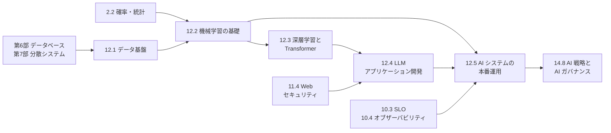

# 第12部 データとAI

> 経営の意思決定も、機械学習のモデルも、生成 AI の回答も、すべてデータの上に乗っています。この部では、業務データを分析と AI に使える形で届けるデータ基盤から、機械学習と深層学習の原理、Transformer と大規模言語モデル（LLM）、LLM を組み込んだアプリケーションの開発、そして AI システムを本番で運用し続ける技術までを、一続きに学びます。モデルの名前や製品は数か月で入れ替わりますが、ここで扱う原理——データの正しさ、汎化と評価、勾配による学習、注意機構、検索と評価と防御、監視とロールバック——は長く使えます。目標は、AI を使ったプロダクトと開発組織について、根拠を持って技術的な判断を下せるようになることです。

## この部で身につくこと

- **データ基盤を設計する**: OLTP と OLAP の違い、DWH・レイクハウス、ELT、分散処理（MapReduce・Spark）とシャッフル・スキュー、次元モデリングと SCD、冪等なパイプライン、データ品質とガバナンスを理解し、信頼できるデータを届ける仕組みを設計できる。
- **機械学習を正しく評価する**: 損失と勾配降下法でモデルが学ぶ仕組み、汎化とバイアス・バリアンス、交差検証、データリーク、不均衡データの評価指標、コストに基づくしきい値を理解し、「良すぎる結果」を見抜ける。
- **深層学習と LLM の原理を説明する**: 逆伝播（自動微分）、学習を安定させる技法、注意機構と Transformer、トークナイザ、スケーリング則、事前学習から事後学習までを説明し、学習の計算量と推論のメモリを見積もれる。
- **LLM アプリケーションを作る**: プロンプトとコンテキストの設計、RAG の検索と評価、ツールとエージェントのループ、評価データと統計的な比較、プロンプトインジェクションへの多層防御、コストの見積もりを実装と設計の両面で扱える。
- **AI システムを運用する**: 実験管理・モデルレジストリ・安全なデプロイ・ドリフトの監視・フィードバックループ、LLMOps（版管理・評価パイプライン・トレース・AI ゲートウェイ）、推論基盤の容量計画、責任ある運用とコストの統制を設計できる。
- **AI について経営判断を支える**: 「ML を使うべきか」「API か自社運用か」「どの自律性まで任せるか」「データを使ってよいか」を、リスクとコストを含めて説明できる。

## 章の一覧

| 章 | タイトル | 学習時間 | 主な演習 | キーワード |
|---|---|---|---|---|
| 12.1 | [データ基盤とデータエンジニアリング](01-data-engineering/README.md) | 本文 4h ＋ 演習 5h | `mapreduce.py`（パーティショナ・Combiner・シャッフル・Reduce 側結合）・`scd_etl.py`（sqlite3 からスタースキーマへの増分・冪等な ETL と SCD Type 2）・`dq_checks.py`（データ品質のチェックとレポート）、記述: データ基盤の設計レビュー | OLTP/OLAP, レイクハウス, ELT, CDC, MapReduce, Spark, スキュー, スタースキーマ, SCD, Parquet, 冪等性, データ契約, データメッシュ |
| 12.2 | [機械学習の基礎](02-machine-learning/README.md) | 本文 4h ＋ 演習 6h | `ml_scratch.py`（線形回帰・ロジスティック回帰・評価指標・k-means++・決定木と交差検証をライブラリなしで）、記述: ML プロジェクト計画のレビュー | 勾配降下法, 正則化, 汎化, 交差検証, データリーク, 適合率と再現率, ROC-AUC, PR-AUC, キャリブレーション, 勾配ブースティング, 公平性 |
| 12.3 | [深層学習とTransformer](03-deep-learning/README.md) | 本文 5h ＋ 演習 7h | `autodiff.py`（逆伝播型の自動微分エンジン）・`tiny_nn.py`（その上の MLP と Adam で XOR と同心円を学習）・`attention.py`（注意機構・multi-head・KV キャッシュ）・`bpe.py`（バイトレベル BPE）、記述: 自社運用の LLM の見積もり | 逆伝播, 自動微分, Adam, 残差接続, 注意機構, Transformer, BPE, スケーリング則, RLHF, KV キャッシュ, 量子化 |
| 12.4 | [LLMアプリケーション開発](04-llm-applications/README.md) | 本文 5h ＋ 演習 8h | `mini_rag.py`（日本語の RAG 検索器: チャンク化・TF-IDF・BM25・RRF・評価）・`agent_loop.py`（決定的なエージェントループ）・`eval_harness.py`（評価ハーネスとブートストラップ）・`injection_guard.py`（発展: 汚染追跡による防御）、記述: メール処理エージェントの脅威モデリング | プロンプト設計, RAG, 埋め込み, BM25, RRF, recall@k, エージェント, MCP, LLM-as-a-judge, プロンプトインジェクション, OWASP Top 10 for LLM |
| 12.5 | [AIシステムの本番運用（MLOps/LLMOps）](05-mlops-llmops/README.md) | 本文 4h ＋ 演習 6h | `drift.py`（PSI・KS 検定・カイ二乗検定によるドリフト検出）・`model_registry.py`（昇格の条件とロールバック）・`ai_gateway.py`（ルーティング・フォールバック・予算・キャッシュ）、記述: 劣化したモデルのポストモーテム | 技術的負債, 特徴量ストア, モデルレジストリ, カナリア, ドリフト, フィードバックループ, LLMOps, AI ゲートウェイ, continuous batching, モデルカード |

合計の目安は、本文 約 22 時間、演習 約 32 時間です。演習はすべて Python の標準ライブラリだけで、ネットワークにも API キーにも依存せずに動きます。`python3 tools/check.py 12` でまとめてテストできます（章を指定するなら `python3 tools/check.py 12.3` のように）。

## 学習の進め方

### 章の順序と依存関係

- **基本は 12.1 → 12.5 の順です**。12.2 のデータリークの議論は 12.1 の「時点の正しいデータ」（SCD Type 2）を、12.3 は 12.2 の勾配降下法と汎化を、12.4 は 12.3 のトークン・埋め込み・文脈の長さを、12.5 は 12.2 の評価と 12.4 の評価ハーネスを前提にしています。
- **他の部とのつながり**: 12.1 は第6部（データベース）と第7部（分散システム）の応用編です。12.2 と 12.4・12.5 の評価や A/B テストの話は [2.2 確率・統計と定量的思考](../02-math-and-algorithms/02-probability-statistics/README.md) の統計を使います。12.3 の推論のメモリの見積もりは [1.1 情報の表現](../01-computer-systems/01-data-representation/README.md) の浮動小数点数の形式に、12.4 のセキュリティは [11.4 Webアプリケーションセキュリティ](../11-security/04-web-security/README.md) に、12.5 の監視は [第10部 クラウドとSRE](../10-cloud-and-sre/README.md) につながります。
- **演習の依存**: 12.3 の `tiny_nn.py` は、同じ章の `autodiff.py` を使います。演習 1 を先に完成させてください。それ以外の演習は、章の中でも独立して取り組めます。
- **本文のコード例**: 多くのコード例は、その章の演習の解答（`solutions/`）で実行した出力を載せています。演習を解いた後に `exercises/` で同じコードを実行し、自分の実装で同じ結果になるかを確かめてください。

### つまずきやすい点

- **数式への不安**: 12.2 と 12.3 には微分と確率が出てきますが、本文はすべて具体的な数値の計算とコードで確かめられるように書いてあります。偏微分や連鎖律は、12.3 の 2 節の手計算の表を自分でたどり、演習 1 の自動微分で同じ数字が出ることを確かめるのが近道です。背景は [2.1 計算機科学のための離散数学](../02-math-and-algorithms/01-discrete-math/README.md) と 2.2 で補えます。
- **評価の考え方**: 「学習データでの成績は当てにならない」「良すぎる結果はまずリークを疑う」「平均だけでなく悪化した事例を見る」は、12.2・12.4・12.5 で形を変えて何度も出てきます。この部で最も大切な考え方なので、繰り返し出てきたら立ち止まって確認してください。
- **変化の速い分野**: LLM や製品の状況は変化が速いため、本文では時点が重要な記述に「2026 年時点」と明記しています。読む時点で一次情報を確かめる習慣を付けてください。一方で、原理（注意機構、評価、検索、防御の考え方、ドリフトの監視）は変わりません。
- **大きな演習の進め方**: 12.4 の `mini_rag.py` や 12.5 の `ai_gateway.py` は関数が多いので、docstring の小問（1a, 1b, …）の順に、テストを 1 つずつ通しながら進めると迷いません。`python3 -m unittest -v test_mini_rag` のように、演習のディレクトリでテストのファイルを指定して実行すると、失敗の詳細を見やすくなります。
- **経験者・CTO 準備トラックの進め方**: [学習ガイド](../00-guide/README.md) の優先度では、12.4 が必修、12.1 と 12.5 が推奨です。12.2 は少なくとも 3 節（汎化とデータリーク）と 4 節（評価指標としきい値）、12.3 は 7 節（コストの見積もり）と 8 節（LLM の限界）を読み、各章の「CTOの視点」に目を通してください。理解度チェックに答えられる章は、★★★ の演習だけ解いて先へ進んで構いません。

## 到達度チェック

この部を修了したと言えるのは、次のことができるときです。

- [ ] OLTP と OLAP、DWH・データレイク・レイクハウスの違いを説明し、スタースキーマと SCD Type 2 を使って分析用のテーブルを設計できる
- [ ] 分散処理が遅くなる原因（シャッフル・スキュー）を説明し、冪等で再実行できるパイプラインと、データ品質のテスト・データ契約・監視の仕組みを設計できる
- [ ] 勾配降下法でモデルが学習する仕組みを説明し、交差検証とデータリークの点検を含む正しい評価の手順を組める
- [ ] 目的に応じて評価指標（適合率・再現率・PR-AUC・キャリブレーション）を選び、誤りのコストからしきい値を決められる
- [ ] 逆伝播型の自動微分と、注意機構（softmax(QKᵀ/√d_k)V）を実装し、Transformer の構造を説明できる
- [ ] パラメータ数・トークン数・文脈の長さから、学習の計算量と推論に必要な GPU メモリを概算できる
- [ ] RAG の検索を実装して recall@k・MRR で評価し、エージェントのループに引数の検証・上限・人の確認を組み込める
- [ ] プロンプトインジェクションと情報流出の経路を説明し、モデルの外側の多層防御を設計できる
- [ ] ドリフトの監視（PSI・KS 検定・カイ二乗検定）、モデルレジストリの昇格の条件とロールバック、AI ゲートウェイの予算とフォールバックを設計できる
- [ ] AI の導入の提案に対して、データの準備状況・評価の方法・誤りのリスク・運用のコストを問い、判断を説明できる
- [ ] 第12部の演習のテストがすべて通る（`python3 tools/check.py 12`）

## この部の推薦図書・教材

- Martin Kleppmann『データ指向アプリケーションデザイン』（オライリー・ジャパン）— バッチ処理・ストリーム処理を含むデータシステムの原理。12.1 の土台として、第6・7部と合わせて読みたい。
- 有賀康顕・中山心太・西林孝『仕事ではじめる機械学習 第2版』（オライリー・ジャパン, 2021）— 問題設定・評価・運用という「モデルの外側」を日本の実務の視点で扱う。12.2 と 12.5 の橋渡しに。
- 斎藤康毅『ゼロから作るDeep Learning』（オライリー・ジャパン）— NumPy でニューラルネットワークと逆伝播を実装する定番の入門書。12.3 の演習の次の一歩として。
- Simon J. D. Prince "Understanding Deep Learning"（MIT Press, 2023。PDF が無料公開）— 初期化・残差接続・Transformer までを図と数式で丁寧に説明する現代的な教科書。
- Chip Huyen "Designing Machine Learning Systems"（O'Reilly, 2022）と "AI Engineering"（O'Reilly, 2025）— 前者は ML システムの設計と運用、後者は基盤モデルを使ったアプリケーション開発を体系的にまとめた 2 冊。12.4・12.5 の全体像をつかむために。
- D. Sculley ほか "Hidden Technical Debt in Machine Learning Systems"（NeurIPS 2015）— ML システムの運用上の問題を体系化した短い古典。AI に関わる意思決定をする人全員に。
- OWASP "Top 10 for Large Language Model Applications" — LLM アプリケーションのリスクの一覧。設計レビューのチェックリストとして（最新版を確認すること）。

## 次に進む

- [第13部 技術リーダーシップ](../13-technical-leadership/README.md) では、この部で学んだ技術判断を、設計レビューや技術選定、チームと組織の設計の中で実行する方法を学びます。データや ML のチームをどこに置くか（中央・埋め込み・データメッシュ）は [13.6 チームと組織の設計](../13-technical-leadership/06-team-and-org-design/README.md) の題材でもあります。
- [14.8 AI戦略とAIガバナンス](../14-cto/08-ai-strategy/README.md) では、この部の技術的な知識を土台に、AI への投資の判断、全社の AI 利用の方針、リスク管理と規制への対応を、CTO の立場から扱います。
- [第15部 総仕上げ](../15-capstone/README.md) の設計プロジェクトやケーススタディでは、データ基盤や AI 機能を含むシステムの設計と、その運用・コスト・リスクの説明に取り組みます。
