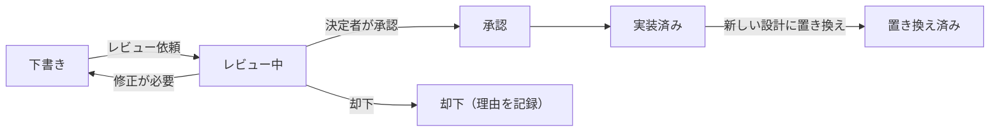

# 13.2 技術的意思決定と設計レビュー

> 技術リーダーの仕事の大部分は、「決めること」と「決め方を設計すること」です。何でも慎重に決める組織は遅くなり、何でも即決する組織は取り返しのつかない失敗をします。この章では、決定を可逆性で分類し、誰がどう決めるかを設計し、バイアスを抑え、デザインドックと設計レビューで良い決定を組織的に生み出す方法を学びます。

| 項目 | 内容 |
|---|---|
| 学習時間の目安 | 本文 4h ＋ 演習 4h |
| 前提となる章 | [13.1 テックリードとStaffエンジニア](../01-tech-lead-and-staff/README.md)、[8.6 開発プロセスとドキュメンテーション](../../08-software-engineering/06-process-and-documentation/README.md)（ADR） |
| 演習 | [exercises/](exercises/)（Python）＋ 記述演習 2 題 |
| キーワード | 一方通行のドア, Type 1/Type 2, 合意と同意, RACI/DACI, アドバイスプロセス, 認知バイアス, 意思決定マトリクス, 感度分析, Choose Boring Technology, デザインドック, RFC, プレモーテム, Disagree and commit |

## この章のゴール

- [ ] 決定を「可逆性」と「影響範囲」で分類し、決定の速さとプロセスの重さを使い分けられる
- [ ] 合意・同意・RACI/DACI・アドバイスプロセスなどの決定方式を、状況に応じて選べる
- [ ] 技術選定の評価軸を設計し、重み付き意思決定マトリクスと感度分析を実装して結果を正しく解釈できる
- [ ] デザインドック（RFC）を書き、レビューのプロセスを運営できる
- [ ] 設計レビューで的確な質問をし、アーキテクチャレビューボードの典型的な失敗を避けられる
- [ ] 期待値・情報の価値・プレモーテムを使って、不確実性の下で判断できる
- [ ] 決定を記録して伝え、反対意見があっても実行に移す（Disagree and commit）ことができる

## なぜ学ぶのか

- **決め方が遅さを生む**: Amazon の Jeff Bezos は 2015 年の株主への手紙で、決定には取り返しのつかない「一方通行のドア」（Type 1）と、やり直しのきく「二方向のドア」（Type 2）があると述べました。そして、組織が大きくなると、ほとんどの決定に Type 1 用の重いプロセスを使う傾向が生まれ、その結果として遅さ、思慮のないリスク回避、実験不足、発明の減少が起きると指摘しています。
- **正しい決定は文脈で変わる**: Segment は 2018 年のエンジニアリングブログ「Goodbye Microservices」で、外部サービスへのデータ送信処理を 100 を超えるマイクロサービスに分割した結果、運用負荷が膨らんで開発が停滞し、1 つのサービスに統合し直した経緯を公開しました。Amazon Prime Video のチームも 2023 年に、映像品質の監視サービスを分散構成から単一のプロセスに近い構成へ移し、インフラ費用を 90% 以上削減したと報告しています。どちらも「マイクロサービスが悪い」という話ではなく、**その時点の規模と制約に合わない決定は、あとから大きなコストになる** という教訓です。
- **決定は記録されないと繰り返される**: 「なぜこの設計なのか」が残っていない組織では、担当者が変わるたびに同じ議論が繰り返され、前提が変わったことにも気づけません。

技術的な知識だけでは良い決定はできません。決定の種類を見極め、適切な人が、適切な情報で、適切な速さで決め、その理由を残す——この仕組みを作ることが、Staff エンジニアから CTO までの技術リーダーの中心的な仕事です。

## 1. 決定を分類する — 可逆性と影響範囲

### 1.1 一方通行のドアと二方向のドア

Bezos の分類を、ソフトウェアの決定に当てはめてみましょう。

| 種類 | 性質 | ソフトウェアでの例 |
|---|---|---|
| 一方通行のドア（Type 1） | やり直しがきかない、またはやり直しに非常に大きなコストがかかる | 外部に公開した API の形式、データモデルと ID の型（[1.1 情報の表現](../../01-computer-systems/01-data-representation/README.md)）、主要なデータストアやクラウドの選択、コアのプログラミング言語、ソフトウェアのライセンス（OSS として公開するなど）、顧客との契約上の約束 |
| 二方向のドア（Type 2） | 間違えても、小さなコストで元に戻せる | モジュール内部のライブラリ、フィーチャーフラグで隠した新機能、社内ツールの選択、チーム内のコーディング規約 |

大切なのは、「重要そうに見えるか」ではなく **「間違えたときに戻すコスト」** で判断することです。例えば、フロントエンドのフレームワークの選択は大きな議論になりがちですが、画面単位で段階的に置き換えられる設計なら、実は Type 2 に近いこともあります。逆に、地味に見える「注文 ID を JSON の数値で返す」という決定は、外部の利用者がいる以上、ほぼ一方通行です。

### 1.2 決定の重さを使い分ける

可逆性に影響範囲を掛け合わせると、決定のプロセスの重さを決められます。

| | 影響が小さい（1 チーム内） | 影響が大きい（複数チーム・顧客・事業） |
|---|---|---|
| **可逆（二方向のドア）** | 担当者がその場で決める。事後の共有で十分 | 期限を決めて軽くレビューする。見直しの条件を決めて速く進める |
| **不可逆（一方通行のドア）** | ADR に理由を残す。1〜2 人がレビューする | デザインドックと設計レビュー。プレモーテム。必要なら経営判断 |

Bezos は 2016 年の株主への手紙で、「ほとんどの決定は、欲しい情報の 70% 程度がそろった段階で下すべきだ。90% を待っていたら、たいていの場合は遅すぎる」とも述べています。70% という数字そのものより、**情報を集めるコスト（遅れ）と、間違えたときのコストを比べる** という考え方が重要です。二方向のドアでは、間違いに素早く気づいて直す能力の方が、最初から正しく決める能力より価値があります。

### 1.3 不可逆を可逆に変える

設計によって、一方通行のドアを二方向のドアに近づけられることがあります。

- **フィーチャーフラグ**: 新しい処理を本番に出しても、フラグで即座に元に戻せる。
- **抽象化の層**: 外部サービスへの依存を自社のインターフェースの裏に隠し、差し替えられるようにする。
- **ストラングラーパターン**: 旧システムを一度に置き換えず、機能単位で新システムに移していく（[9.2 アーキテクチャスタイル](../../09-architecture/02-architecture-styles/README.md)）。
- **二重書き込みと段階的な切り替え**: データ移行で、新旧両方に書き込みながら読み込み先を少しずつ切り替える。
- **契約の出口条項**: ベンダーとの契約に、データのエクスポートや解約の条件を入れておく。

ただし、可逆性にはコストがかかります。すべての外部依存を抽象化すると、コードは複雑になり、各サービスの固有の機能も使えなくなります。**戻す可能性が現実的にあり、戻せないときの損失が大きいところにだけ投資する** のが原則です。

## 2. 誰がどう決めるか — 意思決定の方式

### 2.1 決定方式の比較

| 方式 | 決め方 | 長所 | 短所 | 向いている場面 |
|---|---|---|---|---|
| 独断 | 責任者が 1 人で決める | 速い | 情報が偏る。納得感が低い | 緊急時（障害対応の指揮など） |
| 相談の上の独断 | 意見を聞いた上で、責任者が決める | 速さと情報のバランスが良い | 意見が採用されない人の不満 | 多くの技術的な決定 |
| 多数決 | 投票で決める | 公平に見える | 少数派の重要な懸念が埋もれる。強さの違う意見を同じ 1 票に扱う | 影響の小さい好みの問題 |
| 合意（consensus） | 全員が賛成するまで議論する | 納得感が最も高い | 遅い。最も強く反対する人が拒否権を持つ | 小さなチームの価値観やルール |
| 同意（consent） | 重大な反対がなければ決まる | 合意より速く、懸念は拾える | 「重大な反対」の基準の共有が必要 | チームの運営方法、試行的な決定 |
| 委任 | 決定権を特定の人やチームに渡す | 現場に近い人が速く決められる | 委任の範囲が曖昧だと混乱する | 領域の責任者が明確なとき |

**合意と同意の違い** は重要です。合意は「全員が最善だと思う」ことを求め、同意は「全員が、許容できないほどの害はないと思う」ことを求めます。ソシオクラシーなどの組織運営の手法では、同意の基準として「試してみても安全か（safe enough to try）」という問いが使われます。二方向のドアの決定には、同意で十分なことがほとんどです。

### 2.2 役割を明確にする: RACI と DACI

決定が滞る最大の原因は、「誰が決めるのか」が曖昧なことです。役割を明示する枠組みとして、RACI と DACI がよく使われます。

| 枠組み | 役割 |
|---|---|
| RACI | **R**esponsible（実行する人）、**A**ccountable（最終責任者。1 人だけ）、**C**onsulted（事前に意見を聞く人）、**I**nformed（結果を知らされる人） |
| DACI | **D**river（決定のプロセスを推進する人）、**A**pprover（決定する人。1 人だけ）、**C**ontributors（意見や情報を提供する人）、**I**nformed（結果を知らされる人） |

DACI は Atlassian のチーム向けプレイブックなどで紹介されている形式で、「決定を推進する人」と「決める人」を分けているのが特徴です。例として、決済基盤の移行の決定を DACI で整理します。

| 役割 | 担当 |
|---|---|
| Driver | 決済チームの Staff エンジニア（デザインドックを書き、レビューを回し、期限までに決定を得る） |
| Approver | VP of Engineering（1 人だけ） |
| Contributors | 決済チームの TL、SRE、セキュリティ担当、経理、CS のリーダー |
| Informed | 全エンジニア、事業部長 |

**Approver は必ず 1 人** にします。2 人以上いると、どちらも決めずに時間が過ぎるか、2 人の意見が割れて止まります。

### 2.3 アドバイスプロセス

**アドバイスプロセス** は、米国の電力会社 AES で Dennis Bakke らが実践し、Frederic Laloux の『Reinventing Organizations』（2014、邦訳『ティール組織』英治出版）で広く知られるようになった方式です。

1. 誰でも決定を下してよい。
2. ただし、決定の前に、**その決定の影響を受ける人と、その分野の専門家に助言を求めなければならない**。
3. 助言に従う義務はないが、決定した人がその結果に責任を持つ。

上司の承認を待たずに現場で決められるため速く、助言を求める過程で情報も集まります。一方で、「誰に助言を求めるべきか」の感覚が組織に共有されていないと、重要な関係者が抜け落ちます。Staff エンジニアの横断的な提案や、チームをまたぐ小〜中規模の決定に向いています。

### 2.4 日本の稟議・根回しとの付き合い方

日本企業の **稟議** は、起案者が文書を回覧し、関係者が順に承認印を押していく決定方式です。事前の **根回し** と組み合わせると、関係者の納得感が高く、情報も共有されるという長所があります。一方で、承認者が多いほど遅くなり、「全員が承認した」ことで責任の所在がかえって曖昧になりがちです。

技術組織で稟議の文化と共存するには、次のような工夫が有効です。

- 稟議（重い承認）は **一方通行のドア** に限定し、二方向のドアは担当者の判断に委ねる。
- 稟議書にも「最終決定者は誰か」「いつまでに決めるか」を明記する。
- 根回しは「反対意見を潰す」ためではなく、「懸念を早く聞き、提案を良くする」ために行う（[13.1 テックリードとStaffエンジニア](../01-tech-lead-and-staff/README.md)）。

## 3. 意思決定を歪めるバイアス

人間の判断は、系統的に偏ります。代表的なものと、技術組織での現れ方、対策を整理します。

| バイアス | 内容 | 技術組織での現れ方 | 対策 |
|---|---|---|---|
| サンクコスト（埋没費用） | すでに払ったコストを惜しんで、損な選択を続ける | 「1 年かけて作った内製基盤だから」と、明らかに劣る状態でも使い続ける | 「今日ゼロから選ぶなら、どちらを選ぶか」を問う |
| アンカリング | 最初に示された数字や案に判断が引きずられる | 最初に出た見積もり「2 週間」が、根拠なく基準になる | 見積もりや評価は、議論の前に各自が独立に出す |
| 確証バイアス | 自分の仮説を支持する情報ばかり集める | 使いたい技術の成功事例だけを調べる | 「この案が失敗するとしたら、なぜか」を先に書く。反対の立場を担当する人を置く |
| 利用可能性ヒューリスティック | 思い出しやすい事例を過大評価する | 先月の障害の印象が強く、その対策ばかり優先する | 障害やリスクをデータで一覧にしてから優先順位をつける |
| HiPPO | 最も給料の高い人の意見（Highest Paid Person's Opinion）で決まる | CTO の一言で議論が終わる | 地位の高い人は最後に発言する。意見を事前に文書で集める |
| 自転車置き場の議論 | 重要で難しい議題より、誰でも意見を言える些細な議題に時間を使う | 設計レビューで、データの整合性ではなく変数名の議論が 30 分続く | 議題ごとに時間を区切る。些細な点は「nit」として非同期で扱う |
| 計画の誤謬 | 自分の計画にかかる時間とコストを楽観的に見積もる | 移行プロジェクトが毎回予定の 2 倍かかる | 過去の類似プロジェクトの実績（参照クラス）から見積もる（[8.6 開発プロセスとドキュメンテーション](../../08-software-engineering/06-process-and-documentation/README.md)） |

アンカリングと利用可能性ヒューリスティックは、Amos Tversky と Daniel Kahneman の論文「Judgment under Uncertainty: Heuristics and Biases」（Science, 1974）で体系的に示されました。自転車置き場の議論は、C. Northcote Parkinson が『パーキンソンの法則』（1957）で、原子炉の建設計画はすぐに承認する委員会が、自転車置き場の屋根の素材には延々と議論する様子を描いたことに由来し、「凡俗法則（law of triviality）」とも呼ばれます。HiPPO という言葉は、Web 解析の専門家 Avinash Kaushik が広めたとされています。

個人の注意力でバイアスを防ぐのは困難です。**仕組みで防ぐ** のが現実的です。評価軸を案を見る前に決める、各自の評価を議論の前に独立に集める、反対の立場を担当する人を決める、地位の高い人は最後に話す、といったルールを会議の進め方に組み込みます。

## 4. 技術選定のフレームワーク

### 4.1 評価軸

技術選定で確認すべき評価軸の例です。すべてを毎回使う必要はありませんが、抜け漏れのチェックリストとして使えます。

| 評価軸 | 確認すること |
|---|---|
| 要件適合 | 機能要件と非機能要件（性能・可用性・一貫性）を満たすか。満たせない要件はないか |
| 成熟度 | 本番での利用実績、バージョンの安定性、破壊的変更の頻度 |
| コミュニティとエコシステム | 開発の活発さ、メンテナの数、ライブラリ・ツールの充実度、情報の探しやすさ |
| 採用市場 | その技術の経験者を採用できるか。社内で育成できるか（日本語の情報の多さも影響する） |
| 運用性 | 監視・バックアップ・アップグレード・障害時の調査のしやすさ。誰が夜中に対応するか |
| セキュリティ | 脆弱性への対応の速さ、サプライチェーンのリスク、認証・暗号化の機能 |
| ライセンス | 商用利用・改変・再配布の条件。将来のライセンス変更のリスク |
| ロックイン | 特定のベンダーや製品への依存度。独自機能をどれだけ使うか |
| 撤退コスト | やめるときに必要なデータ移行・書き換え・再教育のコスト |

ライセンスは見落とされやすい評価軸です。例えば 2023 年には HashiCorp が Terraform などのライセンスを MPL 2.0 から Business Source License に変更し、コミュニティによるフォーク（OpenTofu）が生まれました。2024 年には Redis もライセンスを変更し、フォーク（Valkey）が生まれています。OSS であっても、将来も同じ条件で使えるとは限りません。ライセンスの具体的な解釈は法務の専門家に確認し、契約とガバナンスの論点は [14.5 ガバナンス・リスク・コンプライアンスと法務](../../14-cto/05-governance-risk-compliance/README.md) を参照してください。

### 4.2 退屈な技術を選べ

Dan McKinley は 2015 年の講演と文章「Choose Boring Technology」で、技術選定について広く引用される考え方を示しました。要点は次の通りです。

- **イノベーショントークン**: どの会社も、新しい技術に挑戦できる「トークン」をおよそ 3 枚しか持っていない。トークンは、自社の競争力の源泉になる部分に使うべきで、それ以外は「退屈な」技術を選ぶ。
- **退屈とは、故障の仕方がよく知られていること**: 長く使われてきた技術は、どんな壊れ方をするか、どう直すかが分かっている。新しい技術には「未知の未知」がある。
- **技術の追加には運用コストがかかる**: 新しいデータベースを 1 つ増やすと、監視・バックアップ・障害対応・採用・教育のすべてが増える。個々のチームにとって最適な選択の総和が、組織にとって最適とは限らない。

「退屈な技術を選べ」は「新しい技術を使うな」という意味ではありません。**新しい技術を使う理由を、事業上の優位性と結びつけて説明できるときにだけ使え** という意味です。

### 4.3 重み付き意思決定マトリクス

複数の案を複数の評価軸で比べるとき、**重み付き意思決定マトリクス** がよく使われます。手順は次の通りです。

1. **必須条件で足切りする**: 満たさなければ採用できない条件（例: データを国内に保存できる、既存の認証基盤と連携できる）で、先に候補を絞る。
2. **評価軸と重みを、案を見る前に決める**: 案を見てから重みを決めると、推したい案が勝つように重みを調整してしまう。
3. **各案を評価軸ごとに評価する**: できるだけ測定値（費用、学習期間など）を使い、主観的な評価は複数人が独立に行う。
4. **正規化して重み付きの合計を計算する**。
5. **感度分析をする**: 重みや評価を少し変えたときに、結論が変わるかを確かめる。

例として、注文確定後の非同期処理（メール送信、在庫引当、ポイント付与）のためのジョブキューを選ぶ場面を考えます。候補は、既存の PostgreSQL をキューとして使う案、クラウドのマネージドキューサービスを使う案、Kafka を自前で運用する案の 3 つです（評価値は説明のための仮の値です）。この章の演習で実装する関数を使って計算してみます。

```python
from decision_matrix import normalize, weighted_scores, ranking, weight_flip_points, rank_stability

alternatives = ["PostgreSQL キュー", "マネージドキュー", "Kafka 自前運用"]
criteria   = ["要件適合", "運用負荷", "習熟期間", "月額費用", "撤退コスト"]
directions = ["benefit", "cost", "cost", "cost", "cost"]
weights    = [0.35, 0.25, 0.15, 0.15, 0.10]
scores = [
    # 要件適合(1-5) 運用負荷(人時/月) 習熟期間(週) 月額費用(万円) 撤退コスト(人週)
    [3,             4,               0.5,         3,             2],
    [4,             2,               2,           5,             4],
    [5,             30,              8,           25,            10],
]
for method in ("minmax", "ratio"):
    n = normalize(scores, directions, method)
    s = weighted_scores(n, weights)
    print(f"[{method}]", "  ".join(f"{alternatives[i]} {s[i]:.3f}" for i in ranking(s)))
    for k, fp in enumerate(weight_flip_points(n, weights)):
        if fp is None:
            print(f"  {criteria[k]}: 0〜1 の範囲では 1 位は入れ替わらない")
        else:
            t, b = fp
            print(f"  {criteria[k]}: 重み {weights[k]:.2f} → {t:.3f} で {alternatives[b]} と同点")
    freq = rank_stability(n, weights, spread=0.3, trials=5000, seed=1)
    print("  1 位になる割合（重みを ±30% 揺らす）:", ", ".join(f"{a} {f:.1%}" for a, f in zip(alternatives, freq)))
```

```text
[minmax] マネージドキュー 0.756  PostgreSQL キュー 0.632  Kafka 自前運用 0.350
  要件適合: 重み 0.35 → 0.135 で PostgreSQL キュー と同点
  運用負荷: 0〜1 の範囲では 1 位は入れ替わらない
  習熟期間: 重み 0.15 → 0.476 で PostgreSQL キュー と同点
  月額費用: 重み 0.15 → 0.641 で PostgreSQL キュー と同点
  撤退コスト: 重み 0.10 → 0.399 で PostgreSQL キュー と同点
  1 位になる割合（重みを ±30% 揺らす）: PostgreSQL キュー 0.0%, マネージドキュー 100.0%, Kafka 自前運用 0.0%
[ratio] PostgreSQL キュー 0.735  マネージドキュー 0.708  Kafka 自前運用 0.414
  要件適合: 重み 0.35 → 0.429 で マネージドキュー と同点
  運用負荷: 重み 0.25 → 0.289 で マネージドキュー と同点
  習熟期間: 重み 0.15 → 0.118 で マネージドキュー と同点
  月額費用: 重み 0.15 → 0.087 で マネージドキュー と同点
  撤退コスト: 重み 0.10 → 0.048 で マネージドキュー と同点
  1 位になる割合（重みを ±30% 揺らす）: PostgreSQL キュー 77.7%, マネージドキュー 22.3%, Kafka 自前運用 0.0%
```

（演習の解答例 `solutions/decision_matrix.py` を使った実行結果です。）

この結果から、重要なことが 3 つ読み取れます。

1. **正規化の方法だけで 1 位が入れ替わる**。min-max 正規化は「最良を 1、最悪を 0」にそろえるので、極端に悪い案（Kafka の運用負荷 30 人時）があると、上位 2 案の差が小さく見えます。比率による正規化は「最良の何倍か」を見るので、上位 2 案の差（習熟期間 0.5 週と 2 週）が大きく効きます。どちらが正しいということはなく、**評価値の意味（差が重要か、比が重要か）に合わせて選ぶ** 必要があります。
2. **min-max では結論が頑健で、比率では僅差**。min-max では要件適合の重みを 0.35 から 0.135 まで大きく下げないと 1 位が変わらず、重みを ±30% 揺らしても 100% マネージドキューが勝ちます。比率では、どの軸の重みを少し動かしても入れ替わり、揺らすと 2 割強の確率で 1 位が変わります。
3. **僅差なら、数字ではなく論点を議論する**。この例では「既存の PostgreSQL にキューの負荷を載せてよいか」「マネージドサービスの運用をチームが担えるか」という質的な論点が本当の争点です。マトリクスの役割は結論を出すことではなく、**議論すべき論点をあぶり出すこと** です。

重み付きマトリクスには、ほかにも典型的な落とし穴があります。

- **偽の精密さ**: 「0.632 対 0.756」という数字は、仮の評価値と主観的な重みから作られたもので、小数第 3 位に意味はありません。
- **補償型の評価の罠**: 加重和は、ある軸の致命的な欠点を、他の軸の長所で埋め合わせてしまいます。致命的な欠点は、手順 1 の必須条件として先に足切りします。
- **相関する評価軸の二重計上**: 「運用負荷」と「運用に必要な人員」のように同じことを測る軸を並べると、その観点に実質的に 2 倍の重みがかかります。
- **後付けの重み**: 結論を決めてから重みを調整すれば、どの案でも 1 位にできます。重みを先に決めて記録しておくことが、唯一の防御です。

### 4.4 スパイクと PoC

評価値に自信がない軸があるときは、**スパイク**（短期間の技術調査）や **PoC**（Proof of Concept、概念実証）で不確実性を減らします。

- **問いを先に決める**: 「秒間 2,000 件のジョブを、再試行込みで p99 1 秒以内に処理できるか」のように、PoC で答えたい問いと合格基準を事前に書く。
- **期間を区切る**: 1〜2 週間など。期限が来たら、結論が出ていなくても判断材料をまとめる。
- **コードは捨てる前提で書く**: PoC のコードがそのまま本番に入ると、テストも運用設計もない状態で本番を迎えます。
- **PoC の価値を見積もる**: PoC は、不確実性が高く、間違えたときの損失が大きいときに価値があります（[7.1 期待値と情報の価値](#71-期待値と情報の価値)）。

### 4.5 撤退の基準を決めておく

新しい技術を採用するときは、**撤退の基準（キルクライテリア）** も同時に決めます。「3 か月後の時点で、p99 レイテンシが 200 ms を超えている、または運用工数が月 20 人時を超えているなら、代替案 B に切り替える」のように書いておくと、サンクコストのバイアスに抵抗できます。撤退の判断を下すのは、採用を決めた人と同じ人にすると、それまでの判断を否定しにくいため、撤退の判断者を別に決めておくのも有効です。

## 5. デザインドックと RFC

### 5.1 なぜ書くのか

**デザインドック**（設計文書）は、実装の前に「何を、なぜ、どう作るか」を書く文書です。オープンソースのプロジェクトでは、同様の目的の文書が **RFC**（Request for Comments）と呼ばれることが多く、Rust の RFC、Python の PEP、Kubernetes の KEP などが知られています。

書く目的は 4 つあります。

1. **考えるため**: 書いてみると、曖昧な点や見落としに気づく。書けないなら、まだ設計ができていない。
2. **非同期にレビューするため**: 会議を開かなくても、多くの人が自分のペースで意見を出せる。タイムゾーンをまたぐチームでは特に重要。
3. **記録するため**: 半年後に「なぜこの設計なのか」を知りたい人が読める。
4. **組織をスケールさせるため**: 決定の理由が共有されると、他の人が同じ判断基準で決められるようになる。

当時 Google のエンジニアだった Malte Ubl は「Design Docs at Google」（2020）で、デザインドックの価値は、実装の前の早い段階で設計の問題を見つけ、組織の中で合意と知識を形成することにある、という趣旨を述べています。同時に、**すべての変更にデザインドックが必要なわけではない** ことも強調されています。

### 5.2 デザインドックのテンプレート

```markdown
# タイトル（例: 注文 API の冪等化）

- 著者 / レビュアー / 決定者（Approver）:
- ステータス: 下書き / レビュー中 / 承認 / 却下 / 実装済み / 置き換え済み
- レビュー期限: YYYY-MM-DD

## 背景
なぜ今この問題を解く必要があるか。現状の数字（障害件数、コスト、ユーザーへの影響）

## 目標と非目標
- 目標: 観察可能な形で（「二重課金の問い合わせを月 0 件にする」）
- 非目標: 今回はやらないこと（範囲の明確化）

## 提案
設計の概要。図、データモデル、API、主要な処理の流れ

## 検討した代替案
各案の概要と、採用しなかった理由（「何もしない」案も含める）

## トレードオフとリスク
この設計で失うもの、残るリスク、前提が崩れたときの影響

## セキュリティ・プライバシー
扱うデータ、権限、脅威と対策

## 運用
監視、アラート、SLO、障害時の対応、誰が運用するか

## 移行とロールバック
段階的な導入の手順、切り戻しの方法と判断基準

## 未解決の問い
レビューで意見が欲しい点

## 決定の記録
いつ、誰が、何を決めたか（ADR へのリンク）
```

最も重要なのは **「検討した代替案」** の節です。代替案が書かれていない設計文書は、「なぜこの案なのか」に答えられず、レビューでも同じ代替案が何度も提案されます。

### 5.3 ライフサイクル



却下された文書も削除せず、理由とともに残します。「なぜその案を採らなかったか」は、将来同じ提案が出たときの貴重な記録です。

### 5.4 いつデザインドックを書くか

目安として、次のいずれかに当てはまるなら書く価値があります。

- 実装に 2 週間（または 2 人週）以上かかる
- 複数のチームに影響する、または他チームの協力が必要
- 一方通行のドアを含む（公開 API、データモデル、新しいデータストアなど）
- セキュリティ・プライバシー・法令に関わる

逆に、1 日で終わる変更や、元に戻しやすい変更にデザインドックを求めると、プロセスが重くなって開発が遅れます。小さな決定は ADR（アーキテクチャ決定記録）で十分です。ADR の書き方は [8.6 開発プロセスとドキュメンテーション](../../08-software-engineering/06-process-and-documentation/README.md) で扱います。Michael Nygard が 2011 年に提案した ADR は、「タイトル・状況・決定・ステータス・結果」の短い形式で、1 つの決定を 1 ページ程度で記録します。

### 5.5 レビューの作法

- **コメントの種類を明示する**: 冒頭に `[質問]`・`[提案]`・`[懸念]`・`[必須]`・`[nit]`（些細な指摘）などを付けると、書き手はどれに対応すべきかを判断しやすい。
- **問題設定から見る**: 解決策の細部より先に、「解くべき問題は正しいか」「目標は妥当か」を確認する。問題設定が間違っていれば、細部のレビューは無駄になる。
- **期限を決める**: 「5 営業日以内にコメント、その後 30 分の同期レビューで決定」のように、レビューの期限と決定の場を決めておく。
- **書き手はすべてのコメントに応答する**: 採用・不採用・保留のいずれかと理由を返す。無視されたと感じたレビュアーは、次からレビューしなくなる。
- **人ではなく文書をレビューする**: 「あなたの設計は」ではなく「この設計は」と書く。

## 6. 設計レビューを運営する

### 6.1 誰が、いつレビューするか

設計レビューは、**早い段階（問題設定と方針）** と **詳細設計の段階** の 2 回に分けると効果的です。実装がほぼ終わってからのレビューは、指摘されても直せないので、儀式になりがちです。

参加者は、書き手、決定者、その領域の専門家に加えて、**運用する人（SRE やオンコール担当）** と、必要に応じて **セキュリティ担当** を含めます。設計の問題の多くは、運用とセキュリティの観点から見つかるからです。

### 6.2 設計レビューで投げかける質問

| 観点 | 質問の例 |
|---|---|
| 問題 | 何を解くのか。解かないと何が起きるか。成功をどう測るか |
| 代替案 | 最も単純な案は何か。何もしない案と比べてどうか。なぜ代替案を退けたか |
| 故障 | 依存先が落ちたらどうなるか。同じリクエストが 2 回届いたらどうなるか。負荷が 10 倍になったらどこが最初に壊れるか |
| データ | 移行と切り戻しの手順は。整合性はどう保つか。個人情報を扱うか。保持期間は |
| 運用 | 誰が夜中に呼ばれるか。どの指標でアラートを出すか。Runbook はあるか（[10.5 インシデント対応とポストモーテム](../../10-cloud-and-sre/05-incident-management/README.md)） |
| セキュリティ | 認証と認可は。秘密情報をどこに置くか。攻撃者ならどこを狙うか（[11.1 セキュリティの基本原則と脅威モデリング](../../11-security/01-security-principles/README.md)） |
| コスト | 初期費用、継続費用、運用にかかる人の工数は。利用が 10 倍になったら費用はどうなるか |
| 可逆性 | やめたくなったら何が必要か。何が起きたら見直すか |
| 組織 | 誰が保守するか。そのスキルはチームにあるか。他のチームの計画に影響するか |

レビュアーの役割は、正解を言い当てることではなく、**書き手が考えていなかった観点を持ち込むこと** です。「なぜ？」を繰り返して詰問するのではなく、「この場合はどうなりますか」と具体的な状況を示して問うのが効果的です。

### 6.3 アーキテクチャレビューボードのアンチパターン

組織が大きくなると、全社の設計を審査する **アーキテクチャレビューボード（ARB）** を作ることがあります。うまく機能すれば一貫性と品質を保てますが、次のような失敗に陥りやすい仕組みです。

| アンチパターン | 症状 | 代わりにできること |
|---|---|---|
| 象牙の塔 | 現場を知らないメンバーが、理想論で差し戻す | 現場の Staff エンジニアをローテーションでメンバーにする |
| 門番（ボトルネック） | 月 1 回の審査を待つために、開発が数週間止まる | 審査を「助言」に変え、決定権はチームに残す。オフィスアワーで随時相談を受ける |
| 形だけの承認 | 資料は通るが、誰も中身を読んでいない | 審査の対象を一方通行のドアに絞り、そのぶん深く読む |
| 手遅れのレビュー | 実装がほぼ終わってから審査する | 問題設定の段階でレビューする |
| 委員会による設計 | 全員の意見を取り入れて、一貫性のない設計になる | 決定者を 1 人に決め、意見は助言として扱う |

多くの組織では、ARB を「承認機関」ではなく「助言機関」にし、推奨する技術とパターンを **舗装された道（paved road）** として整備する方向に進んでいます。推奨の道を使う限り審査は不要で、外れるときだけ理由を ADR に残す、という形にすると、統制と速さを両立しやすくなります。推奨技術の状態は、ThoughtWorks の Technology Radar のように「採用（Adopt）・試行（Trial）・評価（Assess）・保留（Hold）」の段階で公開すると分かりやすくなります。

## 7. 不確実性の下で決める

### 7.1 期待値と情報の価値

不確実な決定では、結果ごとの損益に確率を掛けた **期待値** で比べるのが基本です。例として、新しいデータストア X を採用するか、その前に PoC をするかを考えます（数値は説明のための仮の値です）。

```python
# 新しいデータストア X を採用するか。PoC（事前検証）に価値はあるか（金額の単位: 万円）
p_ok = 0.7            # X が本番の要件を満たす確率（チームの見立て）
gain = 3000           # 満たした場合の便益（3 年間の工数削減などの現在価値）
loss = -2000          # 満たさなかった場合の損失（切り戻しと作り直し）
poc_cost = 200        # PoC の費用（2 人 × 4 週間）
poc_detect = 0.9      # X が要件を満たさないとき、PoC でそれを見抜ける確率
delay_cost = 100      # PoC で本番導入が 1 か月遅れることの機会損失

ev_now = p_ok * gain + (1 - p_ok) * loss
# PoC で「ダメ」と分かれば採用しない（損益 0）。見抜けなければ採用して損失を被る
ev_poc = -poc_cost - delay_cost + p_ok * gain + (1 - p_ok) * (1 - poc_detect) * loss
print(f"すぐ採用する     : 期待値 {ev_now:6.0f} 万円")
print(f"PoC の後で決める : 期待値 {ev_poc:6.0f} 万円")
# PoC の価値 = 失敗を見抜いて避けられる損失の期待値
print(f"PoC で避けられる損失の期待値: {(1 - p_ok) * poc_detect * -loss:.0f} 万円")
for p in (0.5, 0.7, 0.9, 0.95):
    now = p * gain + (1 - p) * loss
    poc = -poc_cost - delay_cost + p * gain + (1 - p) * (1 - poc_detect) * loss
    print(f"p_ok={p:.2f}: すぐ採用 {now:6.0f} / PoC {poc:6.0f} → {'PoC' if poc > now else 'すぐ採用'}")
```

```text
すぐ採用する     : 期待値   1500 万円
PoC の後で決める : 期待値   1740 万円
PoC で避けられる損失の期待値: 540 万円
p_ok=0.50: すぐ採用    500 / PoC   1100 → PoC
p_ok=0.70: すぐ採用   1500 / PoC   1740 → PoC
p_ok=0.90: すぐ採用   2500 / PoC   2380 → すぐ採用
p_ok=0.95: すぐ採用   2750 / PoC   2540 → すぐ採用
```

PoC に価値があるのは、「PoC で避けられる損失の期待値」（1 − p）× 0.9 × 2,000 が、PoC の総コスト 300 を上回るとき、つまり成功の確率 p が約 0.83 より低いときです。**自信があるなら PoC は時間の無駄で、自信がないなら PoC は安い保険** です。この計算の価値は、正確な数字を出すことより、「チームは成功の確率をどう見積もっているのか」「失敗したときの損失はどれくらいか」という本当の論点を表に出すことにあります。確率と期待値の基礎は [2.2 確率・統計と定量的思考](../../02-math-and-algorithms/02-probability-statistics/README.md) で扱います。

### 7.2 リアルオプションの考え方

金融のオプション（将来、ある条件で取引する「権利」）の考え方を、事業や技術の判断に応用したものを **リアルオプション** と呼びます。技術の判断では、次のように使えます。

- **待つオプション**: 今決めなくてよい決定は、情報が増えるまで保留する価値がある（ただし、待つことのコストも数える）。
- **段階的に投資するオプション**: 大きな移行を一度に決めず、最初の段階の結果を見てから次の段階に進むかを決める。
- **撤退のオプション**: 抽象化の層や契約の出口条項は、将来の撤退を安くする「オプションの購入」にあたる。オプションには価格（複雑さ、費用）があるので、撤退の可能性が高いところにだけ買う。

「できるだけ決定を遅らせる」は、アジャイル開発で「最終責任時点（last responsible moment）」と呼ばれる考え方とも通じます。ただし、決定を遅らせることが目的化すると、何も決まらない組織になります。**遅らせる理由（どの情報を待っているのか）を言える決定だけを遅らせる** ことが大切です。

### 7.3 プレモーテム

**プレモーテム（pre-mortem）** は、心理学者 Gary Klein が Harvard Business Review の記事「Performing a Project Premortem」（2007）で紹介した手法です。プロジェクトの開始時に、「プロジェクトは大失敗に終わった」と仮定し、その理由を全員に考えてもらいます。Klein は、出来事がすでに起きたと想像する「将来の後知恵（prospective hindsight）」によって、結果の理由を正しく挙げる能力が約 30% 高まったとする 1989 年の研究（Mitchell, Russo, Pennington）を紹介しています。

進め方の例（60〜90 分）です。

1. **計画を共有する**（10 分）: 目標、スコープ、スケジュール、主要な前提。
2. **失敗を宣言する**: 「1 年後、このプロジェクトは大失敗に終わりました。何が起きたのでしょうか」。
3. **独立に書き出す**（5〜10 分）: 各自が黙って失敗の理由を書く。議論はしない（アンカリングを防ぐ）。
4. **順番に 1 つずつ読み上げる**: 全員の理由がなくなるまで繰り返し、すべて記録する。リーダーは最後に話す。
5. **評価する**: 発生可能性と影響で分類し、上位を選ぶ。
6. **対策とトリップワイヤーを決める**: 上位のリスクについて、予防策と「この兆候が出たら計画を見直す」という早期警戒の条件を決める。
7. **計画に反映し、定期的に見直す**。

プレモーテムの利点は、**悲観的な意見を言うことが、場の目的そのものになる** ことです。普段は「水を差す」と思われて言いにくい懸念も、この場では歓迎されます。心理的安全性の低いチームほど、効果が大きい手法です（[13.3 エンジニアリングマネジメントの基礎](../03-engineering-management/README.md)）。

## 8. 決定を伝え、記録し、コミットする

### 8.1 Disagree and commit

Amazon のリーダーシッププリンシプルには「Have Backbone; Disagree and Commit」という項目があり、リーダーは同意できない決定には敬意をもって異議を唱える義務があり、いったん決まったら全面的にコミットする、という趣旨が書かれています。Bezos は 2016 年の株主への手紙でも、この考え方を自分自身の行動の例とともに紹介しています。

Disagree and commit を正しく運用するためのポイントです。

- **異議は決定の前に、公式の場で出す**。決まったあとに廊下で反対するのは、コミットではなく妨害です。
- **コミットとは、うまくいくように誠実に行動すること**。「だから言ったのに」という結果を待つような行動は、コミットではありません。
- **決定者は異議を記録する**。反対意見と、その理由を決定の記録に残します。将来見直すときに、どの前提が崩れたのかが分かります。
- **見直しは新しい情報があるときに行う**。トリップワイヤー（「p99 が 200 ms を超えたら再検討」など）を決めておけば、「気が変わった」ではなく「条件を満たした」ので見直す、という形にできます。

### 8.2 決定の伝え方

決定は、決めた瞬間ではなく、**影響を受ける人が理解した瞬間に** 効果を持ちます。決定を伝える文書の例です。

```markdown
# 決定: 注文後の非同期処理のジョブキューとしてマネージドキューを採用する

- 決定日 / 決定者: 2026-10-05 / VP of Engineering（Approver）
- 経緯: デザインドック「注文後の非同期処理の基盤」（リンク）、ADR-0042

## 決定の内容
新規の非同期処理は、クラウドのマネージドキューを使う。既存の PostgreSQL キューは
2027 年 3 月までに移行する。

## 理由
- 運用負荷が最も小さく、SRE の増員なしで運用できる
- 既存の PostgreSQL の負荷を増やさない（ピーク時の CPU 使用率は現在 70%）

## 検討した代替案と、採用しなかった理由
- PostgreSQL キュー: 追加費用は最小だが、DB の負荷とロック競合のリスクがある
- Kafka 自前運用: 要件以上の機能で、運用負荷と学習コストが大きい

## 反対意見
- 決済チーム TL: 「ベンダーロックインが強まる」→ キューへのアクセスを社内ライブラリに
  閉じ込め、移行コストを抑える方針で対応

## 影響と次の行動
- 各チームは新規開発で社内ライブラリ経由でキューを使う（利用ガイド: リンク）

## 見直しの条件
- 月額費用が 50 万円を超えた場合、またはメッセージの順序保証が必要な要件が出た場合

## 質問の窓口
- #platform-queue チャンネル
```

### 8.3 決定の記録と技術ロードマップ

決定の記録（デザインドックと ADR）は、組織の記憶です。記録が蓄積されると、次のような価値が生まれます。

- 新しいメンバーが「なぜこうなっているのか」を自分で調べられる。
- 前提が変わったときに、どの決定を見直すべきかが分かる。
- 技術デューデリジェンスや監査で、意思決定の過程を説明できる（[14.7 技術デューデリジェンスとM&A](../../14-cto/07-due-diligence-and-ma/README.md)）。

個々の決定を束ねると、**技術ロードマップ**（どの技術をいつ導入・移行・廃止するか）になります。技術には「導入 → 標準 → 非推奨 → 廃止」というライフサイクルがあり、廃止の計画がない組織では、古い技術が積み重なって運用負荷が増え続けます。会社全体の技術戦略とロードマップの立て方は [14.2 技術戦略の立て方](../../14-cto/02-technology-strategy/README.md) で扱います。

## よくある落とし穴

1. **すべての決定に同じ重さのプロセスを使う**。二方向のドアにまで設計レビューと承認を求めると、開発が止まり、人は決定を避けるようになります。可逆性と影響範囲でプロセスの重さを変えます。
2. **決定者が曖昧なまま議論を始める**。全員が意見を言い、誰も決めず、同じ議論が次の会議に持ち越されます。議論の前に決定者（1 人）と期限を決めます。
3. **合意を目指して、最も強く反対する人に拒否権を与える**。全員の賛成を求めると、決定は最も慎重な人の速度でしか進みません。二方向のドアでは「重大な反対がないか」（同意）で十分です。
4. **意思決定マトリクスの数字を結論として扱う**。正規化の方法や重みの小さな変更で結論が変わることがあります。感度分析をし、僅差なら数字ではなく論点を議論します。
5. **案を見てから評価軸と重みを決める**。推したい案が勝つように無意識に調整してしまいます。評価軸と重みは先に決めて記録します。
6. **代替案を書かないデザインドック**。「なぜこの案なのか」に答えられず、レビューで同じ代替案が何度も出ます。「何もしない」案を含めて、退けた理由を書きます。
7. **実装が終わってから設計レビューをする**。指摘されても直せないので、レビューは儀式になります。問題設定の段階でレビューします。
8. **地位の高い人が最初に意見を言う**。HiPPO とアンカリングで、他の人の意見が出なくなります。意見を事前に文書で集め、地位の高い人は最後に話します。
9. **決まったことを蒸し返し続ける、または決まったあとに協力しない**。異議は決定の前に出し、決まったらコミットし、見直しは事前に決めた条件（トリップワイヤー）を満たしたときに行います。

## CTOの視点

1. **決定の「重さ」を組織として設計する**。どの決定にデザインドックと設計レビューが必要で、どの決定はチームに任せるのかを、可逆性と影響範囲の基準で明文化します。「デザインドックを提出してから決定まで何日かかっているか」を測ると、プロセスが重すぎないかが分かります。決定の遅さは、開発の遅さとして表に出にくいコストです。
2. **一方通行のドアを見分ける質問をする**。設計レビューでは「この決定を 1 年後に覆すと、いくらかかるか」「何が起きたら見直すか」「外部の利用者や契約に約束してしまうものはどれか」を問います。一方通行のドアには時間をかけ、二方向のドアは「速く決めて、速く直す」ことをチームに奨励します。
3. **イノベーショントークンの予算を管理する**。組織全体で「新しい技術」をいくつ抱えているかを把握し、新規採用には、事業上の理由、責任者、撤退の基準を求めます。Technology Radar のような形で推奨技術を公開すると、チームごとのばらばらな選定を減らせます。技術を 1 つ増やすたびに、採用・教育・運用・セキュリティ対応のコストが組織に積み上がることを忘れないでください。
4. **自分が HiPPO であることを自覚する**。CTO が会議の冒頭で意見を言えば、議論はそこで終わります。設計レビューでは最後に話す、意見を事前に文書で集める、「私の意見は 1 つの入力にすぎない」と明言する、といった振る舞いが、組織の判断の質を上げます。
5. **ライセンスとベンダーのリスクを調達の段階で確認する**。OSS のライセンス変更や、ベンダーの価格改定・サービス終了は、実際に起きています。重要な依存先には、撤退コストの見積もりと、契約上の出口（データのエクスポート、解約条件）を用意します。
6. **決定の記録を、組織の資産として監査可能にする**。ADR とデザインドックが蓄積されていれば、新しいリーダーの立ち上がりが速くなり、資金調達や M&A の技術デューデリジェンスでも意思決定の過程を説明できます。

## 演習

演習コードは [exercises/decision_matrix.py](exercises/decision_matrix.py) にあります。関数の docstring に仕様が書いてあるので、`raise NotImplementedError(...)` を実装に置き換えてください。解答例は [solutions/decision_matrix.py](solutions/decision_matrix.py) にありますが、まずは自力で取り組みましょう。

```bash
python3 tools/check.py 13.2        # リポジトリのルートで実行
python3 tools/check.py -v 13.2     # 詳しい出力
```

| # | 難易度 | 内容 | 関数 |
|---|---|---|---|
| 1 | ★☆☆ | 評価値の正規化（min-max と比率） | `normalize` |
| 2 | ★☆☆ | 重み付きスコアと順位 | `weighted_scores`, `ranking` |
| 3 | ★★☆ | 1 位が入れ替わる重みを解析的に求める（1 軸ずつの感度分析） | `weight_flip_points` |
| 4 | ★★☆ | 重みの揺らぎに対する 1 位の安定性（モンテカルロ法） | `rank_stability` |
| 5 | ★★☆ | 記述: デザインドックを書く（主キーの BIGINT 移行） | — |
| 6 | ★★☆ | 記述: プレモーテム（決済代行会社の切り替え） | — |

### 演習 5（記述）: デザインドック

次の状況で、[5.2 のテンプレート](#52-デザインドックのテンプレート) に沿ってデザインドックを書いてください。特に「検討した代替案」「移行とロールバック」「リスク」を丁寧に書きます。

> あなたは EC サイトのバックエンドの Staff エンジニアです。MySQL 8.0 の `orders` テーブル（約 8 億行）の主キー `id` が `INT`（符号付き 32 ビット、上限 2,147,483,647）です。削除やロールバックで欠番があるため、現在の最大 ID は約 14 億で、ID は 1 日に約 150 万ずつ消費されています。`order_items` など 5 つのテーブルが外部キーとして `orders.id` を参照しています。モバイルアプリ（iOS・Android）と外部パートナー向けの API は、注文 ID を JSON の数値で返しています。サービスは 24 時間稼働で、計画停止は深夜に最大 30 分まで許容されています。

<details>
<summary>解答例</summary>

```markdown
# orders.id の BIGINT 移行

- 著者: 注文チーム Staff / レビュアー: 注文 TL、DBA、SRE、モバイル TL、パートナー連携担当
- 決定者: VP of Engineering / ステータス: レビュー中 / レビュー期限: 2026-10-16

## 背景
- orders.id は INT。上限 2,147,483,647 まで残り約 7.5 億。1 日約 150 万の消費で、
  **約 16 か月後（2028 年 2 月ごろ）に枯渇** し、以後すべての注文の INSERT が失敗する
- 移行には準備・検証を含めて数か月かかるため、今期に着手する必要がある

## 目標
- 枯渇の 6 か月前までに、orders.id と参照する 5 テーブルの列を BIGINT にする
- 計画停止は 30 分以内の 1 回まで。データの欠損・不整合はゼロ
- API の利用者（アプリ・パートナー）が壊れないこと

## 非目標
- ID を UUID などの別方式に変えること（別の検討とする）
- orders 以外のテーブルの ID の型の見直し（ただし一覧は作る）

## 現状の調査結果（事前に確認したこと）
- 参照テーブル: order_items（約 30 億行）ほか 4 つ。外部キー制約あり
- アプリの ORM・DTO で注文 ID を 32 ビット整数で扱っている箇所: Android の 3 か所
  （Kotlin の Int）、バッチ 2 本。iOS は Int（64 ビット環境では 64 ビット）で問題なし
- パートナー 12 社のうち、ID の型を確認できたのは 7 社。残りは未確認

## 提案（案 C を推奨）

### 検討した代替案
| 案 | 概要 | 評価 |
|---|---|---|
| A. 計画停止して ALTER TABLE | MySQL 8.0 で列の型変更はテーブルの再構築を伴い、実行中は書き込みが止まる | ステージングで測ると order_items の変換だけで数時間。30 分の停止枠に収まらない → 不採用 |
| B. オンラインスキーマ変更ツール | gh-ost や pt-online-schema-change でコピーしながら変換 | 書き込みを止めずに変換できるが、ツールによって外部キーのあるテーブルに制約がある。30 億行のコピーに数日かかり、その間の負荷と複製遅延の管理が必要 → 外部キーの扱いを検証の上、第 2 候補 |
| C. 新しい列を追加して段階的に切り替え | id_new BIGINT を追加 → 二重書き込み → バックフィル → 読み込みを切り替え → 旧列を削除 | 手順は多いが、各段階で止めて戻せる。停止は最後の切り替えの数分だけ → 採用 |
| D. 何もしない | — | 約 16 か月後に注文が止まる → 不採用 |

### 案 C の手順
1. アプリ側で注文 ID を 64 ビット整数として扱うよう修正（Android、バッチ）
2. API に文字列の `id_str` を追加し、パートナーに移行を依頼（数値の `id` は当面残す）
3. 各テーブルに BIGINT の新列を追加し、アプリで新旧両方に書き込む
4. 既存行を小さなバッチでバックフィル（負荷と複製遅延を監視し、閾値で自動停止）
5. 新旧の列の一致を検証するジョブを毎日実行（不一致 0 件が 7 日続くこと）
6. 計画停止（30 分以内）で主キーと外部キーを新列に切り替え
7. 1 か月の観察期間の後、旧列を削除

## トレードオフとリスク
- 二重書き込みの期間中、書き込みの負荷が増える（ピークで約 10% 増の見込み）
- バックフィル中の複製遅延でリードレプリカの読み込みが古くなる → 遅延が 5 秒を
  超えたら自動停止
- 未確認のパートナー 5 社が 32 ビットで ID を扱っていた場合、21 億を超えた ID で
  連携が壊れる → ID が 21 億を超える前に全社の確認を完了することを必須条件にする
- 手順が多く、期間が長い（約 5 か月）→ 各段階に完了条件と戻し方を定義する

## 移行とロールバック
- 手順 3〜5 は、新列への書き込みをフラグで止めれば元に戻せる
- 手順 6 は切り替え前にバックアップを取得し、切り替え後 30 分以内の異常では旧列に
  戻す（旧列は手順 7 まで残す）

## 未解決の問い
- order_items の 30 億行のバックフィルに要する期間（ステージングで計測中）
- パートナーへの通知期間は契約上何か月必要か（法務に確認中）

## 決定の記録
- （決定後に ADR-0057 として記録）
```

採点の観点:

- **期限の計算がある**（残り ID ÷ 1 日の消費量 ≒ 500 日）。着手の緊急度を数字で示せているか。
- **代替案が複数あり、退けた理由が具体的**（計画停止の枠に収まらない、外部キーの制約、など）。「何もしない」案も含めて比較できていれば良い。
- **API の利用者への影響に気づいている**。JSON の数値そのものは 2⁵³ まで正確に表せるので BIGINT 化自体は JavaScript では問題にならないが、クライアントが 32 ビット整数で受けていると 2³¹ を超えた時点で壊れる。文字列の ID の追加と利用者の確認は、この移行の本当の急所。
- **各段階に戻し方と完了条件がある**。一方通行のドアを、段階的な二方向のドアに分解できているか。
- **未確認の事項を「未解決の問い」として正直に書いている**。

</details>

### 演習 6（記述）: プレモーテム

次の計画について、プレモーテムを実施してください。「1 年後、この切り替えは失敗だった」と仮定して、失敗の理由を 8 つ以上挙げ、発生可能性（高・中・低）と影響（大・中・小）で評価し、上位 3 つについて予防策とトリップワイヤー（計画を見直す兆候）を書きます。

> あなたの会社（サブスクリプション型の EC サービス、会員約 50 万人）は、6 か月後に決済代行会社を A 社から B 社に切り替える計画です。B 社に切り替えると、決済手数料が年間約 3,000 万円下がる見込みです。切り替えは決済チーム（エンジニア 4 名）が担当します。

<details>
<summary>解答例</summary>

| # | 失敗の理由（1 年後から振り返って） | 可能性 | 影響 |
|---|---|---|---|
| 1 | 保存済みのカード情報（トークン）を B 社に移管できず、会員にカードの再登録を求めた結果、継続課金の会員が大量に離脱した | 中 | 大 |
| 2 | 切り替え月に継続課金の二重課金・課金漏れが発生し、返金対応と問い合わせが殺到した | 中 | 大 |
| 3 | B 社の不正検知の基準が A 社と異なり、決済の承認率が下がって売上が減った | 中 | 大 |
| 4 | 返金・部分返金・チャージバックの仕様の違いに対応が漏れ、経理の突き合わせが合わなくなった | 高 | 中 |
| 5 | A 社との契約の解約予告期間を確認しておらず、並行稼働期間の手数料が二重にかかった | 中 | 中 |
| 6 | 3D セキュアなど本人認証の画面遷移が変わり、購入完了率が下がった | 中 | 中 |
| 7 | 決済チーム 4 名が切り替えに専念し、既存の決済の障害対応が手薄になった | 高 | 中 |
| 8 | 切り替え当日に B 社の API のレート制限に当たり、月初の一斉課金が処理しきれなかった | 低 | 大 |
| 9 | 監視を A 社向けのまま移行し、B 社側のエラー率の上昇に気づくのが遅れた | 中 | 中 |
| 10 | 手数料削減の前提（取扱高の見込み）が外れ、削減額が想定の半分だった | 中 | 小 |

上位 3 つ（影響が大きく、可能性が中以上: #1・#2・#3）の予防策とトリップワイヤー:

- **#1 カード情報の移管**
  - 予防策: 計画の最初の 2 週間で、A 社から B 社へのトークン移管の可否・手順・期間・費用を両社に書面で確認する。移管できない場合は、プロジェクトの前提（年 3,000 万円の削減）を再計算して経営判断に戻す。
  - トリップワイヤー: 開始 1 か月の時点で移管の手順が確定していなければ、切り替え日を延期する。
- **#2 継続課金の不整合**
  - 予防策: 新旧の課金結果を突き合わせる照合ジョブを作り、並行稼働期間に毎日実行する。会員をグループに分けて段階的に切り替える（1% → 10% → 50% → 100%）。
  - トリップワイヤー: 照合の不一致が 1 件でも出たら、次の段階への移行を止める。
- **#3 承認率の低下**
  - 予防策: 切り替え前の承認率を基準値として計測しておき、段階的な切り替えの各段階で比較する。B 社と不正検知ルールの調整の窓口を決めておく。
  - トリップワイヤー: 承認率が基準値より 1 ポイント以上下がったら、その段階で切り替えを止めて原因を調べる。

採点の観点:

- **理由が具体的な出来事として書かれているか**（「技術的な問題が起きた」ではなく「月初の一斉課金がレート制限に当たった」）。
- **技術以外の理由を含むか**（契約、経理、会員への影響、チームの負荷、事業の前提）。プレモーテムの価値は、技術者だけでは見落としがちな失敗を拾うことにある。
- **トリップワイヤーが観察可能な数値や期限になっているか**。「問題があれば止める」では機能しない。
- **プロジェクトの前提そのもの（手数料削減の効果）を疑えているか**。最も大きなリスクが「そもそもやるべきか」にあることも多い。

</details>

## 理解度チェック

**Q1. 次の決定を、一方通行のドア（Type 1）と二方向のドア（Type 2）に分類し、理由を説明してください。(a) 社内の管理画面で使うログ出力ライブラリの変更 (b) 外部パートナーに公開する API のレスポンス形式 (c) 主要なトランザクションデータを保存するデータストアの選定 (d) フィーチャーフラグで一部のユーザーにだけ公開する新しい検索 UI**

<details>
<summary>解答</summary>

- **(a) Type 2**: 影響が社内に閉じており、問題があれば元のライブラリに戻せます。
- **(b) Type 1**: 外部の利用者が形式に依存したコードを書くため、変更には利用者全員の対応が必要になります。バージョニングや段階的な廃止で可逆性を高められますが、それ自体に長い期間とコストがかかります。
- **(c) Type 1 に近い**: データの移行、アプリの書き換え、運用体制の変更が必要で、戻すコストが非常に大きい決定です。
- **(d) Type 2**: フラグで即座に元に戻せ、影響するユーザーも限定されています。むしろ速く出して反応を見るべき決定です。

判断の基準は「重要そうに見えるか」ではなく、「間違えたときに戻すコスト」です。

</details>

**Q2. 合意（consensus）と同意（consent）の違いを説明し、それぞれが向いている決定の例を挙げてください。**

<details>
<summary>解答</summary>

**合意** は、全員がその案を最善、または少なくとも支持できると考える状態を目指します。納得感は最も高いですが、時間がかかり、最も強く反対する 1 人が事実上の拒否権を持ちます。チームの価値観や、全員が毎日従う作業ルールのように、納得感が実行の質を大きく左右する決定に向いています。

**同意** は、「許容できないほどの害があるという重大な反対がない」ことで決まります。「試してみても安全か」を基準にするので、二方向のドアの決定や、試行的な運用ルールの変更（例: 朝会の形式を 1 か月試す）に向いています。

</details>

**Q3. 本文のジョブキューの例では、正規化の方法を min-max から比率に変えると 1 位が入れ替わりました。この結果から何が言えますか。あなたが決定者なら、次に何をしますか。**

<details>
<summary>解答</summary>

言えることは、**この比較の結論は、評価値の意味の解釈に依存しており、数字だけでは決まらない** ということです。min-max は極端に悪い案（Kafka）があると上位の差を小さく見せ、比率は上位の案どうしの相対的な差（習熟期間 0.5 週と 2 週など）を大きく見せます。さらに比率の場合は、どの軸の重みを少し動かしても入れ替わり、重みを揺らすと 2 割強の確率で 1 位が変わる「僅差」です。

次にすることは、数字の調整ではなく、**本当の論点を議論すること** です。この例なら「既存の PostgreSQL にキューの負荷を載せてよいか（現在の DB の余力はどれくらいか）」「マネージドサービスを使うことで失う制御や、ロックインをどう評価するか」が争点です。必要なら、DB の負荷試験などで不確実性を減らしてから決めます。評価値の差と比のどちらに意味があるかを、評価軸ごとに合意しておくことも有効です。

</details>

**Q4. 2 つの案 A・B を 2 つの評価軸で比べます。正規化後の値は A = (1.0, 0.2)、B = (0.4, 1.0)、重みは (0.7, 0.3) です。現在の 1 位はどちらですか。また、1 つ目の軸の重みをいくつまで下げると同点になりますか（2 つ目の軸の重みは 1 − t）。**

<details>
<summary>解答</summary>

現在のスコアは A = 0.7 × 1.0 + 0.3 × 0.2 = 0.76、B = 0.7 × 0.4 + 0.3 × 1.0 = 0.58 なので、**A が 1 位** です。

1 つ目の軸の重みを t とすると、A = t × 1.0 + (1 − t) × 0.2、B = t × 0.4 + (1 − t) × 1.0 です。差は D(t) = 0.2 + 0.8t − (1.0 − 0.6t) = 1.4t − 0.8 なので、D(t) = 0 となるのは **t = 0.8 / 1.4 ≈ 0.571** です。重みを 0.7 から約 0.57 まで下げると同点になり、それより下げると B が 1 位になります。

演習 3 の `weight_flip_points` は、この計算をすべての評価軸と挑戦者について行い、現在の重みに最も近い入れ替わりの点を求めます。

</details>

**Q5. 本文の PoC の例で、PoC で失敗を見抜ける確率が 0.9 から 0.6 に下がったとします。成功の確率 p がいくつより低いときに PoC をする価値がありますか（PoC の総コストは 300 万円、失敗時の損失は 2,000 万円）。**

<details>
<summary>解答</summary>

PoC の価値は「PoC で避けられる損失の期待値」、つまり (1 − p) × 0.6 × 2,000 です。これが PoC の総コスト 300 を上回るのは、(1 − p) × 1,200 > 300、つまり 1 − p > 0.25、**p < 0.75** のときです。

見抜ける確率が 0.9 のときの境界（p < 約 0.83）より狭くなります。PoC の設計が甘く、失敗の兆候を捉えにくいほど、PoC の価値は下がります。PoC の前に「何を確かめれば失敗を見抜けるか」を具体的に決めることが、PoC の価値そのものを高めます。

</details>

**Q6. 全社のアーキテクチャレビューボード（ARB）が月 1 回開かれ、すべての新規サービスの設計を承認しています。開発チームから「審査待ちで 3 週間止まる」「指摘が現場の事情を分かっていない」という不満が出ています。どう改善しますか。**

<details>
<summary>解答</summary>

典型的な「門番（ボトルネック）」と「象牙の塔」のアンチパターンです。改善策の例は次の通りです。

- **審査の対象を絞る**: 一方通行のドア（新しいデータストア、公開 API、セキュリティに関わる変更など）だけを審査し、それ以外はチームの判断に任せる。
- **承認から助言に変える**: ARB を承認機関ではなく助言機関にし、決定権はチーム（とその決定者）に残す。
- **舗装された道を整備する**: 推奨する技術とパターンを公開し、それに従う限り審査を不要にする。外れる場合だけ理由を ADR に残す。
- **待ち時間をなくす**: 月 1 回の会議ではなく、非同期のレビューと週次のオフィスアワーで随時相談を受ける。
- **現場の人をメンバーにする**: 各チームの Staff エンジニアをローテーションで ARB に加え、現場の制約を反映する。
- **早い段階でレビューする**: 実装の直前ではなく、問題設定と方針の段階で相談を受ける。

</details>

**Q7. Disagree and commit とは何ですか。「決まったあとに新しいデータが出てきて、やはり反対した案の方が良さそうだ」と感じたとき、どう行動すべきですか。**

<details>
<summary>解答</summary>

Disagree and commit は、決定の前には同意できない点を率直に主張し、いったん決まったら、たとえ自分が反対していても、決定がうまくいくように全面的に行動することです。決まったあとに非公式に反対を続けたり、失敗を待つような行動をしたりするのは、コミットではありません。

新しいデータが出てきた場合は、黙って不満を抱えるのでも、独断で方針を変えるのでもなく、**公式の場で、決定者に新しい情報として提示** します。事前にトリップワイヤー（見直しの条件）が決まっていれば、その条件を満たしたかどうかで議論できます。見直すかどうかを決めるのは、あくまで決定者です。見直さないと決まったら、再びコミットします。

</details>

**Q8. あなたは CTO として設計レビューに参加します。HiPPO やアンカリングの影響を抑えるために、どんな進め方をしますか。**

<details>
<summary>解答</summary>

- **意見を事前に文書で集める**: レビュアーには会議の前にデザインドックへコメントしてもらい、各自の独立した意見を先に確保する。
- **自分は最後に話す**: CTO が最初に意見を言うと、それが基準（アンカー）になり、反対意見が出なくなる。
- **自分の意見の位置づけを明言する**: 「私の意見は 1 つの入力にすぎず、決定者は○○さんです」と伝え、決定権を奪わない。
- **反対の立場を担当する人を決める**: 意図的に反論する役を置くと、懸念が出やすくなる。
- **評価や見積もりは独立に出してもらう**: 数字を議論する場合は、各自が先に書いてから一斉に見せる。

</details>

## さらに学ぶために

- Jeff Bezos「2015 Letter to Shareholders」「2016 Letter to Shareholders」（Amazon）— Type 1/Type 2 の決定、70% の情報での決定、Disagree and commit の原典。短く、何度も読み返す価値がある。
- Dan McKinley「Choose Boring Technology」（2015）— イノベーショントークンと、技術を増やすことの運用コストを論じた講演と文章。技術選定の議論の共通言語になっている。
- Gary Klein「Performing a Project Premortem」（Harvard Business Review, 2007）— プレモーテムの原典。1 ページほどの短い記事で、すぐに実践できる。
- Daniel Kahneman『Thinking, Fast and Slow』（2011、邦訳『ファスト＆スロー』早川書房）— 意思決定のバイアスを体系的に学ぶための定番。計画の誤謬や参照クラスによる予測も扱う。
- Malte Ubl「Design Docs at Google」（2020）と Michael Nygard「Documenting Architecture Decisions」（2011）— デザインドックと ADR の実践的な書き方。
- Mark Richards, Neal Ford『Fundamentals of Software Architecture』（O'Reilly, 2020、邦訳『ソフトウェアアーキテクチャの基礎』オライリー・ジャパン）— アーキテクチャの特性とトレードオフの分析、ADR、アーキテクトの役割を扱う。
- Frederic Laloux『Reinventing Organizations』（2014、邦訳『ティール組織』英治出版）— アドバイスプロセスをはじめ、権限を分散した組織の意思決定の事例が豊富。

## まとめ

- 決定は **可逆性と影響範囲** で分類し、プロセスの重さを変える。一方通行のドアには時間をかけ、二方向のドアは速く決めて速く直す。可逆性は設計（フラグ、抽象化、段階的移行）で高められるが、コストがかかる。
- 決定者を **1 人** に決め、方式（相談の上の独断、同意、委任、アドバイスプロセスなど）を状況で選ぶ。稟議や根回しは、一方通行のドアに限定し、懸念を早く聞くために使う。
- バイアスは個人の注意力ではなく **仕組み** で防ぐ。評価軸と重みを先に決め、意見を独立に集め、地位の高い人は最後に話す。
- 重み付き意思決定マトリクスは、**正規化の方法と重みで結論が変わりうる**。感度分析で頑健さを確かめ、僅差なら数字ではなく論点を議論する。新しい技術は、事業上の理由を説明できるときだけ使う（イノベーショントークン）。
- デザインドックは **代替案と退けた理由** が命。問題設定の段階でレビューし、運用とセキュリティの観点を持ち込み、決定と異議を記録する。
- 不確実性の下では、期待値で比べ、PoC は「避けられる損失の期待値」がコストを上回るときに行う。プレモーテムで悲観的な視点を歓迎し、トリップワイヤーを決める。
- 異議は決定の前に出し、決まったらコミットし、見直しは事前に決めた条件で行う。決定の記録は組織の記憶であり、CTO にとっては監査可能な資産になる。
