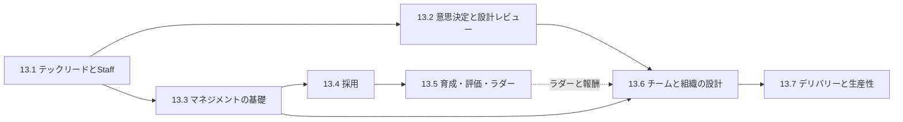

# 第13部 技術リーダーシップ

> 優れたエンジニアがリーダーになって最初に気づくのは、「自分で書くより、人に任せる方が難しい」ということです。この部では、テックリード・Staff エンジニア・エンジニアリングマネージャーとして、技術とチームの両面でリーダーシップを発揮し、個人の貢献からチームと組織の成果へとインパクトを広げる方法を身につけます。意思決定、1on1 とフィードバック、採用、評価と報酬、組織設計、デリバリーの測定を、そのまま職場で使える台本・テンプレート・計算ツールとともに学びます。

## この部で身につくこと

- **権限なしで影響を広げる**: IC のキャリアレベルと Staff エンジニアのアーキタイプを理解し、レバレッジの高い仕事を選び、信頼・文章・根回し・スポンサーシップで組織を動かせる（13.1）。
- **良い決定を組織的に生み出す**: 決定を可逆性で分類し、決め方と決定者を設計し、バイアスを仕組みで抑え、デザインドックと設計レビューを運営できる。意思決定マトリクスの結論が正規化や重みでどれだけ揺らぐかを確かめられる（13.2）。
- **人を通じて成果を出す**: 1on1、SBI によるフィードバック、委任、コーチング、心理的安全性の構築、パフォーマンスの問題への公正な対処ができる。日本の労働時間管理とハラスメント防止の基本を押さえている（13.3）。
- **採用を仕組みにする**: ロードマップから採用計画を逆算し、構造化面接と評価基準で判断し、採用ファネル・面接官の負荷・採用単価を数字で管理できる（13.4）。
- **公正に育て、評価し、報いる**: キャリアラダー、評価とキャリブレーション、昇格、給与レンジとメリットマトリクスを設計し、日本の雇用法制を踏まえて運用できる（13.5）。
- **組織を設計する**: コンウェイの法則とチームトポロジーでチームの境界と関わり方を設計し、管理の幅・階層・再編・外部パートナーとの協働・文化づくりを判断できる（13.6）。
- **デリバリーを測り、伝える**: DORA の指標・SPACE・DevEx・フローメトリクスで流れを測り、キャパシティと確率的な予測で計画し、AI コーディング支援の効果を自社で検証し、経営陣に成果と予測可能性を伝えられる（13.7）。

## 章の一覧

| 章 | タイトル | 学習時間 | 主な演習 | キーワード |
|---|---|---|---|---|
| 13.1 | [テックリードとStaffエンジニア](01-tech-lead-and-staff/README.md) | 本文 3h ＋ 演習 3h | 記述: 影響力ジャーナル（ブラッグドキュメント）、1 ページの技術ビジョン、ステークホルダーマップ、メンタリング計画 | IC トラック, Staff/Principal, アーキタイプ, レバレッジ, 権限なき影響力, グルーワーク, 振り子 |
| 13.2 | [技術的意思決定と設計レビュー](02-technical-decisions/README.md) | 本文 4h ＋ 演習 4h | `decision_matrix.py`（正規化、重み付きスコア、1 位が入れ替わる重みの解析、モンテカルロによる安定性）、記述: デザインドック、プレモーテム | Type 1/Type 2, 合意と同意, DACI, アドバイスプロセス, バイアス, Choose Boring Technology, RFC, Disagree and commit |
| 13.3 | [エンジニアリングマネジメントの基礎](03-engineering-management/README.md) | 本文 4h ＋ 演習 4h | `team_pulse.py`（eNPS、設問の推移、匿名性のしきい値と二次秘匿）、記述: 最初の 1on1、SBI フィードバック、委任マトリクス | High Output Management, 1on1, SBI, Radical Candor, 委任, 心理的安全性, GROW, 36協定, パワハラ防止 |
| 13.4 | [採用](04-hiring/README.md) | 本文 4h ＋ 演習 4h | `hiring_funnel.py`（必要な母集団、充足までの期間、面接官の負荷、採用単価）、記述: 面接ループと評価基準、求人票 | 採用計画, 構造化面接, 予測的妥当性, ワークサンプル, バイアス, バーレイザー, オンボーディング, フリーランス法 |
| 13.5 | [育成・評価・キャリアラダー](05-growth-and-evaluation/README.md) | 本文 4h ＋ 演習 5h | `calibration.py`（評価者の偏りの検出と標準化の影響）・`comp_bands.py`（給与レンジ、コンパレシオ、メリットマトリクス）、記述: 4 等級のキャリアラダー、キャリブレーションのケース | キャリアラダー, 等級制度, MBO/OKR, キャリブレーション, 昇格, 給与レンジ, ストックオプション, 解雇権濫用法理, 離職率 |
| 13.6 | [チームと組織の設計](06-team-and-org-design/README.md) | 本文 4h ＋ 演習 5h | `org_calc.py`（経路・階層・マネジメントのコスト）・`team_clustering.py`（変更の結合から容量制約付きでチームの境界を提案、局所探索）、記述: 30 人から 80 人への組織設計、再編の発表文 | コンウェイの法則, チームトポロジー, 認知負荷, 管理の幅, 成長段階, Spotify モデル, 再編, 偽装請負, 組織文化 |
| 13.7 | [デリバリーと生産性](07-delivery-and-productivity/README.md) | 本文 4h ＋ 演習 5h | `dora_metrics.py`・`flow_metrics.py`・`capacity_plan.py`（DORA の指標、サイクルタイム・WIP・フロー効率、祝日とオンコールを考慮したキャパシティ）、記述: AI コーディングエージェントの効果測定計画 | グッドハートの法則, DORA, SPACE, DevEx, リトルの法則, モンテカルロ予測, プロダクトトリオ, AI コーディング支援 |

合計の目安は、本文 約 27 時間、演習 約 30 時間です。コード演習は `python3 tools/check.py 13` でまとめてテストできます（章を指定するなら `python3 tools/check.py 13.5` のように）。13.1 は記述演習のみです。

## 学習の進め方

### 章の順序と依存関係

- **13.1 から始める**: IC として影響を広げる考え方（レバレッジ、信頼、グルーワーク）は、マネージャーにとっても土台になります。マネジメントに進むつもりがない人も、13.3 までは読んでください。自分の上司が何を考えているかが分かると、影響の出し方が変わります。
- **13.3 → 13.4 → 13.5 は人のライフサイクル**: 1on1 とフィードバック（13.3）を前提に、採用（13.4）、育成・評価・報酬（13.5）へと進みます。13.4 と 13.5 は、解雇規制の下で「採用の厳格さ」と「育成と配置」が表裏一体であることを意識しながら読んでください。
- **13.6 と 13.7 は組織の視点**: 組織設計（13.6）はアーキテクチャ（[9.3 ドメイン駆動設計とモジュール分割](../09-architecture/03-domain-driven-design/README.md)）と、デリバリー（13.7）は CI/CD とプロセス（[8.4 CI/CDとリリースエンジニアリング](../08-software-engineering/04-ci-cd-and-release/README.md)、[8.6 開発プロセスとドキュメンテーション](../08-software-engineering/06-process-and-documentation/README.md)）と合わせて読むと理解が深まります。
- **統計の道具は第2部から**: パーセンタイル、z スコア、期待値、モンテカルロ法、リトルの法則は [2.2 確率・統計と定量的思考](../02-math-and-algorithms/02-probability-statistics/README.md) で扱っています。

目的別の進め方の例です（詳しくは [学習ガイド](../00-guide/README.md)）。

| 目指す役割 | 重点的に読む章 |
|---|---|
| テックリード・Staff エンジニア | 13.1、13.2、13.7 を深く。13.3 と 13.6 は「上司の視点を知る」ために |
| エンジニアリングマネージャー | 13.3、13.4、13.5 を深く。13.1 の TL との分担、13.7 の計画とキャパシティも必須 |
| VPoE・CTO | 全章。特に 13.5 の報酬と評価の監査、13.6 の組織設計、13.7 の経営陣への報告は、第14部の前提になる |

### この部の学び方

- **記述演習は、自分の職場で書く**: 模範解答は一例にすぎません。架空の状況で解いたら、次は自分のチームの実際の状況で書き直し、信頼できる同僚やメンターに見せてフィードバックをもらってください。リーダーシップの技術は、読むだけでは身につかず、使って、フィードバックを受けて、初めて身につきます。
- **台本は声に出して練習する**: 1on1、フィードバック、再編の説明などの台本は、実際に声に出して練習すると、言いにくい言葉が自然に言えるようになります。
- **コードの演習は「リーダーの道具」**: この部の演習で作るツール（意思決定マトリクスの感度分析、サーベイの集計、採用ファネル、評価の偏りの検出、給与レンジ、チームの境界の提案、DORA とフローの指標）は、自分の組織のデータで使えます。ただし、**個人を評価するために使わない**こと、結果を「結論」ではなく「議論の出発点」として扱うことを、各章で繰り返し強調しています。
- **法令と制度は時点に注意する**: 労務・税務・契約に関する記述は、2026 年時点の一般的な解説です。制度は改正されるので、実務で使う前に一次情報を確認し、具体的な判断は専門家（社会保険労務士、弁護士、税理士など）に相談してください。

### つまずきやすい点

- **「正解がない」ことへの戸惑い**: 技術の章と違い、この部の問いの多くには唯一の正解がありません。模範解答の「採点の観点」を使って、自分の答えが押さえるべき点を押さえているかを確かめてください。
- **数字と判断の関係**: この部では、数字で考える場面が多くあります。しかし、意思決定マトリクスの 1 位は正規化の方法で入れ替わり（13.2）、評価者ごとの標準化はチームの実力差まで消し（13.5）、チームの境界の最適化は局所最適に陥ります（13.6）。**数字は判断を助けるが、判断の代わりにはならない** という感覚を、演習を通じて身につけてください。
- **自分の組織に当てはまらないと感じるとき**: 組織の規模や文化によって、適切なやり方は変わります。「なぜこのやり方が勧められているのか」という理由に立ち返り、その理由が自分の組織でも成り立つかを考えてください。

## 到達度チェック

この部を修了したと言えるのは、次のことができるときです。

- [ ] 自分の役割を、IC のレベルと Staff のアーキタイプの言葉で説明し、レバレッジの高い仕事を選んで、その効果を数字で見積もれる
- [ ] 横断的な提案を、ステークホルダーマップ・根回し・文章で合意に導き、グルーワークを含む自分と他者の貢献を記録できる
- [ ] 決定を可逆性と影響範囲で分類し、決定者と決め方を明示して、デザインドックと設計レビューを運営できる
- [ ] 意思決定マトリクスの感度分析を行い、僅差のときに数字ではなく論点を議論に持ち込める
- [ ] 目的のある 1on1 を続け、SBI で具体的なフィードバックを伝え、習熟度に応じて委任のレベルを選べる
- [ ] 心理的安全性と高い基準を両立させるチームの行動を実践し、匿名性を守ってサーベイの結果を行動につなげられる
- [ ] パフォーマンスの問題・対立・バーンアウトに公正な手順で対処し、労働時間とハラスメントの論点で専門家に相談すべき場面を判断できる
- [ ] ロードマップから採用計画を逆算し、構造化面接の面接ループと評価基準を設計し、採用の数字で計画の実現性を判断できる
- [ ] キャリアラダーを書き、評価者の偏りをデータで確認してキャリブレーションを運営し、昇格の基準を透明にできる
- [ ] 給与レンジを設計し、コンパレシオとメリットマトリクスで昇給の予算を見積もれる
- [ ] コンウェイの法則とチームトポロジーでチームの境界と関わり方を設計し、管理の幅と階層を計算し、再編を計画・説明できる
- [ ] DORA の指標とフローメトリクスをデータから計算して改善のボトルネックを特定し、キャパシティと確率的な予測で計画を立てられる
- [ ] AI コーディング支援などの新しい道具の効果を、仮説・比較・判断基準を決めて自社で検証できる
- [ ] 経営陣に、産出ではなく成果・予測可能性・リスク・判断してほしいことを伝えられる

## この部の推薦図書・教材

- Will Larson『Staff Engineer』（2021、邦訳『スタッフエンジニア マネジメントを超えるリーダーシップ』日経BP）— IC として影響を広げる方法の定番。13.1 の土台。
- Camille Fournier『The Manager's Path』（2017、邦訳『エンジニアのためのマネジメントキャリアパス』オライリー・ジャパン）— テックリードから CTO までの各段階の役割を描いた、エンジニアのためのマネジメントの入門書。
- Andy Grove『High Output Management』（1983、邦訳『HIGH OUTPUT MANAGEMENT』日経BP）— マネージャーのアウトプットとレバレッジ、1on1。何度読み返しても発見がある古典。
- Laszlo Bock『Work Rules!』（2015、邦訳『ワーク・ルールズ！』東洋経済新報社）— 採用・評価・報酬を、データと実験で改善した記録。13.4 と 13.5 の背景を知るのに最適。
- Matthew Skelton, Manuel Pais『Team Topologies』（2019、邦訳『チームトポロジー』日本能率協会マネジメントセンター）— チームの型と関わり方、認知負荷。組織設計の共通言語。
- Nicole Forsgren, Jez Humble, Gene Kim『Accelerate』（2018、邦訳『LeanとDevOpsの科学』インプレス）— デリバリーのパフォーマンスを測り、改善するための研究の成果。
- Will Larson『An Elegant Puzzle』（2019）— チームの大きさ、管理の幅、再編、計画など、エンジニア組織の運営の実践的な指針。
- 広木大地『エンジニアリング組織論への招待』（技術評論社, 2018）— 不確実性、メンタリング、チームと組織を、日本のエンジニア組織の文脈で論じた一冊。

## 次に進む

- [第14部 CTOの仕事](../14-cto/README.md) では、この部で扱ったチームと組織のリーダーシップを、経営の視点に広げます。13.5 の報酬と株式報酬は [14.3 事業と財務のリテラシー](../14-cto/03-business-and-finance/README.md) の人員計画と予算に、13.6 の組織設計は [14.1 CTOの役割 — ステージ別の責務](../14-cto/01-role-of-cto/README.md) に、13.7 の経営陣への報告は [14.4 経営陣・取締役会・投資家とのコミュニケーション](../14-cto/04-executive-communication/README.md) に、労務・契約の論点は [14.5 ガバナンス・リスク・コンプライアンスと法務](../14-cto/05-governance-risk-compliance/README.md) につながります。
- この部の内容は、[15.3 CTOシミュレーション — 戦略・組織・予算](../15-capstone/03-leadership-capstone/README.md) で、組織の設計・採用計画・評価制度・デリバリーの計画を統合して使います。[15.4 CTOケーススタディ集](../15-capstone/04-case-studies/README.md) には、この部の知識を使って判断する状況が多数含まれています。
- リーダーシップの技術は、一度読んで終わりではなく、役割が変わるたびに読み返す価値があります。新しくチームを持ったとき、組織が倍になったとき、評価の時期の前に、該当する章に戻ってください。
