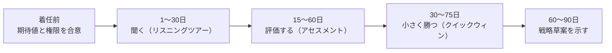

# 14.1 CTOの役割 — ステージ別の責務

> 「CTO は何をする人ですか」と聞かれて、即答できる人はほとんどいません。答えは会社のステージ・事業・組織によってまるで違うからです。この章では、CTO の役割を類型とステージの両面から地図にし、あなたが「今の会社で、今の時期に」果たすべき責務を自分で定義し、着任後の 90 日を設計できるようになることを目指します。

| 項目 | 内容 |
|---|---|
| 学習時間の目安 | 本文 3h ＋ 演習 3h |
| 前提となる章 | [13.3 エンジニアリングマネジメントの基礎](../../13-technical-leadership/03-engineering-management/README.md)、[13.6 チームと組織の設計](../../13-technical-leadership/06-team-and-org-design/README.md) |
| 演習 | 記述演習（本文末尾の[演習](#演習)） |
| キーワード | CTO, VPoE, CIO, CISO, CPO, CDO, ステージ別の責務, 時間配分, 共同創業者, 最初の90日, リスニングツアー, 技術顧問 |

## この章のゴール

- [ ] CTO の役割に単一の定義がない理由を説明し、代表的な類型を使って自社に必要な CTO 像を言語化できる
- [ ] CTO・VPoE（VP of Engineering）・CIO・CISO・CPO・CDO の責務の違いと重なりを説明し、役割分担と報告ラインを設計できる
- [ ] 創業期から上場企業・伝統的な大企業まで、ステージごとの CTO の主要な責務と時間配分の変化を説明できる
- [ ] 共同創業者 CTO に特有の論点（株式、CEO との関係、VPoE や後任 CTO を迎える判断）を整理できる
- [ ] 着任後 90 日の計画（リスニングツアー、アセスメント、クイックウィン、戦略草案）を立てられる
- [ ] CTO としての成功を測る指標と、典型的な失敗パターンの予兆を説明できる

## なぜ学ぶのか

Amazon の CTO を長く務めてきた Werner Vogels は、2007 年のブログ記事 "The Different CTO Roles" で、CTO の役割については大きな混乱があり、確立した定義がないと書いています。それから長い時間が経ちましたが、状況は本質的には変わっていません。CTO という肩書きは、最初のエンジニアにも、数百人の技術組織の長にも、研究開発の責任者にも、対外的な技術の顔にも使われます。

定義が曖昧なまま CTO になると、次のような「よくある筋書き」をたどりがちです（特定の企業の話ではなく、典型的なパターンです）。

1. 創業期、共同創業者の CTO は誰よりも速くプロダクトを作り、会社を PMF（プロダクトマーケットフィット）に導く。
2. シリーズ B でエンジニアが 60 人を超えても、CTO はすべての設計判断とコードレビューを自分で抱えている。マネージャー層がいないため、採用・評価・チーム間の調整が滞る。
3. リードタイムが延び、障害が増え、優秀なエンジニアが辞め始める。取締役会は「組織を作れる人」を求め、CTO 本人は「自分の強みが否定された」と感じる。

この筋書きの問題は、CTO 個人の能力不足ではありません。**ステージが変わると CTO に求められる責務が非連続に変わるのに、その変化を誰も言語化していなかったこと** です。

日本には固有の事情もあります。IPA（情報処理推進機構）の『DX白書2023』は、日本では情報処理・通信に携わる人材の 73.6% が IT 企業（ベンダー側）に所属しているのに対し、米国では 35.1% にとどまると報告しています（日本は 2020 年、米国は 2021 年の統計による）。つまり日本のユーザー企業で技術を率いる人は、自社のエンジニア組織を率いるだけでなく、ベンダーを管理し、内製化を進め、レガシーシステムと向き合うことが仕事の中心になりやすいのです。同じ「CTO」でも、スタートアップの CTO とはまったく違う役割になります。

この章で扱うのは、役割を「与えられるもの」ではなく「設計するもの」として扱う考え方です。第14部の残りの章（戦略・財務・コミュニケーション・ガバナンス・危機管理・DD・AI・自己管理）は、ここで描く地図の各領域を深掘りしていきます。

## 1. CTO に単一の定義はない

### 1.1 「CTO」と呼ばれる人の実態

同じ肩書きでも、実態は大きく異なります。

| 実態 | 主な仕事 | よく見られる場所 |
|---|---|---|
| 創業エンジニア | 自らコードの大半を書き、技術的な判断をすべて下す | 創業〜シード期のスタートアップ |
| 技術組織の長 | 数十〜数百人のエンジニア組織を率い、採用・組織・デリバリーに責任を持つ | 成長期のスタートアップ、Web 企業 |
| 技術戦略・アーキテクチャの責任者 | 技術方針と大きな設計判断を担い、組織運営は VPoE に任せる | 中〜大規模のテック企業 |
| 対外的な技術の顔 | 顧客・パートナー・投資家・コミュニティに技術を語る | 技術製品を売る企業 |
| 研究開発の長 | 研究所・先端技術・知財を統括する | 製造業、研究開発型の企業 |
| 情報システムの長 | 社内の業務システム・IT 基盤・ベンダーを管理する（実態は CIO） | 伝統的な事業会社 |

日本の製造業では「CTO（最高技術責任者）」が、ソフトウェアではなく製品・生産技術の研究開発を統括する役員を指すことも多い点に注意してください。転職や採用の場面では、肩書きではなく「何に責任を持つのか」を確認する必要があります。

### 1.2 Vogels の 4 つの類型

Vogels は前述の記事で、Tom Berray による整理を引きながら、CTO の役割を 4 つの類型に分けました。

| 類型 | 何をする人か | 典型的な会社 |
|---|---|---|
| インフラ管理者（Infrastructure Manager） | IT 基盤と運用（データセンター、ネットワーク、アプリケーションの開発・保守、セキュリティ）に責任を持つ。技術の全社的な活用は CIO が担う | 伝統的な事業会社 |
| 技術ビジョナリー兼運用責任者（Technology Visionary and Operations Manager） | 技術で事業戦略をどう実現するかを決め、その実装と運用まで率いる | IT が事業戦略の中核にある企業 |
| 対外的な技術者（External Facing Technologist） | 顧客と社内の開発部門の間に立ち、顧客の課題を製品に反映する | 技術製品・サービスを顧客に提供する企業 |
| ビッグシンカー（Big Thinker） | 技術が新しい事業モデルを生み、市場を変える可能性を探る。先端技術の調査、競合分析、プロトタイピング、提携などを担う | 技術で市場を切り開こうとする企業 |

これは 2007 年の整理です。クラウド・SaaS・AI の時代の CTO は、1 人で複数の類型を兼ねるか、時期によって類型を移っていくのが普通です。類型は「正解を選ぶため」ではなく、**自分と周囲の期待がどの類型を指しているのかを確かめるための共通言語** として使います。

### 1.3 2 つの軸で役割を描く

実務では、次の 2 つの軸で考えると、役割の期待値のずれを見つけやすくなります。

| | 内向き（組織・デリバリー・運用） | 外向き（顧客・市場・投資家） |
|---|---|---|
| **将来の事業をつくる（探索）** | 研究開発・新規事業型（先端技術、R&D、プロトタイプ） | ビジョナリー・対外型（新市場、提携、投資家への技術の説明） |
| **今の事業を回す（実行）** | 組織構築・運用型（採用、組織、デリバリー、信頼性） | 顧客接点型（プリセールス、大口顧客、パートナー） |

CEO・取締役会・エンジニア組織のそれぞれに「CTO に一番期待していることは、この表のどのマスか」を聞くと、答えがばらつくことがよくあります。そのばらつきこそが、最初に解消すべき問題です。

### 1.4 役割は「会社がいま必要とする責務」から設計する

CTO の役割を設計するときは、肩書きからではなく、技術に関わる責務の一覧から出発します。

| 領域 | CTO が自ら持つことが多いもの | 委ねる先の例 |
|---|---|---|
| 技術戦略・アーキテクチャ | 技術方針、一方通行のドアとなる設計判断、技術投資の配分 | アーキテクト、Staff エンジニア（[13.1](../../13-technical-leadership/01-tech-lead-and-staff/README.md)） |
| デリバリー | 開発プロセスの方針、ロードマップの実現性の判断 | VPoE、エンジニアリングマネージャー |
| 組織と人 | 組織設計の方針、幹部の採用、評価制度の設計 | VPoE、人事 |
| 信頼性と運用 | 信頼性の目標水準、重大インシデントの最終責任 | SRE チーム（[10.3](../../10-cloud-and-sre/03-reliability-engineering/README.md)） |
| セキュリティとプライバシー | リスク許容度の設定、重大事故の対応 | CISO、セキュリティチーム |
| データと AI | データ・AI の活用方針とガバナンス | データ責任者（[14.8](../08-ai-strategy/README.md)） |
| 予算とベンダー | 技術予算、大型契約の判断 | 各部門長、FinOps 担当 |
| 対外活動 | 投資家・大口顧客・採用広報での技術の説明 | 技術広報、テックリード |
| ガバナンスとコンプライアンス | 内部統制・認証・法令対応の技術面の責任 | CISO、法務、内部監査 |

この表の各行について「CTO が持つ／共有する／委ねる」を決め、CEO と文書で合意したものが、あなたの会社における CTO の定義です。

## 2. 隣接する経営ポジションとの違い

### 2.1 役職の比較

| 役職 | 中心となる問い | 主な責務 | 典型的な成果指標 |
|---|---|---|---|
| CTO（Chief Technology Officer） | 技術で事業にどう勝つか | 技術戦略、アーキテクチャ、技術投資、技術リスク | 技術による事業成果、技術的な選択肢の広さ、技術リスクの水準 |
| VPoE / VP of Engineering | 約束したものを、健全なチームで、予測可能に届けられるか | 開発組織の運営、採用・育成・評価、デリバリー | デリバリーの予測可能性、採用計画の達成、離職率 |
| CIO（Chief Information Officer） | 社内の業務と IT をどう効率化・高度化するか | 業務システム、社内 IT 基盤、ベンダー管理、IT ガバナンス | 業務効率、IT コスト、社内システムの安定性 |
| CISO（Chief Information Security Officer） | 情報資産のリスクを、事業が許容できる水準に保てているか | セキュリティ戦略、リスク評価、インシデント対応、規制対応 | 重大インシデント、残存リスク、監査指摘 |
| CPO（Chief Product Officer） | 何を、誰のために、なぜ作るか | プロダクト戦略、ロードマップ、ユーザー体験 | 利用・継続・売上への寄与 |
| CDO | デジタルで事業をどう変えるか（Chief Digital Officer）／データをどう活かし守るか（Chief Data Officer） | DX の推進／データ戦略とデータガバナンス | DX による事業成果／データ活用の成果と品質 |

CDO という略称が 2 つの意味で使われること、CPO が Chief Privacy Officer（プライバシー責任者）を指す場合もあることに注意してください。近年は AI 担当の役員を置く企業も出てきています（[14.8 AI戦略とAIガバナンス](../08-ai-strategy/README.md)）。

役職の境界は会社によって異なりますが、重要なのは **重なる領域の意思決定権を明示すること** です。たとえば「ロードマップの優先順位は CPO、実現方法と技術的な制約は CTO、チームへの割り当ては VPoE が決め、衝突したら CEO が裁定する」のように書き出します。

### 2.2 VPoE と VP of Engineering

英語圏では VP of Engineering（VPE と略すこともある）が一般的な呼び方で、VPoE は日本のスタートアップで広まった略称です。指している職位は同じであることが多いものの、日本では「CTO は技術、VPoE は組織と人」と分担する使い方がよく見られます。

この分担は有効ですが、境界で必ず問題が起きます。

- **評価と昇格**: 技術的な能力の評価基準は誰が決めるのか。
- **採用**: 採用の要件（どんな技術力が必要か）と採用の実行（プロセス・目標数）は誰が持つのか。
- **アーキテクチャと組織**: コンウェイの法則が示すとおり、組織の形はシステムの形に影響します（[13.6](../../13-technical-leadership/06-team-and-org-design/README.md)）。チーム構成の変更は、どちらの承認が必要か。
- **報告ライン**: VPoE は CTO に報告するのか、CEO に直接報告するのか。

どちらが正しいということはありません。決めずに運用すると、エンジニアが「2 人の上司」の間で板挟みになることが問題なのです。

### 2.3 報告ラインの論点

**CISO をどこに置くか** は、よく議論になります。CTO の下に置くと、エンジニアリングとの距離が近く、対策が実装に落ちやすい利点があります。一方で、セキュリティ投資とデリバリー速度が対立したとき、両方の責任者が同じ人になる利益相反が生じます。規模が大きくなったら、CEO や、リスク管理の担当役員の直下に置く、あるいは取締役会（監査等委員会など）に直接報告できる経路を設けるといった選択肢を検討します。

**社内 IT（コーポレート IT）** も境界になりやすい領域です。スタートアップでは、SSO・端末管理・SaaS のアカウント管理を CTO が兼務することが多いですが、従業員数が増えるにつれて、管理部門の下にコーポレート IT として独立させるのが一般的です。ただし ID 管理と退職者のアカウント削除は、上場準備で IT 全般統制の対象になるため（[14.5](../05-governance-risk-compliance/README.md)）、誰が責任を持つのかを曖昧にしないでください。

### 2.4 取締役 CTO と執行役員 CTO

日本の会社では、CTO が **取締役** の場合と **執行役員** の場合があります。

| | 取締役 CTO | 執行役員 CTO |
|---|---|---|
| 会社法上の位置づけ | 役員。取締役会の構成員として、業務執行の決定と取締役の職務執行の監督に参加する | 会社法上の機関ではない（指名委員会等設置会社の「執行役」とは別物）。取締役会などが選任する業務執行の責任者 |
| 義務と責任 | 善管注意義務・忠実義務を負い、任務を怠れば会社や第三者に対する損害賠償責任を負いうる | 雇用契約または委任契約の内容による |
| 関与する議題 | 技術に限らず、資金調達・M&A・役員報酬など会社全体の意思決定 | 担当領域の業務執行が中心 |

取締役 CTO は、技術以外の議案にも一票を投じる経営者です。財務（[14.3](../03-business-and-finance/README.md)）とガバナンス（[14.5](../05-governance-risk-compliance/README.md)）の知識が欠かせません。役員の責任の範囲や会社役員賠償責任保険（D&O 保険）の要否といった具体的な判断は、弁護士に確認してください。

## 3. ステージ別の責務

### 3.1 全体像

| ステージ | エンジニア数の目安 | 事業の主題 | CTO の主な責務 | 典型的な落とし穴 |
|---|---|---|---|---|
| 創業期（0→1） | 0〜5 人 | 課題と解決策の検証 | 自ら作る。最小限の土台を正しく敷く。最初の採用 | 作り込みすぎ、流行技術への過剰投資 |
| シード〜シリーズ A | 5〜30 人 | PMF の達成 | 検証サイクルの速さ、計測、チームの形成、基本的なプロセス | 自分がボトルネックになる、採用基準の妥協 |
| シリーズ B〜C | 30〜150 人 | 事業の拡大 | マネージャー層と組織、プラットフォーム、信頼性、セキュリティと認証、大規模な採用、予算 | 組織化の遅れ、技術的負債の放置 |
| レイト〜上場準備 | 100〜300 人 | 予測可能な成長と上場 | ガバナンス、IT 全般統制、認証、予測可能なデリバリー、取締役会への報告 | 統制を後付けして現場が疲弊する |
| 上場企業・グローバル企業 | 数百人〜 | 持続的な成長、事業ポートフォリオ | 技術戦略とポートフォリオ、M&A、イノベーション、対外発信 | 現場から遠ざかり判断の質が落ちる |
| 伝統的な日本の大企業 | 自社の技術者は少なく、ベンダー依存が大きいことが多い | DX、レガシー刷新 | DX の推進、レガシー刷新、ベンダー管理と内製化、人材の獲得 | ベンダーへの丸投げ、PoC 止まり |

人数は目安です。資金調達のラウンドと組織の規模は必ずしも一致しません。自社のステージは、ラウンドの名前ではなく「事業の主題」で判断してください。

### 3.2 創業期（0→1）: 作る人

この時期の CTO は **ビルダー** です。仕事の大半は、自ら手を動かして仮説検証のためのプロダクトを作ることです。スケールしないやり方で構いません。むしろ、使われるかどうか分からないものに過剰な設計をすることが最大の無駄です。

ただし、後から変えるのが極めて高くつく **一方通行のドア**（[13.2](../../13-technical-leadership/02-technical-decisions/README.md)）が少数あり、ここだけは最初から正しく敷きます。

- **データモデルの中核と ID**: 主要なエンティティ、ID の型（64 ビットか UUID か。[1.1](../../01-computer-systems/01-data-representation/README.md)）、マルチテナントの分離方式。
- **認証**: 自作せず、実績のある IDaaS やフレームワークを使う。
- **クラウドの基本構成**: アカウント（プロジェクト）の分割、IaC、本番と開発の分離。
- **セキュリティの最低線**: 全員の多要素認証、秘密情報をリポジトリに置かない、最小権限、依存ライブラリの更新、クラウドの操作ログの保存。
- **バックアップと復元の確認**: 復元を一度も試していないバックアップは、ないのと同じです。
- **知的財産の帰属**: 創業者や業務委託先が書いたコードの権利が会社に移っていることを契約で確認する（[14.5](../05-governance-risk-compliance/README.md)）。資金調達の技術 DD でほぼ例外なく確認されます。

技術選定は、Dan McKinley が 2015 年の記事 "Choose Boring Technology" で示したように、「新しい技術を試せる回数（イノベーション・トークン）は限られている」と考え、差別化に関わる部分にだけ使います。

最初の 5〜10 人の採用は、その後の文化を決めます。「自分で課題を見つけて最後までやり切れるか」「顧客の話を聞けるか」を重視し、大切にしたいエンジニアリングの原則を早い段階で文章にしておきます。

### 3.3 シード〜シリーズ A: 検証の速度とチームの形成

PMF を探す時期の技術的な最重要指標は **学習の速度**、つまり「仮説を立ててから、顧客の反応が分かるまでの時間」です。

- 1 日に何度でも安全にデプロイできる CI/CD と、機能フラグ。
- プロダクトの利用状況を計測する仕組み（何が使われ、どこで離脱しているか）。
- 軽量なインシデント対応とオンコールの取り決め。
- 意図的な技術的負債と、その「利息」の記録（[8.5](../../08-software-engineering/05-refactoring-and-tech-debt/README.md)）。

CTO はまだコードを書きますが、採用・オンボーディング・1on1 に時間を移し始めます。最初のテックリードを任命し、「自分がいなくても設計判断が進む」状態を作ることが、この時期の最も重要な組織的成果です。シリーズ A 前後から投資家の技術的な確認が始まるので、アーキテクチャの概要とセキュリティの基本状況を説明できるようにしておきます（[14.4](../04-executive-communication/README.md)）。

### 3.4 シリーズ B〜C: 組織をつくる人

事業の拡大期には、CTO の仕事は **仕組みづくり** に変わります。

- **組織**: エンジニアリングマネージャーを置き、必要なら VPoE を迎える。ストリームアラインドチームとプラットフォームチームに分ける（[13.6](../../13-technical-leadership/06-team-and-org-design/README.md)）。キャリアラダーと評価制度を整える（[13.5](../../13-technical-leadership/05-growth-and-evaluation/README.md)）。
- **プラットフォーム**: CI/CD、オブザーバビリティ、開発者体験を「舗装道路」として整える（[14.2](../02-technology-strategy/README.md)）。
- **信頼性**: SLO を定め、オンコールとインシデント対応を制度にする（[10.3](../../10-cloud-and-sre/03-reliability-engineering/README.md)、[10.5](../../10-cloud-and-sre/05-incident-management/README.md)）。
- **セキュリティとコンプライアンス**: 最初のセキュリティ専任者を採用し、大企業との取引に必要な認証（ISMS、SOC 2 など）を計画する（[14.5](../05-governance-risk-compliance/README.md)）。
- **大規模な採用**: 構造化面接と面接官の訓練（[13.4](../../13-technical-leadership/04-hiring/README.md)）。
- **予算**: 人員計画とクラウド費用に責任を持つ（[14.3](../03-business-and-finance/README.md)、[10.6](../../10-cloud-and-sre/06-finops/README.md)）。

CTO がコードを書く時間はほぼなくなります。それでも技術の感覚を失わないよう、設計レビューに参加し、コードを読み、小さなプロトタイプで新技術を試す時間は意図的に確保します。

### 3.5 レイト〜上場準備: 統制と予測可能性

上場を目指す会社では、「速く作れる」ことに加えて **「統制が効いていることを証明できる」** ことが求められます。

- **ガバナンスと内部統制**: IT 全般統制（アクセス管理・変更管理・運用管理・外部委託先の管理）を整え、証跡を残す（[14.5](../05-governance-risk-compliance/README.md)）。
- **予測可能なデリバリー**: 四半期ごとの計画と、約束したロードマップの達成率を管理する。
- **取締役会への報告**: 技術・セキュリティの状況と主要なリスクを定期的に報告する（[14.4](../04-executive-communication/README.md)）。
- **事業継続**: BCP・災害復旧の方針と訓練。

日本の IPO 準備では、申請期の 2 期前（直前々期）から内部管理体制を整え、直前期に運用実績を積むのが一般的です。統制を後から付け足すと、証跡の欠落や現場の反発で時間がかかります。上場を目指すと決まった時点で、監査法人や主幹事証券の指摘を待たずに、技術面の準備を始めてください。

### 3.6 上場企業・グローバル企業: 戦略とポートフォリオ

組織がさらに大きくなると、CTO は **技術戦略と投資ポートフォリオの責任者** になります。

- 複数の事業・プロダクトにまたがる技術戦略と投資配分（[14.2](../02-technology-strategy/README.md)）。
- M&A の技術 DD と統合（[14.7](../07-due-diligence-and-ma/README.md)）。
- 研究開発・新規事業などのイノベーション。
- 投資家向け説明会、カンファレンス、業界団体での対外発信。
- AI ガバナンス（[14.8](../08-ai-strategy/README.md)）と、後継者の育成。

グループ CTO と事業部 CTO の二層構造や、CTO 室（CTO office）、アーキテクチャ評議会といった仕組みで、判断を分散させつつ一貫性を保ちます。

### 3.7 伝統的な日本の大企業: DX と内製化

伝統的な大企業で技術を率いる人（肩書きは CTO・CIO・CDO などさまざま）の中心課題は、多くの場合 **DX とレガシー刷新、そしてベンダー依存からの脱却** です。

- **DX の推進**: 経営トップからの明確な権限と予算がなければ、既存の業務部門と IT 部門の間で PoC（概念実証）が繰り返されるだけになりがちです。経済産業省の「デジタルガバナンス・コード」（2024 年に 3.0 へ改訂）は、DX を経営課題として取り組むための指針です。
- **レガシー刷新**: 長年の改修でブラックボックス化した基幹システムをどう移行するか（[14.2](../02-technology-strategy/README.md) の 7R）。
- **ベンダー管理と内製化**: 請負契約での一括発注から、自社がプロダクトの意思決定を握る体制へ移ります。内製化は「エンジニアを採用すること」だけではありません。まず要件と優先順位を決められるプロダクトオーナーの能力を社内に持ち、次にテックリード、そしてチームへと広げるのが現実的な順序です。パートナー企業と混成チームを組む場合は、契約形態（準委任など）と指揮命令の関係に注意します（[14.5](../05-governance-risk-compliance/README.md) の偽装請負）。
- **人事制度の制約**: 既存の職能等級や給与体系では、市場水準のエンジニアを採用できないことがあります。専門職制度や別会社の設立で対応する企業もあります。CTO は人事部門と組んで、制度そのものを変える交渉をすることになります。

### 3.8 時間配分の変化

責務が変われば、時間の使い方も変わります。次の表は、ステージごとの時間配分の **一例** です。会社や個人によって大きく異なるので、正解ではなく、自分の配分を見直すための比較対象として使ってください。

| 活動 | 創業期 | シード〜A | B〜C | レイト〜上場準備 | 上場後・大企業 |
|---|---|---|---|---|---|
| 実装・技術的な実務 | 60% | 35% | 5% | 0% | 0% |
| 設計・技術判断・レビュー | 10% | 15% | 15% | 10% | 10% |
| 採用 | 10% | 20% | 20% | 10% | 5% |
| 人と組織（1on1・育成・評価・組織設計） | 5% | 15% | 25% | 20% | 20% |
| 経営（経営会議・予算・戦略・取締役会） | 5% | 5% | 15% | 25% | 30% |
| 社外（顧客・投資家・採用広報・業界） | 10% | 5% | 10% | 15% | 20% |
| リスク・ガバナンス・セキュリティ | 0% | 5% | 10% | 20% | 15% |

実装が 0% でも、技術から離れてよいわけではありません。設計文書を読み、障害の振り返りに参加し、ときには小さなプロトタイプを自分で書いて新しい技術の手触りを確かめることは、判断の質を保つために必要です。

この表とのずれを見る方法が、演習 3 の **カレンダー監査** です。人は自分の時間の使い方を正確に覚えていません。記録から数えると、思っていたより実装と割り込み対応に時間を使っていることがよくあります。集計の具体的な手順や、考える時間の守り方・委任の段階といった時間とエネルギーの管理は [14.9 CTOの自己管理とキャリア](../09-sustaining-yourself/README.md) で扱います。この章では「今のステージに合った責務に時間を使えているか」に焦点を当てます。

## 4. 共同創業者 CTO

### 4.1 株式と契約

共同創業者 CTO にとって、株式は最も大きな経済的な判断であり、**資本政策（誰がどれだけ株式を持つか）は、一度決めると元に戻しにくい一方通行のドア** です。

- **創業株主間契約**: 創業者の誰かが早期に会社を離れた場合に、その株式を会社や他の創業者が一定の価格で買い取れるように取り決めておく契約です。日本では、米国のような株式のベスティング（勤続に応じた権利確定）の代わりに、この買取条項で同じ目的を果たすことがよく行われます。
- **知的財産**: 会社設立前に書いたコードや発明の権利を、会社に移しておきます。
- **役割と持分を分けて考える**: 株式は創業時のリスクと貢献への対価であり、「CTO という職務に永久に就く権利」ではありません。この区別を最初に合意しておくと、後で役割を見直すときの摩擦が小さくなります。

契約の設計や株式の評価は、弁護士・税理士などの専門家に相談してください。

### 4.2 CEO との関係

共同創業者の関係は、会社にとって最大のリスクにも最大の強みにもなります。

- **意思決定権の分担**: 「事業の優先順位は CEO、技術的な実現方法は CTO が最終判断する。互いの領域に影響する判断は事前に相談する」のように、文書で合意します。
- **定例の 1on1**: 毎週、事業の優先順位・主要な指標・人・リスク・決めるべきことを確認します（議題の型は [14.4](../04-executive-communication/README.md)）。
- **意見の相違**: 非公開の場で徹底的に議論し、決まったら公の場では一枚岩で実行します。重大な対立が続くなら、取締役や信頼できる第三者に仲介を頼むことも選択肢です。
- **四半期ごとの役割の見直し**: 会社のステージが変わると、最適な役割分担も変わります。定期的に見直す約束をしておくと、見直しが「不信の表明」ではなく「定例の手続き」になります。

### 4.3 VPoE や後任 CTO を迎える判断

組織が大きくなると、共同創業者 CTO は難しい選択を迫られます。次のような兆候が見えたら、検討を始める時期です。

- 採用・評価・チーム間の調整に時間の大半を取られ、技術判断が遅れている。
- エンジニアが 30〜50 人を超えても、マネージャー層がいない。
- 自分が得意でない、あるいはやりたくない仕事が、役割の中心になっている。
- 取締役会や投資家が、組織運営やデリバリーの予測可能性に懸念を示している。

| 選択肢 | 自分の役割 | 向いている状況 | 注意点 |
|---|---|---|---|
| A. VPoE を迎える | CTO として技術戦略・アーキテクチャ・対外活動に集中する | 技術判断に強みがあり、組織運営は得意でない | 意思決定権の境界を文書化する。VPoE の報告先（CTO か CEO か）を決める |
| B. 新しい CTO を迎え、自分は別の役割へ | チーフアーキテクト、フェロー、新規事業の責任者など | 次のステージに必要な CTO 像と、自分の志向が合わない | 役割の再設計として社内外に説明する。株式・報酬の扱いは役割と切り離して合意する |
| C. 自分が組織をつくる CTO へ成長する | 組織と経営に時間を移す | 組織づくりへの意欲と、学ぶ時間がある | コーチやメンター、経験豊富なマネージャーの採用で補う。コードから離れる覚悟が要る |

どの選択肢も失敗ではありません。失敗なのは、兆候が出ているのに判断を先送りし、組織が壊れてから慌てて決めることです。後継者計画の作り方と、自分のキャリアの次の選択肢については [14.9](../09-sustaining-yourself/README.md) で扱います。

## 5. 最初の 90 日

新しく CTO に着任したとき（外部から入る場合も、社内から昇格する場合も）の 90 日は、信頼を得て、状況を正しく診断し、方向を示すための期間です。

期間は重なり合います。聞きながら評価し、評価しながら小さな改善を進めます。

### 5.1 着任前: 期待値を文書にする

着任前（遅くとも初週）に、CEO と次のことを文書で合意します。

- **何を解決するために採用されたのか**（例: 「障害を減らしつつ、エンタープライズ向け機能の開発速度を上げる」）。
- **意思決定権**: 採用・解雇・組織変更・技術選定・予算のうち、何を単独で決められるか。
- **予算と人員**: 今期使える予算と採用枠。
- **成功の基準**: 6 か月後・12 か月後に何が達成されていれば成功か。
- **既知の地雷**: 大口顧客との約束、進行中の大型プロジェクト、人事上の問題。

### 5.2 1〜30 日: リスニングツアー

最初の 1 か月は、**結論を出さずに聞く** ことに集中します。

| 対象 | 目安 | 目的 |
|---|---|---|
| CEO・経営陣 | 全員と各 1〜2 回 | 事業の優先順位、技術組織への期待と不満 |
| エンジニア（全階層） | 少人数なら全員、大人数ならマネージャー全員と各チームの数名 | 現場の課題、誇りに思っていること、変えてほしくないこと |
| プロダクト・営業・カスタマーサクセス | 部門長と現場の数名 | 顧客から見た技術組織の姿 |
| 主要顧客 | 数社 | 製品の信頼性・機能への評価 |
| 取締役・主要株主 | 可能な範囲で | 技術に関する懸念、期待 |

どの相手にも、同じ質問をすると比較ができます。

1. うまくいっていることは何ですか。変えてほしくないことは何ですか。
2. うまくいっていないことは何ですか。
3. 私があなたなら、最初に何をしますか。
4. 私が知っておくべきなのに、誰も言わないことは何ですか。
5. 他に誰と話すべきですか。

並行して、アーキテクチャ図・設計文書、直近 1 年のポストモーテム、ロードマップ、予算とクラウドの請求書、組織図と離職のデータ、セキュリティ診断の結果、主要な契約（クラウド・SaaS・業務委託）を読みます。

30 日前後で、**「聞いたこと」の要約** を関係者に共有します。「こう聞こえた。認識は合っているか」と確認するだけで、話した人は「聞いてもらえた」と感じ、誤解も早く正せます。この時点では解決策は書きません。

### 5.3 15〜60 日: アセスメント

聞いた話を、証拠で確かめます。6 つの領域について、事実に基づいて評価します。

| 領域 | 確かめる問い | 証拠の例 |
|---|---|---|
| アーキテクチャ | 事業の次の 2〜3 年の成長に耐えるか。最大のボトルネックと一方通行のドアはどこか | 構成図、負荷の実績、主要な設計文書 |
| デリバリー | 変更をどれだけ速く安全に届けられるか | デプロイ頻度、変更のリードタイム、変更失敗率、復旧時間（[13.7](../../13-technical-leadership/07-delivery-and-productivity/README.md)） |
| 信頼性 | 顧客が体感する品質は約束に見合っているか | SLO と実績、重大インシデントの件数と影響時間 |
| セキュリティ | 最低線は守られているか | 多要素認証の適用率、退職者アカウントの削除、秘密情報の管理、バックアップの復元試験、本番環境へのアクセス権限 |
| 組織と人 | 適切な人が適切な役割にいるか。誰が辞めると困るか | 組織図、スキルの分布、離職率、エンゲージメント調査、1on1 で聞いた声 |
| コスト | 技術の支出は事業に見合っているか | 売上に対するクラウド費用、主要な SaaS 契約、業務委託の単価 |

セキュリティの最低線に重大な欠落（全員が管理者権限を持っている、バックアップの復元を試したことがない、など）が見つかったら、90 日を待たずに対処します。

### 5.4 30〜75 日: クイックウィン

信頼は、言葉よりも小さな成果で得られます。クイックウィンは次の条件を満たすものを選びます。

- 多くの人が困っていて、効果が目に見える。
- リスクが小さく、1〜4 週間で終わる。
- あなた自身ではなくチームが実行し、チームの成果になる。

例として、CI の不安定なテストの修正、バックアップの復元試験、オンコール手当や当番表の見直し、形骸化した承認手続きの廃止、障害の振り返りの定例化などがあります。

逆に、最初の 1 か月で大規模な組織変更やシステムの全面書き直しを発表するのは避けます。状況を理解する前の大きな決定は外れやすく、外れたときに信頼を大きく失います。前任者や既存の判断を批判することも、得るものがありません。当時の制約の下では合理的だった判断がほとんどです。

### 5.5 60〜90 日: 戦略草案

最後に、聞いたことと評価の結果を **1〜2 ページの戦略草案** にまとめます。形式は [14.2](../02-technology-strategy/README.md) で学ぶ Rumelt のカーネル（診断・基本方針・一貫した行動）が使えます。

- **診断**: 技術組織が直面している最も重要な課題は何か（多くても 3 つ）。
- **基本方針**: その課題にどう取り組むか。何をしないか。
- **一貫した行動**: 今後 6 か月で実行する具体的な施策と、その指標。

草案はいきなり全社に発表せず、CEO、経営陣、マネージャーの順に意見をもらいながら磨きます。「一緒に作った」と感じてもらうことが、実行の段階で効いてきます。

### 5.6 状況による違い

- **危機の最中の着任**（重大障害の多発、セキュリティ事故、主要メンバーの大量離職）: 90 日の順序を待たず、最初の数日で止血を優先します（[14.6](../06-crisis-management/README.md)）。ただし止血と並行して聞くことは続けます。
- **社内からの昇格**: 元同僚との関係が変わります。「これまでと何が変わり、何が変わらないか」を自分から言葉にして伝えます。
- **大企業への着任**: 公式な組織図とは別に、実際の意思決定の流れ（誰の合意が必要か）を把握することが、リスニングツアーの重要な目的になります。

## 6. 成功の定義と失敗パターン

### 6.1 成功をどう測るか

CTO の成果は、自分が書いたコードや下した判断の数ではなく、**技術を通じて事業にもたらした成果と、将来の選択肢の広さ** で測ります。次のようなスコアカードを CEO と合意し、四半期ごとに見直します。

| 領域 | 指標の例 | 見るべきもの |
|---|---|---|
| 事業への貢献 | 主要なロードマップの達成率、技術起点の新しい事業機会 | 約束と実績の差、その理由 |
| デリバリー | 変更のリードタイム、デプロイ頻度、変更失敗率、復旧時間 | 水準よりも傾向 |
| 信頼性 | SLO の達成状況、重大インシデントの件数と顧客影響時間 | 同じ原因の再発がないか |
| セキュリティ | 重大な脆弱性の修正期間、監査指摘の件数、重大事故 | 最低線が守られ続けているか |
| 組織 | 採用計画の達成率、惜しまれる離職、エンゲージメント | マネージャー層と後継者が育っているか |
| 効率 | 売上に対するクラウド費用、単位あたりのコスト | 事業の成長より費用が速く伸びていないか |
| 将来の選択肢 | 技術的負債の管理状況、新技術の検証件数 | 次の 1〜2 年に必要な能力への投資 |

指標を置くときは、その指標が悪い行動を誘発しないかを確かめます（たとえば「障害件数」だけを目標にすると、障害を報告しない文化が生まれます）。

### 6.2 失敗パターンと予兆

| 失敗パターン | 予兆 | 早めに打つ手 |
|---|---|---|
| ボトルネック CTO | 重要な判断が CTO の予定表の空き待ちになっている | 判断の基準を文書にし、テックリードに権限を委ねる |
| 技術のための技術 | 刷新プロジェクトの目的を事業の指標で説明できない | 施策ごとに「どの事業指標を動かすか」を書く |
| 経営の場で通訳がいない | 経営会議で技術の話になると議論が止まる | 事業の言葉で話す訓練（[14.4](../04-executive-communication/README.md)） |
| 組織の後回し | マネージャー不在のまま人数だけ増えている | 人数の増加に先行してマネージャーを育成・採用する |
| リスクの先送り | 「セキュリティは上場前にまとめてやる」 | 最低線を今すぐ敷き、段階的に成熟させる |
| 前職の成功体験の移植 | 着任直後に前職と同じツール・組織を導入し始める | リスニングツアーとアセスメントを先に行う |
| 燃え尽き | 睡眠不足と週末の常態的な稼働が続いている | 自己管理を仕組みにする（[14.9](../09-sustaining-yourself/README.md)） |

## 7. 日本の文脈

### 7.1 日本CTO協会と DX Criteria

一般社団法人日本CTO協会は 2019 年に設立され、同年 12 月に企業の DX の進み具合を自己診断するための基準「DX Criteria」を公開しました。チーム・システム・データ駆動・デザイン思考・コーポレートの 5 テーマについて、合計 320 の観点で自社を評価できます。着任後のアセスメントの観点を洗い出すときや、経営陣と「自社がどこにいるか」の認識を合わせるときの共通言語として使えます。

### 7.2 技術顧問

日本では、社外の経験豊富なエンジニアや CTO 経験者が **技術顧問** として、月数回の相談や設計レビューを受け持つ形態がよく見られます。

- **役に立つ場面**: CTO 不在の会社での技術判断の相談、CTO へのセカンドオピニオン、特定分野（セキュリティ、大規模化など）の専門知識、採用面接への協力。
- **契約**: 多くは準委任契約です。相談の範囲・頻度・成果物、秘密保持、成果物の知的財産の扱い、競合他社との兼任の可否を明記します。
- **注意点**: 顧問は助言者であり、意思決定と結果の責任は社内に残ります。顧問の意見が事実上の決定になり、社内に判断の力が育たない状態は避けてください。

### 7.3 CTO がいない会社

技術が事業の差別化要因でない会社や、IT を情報システム部門とベンダーで運用している会社には、CTO がいないことも多くあります。それ自体は問題ではありません。問題は、**技術に関する判断とリスクの責任者がいないこと** です。少なくとも、技術選定の最終判断者、セキュリティの責任者、主要ベンダーの管理者を明確にしておきます。

次の状況になったら、CTO（または同等の責任者）を置くことを検討する時期です。

- 技術が競争優位の源泉になりつつある（自社のデジタルサービスが売上の柱になるなど）。
- ベンダーへの依存で、スピード・コスト・品質の問題が繰り返し起きている。
- 重大なセキュリティ事故や障害が起き、経営として技術リスクを管理する必要が明らかになった。

## よくある落とし穴

1. **有名企業や前職の CTO 像をそのまま持ち込む**。役割は会社のステージと事業で決まります。まず自社に必要な責務の一覧から役割を設計してください。
2. **CTO の肩書きを報酬として与える**。創業期に最初のエンジニアへ「CTO」の肩書きを渡すと、組織の拡大期に役割を見直すことが難しくなります。肩書きを渡す場合も、役割は定期的に見直すと最初に合意しておきます。
3. **役割と意思決定権を文書にしない**。CEO・CPO・VPoE との境界が曖昧なままだと、衝突のたびに関係が悪化し、現場は板挟みになります。重なる領域の最終決定者を書き出しましょう。
4. **コードを書き続けることで価値を示そうとする**。組織が大きくなってから CTO がクリティカルパス上の実装を持つと、自分がボトルネックになり、同時に経営の仕事が空白になります。
5. **90 日で結論を急ぐ、または聞くだけで何も決めない**。状況を理解する前の大きな決定は外れやすく、逆にいつまでも方向を示さないと「何をしに来たのか」と信頼を失います。聞く・評価する・小さく勝つ・方向を示す、の順序を守ります。
6. **経営・予算・ガバナンスを「雑務」と見なす**。技術の意思決定は、予算と経営の合意がなければ実行できません。経営の仕事は技術の仕事を実現するための手段です。
7. **自分の時間の使い方を測らない**。記憶に頼った自己評価は、実態とずれていることが少なくありません。定期的なカレンダー監査で、意図と実態の差を確かめてください。
8. **大企業で権限のない「技術のわかる人」になる**。予算・人事・調達の権限がないまま DX を任されると、PoC が繰り返されるだけで終わります。着任前に権限と予算を交渉することが、最初の、そして最も重要な仕事です。

## 演習

この章の演習はすべて記述演習です。自分の会社（または志望する会社）を題材にして書き、解答例と比べてください。

| # | 難易度 | 内容 | 形式 |
|---|---|---|---|
| 1 | ★☆☆ | ステージ自己診断と、CTO の責務の優先順位づけ | 記述（表の穴埋め） |
| 2 | ★★☆ | 着任 90 日計画 | 記述（テンプレート） |
| 3 | ★★☆ | カレンダー監査と、時間配分の改善計画 | 記述（ワークシート） |

### 演習 1（記述）: ステージ自己診断

次の表を埋め、自社のステージと、CTO が今持つべき責務を整理してください。

| 観点 | 自社の現状（事実で書く） |
|---|---|
| エンジニアの人数・チームの数 | |
| 事業の主題（PMF 前／拡大期／上場準備／既存事業の変革など） | |
| 資金・収益（ランウェイ、売上規模、黒字か） | |
| 主な顧客（個人／中小企業／大企業／官公庁） | |
| 顧客や規制から求められている認証・監査 | |
| 技術組織の最大の制約（人・技術・プロセス・予算のどれか） | |

そのうえで、次の問いに答えてください。

1. 自社のステージはどこか。判断の根拠は何か。
2. 今の CTO が持つべき責務の上位 3 つは何か。
3. 次のステージに進むと、どの責務が新たに加わり、どの責務を手放すべきか。
4. 今後 6 か月で「委ねる」「始める」「やめる」ことを 1 つずつ挙げる。

解答例

題材: 中小企業向けの業務 SaaS。シリーズ A の調達から 1 年、エンジニア 18 人（3 チーム）、ARR 約 4 億円、ランウェイ 20 か月。最近、大企業からの引き合いが増え、セキュリティチェックシートと ISMS 認証の有無を聞かれるようになった。障害は月 2〜3 回で、うち 1 回は顧客に影響している。CTO は共同創業者で、主要機能の実装を今も担っている。

1. **ステージ**: シリーズ A からシリーズ B への移行期。根拠は、PMF は中小企業向けで達成しつつあり、事業の主題が「拡大」と「大企業への展開」に移り始めていること。組織も 3 チームになり、1 人の CTO がすべてを見られる規模を超えつつある。
2. **上位 3 つの責務**: ①マネージャー（またはテックリード）層をつくり、CTO がいなくても判断が進むようにする。②信頼性の最低線（SLO、インシデント対応、オンコール）を制度にする。③大企業向けに必要なセキュリティの仕組みと認証の計画を立てる。
3. **加わる責務**: 組織設計と評価制度、予算の管理、セキュリティ・コンプライアンス、大口顧客への技術説明。**手放す責務**: 主要機能の実装、すべてのコードレビュー、日々の障害の一次対応。
4. **委ねる**: 決済機能の開発リードを A さん（テックリード）に移す。**始める**: 毎月のセキュリティレビューと、ISMS 取得までのロードマップづくり。**やめる**: 全プルリクエストへの自分のレビュー（レビューの基準を文書にして各チームに委ねる）。

採点の観点:

- ステージの判断が、ラウンド名ではなく事業の主題と組織の状態に基づいているか。
- 責務が「頑張る」ではなく、観察できる成果（誰が何をできる状態にするか）で書かれているか。
- 手放す責務が具体的か。手放すものを書けない計画は、時間が足りずに破綻します。

### 演習 2（記述）: 着任 90 日計画

次の状況で、外部から CTO として着任するとします。テンプレートを埋めて 90 日計画を作ってください。

> BtoB SaaS 企業。シリーズ B の調達直後で、ARR 12 億円、エンジニア 45 人（6 チーム）。共同創業者の前任 CTO は、本人の希望でチーフアーキテクトに役割を移した。重大障害が四半期に 3 回起きている。大企業の顧客から ISMS 認証の取得を求められている。CEO は「ロードマップの遅れ」に不満を持っている。エンジニアリングマネージャーは 2 人しかいない。

| 期間 | 目的 | 主な活動 | 成果物 | 成功の判断基準 |
|---|---|---|---|---|
| 着任前 | | | | |
| 1〜30 日 | | | | |
| 31〜60 日 | | | | |
| 61〜90 日 | | | | |

解答例

| 期間 | 目的 | 主な活動 | 成果物 | 成功の判断基準 |
|---|---|---|---|---|
| 着任前 | 期待値と権限を合意する | CEO と、採用理由・意思決定権・予算・6/12 か月の成功基準を文書化。前任 CTO と面談し、役割分担と「変えてほしくないこと」を聞く | 役割定義書（1 ページ）、CEO との合意メモ | 「ロードマップの遅れ」の具体的な中身（どの約束が、何か月遅れたか）を CEO と共有できている |
| 1〜30 日 | 聞いて、信頼を得る | 経営陣・マネージャー全員・各チーム数名・主要顧客 3 社と面談（共通の 5 つの質問）。直近 1 年のポストモーテム、ロードマップ、予算、組織図を読む。重大障害の対応に同席する | 「聞いたこと」の要約（2 ページ）を 30 日目に共有 | 関係者から「認識は合っている」と確認が取れる。障害の対応手順で即時に直すべき点が特定されている |
| 31〜60 日 | 証拠で評価し、止血する | 6 領域のアセスメント（DORA 指標、SLO と実績、セキュリティの最低線、組織とスキル、コスト）。インシデント対応の制度化（重大度の定義、インシデントコマンダー、ポストモーテムの定例化）。EM 候補との面談と採用の開始 | アセスメント報告、インシデント対応ルール、EM 採用計画 | 重大障害の対応時間が短縮し始める。EM の採用が動き出している |
| 61〜90 日 | 方向を示し、合意する | 戦略草案（診断・基本方針・一貫した行動）を CEO → 経営陣 → マネージャーの順に磨く。ISMS 取得のロードマップを策定。ロードマップの見積もりと計画の方法を見直す | 技術戦略草案（2 ページ）、ISMS ロードマップ、四半期計画のプロセス | 経営陣が戦略草案に合意し、次の四半期の計画に反映される |

クイックウィンの例: 障害の振り返りを毎週の定例にする、オンコール当番表と手当を整える、CI の不安定なテストを直す、バックアップの復元試験を行う。

採点の観点:

- 最初の 30 日に大きな変更を発表していないか（例外は障害対応の止血）。
- CEO の不満（ロードマップの遅れ）の中身を「聞いて確かめる」手順があるか。遅れの原因は見積もりの方法、優先順位の頻繁な変更、障害対応による中断など、技術組織の外にあることも多い。
- 前任 CTO（チーフアーキテクト）の役割と、自分との意思決定権の分担が計画に含まれているか。
- 各期間の成功の判断基準が、観察できる形で書かれているか。

### 演習 3（記述）: カレンダー監査

直近 2 週間の予定表と作業記録を使い、自分の時間が **今のステージで CTO が持つべき責務** に向いているかを監査します（時間の管理そのものの技術は [14.9](../09-sustaining-yourself/README.md) の演習 3 と合わせて取り組むと効果的です）。

1. 30 分単位ですべての時間を、3.8 節の 7 つの分類に「割り込み（障害対応・エスカレーション）」を加えた 8 分類で集計する。
2. 実績の比率と、今の自社のステージで目指す比率（3.8 節の表を参考に自分で決める）を並べる。
3. 差の大きい分類について、「やめる」「委ねる」「始める」を合わせて 3 つ決める。
4. 2 週間後にもう一度集計し、変化を確かめる。

| 分類 | 実績（時間） | 実績（%） | 目標（%） | 差 |
|---|---|---|---|---|
| 実装・技術的な実務 | | | | |
| 設計・技術判断・レビュー | | | | |
| 採用 | | | | |
| 人と組織 | | | | |
| 経営 | | | | |
| 社外 | | | | |
| リスク・ガバナンス・セキュリティ | | | | |
| 割り込み | | | | |
| 合計 | | 100% | 100% | |

解答例

題材: 演習 2 の会社に着任して 4 か月目の CTO。2 週間で記録した時間は合計 100 時間。

| 分類 | 実績（時間） | 実績（%） | 目標（%） | 差 |
|---|---|---|---|---|
| 実装・技術的な実務 | 30 | 30% | 5% | +25 |
| 設計・技術判断・レビュー | 12 | 12% | 15% | −3 |
| 採用 | 8 | 8% | 20% | −12 |
| 人と組織 | 15 | 15% | 25% | −10 |
| 経営 | 10 | 10% | 15% | −5 |
| 社外 | 4 | 4% | 5% | −1 |
| リスク・ガバナンス・セキュリティ | 3 | 3% | 10% | −7 |
| 割り込み | 18 | 18% | 5% | +13 |
| 合計 | 100 | 100% | 100% | 0 |

読み取れること:

- 実装（30%）と割り込み（18%）で約半分の時間を使っており、採用と人と組織が大きく不足している。EM が 2 人しかいない状況で CTO が採用に時間を使えていないのは、組織の拡大に対する最大のリスクである。
- 割り込みの中身を見ると、障害のたびに CTO が直接調査に加わっている。インシデントコマンダーの役割が CTO 以外に定着していないことが根本原因。

改善計画（3 つ）:

1. **委ねる**: 進行中の 2 つの機能の実装を、2 週間以内にテックリード 2 人へ引き継ぐ。自分はレビューだけを担う。
2. **始める**: インシデントコマンダーの当番制を導入し、重大度 2 以下の障害には CTO が加わらないルールにする。CTO は重大度 1 の場合と、翌営業日の振り返りにだけ参加する。
3. **始める**: 採用のための時間を毎週 2 時間 × 2 枠、予定表に先に確保する。候補者との面談と、採用パイプラインの週次レビューに使う。

採点の観点:

- 推測ではなく記録から集計しているか。
- 目標の比率を、ステージと会社の状況から理由を付けて決めているか。
- 改善策が、時間を生み出す仕組み（委譲・当番制・ルール）になっているか。「採用を頑張る」のような意志だけの対策は、2 週間後の再集計で効果が出ません。

## 理解度チェック

**Q1. Vogels が示した 4 つの CTO の類型を挙げ、成長期の BtoB SaaS 企業でよく求められる類型を理由とともに説明してください。**

解答

4 つの類型は、インフラ管理者、技術ビジョナリー兼運用責任者、対外的な技術者、ビッグシンカーです。

成長期の BtoB SaaS では、技術がそのまま事業戦略の実現手段なので、**技術ビジョナリー兼運用責任者** の要素が中心になります。加えて、大企業の顧客へのセキュリティ説明や大型案件の技術的な支援が増えるため、**対外的な技術者** の要素も求められます。1 人で両方を担いきれない場合は、VPoE やソリューションアーキテクトに一部を委ねる設計を考えます。類型は 1 つを選ぶためではなく、期待値を言語化して確かめるための共通言語として使うのがポイントです。

**Q2. 「CTO は技術、VPoE は組織と人」と分担するとき、境界で起きやすい問題を 3 つ挙げ、防ぎ方を説明してください。**

解答

- **評価と昇格**: 技術的な能力の評価基準を誰が決めるかが曖昧になる。→ 評価基準（キャリアラダー）の技術面は CTO、運用は VPoE、のように分けて文書化する。
- **採用**: 採用要件と採用の実行の責任が分かれる。→ 要件は CTO と各チームで定義し、プロセスと目標数は VPoE が持つ、と決める。
- **チーム構成の変更**: 組織の形はアーキテクチャに影響する（コンウェイの法則）。→ チーム構成の変更には両者の合意が必要、とする。

共通する防ぎ方は、重なる領域について「誰が決め、誰に相談し、衝突したら誰が裁定するか」を文書で合意しておくことです。

**Q3. CISO を CTO の下に置くことの利点と問題点を説明し、組織が大きくなったときの代替案を挙げてください。**

解答

利点は、エンジニアリング組織との距離が近く、セキュリティ対策が設計や実装に落とし込まれやすいことです。問題点は、セキュリティ投資とデリバリー速度が対立したときに、両方の責任者が同じ人になる利益相反です。セキュリティ上の懸念が、開発を優先する判断の中で握りつぶされるおそれがあります。

代替案として、CISO を CEO やリスク管理担当の役員の直下に置く、取締役会（監査等委員会など）に直接報告できる経路を設ける、といった形があります。どの形でも、重大なリスクが経営と取締役会に届く経路を確保することが目的です。

**Q4. シード期と シリーズ B〜C 期で、CTO の責務と時間の使い方はどう変わりますか。**

解答

シード期の CTO は、PMF を探すための検証の速度に責任を持ち、自ら実装する時間が大きな割合を占めます（本文の例では 35%）。チームの形成と基本的なプロセスづくりを始める時期です。

シリーズ B〜C 期には、責務が「仕組みづくり」に変わります。マネージャー層の育成と採用、組織設計、プラットフォーム、信頼性の制度化、セキュリティと認証、大規模な採用、予算の管理が中心になり、実装の時間はほぼなくなります（本文の例では 5%）。代わりに採用、人と組織、経営に時間を移します。ただし、設計レビューやプロトタイピングで技術の感覚を保つことは続けます。

**Q5. 着任直後のリスニングツアーで、30 日前後に「聞いたこと」の要約を共有するのはなぜですか。その要約に解決策を書かないのはなぜですか。**

解答

要約を共有すると、話した人は自分の声が届いたと感じ、信頼が生まれます。また、CTO の理解が誤っていれば早い段階で訂正してもらえます。多くの人の話を並べることで、個人の意見ではなく組織全体のパターンが見えてくるという効果もあります。

解決策を書かないのは、この時点ではまだ証拠による評価（アセスメント）が済んでおらず、提案が外れる可能性が高いからです。また「聞くと言いながら、結論は最初から決まっていた」と受け取られると、リスニングツアーで得た信頼を失います。解決策は、評価を経た戦略草案で示します。

**Q6. 共同創業者 CTO が、組織の拡大に伴って役割を見直すときの 3 つの選択肢と、それぞれが向いている状況を説明してください。**

解答

- **VPoE を迎える**: 技術判断に強みがあり、組織運営は得意でない場合。CTO は技術戦略と対外活動に集中する。意思決定権の境界を文書化することが前提。
- **新しい CTO を迎え、自分は別の役割に移る**: 次のステージに必要な CTO 像（組織と経営の比重が大きい）と、自分の志向が合わない場合。チーフアーキテクトや新規事業の責任者などに移る。役割の再設計として説明し、株式や報酬は役割と切り離して合意する。
- **自分が組織をつくる CTO へ成長する**: 組織づくりへの意欲と学ぶ時間がある場合。コーチや経験者の採用で補う。

いずれも失敗ではなく、兆候が出ているのに判断を先送りすることが失敗です。

**Q7. 伝統的な日本の大企業で「内製化」を進めるとき、エンジニアを採用するだけでは足りないのはなぜですか。**

解答

ベンダーに一括で発注してきた企業では、要件を決め、優先順位を判断し、成果を評価する能力（プロダクトオーナーシップ）も社外に依存していることが多いからです。この能力がないままエンジニアを採用しても、何を作るべきかが決まらず、力を発揮できません。

また、既存の人事制度では市場水準の報酬を払えない、請負契約の慣行のままでは混成チームで柔軟に開発できない（契約形態によっては偽装請負のリスクもある）、といった制度面の制約もあります。現実的には、プロダクトオーナーの能力 → テックリード → チーム、の順に社内の能力を育て、人事制度と契約形態も合わせて変えていく必要があります。

**Q8. 取締役 CTO と執行役員 CTO の違いを、会社法上の位置づけと責任の観点から説明してください。**

解答

取締役は会社法上の役員で、取締役会の構成員として業務執行の決定と監督に参加します。善管注意義務と忠実義務を負い、任務を怠れば損害賠償責任を負いうる立場です。技術に限らず、資金調達・M&A・役員報酬など会社全体の議案に一票を投じます。

執行役員は会社法上の機関ではなく（指名委員会等設置会社の「執行役」とは別物）、取締役会などが選任する業務執行の責任者です。その義務と責任は、雇用契約や委任契約の内容によって決まります。

そのため取締役 CTO には、技術だけでなく財務やガバナンスを理解して経営判断に参加する力が求められます。具体的な責任の範囲は弁護士に確認します。

## さらに学ぶために

- Werner Vogels "The Different CTO Roles"（All Things Distributed, 2007）— 本章で紹介した 4 つの類型の原典。短い記事なので、自社の CTO 像を考える前に一読する価値がある。
- Camille Fournier『エンジニアのためのマネジメントキャリアパス』（オライリー・ジャパン）— テックリードから CTO・VP of Engineering までの役割の違いを、各段階の実務に即して解説した定番書。
- Will Larson "The Engineering Executive's Primer"（O'Reilly, 2024）— 着任直後の動き方、計画、取締役会、採用、組織の運営など、技術組織のトップの仕事を網羅的に扱う。同じ著者の『エレガントパズル』（日経BP）も組織運営の参考になる。
- Michael D. Watkins "The First 90 Days"（Harvard Business Review Press）— 新しい役職に着任したリーダーのための 90 日計画の古典。状況の類型ごとに打ち手を整理している。
- 一般社団法人日本CTO協会「DX Criteria」— 320 の観点で自社の状況を自己診断できる。アセスメントの観点の洗い出しに使える。
- 経済産業省「デジタルガバナンス・コード3.0」（2024 年）— 大企業で DX を経営課題として進める立場の人にとっての基本文書。
- IPA『DX白書2023』— 日米の IT 人材の分布や DX の取り組み状況を比較した調査。日本の大企業で技術組織を設計するときの背景知識になる。

## まとめ

- CTO の役割に単一の定義はない。類型（Vogels の 4 類型など）と 2 つの軸（内向き／外向き、実行／探索）を共通言語にして、**自社に必要な責務から役割を設計し、CEO と文書で合意する**。
- VPoE・CIO・CISO・CPO・CDO との境界では、重なる領域の意思決定権と報告ラインを明示する。取締役 CTO は会社全体の意思決定に責任を負う経営者である。
- ステージが変わると責務は非連続に変わる。創業期は「作る」、シード〜A は「検証の速度とチームの形成」、B〜C は「組織と仕組み」、上場準備は「統制と予測可能性」、上場後は「戦略とポートフォリオ」、伝統的な大企業では「DX・レガシー刷新・内製化」が中心になる。
- 時間配分も変わる。カレンダー監査で意図と実態の差を測り、委譲と仕組みで時間を生み出す。
- 共同創業者 CTO は、株式（資本政策と創業株主間契約）と役割を切り離して考え、組織の拡大に先回りして VPoE や後任 CTO の判断をする。
- 最初の 90 日は、期待値の合意 → 聞く → 証拠で評価する → 小さく勝つ → 戦略草案、の順に進める。
- 成功は、技術を通じた事業成果と将来の選択肢の広さで測る。失敗パターンの予兆を早く見つけ、早く手を打つ。
