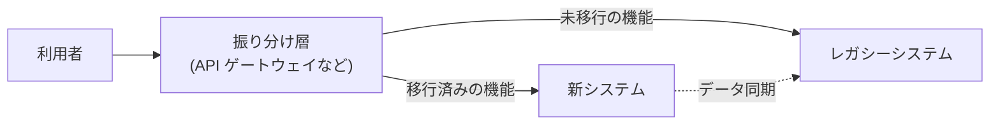

# 14.2 技術戦略の立て方

> 「クラウドネイティブ化を推進し、AI を活用して、開発生産性を最大化する」。こうした文章は技術戦略のように見えますが、何を選び、何を捨てるのかが書かれていません。この章では、事業の課題から出発して技術の選択と投資配分を一貫させる方法を学び、Build／Buy／Partner の判断を数字と感度分析で検証できるようになります。

| 項目 | 内容 |
|---|---|
| 学習時間の目安 | 本文 4h ＋ 演習 5h |
| 前提となる章 | [14.1 CTOの役割](../01-role-of-cto/README.md)、[13.2 技術的意思決定と設計レビュー](../../13-technical-leadership/02-technical-decisions/README.md)、[8.5 リファクタリングと技術的負債](../../08-software-engineering/05-refactoring-and-tech-debt/README.md) |
| 演習 | [exercises/](exercises/)（Python）＋ 記述演習 |
| キーワード | 戦略のカーネル, 悪い戦略, 技術戦略文書, Wardley マップ, Build/Buy/Partner, TCO, 現在価値, 感度分析, 3つのホライズン, 技術レーダー, 舗装道路, 2025年の崖, 7R |

## この章のゴール

- [ ] Rumelt の「戦略のカーネル」（診断・基本方針・一貫した行動）を使って、良い戦略と悪い戦略を見分けられる
- [ ] 事業モデルと競争優位の源泉から、技術が差別化すべき領域とそうでない領域を特定できる
- [ ] 技術戦略文書の構成要素（現状・目指す姿・原則・賭け・ロードマップ・投資配分・指標・リスク）を説明し、2 ページの戦略を書ける
- [ ] Wardley マップ・SWOT・ケイパビリティマップを使って現状を分析できる
- [ ] Build／Buy／Partner を TCO（現在価値）・戦略的コントロール・撤退コストで比較し、感度分析で判断の頑健性を確かめられる
- [ ] 3 つのホライズン・技術レーダー・舗装道路を使って、投資の配分と「標準化と自律」のバランスを設計できる
- [ ] レガシー刷新の選択肢（7R）を理解し、段階的な移行計画を立てられる

## なぜ学ぶのか

技術戦略が弱い組織では、技術的な判断が「その時々の担当者の好み」と「目の前の締め切り」で決まります。一つひとつは合理的でも、積み重なると、誰も全体を説明できないシステムと、事業に効かない投資が残ります。

- **レガシーが事業の足かせになる**: 経済産業省は 2018 年 9 月の「DX レポート」で、複雑化・ブラックボックス化した既存システムが残り続けると、2025 年以降、最大で年 12 兆円の経済損失が生じる可能性があると指摘し、「2025 年の崖」と呼びました。個々のシステムの問題ではなく、何年にもわたって刷新の戦略を持たなかったことの帰結です。
- **「買った」技術の前提は変わる**: 2023 年 8 月、HashiCorp は Terraform などのライセンスを MPL 2.0 から、競合するサービスでの利用を制限する Business Source License（BSL）に変更しました。これを受けて、コミュニティは Linux Foundation の下で OpenTofu というフォークを立ち上げています。2024 年には Redis も同様の変更を行い、Valkey というフォークが生まれました。OSS や SaaS を選ぶときには、機能と価格だけでなく「条件が変わったときに抜け出せるか」まで評価しなければならないことを示す出来事です。
- **目標の羅列は戦略ではない**: Richard Rumelt は『良い戦略、悪い戦略』で、多くの組織の「戦略」が、実際には願望や目標の一覧にすぎず、直面している課題の診断も、何を選ばないかの判断も含んでいないと批判しています。技術組織の戦略文書にも、同じことがそのまま当てはまります。

CTO の仕事の中心は、限られた人と予算を、事業にとって最も効く場所に集中させることです。そのための道具が技術戦略です。

## 1. 戦略とは何か

### 1.1 目標は戦略ではない

Rumelt は、良い戦略の中核（カーネル）を 3 つの要素で説明しました。

| 要素 | 内容 | 技術戦略での問い |
|---|---|---|
| 診断（diagnosis） | 直面している状況を解釈し、最も重要な課題を特定する | 事業の成長を最も妨げている技術的な制約は何か |
| 基本方針（guiding policy） | 課題にどう取り組むかの大きな方向。何をしないかを含む | その制約を解くために、どこに集中し、何を諦めるか |
| 一貫した行動（coherent actions） | 方針を実行するための、互いに補強し合う具体的な行動 | 誰が、いつまでに、何をするか。行動どうしが矛盾していないか |

「診断」が弱いと、方針も行動も的外れになります。逆に、診断が鋭ければ、方針は自然に絞られます。

### 1.2 悪い戦略の兆候

Rumelt は悪い戦略の典型として、次のようなものを挙げています。技術組織での例を添えます。

| 兆候 | 技術組織での例 |
|---|---|
| 空疎な言葉（fluff） | 「次世代アーキテクチャへの変革により、圧倒的な開発生産性を実現する」 |
| 課題に向き合わない | 障害の多発が最大の問題なのに、戦略文書が新技術の導入計画だけでできている |
| 目標と戦略の混同 | 「デプロイ頻度を 3 倍にする」「障害を半減する」と目標を並べるだけで、どうやって達成するかがない |
| 悪い戦略目標 | 「マイクロサービス化」「AI 活用」「内製化」など、それ自体を目的にした項目が 15 個並び、優先順位がない |

### 1.3 良い技術戦略の例

架空の会社で比べてみましょう。中小企業向けの経費精算 SaaS「ケイヒ」（エンジニア 40 人）です。この章では、この会社を例として使い続けます。

**悪い例**:

> 当社はクラウドネイティブな技術基盤を構築し、マイクロサービス化と AI の活用を推進する。開発生産性を最大化し、世界水準の信頼性を実現する。

**良い例**:

> **診断**: 売上成長の次の柱は従業員 300 人以上の中堅企業だが、商談の 4 割が「承認ワークフローの柔軟性」と「会計ソフト連携の種類」で失注している。この 2 つは、単一のモノリスに条件分岐として継ぎ足してきたため、1 つの変更に平均 3 週間かかり、変更のたびに障害が起きている。
>
> **基本方針**: 今後 12 か月は「ワークフロー」と「連携」の 2 つの領域に技術投資を集中し、この 2 つを設定で拡張できる独立したモジュールに作り替える。それ以外の領域の刷新（モバイルアプリの作り直し、全面的なマイクロサービス化）は行わない。差別化に関係しない機能（認証、課金、帳票出力）は、自社開発をやめて外部サービスに置き換える。
>
> **一貫した行動**: ①ワークフローを設定駆動のエンジンに作り替える専任チームを置く（第 1〜2 四半期）。②会計ソフト連携をプラグイン方式にし、連携の追加を 3 週間から 3 日にする（第 2〜3 四半期）。③認証を IDaaS に移行し、浮いた 2 人をワークフローに回す。④変更のリードタイムと、中堅企業向け商談の失注理由を毎月計測する。

良い例では、診断が具体的な数字と事業の問題に結びついており、方針が「やらないこと」を明示し、行動どうしが互いを補強しています（③で人を生み出し、①に回す）。

## 2. 事業戦略と技術戦略をつなぐ

### 2.1 事業モデルから逆算する

技術戦略は、事業戦略の「下請け」ではありませんが、事業戦略から切り離すこともできません。まず、次の問いに事業の言葉で答えます。

- **誰に、何の価値を提供し、どう稼ぐのか**（顧客、提供価値、収益モデル）。
- **競合に対する優位の源泉は何か**（価格、品質、スピード、ネットワーク効果、データ、規制対応、顧客との関係）。
- **今後 1〜3 年で、事業は何を達成しなければならないか**（新市場、新製品、利益率の改善、上場など）。

そのうえで、技術がどこで優位の源泉になっているのか、なりうるのかを考えます。

| 事業モデル | 技術が差別化しやすい領域の例 | 標準品でよいことが多い領域の例 |
|---|---|---|
| マーケットプレイス | マッチング・検索・推薦、不正対策 | 決済、認証、メール配信 |
| BtoB SaaS | ドメイン固有のワークフロー、連携の幅、信頼性とセキュリティの証明 | 課金、ヘルプデスク、社内 IT |
| フィンテック | 与信・不正検知のモデル、規制対応の自動化 | 汎用的なインフラ |
| 製造業の DX | 設備データの収集と分析、現場の業務知識を組み込んだアプリ | 会計・人事などの基幹業務 |

### 2.2 差別化するもの・しないもの

Geoffrey Moore は、企業の活動を、競争優位を生む **コア（core）** と、それ以外の **コンテキスト（context）** に分けて考えることを提唱しました。技術に当てはめると、原則は単純です。

- **コア**: 自社で作り、最高の人材を配置し、継続的に投資する。ここを外部に委ねると、競争優位そのものを手放すことになる。
- **コンテキスト**: 標準的な製品・サービスを使い、コストと手間を最小化する。自社で作り込んでも顧客は対価を払わない。

ただし、コアとコンテキストの境界は時間とともに動きます。かつて差別化要因だった技術も、やがて誰もが買える製品になります（次節の Wardley マップの「進化」）。

### 2.3 データと AI の戦略

データと AI は、多くの事業でコアとコンテキストの両方にまたがります。汎用的な AI の機能は API として買える一方で、自社にしかないデータと、それを業務に組み込む仕組みは差別化の源泉になりえます。技術戦略には少なくとも、どのデータを資産として蓄積・整備するのか、AI をどの業務・機能に使い、どこには使わないのか、そのリスクをどう管理するのかを含めます。詳しくは [14.8 AI戦略とAIガバナンス](../08-ai-strategy/README.md) と第 12 部で扱います。

## 3. 技術戦略文書の構成

### 3.1 構成要素

技術戦略文書に含める要素と、よくある書き方の誤りを示します。

| 要素 | 書くこと | よくある誤り |
|---|---|---|
| 現状（診断） | 事業の課題と、それを妨げている技術的な制約。数字で | 技術の不満の羅列 |
| 目指す姿（ビジョン） | 2〜3 年後に技術組織とシステムがどうなっているか | 流行語で飾った抽象的な文章 |
| 原則 | 判断に迷ったときの優先順位。トレードオフを含む | 誰も反対しない当たり前の文（「品質を重視する」） |
| 賭け（bets） | 不確実だが大きな効果を狙う投資。仮説と撤退条件 | 撤退条件のない大型プロジェクト |
| ロードマップ | 四半期単位の主要なマイルストーン | 日付だけで、何が達成されるかがない |
| 投資配分 | 人と予算を領域ごとにどう配分するか | 配分がなく、すべてが最優先 |
| 指標 | 戦略が効いているかを測る先行指標と遅行指標 | 活動量（プロジェクト数）だけを測る |
| リスク | 戦略の前提が崩れる可能性と、その兆候 | リスク欄が空、または一般論 |

### 3.2 原則はトレードオフを含めて書く

良い原則は、**反対の立場も成り立つ** 選択を明示します。「品質を重視する」は誰も反対しないので、判断の役に立ちません。

| 役に立たない原則 | 役に立つ原則 |
|---|---|
| セキュリティを重視する | 顧客データに触れる変更では、リリース速度よりセキュリティレビューを優先する |
| 技術選定は慎重に行う | 新しい言語・データストアの導入は、舗装道路で代替できないことを示せた場合に限る |
| チームの自律性を尊重する | チームはライブラリとフレームワークを自由に選べるが、ログの形式・認証・デプロイ方法は全社標準に従う |
| 顧客第一 | 大口顧客 1 社のための個別開発は、他の顧客にも提供できる形でしか行わない |

### 3.3 Will Larson の書き方: 設計文書から積み上げる

戦略文書を白紙から書こうとすると、抽象的な言葉が並びがちです。Will Larson は、次のように **具体から抽象へ積み上げる** 方法を提案しています（ブログ記事 "Write five, then synthesize" や著書『スタッフエンジニア』（日経BP）で紹介されています）。

1. 重要な技術判断について、設計文書を書く（あるいは、最近の判断が実際にどう下されたかを書き出す）。
2. 5 つほど集まったら、それらに共通する判断の基準を抜き出す。それが **戦略** になる。
3. 戦略が 5 つほど集まったら、それらを 2〜3 年先に延長して描く。それが **ビジョン** になる。

この方法の利点は、戦略が現実の判断に根ざすことです。「実際にはこう判断している」という記述から出発するので、机上の空論になりにくく、現場の納得も得やすくなります。

### 3.4 長さと読者

経営陣と取締役会向けには **2 ページ以内の要約版**、エンジニア向けには原則・技術レーダー・標準の詳細を含む **詳細版** を用意します。要約版は、事業の言葉だけで読めるように書きます（[14.4](../04-executive-communication/README.md)）。

## 4. 分析ツール

### 4.1 Wardley マップ

Simon Wardley が考案した **Wardley マップ** は、事業を支える構成要素を 2 つの軸で配置する地図です。

- **縦軸（可視性・価値連鎖）**: 上ほど利用者に見える（利用者のニーズに近い）。下ほど利用者から見えない基盤。
- **横軸（進化）**: 左から **Genesis（誕生）→ Custom-built（特注）→ Product（製品、レンタルを含む）→ Commodity（汎用品、ユーティリティを含む）**。すべての構成要素は、競争によって右へ進化していく。

ケイヒ（経費精算 SaaS）の簡略化したマップを、行を可視性、列を進化の段階とした表で描きます（Wardley マップでは横の位置そのものに意味があるので、位置を正確に示せる形にしています）。

| 可視性 ＼ 進化 | Genesis（誕生） | Custom-built（特注） | Product（製品） | Commodity（汎用品） |
|---|---|---|---|---|
| 高（利用者に見える） | | 承認ワークフロー | 経費申請の画面 | |
| 中 | 不正・重複の検知 | 会計ソフト連携 →、電子帳簿保存法への対応 | 領収書の読み取り → | |
| 低（基盤） | | | 認証、課金・請求、AI モデル（API） | クラウド基盤 |

「→」は、右（次の段階）へ進化しつつあることを表します。利用者のニーズは「経費精算を早く正確に終える」で、依存関係は次のとおりです。

- 利用者のニーズ → 経費申請の画面、承認ワークフロー
- 経費申請の画面 → 領収書の読み取り、電子帳簿保存法への対応、認証
- 領収書の読み取り → AI モデル（API）
- 承認ワークフロー → 会計ソフト連携、不正・重複の検知
- すべての構成要素 → クラウド基盤（課金・請求は、利用者ではなく事業者の側から見た構成要素）

各構成要素から読み取れることを整理します。

| 構成要素 | 進化の段階 | 読み取れること |
|---|---|---|
| 承認ワークフロー（中堅企業向けの柔軟性） | Custom-built | 差別化の源泉。自社で作り、投資を集中する |
| 会計ソフト連携 | Custom-built → Product | 連携先の多さが競争軸。作り方を「追加しやすい形」に変える |
| 不正・重複の検知 | Genesis → Custom-built | 将来の差別化候補。小さく探索する |
| 領収書の読み取り | Product（急速に Commodity へ） | 汎用の AI API で十分な精度が出る方向へ進化中。自社開発の OCR は捨てる判断を検討 |
| 電子帳簿保存法への対応 | Custom-built | 規制対応は必須だが差別化にはなりにくい。確実性を優先 |
| 認証、課金・請求 | Product | 買う。自社開発を続ける理由はない |
| クラウド基盤 | Commodity | ユーティリティとして使う |

Wardley マップの価値は、**「進化の段階に合わない作り方」を見つけられる** ことです。汎用品になった領域を特注で作り続けていたり（例: 認証の自社開発）、誕生段階の不確実な領域に、製品の段階向けの厳格な計画と管理を持ち込んでいたりするのが典型的なずれです。段階ごとに適した進め方も違います（誕生段階は探索と実験、製品の段階は継続的な改善、汎用品は外部調達とコスト最適化）。

### 4.2 SWOT

SWOT（強み Strengths・弱み Weaknesses・機会 Opportunities・脅威 Threats）は、状況を短時間で整理するのに便利ですが、**一覧を作っただけでは戦略になりません**。内部要因（強み・弱み）と外部要因（機会・脅威）を掛け合わせ、「強みを機会にどう使うか」「弱みが脅威と重なる場所をどう守るか」という選択肢に変換して初めて役に立ちます（この掛け合わせを TOWS 分析と呼ぶこともあります）。

### 4.3 ケイパビリティマップ

**ケイパビリティマップ** は、事業に必要な能力（受注する、請求する、顧客を支援する、など）を一覧にし、それぞれについて「差別化の度合い」と「現在の成熟度」を評価したものです。「差別化の度合いが高いのに成熟度が低い」能力が、投資を集中すべき場所です。システムの構成図ではなく事業の能力で整理するので、経営陣と議論しやすいのが利点です。

## 5. Build／Buy／Partner の判断

### 5.1 判断の軸

| 軸 | 問い |
|---|---|
| 差別化 | これはコアか、コンテキストか。自社で作ることが競争優位につながるか |
| TCO | 数年間の総コスト（現在価値）はどれが小さいか |
| 市場投入までの時間 | どれが最も早く価値を届けられるか |
| 戦略的コントロール | ロードマップ・データ・価格の決定権を誰が持つか |
| 統合のコスト | 既存システムとの連携、データの移行、運用の手間 |
| 撤退コスト | 条件が変わったとき（値上げ、ライセンス変更、サービス終了）に乗り換えられるか |
| リスク | 提供元の経営の安定性、セキュリティ、特定の人への依存 |
| 組織の能力 | 自社で作り、運用し続ける人材と意欲があるか |

ここでいう **Partner** は、開発会社や SIer に構築・運用を委託し、自社は要件定義と受け入れに集中する形態を指します。共同開発や事業提携も含まれます。

### 5.2 TCO の構成要素

TCO（Total Cost of Ownership、総保有コスト）は、導入時の費用だけでなく、使い続け、やめるまでの費用をすべて含みます。

| 区分 | Build | Buy | Partner |
|---|---|---|---|
| 初期費用 | 開発の人件費、設計・テスト | 導入・設定、データ移行、既存システムとの連携開発 | 委託開発費、要件定義・受け入れの社内工数 |
| 継続費用 | 保守・運用の人件費、インフラ、法改正への対応 | ライセンス・利用料（値上げと従量増を含む）、社内の管理者 | 保守・運用の委託費、社内の窓口 |
| 撤退費用 | 作り直し・移行 | データの持ち出しと変換、再連携、契約の違約金 | 引き継ぎ、作り直し、ソースコードや権利の扱い |
| 見落としやすい費用 | 採用と教育、特定の人への依存 | 利用者数・取引量に比例した増額、上位プランへの強制移行 | 仕様変更のたびの追加費用、ベンダーの担当者交代 |

### 5.3 時間の価値: 現在価値で比べる

「5 年間の合計」をそのまま比べると、**お金を払う時期の違い** が無視されます。今の 1,000 万円と 5 年後の 1,000 万円は同じ価値ではありません。今のお金は、他の投資に回せば増やせるからです。将来の金額を今の価値に直すことを **割引** と呼び、t 年後の金額 C の **現在価値（present value）** は `C / (1 + r)^t` です。r は **割引率** で、会社が資金を調達するコストや、投資に求める最低限の利回りをもとに財務部門と決めます。

```python
for r in (0.0, 0.05, 0.08, 0.12):
    print(f'割引率 {r:4.0%}: 5年後の1,000万円の現在価値 = {1000/(1+r)**5:6.1f} 万円')
```

```text
割引率   0%: 5年後の1,000万円の現在価値 = 1000.0 万円
割引率   5%: 5年後の1,000万円の現在価値 =  783.5 万円
割引率   8%: 5年後の1,000万円の現在価値 =  680.6 万円
割引率  12%: 5年後の1,000万円の現在価値 =  567.4 万円
```

初期費用が大きい案（Build）は割引の恩恵を受けにくく、費用が後年に偏る案（値上げが続く Buy）は割引で相対的に有利になります。NPV（正味現在価値）や IRR（内部収益率）といった投資判断の道具は [14.3 事業と財務のリテラシー](../03-business-and-finance/README.md) で詳しく扱います。

### 5.4 数値例: 請求・課金基盤

ケイヒが、サブスクリプションの課金・請求書発行・入金消込の基盤をどうするかを検討しているとします。5 年間・割引率 8%・単位は万円です。

| 項目 | Build（自社開発） | Buy（課金 SaaS） | Partner（開発会社に委託） |
|---|---|---|---|
| 初期費用 | 5,000（開発） | 1,500（導入・移行・連携） | 3,500（委託開発） |
| 社内人員 | 1.5 人年/年 | 0.5 人年/年 | 0.5 人年/年 |
| 1 人年のフルロードコスト | 1,200（年 3% 上昇） | 同左 | 同左 |
| ライセンス・委託費 | なし | 1,300/年、**年 20% 増**（売上連動の従量課金） | 1,800/年、年 3% 増 |
| インフラ | 150/年 | 込み | 込み |
| 撤退費用（5 年目） | 1,000 | 2,500 | 2,000 |

演習で実装する `tco.py`（解答例）で計算した結果です。

```text
Build    年次コスト [5000, 1950, 2004, 2060, 2117, 3176]  単純合計 16,306
Buy      年次コスト [1500, 1900, 2178, 2509, 2902, 5871]  単純合計 16,860
Partner  年次コスト [3500, 2400, 2472, 2546, 2623, 4701]  単純合計 18,242

Buy      TCO（現在価値） 13,247
Build    TCO（現在価値） 13,876
Partner  TCO（現在価値） 14,990
```

単純合計では Build が最も安いのに、現在価値では Buy が最も安くなっています。Buy のコストが後年に偏っているためです。そして差は約 5% しかありません。この程度の差は、入力の見積もりが少しずれるだけで簡単に逆転します。ここで必要なのが感度分析です。

### 5.5 感度分析とトルネード図

**感度分析** では、不確かな入力を 1 つずつ、ありうる下限と上限に動かし、結論がどれだけ変わるかを調べます。影響の大きい順に横棒を並べると竜巻（トルネード）のような形になるので、**トルネード図** と呼ばれます。ここでは「基準ケースで最良の案（Buy）が、次善の案に対してどれだけ有利か（マージン）」を出力にしています。マージンが負になれば判断が逆転します。

```text
Buy.license_escalator        0.05 .. 0.35     ############################## マージン     2449 .. -1736     <- 逆転あり
Build.fte                       1 .. 2.5      ##########################     マージン    -1903 .. 1743      <- 逆転あり
Buy.exit_cost                1000 .. 5000     ####################           マージン     1650 .. -1072     <- 逆転あり
Build.upfront                3500 .. 8000     ###################            マージン     -871 .. 1743      <- 逆転あり
discount_rate                0.04 .. 0.12     #######                        マージン      102 .. 1058    
Partner.license              1400 .. 2200     ####                           マージン       55 .. 629     

Buy のライセンス料の年上昇率が 24.4% を超えると Buy は最良でなくなる
Build の運用人員が 1.38 人年/年 を下回ると Build が最良になる
```

この結果から、判断に必要な次の行動が見えてきます。

1. **最も効いているのは Buy の料金の上昇率**。上昇率が約 24% を超えると Buy は最良でなくなる。したがって、契約交渉で **値上げの上限（例: 年 10% まで）を固定できれば、最大の不確実性を消せる**。技術の議論ではなく、契約の議論で判断が決まる。
2. **次に効いているのは Build の運用人員**。1.38 人年/年を下回るなら Build が有利になる。ただし、課金基盤は税制や会計の変更（インボイス制度など）への対応が継続的に発生する領域なので、少ない人員で運用できるという見積もりには慎重であるべきだ。
3. **割引率はほとんど結論を変えない**。割引率の議論に時間を使う必要はない。

そして数字が僅差なら、最後は定性的な軸で決めます。課金はケイヒにとってコンテキストなので、戦略的には Buy が自然です。ただし撤退費用が大きい（ロックイン）ことを踏まえ、「請求データを定期的に自社のデータ基盤へエクスポートする」「値上げ上限と解約時のデータ提供を契約に入れる」を条件にする、というのが筋の良い結論になります。

モデルは簡略化しています（税・減価償却・残存価値は考えていない）。目的は正確な予測ではなく、**どの前提が結論を左右するのかを明らかにし、検証や交渉の優先順位を決めること** です。

### 5.6 定性的な要因を見落とさない

- **ライセンスの変更**: OSS でも、提供元がライセンスを変えることがあります。HashiCorp（2023 年、MPL 2.0 → BSL）や Redis（2024 年、BSD → 独自のソース公開型ライセンス RSALv2 と SSPL の選択制。2025 年の Redis 8 で AGPLv3 を選択肢に追加）の例のように、条件は変わりえます。重要な依存先については、フォークの有無、代替製品、バージョンの固定で逃げ道を用意しておきます（ライセンスの詳細は [14.5](../05-governance-risk-compliance/README.md)）。
- **SaaS の値上げとプラン変更**: 利用者数や取引量に比例する料金体系は、事業が成長するほどコストも増えます。成長計画を入れて試算してください。
- **自社開発の隠れたコスト**: 作った人が辞めると、誰も保守できないシステムが残ります。自社開発を選ぶなら、それを長期に保守できるチームを持ち続ける覚悟が必要です。
- **データの主導権**: 顧客データや業務データを外部サービスに預けるとき、エクスポートの手段・形式・頻度を契約と実装の両方で確保しておきます。

## 6. ポートフォリオ・標準化・プラットフォーム

### 6.1 3 つのホライズン

McKinsey のコンサルタントらが著書 "The Alchemy of Growth"（1999 年）で示した **3 つのホライズン** は、投資を時間軸で分ける考え方です。

| ホライズン | 内容 | 技術投資の例 | 管理の仕方 |
|---|---|---|---|
| H1: 中核事業 | 今の売上と利益を支える事業の維持・改善 | 既存製品の機能改善、信頼性、コスト削減 | 計画と効率。予算と納期で管理する |
| H2: 成長事業 | 次の成長を担う、立ち上がりつつある事業 | 新市場向けの製品、新しいプラットフォーム | 成長の指標で管理し、柔軟に資源を追加する |
| H3: 将来の選択肢 | まだ不確実な、将来の事業の芽 | 新技術の検証、プロトタイプ、研究 | 小さな賭けを複数。学びと撤退条件で管理する |

配分の目安として、70/20/10（中核・成長・将来）がよく引き合いに出されます。これは唯一の正解ではなく、事業の状況（中核事業が衰退しつつあるなら H2・H3 を厚くする）によって変えます。重要なのは、配分を **意図して決め、実績を測る** ことです。何も決めないと、目の前の H1 の要求がすべての時間を吸い込みます。

### 6.2 技術投資の配分

エンジニアリングの時間についても、配分を決めて可視化します。

| 区分 | 内容 | ケイヒの配分例 |
|---|---|---|
| 新機能 | 事業のロードマップ | 50% |
| 運用・維持（KTLO: Keep The Lights On） | 障害対応、問い合わせ、法改正対応、依存関係の更新 | 20% |
| 技術的負債の返済 | 変更を遅くしている箇所の改善 | 15% |
| プラットフォーム | 開発者体験、CI/CD、オブザーバビリティ | 10% |
| 探索 | 新技術の検証 | 5% |

実績を四半期ごとに測ると、「運用・維持が 40% に膨らんでいて、新機能に回せていない」といった事実が見えます。その事実こそが、経営陣に技術投資を説明する最も強い材料になります。

### 6.3 技術レーダー

Thoughtworks は、技術の評価を 4 つの段階（リング）で示す **Technology Radar** を定期的に公開しています。自社版の技術レーダーを作ると、技術選定の方針を組織全体で共有できます。

| リング | 意味 | ケイヒの例 |
|---|---|---|
| Adopt（採用） | 標準として使う。新規開発ではこれを選ぶ | PostgreSQL、TypeScript、OpenTelemetry |
| Trial（試行） | 本番の限られた範囲で使ってみる | ワークフローエンジンの設定駆動化 |
| Assess（評価） | 調査・検証する価値がある | LLM による仕訳の自動提案 |
| Hold（保留） | 新規の採用はしない。既存の利用は計画的に減らす | 自社開発の OCR、独自のジョブキュー |

運用のポイントは、更新の頻度（四半期や半期）と、誰が決めるのか（アーキテクチャ評議会など）を決めること、そして各項目に判断の理由を 1〜2 文で添えることです。理由のない「Hold」は、現場の反発を招きます。

### 6.4 標準化と自律: 舗装道路

チームの自律性を尊重すると、技術がばらばらになり、運用・セキュリティ・人の異動のコストが増えます。逆に標準を強制しすぎると、現場の判断力と意欲が失われます。

この緊張を解く考え方が、Netflix の **舗装道路（paved road）** や Spotify の **ゴールデンパス（golden path）** です。推奨される技術の組み合わせを、テンプレート・ライブラリ・CI/CD・監視まで含めて「最も楽な道」として整備します。舗装道路を外れることは禁止しませんが、外れたチームは、その運用を自分で引き受けます。

| 全社で標準化するもの | チームに任せるもの |
|---|---|
| 認証・認可、秘密情報の管理 | 言語内のライブラリ、フレームワークの細部 |
| ログ・メトリクス・トレースの形式 | コードの構成、テストの書き方の細部 |
| デプロイの方法、本番環境へのアクセス | チーム内の開発プロセス |
| データの分類と取り扱い、API の設計規約 | 担当領域内の技術的な実験（技術レーダーの範囲で） |

基準は「**その選択の影響がチームの外に及ぶかどうか**」です。影響が外に及ぶもの（セキュリティ、運用、データ、他チームとの接点）は標準化し、チーム内で閉じるものは任せます。

### 6.5 プラットフォーム戦略

社内プラットフォーム（開発基盤、データ基盤、共通の認証・課金など）は、**利用者（社内の開発チーム）を顧客とするプロダクト** として運営します。プラットフォームチームへの投資が見合うのは、複数のチームが同じ問題を別々に解いている重複が大きくなったときです。チーム数が少ないうちに大きなプラットフォームを作ると、利用者のいない基盤の保守に人が取られます。チームの形との関係は [13.6 チームと組織の設計](../../13-technical-leadership/06-team-and-org-design/README.md) を参照してください。

外部に向けたプラットフォーム戦略（API の公開、連携のエコシステム、マーケットプレイス）は、事業モデルそのものに関わる判断です。ケイヒの「会計ソフト連携のプラグイン化」は、将来、外部の開発者が連携を作れるエコシステムへ育てる選択肢を残しています。

## 7. レガシー刷新

### 7.1 2025 年の崖とその後

前述の DX レポート（2018 年）は、レガシーシステムが DX の足かせになっていると指摘しました。2025 年を過ぎた今も、多くの企業で刷新は途上にあります。レガシー刷新の難しさは技術よりも、**仕様を知る人がいない、業務がシステムの挙動に依存している、刷新しても売上は増えないので投資の説明が難しい** という点にあります。

### 7.2 移行の 7 つの選択肢（7R）

クラウド移行の文脈では、移行方法を 7 つの「R」に分類する整理が広く使われています（AWS が Gartner の 5R を拡張したものとして知られています）。レガシー刷新全般の選択肢としても使えます。

| 選択肢 | 内容 | 向いている場合 | 注意点 |
|---|---|---|---|
| Retire（廃止） | 使われていない機能・システムをやめる | 利用実態がほとんどない | 最も安く効果が大きい。まず棚卸しから |
| Retain（維持） | 当面そのまま残す | 移行の効果が小さい、近く廃止予定 | 「維持」と決めることで判断の先送りと区別する |
| Rehost（そのまま移す） | 変更せずにクラウドの仮想マシンへ移す | データセンターの撤退期限がある | 運用コストが下がらないことが多い |
| Relocate（基盤ごと移す） | 仮想化基盤ごとクラウドへ移す | 大量の仮想マシンを短期間で移したい | Rehost と同じく、アプリの課題は残る |
| Repurchase（買い替え） | SaaS やパッケージに置き換える | コンテキスト領域の業務システム | 業務をパッケージに合わせる覚悟が要る |
| Replatform（部分的に最適化） | DB をマネージドサービスにするなど一部を変える | 少ない変更で運用負荷を下げたい | 範囲が膨らまないよう管理する |
| Refactor / Re-architect（作り直し） | アーキテクチャを変えて作り直す | 差別化の源泉で、変更の速さが事業に効く | 最も高コストで高リスク。段階的に進める |

システム全体に 1 つの選択肢を当てはめるのではなく、**構成要素ごとに選ぶ** のが基本です。差別化の源泉だけを Refactor し、コンテキストは Repurchase、使われていない機能は Retire する、という組み合わせになります（Wardley マップがここで役に立ちます）。

### 7.3 段階的に移行する

全面的な作り直しを一度に切り替える **ビッグバン移行** は、長期間価値を生まず、仕様の漏れが切り替えの瞬間に一斉に表面化するため、失敗しやすいことが知られています。代わりに、Martin Fowler が **ストラングラーフィグ（strangler fig）** と名付けたパターンのように、新しいシステムを古いシステムの周囲に少しずつ育て、機能単位で置き換えていきます（[8.5](../../08-software-engineering/05-refactoring-and-tech-debt/README.md)、[9.2](../../09-architecture/02-architecture-styles/README.md)）。



日本のレガシー刷新では、次の点も計画に含めます。

- **仕様の復元**: 設計書が現行の挙動と一致しないことが多い。現行システムの入出力を記録し、新旧を並行稼働させて結果を比較する（並行稼働比較）。
- **ベンダーとの契約**: 保守契約の期限、ソースコードと権利の扱い、移行期間中の保守体制を確認する。
- **業務部門の合意**: 「今と同じ動き」を要求されると、刷新の意味がなくなる。業務の見直しを刷新の目的に含め、経営が後押しする。

### 7.4 刷新の投資をどう説明するか

レガシー刷新は、売上を直接増やさないので説明が難しい投資です。次の 4 つの観点で、事業への効果を数字にします（[14.3](../03-business-and-finance/README.md)）。

- **コスト**: 保守費・ライセンス費・インフラ費の削減。
- **スピード**: 変更のリードタイムの短縮が、どの事業施策を何か月早めるか。
- **リスク**: 保守ベンダーの撤退、サポート切れ、担当者の退職、障害による損失の期待値。
- **機会**: 新しい事業施策（データ活用、他社連携など）が可能になること。

## 8. 戦略を展開し、見直す

### 8.1 展開する

戦略は、書いただけでは実行されません。

- **伝える**: 経営陣への説明、全社への説明会、質疑応答の文書化。「なぜこの方針なのか」と「何をしないのか」を繰り返し伝える。
- **判断に使う**: 設計レビュー・技術選定・予算の議論で、戦略の原則を引用して判断する。戦略に沿わない提案に「No」と言うときの根拠にする。
- **計画に落とす**: 四半期の目標とロードマップに、戦略の行動を組み込む。
- **記録する**: 重要な判断を ADR（アーキテクチャ決定記録）として残し、戦略との関係を書く。

### 8.2 見直す

| 頻度 | 内容 |
|---|---|
| 四半期ごと | 指標の確認、賭けの継続・撤退の判断、技術レーダーの更新 |
| 年に 1 回 | 診断の見直しと戦略の改訂。事業計画・予算策定と同期させる |
| 随時 | 前提が崩れたとき（市場の急変、大型の M&A、重大事故、主要技術のライセンス変更） |

見直しで最も大切なのは、**賭けの撤退条件を実際に使うこと** です。「3 か月で検証指標が基準に届かなければやめる」と書いておきながら続けてしまうと、戦略全体の信頼が失われます。

## よくある落とし穴

1. **目標の一覧を戦略と呼ぶ**。「生産性を 2 倍、障害を半減」は目標であって戦略ではありません。診断と、何をしないかを含む方針がなければ、資源は分散したままです。
2. **流行の技術を戦略の中心に置く**。「マイクロサービス化」「AI 活用」は手段です。どの事業課題を解くための手段なのかを診断から説明できないなら、戦略に入れるべきではありません。
3. **すべてを自社で作る（または、すべてを外に出す）**。コアとコンテキストの区別なく一律に判断すると、差別化にならない領域に人を取られるか、差別化の源泉を手放すことになります。構成要素ごとに判断します。
4. **TCO を単純合計や初期費用だけで比べる**。お金を払う時期、値上げ、撤退費用、社内の人件費を入れないと、判断が逆になることがあります。僅差なら感度分析で、どの前提が結論を左右するかを確かめます。
5. **感度分析の結果を「交渉」と「検証」に使わない**。最も効いている入力が分かったら、契約（値上げの上限）や検証（プロトタイプで人員の見積もりを確かめる）で、その不確実性を減らしに行きます。
6. **ビッグバン移行を選ぶ**。長期間価値を生まず、切り替え時にリスクが集中します。機能単位で段階的に置き換え、各段階で価値を出します。
7. **標準化を命令で進める**。舗装道路を「最も楽な道」として整備せずに標準を強制すると、現場は抜け道を作ります。標準化するのは、影響がチームの外に及ぶものに絞ります。
8. **戦略を書いて終わる**。判断の場で引用されず、四半期ごとに見直されない戦略は、半年で忘れられます。

## 演習

コード演習は [exercises/tco.py](exercises/tco.py) にあります。関数の docstring に仕様が書いてあるので、`raise NotImplementedError(...)` を実装に置き換えてください。解答例は [solutions/tco.py](solutions/tco.py) にあります（`python3 solutions/tco.py` を実行すると、本文 5.4〜5.5 節の出力を再現できます）。

```bash
python3 tools/check.py 14.2        # リポジトリのルートで実行
python3 tools/check.py -v 14.2     # 詳しい出力
```

| # | 難易度 | 内容 | 対象 |
|---|---|---|---|
| 1 | ★☆☆ | 現在価値と、人件費・ライセンス料の上昇を含む年次コスト | `present_value`, `annual_costs` |
| 2 | ★★☆ | TCO（現在価値）の計算と選択肢の順位づけ | `total_cost_of_ownership`, `rank_options` |
| 3 | ★★☆ | トルネード型の感度分析と、判断が逆転する境界値（二分法） | `tornado`, `break_even` |
| 4 | ★★☆ | 記述: Wardley マップを描いて戦略的な示唆を読み取る | — |
| 5 | ★★★ | 記述: Rumelt のカーネルで 2 ページの技術戦略を書く | — |

### 演習 4（記述）: Wardley マップ

社会人向けの資格講座をオンラインで提供する会社（受講者 5 万人、エンジニア 15 人）の Wardley マップを描いてください。利用者のニーズは「忙しい中でも、確実に資格試験に合格する」です。構成要素の候補は次のとおりです（過不足があれば調整してかまいません）。

講座動画、動画配信、問題演習エンジン、学習進捗の分析、AI による質問への回答、合格可能性の予測、決済、認証、クラウド基盤、講師による添削

1. 各構成要素を、可視性（高・中・低）と進化の段階（Genesis／Custom-built／Product／Commodity）で表に整理する（ASCII 図や Mermaid で描いてもよい）。
2. 依存関係を書く。
3. マップから読み取れる戦略的な示唆を 3 つ以上書く（何を作り、何を買い、何を探索するか。今後 2〜3 年でどの構成要素が右に動きそうか）。

<details>
<summary>解答例</summary>

| 構成要素 | 可視性 | 進化の段階 | 依存先 |
|---|---|---|---|
| 講座動画（コンテンツ） | 高 | Custom-built | 動画配信 |
| 問題演習エンジン（出題・解説・弱点に応じた再出題） | 高 | Custom-built | 学習進捗の分析 |
| 講師による添削 | 高 | Custom-built（人手のサービス） | — |
| AI による質問への回答 | 高 | Genesis → Custom-built | AI モデル（API）、講座コンテンツ |
| 合格可能性の予測 | 中 | Genesis | 学習進捗の分析 |
| 学習進捗の分析 | 中 | Custom-built | クラウド基盤 |
| 決済 | 中 | Commodity | — |
| 認証 | 低 | Product → Commodity | — |
| 動画配信 | 低 | Commodity | クラウド基盤 |
| AI モデル（API） | 低 | Product（急速に進化中） | — |
| クラウド基盤 | 低 | Commodity | — |

| 可視性 ＼ 進化 | Genesis（誕生） | Custom-built（特注） | Product（製品） | Commodity（汎用品） |
|---|---|---|---|---|
| 高 | AI による質問への回答 → | 講座動画、問題演習エンジン、講師による添削 | | |
| 中 | 合格可能性の予測 | 学習進捗の分析 | | 決済 |
| 低 | | | AI モデル（API）→、認証 → | 動画配信、クラウド基盤 |

示唆の例:

1. **作る（投資を集中する）**: 問題演習エンジンと学習進捗の分析。合格という成果に最も直接効き、受講データが蓄積するほど精度が上がるため、他社が簡単にまねできない。
2. **買う**: 動画配信・決済・認証はすでに汎用品であり、自社で作る理由がない。動画配信を自前で運用しているなら、配信サービスへの移行を検討する。
3. **探索する**: AI による質問への回答と合格可能性の予測は Genesis〜Custom-built の段階にあり、不確実性が高い。小さな実験で効果（質問への回答の正確さ、学習時間の短縮、継続率）を測り、撤退条件を決めて進める。AI の誤回答が受験者に与える影響（誤った知識の定着）のリスク管理も必要。
4. **進化の予測**: AI による質問への回答は、汎用の AI 機能の進化によって 2〜3 年で製品の段階に近づく可能性が高い。汎用の回答機能そのものではなく、自社の講座・問題・受講データと組み合わせた部分に差別化を置く。講師による添削は、AI の支援で一部が効率化される一方、人の価値が残る部分（モチベーションの支援、答案の癖の指摘など）を見極める。

採点の観点:

- 進化の段階を「自社で作っているかどうか」ではなく、「市場で成熟しているかどうか」で判断しているか（自社開発していても、市場で汎用品になっていれば Commodity）。
- 示唆が「作る・買う・探索する」の具体的な判断につながっているか。
- 構成要素が時間とともに右へ動くことを踏まえ、今の差別化が将来も続くかを考えているか。

</details>

### 演習 5（記述）: 2 ページの技術戦略

次の会社の技術責任者として、Rumelt のカーネル（診断・基本方針・一貫した行動）に沿って、経営会議に提出する 2 ページ（2,000〜3,000 字程度）の技術戦略を書いてください。原則・指標・リスクも含めること。

> 中堅の物流会社（トラック 800 台、社員 2,000 人、IT 部門 12 人）。配車・運行管理システムは 20 年前に導入したオンプレミスのパッケージを大幅にカスタマイズしたもので、保守は導入元のベンダー 1 社に依存している。ベンダーの担当者の高齢化が進み、改修の見積もりは 1 件あたり数か月・数百万円かかる。2024 年 4 月からトラックドライバーの時間外労働に上限規制が適用され（いわゆる物流の 2024 年問題）、配車の効率化と労働時間の正確な管理が経営の最重要課題になっている。荷主からは、配送状況をリアルタイムで知りたいという要望が強い。経営陣は「AI で配車を最適化したい」と言っている。

<details>
<summary>解答例</summary>

**技術戦略（2026 年度〜2027 年度）: 配車と労働時間管理を自社でコントロールできる状態をつくる**

**1. 診断**

当社の最重要課題は、時間外労働の上限規制の下で、同じ車両・人員でより多くの荷物を運ぶことである。そのためには、①ドライバーごとの労働時間を正確に把握しながら配車を計画すること、②計画を日々改善すること、の 2 つが必要になる。

現在の配車・運行管理システムは、この 2 つのどちらも妨げている。労働時間のデータは紙の日報と Excel に分散しており、配車の計画に使えない。配車ロジックの変更は、1 社のベンダーに数か月・数百万円の改修を依頼しなければならず、改善のサイクルを回せない。さらに、ベンダーの担当者の高齢化により、数年以内に保守が続けられなくなるリスクがある。

「AI による配車の最適化」は魅力的だが、最適化の前提となる正確なデータ（車両の位置、荷物、労働時間）と、ロジックを素早く変えられるシステムがない現状では、効果を出せない。**課題の核心は、配車に関するデータとロジックの主導権を自社が持っていないことである**。

**2. 基本方針**

- 配車計画と労働時間管理を「当社の差別化の源泉」と位置づけ、データとロジックを自社でコントロールできる形にする。
- それ以外の領域（会計、人事・給与、車載端末、地図）は汎用の製品・サービスを使い、自社開発しない。
- 既存システムの全面置き換え（ビッグバン移行）は行わない。データの取得から始め、機能単位で段階的に移行する。
- AI による最適化は、データが揃った後の第 2 段階の賭けとして、小さく検証してから広げる。

**3. 一貫した行動**

| 時期 | 行動 | 成果の指標 |
|---|---|---|
| 2026 年度上期 | 全車両にデジタルタコグラフ連携の車載端末を導入し（Buy）、位置・運行・労働時間のデータをクラウドのデータ基盤に集約する | 労働時間の把握が日次・全ドライバーで可能になる |
| 2026 年度上期 | 荷主向けの配送状況の照会画面を、データ基盤の上に新たに作る（既存システムには手を入れない） | 荷主からの電話問い合わせ件数 |
| 2026 年度下期 | 配車計画の画面とロジックを新システムに移す（ストラングラーフィグ方式。まず 1 拠点で並行稼働） | 配車計画の作成時間、実車率 |
| 2027 年度 | 全拠点へ展開し、旧システムの配車機能を廃止する（Retire）。AI による配車提案を 1 拠点で試行する | 実車率、時間外労働の超過ゼロの維持、提案の採用率 |
| 通年 | 社内にプロダクトオーナー 1 名、エンジニア 4 名の配車チームをつくる（採用と、パートナー企業との準委任による混成チーム） | 配車ロジックの変更にかかる日数（数か月 → 2 週間） |

既存ベンダーとは、移行期間中の保守継続と、データの提供について早期に合意する。

**4. 原則**

- 配車と労働時間に関するデータとロジックは自社が持つ。それ以外は買う。
- 労働時間の規制を守ることは、配車の効率より常に優先する。
- 新しい機能は、既存システムの改修ではなく、データ基盤の上に作る。

**5. 投資と体制**: 2 年間で総額 X 億円（車載端末、データ基盤、配車システム開発、人材）。削減できる旧システムの保守費と、実車率の改善による効果で、N 年での回収を見込む（試算は別紙）。

**6. 主なリスクと対応**

- 既存ベンダーの協力が得られない → 契約上のデータ提供義務の確認、並行稼働期間の確保。
- 社内に人材が集まらない → パートナー企業との混成チームで開始し、段階的に内製比率を上げる。
- 現場（配車担当者）が新しい画面を使わない → 最初の拠点で配車担当者を開発に参加させ、業務を一緒に設計する。

採点の観点:

- **診断**: 「システムが古い」「AI を使いたい」という表面ではなく、事業課題（上限規制の下での輸送能力）と、それを妨げている根本原因（データとロジックの主導権がない）を特定できているか。
- **基本方針**: 何をしないか（ビッグバン移行、非差別化領域の自社開発、データのない AI）を明示しているか。経営陣の「AI で最適化したい」という要望を、否定せずに順序の中に位置づけているか。
- **一貫した行動**: 行動どうしがつながっているか（データ基盤 → 荷主向け画面 → 配車の移行 → AI の試行）。各行動に指標があるか。
- **組織と契約**: 内製化の体制づくりと、既存ベンダーとの関係の扱いに触れているか。
- **事業の言葉**: 経営会議の読者が、技術用語を知らなくても理解できるか。

</details>

## 理解度チェック

**Q1. Rumelt の「戦略のカーネル」の 3 つの要素を挙げ、「デプロイ頻度を 3 倍にし、障害を半減する」がなぜ戦略として不十分なのかを説明してください。**

<details>
<summary>解答</summary>

3 つの要素は、診断（最も重要な課題の特定）、基本方針（課題への取り組み方と、何をしないか）、一貫した行動（互いに補強し合う具体的な行動）です。

「デプロイ頻度を 3 倍にし、障害を半減する」は目標であり、①なぜ今それが重要なのか（事業のどの課題につながるのか）という診断がなく、②どうやって達成するのか、そのために何を諦めるのかという方針がなく、③具体的な行動もありません。目標の一覧は、資源をどこに集中させるかを決めてくれないので、戦略として機能しません。

</details>

**Q2. Wardley マップの横軸（進化）の 4 つの段階を挙げ、「進化の段階に合わない作り方」の例を 2 つ説明してください。**

<details>
<summary>解答</summary>

Genesis（誕生）、Custom-built（特注）、Product（製品）、Commodity（汎用品）です。

例:
- 認証や決済のように、すでに汎用品・製品として手に入る構成要素を、自社で特注し続けている。差別化にならないのに人と時間を使い続けることになる。
- 誕生段階の不確実な構成要素（新しい AI 機能など）に、製品の段階向けの詳細な計画・固定の予算・厳格な納期管理を当てはめる。不確実性の高い領域では、小さな実験と学習で進めるべきで、計画どおりに進めようとすると、効果の出ないものを作り込んでしまう。

</details>

**Q3. Build と Buy の TCO を比べるとき、単純合計ではなく現在価値で比べるのはなぜですか。本文の数値例で、単純合計と現在価値の結論が逆になった理由も説明してください。**

<details>
<summary>解答</summary>

お金を払う時期によって価値が違うからです。今のお金は他の投資に回して増やせるので、将来の同じ金額より価値が高い。現在価値は、将来の金額を割引率で割り引いて、今の価値にそろえて比べる方法です。

本文の例では、Build は初期費用（5,000 万円）が大きく、コストが前半に集中しています。Buy は初期費用が小さい代わりに、ライセンス料が年 20% ずつ増えるうえ、最終年に大きな撤退費用があり、コストが後半に偏っています。割引によって後年のコストほど小さく評価されるため、単純合計では Build が安かったのに、現在価値では Buy が安くなりました。

</details>

**Q4. 感度分析で「最も判断を左右する入力は Buy の料金の上昇率」と分かりました。CTO として次に何をすべきですか。**

<details>
<summary>解答</summary>

その不確実性を減らす行動をとります。この場合は技術の問題ではなく契約の問題なので、ベンダーとの交渉で値上げの上限（例: 年 10% まで）や、従量課金の単価の段階的な割引を契約に入れることを目指します。上限を固定できれば、Buy の TCO の最大のばらつきが消え、判断が安定します。

あわせて、逆転の境界値（本文では年約 24%）を把握しておき、事業計画の成長率から見て現実的に到達しうるかを財務部門と確認します。交渉で上限が取れない場合は、撤退しやすさ（データのエクスポート、解約条件）を確保する条件付きの Buy にするか、Build を再検討します。

</details>

**Q5. 3 つのホライズンとは何ですか。投資の配分を「意図して決める」ことが重要なのはなぜですか。**

<details>
<summary>解答</summary>

H1（今の売上を支える中核事業の維持・改善）、H2（立ち上がりつつある成長事業）、H3（まだ不確実な将来の選択肢）に投資を分ける考え方です。70/20/10 のような配分がよく引き合いに出されます。

配分を決めないと、日々の要求が最も強く聞こえる H1（既存顧客の要望、障害対応、目の前の締め切り）がすべての時間を吸い込み、H2・H3 への投資がゼロになります。その結果、数年後に中核事業が衰えたとき、次の成長の芽がありません。また、ホライズンごとに適した管理の仕方（H1 は計画と効率、H3 は学びと撤退条件）が違うため、分けて管理することで、それぞれを正しく評価できます。

</details>

**Q6. 舗装道路（paved road）の考え方を説明し、全社で標準化すべきものとチームに任せるものを分ける基準を答えてください。**

<details>
<summary>解答</summary>

舗装道路は、推奨される技術の組み合わせを、テンプレート・ライブラリ・CI/CD・監視まで含めて「最も楽な道」として整備する考え方です。外れることは禁止しませんが、外れたチームはその運用を自分で引き受けます。命令ではなく、便利さで標準に導くのがポイントです。

分ける基準は「その選択の影響がチームの外に及ぶかどうか」です。認証・秘密情報の管理、ログの形式、デプロイ方法、データの取り扱い、API の規約のように、セキュリティ・運用・他チームとの接点に影響するものは標準化します。チーム内で閉じるもの（ライブラリの細部、コードの構成、チーム内のプロセス）は任せます。

</details>

**Q7. レガシー刷新で「ビッグバン移行」が失敗しやすい理由と、代わりの進め方を説明してください。**

<details>
<summary>解答</summary>

ビッグバン移行は、完成して切り替えるまで長期間価値を生まないため、途中で事業の状況が変わったり予算が打ち切られたりしやすく、また仕様の漏れや業務との不整合が切り替えの瞬間に一斉に表面化して、大きな障害や業務の混乱につながります。

代わりに、ストラングラーフィグのように、振り分け層を置いて機能単位で新システムに移していきます。移行した機能から順に価値が出て、問題が起きても影響が限定されます。日本のレガシー刷新では、並行稼働による結果の比較で仕様を確かめること、既存ベンダーとの保守・データ提供の合意、業務部門との「業務の見直し」の合意も計画に含めます。

</details>

**Q8. OSS を採用するときに「ライセンス変更のリスク」を評価すべき理由を、実例を挙げて説明してください。どのような備えがありますか。**

<details>
<summary>解答</summary>

OSS でも、提供元がライセンスを変えることがあり、そうなると将来のバージョンを同じ条件で使えなくなるからです。2023 年に HashiCorp は Terraform などのライセンスを MPL 2.0 から BSL に変更し、2024 年には Redis が BSD からソース公開型のライセンスに変更しました（その後 2025 年に AGPLv3 を選択肢に追加）。いずれもコミュニティがフォーク（OpenTofu、Valkey）を立ち上げています。

備えとしては、重要な依存先について、①利用中のバージョンとライセンスを把握して固定する、②フォークや代替製品の存在と成熟度を確認しておく、③提供元の事業モデル（クラウド事業者との競合関係など）からライセンス変更の可能性を評価する、④自社の提供形態（SaaS か配布か）での影響を事前に法務と確認する、といったことがあります。

</details>

## さらに学ぶために

- Richard P. Rumelt『良い戦略、悪い戦略』（日本経済新聞出版）— 戦略のカーネル（診断・基本方針・一貫した行動）と悪い戦略の兆候を、豊富な事例で解説した定番書。技術戦略を書く前に必ず読みたい。
- Simon Wardley "Wardley Maps"（オンラインで無料公開）— Wardley マップの考案者自身による解説。進化の段階ごとの特性や、競争の中での打ち手まで詳しく書かれている。
- Will Larson "Crafting Engineering Strategy"（O'Reilly, 2025）— エンジニアリング戦略の書き方と展開を、実例とともに体系化した本。『スタッフエンジニア』（日経BP）の戦略の章も入門に適している。
- Thoughtworks "Technology Radar"（年 2 回程度公開）— 技術レーダーの実例。自社版を作るときの形式と、各技術の評価の書き方の参考になる。
- 経済産業省「DX レポート ～IT システム『2025 年の崖』の克服と DX の本格的な展開～」（2018 年）— 日本企業のレガシー問題の構造を整理した文書。刷新の必要性を経営に説明するときの背景資料になる。
- Mehrdad Baghai, Stephen Coley, David White "The Alchemy of Growth"（1999）— 3 つのホライズンの原典。
- AWS Prescriptive Guidance の移行戦略（7R）に関する文書 — 移行方法の選択肢と、それぞれの判断基準がまとまっている。

## まとめ

- 良い戦略は **診断・基本方針・一貫した行動** からなる。目標の一覧や流行語は戦略ではない。何をしないかを書くことが、資源を集中させる。
- 技術戦略は事業モデルと競争優位の源泉から逆算する。差別化の源泉（コア）には集中投資し、それ以外（コンテキスト）は標準品を使う。境界は時間とともに動く。
- 戦略文書は、現状・目指す姿・原則（トレードオフ付き）・賭け（撤退条件付き）・ロードマップ・投資配分・指標・リスクで構成する。具体的な設計判断から積み上げると、現実に根ざした戦略になる。
- Wardley マップで「進化の段階に合わない作り方」を見つけ、作る・買う・探索するを構成要素ごとに決める。
- Build／Buy／Partner は、撤退費用まで含めた TCO を **現在価値** で比べ、**感度分析** でどの前提が結論を左右するかを確かめる。最も効く不確実性は、交渉や検証で減らしに行く。
- 3 つのホライズンと技術投資の配分を意図して決め、技術レーダーと舗装道路で「標準化と自律」を両立させる。
- レガシー刷新は構成要素ごとに 7R から選び、ストラングラーフィグで段階的に進める。投資はコスト・スピード・リスク・機会の 4 つの観点で説明する。
