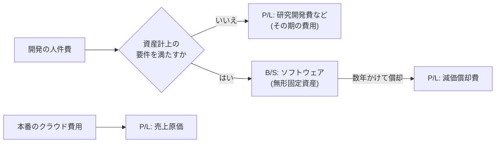

# 14.3 事業と財務のリテラシー

> 経営会議で CFO が「今期の粗利率が 3 ポイント下がった。原因はクラウド費用だ」と言ったとき、あなたはすぐに反論や対策を示せるでしょうか。この章では、財務三表の読み方から SaaS の指標、ソフトウェアの資産計上、人員計画とランウェイ、投資判断の道具までを、CTO が実際に使う形で身につけます。

| 項目 | 内容 |
|---|---|
| 学習時間の目安 | 本文 5h ＋ 演習 5h |
| 前提となる章 | [14.2 技術戦略の立て方](../02-technology-strategy/README.md)、[10.6 クラウドコスト管理（FinOps）](../../10-cloud-and-sre/06-finops/README.md) |
| 演習 | [exercises/](exercises/)（Python）＋ 記述演習 |
| キーワード | 損益計算書, 貸借対照表, キャッシュフロー計算書, 粗利率, ソフトウェアの資産計上, EBITDA, ARR/MRR, NRR/GRR, CAC, LTV, Rule of 40, バーンマルチプル, フルロードコスト, ランウェイ, NPV, IRR |

> **注意**: 会計・税務・労務に関する記述は、2026 年時点の一般的な解説です。制度は改正されることがあり、会社の状況によって扱いも異なります。具体的な判断は、公認会計士・税理士・社会保険労務士などの専門家に確認してください。

## この章のゴール

- [ ] 財務三表（P/L・B/S・C/F）の構造と相互の関係を説明し、エンジニアリングの活動がどの項目に現れるかを示せる
- [ ] SaaS の損益計算書で、売上原価・販管費・研究開発費の区分と粗利率を説明し、粗利率を動かす技術的な施策を挙げられる
- [ ] 日本の会計・税務におけるソフトウェアの資産計上の考え方と、それが営業利益・EBITDA・キャッシュに与える影響を説明できる
- [ ] MRR の増減分解・NRR/GRR・CAC・LTV・CAC 回収期間・Rule of 40・バーンマルチプルを計算し、解釈できる
- [ ] フルロードコストで人員計画を立て、月次バーンとランウェイを計算し、採用の遅れの影響を評価できる
- [ ] NPV・IRR・回収期間と遅延コストで技術投資を評価し、事業の言葉で提案できる
- [ ] クラウドやベンダーとの契約、為替、資金調達、ストックオプションに関する CTO としての論点を説明できる

## なぜ学ぶのか

技術組織は、多くの会社で最大の費用項目の 1 つです。エンジニアの人件費、クラウド費用、開発ツールや SaaS の利用料、業務委託費の多くは、CTO の判断で決まります。それなのに、財務の言葉が話せない CTO は、予算の議論で「高いのか安いのか」「なぜ必要なのか」を説明できず、技術投資の優先順位を他部門に決められてしまいます。

具体的な例を挙げます。

- **為替がクラウド費用を直撃する**: 主要なクラウドの料金表はドル建てです。1 ドル＝115 円前後だった 2022 年初めから、2024 年には一時 160 円前後まで円安が進みました。使用量がまったく同じでも、円換算の請求額は約 4 割増えたことになります。予算の前提に為替を入れていなければ、これは技術部門の「予算超過」として表面化します。
- **会計処理が利益の見え方を変える**: ソフトウェアの開発費を費用として処理するか、資産として計上するかで、同じ支出でもその年の営業利益は大きく変わります。現金の出入りはまったく同じです。この違いを理解していないと、「利益が出ているのに現金が足りない」という事態の原因を説明できません。
- **株式報酬の税務は変わりうる**: 2023 年、国税庁は、いわゆる信託型ストックオプションの権利行使による利益は給与所得として課税されるという見解を公表し、この仕組みを使っていた多くのスタートアップが対応を迫られました。エンジニアの報酬設計に関わる CTO にとって、財務と税務は他人事ではありません。

財務のリテラシーは、技術投資を通すための「交渉力」であり、会社を潰さないための「安全装置」です。

## 1. 財務三表とエンジニアリング

### 1.1 3 つの表が語ること

| 表 | 何を表すか | 一言でいうと |
|---|---|---|
| 損益計算書（P/L: Profit and Loss） | 一定期間の売上・費用・利益 | 儲かったか |
| 貸借対照表（B/S: Balance Sheet） | ある時点の資産・負債・純資産 | 何を持ち、何を負っているか |
| キャッシュフロー計算書（C/F） | 一定期間の現金の出入り（営業・投資・財務の 3 区分） | 現金は増えたか |

3 つは連動しています。P/L の当期純利益は B/S の純資産（利益剰余金）を増やし、C/F は B/S の現金の増減を説明します。

最も重要なのは、**利益と現金は一致しない** ということです。売上を計上しても入金が翌々月なら現金はまだ入っていませんし、ソフトウェアを資産計上すれば、支出した年の費用は小さく見えても現金は出ていきます。利益が出ていても現金が尽きれば会社は倒産します（いわゆる黒字倒産）。スタートアップの経営が現金（ランウェイ）で語られるのはこのためです。

### 1.2 エンジニアリングはどこに現れるか

| 活動・支出 | P/L | B/S | C/F |
|---|---|---|---|
| 本番環境のクラウド費用 | 売上原価（SaaS の場合） | — | 営業 CF の支出 |
| 開発・検証環境のクラウド費用 | 研究開発費や販管費 | — | 営業 CF の支出 |
| エンジニアの人件費（新機能の開発） | 費用処理なら研究開発費など | 資産計上ならソフトウェア（無形固定資産） | 費用処理なら営業 CF、資産計上なら投資 CF の支出 |
| エンジニアの人件費（運用・顧客サポート） | 売上原価に配賦することがある | — | 営業 CF の支出 |
| 資産計上したソフトウェアの償却 | 減価償却費 | ソフトウェアの簿価が減る | 現金の支出はない |
| クラウドの前払い（年間の確約など） | 期間の経過に応じて費用（使い切れなかった確約分も費用になる） | 前払費用 | 支払った時点で支出 |
| 年払いの SaaS 契約を顧客から受け取る | 1 か月ずつ売上 | 契約負債（前受金） | 受け取った時点で収入 |



年払いの契約が多い SaaS 企業は、売上よりも先に現金が入ってくるため、P/L が赤字でもキャッシュフローが比較的良い、ということが起こります。逆に、月払いで大企業向けに長い支払いサイトを受け入れていると、成長するほど運転資金が必要になります。

## 2. P/L の構造と SaaS の粗利

### 2.1 日本の損益計算書の構造

```text
売上高
− 売上原価
= 売上総利益（粗利）
− 販売費及び一般管理費（研究開発費を含むことが多い）
= 営業利益              ← 本業の儲け
± 営業外収益・費用（受取利息、支払利息、為替差損益など）
= 経常利益
± 特別利益・損失（固定資産の売却損益、減損損失など）
= 税引前当期純利益
− 法人税等
= 当期純利益
```

研究開発費は、日本の会計基準では発生時に費用として処理し、一般管理費または当期製造費用に含めます。SaaS 企業の管理会計では、販管費を **営業・マーケティング（S&M）**、**研究開発（R&D）**、**一般管理（G&A）** に分けて見るのが一般的です。

**EBITDA**（利払い・税金・減価償却前の利益）は、日本では簡便に「営業利益 ＋ 減価償却費（＋のれん償却費）」で計算されることが多く、設備投資や資産計上の方針の違いを除いて本業の稼ぐ力を比べるために使われます。

### 2.2 SaaS の P/L の例

年商 20 億円の BtoB SaaS 企業の例です（単位: 百万円）。

| 項目 | 金額 | 売上比 | 内訳の例 |
|---|---|---|---|
| 売上高 | 2,000 | 100% | サブスクリプション 1,900、導入支援 100 |
| 売上原価 | 500 | 25% | 本番のクラウド 220、カスタマーサポート 140、SRE・運用（配賦） 90、決済手数料など外部サービス 50 |
| **売上総利益（粗利）** | **1,500** | **75%** | |
| 営業・マーケティング | 900 | 45% | |
| 研究開発 | 550 | 27.5% | エンジニアの人件費、開発環境、開発ツール |
| 一般管理 | 300 | 15% | |
| **営業利益** | **−250** | **−12.5%** | |

この会社で、本番のクラウド費用を 3 割削減できれば（220 → 154）、売上原価は 434 に下がり、粗利率は 75% から約 78.3% に上がります。粗利率の改善は、そのまま営業利益の改善です。SaaS の粗利率は 70〜80% 程度が目安として語られることが多く、これを下回ると投資家から、事業の構造（サポートに人手がかかりすぎている、インフラの効率が悪い）を問われます。

### 2.3 技術の費用を売上原価と研究開発に分ける

同じエンジニアでも、何に時間を使ったかで費用の区分が変わります。

- **売上原価**: 顧客にサービスを提供し続けるための費用。本番環境のインフラ、SRE・運用、顧客対応のためのエンジニアの時間など。
- **研究開発費**: 新しい機能や製品を開発するための費用。

区分の方法（どの費用を、どんな比率で配賦するか）は、財務部門と合意して一貫して適用します。毎期の配賦方法が変わると、粗利率の推移が意味を失います。区分のためには、チームや人ごとの時間の使い方（運用・開発の比率）を記録する必要があり、これは次節の資産計上とも関係します。

LLM などの AI 機能を製品に組み込むと、推論の費用が利用量に比例して売上原価に積み上がり、粗利率が下がることがあります。AI 機能の価格設定と原価の管理は [14.8 AI戦略とAIガバナンス](../08-ai-strategy/README.md) で扱います。

## 3. ソフトウェアの資産計上

### 3.1 会計上の区分

日本の会計基準（企業会計審議会「研究開発費等に係る会計基準」と、その実務指針）では、ソフトウェアに関する支出を次のように扱います。

| 区分 | 会計処理の考え方 |
|---|---|
| 研究開発に該当する部分 | 発生時に費用として処理する |
| 受注制作のソフトウェア | 請負工事と同様に、収益認識の基準に従って処理する |
| 市場販売目的のソフトウェア | 製品マスターが完成するまで（研究開発の終了まで）は費用。完成後の機能の改良・強化の費用は資産に計上する（著しい改良は研究開発費）。見込販売数量などに基づいて償却する |
| 自社利用のソフトウェア | 将来の収益獲得または費用削減が **確実** と認められる場合に、無形固定資産として計上する。一般に 5 年以内の期間で定額法により償却する |

インターネット経由で顧客にサービスを提供する SaaS のソフトウェアは、実務では自社利用のソフトウェアとして扱われることが多く、「将来の収益獲得が確実か」が資産計上の判断の中心になります。

**税務** では、ソフトウェアの耐用年数は一般に、自社利用のもの 5 年、複写して販売するための原本 3 年、研究開発用のもの 3 年とされています。会計と税務で扱いが異なる場合は、税効果の調整が必要になります。

この分野は、DX やクラウドの普及に伴う取引の多様化を受けて、会計の実務や基準の見直しの議論が続いています。IFRS や米国基準を採用している会社では、基準自体が異なります。自社の扱いは必ず監査法人・会計士と確認してください。

### 3.2 P/L・EBITDA・キャッシュへの影響

1 億円（10,000 万円）の開発費を、費用として処理する場合と、資産に計上して 5 年で償却する場合を比べます（簡略化のため、1 年目の期首に完成して利用を始めたとします）。

```python
dev_cost = 10000   # 万円。1 年目の期首に完成し、利用を始めたとする（簡略化）
life = 5           # 償却年数（定額法）
print("年 | 費用処理: 費用 | 資産計上: 償却費 | 資産計上: 期末の簿価")
book = dev_cost
for year in range(1, life + 1):
    expensed = dev_cost if year == 1 else 0
    amortization = dev_cost / life
    book -= amortization
    print(f"{year:>2} | {expensed:>14,.0f} | {amortization:>16,.0f} | {book:>20,.0f}")
```

```text
年 | 費用処理: 費用 | 資産計上: 償却費 | 資産計上: 期末の簿価
 1 |         10,000 |            2,000 |                8,000
 2 |              0 |            2,000 |                6,000
 3 |              0 |            2,000 |                4,000
 4 |              0 |            2,000 |                2,000
 5 |              0 |            2,000 |                    0
```

| 観点 | 費用処理 | 資産計上 |
|---|---|---|
| 1 年目の営業利益 | 10,000 減る | 2,000 しか減らない（8,000 多く見える） |
| 2〜5 年目の営業利益 | 影響なし | 毎年 2,000 減る |
| 1 年目の EBITDA | 10,000 減る | **減らない**（償却費は EBITDA から除かれる） |
| 現金 | 1 年目に 10,000 出ていく | **同じ**（1 年目に 10,000 出ていく） |

**資産計上は現金を生みません**。利益の計上時期をずらすだけです。そのうえ、資産に計上したソフトウェアが使われなくなったり、見込んだ収益が得られなかったりすれば、残りの簿価を一度に損失として計上（除却・減損）しなければなりません。「EBITDA を良く見せるために資産計上を増やす」という考え方は、投資家や監査法人から厳しく見られます。

### 3.3 CTO がやるべきこと

- **工数の記録**: 誰が、どのプロジェクトの、どの段階（研究・開発・運用）に時間を使ったかを記録する仕組みを整えます。資産計上にも、売上原価の配賦にも必要です。
- **プロジェクトの定義**: 資産計上の対象となるプロジェクトの範囲、開始・完成の時点、将来の収益との関係を文書に残します。
- **経理・監査法人との定例**: 四半期ごとに、資産計上の対象と除却すべきものを確認します。上場準備中の会社では、ここが監査の重点項目になりやすい領域です。
- **除却の判断**: 使わなくなったシステムや、方針転換で捨てた機能は、経理に知らせます。技術側が伝えなければ、経理は気づけません。

## 4. SaaS の指標

### 4.1 ARR・MRR とその増減

**MRR**（Monthly Recurring Revenue、月次経常収益）は、月額課金の売上のうち継続的なものの合計で、**ARR**（Annual Recurring Revenue）はその年換算（一般に MRR × 12）です。一時的な導入費用などは含めません。

MRR の変化は、次の 5 つに分解して見ます。

| 区分 | 意味 |
|---|---|
| 新規（new） | 初めて課金を始めた顧客の MRR |
| 拡大（expansion） | 既存顧客の増額（上位プラン、席数の追加、従量の増加） |
| 再開（reactivation） | 一度解約した顧客が戻ってきた分 |
| 縮小（contraction） | 既存顧客の減額 |
| 解約（churn） | 課金をやめた顧客の、前月の MRR |

```text
期末 MRR = 期首 MRR ＋ 新規 ＋ 拡大 ＋ 再開 − 縮小 − 解約
```

5 社の顧客の 4 か月分のスナップショット（単位: 万円/月）から、演習で実装する `saas_metrics.py`（解答例）で計算した例です。

```text
月末0: A 100, B 50, C 30
月末1: A 120, B 50, C 30, D 40
月末2: A 120, B 35, D 40, E 60          （C が解約、B が縮小）
月末3: A 150, B 35, C 30, D 40, E 60    （C が再開、A が拡大）
```

```text
月  期首  新規  拡大  再開  縮小  解約  期末  純増
 1   180    40    20     0     0     0   240    60
 2   240    60     0     0    15    30   255    15
 3   255     0    30    30     0     0   315    60
NRR（0→3）: 119.4%
GRR（0→3）: 91.7%
ロゴリテンション（0→3）: 100.0%
```

2 か月目は新規が 60 あったのに、縮小と解約で純増は 15 にとどまっています。合計の MRR だけを見ていると、この「穴の空いたバケツ」に気づけません。

### 4.2 解約率: 社数か金額か、月次か年次か

解約率には、**社数ベース（ロゴチャーン）** と **金額ベース（レベニューチャーン）** があります。小さな顧客が多く解約しても金額への影響は小さく、大口顧客 1 社の解約は社数への影響は小さくても金額への影響は大きいので、両方を見ます。

月次の解約率を年率にするときは、12 倍してはいけません。毎月「残っている顧客」のうちの一定割合が解約するので、複利で効きます。

```python
for m in (0.01, 0.02, 0.03):
    print(f"月次解約率 {m:.0%} → 年間解約率 {1 - (1 - m) ** 12:.1%}（12 倍すると {12 * m:.0%}）")
```

```text
月次解約率 1% → 年間解約率 11.4%（12 倍すると 12%）
月次解約率 2% → 年間解約率 21.5%（12 倍すると 24%）
月次解約率 3% → 年間解約率 30.6%（12 倍すると 36%）
```

### 4.3 NRR と GRR

ある時点の顧客の集団（コホート）が、一定期間後にどれだけの売上を残しているかを表します。

```text
NRR（Net Revenue Retention）  = コホートの顧客の期末 MRR の合計 ÷ コホートの期首 MRR の合計          （拡大を含む）
GRR（Gross Revenue Retention）= Σ min(各顧客の期末 MRR, その顧客の期首 MRR) ÷ コホートの期首 MRR の合計 （拡大を含まない。100% 以下）
```

GRR は、各顧客の期末の MRR を期首の MRR で頭打ちにして合計したもので、期首 MRR から縮小と解約を引いた残りに当たります。どちらも新規顧客は含めません。NRR が 100% を超えるなら、新規顧客を 1 社も獲得しなくても売上が伸びることを意味します。GRR は製品が「使われ続けているか」を表す指標で、拡大で解約を覆い隠せないので、プロダクトと信頼性の健全性をより直接に反映します。

上の例では NRR 119.4%（215 ÷ 180）、GRR 91.7%（(100 + 35 + 30) ÷ 180）です。期首と期末の 2 時点で比べるので、2 か月目に解約して 3 か月目に戻った C は「残った」扱いになります。月ごとの縮小と解約を積み上げて計算すると（180 − 15 − 30）÷ 180 = 75% となり、定義によって値が変わります。社内外に示すときは、計算方法を明記してください。

### 4.4 CAC・LTV・CAC 回収期間

```text
CAC（顧客獲得コスト）     = 営業・マーケティング費用 ÷ 新規顧客数
LTV（顧客生涯価値）       = 顧客あたり月次売上（ARPA）× 粗利率 ÷ 月次解約率
CAC 回収期間（か月）      = CAC ÷（ARPA × 粗利率）
```

ARPA 10 万円/月、粗利率 80%、月次解約率 1.5%、CAC 150 万円の場合を計算します。

```python
arpa, gm, churn, cac = 10.0, 0.80, 0.015, 150.0
ltv = arpa * gm / churn
print(f'LTV = {ltv:.1f} 万円, LTV/CAC = {ltv / cac:.2f}, CAC 回収期間 = {cac / (arpa * gm):.2f} か月')
```

```text
LTV = 533.3 万円, LTV/CAC = 3.56, CAC 回収期間 = 18.75 か月
```

LTV/CAC は 3 以上、CAC 回収期間は 12〜18 か月以内がよく目安として挙げられます。ただし注意点があります。

- **LTV は粗利で計算する**。売上で計算すると、サービス提供の費用を無視して過大になります。
- **解約率が一定という前提は強い**。解約率が小さいと LTV は非現実的に大きくなるので、継続期間に上限（例: 5 年）を設けて計算することもあります。
- **LTV/CAC が良くても現金は足りなくなりうる**。CAC は獲得時に一括で出ていき、回収には 18 か月かかります。成長を加速するほど、先に出ていく現金が増えます。

### 4.5 Rule of 40 とバーンマルチプル

**Rule of 40** は「売上成長率 ＋ 利益率 ≥ 40%」を健全な SaaS 企業の目安とする考え方で、ベンチャーキャピタリストの Brad Feld が 2015 年のブログで紹介して広まりました。利益率には EBITDA マージンや FCF（フリーキャッシュフロー）マージンが使われます。成長率 60%・利益率 −25% なら 35 で、目安を下回ります。成長と効率のどちらを優先するかという経営判断を、1 つの数字で議論するための道具です。

**バーンマルチプル** は「純バーン ÷ 純新規 ARR」で、1 円の ARR を積み増すのに何円の現金を燃やしたかを表します。Craft Ventures の David Sacks が 2020 年に提唱し、1 倍未満を非常に良い、2 倍を超えると要注意、3 倍を超えると悪い、という目安を示しました。年間の純バーン 12 億円で純新規 ARR が 8 億円なら 1.5 倍です。

### 4.6 技術はこれらの指標をどう動かすか

| 指標 | 技術が効く経路 |
|---|---|
| 解約率・GRR | 信頼性（障害は解約の引き金になる）、性能、使いやすさ、データの移行しやすさ |
| NRR（拡大） | 従量課金・上位プランを支える機能（計測、権限管理、監査ログ、SSO など大企業向け機能） |
| CAC・回収期間 | オンボーディングの自動化、試用環境の用意、セキュリティ審査への回答の速さ |
| 粗利率 | インフラの効率、サポートの問い合わせを減らす製品改善、運用の自動化 |
| バーンマルチプル | 開発の生産性（同じ人数で何を届けられるか） |

CTO は、技術施策の効果をこれらの指標と結びつけて説明できるようにします。「障害を減らす」ではなく「GRR を 2 ポイント改善し、年間の解約による失注を X 円減らす」と言えるかどうかです。

## 5. ユニットエコノミクス・料金体系・為替

### 5.1 単位あたりのコスト

インフラ費用は総額だけでなく、**事業の単位あたり** で見ます。顧客 1 社あたり、取引 1 件あたり、月間アクティブユーザー 1 人あたりのコストなどです。総額が増えていても、単位あたりのコストが下がっていれば、事業の成長に見合った健全な増加です。逆に、単位あたりのコストが上がり続けているなら、アーキテクチャか料金体系に問題があります。単位あたりのコストは、技術組織の重要な KPI として取締役会にも報告できます（[10.6 クラウドコスト管理（FinOps）](../../10-cloud-and-sre/06-finops/README.md)）。

### 5.2 料金体系とアーキテクチャ

料金体系の決定は、アーキテクチャの要件を決めます。

- **従量課金**（API 呼び出し数、処理件数、データ量など）には **計量（メータリング）** の仕組みが必要です。イベントを漏れなく・重複なく数える冪等な集計、遅れて届くデータの扱い、顧客が自分の使用量を確認できる画面、請求システムとの連携、そして請求の根拠として後から検証できる記録が要ります。計量の誤りは、そのまま請求の誤りになり、顧客の信頼を損ないます。
- **テナントの分離方式**（全顧客で共有するか、大口顧客を専用環境にするか）は、顧客あたりのコストと、提供できる料金プランを決めます。
- **大企業向けプラン**で求められる機能（SSO、監査ログ、データの保存地域の指定、高い SLA）は、設計の早い段階で考慮しておかないと、後から追加するのが高くつきます。

料金体系の議論には、CTO が最初から参加すべきです。「営業が決めた料金を技術が後から実装する」順序では、計量できない料金や、原価割れする料金が生まれます。

### 5.3 為替のリスク

主要なクラウドや多くの海外 SaaS はドル建ての価格です。月 8 万ドルのクラウド費用で、為替の影響を計算してみます。

```python
monthly_usd = 80_000   # クラウドの月額請求（ドル建て）
for rate in (115, 135, 160):
    print(f"1 ドル = {rate} 円: 月 {monthly_usd * rate / 10_000:,.0f} 万円、年 {monthly_usd * rate * 12 / 100_000_000:.2f} 億円")
print(f"115 円 → 160 円で {160 / 115 - 1:.1%} 増")
```

```text
1 ドル = 115 円: 月 920 万円、年 1.10 億円
1 ドル = 135 円: 月 1,080 万円、年 1.30 億円
1 ドル = 160 円: 月 1,280 万円、年 1.54 億円
115 円 → 160 円で 39.1% 増
```

円建ての売上でドル建ての費用を払う会社は、為替のリスクを抱えています。対策として、①予算の前提となる為替レートを財務部門と決め、変動の幅を試算しておく、②使用量の削減を「為替の悪化分を吸収する」目標として設定する、③財務部門による為替予約などのヘッジを検討してもらう、④円建てで契約できるサービスや国内のサービスを比較する、⑤料金の改定で顧客に転嫁する余地を事業側と検討する、といった方法があります。

## 6. 予算をつくり、管理する

### 6.1 人件費はフルロードで見積もる

エンジニア 1 人のコストは、給与だけではありません。

| 要素 | 内容 | 目安 |
|---|---|---|
| 給与・賞与 | 年収 | — |
| 法定福利費 | 会社負担の社会保険料（健康保険・介護保険・厚生年金・雇用保険・労災保険・子ども・子育て拠出金など） | 給与の概ね 15〜16% 程度とされる（料率は毎年のように改定される。高年収では保険料の算定基礎に上限があるため比率は下がる） |
| 福利厚生・ツール・研修 | 福利厚生、1 人あたりの SaaS やツール、研修、書籍など | 会社による |
| 入社時の一時費用 | PC・周辺機器、アカウントの準備 | 会社による |
| 採用費 | 人材紹介会社の手数料（年収の 30〜35% 程度とされることが多い）、求人広告、リファラル報酬 | 採用経路による |
| オフィス | 席数あたりの賃料・光熱費 | リモート勤務の比率による |

年収 800 万円、法定福利費 16%、福利厚生等を月 3 万円とすると、定常月の費用は `800 ÷ 12 × 1.16 + 3 ≈ 80.3` 万円、年間で約 964 万円です。人材紹介で採用すれば、入社時にさらに 280 万円（35%）と機器の費用がかかります。「年収 800 万円のエンジニアを 1 人採用する」は、初年度に 1,200 万円以上の支出になりうるのです。

社会保険料の料率や計算方法は制度改正で変わります。正確な見積もりは、社会保険労務士や経理部門と確認してください。

### 6.2 人件費以外の技術予算

- **ツール・SaaS**: 開発・監視・セキュリティ・コラボレーションのツール。多くは席数課金なので、人員計画と連動させます。
- **クラウド**: 事業の成長（利用者数・取引量）に連動させて見積もり、単位あたりのコストの改善目標を置きます。
- **業務委託・SES**: 月額の単価で契約することが多く、契約期間と更新のタイミングが予算の柔軟性を左右します。契約形態の注意点は [14.5](../05-governance-risk-compliance/README.md) で扱います。
- **採用・教育・イベント**: 採用計画の達成に必要な費用、カンファレンスへの参加や技術広報の費用。

### 6.3 月次バーンとランウェイ

**バーン（burn）** は現金が減っていく速さです。**グロスバーン** は月の総支出、**純バーン（ネットバーン）** は支出から収入を引いた額です。**ランウェイ** は、今の現金で何か月事業を続けられるかを表します。

採用計画を含めた例を、演習で実装する `budget_model.py`（解答例）で計算します。現金 3 億円、在籍エンジニア 10 人（年収 800 万円）、エンジニア以外の月額費用 1,200 万円、売上は月 500 万円から月 3% で成長、今後 9 か月で 8 人を採用する計画です（単位: 万円）。

```text
1 人あたり定常月額（年収 800 万円）: 80.3 万円
月次純バーン（1〜12 か月目）: [1503, 2356, 2138, 2311, 1964, 2375, 2115, 2057, 2154, 2095, 2076, 2055]
今月の純バーンでの単純ランウェイ: 20.0 か月
採用計画を織り込んだランウェイ  : 14 か月
採用が d か月遅れた場合のランウェイ: {0: 14, 1: 14, 2: 15, 3: 15}
```

この結果から、次のことが読み取れます。

1. **今月の純バーンで割った単純ランウェイ（20 か月）は、6 か月も楽観的**。採用で費用が増えていく計画では、計画を織り込んだランウェイ（14 か月）で判断しなければなりません。
2. **採用が 3 か月遅れても、ランウェイは 1 か月しか延びない**。採用の遅れは資金の節約としては小さい一方、ロードマップは 3 か月遅れます。「採用が遅れているから資金には余裕がある」は危険な考え方です。
3. **月ごとの凸凹は一時費用**。入社月には紹介手数料と機器の費用が乗るので、採用が集中する月はバーンが跳ね上がります。

### 6.4 予実管理

予算は作って終わりではありません。毎月、予算と実績の差（**予実差異**）を確認し、原因を説明します。

- **価格差異と数量差異**: クラウド費用の超過は、単価（為替、値上げ）によるものか、使用量によるものか。
- **一時的な差異と恒常的な差異**: 採用が遅れて人件費が下振れしたのは一時的（後で追いつく）か、計画そのものを見直すべきか。
- **見通しの更新（リフォーキャスト）**: 差異が恒常的なら、残りの期間の見通しを更新し、経営に早めに伝える。

予算の超過を月末に経理から指摘されるのではなく、技術側が先に把握して説明できる状態が、財務部門との信頼関係の基礎になります。

### 6.5 ベンダーとの交渉

クラウドや SaaS は、定価で使い続けるものではありません。

- **確約利用による割引**: 一定期間の利用量を確約して割引を受ける仕組み（AWS の Savings Plans やリザーブドインスタンス、Google Cloud の確約利用割引など。名称や条件は 2026 年時点のもので、変わりうる）。**確実に使い続ける基礎部分だけ** を確約し、変動する部分はオンデマンドで払うのが原則です。過大な確約は、使わなかった分がそのまま損失になります。
- **エンタープライズ契約**: 一定以上の支出を約束して、全体の割引や支援を受ける契約。約束した支出額に届かなかった場合の扱いを必ず確認します。
- **比較の材料**: 同規模の他社の条件、競合製品の見積もり、自社の利用実績のデータを揃えてから交渉します。
- **時期**: 契約の更新の数か月前から準備を始めます。ベンダー側の四半期末・年度末は、条件が引き出しやすいと言われることがあります。
- **契約条件**: 値上げの上限、解約時のデータの提供、サービス終了時の告知期間、SLA とサービスクレジット。価格以外の条件が、長期の TCO とリスクを左右します（[14.2](../02-technology-strategy/README.md) の感度分析）。
- **使っていない席の整理**: 退職者や使っていない人の席を定期的に棚卸しします。地味ですが確実に効きます。

## 7. 投資判断の道具

### 7.1 NPV・IRR・回収期間

| 指標 | 定義 | 長所 | 注意点 |
|---|---|---|---|
| ROI | 利益 ÷ 投資額 | 分かりやすい | 時間の価値を無視する。期間の定義で数字が変わる |
| 回収期間 | 累積キャッシュフローが 0 を超えるまでの期間 | 直感的。資金繰りの観点で有用 | 回収後の効果と時間の価値を無視する（割引回収期間で後者は補える） |
| NPV（正味現在価値） | 将来のキャッシュフローを割り引いた合計 − 投資額 | 価値の大きさを金額で示せる。複数案の比較に向く | 割引率とキャッシュフローの見積もりに依存する |
| IRR（内部収益率） | NPV が 0 になる割引率 | 規模の違う案の効率を比べやすい | キャッシュフローの符号が何度も変わると複数存在しうる。規模の大きさは表さない |

データベースの移行に 3,000 万円かかり、クラウドとライセンスの費用が年 1,200 万円下がる（5 年間）という例を、演習で実装する `npv.py`（解答例）で計算します。

```text
NPV（割引率 8%）   : 1,791.3 万円
IRR                : 28.65%
回収期間           : 2.50 年
割引回収期間（8%） : 2.90 年
```

割引率 8% で NPV が正なので、会社が求める利回りを上回る投資です。IRR は、NPV を割引率の関数とみなしたときの根なので、演習では **二分法**（符号が変わる区間を半分ずつ狭める方法）で求めます。

### 7.2 機会費用と遅延コスト

投資判断では、「この投資をすると、代わりに何ができなくなるか」（**機会費用**）も考えます。エンジニアの時間は有限なので、移行プロジェクトに 3 人を 4 か月使えば、その間にできたはずの機能開発は遅れます。

Donald Reinertsen は、プロダクト開発では **遅延コスト（cost of delay）**、つまり「その成果が 1 か月遅れるごとに失う価値」を明示して優先順位を決めることを提唱しました。粗利で月 300 万円を生むはずの機能が 3 か月遅れれば、失う価値は 900 万円です。遅延コストを所要期間で割った値の大きい順に着手すると、全体として失う価値を小さくできます（Reinertsen はこの順序づけを WSJF: Weighted Shortest Job First と呼んでいます。CD3: Cost of Delay Divided by Duration とも呼ばれます）。

### 7.3 技術投資を事業の言葉で説明する

技術投資の効果は、次の 4 つのどれか（または組み合わせ）として説明します。

| 効果 | 説明の型 | 例 |
|---|---|---|
| 売上の実現 | どの売上が、いつ、いくら可能になるか | 「SSO と監査ログを実装すると、失注していた大企業向け案件（年 X 億円）の商談に進める」 |
| コストの削減 | いくら、いつから下がるか | 「DB 移行で年 1,200 万円の費用が下がる。回収は 2.5 年」 |
| リスクの低減 | 損失の期待値（発生確率 × 影響額）がいくら下がるか | 「サポート切れの OS を放置すると、重大事故の確率が年 X%、影響は Y 億円」 |
| スピードの向上 | 何が何か月早くなり、その遅延コストはいくらか | 「リードタイムが半分になり、四半期の施策が 1 つ増える」 |

リスクの低減は数字にしにくいですが、「影響額 × 発生確率」の幅（楽観・中立・悲観）で示せば、議論の土台になります。どの効果も、**幅と前提を明示** し、最も効いている前提を示すこと（感度分析）で信頼性が高まります。

## 8. 資金調達と株式報酬

### 8.1 ランウェイと資金調達のタイミング

スタートアップの資金調達は、準備から着金まで数か月かかることが珍しくありません。一般に、ランウェイが 12〜18 か月残っているうちに次の調達の準備を始めるべきだと言われます。CTO は、採用計画とクラウド費用の見通しをランウェイに反映させ、CEO・CFO と「いつまでに、何を達成して、次の調達に臨むか」（マイルストーン）を共有します。

### 8.2 投資家の技術的な質問

資金調達の過程では、投資家から技術について質問されます（詳しくは [14.4](../04-executive-communication/README.md)、[14.7](../07-due-diligence-and-ma/README.md)）。

- 事業が 10 倍になったとき、システムとコストはどうなるか（アーキテクチャの拡張性と単位あたりのコスト）。
- 技術的負債の大きさと、その返済計画。
- セキュリティの体制と、過去の重大な事故。
- 特定の人に依存していないか。主要なエンジニアが辞めたらどうなるか。
- ソースコードと知的財産の権利は会社にあるか。OSS のライセンスに問題はないか。
- 粗利率の見通し（特に AI 機能の原価）。

### 8.3 エンジニアのストックオプション

ストックオプション（SO）は、あらかじめ決めた価格（権利行使価額）で自社の株式を買える権利です。株価が上がれば、その差が報酬になります。スタートアップでは、現金の報酬を補う採用の手段として重要です。

日本では、一定の要件（権利行使価額が付与時の時価以上であること、年間の権利行使価額の上限、権利行使期間など）を満たす **税制適格ストックオプション** であれば、権利行使の時点では課税されず、株式を売却した時点で譲渡所得として課税されます。要件を満たさない場合は、権利行使の時点で差額が給与所得などとして課税されることがあり、税負担が大きく変わります。要件は近年の税制改正で拡充が続いており、また前述のとおり信託型ストックオプションについては 2023 年に国税庁が課税上の見解を示しました。制度の詳細と自社の設計は、必ず税理士・弁護士に確認してください。

CTO がエンジニアに SO を説明するときは、期待を煽らず、次の点を正直に伝えます。

- 付与数そのものではなく、**発行済株式数に対する割合** が重要であること。今後の資金調達で割合は薄まる（希薄化）こと。
- 優先株式を持つ投資家がいる場合、会社の売却時にはまず投資家に分配されるため、普通株式の価値は単純な「株価 × 株数」より小さくなりうること。
- 権利を行使できる条件（上場後であること、在籍していることなど）と、退職時の扱い。
- 税金の扱いの概要と、個別の相談は専門家にすること。

## よくある落とし穴

1. **利益と現金を混同する**。P/L が黒字でも現金は尽きえます。年払いの前受金、支払いサイト、資産計上した開発費など、利益と現金がずれる理由を把握し、経営の判断は現金（ランウェイ）で行います。
2. **資産計上で「利益が増えた」と考える**。資産計上は利益の計上時期をずらすだけで、現金は同じだけ出ていきます。使われなくなれば除却・減損の損失が一度に出ます。
3. **月次解約率を 12 倍して年率にする**。解約は複利で効きます。月次 2% は年 24% ではなく約 21.5% です。逆に、年率から月次に直すときも単純に 12 で割ってはいけません。
4. **LTV を売上で計算し、前提を確かめない**。LTV は粗利で計算し、解約率が一定という前提の強さを理解したうえで、継続期間の上限などを置いて保守的に見積もります。
5. **人件費を年収だけで見積もる**。法定福利費・福利厚生・機器・採用費を入れたフルロードコストで計画しないと、採用が進むほど予算が不足します。
6. **単純ランウェイで判断する**。今月の純バーンで割ったランウェイは、採用で費用が増えていく計画では楽観的すぎます。計画を織り込んだ月次の資金繰りで判断します。
7. **技術投資を技術の言葉で説明する**。「負債の返済」「モダナイゼーション」は経営には響きません。売上・コスト・リスク・スピードのどれに、いくら効くのかを幅と前提付きで示します。
8. **確約利用の割引を過大にコミットする**。割引率の高さに引かれて、将来の使用量を楽観的に見積もって確約すると、使わなかった分が損失になります。確約するのは確実な基礎部分だけにします。
9. **為替を予算の前提に入れない**。ドル建ての費用は、使用量が変わらなくても円換算で大きく変動します。前提となるレートと感度を、予算策定の段階で財務部門と合意しておきます。

## 演習

演習コードは [exercises/](exercises/) にあります（`npv.py`、`saas_metrics.py`、`budget_model.py` の 3 つのモジュール）。関数の docstring に仕様が書いてあるので、`raise NotImplementedError(...)` を実装に置き換えてください。解答例は [solutions/](solutions/) にあり、各ファイルを `python3 solutions/npv.py` のように実行すると、本文の出力例を再現できます。

```bash
python3 tools/check.py 14.3        # リポジトリのルートで実行（3 モジュールのテストをまとめて実行）
python3 tools/check.py -v 14.3     # 詳しい出力
```

| # | 難易度 | 内容 | 対象 |
|---|---|---|---|
| 1 | ★☆☆ | NPV・IRR（二分法）・回収期間・割引回収期間 | `npv.py`: `npv`, `irr`, `payback_period`, `discounted_payback_period` |
| 2 | ★★☆ | MRR の増減分解（新規・拡大・再開・縮小・解約）と NRR・GRR・ロゴリテンション | `saas_metrics.py`: `mrr_movements`, `net_revenue_retention`, `gross_revenue_retention`, `logo_retention` |
| 3 | ★★☆ | CAC・LTV・CAC 回収期間・年換算の解約率・Rule of 40・バーンマルチプル | `saas_metrics.py`: `cac`, `ltv`, `cac_payback_months`, `annual_churn_from_monthly`, `rule_of_40`, `burn_multiple` |
| 4 | ★★☆ | フルロードコストの人員計画、月次バーン、ランウェイ、採用の遅れに対する感度 | `budget_model.py` |
| 5 | ★★☆ | 記述: 技術投資の 1 ページ提案書 | — |

### 演習 5（記述）: 技術投資の 1 ページ提案書

次の状況で、経営会議に提出する 1 ページの投資提案書を書いてください。構成は「結論と依頼事項 / 背景と課題 / 選択肢 / 効果と費用（数字） / リスクと対策 / 決めてほしいこと」とします。

> 自社で運用しているデータベース（クラウドの仮想マシン上に自前で構築）のバージョンが、1 年後にサポート終了を迎える。マネージドデータベースへ移行する案を検討している。
> - 移行費用: エンジニア 3 人 × 4 か月（フルロードで 1 人年 1,000 万円）＋ 並行稼働中のインフラ費 200 万円 = 1,200 万円
> - DB の運用工数: 年 0.8 人年 → 0.2 人年に減る見込み（年 600 万円相当）
> - インフラ費: マネージドにすると年 120 万円増える
> - 過去 3 年で DB が原因の重大障害が 2 回（1 回あたりの損失は、返金・対応工数・失注で約 1,500 万円と推定）。移行で発生頻度が半分になると見込む（年 500 万円相当の期待損失の減少）
> - 割引率 8%、評価期間 5 年

<details>
<summary>解答例</summary>

**データベースのマネージドサービス移行（投資額 1,200 万円）の承認のお願い**

**結論と依頼事項**: 現行 DB のサポート終了（1 年後）に備え、マネージドデータベースへの移行に 1,200 万円（エンジニア 3 人 × 4 か月を含む）の投資を承認いただきたい。第 3 四半期に着手し、サポート終了の 4 か月前に完了させる。

**背景と課題**: 現行 DB は 1 年後にサポートが終了し、以降はセキュリティ修正が提供されない。また DB の運用に年 0.8 人年を要しており、過去 3 年で DB を原因とする重大障害が 2 回発生した（1 回あたりの損失は約 1,500 万円と推定）。

**選択肢**:

| 案 | 内容 | 評価 |
|---|---|---|
| A. マネージド DB へ移行（推奨） | 運用をクラウド事業者に委ね、バージョンアップも容易になる | 下記の数字のとおり投資効果が大きい |
| B. 自前で新バージョンへ更新 | 移行費用は A と同程度。運用工数は減らない | サポート問題は解決するが、運用工数と障害リスクは残る |
| C. 何もしない | 費用ゼロ | サポート終了後は脆弱性が放置される。選ぶべきではない |

**効果と費用（5 年、割引率 8%）**:

| 前提 | 年間の効果 | NPV | 回収期間 |
|---|---|---|---|
| 運用工数の削減 − インフラ費の増加のみ（600 − 120 = 480 万円/年） | 480 万円 | 約 717 万円 | 2.5 年 |
| 上記 ＋ 障害の期待損失の減少（+500 万円/年） | 980 万円 | 約 2,713 万円 | 約 1.2 年 |

障害リスクの低減を含めなくても NPV は正であり、投資は正当化できる。ただし、運用工数の削減が見込みの半分（0.3 人年）にとどまり、障害の減少も起きない場合は NPV が約 −481 万円となる。**最も効いている前提は運用工数の削減量** であるため、移行後 3 か月で実績を計測して報告する。

**リスクと対策**:

- 移行時のデータ不整合・停止 → 並行稼働と切り替えのリハーサルを 2 回行い、切り戻し手順を用意する。
- 移行中の機能開発の遅れ（3 人 × 4 か月）→ 第 3 四半期のロードマップから優先度の低い 2 件を次四半期に送る（影響はプロダクト部門と合意済み）。

**決めてほしいこと**: ①1,200 万円の投資の承認、②第 3 四半期のロードマップ調整（2 件の延期）の承認。

採点の観点:

- 結論（依頼事項）が冒頭にあり、何を決めてほしいかが明確か。
- 選択肢に「何もしない」を含め、推奨案との比較になっているか。
- 数字に前提が書かれ、確実な効果（工数・費用）と不確実な効果（障害リスク）を分けて示しているか。不確実な効果を除いても成り立つかを示すと、説得力が大きく上がる。
- 感度（最も効いている前提）と、それを事後に検証する計画があるか。
- 機会費用（移行中に遅れる機能）を隠さず示し、影響を関係部門と調整しているか。

</details>

## 理解度チェック

**Q1. 「P/L は黒字なのに、現金が足りなくなる」のはどんなときですか。SaaS 企業の例を 2 つ挙げてください。**

<details>
<summary>解答</summary>

利益と現金の動きがずれるときです。例:

- 大企業向けに月払い・長い支払いサイト（例: 翌々月末払い）で販売していると、売上は計上されても入金が遅れ、成長するほど運転資金が必要になる。
- 開発費を資産計上していると、P/L の費用は償却費だけで小さく見えるが、現金は開発した時点で全額出ていく。

ほかに、CAC を先に払って回収に長くかかる成長投資、借入金の返済（P/L の費用ではない）なども現金を減らします。逆に、年払いの前受金が多い SaaS は、P/L が赤字でも現金は比較的潤沢になりえます。

</details>

**Q2. SaaS 企業で本番環境のクラウド費用が売上原価に入ることは、粗利率と経営の議論にどう影響しますか。**

<details>
<summary>解答</summary>

本番のクラウド費用は顧客にサービスを提供するための費用なので売上原価に入り、粗利率を直接左右します。本文の例では、売上 20 億円・本番クラウド 2.2 億円の会社でクラウド費用を 3 割削減すると、粗利率が 75% から約 78.3% に上がります。

粗利率は SaaS の事業の質を表す代表的な指標で、投資家は 70〜80% 程度を目安に見ることが多いため、インフラの効率は CTO の担当領域でありながら、経営と企業価値の論点になります。また、AI 機能のように利用量に比例して原価が増える機能は、価格設定と合わせて設計しないと粗利率を下げます。

</details>

**Q3. 1 億円の開発費を費用処理する場合と、資産計上して 5 年で償却する場合で、1 年目の営業利益・EBITDA・現金はそれぞれどう違いますか。**

<details>
<summary>解答</summary>

- **営業利益**: 費用処理なら 1 億円減る。資産計上なら償却費 2,000 万円しか減らない（8,000 万円多く見える）。2〜5 年目は資産計上の方が毎年 2,000 万円少なくなる。
- **EBITDA**: 費用処理なら 1 億円減る。資産計上なら償却費は EBITDA から除かれるので、まったく減らない。
- **現金**: どちらも 1 年目に 1 億円出ていく。まったく同じ。

資産計上は利益の計上時期をずらすだけで、現金を生みません。使われなくなれば除却・減損で残りの簿価を損失として計上することになります。

</details>

**Q4. ある SaaS 企業の NRR は 120%、GRR は 85% です。この状況をどう解釈し、CTO として何を確認しますか。**

<details>
<summary>解答</summary>

既存顧客の拡大（上位プラン・席数・従量の増加）が大きく、全体としては既存顧客からの売上が 1 年で 20% 伸びています。一方、GRR 85% は、拡大を除くと 15% の売上が縮小・解約で失われていることを意味し、「穴の空いたバケツ」を拡大で埋めている状態です。

CTO としては、解約・縮小の理由（障害や性能の問題、使いにくさ、競合への乗り換え、データ連携の不足など）を顧客の区分ごとに確認し、技術で改善できる要因（信頼性、オンボーディング、連携機能）を特定します。拡大に頼った成長は、大口顧客の解約や景気の変化で急に崩れることがあるので、GRR の改善は重要な経営課題です。

</details>

**Q5. LTV/CAC が 5 と良好なのに、成長を加速すると資金が足りなくなることがあるのはなぜですか。**

<details>
<summary>解答</summary>

LTV/CAC は顧客 1 社あたりの「最終的な」採算を表すだけで、お金が出ていく時期と入ってくる時期のずれを表さないからです。CAC は顧客を獲得する時点で一括して支出されますが、回収には CAC 回収期間（例: 18 か月）かかります。成長を加速して新規顧客を増やすほど、先に出ていく現金が増え、回収が追いつくまでの間にランウェイが短くなります。

そのため、LTV/CAC と合わせて CAC 回収期間、月次の資金繰り、バーンマルチプルを見る必要があります。

</details>

**Q6. 年収 900 万円のエンジニアを人材紹介で採用します。初年度（12 か月在籍）の費用を、本文の前提（法定福利費 16%、福利厚生等 月 3 万円、機器 40 万円、紹介手数料 35%）で概算してください。**

<details>
<summary>解答</summary>

- 定常月の費用: 900 ÷ 12 × 1.16 + 3 = 75 × 1.16 + 3 = 87 + 3 = 90 万円 → 12 か月で 1,080 万円
- 入社時の一時費用: 機器 40 万円 ＋ 紹介手数料 900 × 0.35 = 315 万円 → 355 万円
- 初年度の合計: 約 1,435 万円

年収の約 1.6 倍です。2 年目以降は一時費用がなくなり、年約 1,080 万円（年収の 1.2 倍）になります。オフィスの費用や昇給は含めていません。法定福利費の実際の額は料率や上限で変わるので、正確な値は経理・社会保険労務士に確認します。

</details>

**Q7. 本文の例で、採用が 3 か月遅れてもランウェイは 1 か月しか延びませんでした。なぜ「採用が遅れているから資金に余裕がある」と考えてはいけないのですか。**

<details>
<summary>解答</summary>

ランウェイへの影響が小さい一方で、事業への影響は大きいからです。1 人あたりの月額費用は会社全体のバーンの一部にすぎないので、数人の採用が数か月遅れても、節約できる額はランウェイの 1 か月分程度にしかなりません。しかし、その人たちが担うはずだった開発は数か月遅れ、売上の実現や次の資金調達のマイルストーンが遅れます。売上の遅れは、節約した額よりも大きな価値の損失（遅延コスト）になりえます。

そもそも「単純ランウェイ」（今月の純バーンで割った値）が楽観的すぎることにも注意が必要です。本文の例では 20 か月に対し、計画を織り込むと 14 か月でした。

</details>

**Q8. IRR だけで投資案を比較することの問題点を 2 つ挙げてください。**

<details>
<summary>解答</summary>

- **規模を表さない**: 投資 100 万円で IRR 50% の案と、投資 1 億円で IRR 20% の案では、前者の方が IRR は高いが、生み出す価値（NPV）は後者の方がはるかに大きいことがある。価値の大きさは NPV で比べる。
- **複数存在しうる**: キャッシュフローの符号が何度も変わる場合（途中で大きな追加投資や撤去費用が発生するなど）、NPV が 0 になる割引率が複数存在し、IRR が一意に定まらない。

ほかに、IRR は「途中で得たキャッシュを IRR と同じ利回りで再投資できる」ことを暗に仮定している、という指摘もあります。実務では NPV を主に使い、IRR と回収期間を補助に使うのが一般的です。

</details>

## さらに学ぶために

- 國貞克則『決算書がスラスラわかる 財務3表一体理解法』（朝日新書）— P/L・B/S・C/F のつながりを、1 つの取引が 3 表にどう反映されるかで説明する入門書。財務三表に苦手意識があるなら最初の 1 冊に。
- 朝倉祐介『ファイナンス思考』（ダイヤモンド社）— 目先の P/L ではなく、長期的な企業価値と現金で経営を考える姿勢を、日本企業の事例とともに解説している。
- 磯崎哲也『起業のファイナンス』（日本実業出版社）— 資本政策、ストックオプション、ベンチャーキャピタルとの関係など、日本のスタートアップの財務を網羅した定番書。
- 企業会計審議会「研究開発費等に係る会計基準」と「研究開発費及びソフトウェアの会計処理に関する実務指針」（実務指針は 2024 年に日本公認会計士協会から企業会計基準委員会（ASBJ）に移管され、「移管指針」として ASBJ のウェブサイトで公表されている）— ソフトウェアの会計処理の一次資料。自社の扱いを会計士と議論する前に目を通しておく。
- David Skok "SaaS Metrics 2.0 – A Guide to Measuring and Improving What Matters"（ブログ For Entrepreneurs）— CAC・LTV・回収期間などの SaaS 指標を、図と数値例で詳しく解説した定番の記事。
- Donald G. Reinertsen "The Principles of Product Development Flow"（2009）— 遅延コストの考え方を中心に、プロダクト開発を経済学的に捉え直した本。

## まとめ

- 財務三表は連動しており、**利益と現金は一致しない**。経営の判断は、最終的には現金（ランウェイ）で行う。
- SaaS の P/L では、本番のインフラや運用・サポートの費用が売上原価に入り、粗利率を左右する。費用の区分方法は財務部門と合意して一貫させる。
- ソフトウェアの資産計上は、要件（自社利用なら将来の収益獲得・費用削減が確実であること）を満たす場合に行う。利益の計上時期を変えるだけで現金は同じ。工数の記録と経理・監査法人との連携が CTO の仕事になる。
- MRR は新規・拡大・再開・縮小・解約に分解して見る。NRR と GRR、ロゴと金額、月次と年次（12 倍ではない）を区別する。LTV は粗利で計算し、CAC 回収期間と合わせて見る。
- 人員計画はフルロードコストで立て、ランウェイは計画を織り込んで計算する。採用の遅れは資金の節約としては小さく、事業の遅れとしては大きい。
- 技術投資は NPV・IRR・回収期間と遅延コストで評価し、売上・コスト・リスク・スピードの言葉で、前提と幅を示して説明する。
- 為替・ベンダー契約・株式報酬も CTO の論点である。制度が関わる判断は、必ず専門家に確認する。
