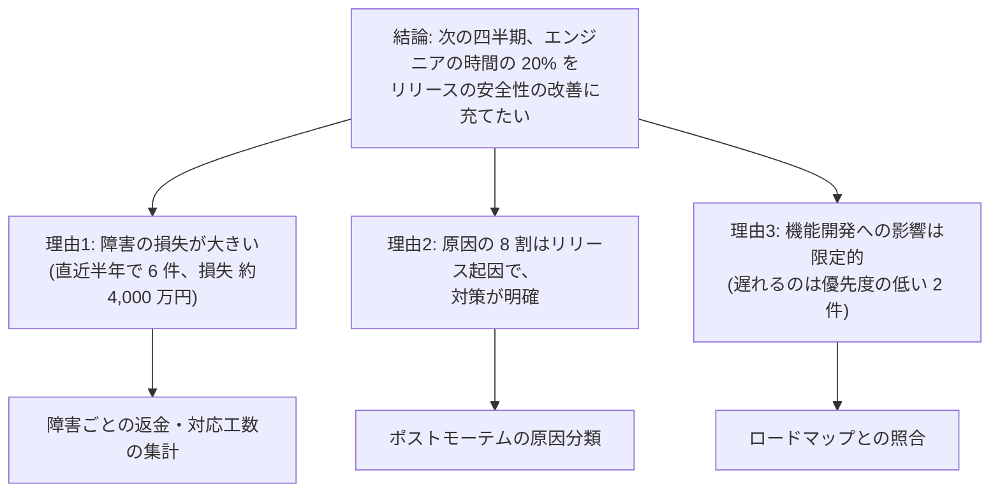

# 14.4 経営陣・取締役会・投資家とのコミュニケーション

> 技術的に正しい判断も、経営陣が理解し、支持しなければ実行されません。そして、悪い知らせが経営に届くのが遅れれば、小さな問題は会社を揺るがす問題に育ちます。この章では、CEO・経営陣・取締役会・投資家・他部門と、技術を「事業の言葉」で語り、合意をつくり、信頼を積み上げる方法を学びます。

| 項目 | 内容 |
|---|---|
| 学習時間の目安 | 本文 3h ＋ 演習 4h |
| 前提となる章 | [14.1 CTOの役割](../01-role-of-cto/README.md)、[14.3 事業と財務のリテラシー](../03-business-and-finance/README.md) |
| 演習 | [exercises/](exercises/)（Python）＋ 記述演習 |
| キーワード | CEO との関係, 経営会議, 意思決定メモ, 取締役会報告, 信号表示（RAG）, ピラミッド原則, SCQA, ナラティブメモ, 悪い知らせ, 投資家対応, 部門間連携, 書く文化 |

## この章のゴール

- [ ] CEO と期待値・意思決定権を合意し、意見の相違を建設的に扱う方法を説明できる
- [ ] 経営会議で、選択肢・トレードオフ・推奨の形で提案し、技術の話を事業の言葉に翻訳できる
- [ ] 取締役会向けの四半期技術報告を構成し、事前に決めた基準の信号表示で状況を正直に伝えられる
- [ ] ピラミッド原則と SCQA を使って、結論から書くメモや要約を書ける
- [ ] 「No」と悪い知らせを、トレードオフと計画を添えて早く伝えられる
- [ ] 投資家の技術的な質問に、事実と根拠をもって答える準備ができる
- [ ] 他部門（プロダクト・営業・カスタマーサクセス・人事・法務・財務）との連携の型を設計できる

## なぜ学ぶのか

CTO の判断の価値は、それが組織で実行されて初めて生まれます。予算を得る、優先順位を変える、リスクを受け入れてもらう、悪い知らせを伝える。そのすべてがコミュニケーションです。

- **取締役会は技術のリスクを監督する責任を問われている**: 経済産業省と IPA の「サイバーセキュリティ経営ガイドライン Ver 3.0」（2023 年）は、サイバーセキュリティを経営者が主導すべき経営課題として位置づけています。米国では証券取引委員会（SEC）が 2023 年に規則を定め、上場企業に対して、重要なサイバーセキュリティインシデントの開示（重要と判断してから原則 4 営業日以内）と、取締役会によるサイバーリスクの監督体制の年次開示を求めるようになりました。取締役会が監督するには、CTO が判断材料を分かる形で届けなければなりません。
- **書くことは経営の道具である**: Amazon の創業者 Jeff Bezos は 2017 年の株主への手紙で、同社では会議でスライドを使わず、物語形式で書かれた 6 ページのメモを会議の冒頭に全員で黙読してから議論する、と説明しています。考えを文章にする過程で、論理の穴が見つかるからです。
- **「見た目は緑、中身は赤」**: 外側は緑で中は赤いスイカになぞらえて、報告上は順調なのに実態は深刻な状態を「スイカ（watermelon）報告」と呼ぶことがあります。現場が悪い知らせを上げにくい組織では、問題は手遅れになってから経営に届きます。

技術に詳しくない相手に、正確さを失わずに伝え、判断を引き出す力は、CTO の中核的な能力です。

## 1. CEO との関係

### 1.1 注文を受ける人ではなく、事業のパートナー

| 注文を受ける人（order taker） | 事業のパートナー |
|---|---|
| 言われた機能を、言われた期限で作る | 事業の目標を理解し、技術で達成する方法を提案する |
| 技術的な制約を後から伝える | 制約とトレードオフを、判断の前に示す |
| 問題を自分たちだけで解決しようとする | 事業に影響する問題を早く共有し、一緒に判断する |
| 技術の成果を技術の指標で語る | 技術の成果を事業の指標で語る |
| 「できません」と言う | 「その代わりに、こうすればできます」と言う |

CEO が CTO に求めるのは、技術の専門家としての正確さと、経営者としての当事者意識の両方です。

### 1.2 期待値と意思決定権を合意する

CEO との関係の土台は、[14.1](../01-role-of-cto/README.md) で扱った役割の定義です。特に **意思決定権** を具体的に合意しておきます。重要な意思決定について「誰が提案し、誰の同意が必要で、誰が最終決定し、誰に共有するか」を決める方法として、DACI（Driver・Approver・Contributors・Informed）などの枠組みが知られています。

| 決定事項 | 提案 | 最終決定 | 相談が必要 |
|---|---|---|---|
| 技術スタック・アーキテクチャの大きな変更 | CTO | CTO | CEO（事業への影響が大きい場合） |
| ロードマップの優先順位 | CPO | CEO | CTO（実現性・コスト） |
| エンジニアの採用枠と予算 | CTO | CEO（取締役会の予算承認の範囲内） | CFO |
| 重大障害時の顧客への公表 | CTO | CEO | 法務・広報・カスタマーサクセス |

### 1.3 週次 1on1 の議題

CEO との週次 1on1 は、CTO にとって最も重要な定例会議の 1 つです。議題の型を決めておくと、話し漏れがなくなります。

```text
1. 事業の優先順位に変化はあるか（CEO から）
2. 主要な指標と、先週からの変化（CTO から。信号で）
3. 人と組織（採用、主要メンバーの状況、組織の変更案）
4. リスクと悪い知らせ（あれば必ず最初に）
5. 決めてほしいこと・相談したいこと
6. 互いへのフィードバック（月 1 回程度）
```

### 1.4 意見が対立したとき

CEO と CTO の意見が対立するのは健全なことです。問題は、対立をどう扱うかです。

- **非公開の場で徹底的に議論する**: 経営会議やチームの前で CEO と争うと、組織が分断されます。
- **選択肢とデータで議論する**: 「私はこう思う」ではなく、選択肢ごとのコスト・効果・リスクを並べ、どの前提の違いが結論の違いを生んでいるかを特定します。前提が特定できれば、それを検証する方法を合意できます。
- **決まったら全力で実行する**: Amazon のリーダーシップ原則の 1 つ "Have Backbone; Disagree and Commit"（反対するなら根拠をもって主張し、決まったら全面的にコミットする）はよく知られた考え方です。決定に従いながら「自分は反対だった」とチームに言うのは、最も信頼を損なう行動です。
- **例外**: 法令違反、顧客の安全や個人情報を重大な危険にさらす判断、倫理に反する判断については、コミットしてはいけません。取締役会や監査役（監査等委員会など）への報告を含め、会社の正式な経路で異議を唱えます。

### 1.5 信頼を積み上げる

信頼は、小さな約束を守り続けることで積み上がり、一度の「隠し事」で崩れます。

- **驚かせない（no surprises）**: CEO が重要な問題を他人から先に聞く状況をつくらない。
- **約束を守る。守れないと分かった時点ですぐに伝える**: 期限の直前に遅れを伝えるのが最悪です。
- **率直に話す**: 都合の悪い事実も、根拠とともに伝える。
- **自分の間違いを認める**: CTO が自分の判断の誤りを認めて修正する姿は、組織に「失敗を隠さない」文化をつくります。

## 2. 経営会議での振る舞い

### 2.1 選択肢・トレードオフ・推奨

経営会議に問題を持ち込むときは、**問題だけでなく、選択肢と推奨をセットで** 持ち込みます。問題だけを持ち込むと、議論が発散し、他の役員がその場で思いついた解決策が採用されることになります。

```text
【件名】大口顧客 X 社の個別機能の要求への対応

【決めてほしいこと】次の 3 案から方針を選んでいただきたい（期限: 今週金曜）

【背景】X 社（ARR 6,000 万円、全体の 5%）が、承認ワークフローの独自仕様を
　　　 2 か月以内に実装しなければ、来期の更新を見送ると伝えてきた。

【選択肢】
　A. X 社専用の機能として 2 か月で実装する
　　 − コスト: エンジニア 3 人 × 2 か月。第 3 四半期のロードマップ 2 件が遅れる
　　 − リスク: 専用の分岐が増え、保守費用が恒常的に増える（年 0.5 人年程度）
　B. 他の顧客にも使える汎用機能として 3 か月で実装する（推奨）
　　 − コスト: エンジニア 3 人 × 3 か月。ロードマップ 3 件が遅れる
　　 − 効果: 同様の要望を持つ見込み客 4 社（商談中）にも提供できる
　　 − リスク: X 社が 1 か月の延長を受け入れない可能性
　C. 断る
　　 − リスク: X 社の解約（ARR −6,000 万円）

【推奨】B。X 社には CEO から 1 か月の延長を打診し、受け入れられない場合は A に切り替える。
【推奨の理由】見込み客 4 社の商談への効果と、専用分岐による恒常的な保守コストの回避。
```

選択肢には、原則として **「何もしない（断る）」** を含めます。比較の基準になり、推奨案の価値が明確になるからです。

### 2.2 事業の言葉で話す

| 技術の言葉 | 事業の言葉への翻訳の例 |
|---|---|
| 技術的負債が溜まっている | 新機能の開発に、本来の 2 倍の期間がかかっている。四半期あたり 2 つ分の施策を失っている |
| モノリスを分割したい | 決済と請求を独立させると、請求の変更で決済が止まる事故（昨年 2 回、損失約 3,000 万円）を防げる |
| テストカバレッジが低い | リリースのたびに障害が起きる確率が高く、障害 1 回あたり平均 X 万円の返金と Y 時間の対応が発生している |
| オブザーバビリティを整備したい | 障害の原因特定に平均 3 時間かかっている。これを 30 分にすると、顧客影響の時間が大幅に減る |
| 可用性 99.9% の SLO | 月あたり最大約 43 分の停止を許容する約束 |

翻訳のコツは、**お金・時間・顧客・リスクのどれかに換算する** ことです。換算に確信が持てない数字は、幅（「年 2,000 万〜5,000 万円」）で示します。

### 2.3 短く話す

- **結論を先に**: 最初の 1 文で「何を決めてほしいか」「何が起きたか」を言う。
- **理由は 3 つまで**: それ以上は資料に回す。
- **資料は事前に配る**: 会議の時間は説明ではなく議論と決定に使う。
- **質問には、まず短く答える**: 「はい、3 か月で可能です。前提は 2 つあり……」のように、答えを先に言ってから補足する。

## 3. 取締役会への報告

### 3.1 取締役会は何を知りたいのか

取締役会の役割は、業務の執行そのものではなく、経営の **監督** と重要な意思決定です。日本の上場企業には、監査役会設置会社・監査等委員会設置会社・指名委員会等設置会社という機関設計があり、社外取締役の多くは技術の専門家ではありません。取締役会が CTO に求めるのは、次の問いに答えられる材料です。

1. 技術は事業戦略を支えているか（戦略との整合）
2. 重大なリスクは把握され、許容できる水準に管理されているか（リスクの監督）
3. 計画に対して、予定どおりに進んでいるか（実行の監督）
4. 必要な資源（人・予算）は足りているか。取締役会として判断すべきことは何か

技術の細部は、これらの問いに答えるための根拠として必要な範囲に絞ります。

### 3.2 四半期技術報告の構成

```text
1. エグゼクティブサマリー（1 枚）
   - 総合の状況（信号）と、今期の要点 3 つ
   - 取締役会に決めてほしいこと・知っておいてほしいこと
2. 戦略とロードマップの進捗（1〜2 枚）
   - 約束したマイルストーンの達成状況と、遅れの理由・回復計画
3. 主要指標（1 枚）
   - デリバリー・信頼性・セキュリティ・人と組織・コストの信号と傾向
4. 主要なリスクと対策（1 枚）
   - 上位 5 つ程度のリスク、前期からの変化、対策の担当者と期限
5. セキュリティの状況（1 枚）
   - 重大なインシデントの有無、監査・認証の状況、主要な改善
6. 依頼事項（1 枚）
   - 承認してほしいこと（予算・方針）、意見がほしいこと
付録: 指標の定義、詳細なデータ、用語集
```

本編は 6〜8 枚程度に収め、詳細は付録に回します。取締役会の資料は事前に配り、当日は説明ではなく質疑と議論に時間を使います。

### 3.3 報告する指標

| 区分 | 指標の例 | 注意点 |
|---|---|---|
| デリバリー | 変更のリードタイム、デプロイ頻度、変更失敗率、復旧時間（[13.7](../../13-technical-leadership/07-delivery-and-productivity/README.md)）、ロードマップの達成率 | 個人やチームの評価に使うと数字が歪む |
| 信頼性 | SLO の達成状況、重大インシデントの件数と顧客影響時間 | 件数だけだと報告されない文化を生む |
| セキュリティ | 重大な脆弱性の修正日数、多要素認証の適用率、監査指摘の件数 | 「インシデントゼロ」は検知できていないだけの可能性もある |
| 人と組織 | 採用計画の達成率、惜しまれる離職、エンゲージメント | 小さなチームでは個人が特定されないよう集計単位に注意 |
| コスト | 売上に対するクラウド費用、単位あたりのコスト、予算に対する実績 | 為替など、技術でコントロールできない要因を分けて示す |

指標は多すぎると読まれません。取締役会向けには 10 前後に絞り、**毎回同じ指標を同じ定義で** 報告します。定義を変えるときは、変更したことと理由を明記します。

### 3.4 信号（赤・黄・緑）で状況を示す

多くの指標を短時間で伝えるには、赤・黄・緑の **信号（RAG: Red・Amber・Green）** が便利です。ただし、使い方を誤ると「スイカ報告」の温床になります。

- **基準を事前に決める**: 「目標未達でも幅 X までは黄、それを超えたら赤」を指標ごとに決めておく。報告のたびに基準を変えると、信号は意味を失う。
- **例外を先に**: 赤と黄の指標を最初に示し、それぞれに原因と対策を添える。緑の指標は一覧で十分。
- **色だけに頼らない**: 「赤」「黄」「緑」の文字でも示す（色覚の多様性への配慮、白黒での印刷）。
- **傾向を添える**: 同じ黄でも、改善中か悪化中かで意味が違う。

演習で実装する `kpi_report.py`（解答例）が出力する 1 ページサマリーの例です。

```text
# 技術 KPI サマリー（2026 年度 第 2 四半期）

**総合: 赤**（赤 2 / 黄 3 / 緑 4）

## 要対応・要注意（赤・黄）

| 状態 | 区分 | 指標 | 実績 | 目標 | 傾向 |
|---|---|---|---|---|---|
| 赤 | デリバリー | ロードマップ達成率 | 70% | 80% | 悪化（前期 78%） |
| 赤 | 人と組織 | 採用計画の達成率 | 60% | 90% | 悪化（前期 70%） |
| 黄 | デリバリー | 変更のリードタイム（中央値） | 30時間 | 24時間 | 改善（前期 36時間） |
| 黄 | 信頼性 | 重大インシデント | 3件 | 2件 | 改善（前期 5件） |
| 黄 | コスト | 売上に対するクラウド費用 | 13.5% | 12% | 悪化（前期 12.8%） |

## 全指標

| 区分 | 指標 | 状態 | 実績 | 目標 | 傾向 |
|---|---|---|---|---|---|
| デリバリー | 変更のリードタイム（中央値） | 黄 | 30時間 | 24時間 | 改善（前期 36時間） |
| デリバリー | ロードマップ達成率 | 赤 | 70% | 80% | 悪化（前期 78%） |
| 信頼性 | 可用性（主要 API） | 緑 | 99.95% | 99.9% | 改善（前期 99.82%） |
| 信頼性 | 重大インシデント | 黄 | 3件 | 2件 | 改善（前期 5件） |
| セキュリティ | 重大な脆弱性の修正日数（中央値） | 緑 | 9日 | 14日 | 改善（前期 12日） |
| セキュリティ | 多要素認証の適用率 | 緑 | 100% | 100% | 改善（前期 97%） |
| 人と組織 | 採用計画の達成率 | 赤 | 60% | 90% | 悪化（前期 70%） |
| 人と組織 | 惜しまれる離職（年率） | 緑 | 6% | 8% | 改善（前期 7%） |
| コスト | 売上に対するクラウド費用 | 黄 | 13.5% | 12% | 悪化（前期 12.8%） |
```

この表を見た取締役は、「ロードマップの遅れと採用の遅れは関係しているのか」と問うはずです。報告する側は、その問いへの答え（採用の遅れが 2 つのプロジェクトの遅れの主因であり、回復計画は何か）を、赤の指標の説明として先に用意しておきます。**信号は議論の入り口であり、説明の代わりではありません**。

### 3.5 リスクとセキュリティの報告

リスクは、上位 5 つ程度を **リスク登録簿**（[14.5](../05-governance-risk-compliance/README.md)）から選び、発生可能性と影響度、前期からの変化、対策と担当者・期限を示します。

| リスク | 可能性 | 影響 | 前期比 | 対策（担当・期限） |
|---|---|---|---|---|
| 主要クラウド障害による長時間停止 | 中 | 大 | → | 別リージョンへの復旧手順の訓練（SRE 責任者・9 月） |
| 旧バージョンの DB のサポート終了 | 高 | 中 | ↑ | マネージド DB への移行（基盤チーム・12 月） |
| 認証基盤を知る担当者への依存 | 中 | 大 | ↓ | 2 人目の担当者の育成、手順の文書化（完了率 60%） |

セキュリティの報告では、NIST のサイバーセキュリティフレームワーク 2.0 のような共通の枠組みに沿って成熟度を示すと、取締役会が経年の変化と他社との比較を理解しやすくなります（[14.5](../05-governance-risk-compliance/README.md)）。重大な事故が起きたときの報告の流れは [14.6 危機管理](../06-crisis-management/README.md) で扱います。

## 4. 投資家とのコミュニケーション

### 4.1 資金調達の過程で CTO が担うこと

資金調達では、投資家が技術について確認する **技術デューデリジェンス（技術 DD）** が行われます。CTO は、次のものを準備します（データルームの構成など詳しくは [14.7](../07-due-diligence-and-ma/README.md)）。

- アーキテクチャの概要（1〜2 枚の図と説明）
- 主要な指標（デリバリー、信頼性、セキュリティ、コスト）の推移
- 技術組織の体制と採用計画
- セキュリティの体制、認証の取得状況、過去の重大なインシデントと再発防止策
- 知的財産とライセンスの状況（ソースコードの権利、OSS の利用状況）
- 既知の技術的リスクと、その対策計画

CEO の説明（ピッチ）と、CTO の説明が食い違わないように、事前に内容をすり合わせます。「AI で差別化」「無限にスケールする」のような誇張は、DD で確認されれば信頼を失い、場合によっては法的な問題にもなります。2024 年には米国 SEC が、AI の利用について虚偽や誤解を招く説明をしたとして投資助言会社 2 社を処分しています（いわゆる AI ウォッシング）。

### 4.2 質問への答え方

- **事実と数字で答える**: 「スケールします」ではなく「現在の 10 倍の負荷試験で、p99 レイテンシが 300 ms 以内でした。ボトルネックは DB の書き込みで、対策は来期に計画しています」。
- **知らないことは知らないと言う**: その場で推測で答えず、「確認して明日までに回答します」と言い、実際にそうする。
- **弱みは対策とセットで示す**: 投資家は弱みのない会社を探しているのではなく、弱みを把握して管理できている経営陣を探しています。
- **守秘に注意する**: 顧客名や未公表の情報を不用意に話さない。秘密保持契約の範囲を確認する。

### 4.3 株主・取締役としての投資家

投資家が取締役やオブザーバーとして経営に関わる場合は、定期的な情報提供（毎月または四半期の投資家向けレター）で、良い知らせも悪い知らせも継続的に伝えます。悪い知らせを取締役会の当日に初めて知らせるのは避け、事前に個別に説明しておくのが原則です。

## 5. 部門横断の連携

| 部門 | 技術組織に求めるもの | よくある衝突 | CTO の打ち手 |
|---|---|---|---|
| プロダクト | ロードマップの実現、見積もり | 優先順位と技術的な投資（負債の返済など）の配分 | 技術投資の配分（例: 20%）を事前に合意し、四半期ごとに見直す |
| 営業 | 商談の技術支援、顧客への約束 | 営業が技術の確認なしに機能や期限を約束する | 「技術の合意なしに機能・期限・SLA を約束しない」ルールと、迅速に相談できる窓口（プリセールスのエンジニアなど） |
| カスタマーサクセス | 障害対応、問い合わせのエスカレーション | 重大度の認識のずれ、対応の遅れ | 重大度の定義と対応時間の目標を共同で決める。顧客への連絡のテンプレート |
| マーケティング | 新機能のリリース時期、技術広報 | 発表日に合わせた無理なリリース | リリースと発表を分ける（機能フラグで事前にリリースしておく） |
| 人事 | 採用計画、評価、報酬 | 市場水準とのずれ、職種ごとの制度の違い | 報酬データの共有、エンジニア向けの評価制度の設計に参加する（[13.5](../../13-technical-leadership/05-growth-and-evaluation/README.md)） |
| 法務 | 契約、個人情報、OSS、知的財産 | 契約条件（SLA・責任の上限）と技術の実態のずれ | 契約書の技術的な条項のレビューを定例化する（[14.5](../05-governance-risk-compliance/README.md)） |
| 財務 | 予算、資産計上、見通し | 予算超過の事後報告 | 月次の予実レビュー、資産計上の対象の共有（[14.3](../03-business-and-finance/README.md)） |

特に **営業の約束** は、技術組織を最も疲弊させる要因の 1 つです。「顧客への約束は、それを実行する人の合意を得てから」という原則を、CEO の後押しを得て全社のルールにします。同時に、営業が困らないよう、技術的な質問に 1〜2 営業日で答えられる体制をつくるのが CTO の責任です。

## 6. 技術を非エンジニアに伝える

### 6.1 たとえ話の使い方

たとえ話は強力ですが、**本質的な性質が対応している** ものを選ばないと誤解を生みます。

- **良い例**: 「技術的負債は、借金と同じで、返さない限り利息（開発の遅れ）を払い続ける」。この比喩は Ward Cunningham が 1992 年の OOPSLA の経験報告で使ったのが始まりとされ、「計画的に借りることもあるが、利息が膨らむ前に返すべき」という判断の構造まで正しく伝わります。
- **悪い例**: 「クラウドは電気のようなもの。使った分だけ払えばいい」。従量課金の側面は伝わりますが、設計次第で費用が何倍も変わること、止まることもあることが抜け落ちます。

たとえ話を使ったら、「この比喩が当てはまらない点」も一言添えると、誤解を防げます。

### 6.2 ピラミッド原則: 結論から

Barbara Minto の **ピラミッド原則** は、メッセージを「結論 → それを支える根拠 → 根拠を支えるデータ」の階層に組み立てる方法です。



原則は 3 つです。

1. **結論を一番上に置く**: 読み手が最初に知りたいのは結論です。
2. **縦の関係は「なぜ？」「どうやって？」の問いと答え**: 上の主張に対して読み手が抱く問いに、下の階層が答える。
3. **横の並びは漏れなく重複なく（MECE）**: 同じ階層の根拠は、互いに重ならず、合わせて上の主張を十分に支える。

### 6.3 SCQA

文章の導入部を組み立てる型として、Minto は **SCQA**（Situation・Complication・Question・Answer）を示しています。

| 要素 | 内容 | 例 |
|---|---|---|
| S: 状況 | 読み手が合意できる事実 | 当社の売上の 6 割は、大企業向けプランから生まれている |
| C: 複雑化 | 状況を変える出来事・問題 | 今年に入り、大企業の 3 社が、SOC 2 報告書がないことを理由に更新を保留した |
| Q: 問い | そこから生まれる問い | 更新を失わないために、何をいつまでにすべきか |
| A: 答え | 結論 | 9 か月以内に SOC 2 Type I を取得し、その間は ISMS の認証と個別のセキュリティ説明で補う |

### 6.4 1 ページメモ

経営会議に持ち込む提案は、1 ページのメモにまとめる習慣をつけます。

```text
件名: （何を決めてほしいかが分かる件名）
結論と依頼事項: （1〜2 文）
背景: （なぜ今この判断が必要か。3〜5 行）
選択肢: （2〜3 案。それぞれのコスト・効果・リスク。「何もしない」を含む）
推奨と理由: （どれを、なぜ）
リスクと対策:
決めてほしいこと・期限:
```

### 6.5 ナラティブメモ

より重要で複雑なテーマでは、箇条書きのスライドではなく、**文章で書かれたメモ（ナラティブメモ）** が効果を発揮します。Amazon では、最長 6 ページの物語形式のメモを会議の冒頭に全員で黙読し、その後に議論します。新製品の企画を、発売時のプレスリリースと想定問答（PR/FAQ）の形で書く方法もよく知られています。

文章で書くと、箇条書きでは隠れてしまう「論理のつながり」と「省略された前提」が露わになります。書き手にとっては考えを詰める訓練になり、読み手にとっては会議の前提を揃える手段になります。

### 6.6 数字の見せ方

- **比較の基準を示す**: 「障害 3 件」ではなく「障害 3 件（前期 5 件、目標 2 件）」。
- **分母を示す**: 「エラー 4,200 件」ではなく「決済 11 万件のうち 4,200 件（3.8%）」。
- **単位と期間を揃える**: 月と年、税込と税抜、ドルと円を混ぜない。
- **不確かな数字は幅で**: 「約 3,000 万円（2,000〜5,000 万円）」。前提を脚注に書く。
- **グラフの縦軸を切り詰めない**: 小さな変化が大きく見え、判断を誤らせる。

## 7. 「No」と悪い知らせ

### 7.1 「はい、その代わりに」

CTO が「No」と言わなければならない場面は多くあります。しかし、単に「できません」と言うと、相談されなくなります。**トレードオフを明示した「はい」** で答えます。

> 営業部長: 「来月の展示会までに、AI の自動分類機能をデモできるようにしてほしい」
>
> CTO: 「デモはできます。選択肢は 2 つです。1 つは、展示会用に固定のデータで動くデモを 2 週間で作る案。見た目は完成版と同じですが、実際の顧客データでは動きません。もう 1 つは、実際に使える最小限の機能を 6 週間で作る案で、この場合は検索改善のリリースが 1 か月遅れます。展示会で商談を取りたいなら前者で十分だと思いますが、その場で顧客に提供時期を約束しないことが条件です。どちらにしますか」

ポイントは、①相手の目的（展示会で商談を取る）を理解し、②選択肢とその代償（時間、他の機能の遅れ、約束の制約）を示し、③推奨を添え、④相手に選んでもらうことです。

### 7.2 悪い知らせの伝え方

悪い知らせは、**早く・事実で・影響と計画を添えて** 伝えます。自分で解決してから報告しようとして報告が遅れると、経営が打てる手（顧客への事前連絡、計画の変更、資源の追加）が減ります。

```text
1. 結論: 何が起きたか / 何が起きそうか（1 文）
2. 事実: 分かっていること、まだ分かっていないこと
3. 影響: 顧客・売上・スケジュール・評判への影響（幅で）
4. 対応: 今やっていること、これからの計画と次の報告の時期
5. 依頼: 経営に判断してほしいこと、助けてほしいこと
```

たとえば「リリースが遅れる」なら、次のように伝えます。

> 「大企業向けの権限管理機能のリリースは、予定の 9 月末から 11 月中旬に遅れる見込みです。既存の権限データの移行で、想定していなかった不整合が 3 割の顧客で見つかったためです。影響は、この機能を待っている商談 2 件（合計 ARR 4,000 万円）で、営業部長とはすでに顧客への説明方針を相談しています。移行ツールの改修に 2 人を追加すれば 10 月末まで縮められる可能性があり、その判断を今週中にお願いしたいです。次の報告は来週月曜です」

誰かを責める言い方は避けます。原因の説明は「何が起きたか」であって「誰のせいか」ではありません（障害の振り返りについては [10.5](../../10-cloud-and-sre/05-incident-management/README.md)）。

### 7.3 見積もりの伝え方

見積もりは約束ではなく、不確実性を含んだ予測です。Barry Boehm の研究に由来し、Steve McConnell が「不確実性のコーン（cone of uncertainty）」として広めたように、プロジェクトの初期ほど見積もりの幅は大きくなります。

- **幅と確度で伝える**: 「3 か月」ではなく「3〜5 か月。3 か月で終わる確率は 3 割程度」。
- **前提を明示する**: 「要件が今の範囲から増えないこと、採用予定の 2 人が 8 月までに入社すること」。
- **更新のタイミングを約束する**: 「設計が終わる 5 月末に、幅を狭めた見積もりを出します」。

## 8. 社外への発信と書く文化

### 8.1 技術ブログ・登壇・OSS

社外への技術発信は、採用のブランド、技術組織の誇り、業界への貢献につながります。CTO は発信を奨励しつつ、次のことを仕組みにします。

- **公開前のレビュー**: 顧客名・未公表の事業情報・内部のホスト名や構成・セキュリティ上の弱点が含まれていないかを確認する（セキュリティと広報・法務のレビュー）。
- **評価への反映**: 発信を個人の余暇の活動にせず、業務として時間を確保し、評価にも反映する。
- **効果の測定**: 記事や登壇をきっかけにした応募・面談の数を記録する。

### 8.2 書く文化をつくる

技術組織が大きくなると、口頭の議論だけでは判断の理由が残らず、同じ議論が繰り返されます。設計文書（デザインドキュメント）、ADR（アーキテクチャ決定記録）、意思決定のログ、ポストモーテムを書き、誰でも読める場所に置く文化をつくります（[8.6 開発プロセスとドキュメンテーション](../../08-software-engineering/06-process-and-documentation/README.md)）。

日本企業には「稟議書」という書面で意思決定する伝統があります。ただし稟議が「承認の記録」であることが多いのに対し、設計文書やナラティブメモは「考えの過程と、検討した選択肢」を残すものです。何を検討し、なぜその案を選んだのかが残っていれば、前提が変わったときに判断を見直せます。

CTO 自身が書く姿を見せることが、書く文化の一番の推進力です。四半期の技術戦略、重要な判断の理由、障害の振り返りへのコメントを、自分の言葉で書いて共有しましょう。

## よくある落とし穴

1. **技術の正しさで押し切ろうとする**。経営陣は技術の正しさではなく、事業への影響で判断します。お金・時間・顧客・リスクに換算して説明し、選択肢と推奨を示します。
2. **取締役会で技術の細部に入り込む**。取締役会が必要としているのは、戦略との整合・リスク・進捗・必要な判断です。細部は付録に回し、質問されたら答えられるようにしておきます。
3. **悪い知らせを、解決してから報告しようとする**。報告が遅れるほど、経営が打てる手が減ります。分かっていないことは「分かっていない」と明示して、早く伝えます。
4. **信号の基準を後から変える、緑に寄せる**。基準を事前に決めていない信号は、報告者の願望を表すだけです。「スイカ報告」が一度見つかると、以後のすべての報告が疑われます。
5. **選択肢を 1 つしか示さない、または推奨を示さない**。1 案だけだと比較できず、推奨がないと議論が発散します。「何もしない」を含めた 2〜3 案と推奨をセットにします。
6. **営業の約束を事後に知る**。技術の合意なしに機能・期限・SLA を約束しないルールを全社で合意し、同時に営業がすぐ相談できる窓口をつくります。
7. **投資家に誇張する**。技術 DD で確認されれば信頼を失い、場合によっては法的な責任も生じます。弱みは対策とセットで正直に示します。
8. **たとえ話で本質を歪める**。比喩は、判断に必要な性質が対応しているものを選び、当てはまらない点も添えます。

## 演習

コード演習は [exercises/kpi_report.py](exercises/kpi_report.py) にあります。関数の docstring に仕様が書いてあるので、`raise NotImplementedError(...)` を実装に置き換えてください。解答例は [solutions/kpi_report.py](solutions/kpi_report.py) にあります（実行すると本文 3.4 節の出力を再現できます）。

```bash
python3 tools/check.py 14.4        # リポジトリのルートで実行
python3 tools/check.py -v 14.4     # 詳しい出力
```

| # | 難易度 | 内容 | 対象 |
|---|---|---|---|
| 1 | ★☆☆ | 信号（赤・黄・緑）と傾向の判定、全体の信号 | `rag_status`, `trend`, `overall_status` |
| 2 | ★☆☆ | 例外を先に並べた 1 ページの KPI サマリーの出力 | `format_value`, `render_report` |
| 3 | ★★☆ | 記述: 取締役会向け四半期技術報告の骨子 | — |
| 4 | ★★☆ | 記述: 障害メモを経営向けの要約に書き直す | — |
| 5 | ★★☆ | 記述: ピラミッド構造のメモ | — |
| 6 | ★★★ | 記述: 投資家の想定問答集 | — |

### 演習 3（記述）: 四半期技術報告の骨子

あなたの会社（または [14.1](../01-role-of-cto/README.md) の演習 2 の会社: BtoB SaaS、ARR 12 億円、エンジニア 45 人）の取締役会に向けて、3.2 節の構成に沿った四半期技術報告の骨子（各スライドの見出しと、載せる内容を 2〜3 行）を書いてください。取締役会に決めてほしいことを最低 1 つ含めること。

<details>
<summary>解答例</summary>

1. **エグゼクティブサマリー**: 総合は「黄」。①重大障害は四半期 3 件 → 1 件に減少（インシデント対応の制度化の効果）。②ロードマップの達成率は 70%（目標 80%）で赤。主因は採用の遅れ。③ISMS 認証の審査を 12 月に受審予定。**取締役会へのお願い**: 採用を加速するための人材紹介費用の追加（2,000 万円）の承認。
2. **ロードマップの進捗**: 約束したマイルストーン 5 件のうち 3 件を達成。遅れている 2 件（大企業向け権限管理、請求の自動化）の遅延理由と、11 月までの回復計画。
3. **主要指標**: デリバリー・信頼性・セキュリティ・人と組織・コストの 9 指標を信号と傾向で（`kpi_report.py` の出力形式）。赤の 2 指標（ロードマップ達成率、採用計画の達成率）の関係と対策を明記。
4. **主要なリスク**: 上位 5 つ（DB のサポート終了、認証基盤の担当者への依存、主要クラウドの障害、大口顧客の個別要求の増加、為替によるクラウド費用の増加）。前期からの変化と対策・担当・期限。
5. **セキュリティ**: 重大なインシデントはなし。ISMS の準備状況（内部監査の完了）、多要素認証の適用率 100% 達成、脆弱性の修正日数の中央値 9 日。
6. **依頼事項**: ①人材紹介費用の追加 2,000 万円の承認。②来期の技術戦略（DB 移行と大企業向け機能への集中）への意見。
付録: 指標の定義、障害の一覧と再発防止策、採用ファネルの詳細。

採点の観点:

- 冒頭の 1 枚で、総合の状況・要点・依頼事項が分かるか。
- 赤の指標に、原因と回復計画が添えられているか。指標どうしの関係（採用の遅れ → ロードマップの遅れ）を説明しているか。
- 依頼事項が具体的（金額・期限・選択肢）か。
- 技術の細部が本編に入り込んでいないか。

</details>

### 演習 4（記述）: 障害メモを経営向けの要約に書き直す

次の障害メモ（エンジニアがチャットに書いたもの）を、CEO と取締役に送る要約（400〜600 字程度）に書き直してください。

```text
2026-05-14 障害メモ（#inc-0514）
10:02 決済APIのp99急上昇、アラート発火
10:05 on-call(佐藤)がack。DB CPU 100%
10:12 直前デプロイ(v2.31.0)のN+1を疑いロールバック開始
10:20 ロールバック完了も改善せず
10:31 DBのmax_connections=500到達を確認。v2.30.0(5/12)でコネクションプール
      設定が20→50に変更されていた（pod 12台×50=600で上限超過）
10:40 podを12→8台に縮退、接続数が落ち着く
10:47 決済API正常化、エラー率0.1%以下に回復
影響: 10:02-10:47 決済APIエラー率最大38%。決済失敗 約4,200件（うち再試行で成功 約2,900件）。
      問い合わせ63件。大口のA社から問い合わせあり
原因: プール設定変更がレビュー対象外だった。朝のピークで上限超過
対応: プール設定を戻す、接続数アラート追加、設定ファイルもレビュー必須に
TODO: 返金要否確認、A社への説明、ポストモーテム
```

<details>
<summary>解答例</summary>

**件名: 【報告】5 月 14 日 午前の決済障害（45 分間）について — 復旧済み、再発防止策を実施中**

**結論**: 5 月 14 日 10:02〜10:47 の 45 分間、決済の一部が失敗する障害が発生しました。現在は復旧しており、同じ原因による再発を防ぐ設定の修正は完了しています。

**顧客への影響**: 障害中、決済の最大 38% が失敗し、失敗した決済は約 4,200 件でした。このうち約 2,900 件はお客様の再試行で完了しており、**最終的に完了しなかった決済は約 1,300 件** と見ています（精査中）。問い合わせは 63 件で、大口顧客の A 社からも問い合わせがありました。

**原因**: 2 日前（5 月 12 日）のリリースに含まれていた設定の変更により、朝のアクセスが集中する時間帯に、データベースへの同時接続数が上限を超えました。この設定の変更は、コードの変更と異なりレビューの対象になっていなかったため、事前に気づけませんでした。

**対応と再発防止**: 設定は元に戻し、接続数が上限に近づいたときに警告する監視を追加しました。今後は設定ファイルの変更もレビューを必須にします。詳細な振り返りは 5 月 21 日までにまとめて共有します。

**経営にお願いしたいこと**: ①完了しなかった決済の加盟店への返金・補償の方針（金曜までにカスタマーサクセスと案を提示します）。②A 社への説明は、本日中に私と担当営業から行う予定です。

採点の観点:

- 最初の数行で「何が起きたか・今どうなっているか」が分かるか。
- 顧客への影響を、技術指標（p99、エラー率）ではなく事業の言葉（失敗した決済の件数、完了しなかった件数、問い合わせ、大口顧客）で示しているか。分母や精査中であることなど、数字の確度を示しているか。
- 原因を専門用語（max_connections、pod、N+1）を使わずに説明し、個人を責める表現がないか（on-call 担当者の名前は不要）。
- 経営が判断すべきこと（返金方針、大口顧客への対応）と、次の報告の時期が明確か。
- 最初に疑った原因（直前のリリース）とロールバックの経緯のような、経営の判断に不要な詳細を省いているか。

</details>

### 演習 5（記述）: ピラミッド構造のメモ

「次の四半期、エンジニアの時間の 20% を技術的負債の返済に充てたい」という提案を、ピラミッド原則に沿った 1 ページのメモにしてください。まず結論・理由（3 つ・MECE）・根拠データの構造を図か箇条書きで示し、それから SCQA で導入部を書き、最後にメモ本文を書きます。数字は仮定でかまいません。

<details>
<summary>解答例</summary>

構造:

- 結論: 次の四半期、エンジニアの時間の 20%（約 9 人分）を、変更の遅い 3 つの領域の改善に充てたい。
  - 理由 1（現状の損失）: 3 つの領域への変更は、他の領域の 2.5 倍の時間がかかり、四半期あたり約 2 施策分の開発力を失っている。 ← 根拠: チケットのリードタイムの比較、見積もりと実績の差
  - 理由 2（投資の効果）: 改善後は、この 3 領域のリードタイムを半分にでき、2 四半期で投資を回収できる。 ← 根拠: 過去に改善した領域（検索）での実績
  - 理由 3（代償とリスク）: 次の四半期に遅れる施策は優先度の低い 2 件に限られ、売上への影響は小さい。 ← 根拠: ロードマップとの照合、プロダクト部門との合意

SCQA:

- S: 当社の売上成長は、請求・権限・連携の 3 領域の機能追加に大きく依存している。
- C: この 3 領域の変更には他の 2.5 倍の時間がかかり、今期はロードマップの 30% が遅れた。
- Q: 来期以降、約束した施策を予定どおりに届けるには、何をすべきか。
- A: 次の四半期、エンジニアの時間の 20% を 3 領域の改善に集中投資する。

メモ本文（抜粋）:

> **件名: 次四半期のエンジニアリング時間の 20% を、変更の遅い 3 領域の改善に充てることのご承認のお願い**
>
> **結論**: 次の四半期、エンジニアの時間の 20%（約 9 人分）を、請求・権限・連携の 3 領域の改善に充てることを承認いただきたい。
>
> 当社の売上成長を支える機能追加の多くは、この 3 領域に集中しています。しかし、この 3 領域の変更には他の領域の 2.5 倍の時間がかかっており、今期はロードマップの 30% が遅れました。四半期あたり約 2 施策分の開発力を失っている計算です。
>
> 昨年、同じ方法で検索の領域を改善した際には、変更のリードタイムが半分になりました。同様の効果が得られれば、2 四半期で投資を回収できます。
>
> この投資により次の四半期に遅れるのは、優先度の低い 2 施策（プロダクト部門と合意済み）で、売上への影響は小さいと見ています。効果はリードタイムで毎月計測し、2 か月の時点で改善が見られなければ計画を見直します。

採点の観点:

- 結論が冒頭にあり、何を承認してほしいかが明確か。
- 理由が MECE（現状の損失・効果・代償とリスク）で、互いに重複せず、合わせて結論を十分に支えているか。
- 「負債」「リファクタリング」などの技術の言葉ではなく、開発力・施策・売上への影響で語っているか。
- 効果の測定方法と、見直しの条件（撤退条件）があるか。

</details>

### 演習 6（記述）: 投資家の想定問答集

シリーズ C の資金調達を控えた BtoB SaaS 企業（ARR 30 億円、エンジニア 80 人、生成 AI を使った機能を今年リリース）の CTO として、投資家から想定される技術的な質問を 8 つ以上挙げ、それぞれに回答を書いてください。回答は、事実・数字・既知のリスクと対策を含めること（数字は仮定でかまいません）。

<details>
<summary>解答例</summary>

| # | 想定される質問 | 回答の例 |
|---|---|---|
| 1 | 顧客が 10 倍になったら、システムはどうなりますか | 昨年、現在の 10 倍の負荷で試験を行い、主要な API の p99 は 300 ms 以内でした。ボトルネックは請求処理の DB への書き込みで、来期にパーティショニングで対応します（費用と期間は計画済み）。インフラ費用は利用量にほぼ比例し、単位あたりのコストは過去 2 年で 30% 下がっています。 |
| 2 | 技術的負債はどのくらいありますか | エンジニアの時間の約 15% を返済に充てています。変更が遅い領域を 3 つ特定し、リードタイムで効果を計測しています。最大の負債は請求の領域で、来期に作り替えます。 |
| 3 | 重大なセキュリティ事故はありましたか | 個人情報の漏えいを伴う事故はありません。昨年、設定の不備で社内向けの管理画面が一時的に外部から見える状態になりましたが、アクセスログで第三者のアクセスがないことを確認し、設定の自動検査を導入しました。ISMS 認証を取得済みで、SOC 2 Type II は来年取得予定です。 |
| 4 | CTO や主要なエンジニアが辞めたらどうなりますか | VPoE とマネージャー 8 人の体制で、日常の判断は CTO がいなくても進みます。認証と請求の領域には担当者の偏りがあり、2 人目の担当者の育成と手順の文書化を進めています（完了率 60%）。 |
| 5 | ソースコードと知的財産の権利は会社にありますか | 従業員は就業規則と職務著作の規定、業務委託先は契約で著作権の譲渡と著作者人格権の不行使を取り決めています。OSS はライセンスを自動で棚卸しし、AGPL などのポリシー違反はビルドで検出しています。 |
| 6 | 生成 AI の機能は差別化になりますか。大手が同じ機能を出したら？ | 汎用の AI 機能そのものではなく、当社に蓄積された業務データと、顧客の業務フローへの組み込みが差別化の源泉です。基盤モデルは複数の提供元を切り替えられる設計にしています。 |
| 7 | 粗利率の見通しは？ AI 機能で下がりませんか | 現在の粗利率は 76% です。AI 機能の推論費用は売上の 4% で、上位プランの価格に反映しています。モデルの選択とキャッシュで、単位あたりの費用を半年で 40% 下げました。 |
| 8 | 開発の生産性をどう測っていますか | 変更のリードタイム、デプロイ頻度、変更失敗率、復旧時間をチーム単位で計測し、改善の傾向を見ています。個人の評価には使っていません。 |
| 9 | 採用計画は現実的ですか | 過去 12 か月の実績は計画の 85% です。採用チャネル別の歩留まりを把握しており、来期の計画（20 人）はこの実績に基づいています。 |
| 10 | 大企業のセキュリティ要件にどう対応していますか | ISMS 認証、SSO・監査ログ・IP 制限などの機能、セキュリティチェックシートの標準回答集を用意しています。回答にかかる期間は平均 3 営業日です。 |

採点の観点:

- 回答が事実と数字に基づき、抽象的な言葉（「スケールします」「安全です」）で終わっていないか。
- 弱み（担当者の偏り、過去のインシデント、負債）を隠さず、対策とセットで示しているか。
- 知的財産・OSS・個人情報など、DD で必ず確認される論点を押さえているか。
- AI について誇張せず、差別化の源泉とリスク（原価、提供元への依存）を説明しているか。
- CEO の事業計画（成長率、粗利率）と矛盾しない数字になっているか。

</details>

## 理解度チェック

**Q1. CTO が「注文を受ける人」になってしまうと、会社にどんな問題が起きますか。「事業のパートナー」としての振る舞いを 3 つ挙げてください。**

<details>
<summary>解答</summary>

技術的な制約やトレードオフが判断の後に伝わるため、実現不可能な約束や、将来の保守コストを増やす判断が繰り返されます。また、技術で事業を伸ばす機会（新しい事業モデル、効率化）が提案されず、技術投資が常に後回しになります。

事業のパートナーとしての振る舞い:
- 事業の目標を理解し、それを達成する技術的な方法を自ら提案する。
- 判断の前に、選択肢ごとのコスト・リスク・トレードオフを示す。
- 技術の成果を事業の指標（売上・コスト・リスク・スピード）で語る。
- 「できない」ではなく「その代わりにこうすればできる」と答える。

</details>

**Q2. CEO と意見が対立したときの望ましい振る舞いと、コミットしてはいけない例外を説明してください。**

<details>
<summary>解答</summary>

非公開の場で、選択肢とデータを使って徹底的に議論します。結論の違いを生んでいる前提を特定できれば、その前提を検証する方法を合意できます。決定が出たら、自分が反対していたとしても、チームの前では決定に全面的にコミットして実行します（"disagree and commit"）。

例外は、法令違反、顧客の安全や個人情報を重大な危険にさらす判断、倫理に反する判断です。この場合はコミットせず、取締役会や監査役（監査等委員会）など、会社の正式な経路で異議を唱えます。

</details>

**Q3. 取締役会向けの信号（赤・黄・緑）の報告で、基準を事前に決め、例外を先に示すのはなぜですか。**

<details>
<summary>解答</summary>

基準を事前に決めていないと、報告者が信号を「緑に寄せる」誘惑に負けやすく、実態が赤なのに緑と報告される「スイカ報告」が生まれます。基準が固定されていれば、信号は客観的な事実になり、前期との比較もできます。

例外（赤・黄）を先に示すのは、取締役の限られた時間を、判断や支援が必要な項目に集中させるためです。緑の指標は一覧で確認できれば十分です。赤・黄には原因と対策を添え、信号を議論の入り口として使います。

</details>

**Q4. 「新しい監視基盤の導入」を経営会議で提案するとき、SCQA で導入部を組み立ててください（数字は仮定でかまいません）。**

<details>
<summary>解答</summary>

- **S（状況）**: 当社のサービスは、ここ 1 年で顧客数が 2 倍になり、システムの構成も複雑になった。
- **C（複雑化）**: 障害が起きたときに原因を特定するまでに平均 3 時間かかっており、直近の半年で、顧客への影響時間の合計は 20 時間を超えた。大口顧客からも改善を求められている。
- **Q（問い）**: 障害の影響時間をどうすれば短くできるか。
- **A（答え）**: 監視基盤を刷新し、原因の特定時間を 30 分以内にする。費用は年 1,200 万円で、障害による返金と対応工数の削減で 1 年以内に回収できる見込みである。

</details>

**Q5. 営業部長から「大口顧客のために、2 週間で独自の帳票出力機能を作ってほしい」と頼まれました。「はい、その代わりに」の形で答えるときの要素を挙げてください。**

<details>
<summary>解答</summary>

- **相手の目的を確認する**: 顧客が本当に必要としているのは何か（独自の帳票か、特定の項目を出力できることか）、2 週間という期限の根拠は何か。
- **選択肢と代償を示す**: 例えば「既存の CSV 出力の項目を追加する案なら 1 週間」「独自の帳票なら 4 週間かかり、その間に予定していた機能 X が遅れる」「専用機能にすると保守の費用が恒常的に増える」。
- **推奨を添える**: 「CSV の項目追加で目的が満たせるなら、それを推奨します」。
- **相手に選んでもらう、または上位の判断を仰ぐ**: 影響がロードマップ全体に及ぶなら、CEO・CPO を交えて決める。
- **顧客への約束の条件**: 合意した内容以外を顧客に約束しないこと。

</details>

**Q6. 悪い知らせを伝えるときに含めるべき要素を挙げ、「自分で解決してから報告する」ことがなぜ問題なのかを説明してください。**

<details>
<summary>解答</summary>

含めるべき要素は、①結論（何が起きたか・起きそうか）、②事実（分かっていることと分かっていないこと）、③影響（顧客・売上・スケジュール・評判への影響を幅で）、④対応（今やっていることと計画、次の報告の時期）、⑤依頼（経営に判断してほしいこと・助けてほしいこと）です。

自分で解決してから報告しようとすると、報告が遅れ、経営が打てる手（顧客への事前の説明、計画の変更、資源の追加、法的な報告義務への対応など）が減ります。また、解決に失敗した場合、問題はさらに大きくなってから経営に届きます。早く伝えることは、責任を放棄することではなく、組織全体で問題に対処するための前提です。

</details>

**Q7. 投資家から「このシステムは大規模化に耐えられますか」と聞かれました。望ましい答え方と、避けるべき答え方を説明してください。**

<details>
<summary>解答</summary>

望ましい答え方は、事実と数字で答えることです。「現在の 10 倍の負荷試験で主要 API の p99 が 300 ms 以内だった」「ボトルネックは請求処理の DB への書き込みで、来期に対策する計画がある」「インフラ費用は利用量にほぼ比例し、単位あたりのコストは下がっている」のように、根拠・既知の弱点・対策計画を示します。

避けるべきなのは、「無限にスケールします」「問題ありません」のような根拠のない断言や誇張です。技術 DD で確認されれば信頼を失い、誇張の程度によっては法的な問題にもなりえます。分からないことは推測で答えず、確認して後日回答すると伝えます。

</details>

**Q8. 技術ブログを公開する前に、どのような観点でレビューすべきですか。**

<details>
<summary>解答</summary>

- **機密情報**: 顧客名、未公表の事業計画・数値、契約上の秘密が含まれていないか。
- **セキュリティ**: 内部のホスト名・IP アドレス・構成の詳細、脆弱性の詳細、認証情報や秘密のキーがスクリーンショットやコードに写り込んでいないか。
- **個人情報**: 画面のキャプチャやログに、顧客や従業員の個人情報が含まれていないか。
- **権利**: 画像や引用の著作権、OSS のライセンスの扱い、他社の商標の使い方。
- **表現**: 他社や前任者を不当に批判していないか、誇張がないか。

レビューは広報・法務・セキュリティの担当者と役割を分担し、執筆者の負担にならないよう期限を決めて素早く行う仕組みにします。

</details>

## さらに学ぶために

- Barbara Minto『考える技術・書く技術』（ダイヤモンド社）— ピラミッド原則と SCQA の原典。経営向けの文章を書くすべての人に。
- Colin Bryar, Bill Carr "Working Backwards"（2021）— Amazon の 6 ページのナラティブメモと PR/FAQ の実際を、元幹部が詳しく解説している。
- Jeff Bezos "2017 Letter to Shareholders"（Amazon）— 6 ページのメモの書き方と、高い基準（high standards）についての考え方が述べられている。短いので原文で読める。
- 経済産業省・IPA「サイバーセキュリティ経営ガイドライン Ver 3.0」（2023 年）— 経営者と取締役会がサイバーリスクにどう関わるべきかの指針。取締役会への報告の観点を考えるときに役立つ。
- Will Larson "The Engineering Executive's Primer"（O'Reilly, 2024）— CEO・経営陣・取締役会との関係、計画、報告など、技術組織のトップのコミュニケーションを具体的に扱っている。
- Chip Heath, Dan Heath『アイデアのちから』（日経BP）— 記憶に残り、行動を促すメッセージの条件（単純さ・意外性・具体性など）を解説した本。技術を非エンジニアに伝えるときのヒントが多い。

## まとめ

- CTO は「注文を受ける人」ではなく「事業のパートナー」として振る舞う。CEO とは期待値と意思決定権を合意し、週次の 1on1 で優先順位・指標・人・リスクを共有する。対立は非公開の場で選択肢とデータで議論し、決まったら全力で実行する（法令・安全・倫理に関わる例外を除く）。
- 経営会議には問題だけでなく、「何もしない」を含む選択肢とトレードオフ、推奨を持ち込む。技術の話は、お金・時間・顧客・リスクに翻訳する。
- 取締役会は監督の場である。戦略との整合・リスク・進捗・必要な判断に絞って報告し、指標は事前に決めた基準の信号で、例外を先に、傾向と対策を添えて示す。
- 伝える技術として、ピラミッド原則（結論から、縦は問いと答え、横は MECE）、SCQA、1 ページメモ、ナラティブメモを使い分ける。
- 「No」はトレードオフを示した「はい、その代わりに」で伝え、悪い知らせは早く・事実で・影響と計画を添えて伝える。見積もりは幅と前提で伝える。
- 投資家には事実と数字で答え、弱みは対策とセットで示す。誇張は DD で必ず露見する。
- 他部門との連携の型（営業の約束のルール、重大度の定義、予実レビュー）を整え、書く文化を CTO 自身が率先してつくる。
