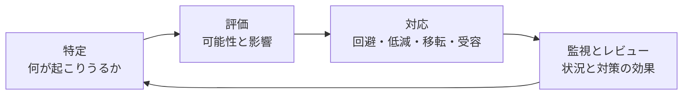
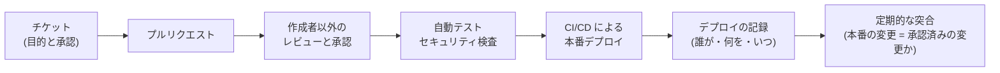

# 14.5 ガバナンス・リスク・コンプライアンスと法務

> 大口顧客のセキュリティ審査、個人データの漏えい、OSS ライセンスの違反、業務委託先との契約トラブル、上場審査での内部統制の指摘。どれも「技術の問題」の顔をして、CTO の机にやってきます。この章では、リスクマネジメントの型、セキュリティの認証、個人情報保護法と GDPR、OSS ライセンス、開発契約、内部統制を、CTO が判断を下せる深さで学びます。

| 項目 | 内容 |
|---|---|
| 学習時間の目安 | 本文 6h ＋ 演習 6h |
| 前提となる章 | [11.1 セキュリティの基本原則と脅威モデリング](../../11-security/01-security-principles/README.md)、[11.5 セキュリティ運用とサプライチェーン](../../11-security/05-security-operations/README.md)、[14.3 事業と財務のリテラシー](../03-business-and-finance/README.md) |
| 演習 | [exercises/](exercises/)（Python）＋ 記述演習 |
| キーワード | リスクマネジメント, リスク登録簿, ISMS, SOC 2, プライバシーマーク, ISMAP, PCI DSS, NIST CSF 2.0, 個人情報保護法, 漏えい等報告, GDPR, 外部送信規律, OSS ライセンス, SPDX, SBOM, 請負と準委任, 偽装請負, 著作権の帰属, 取適法, フリーランス法, J-SOX, IT 全般統制, BCP |

> **注意**: この章は法令・規格・会計に関する一般的な解説であり、法的助言ではありません。記述は 2026 年時点の情報に基づきますが、法令・ガイドライン・規格は頻繁に改正されます。実務では必ず一次資料（法令、所管官庁のガイドラインと Q&A、規格の原文）を確認し、具体的な判断は弁護士・公認会計士・税理士・社会保険労務士などの専門家に確認してください。

## この章のゴール

- [ ] リスクマネジメントのプロセス（特定・評価・対応・監視）を回し、リスク登録簿を運用できる
- [ ] ISMS・SOC 2・プライバシーマーク・ISMAP・PCI DSS・NIST CSF 2.0 の違いを説明し、事業に必要なものと取得の順序を判断できる
- [ ] 個人情報保護法と GDPR の主要な概念を説明し、漏えい時の報告・通知の義務と期限を判断の手順に落とせる
- [ ] OSS ライセンスの類型と義務を、提供形態（社内利用・SaaS・配布）と結びつけて説明し、SBOM を使ったコンプライアンスの仕組みを設計できる
- [ ] 請負・準委任・派遣の違い、偽装請負のリスク、成果物の権利の帰属など、開発契約の要点をレビューできる
- [ ] J-SOX の IT 全般統制を理解し、DevOps と職務分掌を両立させる統制と証跡を設計できる
- [ ] 日本の災害リスクを踏まえた BCP・DR の方針と、監査ログの要件を定められる

## なぜ学ぶのか

ガバナンス・リスク・コンプライアンス（GRC）と法務は、問題が起きるまで目立たず、起きたときには会社の存続に関わります。

- **委託先からの大規模な漏えい**: 2014 年、ベネッセコーポレーションの顧客情報約 3,500 万件が、グループ会社の業務委託先の従業員によって不正に持ち出されました。業務用のパソコンに私物のスマートフォンを接続して持ち出したと報じられており、端末の制御の穴と、委託先の監督のあり方が問われました。この事件は、2015 年の個人情報保護法の改正で「個人情報データベース等提供罪」が新設されるきっかけの 1 つになったとされています。
- **越境データ移転の巨額の制裁金**: 2023 年 5 月、アイルランドのデータ保護委員会は、EU から米国への個人データの移転が GDPR に違反しているとして、Meta に 12 億ユーロの制裁金を科しました。データをどこに置き、どこへ送るかというアーキテクチャの判断が、法的なリスクそのものになりうることを示しています。
- **ソフトウェアの部品表が取引条件になる**: 2021 年の米国大統領令 14028 をきっかけに、ソフトウェアの構成部品を一覧にした SBOM（Software Bill of Materials）が注目され、日本でも経済産業省が 2023 年に導入の手引を公表しました（2024 年に ver 2.0）。OSS の構成とライセンスを説明できることが、調達の場で求められるようになっています。

CTO は法律家になる必要はありません。しかし、**どこにリスクがあるかを見抜き、専門家に正しい問いを投げ、技術の仕組みで統制を効かせる** ことは CTO にしかできません。

## 1. ガバナンスとリスクマネジメント

### 1.1 GRC と 3 つのライン

- **ガバナンス**: 誰が何を決め、誰が結果に責任を負うかの仕組み。
- **リスクマネジメント**: 目標の達成に影響する不確実性を把握し、許容できる水準に管理すること。
- **コンプライアンス**: 法令・契約・規格・社内規程を守ること。

内部監査人協会（IIA）が 2020 年に示した **3 ラインモデル** は、役割の分担を整理する考え方として広く使われています。

| ライン | 担い手の例 | 役割 |
|---|---|---|
| 第 1 ライン | 開発・運用チーム、プロダクト部門 | 日々の業務の中でリスクを管理する（レビュー、テスト、アクセス管理） |
| 第 2 ライン | セキュリティ、リスク管理、コンプライアンス、法務 | 方針と基準を定め、第 1 ラインを支援・監視する |
| 第 3 ライン | 内部監査 | 独立した立場から、統制が有効かを評価し、経営と取締役会に報告する |

CTO の組織は主に第 1 ラインですが、セキュリティ部門を配下に持つ場合は第 2 ラインも担います。その場合、第 2 ラインの独立性（セキュリティ上の懸念が開発の都合で握りつぶされない経路）をどう確保するかが論点になります（[14.1](../01-role-of-cto/README.md) の CISO の報告ライン）。

### 1.2 リスクマネジメントのプロセス

リスクマネジメントの国際規格 ISO 31000 などが示す基本的なプロセスは、次の繰り返しです。



**特定** では、脅威モデリング（[11.1](../../11-security/01-security-principles/README.md)）、障害の振り返り、監査の指摘、新しい法令、事業の変化（新市場、M&A）など、複数の入り口からリスクを集めます。

**評価** では、発生可能性と影響度を段階（例: 1〜5）で見積もり、その積でリスクの大きさを比べます。対策を講じる前の **固有リスク** と、対策後の **残存リスク** を区別します。

```text
影響度
  5 |  5  10  15  20  25
  4 |  4   8  12  16  20      15 以上: 経営が対応を判断（赤）
  3 |  3   6   9  12  15       8〜14: 担当役員が対応を管理（黄）
  2 |  2   4   6   8  10       7 以下: 部門で管理（緑）
  1 |  1   2   3   4   5
    +--------------------
       1   2   3   4   5  発生可能性
```

### 1.3 リスク対応の 4 つの選択肢

| 選択肢 | 意味 | 技術での例 |
|---|---|---|
| 回避 | リスクの原因となる活動をやめる | クレジットカード番号を自社で保持せず、決済代行事業者のトークン化を使う |
| 低減 | 可能性か影響を小さくする | 多要素認証、バックアップと復旧訓練、マルチリージョン化 |
| 移転 | 影響を第三者と分担する | サイバー保険、SLA と責任の上限を定めた契約、マネージドサービスの利用 |
| 受容 | 対策をせず、リスクを受け入れる | 影響の小さい社内ツールの冗長化を見送る |

**受容は、担当者が黙って決めてよいものではありません**。誰が（リスクの大きさに応じた権限者が）、いつまで（期限付きで）受容したのかを記録し、期限が来たら見直します。記録のない受容は、単なる放置です。

### 1.4 リスク登録簿

リスク登録簿（リスクレジスター）は、リスクを一元管理する台帳です。

| ID | リスク | 可能性 | 影響 | 固有 | 対策 | 残存 | 対応 | オーナー | 期限・状態 |
|---|---|---|---|---|---|---|---|---|---|
| R-01 | 主要クラウドのリージョン障害で長時間停止 | 2 | 5 | 10 | 別リージョンへの復旧手順と訓練 | 5 | 低減 | SRE 責任者 | 9 月訓練予定 |
| R-02 | 旧バージョンの DB のサポート終了 | 5 | 3 | 15 | マネージド DB へ移行 | 3 | 低減 | 基盤チーム | 12 月完了予定 |
| R-03 | 認証基盤を知る担当者 1 人への依存 | 3 | 4 | 12 | 2 人目の育成、手順の文書化 | 6 | 低減 | CTO | 進捗 60% |
| R-04 | 退職者のアカウントの削除漏れ | 3 | 4 | 12 | IdP と人事システムの連携、四半期ごとの棚卸し | 4 | 低減 | コーポレート IT | 運用中 |
| R-05 | 社内勉強会用サーバーの停止 | 3 | 1 | 3 | なし | 3 | 受容 | 開発部長 | 2027 年 3 月に見直し |

上位のリスクは、四半期ごとに経営会議と取締役会に報告します（[14.4](../04-executive-communication/README.md)）。

## 2. セキュリティのフレームワークと認証

### 2.1 主な認証・フレームワークの比較

| 名称 | 性質 | 対象・範囲 | 主な利用場面 | 注意点 |
|---|---|---|---|---|
| ISO/IEC 27001（ISMS 認証） | 第三者認証 | 組織の情報セキュリティマネジメントシステム。附属書 A に 93 の管理策（2022 年版） | 国内外の BtoB 取引で最も広く求められる | 2013 年版からの移行期限は 2025 年 10 月 31 日。日本版は JIS Q 27001（2023 年版、その後の追補を反映した 2025 年版あり）。認証は 3 年周期で、毎年のサーベイランス審査がある |
| SOC 2 | 監査法人による保証報告書（認証ではない） | 米国公認会計士協会（AICPA）のトラストサービス規準（セキュリティ、可用性、処理のインテグリティ、機密保持、プライバシー） | 北米の顧客、グローバル企業との取引 | Type I はある時点の設計、Type II は一定期間（一般に数か月〜1 年）の運用状況を評価する。顧客が重視するのは Type II |
| プライバシーマーク | 第三者認定 | 事業者全体の個人情報の管理体制。JIS Q 15001 に基づく（2023 年版に対応した基準を 2024 年 10 月以降の申請から適用） | 国内の BtoC、個人情報を大量に扱う業種、官公庁の調達 | 有効期間は 2 年。主に日本国内で通用する |
| ISMAP | 政府による評価・登録制度 | 政府機関が利用するクラウドサービス | 政府・自治体向けのクラウドサービス | 政府機関は原則として登録済みのサービスから調達する。影響の小さい SaaS 向けの ISMAP-LIU もある。取得の負担は大きい |
| PCI DSS v4.0 | カード業界のセキュリティ基準 | クレジットカード情報を保存・処理・伝送する環境 | カード決済を扱う事業者 | v3.2.1 は 2024 年 3 月に廃止、v4.0 で追加された要件の多くは 2025 年 3 月末から必須（2024 年に v4.0.1 を公表）。日本では割賦販売法などにより、加盟店はカード情報の非保持化か PCI DSS への準拠が求められている |
| NIST CSF 2.0 | フレームワーク（認証ではない） | 組織のサイバーセキュリティの取り組み全体 | 成熟度の自己評価、取締役会への説明 | 2024 年 2 月公開。統治（Govern）・特定・防御・検知・対応・復旧の 6 つの機能。2.0 で「統治」が追加され、経営の責任が明確になった |

### 2.2 何を、どの順で取るか

認証は、**顧客と市場が求めるもの** から逆算して選びます。

- **国内の大企業との BtoB 取引**: まず ISMS 認証が求められることが多く、あわせて顧客ごとのセキュリティチェックシートへの回答が必要になります。
- **北米の顧客・グローバル企業**: SOC 2 Type II が事実上の標準です。Type II には運用期間の観察が必要なので、必要になる時期から逆算して準備を始めます。
- **大量の個人情報を扱う国内の BtoC**: プライバシーマークが取引や採用で評価されることがあります。
- **政府機関向けのクラウドサービス**: ISMAP（または ISMAP-LIU）の登録が必要になります。準備と費用の負担が大きいので、事業の見込みと合わせて判断します。
- **カード決済**: 自社でカード情報を保持しない設計（決済代行事業者のトークン化など）にすると、PCI DSS の対象範囲を大幅に小さくできます。これはリスク対応の「回避」の典型例です。

### 2.3 認証はセキュリティそのものではない

認証の取得は、一定の管理体制があることの証明ですが、安全であることの保証ではありません。認証の審査に通るための文書を整えることが目的化すると、実態と文書が乖離します。

- **統制を開発の仕組みに埋め込む**: アクセス権の申請と承認、変更のレビュー、脆弱性の管理を、ツールとワークフローで自動的に実行・記録させる。
- **証跡を自動で集める**: 審査のたびに手作業でスクリーンショットを集めるのではなく、ログとチケットから証跡が出てくるようにする（6.5 節）。
- **セキュリティチェックシートへの回答を資産にする**: 顧客ごとに届く数百項目の質問票への標準回答集を整備し、公開できる情報はトラストセンター（セキュリティの取り組みを説明するページ）にまとめると、営業のサイクルが短くなります。

## 3. プライバシーと個人情報の法規制

### 3.1 個人情報保護法の基本概念

日本の個人情報保護法（個人情報の保護に関する法律）の主な用語です（定義は条文とガイドラインで確認してください）。

| 用語 | 概要 |
|---|---|
| 個人情報 | 生存する個人に関する情報で、特定の個人を識別できるもの（他の情報と容易に照合して識別できるものを含む）、または個人識別符号（マイナンバー、旅券番号、生体認証に使う身体の特徴のデータなど）を含むもの |
| 個人データ | 個人情報データベース等（検索できるように体系的に構成したもの）を構成する個人情報 |
| 保有個人データ | 事業者が開示・訂正・利用停止などを行う権限を持つ個人データ（2022 年施行の改正で、6 か月以内に消去するデータも含まれるようになった） |
| 要配慮個人情報 | 人種、信条、社会的身分、病歴、犯罪の経歴、犯罪により害を被った事実など、不当な差別や偏見が生じないよう特に配慮が必要なもの。取得には原則として本人の同意が必要で、オプトアウトによる第三者提供はできない |
| 仮名加工情報 | 他の情報と照合しない限り特定の個人を識別できないよう加工した情報（2022 年施行の改正で新設）。社内での分析などに使いやすくするための類型 |
| 匿名加工情報 | 特定の個人を識別できず、復元もできないよう加工した情報。一定のルールの下で、本人の同意なく第三者に提供できる |
| 個人関連情報 | 個人情報に当たらない、生存する個人に関する情報（Cookie の識別子、閲覧履歴など）。提供先で個人データとして取得されることが想定される場合は、本人の同意が得られていることの確認が必要 |

### 3.2 取得・利用・管理のルール

- **利用目的**: できる限り具体的に特定し、本人に通知または公表する。特定した目的の範囲を超えて使うには、原則として本人の同意が必要。
- **安全管理措置**: 組織的・人的・物理的・技術的な安全管理措置を講じる。外国でデータを扱う場合は、その国の制度などを把握したうえで措置を講じる（外的環境の把握）。
- **従業者と委託先の監督**: 従業者への教育と、個人データの取り扱いを委託する先の選定・契約・監督。再委託も含めて監督が及ぶようにする。
- **保有個人データに関する事項の公表と開示等の請求**: 本人からの開示・訂正・利用停止などの請求に応じる仕組み。

### 3.3 第三者提供と越境移転

個人データを第三者に提供するには、原則として **本人の同意** が必要です。法令に基づく場合などの例外のほか、個人情報保護委員会への届出による **オプトアウト** の制度もあります（要配慮個人情報には使えません）。

**委託・事業承継・共同利用** に伴う提供は「第三者」への提供には当たりません。たとえば、顧客データの処理を外部の事業者に委託するのは委託であり、同意は不要ですが、委託先の監督の義務が生じます。

クラウドサービスについて、個人情報保護委員会は、サービスの提供事業者が契約とアクセス制御によってデータを **取り扱わない** こととなっている場合は、そもそも個人データの「提供」に当たらないという考え方を Q&A で示しています。その場合でも、自社のデータとしての安全管理措置は必要で、データが保存される国の制度などを把握する「外的環境の把握」も求められます。

**外国にある第三者への提供**（第 28 条）には、次のいずれかが必要です。

1. 本人の同意（提供先の国の名称、その国の個人情報保護の制度、提供先が講じる措置などの情報を本人に提供したうえで）
2. 提供先が、個人情報保護法の義務に相当する措置を継続的に講じる体制を整えていること（契約などによる。提供元には必要な措置と、本人の求めに応じた情報提供の義務がある）
3. 提供先の国が、日本と同等の水準の制度を持つ国として指定されていること（EU・英国）

アーキテクチャの判断（データをどのリージョンに置くか、どの海外 SaaS を使うか、サポートを海外拠点から行うか）は、これらの義務に直結します。設計の段階で法務と確認してください。

### 3.4 漏えい等の報告と本人への通知

2022 年 4 月に施行された改正で、一定の漏えい等（漏えい・滅失・毀損。そのおそれを含む）が起きたときの **個人情報保護委員会への報告と本人への通知** が義務になりました（第 26 条）。

報告の対象となるのは、次のいずれかに当たる事態です。

1. 要配慮個人情報が含まれる個人データの漏えい等
2. 不正に利用されることにより財産的被害が生じるおそれがある個人データの漏えい等（クレジットカード番号など）
3. 不正の目的をもって行われたおそれがある行為による個人データの漏えい等（不正アクセス、内部不正など）。2024 年 4 月施行の規則改正で、Web サイトの入力フォームから盗み取られる「ウェブスキミング」のように、事業者が取得しようとしている個人情報も対象に加わった
4. 本人の数が 1,000 人を超える漏えい等

**高度な暗号化その他の個人の権利利益を保護するために必要な措置** が講じられている場合は、報告の対象になりません（鍵が漏えいしていないことなどが前提）。

| 手続き | 期限の考え方（ガイドラインによる） |
|---|---|
| 速報 | 事態を知った後、速やかに。目安は知った時点から概ね 3〜5 日以内 |
| 確報 | 知った日を 1 日目として 30 日以内（3 の不正の目的によるおそれがある場合は 60 日以内）。末日が土日・祝日・年末年始の閉庁日なら翌日 |
| 本人への通知 | 事態の状況に応じて速やかに。通知が困難な場合は、公表などの代替措置 |

実務で重要な点がいくつかあります。

- **「知った」時点**: 法人の場合、いずれかの部署が事態を知った時点が基準になるとされています。現場の担当者が気づいたのに、経営に上がるまで数日かかれば、その分だけ期限は迫っています。検知から法務・経営へのエスカレーションを、インシデント対応の手順に組み込んでおきます（[14.6](../06-crisis-management/README.md)）。
- **委託先で起きた場合**: 委託先は、委託元に速やかに通知すれば、自らの報告義務が免除されるとされています。委託契約に、通知の期限と方法を書いておきます。
- **報告先**: 原則は個人情報保護委員会ですが、業種によっては権限の委任を受けた省庁が報告先になります。

演習で実装する `breach_notice.py`（**教育用に簡略化した判定ツール。法的助言ではありません**）で、不正アクセスにより EU の会員を含む 2,300 人分のデータが漏えいしたおそれがある場合（2026 年 3 月 5 日の夕方に把握）を整理した例です。

```text
【教育用・簡略化。法的助言ではありません】
[APPI] 個人情報保護委員会へ速報 — 2026-03-10 18:30 JST
    該当: 不正の目的によるおそれ・1,000人超。速やかに（目安: 知った時点から概ね3〜5日以内）。業種によっては権限の委任を受けた省庁が報告先になる
[APPI] 個人情報保護委員会へ確報 — 2026-05-07 23:59 JST
    知った日を1日目として30日以内（不正の目的のおそれがある場合は60日以内）。末日が土日・祝日・年末年始なら翌開庁日
[APPI] 本人へ通知 — 期限は日時で定まらない
    当該事態の状況に応じて速やかに。困難な場合は公表などの代替措置
[GDPR] 侵害を記録する — 期限は日時で定まらない
    事実・影響・対応を文書化する（第33条5項）。通知が不要な場合も必要
[GDPR] 監督機関へ通知 — 2026-03-08 18:30 JST
    不当な遅滞なく、可能なら認識から72時間以内（第33条）。遅れた場合は理由を添える
[GDPR] 本人へ通知 — 期限は日時で定まらない
    高いリスクがある場合、不当な遅滞なく（第34条）
```

確報の期限は、60 日目にあたる 5 月 3 日が日曜・祝日で、その後もゴールデンウィークの休日が続くため、5 月 7 日になっています。一方、GDPR の監督機関への通知は 72 時間後の 3 月 8 日（日曜）で、休日でも延びません。**同じ事故でも、制度ごとに期限の数え方がまったく違う** ことが分かります。

個人情報保護法は定期的に見直されており、課徴金制度の導入などが議論されてきました。最新の改正の状況は、個人情報保護委員会の資料で確認してください。

### 3.5 GDPR

EU の一般データ保護規則（GDPR）は、日本企業にも適用されることがあります。

- **適用範囲（第 3 条）**: EU に拠点がある場合に加え、EU にいる人に商品・サービスを提供する場合や、EU にいる人の行動を監視する場合（行動のトラッキングなど）には、EU 域外の事業者にも適用されます。後者の場合、原則として EU 域内に代理人を置く必要があります（第 27 条）。
- **適法性の根拠（第 6 条）**: 同意、契約の履行、法的義務、生命に関する利益、公共の利益、正当な利益の 6 つのいずれかが必要です。何でも同意で済ませるのではなく、処理ごとに根拠を選びます。
- **管理者と処理者（第 28 条）**: 他社の指示で個人データを処理する **処理者（processor）** と、目的と手段を決める **管理者（controller）** を区別し、両者の間でデータ処理契約（DPA: Data Processing Agreement）を結びます。SaaS 事業者は、顧客企業に対して処理者の立場になることが多くあります。
- **域外移転**: EU から第三国へ個人データを移転するには、十分性認定（日本と EU は 2019 年 1 月に相互の十分性認定の枠組みを発効）や標準契約条項（SCC）などが必要です。
- **侵害の通知（第 33 条・第 34 条）**: 管理者は、個人データの侵害に気づいてから不当な遅滞なく、可能であれば 72 時間以内に監督機関へ通知します（個人の権利と自由にリスクが生じる可能性が低い場合を除く）。高いリスクがある場合は、本人にも不当な遅滞なく通知します。処理者は、管理者に不当な遅滞なく通知します。通知が不要な場合も、侵害の事実と対応は記録しておく必要があります。EU に拠点のない事業者は、代理人を置いていても一括の窓口（ワンストップショップ）を使えず、影響を受けた本人がいる各国の監督機関に通知が必要になる、というのが欧州データ保護会議（EDPB）のガイドライン（9/2022, 2023 年の改訂版）の考え方です。
- **制裁金（第 83 条）**: 重い違反では、2,000 万ユーロまたは全世界の年間売上高の 4% のいずれか高い方が上限です。

### 3.6 電気通信事業法の外部送信規律

2023 年 6 月 16 日に施行された改正電気通信事業法の **外部送信規律** は、Web サイトやアプリが、利用者の端末から情報（Cookie の識別子、閲覧履歴など）を外部に送信させる場合に、送信される情報の内容・送信先・利用目的を、利用者に通知するか容易に知りうる状態に置く（公表する）こと、または同意の取得やオプトアウトの手段の提供を求めるものです。対象は、SNS・検索・ニュースや動画の配信など、総務省令で定める一定のサービスを提供する事業者で、電気通信事業の登録・届出をしていない事業者も含まれます。自社のサービスが対象になるかは、総務省のガイドラインで確認してください。

実務では、①サイト・アプリに埋め込まれたタグと SDK の棚卸し、②送信される情報と送信先の一覧化、③公表ページの作成と、タグの追加時にページを更新する運用、が必要になります。マーケティング部門が自由にタグを追加できる運用では、公表内容が実態とずれていきます。

### 3.7 エンジニアリングに落とし込む

プライバシーの法令は、最終的にはシステムの設計と運用で守られます。

- **データマップ**: どの個人データが、どのシステムに、どの目的で、どの国に、どれだけの期間保存されているか。漏えい時の報告判断（本人の数、要配慮個人情報の有無）も、これがなければできない。
- **目的と保存期間のタグ付け**: データに利用目的と保存期間を紐づけ、期限が来たら削除する（バックアップとログの保存期間も含めて設計する）。
- **最小化と仮名化**: 分析用の環境には必要な項目だけを、可能なら仮名化して渡す。
- **アクセス制御とアクセスログ**: 誰がいつどの個人データにアクセスしたかを記録し、定期的に確認する。
- **本人からの請求への対応**: 開示・削除などの請求に、手作業に頼らず対応できる仕組み。
- **委託先・再委託先の管理**: 利用している SaaS と、その先の再委託先（サブプロセッサー）の一覧。
- **影響評価**: 新しい機能や新しいデータの利用を始める前に、プライバシーへの影響を評価する（GDPR では高リスクの処理について DPIA が求められる。第 35 条）。

## 4. OSS ライセンスとコンプライアンス

### 4.1 ライセンスの類型

| 類型 | 主なライセンス | 主な義務 | 注意点 |
|---|---|---|---|
| パーミッシブ | MIT, BSD-2-Clause / BSD-3-Clause, Apache-2.0, ISC | 著作権表示とライセンス文の保持 | Apache-2.0 は特許ライセンスの明示的な許諾を含み、特許訴訟を起こすと許諾が終了する条項がある。NOTICE ファイルの保持、変更点の明示も必要 |
| 弱いコピーレフト | LGPL-2.1 / LGPL-3.0, MPL-2.0, EPL-2.0 | そのライブラリ（MPL はファイル単位）を改変したらソースを開示 | LGPL は、利用者がライブラリを差し替えられるようにする義務がある（静的リンクでは注意が必要） |
| 強いコピーレフト | GPL-2.0 / GPL-3.0 | 頒布するとき、結合した著作物全体のソースを同じライセンスで開示 | 頒布しなければ（社内利用・サーバー上での利用のみなら）ソース開示の義務は生じない |
| ネットワークコピーレフト | AGPL-3.0 | GPL の義務に加え、改変したプログラムをネットワーク越しに利用させる場合、その利用者にソースを提供する（第 13 条） | SaaS でも義務が生じうる。多くの企業が社内ポリシーで利用を禁止または厳しく制限している |
| ソース公開型（OSS ではない） | BUSL-1.1（Business Source License）, SSPL-1.0, Elastic-2.0 | ソースは読めるが、競合するサービスとしての提供などを制限する | OSI（Open Source Initiative）が承認したオープンソースライセンスではない。条件はライセンスごとに大きく異なるので個別に確認する |

SPDX の ID の紛らわしさにも注意してください。**BSL-1.0 は Boost Software License**（パーミッシブ）で、Business Source License は **BUSL-1.1** です。

### 4.2 義務が発生するきっかけは「頒布」

GPL などのコピーレフトの義務は、多くの場合、ソフトウェアを他者に **頒布（配布）** するときに発生します。自社の提供形態が頒布に当たるかどうかが、判断の出発点です。

| 提供形態 | 頒布に当たるか | 例 |
|---|---|---|
| 社内での利用 | 一般に当たらない（グループ会社や委託先への提供は要確認） | 社内の業務ツール |
| サーバー上で動かし、機能だけを提供（SaaS） | サーバー側のコードは一般に当たらない。ただし AGPL は別 | Web サービスのバックエンド |
| ブラウザに送る JavaScript | 当たる | フロントエンドのバンドル |
| モバイルアプリ、デスクトップアプリ | 当たる | App Store で配布するアプリ |
| 顧客の環境で動かすもの | 当たる | オンプレミス版、コンテナイメージ、アプライアンス、組み込み機器 |

「うちは SaaS だから関係ない」は、フロントエンドとモバイルアプリ、将来のオンプレミス版の可能性を見落としています。

### 4.3 互換性・デュアルライセンス・例外

- **互換性**: 異なるライセンスのコードを組み合わせると、両方の条件を同時に満たせないことがあります。たとえば FSF（フリーソフトウェア財団）は、Apache-2.0 は GPL-3.0 とは両立するが GPL-2.0 とは両立しない、という見解を示しています。
- **デュアルライセンス（OR）**: 「MIT OR Apache-2.0」のように複数のライセンスから選べる場合は、自社に都合のよい方を選んで従えばよい。
- **例外（WITH）**: 「GPL-2.0-only WITH Classpath-exception-2.0」のように、例外条項で条件が緩められていることがあります（Java のクラスライブラリなど）。例外の内容によって判断が変わります。

### 4.4 ソース公開型ライセンスへの移行という流れ

2010 年代後半から、OSS を開発する企業が、クラウド事業者による「ただ乗り」への対抗として、ライセンスをソース公開型に変更する例が相次ぎました。

- **MongoDB**（2018 年）: 独自の SSPL を作成して移行。
- **Elastic**（2021 年）: Elasticsearch と Kibana を Apache-2.0 から SSPL と Elastic License のデュアルライセンスに変更。AWS などは OpenSearch としてフォーク。2024 年には AGPL-3.0 も選択肢に加えた。
- **HashiCorp**（2023 年）: Terraform などを MPL-2.0 から BUSL-1.1 に変更。Linux Foundation の下で OpenTofu としてフォークされた。
- **Redis**（2024 年）: BSD-3-Clause から RSALv2 と SSPLv1 のデュアルライセンスに変更し、Valkey としてフォークされた。2025 年の Redis 8 で AGPL-3.0 を選択肢に加えた。

BUSL は、一定の期間（最長 4 年）が経過すると指定のオープンソースライセンスに変わる仕組みを持ちますが、それまでは提供元の定める制限に従う必要があります。こうした変更は **新しいバージョンから** 適用されるのが一般的で、変更前のバージョンは元のライセンスのまま使えます。重要な依存先については、ライセンスの変更を監視し、バージョンの固定・フォークの評価・代替製品の検討を事前にしておきます（[14.2](../02-technology-strategy/README.md) の Build／Buy の判断）。

### 4.5 OSS コンプライアンスの仕組み

| 要素 | 内容 |
|---|---|
| ポリシー | ライセンスの類型 × 提供形態ごとの「許可・要レビュー・禁止」の基準。例外の承認手順 |
| 棚卸し（インベントリ） | ソフトウェア構成分析（SCA）のツールを CI に組み込み、依存関係とライセンスを自動で検出する。推移的な依存（依存の依存）も含める |
| SBOM | 構成部品の一覧を標準形式（SPDX や CycloneDX。SPDX は ISO/IEC 5962:2021 として国際標準化されている）で生成・保管し、脆弱性の管理にも使う |
| レビュー | ポリシーで「要レビュー」になったものを、法務と技術で判断する流れ。判断の記録を残す |
| 表示義務の履行 | 著作権表示とライセンス文をまとめたサードパーティ通知（NOTICE）を、アプリや配布物に含める |
| 貢献のルール | 従業員が OSS に貢献するときの承認と、CLA（貢献者ライセンス契約）・DCO への対応 |

組織の OSS 管理の仕組みについては、OpenChain の仕様が ISO/IEC 5230 として国際標準になっています。経済産業省の「ソフトウェア管理に向けた SBOM の導入に関する手引」も、導入の手順と実務上の論点を整理しています。

### 4.6 SPDX ライセンス式を自動で判定する

依存パッケージのライセンスは、SPDX の **ライセンス式** で表されます。

| 要素 | 意味 | 例 |
|---|---|---|
| `+` | そのバージョン以降 | `GPL-2.0+`（現在は `GPL-2.0-or-later` という ID が推奨） |
| `WITH` | 例外の付加 | `GPL-2.0-only WITH Classpath-exception-2.0` |
| `AND` | 両方に従う必要がある | `MIT AND BSD-3-Clause` |
| `OR` | どちらかを選べる | `MIT OR Apache-2.0` |

演算子の優先順位は `+` > `WITH` > `AND` > `OR` で、括弧で変えられます。ライセンスの ID は大文字小文字を区別せずに照合し、演算子は大文字で書きます。ポリシーで判定するときは、**OR なら最も有利な選択肢を選び、AND なら最も厳しい判定を採用** します。

演習で実装する `license_policy.py`（解答例）で、ある製品の依存パッケージを提供形態ごとに判定した結果です（ポリシーは教育用に簡略化したものです）。

```text
== 提供形態: 社内利用（全体: 要レビュー）
  要レビュー bad-metadata   MIT/Apache-2.0
  要レビュー legacy-widget  LicenseRef-Proprietary-Vendor
  要レビュー pdf-engine     AGPL-3.0-only
  要レビュー search-server  SSPL-1.0 OR Elastic-2.0 OR AGPL-3.0-only
  許可       crypto-lib     Apache-2.0 OR MIT
  許可       image-codec    (MIT AND BSD-3-Clause) OR GPL-2.0-or-later
  許可       jdbc-driver    GPL-2.0-only WITH Classpath-exception-2.0
  許可       web-framework  MIT
== 提供形態: SaaS（全体: 禁止）
  禁止       pdf-engine     AGPL-3.0-only
  要レビュー bad-metadata   MIT/Apache-2.0
  要レビュー legacy-widget  LicenseRef-Proprietary-Vendor
  要レビュー search-server  SSPL-1.0 OR Elastic-2.0 OR AGPL-3.0-only
  許可       crypto-lib     Apache-2.0 OR MIT
  許可       image-codec    (MIT AND BSD-3-Clause) OR GPL-2.0-or-later
  許可       jdbc-driver    GPL-2.0-only WITH Classpath-exception-2.0
  許可       web-framework  MIT
== 提供形態: 配布（全体: 禁止）
  禁止       pdf-engine     AGPL-3.0-only
  要レビュー bad-metadata   MIT/Apache-2.0
  要レビュー jdbc-driver    GPL-2.0-only WITH Classpath-exception-2.0
  要レビュー legacy-widget  LicenseRef-Proprietary-Vendor
  要レビュー search-server  SSPL-1.0 OR Elastic-2.0 OR AGPL-3.0-only
  許可       crypto-lib     Apache-2.0 OR MIT
  許可       image-codec    (MIT AND BSD-3-Clause) OR GPL-2.0-or-later
  許可       web-framework  MIT
```

同じ依存関係でも、提供形態によって判定が変わることが分かります。`bad-metadata` の `MIT/Apache-2.0` は SPDX の式として不正（`/` は演算子ではない）なので、機械的に判定せず人が確認する扱いにしています。パッケージのメタデータは、実務でもしばしば不正確です。

## 5. 契約の実務

### 5.1 請負・準委任・派遣

| | 請負（民法 632 条） | 準委任（民法 656 条） | 労働者派遣 |
|---|---|---|---|
| 目的 | 仕事の完成 | 事務の処理（役務の提供） | 労働力の提供 |
| 報酬 | 完成した成果物に対して | 履行の割合に応じて（履行割合型）、または成果に対して（成果完成型） | 派遣元に支払う |
| 指揮命令 | 受注者（ベンダー）が自社の作業者に行う | 受任者（ベンダー）が自社の作業者に行う | 派遣先（発注者）が直接行える |
| 完成の義務 | ある | ない（善管注意義務を負う） | ない |
| 契約不適合責任 | ある | 原則としてない | ない |
| 典型的な用途 | 要件が確定した開発 | 要件定義、アジャイル開発、保守運用、SES | 自社のチームに人員を加える |

2020 年 4 月施行の民法改正で、準委任にも **成果に対して報酬を支払う類型**（成果完成型。民法 648 条の 2）があることが明文化されました。IPA は、民法改正に対応した「情報システム・モデル取引・契約書」（第二版）と、アジャイル開発向けのモデル契約（準委任を前提とする）を公開しています。

### 5.2 偽装請負と SES

請負や準委任の契約なのに、発注者が受注者の作業者に **直接、業務の指示や勤怠の管理** をしていると、実態は労働者派遣とみなされ、「偽装請負」として労働者派遣法や職業安定法に違反するおそれがあります。判断の基準としては、いわゆる「37 号告示」（労働者派遣事業と請負により行われる事業との区分に関する基準）が知られています。さらに、法の規制を免れる目的で偽装請負を行った場合には、発注者がその作業者に労働契約の申し込みをしたとみなされる制度（労働契約申込みみなし制度）もあります。

SES（システムエンジニアリングサービス）と呼ばれる、技術者の役務を準委任契約で提供する形態は日本で広く使われていますが、発注者のチームに作業者が常駐・混在するため、このリスクが特に高くなります。

| 避けるべきこと（準委任・請負の場合） | 代わりにすること |
|---|---|
| 発注者の社員が、作業者個人に日々のタスクを割り当てる | 受注者の責任者に依頼し、受注者の責任者が作業者に割り当てる |
| 発注者が作業者の勤怠・残業・休暇を管理する | 勤怠の管理は受注者が行う |
| 発注者の評価制度で作業者を評価する | 契約上の成果・役務の品質を受注者と確認する |
| 作業者を発注者の社員と区別なく扱う | 役割・連絡経路・チャットのチャンネルを区別する |

直接の指示が必要な働き方をしたいなら、契約形態そのものを労働者派遣（許可を受けた派遣元から）にするか、自社で雇用することを検討します。判断は弁護士や社会保険労務士に相談してください。

### 5.3 契約不適合責任と検収

2020 年の民法改正で、従来の「瑕疵担保責任」は **契約不適合責任** に改められました。成果物が契約の内容に適合しない場合、発注者は **追完（修補など）の請求、代金の減額の請求、損害賠償の請求、契約の解除** ができます。請負では、発注者が不適合を **知った時から 1 年以内** に通知しなければ権利を失うのが原則です（民法 637 条）。これらは契約で変更できるので、期間の起算点（納入時か、知った時か）と長さを契約で明確にします。

**検収** の条項では、検収の期間・基準（何をもって合格とするか）・期間内に通知がない場合の扱い（みなし合格）を定めます。検収は、契約不適合責任の期間の起算点や、報酬の支払い時期に関わる重要な手続きです。

### 5.4 SLA

SLA（Service Level Agreement）は、提供するサービスの水準を約束する契約です。

- **定義**: 何を「稼働」とみなすか（どの機能が、どの応答時間で動いていれば稼働か）、どう計測するか（誰の、どの計測を正とするか）。
- **除外**: 計画メンテナンス、顧客側の原因、不可抗力。
- **救済**: 目標を下回った場合のサービスクレジット（利用料の一部返還）。通常は上限がある。
- **責任の上限**: 損害賠償の上限額（年間の利用料など）と、除外される損害（逸失利益など）。

社内の目標である SLO（[10.3](../../10-cloud-and-sre/03-reliability-engineering/README.md)）は、SLA より厳しく設定するのが原則です。SLA を SLO と同じ水準にすると、目標を少し外れただけで返金が発生します。営業が技術の確認なしに SLA を約束しないルールも必要です（[14.4](../04-executive-communication/README.md)）。

### 5.5 知的財産の帰属

| 論点 | 要点 |
|---|---|
| 従業員が作ったプログラム | 法人の発意に基づき、職務上作成するプログラムは、契約や就業規則に別段の定めがなければ法人が著作者になる（職務著作。著作権法 15 条。プログラムの場合は法人名義での公表が要件にならない） |
| 業務委託先・フリーランスが作ったもの | 著作権は原則として作成した側に帰属する。**契約で譲渡を定める** 必要がある |
| 譲渡の条項の書き方 | 「著作権（著作権法第 27 条及び第 28 条に規定する権利を含む）を譲渡する」と明記する。27 条（翻訳権・翻案権など）と 28 条（二次的著作物の利用に関する権利）は、特に記載しないと譲渡した側に留保されたものと推定される（著作権法 61 条 2 項）。改変や派生版の作成ができなくなるおそれがある |
| 著作者人格権 | 公表権・氏名表示権・同一性保持権は譲渡できない（著作権法 59 条）。そのため「著作者人格権を行使しない」旨の特約（不行使特約）を入れる |
| 職務発明 | 勤務規則などであらかじめ定めれば、特許を受ける権利を発生時から会社に帰属させられる（特許法 35 条、2016 年施行の改正）。従業員は相当の利益を受ける権利を持つ |
| 既存の資産と汎用部分 | 受注者が以前から持っているライブラリやノウハウの扱い（譲渡の対象外とし、利用の許諾を受けるなど）を定める |
| 成果物に含まれる OSS | 成果物に含まれる OSS の一覧とライセンスの開示、ライセンスの遵守を受注者に求める |

資金調達や M&A の技術 DD では、ソースコードの権利が会社に帰属していることが必ず確認されます（[14.7](../07-due-diligence-and-ma/README.md)）。創業期に創業者や業務委託先が書いたコードの権利を、早い段階で契約で整理しておきます。

### 5.6 秘密保持契約・利用規約・プライバシーポリシー

- **秘密保持契約（NDA）**: 秘密情報の定義、目的外利用の禁止、例外（公知の情報、独自に開発した情報など）、有効期間、返還・破棄、開示を受けてよい人の範囲。
- **利用規約**: SaaS の利用規約は、多くの場合、民法の **定型約款**（民法 548 条の 2〜548 条の 4。2020 年施行）に当たります。利用規約を利用者の同意なく変更するには、変更が利用者の一般の利益に適合するか、変更の必要性・内容の相当性などに照らして合理的であることなどが必要で、効力発生時期を定めてインターネットなどで事前に周知しなければなりません。機能や料金の変更の計画は、法務と早めに共有します。
- **プライバシーポリシー**: 個人情報保護法で公表が求められる事項（利用目的、安全管理措置、開示等の請求の手続きなど）と、外部送信規律の公表事項を、実態に合わせて維持します。

### 5.7 下請法から取適法へ、そしてフリーランス法

開発を外部に委託する CTO が知っておくべき取引の法律が、近年大きく変わりました。

| 法律 | 施行 | 要点 |
|---|---|---|
| 中小受託取引適正化法（取適法）。旧・下請代金支払遅延等防止法（下請法）を改正 | 2026 年 1 月 1 日 | 正式名称は「製造委託等に係る中小受託事業者に対する代金の支払の遅延等の防止に関する法律」。「下請事業者」は「中小受託事業者」、「親事業者」は「委託事業者」に。適用の基準に従業員数の基準が追加され、協議に応じない一方的な代金の決定の禁止、手形払い等の禁止などが加わった。ソフトウェアの開発の委託（情報成果物作成委託）なども対象になる |
| フリーランス・事業者間取引適正化等法（フリーランス法） | 2024 年 11 月 1 日 | フリーランス（従業員を使用しない個人・一人社長）に業務を委託する際の、取引条件の明示、報酬の支払期日（原則として給付を受けた日から 60 日以内）、一定の禁止行為、募集情報の的確な表示、ハラスメント対策、6 か月以上の契約を中途解除・不更新する場合の原則 30 日前の予告など |

どちらも、発注側の規模や取引の内容によって適用の有無と義務が変わります。自社の取引が対象になるかは、公正取引委員会・中小企業庁・厚生労働省の資料で確認し、法務と相談してください。発注の書面（または電磁的な記録）で条件を明示し、支払いのサイクルを法の期限に合わせることは、技術組織の発注の業務フローに組み込む必要があります。

## 6. 内部統制と IPO 準備

### 6.1 J-SOX の概要

金融商品取引法に基づく **財務報告に係る内部統制の報告制度**（通称 J-SOX）では、上場企業の経営者が、財務報告に係る内部統制の有効性を評価して内部統制報告書を提出し、監査人がその監査を行います。評価と監査の基準は 2023 年に改訂され、2024 年 4 月 1 日以後に開始する事業年度から適用されています。

新規上場の会社は、上場後 3 年間は内部統制報告書に対する監査人の監査を免除される制度があります（資本金 100 億円以上または負債総額 1,000 億円以上の大規模な会社を除く）。ただし内部統制報告書の提出自体は必要で、上場審査では内部管理体制の整備・運用の状況が確認されます。

日本の基準では、内部統制の基本的要素の 1 つとして **IT への対応** が挙げられているのが特徴です。

### 6.2 IT 統制の 3 つの層

| 層 | 内容 | 例 |
|---|---|---|
| IT 全社統制 | IT に関する全社的な方針と体制 | IT に関する規程、IT 部門の体制、リスク評価 |
| IT 全般統制（ITGC） | 業務処理統制が継続して有効に機能するための、IT 基盤の統制 | 次の 4 つの領域 |
| IT 業務処理統制 | 個々の業務システムに組み込まれた統制 | 入力の検証、承認の権限、計算の正確性、マスタデータの管理、エラーの修正と再処理 |

IT 全般統制は、一般に次の 4 つの領域で整理されます。

1. **システムの開発・保守に係る管理**（変更管理）: 変更の承認、テスト、本番への移行の管理。
2. **システムの運用・管理**: ジョブの監視、バックアップ、障害への対応。
3. **内外からのアクセス管理などシステムの安全性の確保**: アカウントの発行・変更・削除、特権アカウントの管理、アクセス権の定期的な見直し。
4. **外部委託に関する契約の管理**: 委託先の選定と監督、委託先の統制の評価。

評価の対象は、財務報告に影響するシステム（会計、販売・請求、購買、給与など）です。SaaS 企業では、請求と売上の計上に関わる自社のプロダクトそのものが対象になることがあります。

### 6.3 クラウドと SaaS の時代の IT 全般統制

| 領域 | 典型的な統制 |
|---|---|
| アクセス管理 | IdP による一元管理と多要素認証。入社・異動・退職と連動したアカウントの発行・変更・削除。特権アカウントの限定と、使用時の申請・記録。四半期ごとのアクセス権の棚卸し |
| 変更管理 | チケットで変更の目的と承認を記録。作成者以外によるコードレビュー。自動テスト。CI/CD パイプラインを本番への唯一の経路にする。緊急変更の手順と事後承認 |
| 運用管理 | バッチ処理とジョブの監視。バックアップと復元の試験。インシデントの記録と振り返り |
| 外部委託の管理 | クラウドや SaaS の事業者の保証報告書（財務報告に関わる統制については SOC 1、セキュリティ全般については SOC 2）を入手して評価する。報告書が利用者側に求める統制（相補的な統制）を自社で実施する |

### 6.4 職務分掌と DevOps

内部統制では伝統的に、**職務分掌**（開発する人と、本番に反映する人を分ける）が重視されてきました。一方、DevOps では同じチームが開発から運用まで担います。両立させる鍵は、**人の分離の代わりに、仕組みで同じ目的を果たす補完的な統制** です。



- 本番への変更は、CI/CD パイプラインを通る経路だけに限定する。個人が本番を直接変更する権限は持たない。
- ブランチ保護で、作成者以外の承認がなければマージできないようにする。
- 緊急時に本番へ直接アクセスする場合（ブレークグラス）は、申請・一時的な権限付与・操作の記録・事後のレビューをセットにする。
- 定期的に、本番に反映された変更の一覧と承認済みの変更の一覧を突き合わせ、承認のない変更がないことを確認する。

### 6.5 監査証跡を「作る」のではなく「出てくる」ようにする

監査人は、統制が一定期間にわたって運用されていたことを、証跡で確かめます。典型的には、期間中の変更やアカウントの一覧（母集団）からサンプルを抽出し、それぞれについて承認の記録（承認がデプロイより前か）、アクセス権の見直しの記録（誰が、いつ、何を確認したか）を求めます。

証跡を後から手作業で集めると、漏れと負担が大きくなります。チケット・プルリクエスト・デプロイ・IdP のログが自動的に紐づき、期間を指定すれば一覧が出てくるように、最初から設計しておきます。

### 6.6 IPO 準備の技術面のチェックリスト

日本の IPO では、申請期（N 期）の 2 期前（直前々期、N−2 期）から内部管理体制を整え、直前期（N−1 期）に運用の実績を積むのが一般的です。技術面では、次のことを確認します。

- [ ] 財務報告に関わるシステム（会計、請求、売上の計上）と、そのデータの流れを特定している
- [ ] IT 全般統制の 4 つの領域について、規程・手順・証跡がそろっている
- [ ] 本番環境へのアクセスと変更が、承認と記録の下にある
- [ ] 外部委託先（クラウド・SaaS）の保証報告書を入手・評価している
- [ ] 情報セキュリティの方針と体制（必要に応じて ISMS 認証）が整っている
- [ ] 個人情報の管理体制と、漏えい時の対応手順がある
- [ ] BCP・DR の方針と訓練の記録がある
- [ ] ソースコードと知的財産の権利、OSS ライセンスの遵守を説明できる

監査法人・主幹事証券会社と早い段階で論点を合わせ、指摘を待たずに準備を進めます。

## 7. 輸出管理・事業継続・監査ログ

### 7.1 暗号の輸出管理

暗号の機能を含む製品や技術を海外に提供する場合は、外為法（外国為替及び外国貿易法）の規制の対象になることがあります。一般に広く市販されている暗号製品などには例外の規定がありますが、例外に当たるかどうかを含めた該非判定が必要です。米国の技術を含む製品では、米国の輸出管理規則が関係することもあります。海外への製品提供や、海外拠点への技術の開示を始める前に、専門家に確認してください。

### 7.2 事業継続と災害復旧

日本では、首都直下地震や南海トラフ地震など、広域の災害への備えが BCP（事業継続計画）の前提になります。

- **リージョンの選び方**: 主要なクラウドは、東京と大阪に国内のリージョンを持っています（2026 年時点）。国内にデータを置く必要がある場合、東京と大阪の組み合わせが一般的な選択肢です。ただし、広域の災害で両方が影響を受ける可能性、データの保存場所に関する契約・規制上の要件、災害時の人員の確保も考慮します。
- **目標の設定**: 事業の許容度から、目標復旧時間（RTO）と目標復旧時点（RPO）を決めます。それに応じて、バックアップからの復元、パイロットライト、ウォームスタンバイ、マルチリージョンでのアクティブ・アクティブといった方式を選びます（[10.3](../../10-cloud-and-sre/03-reliability-engineering/README.md)）。方式が高度になるほど費用と複雑さが増すので、すべてのシステムを同じ水準にする必要はありません。
- **訓練**: 復旧の手順は、訓練しなければ動きません。少なくとも年に 1 回は、実際に別リージョンで復旧する訓練を行い、かかった時間を記録します。
- **技術以外の要素**: 連絡手段（社内チャットが止まったときの代替）、意思決定者の代行順位、在宅での対応体制、重要な委託先の BCP。内閣府の「事業継続ガイドライン」なども参考になります。

### 7.3 監査ログ

監査ログは、セキュリティ事故の調査、内部統制の証跡、法令への対応のすべてに必要です（[11.5](../../11-security/05-security-operations/README.md)）。

- **記録する内容**: 誰が（主体）、いつ（正確に同期した時刻）、どこから、何に対して、何をしたか、その結果。認証、権限の変更、個人データへのアクセス、管理操作、設定の変更は必ず記録する。
- **改ざんの防止**: ログは、記録対象のシステムとは別の、書き込み専用・変更不可の保存先に送る。管理者でも消せないようにする。
- **保存期間**: 法令・契約・規格の要件から決める。たとえば PCI DSS v4.0 は、監査ログを少なくとも 12 か月保存し、直近 3 か月分はすぐに分析できる状態にすることを求めています。個人データを含むログは、保存期間そのものがプライバシーのリスクになる点にも注意します。
- **確認**: 記録するだけでなく、異常を検知するルールと、定期的な確認の担当者を決める。

## よくある落とし穴

1. **認証の取得をゴールにする**。審査のための文書と実態が乖離し、認証を持っていても事故は起きます。統制を開発と運用の仕組みに埋め込み、証跡は仕組みから自動で出てくるようにします。
2. **「SaaS だから OSS ライセンスは関係ない」と考える**。フロントエンドの JavaScript やモバイルアプリは頒布に当たり、AGPL はネットワーク越しの利用でも義務が生じます。将来のオンプレミス版の計画も含めて、提供形態ごとのポリシーを持ちます。
3. **個人データの所在を把握していない**。データマップがなければ、漏えい時に本人の数も要配慮個人情報の有無も判断できず、報告の期限に間に合いません。
4. **「知った」時点を遅く解釈し、報告の判断を先送りする**。いずれかの部署が知った時点から期限は進みます。検知から法務・経営へのエスカレーションを手順化し、判断に迷う段階で専門家に相談します。
5. **業務委託先の作業者に直接指示を出す**。準委任や請負の契約で発注者が作業者を直接指揮すると、偽装請負のおそれがあります。受注者の責任者を通すか、契約形態を見直します。
6. **成果物の著作権の譲渡の条項が不十分**。著作権法 27 条・28 条の権利を明記しない、著作者人格権の不行使特約を入れない、受注者の既存の資産の扱いを決めていない、といった漏れは、後の改修や資金調達・M&A の場面で問題になります。
7. **職務分掌を「開発者は本番に触れない」という人の分離だけで実現しようとする**。DevOps の速度を失ううえ、形骸化しがちです。パイプライン・レビュー・記録・突合という仕組みの統制で、同じ目的を果たします。
8. **リスクの受容を担当者が暗黙に決める**。誰が、いつまで受容したのかの記録がなければ、それは放置です。リスクの大きさに応じた権限者の承認と期限を必須にします。
9. **BCP を同じリージョン内のバックアップだけで済ませ、復旧訓練をしない**。広域の災害やリージョン全体の障害には無力です。RTO・RPO から方式を選び、実際に復旧する訓練で手順と時間を確かめます。

## 演習

コード演習は [exercises/](exercises/) にあります（`license_policy.py` と `breach_notice.py`）。関数の docstring に仕様が書いてあるので、`raise NotImplementedError(...)` を実装に置き換えてください。解答例は [solutions/](solutions/) にあり、実行すると本文の出力例を再現できます。`breach_notice.py` は **教育用に簡略化した判定ツール** であり、実際のインシデントの判断に使ってはいけません。

```bash
python3 tools/check.py 14.5        # リポジトリのルートで実行
python3 tools/check.py -v 14.5     # 詳しい出力
```

| # | 難易度 | 内容 | 対象 |
|---|---|---|---|
| 1 | ★★★ | SPDX ライセンス式の字句解析・構文解析（再帰下降）と、提供形態ごとのポリシーによる判定・依存関係の監査 | `license_policy.py`: `tokenize`, `parse`, `to_spdx`, `license_category`, `evaluate`, `audit`, `overall_decision` |
| 2 | ★★☆ | 漏えい等の報告義務と期限の整理（個人情報保護法と GDPR。教育用・簡略化） | `breach_notice.py`: `appi_triggers`, `is_closed_day`, `appi_final_report_due`, `gdpr_obligations`, `assess` |
| 3 | ★★☆ | 記述: IT 全般統制のコントロールマトリクス（変更管理・アクセス管理） | — |
| 4 | ★★☆ | 記述: 業務委託契約書のレビュー | — |

### 演習 3（記述）: IT 全般統制のコントロールマトリクス

上場準備中の SaaS 企業（GitHub・CI/CD・主要クラウド・IdP を利用、エンジニア 60 人）を想定し、IT 全般統制のうち **変更管理** と **アクセス管理** のコントロールマトリクスを作ってください。各領域について 4 つ以上の統制を、次の列で書きます。

| 統制 ID | 領域 | 対応するリスク | 統制の内容 | 予防／発見 | 自動／手動 | 頻度 | 実施者 | 証跡 | 運用テストの方法 |
|---|---|---|---|---|---|---|---|---|---|

<details>
<summary>解答例</summary>

| 統制 ID | 領域 | 対応するリスク | 統制の内容 | 予防／発見 | 自動／手動 | 頻度 | 実施者 | 証跡 | 運用テストの方法 |
|---|---|---|---|---|---|---|---|---|---|
| CM-01 | 変更管理 | 目的・承認のない変更が本番に入る | すべての本番変更はチケットに紐づくプルリクエストで行い、チケット番号がない場合は CI が失敗する | 予防 | 自動 | 変更の都度 | 開発者（CI が強制） | プルリクエストとチケットの紐づけ | 期間中のデプロイからサンプルを抽出し、チケットと承認の有無を確認 |
| CM-02 | 変更管理 | 作成者だけの判断で誤った変更が入る | 保護ブランチへのマージには、作成者以外 1 名以上の承認が必要（管理者も例外なし） | 予防 | 自動 | 変更の都度 | レビュアー | プルリクエストの承認記録、ブランチ保護の設定の履歴 | 設定の確認と、サンプルで承認者 ≠ 作成者、承認がマージより前であることを確認 |
| CM-03 | 変更管理 | テストされていない変更が入る | 自動テストとセキュリティ検査に合格しなければデプロイできない | 予防 | 自動 | 変更の都度 | CI/CD | パイプラインの実行ログ | サンプルでテスト合格の記録を確認。パイプラインの設定変更の承認履歴を確認 |
| CM-04 | 変更管理 | パイプラインを経ない直接の本番変更 | 本番への変更権限は CI/CD のサービスアカウントだけに付与する | 予防 | 自動 | 常時 | 基盤チーム | 権限設定の記録 | 期間中の本番の変更ログのうち、パイプライン以外の主体による変更がないことを確認 |
| CM-05 | 変更管理 | 緊急変更が統制の抜け穴になる | 緊急変更は事後 2 営業日以内にチケット作成・レビュー・責任者の承認を行う | 発見 | 手動 | 緊急変更の都度 | 開発部長 | 緊急変更の一覧と事後承認の記録 | 緊急変更の全件について、期限内の事後承認を確認 |
| CM-06 | 変更管理 | 承認済みでない変更の混入 | 月次で、本番のデプロイ一覧と承認済みの変更一覧を突合する | 発見 | 半自動 | 月次 | 内部統制担当 | 突合の結果と差異の対応記録 | 12 か月分の突合の実施と、差異の解消を確認 |
| AM-01 | アクセス管理 | 退職者のアカウントが残る | 人事システムの退職登録と IdP を連携し、退職日にアカウントを無効化する | 予防 | 自動 | 退職の都度 | コーポレート IT | IdP の無効化ログ、人事の退職者一覧 | 期間中の退職者全件について、退職日以内の無効化を確認 |
| AM-02 | アクセス管理 | 不要な権限の蓄積 | 四半期ごとに、本番環境・財務関連システムのアクセス権を各部門長が棚卸しし、不要な権限を削除する | 発見 | 手動 | 四半期 | 部門長 | 棚卸しの結果（確認者・日付・削除した権限） | 4 回分の実施記録と、削除の反映を確認 |
| AM-03 | アクセス管理 | 特権の濫用・乗っ取り | 本番の特権アクセスは申請制の一時付与（最大 4 時間）とし、操作を記録する | 予防 | 自動 | 申請の都度 | 基盤チーム | 申請・承認・付与・操作のログ | サンプルで申請と承認、付与時間、操作ログの存在を確認 |
| AM-04 | アクセス管理 | パスワードの漏えいによる不正ログイン | IdP で全従業員に多要素認証を強制し、IdP 経由でない本番へのログイン手段を無効化する | 予防 | 自動 | 常時 | コーポレート IT | IdP のポリシー設定、適用率のレポート | 設定の確認と、例外アカウントの有無の確認 |
| AM-05 | アクセス管理 | 共有アカウントによる責任の不明確化 | 共有アカウントを原則禁止し、やむを得ないもの（緊急用など）は保管・利用の記録を残す | 予防 | 手動 | 常時／利用の都度 | 基盤チーム | 共有アカウントの一覧と利用記録 | 一覧と利用記録の照合 |

採点の観点:

- 統制が「リスク」から導かれているか（何を防ぐための統制かが明確か）。
- 予防的統制と発見的統制が組み合わされているか（例: CM-01〜04 の予防と、CM-06 の突合）。
- 自動化された統制が中心になっているか。手動の統制は、頻度と実施者と証跡が明確か。
- 証跡が、監査人がサンプルを抽出して確かめられる形（母集団の一覧を出せる形）になっているか。
- DevOps の速度を損なわずに職務分掌の目的（作成者だけの判断で本番を変えられない）を果たしているか。

</details>

### 演習 4（記述）: 業務委託契約書のレビュー

開発会社と結ぶ予定の準委任契約書（抜粋）です。CTO として、法務と弁護士に確認を依頼する前に、問題点と修正の方向を指摘してください。

```text
第3条（業務の遂行）乙の作業者は、甲の開発チームの一員として、甲のプロジェクトマネージャーの
　　　指示に従い、甲の定める勤務時間に甲の事務所で業務を行う。
第7条（成果物の権利）本業務の成果物の著作権は、検収の完了をもって甲に移転する。
第8条（検収）甲は、成果物の納入後、甲の定める基準で検収を行う。
第9条（不具合）納入後 6 か月以内に発見された不具合について、乙は無償で修補する。
第11条（再委託）乙は、本業務の全部又は一部を第三者に再委託することができる。
（オープンソースソフトウェア、秘密保持、個人情報の取り扱いに関する条項はない）
```

<details>
<summary>解答例</summary>

| 条項 | 問題点 | 修正の方向 |
|---|---|---|
| 第 3 条 | 甲の PM が乙の作業者に直接指示し、勤務時間も甲が定めている。準委任の契約なのに実態は労働者派遣に近く、偽装請負のおそれがある | 指示は乙の責任者を通じて行う体制と連絡経路を定める。勤怠の管理は乙が行う。直接の指揮命令が必要なら、労働者派遣契約（許可を受けた派遣元）を検討する |
| 第 7 条 | 著作権法 27 条・28 条の権利が明記されておらず、乙に留保されたと推定されるおそれがある。著作者人格権の不行使の定めがない。乙が以前から持つ汎用部品の扱いが不明 | 「著作権（著作権法第 27 条及び第 28 条に規定する権利を含む）」と明記し、著作者人格権を行使しない旨を定める。乙の既存の資産は譲渡の対象外として、甲に利用を許諾する形にする |
| 第 8 条 | 検収の期間・基準・不合格時の手続き・期間内に通知がない場合の扱いが不明確で、紛争の原因になる | 検収の期間（例: 納入後 10 営業日）、基準（受け入れテストの項目）、不合格時の再納入の手続き、みなし合格の扱いを定める |
| 第 9 条 | 「不具合」の定義が曖昧。期間の起算点が納入時で、隠れた不適合に対応しにくい。準委任では契約不適合責任が当然には生じないため、何を約束するかを明確にする必要がある | 契約の内容（仕様）に適合しない場合の修補・代金の減額などの対応と、期間の起算点・長さを定める。成果完成型の準委任にするか、成果物の完成を約束するなら請負にするかを検討する |
| 第 11 条 | 甲の承諾なく再委託できる。品質・秘密保持・個人情報の管理が及ばなくなる（個人データを扱うなら、委託先の監督の義務を果たせない） | 再委託には甲の事前の書面による承諾を必要とし、再委託先にも同等の義務を課し、乙がその責任を負う旨を定める |
| 欠けている条項 | OSS・秘密保持・個人情報・セキュリティの定めがない | 成果物に含まれる OSS の一覧とライセンスの開示・遵守、秘密保持、個人データの安全管理措置と漏えい時の通知（期限と方法）、セキュリティの要求事項、責任の上限を追加する |

そのほかの確認事項:

- 乙がフリーランス（従業員を使用しない個人など）ならフリーランス法、甲乙の規模によっては取適法（2026 年 1 月施行）が適用され、取引条件の明示や支払期日の義務がかかる。
- 成果物の中に生成 AI で作ったコードが含まれる場合の扱い（権利、第三者の権利の侵害の確認）も、社内の方針に合わせて定める（[14.8](../08-ai-strategy/README.md)）。

採点の観点:

- 偽装請負のリスク（第 3 条）と、著作権の譲渡の不備（第 7 条）という、最も重大な 2 点を指摘できているか。
- 契約形態（準委任・請負・派遣）の選択が、実際の働き方と合っているかという観点で考えているか。
- 個人情報・OSS・再委託など、欠けている条項を指摘できているか。
- 最終判断を専門家に委ねつつ、技術側から論点を整理できているか。

</details>

## 理解度チェック

**Q1. リスク対応の 4 つの選択肢を挙げ、「クレジットカード番号の漏えいリスク」に対するそれぞれの例を示してください。**

<details>
<summary>解答</summary>

- **回避**: カード番号を自社で保持しない。決済代行事業者のトークン化やリンク型の決済を使い、自社のシステムがカード番号に触れないようにする。
- **低減**: 保持する場合は、暗号化、アクセス制御、監視、PCI DSS への準拠などで、漏えいの可能性と影響を小さくする。
- **移転**: サイバー保険に加入する、決済代行事業者との契約で責任を分担する。
- **受容**: 対策をせずに受け入れる。カード番号の漏えいは影響が大きく、日本では加盟店に非保持化または PCI DSS 準拠が求められているため、通常は受容の選択肢はとれない。

カード番号の場合は、回避（非保持化）が最も効果的で、PCI DSS の対象範囲も小さくできます。

</details>

**Q2. ISMS 認証と SOC 2 Type II の違いを説明し、国内の大企業を主な顧客とする SaaS 企業がどちらを先に取るべきかを、理由とともに答えてください。**

<details>
<summary>解答</summary>

ISMS 認証（ISO/IEC 27001）は、組織の情報セキュリティマネジメントシステムが規格に適合していることを、認証機関が審査して認証する制度です。SOC 2 は、監査法人が米国公認会計士協会のトラストサービス規準に照らして統制を評価する保証報告書で、Type II は一定期間の運用状況の有効性まで評価します。認証ではなく、報告書の内容（例外事項の有無など）を顧客が読んで判断します。

国内の大企業が主な顧客なら、一般に ISMS 認証を先に取るのが合理的です。国内の取引でのセキュリティの確認では、ISMS 認証の有無を問われることが多いからです。北米の顧客やグローバル企業との取引が見込まれる段階で SOC 2 を検討します。SOC 2 Type II には運用期間の観察が必要なので、必要になる時期から逆算して準備を始めます。

</details>

**Q3. 社員の設定ミスで、会員 800 人分の氏名とメールアドレスが一時的に外部から閲覧できる状態になっていました。アクセスログから、第三者が閲覧した可能性は否定できません。個人情報保護法上、個人情報保護委員会への報告は義務になりますか。**

<details>
<summary>解答</summary>

本文で整理した 4 つの類型に照らすと、①要配慮個人情報は含まれず、②氏名とメールアドレスだけなら通常は財産的被害のおそれがある情報には当たらず、③設定ミスによるもので不正の目的によるおそれはなく、④本人の数は 1,000 人以下です。したがって、この事実関係のままであれば、法令上の報告義務の対象には当たらない可能性が高いと考えられます。

ただし、①アクセスログの調査で不正アクセスの形跡が見つかれば③に当たりうる、②漏えいした項目や人数の調査が進むと状況が変わる、③業種によってはガイドラインで別の報告が求められることがある、④義務がなくても、本人への連絡や任意の報告が望ましい場合がある、といった点に注意が必要です。判断は、個人情報保護委員会のガイドライン・Q&A を確認し、弁護士に相談して行います。

</details>

**Q4. 顧客の個人データを米国のクラウドサービスに保存しています。これは「外国にある第三者への提供」に当たりますか。**

<details>
<summary>解答</summary>

個人情報保護委員会の Q&A では、クラウドサービスの提供事業者が、契約とアクセス制御によって保存された個人データを取り扱わないこととなっている場合は、そもそも個人データの「提供」に当たらないという考え方が示されています。その場合は、外国にある第三者への提供の規律（第 28 条）の対象にはなりません。

ただし、自社のデータとしての安全管理措置を講じる必要があり、データが保存される国の個人情報の保護に関する制度などを把握したうえで措置を講じる「外的環境の把握」も求められます（保有個人データについては公表事項にも関わります）。提供事業者がデータを取り扱う（分析する、サポートで中身を見るなど）場合は、委託や提供の規律を検討する必要があります。契約内容と実態を確認し、法務と判断します。

</details>

**Q5. AGPL-3.0 のライブラリを改変して、自社の SaaS のバックエンドで使う場合、どのような義務が生じますか。GPL-3.0 の場合との違いも説明してください。**

<details>
<summary>解答</summary>

AGPL-3.0 は、改変したプログラムを、ネットワーク越しに利用者に使わせる場合に、その利用者に対して対応するソースコードを提供する機会を与えることを求めています（第 13 条）。したがって、改変した AGPL のライブラリを組み込んだ SaaS では、その範囲（ライブラリと、それと一体となった著作物の範囲）のソースの提供が求められる可能性があります。範囲の判断は難しく、多くの企業は AGPL の利用自体を社内ポリシーで禁止または厳しく制限しています。

GPL-3.0 の場合、義務のきっかけは頒布です。サーバー上で動かして機能を提供するだけなら、一般にソースの開示義務は生じません。ただし、ブラウザに送る JavaScript やモバイルアプリ、オンプレミス版として配布する部分は頒布に当たります。

</details>

**Q6. 請負と準委任の違いを説明し、2020 年の民法改正で明文化された「成果完成型」の準委任とは何かを答えてください。**

<details>
<summary>解答</summary>

請負は仕事の完成を目的とし、完成した成果物に対して報酬が支払われます。受注者は完成の義務と契約不適合責任を負います。準委任は事務の処理（役務の提供）を目的とし、受任者は完成の義務は負わず、善管注意義務を負います。どちらの場合も、作業者への指揮命令は受注者が行います。

成果完成型の準委任は、事務の処理によって得られる成果に対して報酬を支払うことを約束する準委任です（民法 648 条の 2）。完成の義務は負わないものの、報酬は成果の引き渡しと結びつきます。これに対し、作業した時間や工数に応じて報酬を支払うものを履行割合型と呼びます。アジャイル開発のように仕様が変わり続ける開発では、準委任を使うことが多くあります。

</details>

**Q7. 業務委託先に作らせたプログラムの著作権を譲り受ける契約で、「著作権法第 27 条及び第 28 条に規定する権利を含む」と明記し、著作者人格権の不行使特約を入れるのはなぜですか。**

<details>
<summary>解答</summary>

著作権法 61 条 2 項により、著作権を譲渡する契約で 27 条（翻訳権・翻案権など）と 28 条（二次的著作物の利用に関する原著作者の権利）の権利が特に記載されていないと、それらの権利は譲渡した側に留保されたものと推定されます。プログラムの改変や派生版の作成は翻案に当たりうるので、明記しないと、譲り受けたはずのプログラムを自由に改修できないおそれがあります。

また、著作者人格権（公表権・氏名表示権・同一性保持権）は著作者に一身専属し、譲渡できません（59 条）。同一性保持権を行使されると改変が制限されうるため、行使しない旨の特約を入れます。

</details>

**Q8. DevOps の組織で、「開発者は本番環境に触れない」という職務分掌を採らずに、IT 全般統制の変更管理の目的を果たすにはどうすればよいですか。**

<details>
<summary>解答</summary>

人の分離の代わりに、仕組みによる補完的な統制を組み合わせます。

- 本番への変更は CI/CD パイプラインを通る経路だけに限定し、個人に本番を直接変更する権限を持たせない。
- ブランチ保護で、作成者以外の承認がなければマージできないようにする（作成者だけの判断で本番を変えられない）。
- 自動テストとセキュリティ検査に合格しなければデプロイできないようにする。
- 緊急時の直接アクセスは、申請・一時的な権限付与・操作の記録・事後レビューをセットにする。
- 定期的に、本番に反映された変更の一覧と承認済みの変更の一覧を突合する。

これらの記録（チケット、プルリクエストの承認、パイプラインのログ、デプロイの記録）が自動的に紐づいて残るようにすれば、監査人がサンプルを抽出して運用状況を確認できます。

</details>

## さらに学ぶために

- 個人情報保護委員会「個人情報の保護に関する法律についてのガイドライン（通則編）」と「同 Q&A」— 漏えい等報告の対象と期限、クラウドの扱い、外国にある第三者への提供など、実務の判断の拠り所になる一次資料。
- European Data Protection Board "Guidelines 9/2022 on personal data breach notification under GDPR"（2023 年改訂版）— GDPR の侵害通知の考え方を事例とともに解説している。
- 経済産業省・IPA「サイバーセキュリティ経営ガイドライン Ver 3.0」と、NIST "The NIST Cybersecurity Framework (CSF) 2.0"（2024）— 経営としてのセキュリティの枠組み。取締役会への説明にも使える。
- 経済産業省「ソフトウェア管理に向けた SBOM（Software Bill of Materials）の導入に関する手引」（ver 2.0, 2024 年）— SBOM の導入手順と、脆弱性の管理・取引での扱いを整理した資料。
- SPDX Specification（ISO/IEC 5962:2021）と SPDX License List — ライセンス式の文法とライセンス ID の一次資料。演習の文法はこの仕様の Annex を簡略化したもの。
- IPA「情報システム・モデル取引・契約書」（第二版、2020 年）とアジャイル開発版 — 民法改正に対応した開発契約のモデルと解説。契約書のレビューの観点を学ぶのに最適。
- 企業会計審議会「財務報告に係る内部統制の評価及び監査の基準」と実施基準（2023 年改訂）— IT への対応と IT 全般統制の考え方の一次資料。

## まとめ

- GRC は、誰が決めて責任を負うか（ガバナンス）、不確実性をどう管理するか（リスク）、何を守るか（コンプライアンス）の仕組みである。リスクは特定・評価・対応・監視を繰り返し、受容は権限者の承認と期限付きで記録する。
- 認証は顧客と市場から逆算して選ぶ（国内 BtoB は ISMS、北米は SOC 2 Type II、政府は ISMAP、カードは非保持化か PCI DSS）。認証はセキュリティそのものではなく、統制を仕組みに埋め込むことが本質である。
- 個人情報保護法では、利用目的・安全管理措置・委託先の監督・第三者提供と越境移転のルールを押さえ、漏えい時は 4 つの類型に当たるかを判断し、速報（概ね 3〜5 日）・確報（30 日、不正目的は 60 日）・本人通知を行う。GDPR は域外にも適用され、監督機関への通知は 72 時間が目安である。期限の数え方は制度ごとに違う。
- OSS の義務のきっかけは多くの場合「頒布」であり、SaaS でもフロントエンド・アプリ・AGPL・ソース公開型ライセンスに注意する。ポリシー・棚卸し・SBOM・レビューで仕組みとして管理し、ライセンス式は OR は有利な方、AND は厳しい方で判定する。
- 契約では、契約形態と実際の働き方を一致させて偽装請負を避け、著作権の譲渡には 27 条・28 条の明記と人格権の不行使特約を入れる。取適法（2026 年 1 月）とフリーランス法（2024 年 11 月）への対応を発注の業務フローに組み込む。
- J-SOX の IT 全般統制（変更管理・運用管理・アクセス管理・外部委託の管理）は、DevOps でも補完的な統制で満たせる。証跡は後から集めるのではなく、仕組みから自動で出てくるように設計する。
- BCP・DR は RTO・RPO から方式を選び、訓練で確かめる。監査ログは改ざんできない場所に、要件に合った期間保存し、確認する担当を決める。
