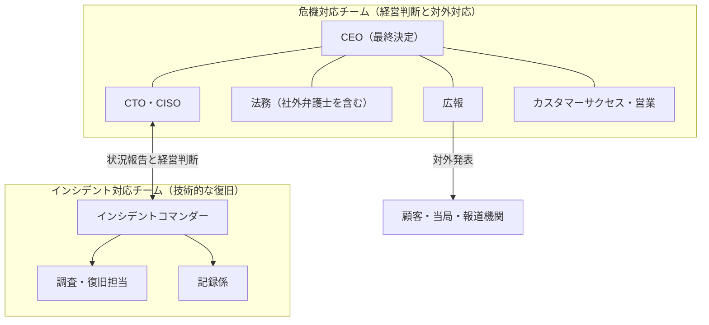
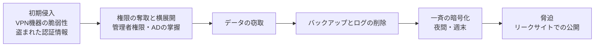

# 14.6 危機管理 — 重大障害とセキュリティ事故

> 重大な障害やセキュリティ事故は、どれほど備えても、いつか起きます。しかし同じ規模の事故でも、会社が信頼を失うか、かえって信頼を高めるかは、事前の準備と最初の数時間の動き方でほぼ決まります。この章では、インシデントが「会社を揺るがす危機」に変わる条件を見極め、平時の準備、ランサムウェア・情報漏えい・大規模障害への初動、社内外へのコミュニケーション、事後の信頼回復までを、CTO がそのまま使える手順とテンプレートとして身につけます。

| 項目 | 内容 |
|---|---|
| 学習時間の目安 | 本文 4h ＋ 演習 5h |
| 前提となる章 | [10.5 インシデント対応とポストモーテム](../../10-cloud-and-sre/05-incident-management/README.md)、[11.5 セキュリティ運用とサプライチェーン](../../11-security/05-security-operations/README.md)、[14.5 ガバナンス・リスク・コンプライアンスと法務](../05-governance-risk-compliance/README.md) |
| 演習 | [exercises/](exercises/)（Python）＋ 記述演習 |
| キーワード | 危機管理計画, 危機対応チーム, 決定権限, 机上演習, 意思決定ログ, ランサムウェア, 漏えい等報告, ホールディング・ステートメント, SLAクレジット, 第三者委員会 |

## この章のゴール

- [ ] インシデント管理と危機管理の違いを説明し、危機対応チームを招集する基準を自社向けに定義できる
- [ ] 危機管理計画（役割・決定権限・外部連絡先・代替の通信手段）を作成し、机上演習で検証できる
- [ ] ランサムウェア・情報漏えい・大規模障害のそれぞれについて、最初の 24 時間の行動を指揮できる
- [ ] サービスの停止、身代金の支払い、顧客への補償といった経営判断の論点を整理し、取締役会に提示できる
- [ ] 速く・正直で・具体的な対外コミュニケーション（第1報・続報・収束の報告）を書ける
- [ ] SLA クレジットを契約どおりに正確に計算できる
- [ ] 事後に、会社レベルのポストモーテムと信頼回復の計画を立てられる

## なぜ学ぶのか

公開されている事例を見ると、損害の大きさには、技術的な原因そのものと同じくらい「事前に何が決まっていたか」が効いていることが分かります。

- **2020 年 10 月 1 日、東京証券取引所**の株式売買システム「arrowhead」で、共有ディスク装置の 1 台が故障しました。バックアップ機への自動切り替えは、切り替えに関する設定値の実際の動作がマニュアルの記載と食い違っていたために働かず、全銘柄の売買が終日停止しました。日本取引所グループ（JPX）の調査委員会の報告書は、終日停止とした判断には当時の状況に照らして合理性があったと評価する一方で、通常でない方法で売買を止めた後に再開する手順（取引参加者の意見を聴く手続きを含む）が事前に定められていなかったことを課題として挙げています。
- **2024 年 6 月、KADOKAWA グループ**は、ランサムウェアを含む大規模なサイバー攻撃を受けました。動画サービス「ニコニコ」は約 2 か月後の 8 月 5 日まで本来のサービスを再開できず、出版事業の物流などにも影響が出ました。同社は約 25 万人分の個人情報の漏えいを公表しています。警察庁の年次報告も、出版大手企業への攻撃の事例として、25 万人分を超える個人情報等の漏えいと、調査・復旧費用等として 20 億円を超える損失を計上する見込みであることを紹介しています。
- **2024 年 7 月 19 日、CrowdStrike** のセキュリティ製品に配信された設定ファイルの不具合で、Microsoft の推計で約 850 万台の Windows 端末が起動しなくなりました。自社に落ち度がなくても、取引先 1 社の失敗で航空・医療・金融の業務が世界同時に止まりうることを示した事例です。

どの事例でも、CTO は技術的な復旧の指揮官であると同時に、経営チームの一員として「事業を止めるか」「何を、いつ公表するか」「誰に、どう補償するか」を決める側に立ちます。こうした判断は、事故の最中にゼロから考えると必ず遅れ、誤ります。危機管理とは、**危機の最中に下す判断を、できるだけ平時に済ませておくこと** です。

## 1. インシデントが「危機」になるとき

### 1.1 インシデント管理と危機管理の違い

[10.5 インシデント対応とポストモーテム](../../10-cloud-and-sre/05-incident-management/README.md) で学ぶインシデント管理は、「どう早く復旧するか」を扱いました。危機管理はその上に重なる、もう一つの層です。

| 観点 | インシデント管理 | 危機管理 |
|---|---|---|
| 中心の問い | どう復旧させるか | 会社として何を決め、誰に何を約束するか |
| 指揮する人 | インシデントコマンダー（IC） | 危機対応チーム（最終責任は CEO、技術面は CTO・CISO が統括） |
| 時間軸 | 分〜時間 | 時間〜数か月（事後の報告・再発防止まで） |
| 関係者 | エンジニア、サポート | 経営陣、取締役会、法務、広報、顧客、規制当局、警察、報道機関、投資家 |
| 主な判断 | 切り戻し、フェイルオーバー、機能の縮退 | サービス停止、公表、当局への報告、身代金、補償、記者会見 |
| 成功の尺度 | 復旧までの時間 | 信頼、法的な立場、事業の継続 |

危機管理はインシデント管理を置き換えるものではありません。二つの層を並行して動かします。



CTO の役割は、この二つの層をつなぐことです。現場からの技術的な情報を経営の言葉に翻訳し、経営の判断を現場の優先順位に翻訳します。そして、**現場のエンジニアを経営陣からの質問攻めから守る** ことも CTO の仕事です。「今どうなっている？」と役員が次々に現場のチャンネルに書き込めば、復旧は確実に遅れます。

### 1.2 危機対応チームを招集する基準

招集が遅れる最大の理由は「確定してから」と考えることです。招集基準には **「おそれ」の段階で招集する** と書いておきます。招集して空振りに終わるコストは小さく、招集が数時間遅れるコストは、報告期限の超過や誤った第一報として取り返しがつかないことがあります。

| 観点 | 招集基準の例（自社の規模に合わせて数値を決める） |
|---|---|
| 顧客への影響 | 主要サービスの全面停止が 30 分を超える見込み、または全顧客の 20% 以上に影響 |
| データ | 個人データや機密情報の漏えい・改ざん・消失の **おそれ** が生じた |
| セキュリティ | ランサムウェアの兆候、管理者権限の侵害、攻撃者からの脅迫 |
| 法令・契約 | 当局への報告義務や、契約上の通知義務が発生しうる |
| 安全 | 人の生命・身体に影響しうる |
| 財務 | 損失や補償が一定額（例: 月間売上の 5%）を超えうる |
| 評判 | 報道機関からの問い合わせ、SNS での拡散 |
| 不確実性 | 原因も影響範囲も分からない状態が 1 時間続いている |

### 1.3 危機の類型

| 類型 | 例 | 初動の要点 | 主な統括者 |
|---|---|---|---|
| 大規模障害 | 全面停止、データの不整合 | 影響の把握、縮退運転、告知の開始 | CTO |
| 情報漏えい | 不正アクセス、設定ミスによる公開、内部不正 | 封じ込め、範囲の特定、証拠保全、報告要否の判断 | CISO・法務 |
| ランサムウェア | 暗号化とデータ窃取による脅迫 | 隔離、証拠保全、バックアップの安全確認 | CISO・CTO |
| データ消失 | 誤操作やバグによる削除、バックアップの不備 | 書き込みの停止、復元できる範囲の確認 | CTO |
| サプライチェーン侵害 | 依存ライブラリやベンダー経由の侵入、不具合のある更新 | 影響する資産の特定、更新の停止 | CISO |
| キーパーソンの喪失 | 唯一の担当者の急病・退職 | 権限と知識の引き継ぎ、代行者の指名 | CTO・人事 |
| ベンダーの障害・撤退 | クラウドや SaaS の長時間停止、サービス終了 | 代替手段の発動、契約の確認 | CTO・調達 |
| 法務・規制 | 行政処分、訴訟、知的財産権の警告 | 弁護士の関与、証拠保全、発言の統制 | 法務 |
| 評判（PR）の危機 | SNS での炎上、データの使い方への批判 | 事実確認、発信の一元化 | 広報・CEO |
| 自然災害・広域停電 | 地震、台風、計画停電 | 人の安全確認が最優先、事業継続計画（BCP）の発動 | CEO・総務 |

危機は障害だけから生まれるわけではありません。2019 年には、就職情報サイト「リクナビ」の運営会社が、学生の閲覧履歴などから算出した「内定辞退率」の予測を、本人の十分な同意なく企業に提供していた問題で、個人情報保護委員会から是正勧告を受けました。データをどう使うかという **製品の設計判断** が、そのまま会社の危機になった例です（データの取り扱いは [14.5](../05-governance-risk-compliance/README.md)、AI の利用は [14.8](../08-ai-strategy/README.md) で扱います）。

## 2. 平時の準備 — 危機の結果は事前に決まる

### 2.1 危機管理計画に書くこと

危機管理計画（crisis management plan）は、分厚い規程集である必要はありません。**深夜 3 時に、寝起きの頭で読んで使える** ことが最も重要です。

```text
危機管理計画の目次の例（本文は 10〜20 ページ程度に収める）
 1. 目的と適用範囲（1.2 節の招集基準）
 2. 危機対応チームの構成・役割・代行者の順位
 3. 決定権限の表（誰が何を決めてよいか）
 4. 招集の方法と連絡網（社内のチャットやメールが使えない場合を含む）
 5. 最初の 24 時間のチェックリスト（3.1 節）
 6. 類型ごとの手順書（ランサムウェア、情報漏えい、大規模障害、災害）
 7. 外部の連絡先と契約の状況（2.3 節）
 8. 対外発表のテンプレートと承認の流れ（7 節）
 9. 意思決定ログと証拠保全の方針
10. 訓練の計画と改訂の履歴
```

計画は **社内の Wiki だけに置かない** ことが大切です。ランサムウェアは社内のファイルサーバーや Wiki も暗号化しますし、認証基盤（SSO）が止まればどのツールにもログインできません。印刷した紙と、会社のシステムから独立した場所にも保管します。

### 2.2 危機対応チームの役割と決定権限

| 役割 | 主な責任 | 平時に準備すること |
|---|---|---|
| CEO（または指名された代行者） | 最終決定、会社の顔としての説明、取締役会への報告 | 不在時の代行者の順位 |
| CTO | 技術的な状況の把握と経営への説明、復旧方針、人と予算の配分、現場の保護 | システム全体の構成と依存関係を 1 枚で説明できる状態 |
| CISO（セキュリティ責任者） | 調査と封じ込め、フォレンジック会社との連携、証拠保全 | 外部専門家との契約 |
| 法務（社内・社外の弁護士） | 報告・通知義務の判断、公表文のレビュー、証拠と記録の扱い | 社外弁護士との事前の契約 |
| 広報 | 対外発表、報道対応、SNS の監視 | テンプレート、報道対応の担当者の指名 |
| CFO・IR | 財務影響、補償の予算、上場企業では適時開示の判断 | 開示の判断基準の確認 |
| カスタマーサクセス・営業 | 顧客への連絡、問い合わせ対応、大口顧客への個別説明 | 顧客の連絡先と、通知義務のある契約の一覧 |
| 人事・総務 | 従業員への連絡、安否確認、勤務体制 | 連絡網 |
| 記録係 | 意思決定ログと時系列の記録 | テンプレート |

危機の最中に「誰が決めるのか」を議論してはいけません。**決定権限の表** を事前に作り、取締役会の承認まで得ておきます。

| 決定事項 | 決定者 | 事前に合意しておくこと |
|---|---|---|
| サービスの全面停止・機能の無効化 | CTO（緊急時は IC） | 停止してよい条件、事後報告の方法 |
| ネットワークの切断・システムの隔離 | CISO または CTO | 許容できる事業影響の範囲 |
| 当局への報告・本人への通知 | CEO（法務の助言に基づく） | 報告の判断基準と期限 |
| 対外発表の文面 | CEO（広報・法務・CTO が確認） | 第1報のテンプレートと、承認手続きの簡略化 |
| 警察への相談・被害の届出 | CEO（法務の助言に基づく） | 相談窓口 |
| 約款を超える顧客への補償 | CEO・CFO | 補償の考え方と上限 |
| 身代金の支払い | 取締役会（CEO の提案に基づく） | 基本方針（例: 原則として支払わない） |

「IC は CEO の承認を待たずに本番を止めてよい」といったルールは、事故の最中に決めようとすると誰も責任を取れず、停止が遅れます。2023 年の全銀システムの障害の後に全銀ネットと NTT データが公表した再発防止策にも、「復旧させる業務の優先順位とバックアッププランへの切り替え時限」を事前に合意しておくことが含まれています（9.3 節）。

### 2.3 外部の連絡先

危機の最中に、弁護士やフォレンジック会社を探し、契約書を交わしている時間はありません。

| 相手 | 何を頼むか | 平時にしておくこと |
|---|---|---|
| 社外弁護士（サイバー・個人情報に詳しい） | 報告義務の判断、公表文のレビュー、訴訟・当局対応 | 顧問契約、夜間・休日の連絡先 |
| フォレンジック・インシデント対応（DFIR）の専門会社 | 侵入経路の特定、証拠保全、復旧の支援 | リテイナー契約（事前契約で初動を数時間〜数日早められる） |
| サイバー保険の保険会社 | 補償範囲の確認、提携する調査会社の紹介 | 事故時の連絡手順、事前承認が必要な費用や指定業者の条件の確認 |
| 危機管理広報（PR 会社） | 記者会見の準備、想定問答の作成 | 候補の選定 |
| 個人情報保護委員会・所管官庁 | 漏えい等の報告、業法に基づく報告 | 報告の様式と期限の確認（[14.5](../05-governance-risk-compliance/README.md)） |
| 警察（都道府県警察のサイバー犯罪相談窓口） | 被害の相談・届出、捜査 | 窓口の確認 |
| JPCERT/CC | インシデントの報告、技術情報の提供と調整 | 報告の方法の確認（調査や復旧を代行する組織ではないので、実作業は専門会社に依頼する） |
| IPA（情報処理推進機構） | 不正アクセス・ウイルスの届出、相談 | 届出の方法の確認 |
| クラウド事業者・主要ベンダー | 技術サポート、ログの提供 | サポート契約の等級とエスカレーションの経路 |
| 主要顧客・取引先 | 契約上の通知、連携 | 通知義務のある契約の一覧 |
| 証券取引所・監査法人（上場企業） | 適時開示の要否、会計上の影響 | IR の連絡網 |

電気・通信・金融などの基幹インフラ事業者には、業法による報告義務に加えて、2025 年に成立したいわゆる能動的サイバー防御関連の法律（「重要電子計算機に対する不正な行為による被害の防止に関する法律」、通称サイバー対処能力強化法など）により、インシデントの報告などが法律上の義務になります。2026 年時点では、主な規定は 2026 年 10 月に施行され、その他の規定も順次施行される予定とされています。対象の範囲と施行時期は、自社や主要な顧客が対象になるかどうかも含めて一次情報で確認してください。

### 2.4 机上演習（テーブルトップ演習）

計画は、演習で試すまでは「たぶん動く」文書にすぎません。**机上演習（tabletop exercise）** は、会議室でシナリオを少しずつ提示し、参加者が「この時点で何をするか」を議論する訓練です。システムを実際に止めずに、判断と連携の穴を見つけられます。

| 要素 | 内容 |
|---|---|
| 目的 | 検証したいことを 2〜3 個に絞る（例: 決定権限は機能するか、第1報を 1 時間以内に出せるか） |
| 参加者 | 経営陣を必ず含める。技術者だけの演習では経営判断の穴が見つからない |
| シナリオと状況付与（インジェクト） | 時刻付きで新しい情報を少しずつ出す。「CEO が機内で連絡が取れない」「記者から電話」など、嫌な状況を混ぜる |
| ファシリテーター | 進行と時間管理。答えを教えず、問いを投げる |
| 観察者 | 誰がいつ何を決めたかを記録する |
| 振り返り | 終了直後に 15〜30 分。改善項目に担当者と期限を付ける |

経営陣を含む演習は少なくとも年 1 回、技術チームの演習は四半期に 1 回程度が一つの目安です。警察庁が 2024 年のランサムウェアの被害組織に行ったアンケート（2025 年 3 月公表）では、調査と復旧に「1 か月以上かつ 1,000 万円以上」を要した組織のうち、サイバー攻撃を想定した BCP を策定していたのは 11.8% にとどまり、1 週間未満で復旧した組織では 23.1% だったと報告されています（因果関係を示すものではありませんが、準備の有無が結果と関連していることを示唆します）。演習の台本の作り方は、演習 5 で実際に書きます。

### 2.5 「バックアップがある」と「復元できる」は違う

ランサムウェアの攻撃者は、暗号化を実行する前にバックアップやログを消去することがあります（警察庁の報告でも、侵入時にログやバックアップを消去する手口が指摘されています）。バックアップは次の条件を満たして、はじめて危機に役立ちます。

- **3-2-1 の原則**: データのコピーを 3 つ、2 種類の媒体に、うち 1 つは別の場所に置く。さらに、ネットワークから切り離した（オフラインの）コピーか、一定期間は削除・変更できない（イミュータブルな）コピーを 1 つ持つ。
- **認証の分離**: バックアップの管理者アカウントを、本番の Active Directory などと同じ認証基盤に置かない。本番の管理者権限を奪われたら、バックアップも消せる状態では意味がない。
- **復元のテスト**: 定期的に実際に復元し、**かかった時間** を測る。

復元の時間は見落とされがちです。50TB のデータを 1Gbps の回線で戻すと、転送だけで 50 × 10¹² × 8 ÷ 10⁹ = 400,000 秒、約 4.6 日かかります。目標復旧時間（RTO）が 1 日なのに、この計算をしていなければ、計画は最初から破綻しています（RTO と RPO は [10.3 信頼性設計とSLO](../../10-cloud-and-sre/03-reliability-engineering/README.md)、バックアップとリカバリの仕組みは [6.4 ストレージエンジンと障害回復](../../06-databases/04-storage-and-recovery/README.md) を参照）。

### 2.6 いつもの連絡手段が使えないとき

危機の最中には、いつもの連絡手段が使えないことがあります。認証基盤が止まれば社内チャットにも入れず、ランサムウェアの事案では、攻撃者が社内のメールやチャットを読んでいる可能性も前提にしなければなりません。

- 会社のシステムから独立した連絡手段（別のメッセージングサービスに事前に作ったグループ、電話の連絡網、緊急用の電話会議の番号）を用意する
- 連絡先の一覧を印刷して、危機対応チームの各自が持つ
- 顧客向けのステータスページは、自社のサービス基盤とは別の基盤に置く（6.2 節）

## 3. 最初の数時間

### 3.1 時系列のチェックリスト

最初の数時間は、情報が足りず、全員が焦っています。やるべきことをチェックリストにしておき、**考える力を判断に回す** のが目的です。

```text
T+0〜15 分  招集
  □ 招集基準に当たるか判断する（迷ったら招集する）
  □ インシデントコマンダー（IC）を指名し、危機対応チームの会議を開く
  □ 記録係を指名し、意思決定ログを開始する
T+15〜60 分  状況の評価と封じ込め
  □ 「分かっていること / 分かっていないこと / 次に分かる見込みの時刻」を整理する
  □ 被害の拡大を止める（隔離、機能の停止、認証情報の無効化）
  □ 証拠保全を指示する（ログの保存期間の延長、ディスクとメモリの取得）
  □ 社内に第1報を出す（何を話してよいか、いけないか）
  □ 顧客への影響が見えているなら、ステータスページに第1報を出す（30 分以内が目標）
T+1〜4 時間  体制の確立
  □ 社外弁護士・フォレンジック会社・保険会社に連絡する
  □ 報告・通知の義務（法令・契約）と期限を洗い出す
  □ 報告の頻度を決め、定時の報告サイクルを始める
  □ 交代勤務のシフトを組む（最初から長期戦を前提にする）
T+4〜24 時間
  □ 取締役会に第1報を入れる
  □ 当局への速報の要否を判断する
  □ 大口顧客・取引先に担当者から個別に連絡する
  □ 問い合わせ窓口と FAQ を準備する
```

### 3.2 封じ込めと証拠保全のトレードオフ

封じ込めの行動には、証拠を失うという代償が伴うことがあります。

| 行動 | 得られるもの | 失うもの |
|---|---|---|
| ネットワークから切り離す | 横展開と外部への送信を止める | 失うものは比較的少ない |
| 電源を切る | 暗号化の進行を止める | メモリ上の証拠（実行中のプロセス、通信先、暗号鍵などが残っている場合がある） |
| すぐに再インストールする | 早く使えるようになる | 侵入経路の手がかり、再侵入を防ぐための情報 |
| 攻撃者が使うアカウントを直ちに止める | 被害の拡大を止める | 攻撃者に気づかれ、痕跡の消去や一斉の暗号化を招くおそれ |

一般には「まずネットワークから切り離し、電源はすぐには切らない」対応が勧められることが多いのですが、暗号化が進行中で被害の拡大が明らかな場合など例外もあります。判断はフォレンジックの専門家の助言に基づいて行い、その根拠を意思決定ログに残します。クラウドの監査ログは保存期間が短い設定になっていることがあるので、**調査に必要なログが消える前に保全する** ことも最初の数時間の仕事です。

### 3.3 意思決定ログ

危機の最中の判断は、後から取締役会・規制当局・裁判所・第三者委員会によって検証されます。そのとき判断の妥当性は、**その時点で何が分かっていたか** で評価されるべきですが、記録がなければ、結果を知った後の目（後知恵バイアス）で評価されてしまいます。

| 時刻 | 決定 | 検討した選択肢 | 根拠（その時点の情報） | 決定者 | 次の見直し |
|---|---|---|---|---|---|
| 10:42 | 決済 API を全面停止 | ①継続 ②新規のみ停止 ③全停止 | 不正な引き落としが毎分増えている。②では既存のセッション経由の被害が止まらない | CTO | 11:30 |
| 11:05 | 第1報を公表 | ①原因の判明まで待つ ②すぐに公表 | 問い合わせが急増。原因は未確定だが、症状と対応中であることは事実 | CEO | 12:00 |

意思決定ログは、判断した人を守る記録であり、事後の学びの材料でもあります。記録係は、技術的な作業から外れた人を専任で指名します。

### 3.4 社内への第1報

従業員も重要な関係者です。情報がなければ、社員は SNS やうわさで状況を知り、不安が広がり、善意の投稿が情報漏えいになることもあります。

```text
【重要】現在発生している障害について（社内向け 第1報）

13:40 ごろから、当社サービスで障害が発生しています。現在、復旧対応中です。
・社外（顧客・報道・SNS を含む）への説明は、公式発表の内容に限ってください。
・報道機関からの問い合わせは、広報（xxx@example.com）に回してください。
・「IT 部門」を名乗るパスワード確認などのメールには応じないでください。
・次回の社内連絡は 15:00 です。質問は #incident-faq チャンネルへ。
```

## 4. ランサムウェアへの対応

### 4.1 攻撃の流れを知る

**ランサムウェア** は、データを暗号化して使えなくし、元に戻す対価を要求する不正プログラムです。近年は、暗号化の前にデータを盗み、「支払わなければ公開する」と脅す **二重恐喝** が一般的で、暗号化をせずにデータを盗んで脅すだけの手口（警察庁は「ノーウェアランサム」と呼んでいます）も報告されています。攻撃は分業化されており、ランサムウェアを開発して攻撃者に提供し、身代金の一部を受け取る RaaS（Ransomware as a Service）も広がっています。



警察庁の「令和6年におけるサイバー空間をめぐる脅威の情勢等について」（2025 年 3 月）によれば、2024 年のランサムウェアの被害報告は 222 件で、被害組織へのアンケートでは、VPN 機器やリモートデスクトップからの侵入が感染経路の 8 割以上を占めました。報告は、金曜日の業務終了後に侵入して月曜日の朝までに暗号化を実行する、再侵入のためにバックドアを仕掛ける、侵入時にログやバックアップを消去する、といった手口も紹介しています。**侵入から暗号化までの間に、数日、ときには数週間以上の潜伏期間がありうる** ことは、後で述べる「どのバックアップが安全か」の判断に直結します。

### 4.2 初動の手順

| 順序 | 行動 | 注意点 |
|---|---|---|
| 1 | 影響を受けた端末・セグメントをネットワークから隔離する | 3.2 節のトレードオフを踏まえ、専門家の助言を得る |
| 2 | バックアップを守る | バックアップの基盤を本番から切り離し、削除・改ざんの有無を確認する |
| 3 | 証拠を保全する | ログ、ディスクとメモリのイメージ、脅迫文、攻撃者とのやりとり |
| 4 | 侵入経路と侵害の範囲を調べる | 最初に侵入された機器、奪われたアカウント、窃取されたデータ |
| 5 | 外部に連絡する | 社外弁護士、フォレンジック会社、保険会社、警察。個人データが関わる「おそれ」があれば、個人情報保護委員会への報告も検討 |
| 6 | 攻撃者と独断で接触しない | 交渉が必要かどうかも含め、法務と専門家を交えて判断する |

### 4.3 身代金を支払うか

身代金の支払いは、CTO が一人で決めてよい問題ではなく、取締役会レベルの経営判断です。論点を整理しておきます。

| 論点 | 内容 |
|---|---|
| 復旧の保証がない | 復号ツールが提供されない、壊れている、遅い、といった例がある。盗まれたデータが削除されたかどうかも検証できない |
| 再攻撃と追加の要求 | 支払った組織が再び狙われることや、支払った後もデータを公開されることがある |
| 法的なリスク | 支払先が制裁の対象者であれば、各国の制裁法令に抵触するおそれがある（米国財務省の OFAC は 2020 年と 2021 年に、身代金の支払いを助ける行為の制裁リスクについて勧告を公表している。日本でも外為法に基づく資産凍結等の措置がある）。取締役の善管注意義務の観点からの説明責任も生じる |
| 当局の姿勢 | 警察は「身代金を支払っても元に戻る保証はない」と注意を呼びかけている。2023 年には、日本を含む国際的な枠組み（International Counter Ransomware Initiative）の参加国が、中央政府の機関は原則として身代金を支払うべきでないとする共同声明を出した |
| 保険 | 日本のサイバー保険は、一般に身代金そのものを補償の対象外とし、調査・復旧費用や損害賠償などを補償するとされる（約款を確認する） |
| 事業の存続 | バックアップから復旧できず、支払わなければ事業が続けられない場合をどう考えるか（最も難しい論点） |

最も効果的な対策は、**「支払わなくても復旧できる」状態を平時に作っておくこと** と、支払いについての基本方針（例: 原則として支払わない。例外の検討は取締役会が社外弁護士の助言を得て行う）を事前に決めておくことです。具体的な判断は、必ず弁護士などの専門家に確認してください。

### 4.4 クリーンなバックアップからの復旧

1. **侵入経路をふさぐ**: 脆弱性を修正し、認証情報をリセットする。Active Directory が侵害された場合は、管理者アカウントやサービスアカウントに加え、Kerberos のチケットの署名に使われる krbtgt アカウントのパスワードも（間隔を空けて 2 回）リセットするのが一般的な手順です。
2. **安全なバックアップを選ぶ**: 攻撃者が数週間前から潜伏していた場合、直近のバックアップにはバックドアが含まれている可能性がある。侵入の時期を調査で推定し、それより前のものを選ぶ。
3. **隔離した環境で復元して検査する**: 検査してから本番のネットワークに戻す。
4. **優先順位を決めて復元する**: 一般に、認証基盤 → ネットワーク → データベース → 業務アプリケーションの順。すぐに戻せない業務は、手作業などの代替手段で回す。
5. **再侵入を監視する**: EDR（端末の検知・対応の仕組み）や監視を強化し、残ったバックドアを探す。
6. **「復旧した」と宣言するのは、侵入経路を特定して塞いだ後**: 経路を塞がずに復旧すると、同じ攻撃者に再び暗号化されるおそれがある。

KADOKAWA の事案では、攻撃の封じ込めのために、データセンター内のプライベートクラウドのサーバーの電源ケーブルと通信ケーブルを物理的に抜いたと同社は説明しています（9.4 節）。「全部を止める」という極端な封じ込めを誰の権限で実行するのかも、決定権限の表に含めておくべき項目です。

## 5. 情報漏えいへの対応

### 5.1 範囲を特定する

漏えいの対応は、「何が、誰の、どれだけ漏れたのか」を特定することから始まります。

- **何のデータか**: 氏名・連絡先、認証情報（パスワードのハッシュの方式は何か）、クレジットカード情報、要配慮個人情報（病歴など）
- **誰のデータか**: 本人の数、子どもを含むか、特定の顧客企業に偏っているか
- **いつからいつまでか**: 侵入・公開の開始時期と、封じ込めた時刻
- **「アクセスできる状態だった」のか、「実際に取得された」のか**: ログで区別できるか。ログがなければ、より広い範囲を「おそれ」として扱うことになる
- **二次被害のおそれ**: フィッシング、なりすまし、不正利用

範囲は調査が進むにつれて変わります（多くの場合、広がります）。公表では「現時点で確認できた範囲」と明記し、判明した時点で更新します。

### 5.2 報告と通知の義務

詳しくは [14.5 ガバナンス・リスク・コンプライアンスと法務](../05-governance-risk-compliance/README.md) で扱いますが、期限の感覚は危機対応の計画に直結するので、要点をまとめます（2026 年時点の一般的な整理です。制度の見直しの議論も続いているため、最新の法令とガイドラインを確認し、具体的な判断は専門家に確認してください）。

| 相手 | 期限の目安 | 根拠 |
|---|---|---|
| 個人情報保護委員会（速報） | 事態を知った後、速やかに（目安は知った時点から概ね 3〜5 日以内） | 個人情報保護法と委員会規則・ガイドライン。要配慮個人情報、財産的被害のおそれ、不正の目的によるおそれ、1,000 人を超える、のいずれかに当たる漏えい等（おそれを含む）が対象 |
| 同（確報） | 知った日を 1 日目として、土日・祝日も含めて 30 日以内（不正の目的によるおそれがある場合は、他の類型にも当たるときを含めて 60 日以内）。末日が土日・祝日・年末年始の閉庁日なら、その翌日 | 同上 |
| 本人 | 事態の状況に応じて速やかに | 同上 |
| EU の監督機関（GDPR が適用される場合） | 不当な遅滞なく、可能であれば認識してから 72 時間以内 | GDPR 第 33 条 |
| 委託元の顧客企業 | 契約による（「24 時間以内」など、法令より短い期限の定めもある） | 契約書 |
| 所管官庁 | 業法による | 金融・通信などの業法 |
| 株主・投資家（上場企業） | 重要な事実なら速やかに | 取引所の適時開示のルール |

期限の起点になる「知った」時点は、法人では、いずれかの部署が事態を知った時点とされています（数え方の詳細は [14.5](../05-governance-risk-compliance/README.md) の 3.4 節）。現場で気づいてから危機対応チームが招集されるまでの時間も、期限の中に含まれるということです。

B2B の事業では、**契約上の通知義務** を見落としがちです。大口顧客との契約に「インシデントを認識してから 24 時間以内に通知する」と書かれていれば、法令の期限より先にそちらの期限が来ます。どの顧客とどんな通知義務を約束しているかの一覧は、平時に作っておきます。

### 5.3 問い合わせ窓口と FAQ

大規模な漏えいでは、問い合わせが殺到します。コールセンターを外部に委託する場合、立ち上げには数日かかることがあるので、委託先の候補を事前に決めておきます。FAQ には最低限、次を書きます。

- 何が起きたのか（確認できた事実）
- 自分の情報が含まれているかどうかを知る方法
- 自分は何をすればよいか（パスワードの変更、不審なメールや電話への注意、カードの明細の確認）
- 補償やお詫びについて
- 問い合わせ先と受付時間

回答の台本を作り、窓口の担当者が勝手な推測を話さないようにします。問い合わせの内容は集計し、FAQ の更新と、隠れた被害の発見に使います。

### 5.4 謝罪と補償の判断

補償は、**約款・契約上の義務** と、それを超える **お詫び** を分けて設計します。日本では、大規模な事案で象徴的な金額のお詫びを配る例が見られます。

- 2014 年のベネッセコーポレーションの顧客情報の漏えいでは、お詫びとして 500 円分の金券（電子マネーギフトまたは図書カード）が用意されました。
- 2022 年 7 月の KDDI の大規模な通信障害（約 61 時間）では、約款に基づき 24 時間以上まったく利用できなかった約 271 万人に基本料金の 2 日分を返金したうえで、全契約者の約 3,589 万人に一律 200 円の「お詫び返金」を行い、総額は約 73 億円と発表されました。

判断の観点は次のとおりです。

- 実際の損害と二次被害のリスク（カード情報の漏えいなら再発行の費用など）
- 契約上の義務と、顧客間の公平さ
- 金額そのものより、手続きの負担を顧客にかけないこと（申請不要の自動適用など）
- 補償の発表が、原因と再発防止策の説明とセットになっているか

## 6. 大規模障害への対応

### 6.1 コミュニケーションの頻度

障害の最中、顧客が最も不安になるのは「何も知らされない時間」です。**進展がなくても、決めた時刻に更新する** ことが信頼につながります。

| 相手 | 手段 | 頻度の目安 |
|---|---|---|
| 顧客全体 | ステータスページ、SNS | 30 分ごと（進展がなくても「次回の更新時刻」を書く） |
| 大口顧客 | 担当者からの電話・メール | 節目ごと、または 2〜4 時間ごと |
| 経営陣 | 定型の状況報告 | 1 時間ごと |
| 取締役会 | CEO からの報告 | 初報と、その後 1 日 1 回程度 |
| 社内全体 | 全社向けのチャンネル | 節目ごと |
| 当局 | 所定の様式 | 法令・指示に従う |

経営陣への状況報告は、毎回同じ型で書きます。型が同じなら、読む側は差分だけを追えます。

```text
【状況報告 #3  14:00】
影響    : 決済 API のエラー率 35%（通常 0.1%）。影響を受けている顧客 約 1,200 社
現状    : データベースのフェイルオーバーは完了。アプリの接続先を切り替え中
見込み  : 15:00 までに部分復旧（確度: 中）。全面復旧の見込みは未定
決定依頼: 大口 3 社への個別連絡の担当者の指名
次回報告: 15:00
```

### 6.2 ステータスページは本体と運命を共にしない

2017 年 2 月 28 日の Amazon S3 の大規模障害では、AWS の状況報告ページ（Service Health Dashboard）の管理機能自体が S3 に依存していたため、しばらく各サービスの状態を更新できず、Twitter などで状況を伝えたと AWS の事後報告は説明しています。障害を知らせる仕組みが、障害の対象と同じ基盤に乗っていたのです。

- ステータスページは、自社のサービスとは別の基盤（別の事業者やリージョン）に置く
- 更新できる人を複数にし、テンプレートを用意して、演習で実際に使っておく

### 6.3 SLA クレジットを正確に計算する

障害の後、財務と営業からは必ず「クレジット（返金や減額）はいくらになるのか」と聞かれます。SLA（サービスレベル合意）の考え方は [10.3 信頼性設計とSLO](../../10-cloud-and-sre/03-reliability-engineering/README.md) で学びました。ここでは契約上の計算を扱います。一般的な約款の構造は次のとおりです（定義は契約ごとに異なるので、必ず自社の契約書で確認します）。

1. 障害の時間帯を集め、**重複を除いて** 合計する（同じ時間を二重に数えない）
2. 請求期間（暦月など）の外にはみ出した部分を切り落とす
3. 事前に告知した計画メンテナンスの時間を除く
4. 月間稼働率 = (期間の長さ − ダウンタイム) ÷ 期間の長さ を求める
5. プランごとの段階表でクレジット率を決め、上限を適用し、端数を処理する

たとえば 6 月（30 日 = 43,200 分）に、重複を除いて 70 分のダウンタイムがあったとします。稼働率は (43,200 − 70) ÷ 43,200 ≒ 99.838% です。

| プラン | 段階表（稼働率が下回ったら） | 上限 | 月額 100 万円の顧客のクレジット |
|---|---|---|---|
| スタンダード | 99.5% → 10%、99.0% → 25%、95.0% → 50% | 50% | 0 円（99.5% を下回っていない） |
| エンタープライズ | 99.95% → 10%、99.9% → 25%、99.0% → 50%、95.0% → 100% | 100% | 25 万円（99.9% を下回った） |

ここで落とし穴になるのが、**浮動小数点数での境界判定** です。30 日のちょうど 0.1%（43 分 12 秒）のダウンタイムなら、稼働率は 99.9% ちょうどで、約款上は「99.9% を下回っていない」はずです。

```python
from fractions import Fraction

T = 30 * 24 * 60 * 60        # 6月（30日）の秒数 = 2,592,000
d = 43 * 60 + 12             # ダウンタイム 43分12秒 = 2,592秒（ちょうど 0.1%）
print((T - d) / T)                   # 稼働率（比率）
print(99.9 / 100)                    # しきい値（比率）
print((T - d) / T < 99.9 / 100)      # 「99.9% を下回った」と誤判定
print(Fraction(T - d, T) < Fraction("99.9") / 100)   # 厳密に比較すると下回っていない
```

```text
0.999
0.9990000000000001
True
False
```

`99.9 / 100` が `0.9990000000000001` になるため、境界ちょうどの月に「SLA 違反」と誤判定してしまいます（理由は [1.1 情報の表現](../../01-computer-systems/01-data-representation/README.md) の浮動小数点数の節を参照）。金額に直結する判定は、`Fraction` や `Decimal` で厳密に行います。演習 1〜4 で、この計算を一通り実装します。

クレジットについては、次の点も経営判断になります。

- 顧客が期限内に **申請すること** をクレジットの条件にしている約款は少なくない。申請を待つか、影響を受けた全顧客に自動で適用するか（後者は信頼回復に効くが、費用は増える）
- クレジットは売上の減額になる。財務への影響と会計処理は CFO と確認する（[14.3 事業と財務のリテラシー](../03-business-and-finance/README.md)）

### 6.4 対策本部の規律

大規模障害の対策本部（ウォールーム）では、人が増えるほど混乱しがちです。

- **IC は 1 人**。調査・コミュニケーション・記録の役割を明示して割り当てる（[10.5](../../10-cloud-and-sre/05-incident-management/README.md)）
- **対応者のチャンネルと、状況共有のチャンネルを分ける**。経営陣は共有チャンネルを読み、対応者のチャンネルには書き込まない
- **仮説には時間の区切りを設ける**（例: 30 分で確証が得られなければ次の仮説へ）
- **一度に複数の変更をしない**。どの変更が効いたのか分からなくなる。変更はすべて記録する
- 経営陣の仕事は、質問を浴びせることではなく、**障害物を取り除くこと**（人や予算の手配、ベンダーへのエスカレーション）と、現場に代わって判断を引き受けること

### 6.5 疲労の管理とシフト

長時間の障害対応で最も危険なのは、疲れた人が本番環境を操作することです。Dawson と Reid が 1997 年に Nature に発表した研究では、17 時間起き続けた後の作業成績の低下は血中アルコール濃度 0.05% の状態に相当し、24 時間では 0.10% に相当しました。徹夜明けの本番作業は、酒気を帯びた状態での作業に近いリスクを持つと考えるべきです。

- 障害が数時間を超えそうなら、**最初の 1〜2 時間のうちに** シフトを組む（8〜12 時間交代が目安）
- 引き継ぎは 30 分重ねて、テンプレート（現状、仮説、実施した変更、未解決の問い、次の一手）で行う
- IC も交代する。CTO 自身も休む（「英雄的な徹夜」を称賛しない）
- 食事と休憩場所を手配する

日本の労働法制では、障害対応も労働時間の上限規制（36 協定など）の対象です。労働基準法 33 条は「災害その他避けることのできない事由」による臨時の時間外労働を認めており、2019 年の許可基準の改正で、サーバーへの攻撃によるシステムダウンへの対応が例示に加えられたとされます。ただし事前の許可または事後の届出が必要で、健康確保の義務がなくなるわけではありません。運用は、社会保険労務士や弁護士に確認してください。

## 7. 対外コミュニケーション

### 7.1 原則: 速く・正直に・共感を持って・具体的に

| 原則 | 意味 | 実践 |
|---|---|---|
| 速く | 完璧な情報を待たない | 顧客影響が見えたら 30 分以内に第1報 |
| 正直に | 分からないことは分からないと言う | 「現時点で確認できていること」と「調査中のこと」を分ける |
| 共感を持って | 影響を受けた人の立場で書く | 「ご迷惑をおかけしています」を定型文で終わらせず、何に困っているかを具体的に書く |
| 具体的に | 曖昧な表現は不信を生む | 時刻、症状、範囲、顧客がすべきこと、次回の更新時刻 |

もう一つの原則は **ワンボイス（発信の一元化）** です。ステータスページ、メール、SNS、営業担当者の説明、記者会見で言っていることが食い違うと、それだけで「隠している」と受け取られます。公式の文面を一つ作り、全チャネルがそれを元に話します。

### 7.2 ホールディング・ステートメント（第1報）

**ホールディング・ステートメント** とは、詳細が分からない段階で出す「把握していて、対応している」ことを伝える短い声明です。

```text
【障害発生のお知らせ（第1報）】
2026年6月10日 14:05 ごろから、〇〇サービスにログインしにくい状態が発生しています。
現在、原因の調査と復旧の対応を進めています。
ご利用の皆さまにご迷惑をおかけしており、申し訳ございません。
次回は 14:45 までに、このページで状況をお知らせします。
```

含めるべき要素は、症状（顧客から見て何が起きているか）、発生時刻、対応中であること、お詫び、次回の更新時刻です。原因の推測と、根拠の薄い復旧見込みは含めません。

### 7.3 言ってはいけないこと

| 言いがちな表現 | なぜ問題か | 代わりに |
|---|---|---|
| 「個人情報の流出はありません」（調査中に） | 後で覆ると、信頼が決定的に崩れる | 「現時点で、個人情報の流出は確認されていません。調査を続けています」 |
| 「17 時に復旧します」（根拠が薄い） | 外れるたびに信用を失う | 「17 時に次の状況をお知らせします」 |
| 「委託先のミスにより」 | 顧客から見れば当社の問題。責任転嫁に見える | 「当社が利用しているシステムで」。委託先との関係は事後に整理する |
| 「サイバー攻撃の被害者です」だけを強調する | 被害者であっても、顧客にとっては管理者の責任 | 事実、お詫び、対策をそろえて伝える |
| 「影響は軽微です」 | 影響の大きさを決めるのは顧客 | 影響の範囲を具体的な数と症状で示す |
| 専門用語（「DB のフェイルオーバーが」） | 伝わらない | 顧客の言葉で（「ログインできない」「注文が確定しない」） |

### 7.4 日本の謝罪と記者会見の実務

日本では、原因が分かる前でも、影響に対して早く謝罪することが期待されます。法務の立場からは「謝罪が法的責任を認めたと解釈されないか」という懸念が出ることがありますが、「ご迷惑とご心配をおかけしていること」への謝罪と、法的責任の認否は区別できます。第1報のテンプレートを事前に法務と合意しておけば、事故のたびに文面の調整で何時間も失うことはありません。

B2C で多数の人に影響する事案、社会インフラの停止、上場企業の重大な事案では、記者会見が必要になることがあります。

- **登壇者**: 通常は CEO。技術的な質問に答えられるよう、CTO や CISO も同席する
- **準備**: 時系列、影響の数字、原因（判明している範囲）、顧客への対応、再発防止の方向性をまとめた資料と、想定問答。数字は全チャネルで一致させる
- **想定問答には基本的な技術の質問を必ず入れる**: 「なぜ多要素認証を導入していなかったのか」「バックアップはなかったのか」など
- **答えられない質問**: 推測で答えず「確認して、後ほどお答えします」と言い、実際に後で答える

2020 年の東証の障害では、当日夕方の記者会見で、役員が技術的な質問にも具体的に答えたことが、報道などで好意的に受け止められたと伝えられています。反対に、2019 年 7 月にサービスを始めたスマートフォン決済「7pay」では、開始直後に不正利用が相次ぎ、記者会見で「なぜ二段階認証を導入していなかったのか」と問われた経営陣が明確に答えられなかったことが大きく報じられ、サービスは同年 9 月末で終了しました。**CEO に技術の要点を事前に説明し、会見に同席するのは CTO の仕事** です。

## 8. 事後対応 — 信頼を取り戻す

### 8.1 会社レベルのポストモーテム

技術的なポストモーテム（[10.5](../../10-cloud-and-sre/05-incident-management/README.md)）は「なぜシステムが壊れたか」を扱います。危機の後には、それに加えて **会社レベルの振り返り** が必要です。

- 判断は適切だったか（意思決定ログを使い、その時点の情報で評価する）
- コミュニケーションは速く、正確で、一貫していたか
- 決定権限、連絡網、外部の契約は機能したか
- ベンダーの管理、変更管理、人員配置、予算に、組織としての原因はなかったか
- 「言いにくいことを言える」文化だったか（兆候は事前に誰かが気づいていなかったか）

最後の問いは軽視できません。2021 年のみずほ銀行の一連のシステム障害について、金融庁は業務改善命令の中で、ガバナンス上の問題の真因として「言うべきことを言わない、言われたことだけしかしない姿勢」を挙げました。

重大な不祥事では、日本では **第三者委員会** を設けて調査することがあります。日本弁護士連合会は 2010 年に「企業等不祥事における第三者委員会ガイドライン」を公表し、委員の独立性や調査報告書の公表などの考え方を示しています。東証の障害では独立社外取締役による調査委員会、みずほの障害では外部の有識者によるシステム障害特別調査委員会が、それぞれ報告書を公表しました。

### 8.2 規制当局と取締役会への報告

重大な事案では、当局から報告を求められたり（例: 2023 年の全銀システムの障害で、金融庁は全銀ネットに資金決済法に基づく報告徴求命令を出しました）、業務改善命令を受けたりすることがあります（東証とその持株会社は 2020 年、みずほ銀行とその持株会社は 2021 年に受けています）。業務改善命令では、改善計画の提出と定期的な進捗報告が求められるのが一般的です。

取締役会への最終報告は、次の型でまとめると漏れがありません（経営陣への伝え方は [14.4](../04-executive-communication/README.md) を参照）。

```text
1. 概要（何が起き、いつ収束したか）
2. 影響（顧客・財務・法務・評判。数字で）
3. 原因（直接の原因 / 根本原因 / 組織的な要因）
4. 対応の評価（うまくいったこと / いかなかったこと。意思決定ログに基づく）
5. 再発防止策（施策ごとに担当・期限・完了の判定方法・進捗の報告方法）
6. 残るリスクと、受容するかどうかの判断を求める事項
```

再発防止策が「注意を徹底する」「教育を強化する」だけで終わっていたら、それは対策ではありません。人の注意力に頼らない仕組み（自動化、ガードレール、権限の分離、テスト）に落ちているかを確認します。

### 8.3 信頼を再構築する

- **約束は具体的に、進捗は公開する**: 「再発防止に努めます」ではなく、「3 月末までに○○を実施し、4 月に結果を報告します」
- **顧客に個別に向き合う**: 大口顧客には経営陣が直接説明する。営業とサポートには、顧客に聞かれる質問への回答集を渡す
- **従業員にも説明する**: 対応した現場への感謝と、個人を責めない姿勢を明確にする
- **指標で確かめる**: 解約率、問い合わせの内容、顧客満足度の推移を追う

謝罪は一度で済みますが、信頼は改善の報告を積み重ねることでしか戻りません。

## 9. ケーススタディ — 公開情報から学ぶ

ここでは、公式の報告書や発表など広く公開された情報に基づいて、各事例から学べることに絞って紹介します。詳細は各社の一次資料を参照してください。

### 9.1 東京証券取引所の終日売買停止（2020 年 10 月）

- **何が起きたか**: 10 月 1 日の朝、売買システム「arrowhead」の共有ディスク装置（NAS）の 1 台でメモリ故障が発生。バックアップ機への自動切り替えが働かず、相場情報の配信などに影響が出て、全銘柄の売買が終日停止した。自動切り替えが働かなかったのは、切り替えに関する設定値について、マニュアルの記載と実際の動作が食い違っていたためと報告されている。当日中に再開しなかった背景には、再起動すると注文の扱いなどで市場参加者に混乱が生じる懸念があり、再開のルールが整備されていなかったことがあった。
- **学び**:
  - フェイルオーバーは「手動で切り替えられる」ことではなく、**実際の故障のしかたで自動的に切り替わる** ことを試験する
  - ベンダーの文書と実際の動作が一致しているかを確かめる
  - **止めた後に再開する手順** も可用性の一部であり、外部の関係者と事前に合意しておく必要がある
  - 緊急時の停止の仕組みが、故障した部分に依存していないかを確かめる

### 9.2 みずほ銀行の一連のシステム障害（2021 年）

- **何が起きたか**: 2021 年 2 月から 9 月までに、顧客に影響する障害が 8 回発生した（金融庁の発表による）。2 月 28 日には、月末の繁忙期に十分なリスク評価をせずにデータの移行作業を行った結果、多数の ATM が停止し、キャッシュカードや通帳が ATM に取り込まれたままになり、多くの顧客がその場で待たされた。金融庁は 2021 年 9 月と 11 月に業務改善命令を出し、危機対応の訓練が不十分だったことや、経営陣がシステムの安定性を過信したまま人員と費用を削減したことなどを指摘した。
- **学び**:
  - 変更作業の時期と負荷を、リスク評価に含める
  - 障害時に **顧客の身に何が起きるか**（カードが戻らない、その場を離れられない）を設計の段階で想定する
  - 現場から経営トップへの報告の速さは、訓練しなければ上がらない
  - 人員とコストの削減は、それが運用リスクにどう効くかを評価してから行う

### 9.3 全銀システムの障害（2023 年 10 月）

- **何が起きたか**: 10 月 10 日から 11 日にかけて、金融機関の間の送金を担う全銀システムで、連休中に更改した中継コンピュータ（RC）の不具合により、一部の金融機関で他行宛ての振込などが処理できなくなった。1973 年の稼働開始以来、初めての大規模な障害とされる。全銀ネットとベンダーの NTT データの説明によれば、影響は送受信を合わせて 2 日間で約 566 万件の処理に及んだ。原因は、新しい RC で OS が 32 ビットから 64 ビットになったことでテーブルのサイズが増え、テーブルを生成するプログラムが使う作業領域が不足してデータが壊れたことだった。RC は 2 台で冗長化されていたが、同じプログラムなので 2 台とも同じように失敗し、旧機への切り戻しは全体を止める必要があるため選べなかった。東京と大阪の片方が止まる訓練はしていたが、両方が同時に止まる場合の訓練はしていなかったとも説明されている。
- **学び**:
  - **冗長化は、ソフトウェアの不具合には効かない**（同じ原因で同時に壊れる「共通原因故障」）。段階的な展開と、異なる実装による代替を検討する（[8.4 CI/CDとリリースエンジニアリング](../../08-software-engineering/04-ci-cd-and-release/README.md)）
  - 単体テストの網羅だけでなく、本番に近いデータ量と、他のプログラムが動いている状態での結合テストを行う
  - 移行計画には、切り戻しの方法と「何時までに直らなければ代替手段に切り替えるか」という時限を含める

### 9.4 KADOKAWA グループへのランサムウェア攻撃（2024 年 6 月）

- **何が起きたか**: 6 月 8 日未明、グループのデータセンター内のサーバーに障害が発生し、ランサムウェアを含む大規模な攻撃と判明した。同社は封じ込めのために、プライベートクラウドのサーバーの電源ケーブルと通信ケーブルを抜いたと説明している。「ニコニコ」は約 2 か月後の 8 月 5 日に再開した。同社が公表した外部の専門企業による調査の結果では、侵入の経路と方法は不明としつつ、フィッシングなどによって従業員のアカウント情報が窃取されたことが根本原因と推測されており、約 25 万人分の個人情報の漏えいが確認された。漏えいした情報をインターネット上で拡散する行為に対しては、法的措置を講じる方針を示した。同社は第1報から段階的に状況の報告を公表し続けた。
- **学び**:
  - 侵入の起点は、多くの場合 **アカウント（認証情報）** である。多要素認証と、管理者アカウントの分離が要になる
  - 仮想化基盤やプライベートクラウドの管理権限を奪われると、影響は一気に全体へ広がる。管理系のネットワークと権限を分離しておく
  - 基盤ごと作り直す復旧には、数週間〜数か月かかりうる。その間の事業継続の手段を平時に用意しておく
  - 漏えいした情報の拡散という **二次被害** への対応と、定期的な状況報告も、危機対応の一部である

### 9.5 CrowdStrike の更新による世界的な障害（2024 年 7 月）

- **何が起きたか**: 7 月 19 日、CrowdStrike のセキュリティ製品（Falcon センサー）向けに配信された設定ファイル（Channel File 291）が原因で、Windows 端末が起動しなくなった。同社の根本原因分析（2024 年 8 月）によれば、新しいテンプレートは 21 個の入力項目を定義していたが、それを使うコードは 20 個しか渡しておらず、配信された内容が 21 番目の項目を参照したために範囲外のメモリ読み取りが起きた。影響は Microsoft の推計で約 850 万台。多くの端末は、手作業でセーフモードなどから起動して問題のファイルを削除する必要があり、ディスク暗号化（BitLocker）の回復キーが必要になる場合もあって、復旧に時間がかかった。同社はその後、この種の配信を段階的に行う仕組みなどを導入したと説明している。
- **学び**:
  - 自社のコードでなくても、**カーネルに近い権限で動くベンダーの製品は、自社の単一障害点** になる。ベンダーの評価では、更新の配信方法（段階的な展開、顧客側での制御）を確認する
  - 設定やコンテンツの配信も「コードのデプロイ」と同じリスクを持つ。段階的に展開する
  - 大量の端末を手作業で復旧するには、人手と、端末の外に保管された回復キーが必要になる。復旧の手順を、端末が起動しない前提で準備しておく

## よくある落とし穴

1. **「確定してから」招集する**。漏えいも侵害も、確定する頃には報告期限が迫っています。招集基準を「おそれ」の段階に置き、空振りを歓迎する文化にします。
2. **CTO が自分でコマンドを打ち始める**。技術に強い CTO ほど、現場の作業に入り込み、経営判断と対外対応の指揮が空白になります。CTO の仕事は判断・翻訳・資源配分であり、作業は IC と現場に任せます。
3. **第1報を完璧にしようとして遅れる**。原因が分かるまで何も言わない沈黙は、「隠している」と受け取られます。分かっていることだけで、30 分以内に第1報を出します。
4. **バックアップの復元を試したことがない**。バックアップが同じ認証基盤の中にあって一緒に消された、復元に何日もかかることが分かった、というのは危機の最中に分かっても手遅れです。定期的に復元して時間を測ります。
5. **慌てて再インストールし、証拠を消す**。侵入経路が分からないまま復旧すると、同じ経路から再び侵入されます。封じ込めの手順に証拠保全を組み込みます。
6. **楽観的な復旧見込みを公表する**。外れた見込みは、障害そのものより信頼を損ないます。約束するのは「次の報告の時刻」にとどめます。
7. **攻撃者と独断で交渉したり、支払いを即決したりする**。法的リスク（制裁法令など）と、復旧の保証がないことを踏まえ、取締役会レベルで、専門家の助言を得て判断します。
8. **事後に個人を罰する**。障害の引き金を引いた人を処分すると、次からは報告が遅れ、兆候が隠されます。仕組みの問題として扱い、責任は仕組みを変えることで果たします。
9. **再発防止策が「注意の徹底」で終わる**。人の注意力に頼る対策は必ず破られます。自動化、ガードレール、権限の分離、テストに落とし込みます。

## 演習

コードの演習は [exercises/sla_credit.py](exercises/sla_credit.py) にあります。関数の docstring に仕様（サンプルの約款）が書いてあるので、`raise NotImplementedError(...)` を実装に置き換えてください。解答例は [solutions/sla_credit.py](solutions/sla_credit.py) にあります。

```bash
python3 tools/check.py 14.6        # リポジトリのルートで実行
python3 tools/check.py -v 14.6     # 詳しい出力
```

| # | 難易度 | 内容 | 対象 |
|---|---|---|---|
| 1 | ★☆☆ | 障害ウィンドウの統合（重複・隣接・タイムゾーンの混在） | `merge_windows` |
| 2 | ★☆☆ | 請求期間の切り出しと、計画メンテナンスを除いたダウンタイム | `billing_period`, `downtime_in_period` |
| 3 | ★☆☆ | 稼働率の厳密な計算（`Fraction`）と、段階表によるクレジット率 | `availability_percent`, `credit_percent` |
| 4 | ★★☆ | 契約プランごとのクレジット額（上限・端数処理） | `compute_credits` |
| 5 | ★★☆ | 記述: ランサムウェアの机上演習の台本 | — |
| 6 | ★★☆ | 記述: 危機コミュニケーションの文面（第1報・続報・収束の報告） | — |

### 演習 5（記述）: ランサムウェアの机上演習の台本

次の架空の会社を舞台に、経営陣を含む 90 分の机上演習の台本を作ってください。

- 会社: B2B の経費精算 SaaS を提供。従業員 300 人、顧客企業 3,000 社（うち上場企業 200 社）
- システム: 顧客向けサービスはパブリッククラウド。社内の業務システム・ファイルサーバー・Active Directory はオンプレミス。VPN 装置で社内に接続
- 演習の目的: ①決定権限が機能するか ②第1報を 1 時間以内に出せるか ③身代金についての方針を経営陣が理解しているか

台本には、(a) 前提と目的、(b) 時刻付きの状況付与（インジェクト）を 8 個以上、(c) 各インジェクトでの議論の問い、(d) ファシリテーター向けのメモ（見るべき行動、議論が詰まったときの助け舟、時間配分）、(e) 振り返りの進め方、を含めます。

<details>
<summary>解答例と採点の観点</summary>

**(a) 前提と目的**: 演習 5 の設定のとおり。参加者は CEO・CTO・CISO・CFO・法務・広報・CS 責任者。観察者 2 名。ルールは「実際のシステムには触らない」「分からないことは『分からない』と言い、誰に確認するかを決める」。

**(b)(c) インジェクトと問い**

| 時刻 | インジェクト | 議論の問い |
|---|---|---|
| 金 22:30 | 社内のファイルサーバーの CPU 使用率が急上昇。EDR のアラートが多数。社内 Wiki が開けない | 誰が招集を判断するか。招集基準に当たるか。当番はどこに連絡するか |
| 金 23:10 | 複数のサーバーでファイルの拡張子が変わり、脅迫文が置かれている | 最初の封じ込めは何か。電源を切るか、ネットワークを切るか。誰の権限で決めるか |
| 土 00:30 | 顧客向けサービスは稼働中。ただしバックアップサーバーの管理画面にログインできない | 顧客向けサービスを止めるべきか。バックアップが無事かどうか、どう確かめるか |
| 土 02:00 | 攻撃者からメール。「顧客データ 200GB を持っている。72 時間以内に支払え」。実在する顧客名を含むサンプルが添付されている | 個人データの漏えいの「おそれ」はあるか。報告の期限はいつから数えるか。攻撃者に返信するか |
| 土 09:00 | CEO は海外出張の機内で、あと 8 時間連絡が取れない | 代行者は誰か。代行者が決めてよいこと、待つべきことは何か |
| 土 11:00 | 記者から広報に電話。「リークサイトに御社の名前が載っている」 | 何を答えるか。第1報を今出すか。ワンボイスをどう保つか |
| 土 15:00 | フォレンジック会社の初報: 侵入口はパッチ未適用の VPN 装置。侵入は 3 週間前 | どのバックアップなら安全か。VPN の停止で業務にどんな影響が出るか |
| 日 10:00 | 最新のオフラインのバックアップは 2 週間前。それ以降の社内データは失われる可能性 | 侵入（3 週間前）より後に取ったこのバックアップを使ってよいか。どう検査するか。手作業で代替する業務はどれか |
| 月 08:00 | 上場企業の顧客の情報システム部から「契約上の通知義務」について問い合わせ | どの契約にどんな通知義務があるか、誰が把握しているか |
| 月 12:00 | SNS に、従業員によるものと思われる内部の様子の投稿 | 社内への連絡は十分だったか。削除を求めるか |

**(d) ファシリテーター向けのメモ**

- 見るべき行動: 招集が迷わず行われたか / IC と記録係が指名されたか / 封じ込めと証拠保全の判断を専門家の助言に基づいて行ったか / 報告期限（個人情報保護委員会の速報、契約上の通知）を誰かが数え始めたか / 身代金について、その場で即決せず方針と専門家に基づいて議論したか / CEO 不在時に代行者が機能したか
- 助け舟: 議論が技術の話に偏ったら「顧客には今、何を伝えていますか」と問う。結論が出ないときは「この判断を 1 時間後に見直すとして、今の暫定の判断は」と問う
- 時間配分: 導入 10 分、インジェクト 60 分（1 つ 5〜7 分）、振り返り 20 分

**(e) 振り返り**: 「うまくいったこと 3 つ」「改善すべきこと 3〜5 つ」を全員で出し、改善項目ごとに担当者と期限を決める。計画・連絡網・テンプレートの修正を 2 週間以内に行い、次回の演習で確認する。

**採点の観点**

- 合格ライン: インジェクトが時系列で状況を悪化させ、封じ込め・証拠保全・報告義務・対外発表・身代金・代行者の 6 つの判断点を少なくとも 1 回ずつ問うている。
- よくできている: 「嫌なインジェクト」（責任者の不在、通常の連絡手段の喪失、記者や SNS）を含む。問いが「正解」を当てさせるものでなく、判断の根拠と担当者を問うものになっている。見るべき行動が観察可能な形で書かれ、振り返りが担当者と期限付きの改善につながっている。

</details>

### 演習 6（記述）: 危機コミュニケーションの文面

次の状況で、顧客向けの (1) 第1報、(2) 続報（3 時間後）、(3) 収束の報告（翌日）を書いてください。

- 6 月 10 日 14:05 から、経費精算 SaaS で「申請の送信がエラーになる」障害が発生
- 17:00 時点で、原因はデータベースの設定変更の誤りと判明。17:40 に復旧
- 14:05〜17:40 に送信された申請の一部（約 1,200 件）が保存されていない可能性があり、翌日の調査で 1,184 件と確定した。個人情報の外部への流出はない

<details>
<summary>解答例と採点の観点</summary>

**(1) 第1報（14:30）**

```text
【障害発生のお知らせ（第1報）】
6月10日 14:05 ごろから、経費精算の申請を送信するとエラーになる障害が発生しています。
現在、原因の調査と復旧の対応を進めています。
申請の締め切りが迫っている皆さまには、大変ご迷惑をおかけしており、申し訳ございません。
次回は 15:00 までに、このページで状況をお知らせします。
```

**(2) 続報（17:15）**

```text
【障害についてのお知らせ（第3報）】
14:05 ごろから発生している、申請の送信がエラーになる障害について、
原因は当社が行ったデータベースの設定変更の誤りであることが分かりました。
現在、設定を元に戻す作業を行っており、18:00 までの復旧を目指しています。
また、14:05 以降に送信された申請の一部が保存されていない可能性があり、調査しています。
該当するお客さまには、個別にご連絡します。
次回は 18:00 までにお知らせします。
```

**(3) 収束の報告（翌日 12:00）**

```text
【障害の復旧と今後の対応について】
6月10日 14:05 から 17:40 まで、経費精算の申請を送信できない障害が発生しました。
多くの皆さまにご迷惑とご心配をおかけしましたことを、深くお詫び申し上げます。

■ 影響
・14:05〜17:40 に、申請の送信ができない、またはエラーになる状態が発生しました。
・この時間に送信された申請のうち 1,184 件が保存されていませんでした。
  該当する申請者の皆さまには、本日中にメールで一覧をお送りします。お手数ですが再申請をお願いします。
・個人情報の外部への流出はありません。

■ 原因
当社が行ったデータベースの設定変更に誤りがあり、申請の保存処理が失敗していました。

■ 再発防止策
・設定変更を本番に反映する前に、自動テストで保存処理を検証する仕組みを 6月末までに導入します。
・設定変更は、影響の小さい範囲から段階的に反映する手順に改めます。
詳細な報告は 6月24日までに公開します。

ご不明な点は、サポート窓口（support@example.com）までお問い合わせください。
```

**採点の観点**

- 必須: 発生時刻と症状が顧客の言葉で書かれている / 次回の更新時刻がある / 分かっていないことを断定していない（第1報に原因の推測がない）/ 顧客がすべきこと（再申請）が具体的に書かれている / 問い合わせ先がある。
- よくできている: 続報で「原因が当社の変更」だと率直に認めている（「一部の設定の問題」のようにぼかさない）/ 収束の報告で、影響の数字、原因、期限付きの再発防止策、詳細報告の予定がそろっている / 「影響は軽微」のような評価の言葉を使っていない / 第1報で締め切りが迫った利用者の困りごとに具体的に触れている。

</details>

## 理解度チェック

**Q1. インシデント管理と危機管理の違いを説明し、危機対応チームの招集基準を「確定」ではなく「おそれ」の段階に置く理由を述べてください。**

<details>
<summary>解答</summary>

インシデント管理は「どう復旧させるか」を扱い、インシデントコマンダーのもとで技術的な対応を指揮します。危機管理は「会社として何を決め、誰に何を約束するか」を扱い、サービス停止、公表、当局への報告、補償などの経営判断と対外対応を、経営陣を含む危機対応チームが担います。両者は置き換えではなく、並行して動く二つの層です。

「おそれ」の段階で招集するのは、漏えいや侵害は確定までに時間がかかる一方で、報告や通知の期限（個人情報保護委員会への速報、契約上の通知など）は、事態を知った時点から進むためです。招集して空振りに終わるコストは小さく、招集の遅れのコスト（期限の超過、誤った第一報、証拠の消失）は取り返しがつきません。

</details>

**Q2. ランサムウェアの感染が疑われる端末について、「電源を切る」「ネットワークから切り離す」「すぐに再インストールする」のそれぞれの利点と代償を説明してください。**

<details>
<summary>解答</summary>

- **ネットワークから切り離す**: 横展開と外部への送信を止められ、失うものが比較的少ないため、最初の対応として勧められることが多い。
- **電源を切る**: 暗号化の進行は止められるが、メモリ上の証拠（実行中のプロセス、通信先、場合によっては暗号鍵）が失われる。暗号化が進行中で被害の拡大が明らかな場合などに、専門家の助言のもとで選ぶ。
- **すぐに再インストールする**: 早く使えるようになるが、侵入経路の手がかりが消え、同じ経路から再侵入されるおそれがある。

いずれも、フォレンジックの専門家の助言に基づいて判断し、根拠を意思決定ログに残します。

</details>

**Q3. 取締役会で「身代金を払えば早く復旧できるのでは」と問われました。検討すべき論点を挙げてください。**

<details>
<summary>解答</summary>

- 復旧の保証がない（復号ツールが来ない・壊れている・遅い）。盗まれたデータの削除も検証できない
- 支払った後も再び狙われたり、データを公開されたりすることがある
- 支払先が制裁対象者なら、各国の制裁法令に抵触するおそれがある（米国 OFAC の勧告、日本の外為法の措置など）。取締役の善管注意義務の観点からの説明責任も生じる
- 警察は支払っても元に戻る保証はないと注意を呼びかけており、国際的にも政府機関は支払わない方向の声明が出ている
- 日本のサイバー保険は一般に身代金を補償しない
- 本当に比較すべきは「バックアップと代替手段でどこまで事業を続けられるか」であり、その答えを平時に用意しておくことが最善の対策
- 判断は取締役会レベルで、社外弁護士などの専門家の助言を得て行う

</details>

**Q4. 1,500 人分の顧客の氏名とメールアドレスが、設定ミスにより第三者から閲覧可能な状態だったことが分かりました。実際に閲覧されたかは不明です。個人情報保護委員会への報告について、何を考える必要がありますか。**

<details>
<summary>解答</summary>

実際の閲覧が確認できなくても、漏えいの **おそれ** がある事態として扱う必要があるかを検討します。1,000 人を超える個人データの漏えい等（おそれを含む）は報告の対象になりうるため、速報（目安は知った時点から概ね 3〜5 日以内）と、確報（知った日を 1 日目として 30 日以内）、本人への通知が必要になる可能性があります。アクセスログで「実際に取得されたか」を調べられるかどうかが範囲の判断を左右します。ログがなければ、より広い範囲を前提にすることになります。あわせて、委託元の顧客企業との契約上の通知義務も確認します。具体的な判断は法務・社外弁護士に確認し、最新のガイドラインを参照します。

</details>

**Q5. 全銀システムの障害で、中継コンピュータが 2 台で冗長化されていたのに、両方が同時に止まったのはなぜですか。この事例から得られる設計上の教訓を述べてください。**

<details>
<summary>解答</summary>

2 台とも同じプログラムを動かしていたため、プログラムの不具合（テーブルを生成する処理の作業領域の不足）が 2 台で同じように発生したからです。冗長化は、ハードウェアの故障のように独立して起きる故障には効きますが、同じソフトウェアの不具合や同じ設定の誤りのような **共通原因故障** には効きません。

教訓は、①新しいソフトウェアは一部から段階的に展開し、全体に同時に入れない、②本番に近いデータ量と条件で結合テストを行う、③切り戻しの手順と、代替手段に切り替える時限を移行計画に含める、④両系が同時に止まる場合の訓練もする、ことです。

</details>

**Q6. ステータスページを、自社のサービスとは別の基盤に置くべき理由を、実例を挙げて説明してください。**

<details>
<summary>解答</summary>

障害を知らせる仕組みが障害の対象と同じ基盤に依存していると、最も必要なときに使えなくなるからです。2017 年 2 月の Amazon S3 の障害では、AWS の Service Health Dashboard の管理機能が S3 に依存していたため、しばらく各サービスの状態を更新できず、Twitter などで状況を伝えたと AWS は説明しています。ステータスページは別の事業者やリージョンに置き、更新できる人を複数用意し、演習で実際に使っておきます。

</details>

**Q7. SLA クレジットの判定で、稼働率を float で計算して比較すると何が起きうるか説明してください。**

<details>
<summary>解答</summary>

境界ちょうどの値で判定を誤ることがあります。たとえば 30 日の月にちょうど 0.1%（43 分 12 秒）のダウンタイムなら稼働率は 99.9% ちょうどで、約款上は「99.9% を下回っていない」はずです。しかし float では `99.9 / 100` が `0.9990000000000001` になるため、比率 `0.999` と比べると「下回った」と判定され、本来は不要なクレジットが発生します（逆向きの誤りも起こりえます）。金額に直結する判定は、`fractions.Fraction` や `decimal.Decimal` で厳密に計算します。

</details>

**Q8. 危機の最中に意思決定ログを残すべき理由を 2 つ以上挙げてください。**

<details>
<summary>解答</summary>

- 判断は後から取締役会・規制当局・裁判所・第三者委員会に検証される。その時点で何が分かっていたかの記録がなければ、結果を知った後の目（後知恵バイアス）で評価され、判断した人が不当に責められうる。
- 当局への報告や顧客への説明で、正確な時系列が必要になる。
- 「次に見直す時刻」を書くことで、暫定の判断を放置せず、状況の変化に合わせて見直せる。
- 事後の振り返りで、判断の質（情報の集め方、選択肢の出し方）を改善する材料になる。

</details>

## さらに学ぶために

- Betsy Beyer ほか『SRE サイトリライアビリティエンジニアリング』（オライリー・ジャパン）の「インシデント管理」の章 — インシデントコマンダーを中心とした役割分担の原型。危機対応チームの設計の土台になる。
- NIST SP 800-61 Rev. 3 "Incident Response Recommendations and Considerations for Cybersecurity Risk Management"（2025 年）— インシデント対応を、平時の準備から復旧までのリスク管理全体に位置づけた米国の標準的なガイド。
- JPCERT/CC「インシデントハンドリングマニュアル」— 検知からトリアージ、対応、報告までの流れを日本語で整理した資料。自社の手順書を作る出発点になる。
- 経済産業省・IPA「サイバーセキュリティ経営ガイドライン Ver 3.0」（2023 年）— 経営者が CISO などに指示すべき重要 10 項目を示し、インシデント対応と復旧の体制づくりを経営の責任として位置づけている。
- 警察庁「サイバー空間をめぐる脅威の情勢等について」（毎年公表）— ランサムウェアの侵入経路、復旧にかかった期間と費用、バックアップの状況などの国内の統計。
- 一次資料: 日本取引所グループのシステム障害に係る調査報告書（2020 年）、みずほフィナンシャルグループのシステム障害特別調査委員会の調査報告書（2021 年）、CrowdStrike の Channel File 291 の根本原因分析（2024 年）— 報道の要約ではなく原典を読むと、判断の経緯と組織の要因まで分かる。
- 日本弁護士連合会「企業等不祥事における第三者委員会ガイドライン」（2010 年）— 重大な事案の後の独立した調査のあり方を知るために。

## まとめ

- 危機管理は、インシデント管理の上に重なる「経営判断と対外対応」の層である。CTO は二つの層をつなぎ、現場を守りながら経営判断を引き受ける。
- 危機対応チームは「おそれ」の段階で招集する。役割・決定権限・外部の連絡先・代替の通信手段を平時に決め、机上演習で試しておく。
- 最初の数時間は、チェックリストに沿って招集・封じ込め・証拠保全・第1報を進め、判断は意思決定ログに残す。
- ランサムウェアには、隔離・証拠保全・安全なバックアップからの復旧で対処する。身代金の支払いは取締役会レベルの判断であり、最善の備えは「支払わなくても復旧できる」状態を作ることである。
- 情報漏えいでは範囲の特定を急ぎ、法令と契約の報告・通知の期限を守る。補償は約款上の義務とお詫びを分けて設計する。
- 対外コミュニケーションは、速く・正直に・共感を持って・具体的に、そしてワンボイスで。約束するのは次の報告の時刻であり、根拠の薄い復旧見込みではない。
- SLA クレジットのように金額に直結する計算は、区間の重複・期間の境界・計画メンテナンス・浮動小数点数の誤差に注意して、厳密に行う。
- 事後は、会社レベルのポストモーテムで判断と組織を振り返り、仕組みに落ちた再発防止策と、進捗の継続的な報告によって信頼を取り戻す。
