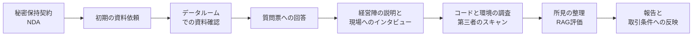

# 14.7 技術デューデリジェンスとM&A

> 資金調達・買収・提携の場面で、CTO は「この会社の技術は、言われているとおりの価値を持ち、隠れたリスクを抱えていないか」を短期間で見極める側に、あるいは見極められる側に立ちます。この章では、技術デューデリジェンス（DD）の範囲と進め方、所見を価格や契約条件に反映する方法、売り手としての準備、そして買収後の統合（PMI）までを、質問票・スコアカード・100 日計画といった実務の道具とともに学びます。

| 項目 | 内容 |
|---|---|
| 学習時間の目安 | 本文 4h ＋ 演習 6h |
| 前提となる章 | [14.2 技術戦略の立て方](../02-technology-strategy/README.md)、[14.3 事業と財務のリテラシー](../03-business-and-finance/README.md)、[14.5 ガバナンス・リスク・コンプライアンスと法務](../05-governance-risk-compliance/README.md) |
| 演習 | [exercises/](exercises/)（Python）＋ 記述演習 |
| キーワード | 技術DD, データルーム, 質問票, レッドフラグ, RAG評価, 表明保証, 特別補償, エスクロー, 権利譲渡, 著作権法61条2項, OSSライセンス, コピーレフト, PMI, 100日計画, アクハイアー, カーブアウト, TSA |

## この章のゴール

- [ ] 技術 DD の目的（投資・M&A・ベンダー選定・提携）に応じて、範囲・深さ・期間を設計できる
- [ ] 技術・組織・法務の各領域で、何を確認し、どんな証拠を求め、何がレッドフラグかを説明できる
- [ ] 知的財産の帰属（業務委託の権利譲渡、著作権法 61 条 2 項）と OSS ライセンス（コピーレフト）のリスクを評価できる
- [ ] DD の所見を RAG で評価し、価格調整・表明保証・特別補償・エスクロー・リテンションなどの取引条件に結びつけられる
- [ ] 売り手として、DD に先回りして備えることができる
- [ ] 買収後の統合戦略を選び、ID・ネットワーク・文化・人材の論点を含む 100 日計画を作れる

## なぜ学ぶのか

技術の問題は、取引の後で表面化すると、価格にも評判にも大きく響きます。

- **Verizon による Yahoo の事業買収（2017 年）**: 買収の合意後に、Yahoo は過去の大規模な情報漏えいを公表しました。両社は 2017 年 2 月に契約を修正し、買収価格を 3 億 5,000 万ドル引き下げ、漏えいに関する一部の政府調査や第三者訴訟の負担を折半することにしました。技術の事故が、そのまま価格と責任分担の交渉になった例です。
- **Marriott による Starwood の買収**: Marriott が 2016 年に買収した Starwood の予約システムには、2014 年から攻撃者が侵入しており、発覚したのは 2018 年でした。英国の情報コミッショナー（ICO）は 2019 年に制裁金の予定を公表した際、Marriott が買収時に十分なデューデリジェンスを行わなかったと指摘し、2020 年に 1,840 万ポンドの制裁金を科しました。**会社を買うと、その会社に潜んでいる攻撃者も一緒に買う** ことがあるのです。

日本でも、IPO に代わる出口としてスタートアップの M&A が増えていると報じられています。買う側の CTO は限られた時間で正しく見極める力が、売る側の CTO は指摘される前に問題を把握して是正する力が求められます。そして日本には、業務委託で作られたコードの著作権の扱い（著作権法 61 条 2 項）のように、海外の感覚だけでは見落とす論点があります。

技術 DD は「合格か不合格か」を決める試験ではありません。**リスクに値段を付け、統合の計画を立てるための調査** です。この視点を持つと、何を、どこまで調べるべきかが見えてきます。

## 1. 技術DDの目的と種類

同じ「技術 DD」でも、場面によって問いと深さが違います。

| 場面 | 誰が誰を調べるか | 主な問い | 期間と深さの目安 |
|---|---|---|---|
| 資金調達 | 投資家が投資先を | 技術は事業計画を支えられるか。致命的なリスクはないか | 数日〜3 週間。範囲を絞る |
| M&A（買い手） | 買収者が対象会社を | 価格は妥当か。統合できるか。隠れた負債はないか | 3〜8 週間。広く深く |
| M&A（売り手） | 売り手が自社を（ベンダー DD） | 買い手に指摘される前に問題を把握し、是正・開示する | 取引の数か月前から |
| ベンダー選定 | 自社が重要なベンダーを | 事業は続くか。セキュリティは十分か。ロックインの度合いは | 2〜6 週間 |
| 提携・合弁 | 双方が相手を | 技術は補完的か。権利の整理はつくか | 案件による |

期間は案件の規模と取引のスケジュールで大きく変わります（上の表は目安です）。どの場面でも共通するのは、DD が **時間の限られたサンプリング調査** だということです。すべてを見ることはできないので、「事業の価値を支える部分」と「壊れたら取引の前提が崩れる部分」に調査を集中させます。

## 2. DDの範囲 — 何を見るか

### 2.1 領域の全体像

| 領域 | 見ること | 求める証拠の例 | レッドフラグの例 |
|---|---|---|---|
| プロダクトとアーキテクチャ | 構成、依存関係、単一障害点、説明と実物の一致 | 構成図、ADR、デモ | 説明された構成と実物が違う |
| スケーラビリティ | 事業計画の成長に耐えられるか | 負荷試験の結果、容量計画、主要指標の推移 | 事業計画が前提とする規模で作り直しが必要 |
| 技術的負債 | 負債の所在と返済コスト | 負債の台帳、サポート切れのソフトウェアの一覧 | サポートの切れた OS・言語・DB が中核にある |
| コードの品質と開発の実践 | テスト、レビュー、CI/CD | リポジトリ、カバレッジ、静的解析の結果 | テストなしで手作業のデプロイ |
| セキュリティと事故の履歴 | 管理策、脆弱性管理、過去の事故 | 診断報告、ISMS や SOC 2 の報告書、インシデントの記録 | 公表されていない侵害、管理者権限の共有 |
| プライバシーとデータ | 取得の根拠、同意、越境移転、保存と削除 | プライバシーポリシー、データマップ、委託契約 | 同意の範囲を超えたデータの利用 |
| 知的財産 | 権利の帰属、特許、商標 | 雇用契約、業務委託契約、特許の一覧 | 外注したコードの権利が譲渡されていない |
| OSS ライセンス | 利用している OSS と、その義務の遵守 | SBOM、ライセンススキャンの結果 | 配布する製品へのコピーレフトの混入 |
| インフラとコスト | 構成、コスト構造、粗利への影響 | クラウドの請求書、FinOps の資料 | 売上に比べて過大なインフラ費、個人名義のアカウント |
| チームとキーパーソン | 組織、スキル、依存 | 組織図、離職率、担当の分布 | 1 人しか分からない基盤、中心メンバーの退職意向 |
| プロセスとデリバリー | 変更の速さと安全さ | DORA 指標、ポストモーテム | 変更のたびに障害が起きる |
| ロードマップの実現性 | 計画と能力の整合 | ロードマップ、見積もり、採用計画 | 顧客に約束済みの機能が技術的に未着手 |
| ベンダー契約とロックイン | 重要なベンダーと契約条件 | 契約書、解約条件 | 支配権の変更（チェンジ・オブ・コントロール）で解除できる重要契約 |
| AI の利用とデータの権利 | 使っているモデル、学習データ、生成物 | AI の利用台帳、データの取得元、利用規約 | 権利の不確かなデータで学習したモデルが製品の中核 |

プロセスの指標（DORA 指標）は [13.7 デリバリーと生産性](../../13-technical-leadership/07-delivery-and-productivity/README.md)、技術的負債は [8.5 リファクタリングと技術的負債](../../08-software-engineering/05-refactoring-and-tech-debt/README.md)、クラウドのコストは [10.6 クラウドコスト管理（FinOps）](../../10-cloud-and-sre/06-finops/README.md) で詳しく扱います。以下では、日本の CTO が特に見落としやすい知的財産・OSS・AI の 3 領域を掘り下げます。

### 2.2 知的財産の帰属 — 日本で特に注意すること

ソフトウェア会社の価値の中心はコードですが、**会社がそのコードの権利を本当に持っているか** は、意外なほど確認されていません。権利の帰属のルールと契約の書き方は [14.5 ガバナンス・リスク・コンプライアンスと法務](../05-governance-risk-compliance/README.md) の「知的財産の帰属」で詳しく扱ったので、ここでは DD で確かめる観点に絞ります（個別の契約の解釈は、必ず弁護士に確認してください）。

- **従業員が作ったコード**: 職務著作（著作権法 15 条）の要件を満たせば、著作者は会社になる。就業規則や雇用契約に別段の定めがないかを確認する。
- **業務委託先（フリーランスや受託開発会社）が作ったコード**: 著作権は原則として作った側にあり、契約で譲渡を受ける必要がある。ここで日本特有の落とし穴になるのが **著作権法 61 条 2 項** で、譲渡の契約で 27 条（翻訳権・翻案権など）と 28 条（二次的著作物の利用に関する原著作者の権利）が特掲されていなければ、これらは譲渡した側に留保されたものと推定される。「著作権を譲渡する」とだけ書いた契約では、コードを改変して使い続ける権利に疑義が残りうる。
- **著作者人格権**: 譲渡できない（59 条）ので、不行使特約があるかを確認する。
- **創業前に書かれたコード**: 創業者が設立前に個人として書いたコードは、譲渡の契約がなければ会社の資産とは言えない。
- **受託開発の成果物**: 開発会社が以前から持っている汎用部品の権利は、開発会社に残す契約が一般的。会社がどの範囲で使う権利を持つかを確認する。
- **特許**: 職務発明（特許法 35 条）の規程が整備されているかを確認する。

DD では、次の問いを立てます。「コードベースのうち、業務委託先や創業前の個人が書いた部分はどこか」「その全員と、27 条・28 条を明記した譲渡契約と不行使特約を結んでいるか」。欠けていれば、クロージングまでに確認的な譲渡契約を結ぶことを取引の前提条件にします（3.4 節）。

### 2.3 OSS ライセンスとコピーレフト

OSS は無料で使えますが、**義務のない無料ではありません**。ライセンスの類型と義務の詳細は [14.5](../05-governance-risk-compliance/README.md) の OSS ライセンスの節で扱ったので、ここでは DD での評価の勘所をまとめます。

| 類型 | 代表例 | DD での評価の勘所 |
|---|---|---|
| パーミッシブ | MIT、BSD、Apache-2.0 | 著作権表示やライセンス文の同梱漏れは、よくある是正項目（多くは軽微） |
| 弱いコピーレフト | LGPL、MPL-2.0 | 改変の有無と結合の仕方で義務が変わる。改変した部分のソース開示に対応できているか |
| 強いコピーレフト | GPL-2.0、GPL-3.0 | 義務が生じるのは **配布** するとき。オンプレミス製品、アプリ、組み込み機器として配布しているなら重大な所見になりうる。自社のサーバーで動かす SaaS だけなら、一般に配布には当たらないと解釈されている |
| ネットワーク・コピーレフト | AGPL-3.0 | 改変した版をネットワーク越しに利用させる場合も、利用者へのソースの提供が必要。SaaS の中核に改変して組み込んでいると問題になる |
| ソースアベイラブル（OSS ではない） | BUSL、SSPL など | 競合サービスの提供などの制限に抵触しないか |

「どこまでが一つの著作物か」（動的リンクの扱いなど）は解釈が分かれる論点なので、重大な判断は専門家に確認します。もう一つの論点は **ライセンスの変更** です。[14.2 技術戦略の立て方](../02-technology-strategy/README.md) で見た HashiCorp（2023 年）や Redis（2024 年）の例のように、特定の 1 社が主導する OSS に事業の中核を依存しているなら、その会社の方針転換も DD の論点になります。

確認の手段は、SBOM（ソフトウェア部品表。形式には SPDX や CycloneDX がある）、ライセンスのスキャン（ScanCode や、SCA と呼ばれるソフトウェア構成分析のツールなど）、そして OSS のライセンス遵守の体制です。体制の国際規格として OpenChain（ISO/IEC 5230:2020）があります（サプライチェーンのセキュリティは [11.5](../../11-security/05-security-operations/README.md) を参照）。

### 2.4 AI の利用とデータの権利

AI を製品に組み込んでいる会社では、次の点を確認します（AI 戦略とガバナンスは [14.8](../08-ai-strategy/README.md) で詳しく扱います）。

- どのモデルを、どの契約・ライセンスで使っているか（API の利用規約、オープンウェイトのモデルのライセンスには商用利用や用途の制限があるものもある）
- 独自に学習・ファインチューニングしたモデルの学習データの出所と、利用の権利（日本の著作権法 30 条の 4 と、他の国・地域の規律は異なる）
- 顧客のデータを学習に使っているか。契約とプライバシーポリシーは、それを許しているか
- 特定のモデル提供者への依存度と、切り替えにかかるコスト
- 精度を測る評価の仕組み（評価データとテスト）があるか。「デモでうまく動く」以上の根拠はあるか

## 3. DDの進め方

### 3.1 全体の流れ



- **秘密保持契約（NDA）**: ソースコードの扱いに加え、従業員の引き抜きを禁じる条項が入ることが多い。競合同士の取引では、クロージング前に価格や顧客などの競争上重要な情報をやりとりすると独占禁止法上の問題になりうるため、限られたメンバー（クリーンチーム）だけが情報に触れる仕組みを使う（具体的な運用は弁護士に確認する）。
- **データルーム**: 資料を共有する場。誰が何を見たかの記録と、質疑の記録が残る。
- **質問票**: 7 節のテンプレートを案件に合わせて絞る。回答は「はい / いいえ」ではなく、証拠の資料とセットで求める。
- **インタビュー**: 経営陣の説明だけでなく、アーキテクト、SRE、セキュリティ担当、数名の現場のエンジニアにも話を聞く。「最近いちばん大変だった障害は」「一番触りたくないコードは」といった問いに、現場の実態が表れる。
- **コードと環境の調査**: 売り手は買い手にソースコードを渡したがらないことが多い。その場合、第三者の専門会社がスキャン（ライセンス、脆弱性、埋め込まれた秘密情報、品質の指標）を行って集計結果だけを報告する、画面共有で読む、といった方法をとる。重要な業務の流れ（例: 決済）を 2〜3 本選び、コードから本番の運用まで端から端までたどると、資料からは見えない問題が見つかる。

### 3.2 所見の書き方

所見（finding）は、あとで価格や契約の交渉に使われます。事実と評価を分け、証拠と確信度を明記します。

| 項目 | 悪い例 | 良い例 |
|---|---|---|
| 事実 | セキュリティが弱い | 本番データベースの管理者アカウント 1 つを、エンジニア 12 名が共有している（インタビューと設定画面で確認） |
| 影響 | 危ない | 退職者を含め誰が操作したか追跡できない。漏えい時に影響範囲を特定できず、報告義務の判断が困難になる |
| 深刻度・確信度 | — | high / 確信度 1.0 |
| 推奨 | 直すべき | クロージング後 30 日以内に個人アカウントと多要素認証へ移行（100 日計画に組み込み）。是正コストの見積もり: 5 人日 |

### 3.3 RAG 評価とスコアカード

所見は、取引への影響で 3 段階に分けるのが一般的です。信号の 3 色（Red・Amber・Green）になぞらえて **RAG 評価** と呼びます（LLM の検索拡張生成の RAG とは無関係です）。

| 評価 | 意味 | 取引への反映の例 |
|---|---|---|
| RED | 取引の前提を揺るがす | 取引の中止、価格・構造の見直し、クロージングの前提条件、特別補償 |
| AMBER | 取引条件か統合計画で対処できる | 表明保証の追加、100 日計画での是正、価格への一部反映 |
| GREEN | 通常の範囲 | 報告書への記載のみ |

所見を束ねて総合評価を出すときには、二つの罠があります。一つは **平均点が致命的な問題を薄める** こと。もう一つは **調べていない領域を「問題なし」と数える** ことです。演習で作るスコアカードは、領域の重み、深刻度、確信度で点数を計算しつつ、確度の高いレッドフラグがあればスコアに関係なく RED とし、レビューの範囲（カバレッジ）が足りなければ GREEN を出さないようにしています。演習の解答例を、架空の対象会社の所見 7 件に適用した結果が次です。

```text
スコア 84.3 / 評価 RED / カバレッジ 100% / 理由 ('red_flag:F3',)
F3 critical 創業期の外注コードの権利譲渡が未確認
F1 high 本番DBに共有の管理者アカウント
F4 high 決済基盤を理解しているのが1人だけ
F5 medium 単一リージョン構成
F2 medium 既知の脆弱性がある依存ライブラリ（推定）
F7 medium 決済の重要経路に自動テストがない
F6 low ポストモーテムを書く習慣がない
```

加重平均では 84.3 点と「良好」に見えますが、中核のコードの権利が確認できていない（F3）という一点で、総合評価は RED です。これは「買うな」という意味ではありません。「この問題が解決するまでは、クロージングしてはいけない」という意味です。

### 3.4 所見を取引条件に反映する

DD の報告書は、交渉の材料として使われて初めて価値を持ちます。所見の性質に応じて、次の手段を使い分けます（契約の設計は弁護士・財務アドバイザーの領域なので、CTO は「どの所見に、どの手段が効くか」を示す役割を担います）。

| 手段 | 内容 | 向いている所見 |
|---|---|---|
| 価格の調整 | 是正コストや価値の毀損を価格に織り込む | 見積もりが可能な技術的負債、インフラ費の過大 |
| 表明保証 | 売り手が一定の事実（例: 知的財産を保有している、OSS ライセンスを遵守している、開示したもの以外に重大な事故はない）を表明し、違反があれば補償する | 調べきれない一般的な事項 |
| 特別補償（特定補償） | 特定のリスクが現実になった場合の補償を個別に約束する | すでに分かっている具体的なリスク（係争中の知財、判明済みの漏えいなど） |
| エスクロー・支払いの留保 | 対価の一部を一定期間預け、補償の原資にする | 補償を確実に受けられるようにしたいとき |
| クロージングの前提条件・誓約事項 | クロージングまで、またはその後の一定期間に是正を約束させる | 短期間で直せる問題（権利譲渡の契約の締結、GPL のコードの除去） |
| アーンアウト | 将来の成果に応じて対価を追加で支払う | 技術の実現性や事業の成長に不確実性が大きいとき |
| キーパーソンのリテンション | 一定期間の継続勤務を条件とする報酬 | キーパーソンへの依存 |
| 取引の中止 | — | 是正できない、または値段を付けられない問題 |

Verizon と Yahoo の例では、判明した漏えいに対して、価格の引き下げと責任の分担という二つの手段が組み合わされました。

**表明保証保険** は、表明保証の違反による損害を保険でカバーするもので、欧米の M&A では広く使われています。日本でも 2020 年前後から国内の損害保険会社が国内の案件向けに取り扱うようになり、中小規模の案件向けの簡易な商品も出てきていると報じられています。ただし、一般に **DD で判明していた事項は補償の対象外** とされるため、既知のリスクには特別補償などの別の手段が必要です。保険の内容と使い方は、専門家に確認してください。

## 4. 売り手としての準備

買われる側の CTO にとって、DD は「減点される場」になりがちです。しかし、事前に準備すれば **発見される問題を、開示して計画を示した問題に変えられます**。知られていて計画のある負債は交渉の材料にとどまりますが、調査で初めて見つかった問題は「ほかにも何か隠れているのでは」という疑いを生み、価格の割引につながります。

取引の 6〜12 か月前から始めたい準備を挙げます。

- **権利の整理**: 業務委託先・元従業員・創業者との契約を集め、欠けていれば確認的な譲渡契約（27 条・28 条の明記と不行使特約）を結ぶ
- **OSS の棚卸し**: SBOM を作り、ライセンスの問題を是正する
- **セキュリティの資料**: 脆弱性診断の報告書、方針・規程、インシデントの記録と対応
- **設計の資料**: 構成図、ADR、データマップ
- **技術的負債の台帳**: 負債の一覧と、返済の計画・見積もり
- **コストの内訳**: インフラ費の内訳と、売上に対する比率の推移
- **組織**: 組織図、キーパーソンと代替者、採用計画
- **契約**: 重要なベンダーとの契約、特にチェンジ・オブ・コントロール条項の有無
- **指標**: デプロイ頻度などのデリバリー指標、可用性の実績

売り手の依頼で第三者が事前に行う **ベンダー DD** の報告書を用意しておくと、買い手の調査が速く進むこともあります。また、契約で開示した事項は一般に表明保証の違反にはならないため、**隠すより開示する方が売り手自身を守る** ことも覚えておきましょう。

## 5. 買収後の統合（PMI）

### 5.1 統合の戦略を選ぶ

PMI（Post-Merger Integration）の成否は、統合の **度合い** を目的に合わせて選べるかにかかっています。Haspeslagh と Jemison（1991 年）は、買収先に求める「独立性」と、両社の間の「戦略的な相互依存」の強さによって、保全（preservation）・吸収（absorption）・共生（symbiosis）といった統合の型を整理しました。技術の統合も、同じ考え方で選びます。

| 戦略 | 内容 | 向いている場面 | リスク |
|---|---|---|---|
| 独立を保つ | 製品・技術・組織を当面は独立させる | 市場や文化が異なる。買収先のスピードこそが価値 | 相乗効果が出ない。重複投資 |
| 統合する | 買収側の基盤・組織に移す | 同じ市場で規模の経済が効く | 移行期の障害、人材の流出 |
| 置き換える | 買収先の技術を廃止し、顧客を自社の製品に移す | 目的が顧客や人材の獲得 | 顧客の離反 |
| 段階的に融合する | 互いの強みを取り入れながら少しずつ統合する | 能力の組み合わせが目的 | 長期化し、方針がぶれる |

どの戦略でも、**セキュリティの最低基準と ID（アカウント）の管理は早期に統合する** のが原則です。買収した会社は、攻撃者にとって本体への侵入口になりえます（Marriott の例を思い出してください）。一方、インフラや製品の統合は、急ぐと障害と人材の流出を招きます。層ごとに速度を変えるのがこつです。

### 5.2 Day 1 と 100 日計画

| 時期 | 技術面でやること |
|---|---|
| 契約締結（公表）からクロージングまで | 公表の日の社内への説明（エンジニア向けの説明の場を含む）。キーパーソンとの対話。Day 1 の要件の準備と統合の計画（競合同士では、クロージング前の過度な一体運営は独占禁止法上の問題になりうるので、弁護士と範囲を確認する） |
| Day 1（クロージング当日） | 当面変わること・変わらないことの説明。アクセス権の棚卸し。最低限の連絡手段（メールやチャットの相互接続）。セキュリティの最低基準（多要素認証、EDR）の確認。インシデントの連絡網の統合 |
| 〜30 日 | システムとデータ、契約、依存関係、人の棚卸し。システムごとの方針（独立・統合・置換）の決定。DD の RED と AMBER の所見の是正の開始 |
| 〜60 日 | ID の統合（SSO、ディレクトリ）。監視とインシデント対応の統合。ネットワーク接続の設計（5.4 節） |
| 〜100 日 | 共通のロードマップ。組織・役割・等級の確定。最初の共同リリース。統合の進捗と残りの計画を経営に報告 |

100 日という区切りに魔法があるわけではありません。**最初の数か月で「何がどう変わり、何は変わらないか」を決めて伝える** ための枠組みです。統合の方針が決まらない宙ぶらりんの期間が長いほど、転職の選択肢を多く持つ優秀な人から辞めていきがちです。

### 5.3 ID と SSO

- Day 1 から全員のアカウントを移行しようとしない。まずは両社の ID 基盤を連携（フェデレーション）させ、必要なシステムにだけ相互にアクセスできるようにする
- 多要素認証、特権アカウントの棚卸し、退職者のアカウントの削除を最初に確認する
- アカウントの作成・変更・削除の手順を統合するまでの間、誰が責任を持つかを決める

### 5.4 ネットワークのアドレスの重複

両社のネットワークを接続しようとして最初にぶつかるのが、**IP アドレス範囲（CIDR）の重複** です。多くの会社がプライベートアドレスの同じような範囲（`10.0.0.0/16` など）を使っており、AWS の既定の VPC も `172.31.0.0/16` を使うため、重複は珍しくありません。重複した範囲同士は、そのままではルーティングできません（アドレスとルーティングの基礎は [5.1 階層モデルとIP](../../05-networking/01-layers-and-ip/README.md) を参照）。まず機械的に洗い出します。

```python
import ipaddress
from itertools import product

acquirer = {"本番VPC": "10.0.0.0/16", "社内LAN": "172.16.0.0/12", "検証VPC": "10.10.0.0/16"}
target = {"本番VPC": "10.0.128.0/17", "オフィス": "192.168.1.0/24", "分析基盤": "172.31.0.0/16"}

for (a, na), (t, nt) in product(acquirer.items(), target.items()):
    net_a, net_t = ipaddress.ip_network(na), ipaddress.ip_network(nt)
    if net_a.overlaps(net_t):
        print(f"重複: 買収側 {a} {net_a}  ⇔  対象会社 {t} {net_t}")
```

```text
重複: 買収側 本番VPC 10.0.0.0/16  ⇔  対象会社 本番VPC 10.0.128.0/17
重複: 買収側 社内LAN 172.16.0.0/12  ⇔  対象会社 分析基盤 172.31.0.0/16
```

対処の選択肢は次のとおりです。

| 方法 | 内容 | 向いている場面 |
|---|---|---|
| アドレスの振り直し | どちらかのネットワークを別の範囲に移す | 規模が小さい。長期的に一体運用する |
| 境界でのアドレス変換（NAT） | 相手からは別のアドレスに見えるよう変換する | 振り直しが難しいが、限られた通信が必要 |
| サービス単位の公開 | ネットワーク全体をつながず、必要なサービスだけをプライベートな接続点や API として公開する | 独立を保つ戦略。最小権限の接続 |

多くの場合、「ネットワーク全体をつなぐ」必要はありません。必要なのは特定のサービスへのアクセスであり、サービス単位で公開する方が、セキュリティの面でも安全です。

### 5.5 文化と人

技術を目的とした買収で価値が失われる大きな原因の一つは、人の流出です。

- **不確実さを減らす**: 「自分の仕事はどうなるのか」「使っている技術は捨てられるのか」への答えを、早く、正直に伝える。決まっていないことは「いつ決まるか」を伝える
- **キーパーソンを引き留める**: DD で特定したキーパーソンとは、クロージング前後に買収側の CTO が直接話す。リテンションの報酬は一定期間の継続勤務を条件にするが、お金だけでは残らない。意味のある仕事と明確な役割が要る
- **違いを尊重する**: デプロイの頻度、オンコールの仕組み、意思決定の速さ、リモートワークの方針の違いを、優劣ではなく違いとして扱う。ツールの移行を Day 1 から強制しない
- **等級と報酬の対応づけ**: 両社のキャリアラダーの対応を早めに決める（[13.5 育成・評価・キャリアラダー](../../13-technical-leadership/05-growth-and-evaluation/README.md)）

### 5.6 アクハイアー

**アクハイアー（acqui-hire）** は、製品よりも人材（チーム）の獲得を主な目的とする買収です。

- 買収先の製品は終了することが多い。既存の顧客への告知、データの移行や返却、契約の終了の手順を計画する
- 価値の源泉は「チームがそろって残り、力を発揮すること」なので、リテンションの設計と、チームを分解せずに活かせる役割の用意が要になる
- 事業譲渡の形をとる場合、従業員の雇用を移すには本人の同意が必要になるなど、取引の形式によって手続きが変わる（具体的な判断は専門家に確認する）

### 5.7 カーブアウト

**カーブアウト** は、ある会社の事業部門を切り出して売却・独立させる取引です。技術の面では最も難しい種類の統合の一つです。

- 切り出す事業が、親会社の共有のシステム（ID、メール、ERP、ネットワーク、データセンター）に依存している
- データベースに、切り出す事業と残る事業のデータが混在している
- ソフトウェアのライセンスは、契約上そのまま新会社に移せないことがある
- 独立した IT を持つコストは、事前の見積もりより大きくなりがち

そのため、一定期間、親会社がサービスを提供し続ける **移行サービス契約（TSA: Transition Service Agreement）** を結ぶのが一般的です。TSA の対象と期間、終了までの移行計画、期限を過ぎた場合の扱いを、技術の側から具体的に詰めておく必要があります。

## 6. 日本の文脈で押さえること

- **スタートアップの M&A**: IPO を取り巻く環境の変化もあり、M&A を出口として選ぶスタートアップが増えていると報じられています。売り手の CTO は、4 節の準備を資金調達の段階から少しずつ進めておくと、機会が来たときに慌てずに済みます。
- **業務委託と権利**: 日本のスタートアップは、創業期に業務委託や副業のエンジニアに開発を頼むことが多く、2.2 節の権利の問題が起きやすい構造にあります。
- **表明保証保険の広がり**: 3.4 節のとおり、国内の案件でも使われ始めています。
- **独占禁止法の手続き**: 一定規模を超える株式の取得などは、公正取引委員会への事前の届出が必要になります。対象かどうか、クロージング前にどこまで一体的に動いてよいかは、弁護士に確認します。

## 7. 技術DD質問票（テンプレート）

以下は、買い手が対象会社に送る質問票のテンプレートです（74 問）。案件の目的と規模に合わせて、重要なものに絞って使います（演習 4）。回答には、可能な限り **証拠の資料** を添えてもらいます。

### A. プロダクトとアーキテクチャ

1. システム全体の構成図（主要なコンポーネント、データの流れ、外部サービス）を提出してください。
2. 主要な技術スタック（言語、フレームワーク、データベース、クラウド）と、それぞれのバージョンを教えてください。
3. 単一障害点になっているコンポーネントと、その対策を教えてください。
4. 過去 2 年間の主要なアーキテクチャの決定と、その理由の記録（ADR など）はありますか。
5. マルチテナントの分離の方式（データベース、スキーマ、行のどの単位か）を教えてください。
6. 現在の構成で最も変更が難しい部分と、その理由を教えてください。
7. 事業計画で予定している新機能のうち、今の構成では実現が難しいものはありますか。

### B. スケーラビリティと性能

8. 主要な指標（利用者数、リクエスト数、データ量）の過去 2 年の推移と、今後の見込みを教えてください。
9. 最後に実施した負荷試験の条件と結果を提出してください。
10. 現在の構成で、どの規模（今の何倍）まで耐えられると考えますか。最初に限界に達するのはどこですか。
11. 性能に関する目標（SLO）と、過去 12 か月の達成状況を教えてください。
12. データベースの最大のテーブルの行数と、増加のペースを教えてください。

### C. 技術的負債とコードの品質

13. 技術的負債の一覧（台帳）と、返済の計画はありますか。
14. サポートが終了した、または 12 か月以内に終了する OS・言語・ミドルウェアはありますか。
15. 自動テストのカバレッジと、テストがない重要な機能を教えてください。
16. コードレビューのルール（必須のレビュー数、レビューなしでの反映の可否）を教えてください。
17. 静的解析や脆弱性スキャンの結果の要約を提出してください。
18. 「誰も触りたがらない」コードや、仕組みが分からないまま動いている部分はありますか。
19. リポジトリの数と構成、主要なリポジトリのコミッターの人数を教えてください。

### D. 開発プロセスとデリバリー

20. 本番への反映の頻度、変更のリードタイム、変更による障害の割合、復旧までの時間（DORA 指標）を教えてください。
21. CI/CD の仕組みと、本番への反映の手順（手作業の部分を含む）を説明してください。
22. 過去 12 か月の重大な障害の一覧と、そのポストモーテムを提出してください。
23. オンコールの体制と、1 人あたりの呼び出しの頻度を教えてください。
24. 要件の決定から本番への反映までの開発プロセスを説明してください。
25. 開発の生産性を測っている指標があれば、その推移を教えてください。

### E. インフラ・運用・コスト

26. 利用しているクラウドとアカウントの構成（契約の名義を含む）を教えてください。
27. 過去 12 か月のインフラ費の月次の推移と、サービス別の内訳を提出してください。
28. 売上に対するインフラ費の比率と、今後の見込みを教えてください。
29. バックアップの方式、保存先、最後に復元を試験した日と、その結果を教えてください。
30. 災害対策の構成と、目標復旧時間（RTO）・目標復旧時点（RPO）を教えてください。
31. インフラの構成はコード（IaC）で管理されていますか。手作業で作った資源はどれくらいありますか。
32. 監視とアラートの仕組み、および本番環境にアクセスできる人の一覧を教えてください。

### F. セキュリティ

33. セキュリティの方針・規程と、責任者を教えてください。
34. 取得している認証（ISMS、SOC 2 など）と、直近の報告書を提出してください。
35. 過去 3 年間の脆弱性診断・ペネトレーションテストの結果と、指摘への対応状況を提出してください。
36. 過去 3 年間のセキュリティインシデント（未公表のものを含む）と、その対応を教えてください。
37. 多要素認証を必須にしている範囲（社内システム、クラウド、本番環境）を教えてください。
38. 管理者権限や共有アカウントの管理方法と、退職者のアカウントの削除の手順を教えてください。
39. 秘密情報（API キー、パスワード）の管理方法を教えてください。リポジトリに含まれていないことを確認していますか。
40. ログの保存期間と、不正を検知する仕組みを教えてください。

### G. プライバシーとデータ

41. 保有している個人データの種類・件数と、その保存場所（データマップ）を教えてください。
42. 個人データの取得と利用の根拠（同意、契約など）と、プライバシーポリシーの変更の履歴を教えてください。
43. 個人データを国外に移転、または国外のサービスで処理していますか。
44. 個人データの取り扱いを委託している先と、その監督の方法を教えてください。
45. データの保存期間と削除の手順、本人からの開示・削除の請求への対応の実績を教えてください。
46. 過去に個人情報保護委員会などへの報告や、本人への通知を行った事案はありますか。

### H. 知的財産と OSS

47. 製品のコードのうち、業務委託先・派遣社員・創業前の個人が作成した部分を教えてください。
48. 上記の作成者全員との契約で、著作権（著作権法 27 条・28 条の権利を含む）の譲渡と著作者人格権の不行使が定められていますか。契約書を提出してください。
49. 従業員の職務著作と職務発明に関する規程を提出してください。
50. 保有・出願中の特許と商標の一覧を提出してください。
51. 第三者から知的財産権の侵害を指摘された、または指摘したことはありますか。
52. 利用している OSS の一覧（SBOM）と、ライセンスの一覧を提出してください。
53. GPL・AGPL などのコピーレフトのライセンスの OSS を、配布する製品や SaaS の中核で使っていますか。改変していますか。

### I. AI の利用

54. 製品と社内業務で使っている AI（モデル、提供者、契約の形態）の一覧を提出してください。
55. 独自に学習・ファインチューニングしたモデルがあれば、学習データの出所と利用の権利を説明してください。
56. 顧客のデータを AI の学習や改善に使っていますか。契約とプライバシーポリシーにその定めがありますか。
57. AI の出力の品質を評価する仕組み（評価データ、テスト、監視）を説明してください。
58. AI の利用に関する社内の規程と、AI に関するインシデントの記録はありますか。

### J. チームと組織

59. 技術組織の組織図と、各チームの役割・人数を提出してください。
60. 過去 2 年間の技術者の採用数と離職数、主な離職の理由を教えてください。
61. 特定の 1 人しか理解していないシステムや業務はありますか。その人が不在の場合の代替策を教えてください。
62. 業務委託・派遣・海外の開発拠点への依存度（人数と担当範囲）を教えてください。
63. 技術者の等級・評価・報酬の制度を説明してください。
64. 技術の意思決定は誰が、どのように行っていますか。
65. 主要な技術者は、取引の後も在籍する意向がありますか（取引の性質に応じて、確認の方法を相談させてください）。

### K. ベンダーと契約

66. 事業に不可欠なベンダー（クラウド、SaaS、開発委託先）と、その契約の条件（期間、解約、価格改定）を教えてください。
67. 支配権の変更によって、解除や条件の変更ができる契約はありますか。
68. 特定のベンダーへの依存が強く、乗り換えが難しいものはありますか。乗り換えにかかる期間と費用の見込みを教えてください。
69. 顧客との契約で約束している SLA と、過去 12 か月のクレジット（返金）の実績を教えてください。
70. ソースコードの寄託（エスクロー）など、顧客に特別な約束をしている契約はありますか。

### L. ロードマップ

71. 今後 12〜24 か月の技術と製品のロードマップを提出してください。
72. 顧客にすでに約束している機能と、その進捗を教えてください。
73. ロードマップの実現に必要な人員と、採用の計画を教えてください。
74. 技術の面で、事業計画の最大のリスクは何だと考えていますか。

## よくある落とし穴

1. **経営陣の説明だけで判断する**。経営陣のプレゼンは最もよく見える姿です。現場のエンジニアへのインタビュー、実際のコード、障害の記録で裏を取ります。
2. **平均点で判断し、レッドフラグを見落とす**。一つの致命的な問題（権利の欠落、未公表の侵害）は、ほかの領域がいくら良くても取引の前提を崩します。レッドフラグは別枠で扱います。
3. **「調べていない」を「問題なし」と数える**。時間切れで見られなかった領域は、報告書に「未確認」と明記し、表明保証などで手当てします。
4. **業務委託のコードの権利を確認しない**。「お金を払って作ってもらったのだから会社のもの」とは限りません。著作権法 61 条 2 項を含め、契約書の文言まで確認します。
5. **OSS を「無料だから問題ない」と扱う**。ライセンスの義務と、提供元の方針転換のリスクがあります。一方で、SaaS での GPL の利用を一律にレッドフラグにするのも誤りです。配布の有無と AGPL かどうかで分けて評価します。
6. **所見を取引条件に反映しない**。立派な報告書を作っても、交渉の担当者に「どの所見に、どの手段が効くか」が伝わらなければ、リスクはそのまま買い手に残ります。
7. **PMI の計画をクロージング後に考え始める**。Day 1 のアクセス権、セキュリティの最低基準、キーパーソンへの説明は、クロージング前に準備しておかないと間に合いません。
8. **統合の速度を層で変えない**。ID とセキュリティの統合が遅れると侵入口が残り、製品とインフラの統合を急ぐと障害と人材の流出を招きます。
9. **売り手が問題を隠す**。DD で見つかれば価格の割引と不信を招き、クロージング後に見つかれば表明保証の違反になりえます。開示して計画を示す方が、結局は売り手を守ります。

## 演習

コードの演習は [exercises/dd_scorecard.py](exercises/dd_scorecard.py) にあります。関数の docstring に仕様が書いてあるので、`raise NotImplementedError(...)` を実装に置き換えてください。解答例は [solutions/dd_scorecard.py](solutions/dd_scorecard.py) にあります。

```bash
python3 tools/check.py 14.7        # リポジトリのルートで実行
python3 tools/check.py -v 14.7     # 詳しい出力
```

| # | 難易度 | 内容 | 対象 |
|---|---|---|---|
| 1 | ★☆☆ | 領域ごとのスコア（深刻度 × 確信度の減点） | `area_scores` |
| 2 | ★☆☆ | 総合評価（重み付き平均、レッドフラグ、カバレッジ） | `overall_rating` |
| 3 | ★☆☆ | 是正の優先順位（レッドフラグ、優先度、工数、決定的な並び） | `remediation_plan` |
| 4 | ★★☆ | 記述: 案件に合わせて質問票を絞り込む | — |
| 5 | ★★★ | 記述: OSS プロジェクトの模擬 DD | — |

### 演習 4（記述）: 質問票を案件に合わせて絞り込む

あなたは、ベンチャーキャピタルから技術 DD を依頼されました。対象は、医療機関向けに問診の内容を AI で要約する SaaS を提供する、従業員 40 名のスタートアップです（シリーズ B、調達予定額 15 億円）。DD に使える時間は 2 週間です。

7 節の質問票から、この案件で最も重要な 20 問を選び、選んだ理由を領域ごとに説明してください。さらに、この案件に固有の質問を 5 問追加してください。

<details>
<summary>解答例と採点の観点</summary>

**考え方**: シリーズ B の投資では、「事業計画の成長を技術が支えられるか」と「致命的なリスクがないか」が中心です。この案件では、要配慮個人情報（病歴など）を扱うこと、AI の出力が医療の現場で使われること、規模が小さく人への依存が大きいことが特徴です。

**選ぶ 20 問の例**

- アーキテクチャとスケール（4 問）: 1、5、8、10 — マルチテナントの分離は医療データの漏えいリスクに直結する。成長の見込みと限界を確認する
- セキュリティ（5 問）: 34、35、36、37、38 — 要配慮個人情報を扱うため、管理策と事故の履歴は最重要
- プライバシー（4 問）: 41、42、43、44 — 取得の根拠と同意、国外移転（海外の AI API に送っていないか）、委託先の監督
- AI（3 問）: 55、56、57 — 学習データの権利、顧客データの利用、出力の品質の評価
- 知的財産（2 問）: 47、48 — 創業期の業務委託の有無と権利譲渡
- チーム（2 問）: 60、61 — 40 名規模ではキーパーソンへの依存が大きい

（コスト、ベンダー、ロードマップは、2 週間では優先度を下げ、経営陣への口頭の確認にとどめる判断もありうる）

**追加する固有の質問の例**

1. 医療情報を扱う事業者向けのガイドライン（厚生労働省・経済産業省・総務省の、いわゆる「3 省 2 ガイドライン」など）への対応状況を説明してください。
2. AI の要約に誤りがあった場合、医療従事者はどのように気づき、修正できますか。誤りの率はどう測っていますか。
3. AI の要約を、医療従事者の確認なしに診療記録に反映する機能はありますか。
4. 患者のデータを外部の AI API に送信していますか。送信する場合、提供者の契約でデータの保存や学習への利用はどう扱われていますか。
5. 医療機関の顧客から、セキュリティのチェックシートや監査を求められた実績と、その結果を教えてください。

**採点の観点**

- 合格ライン: セキュリティ・プライバシー・AI の質問を重点的に選び、その理由を「要配慮個人情報」「AI の出力の医療現場での利用」と結びつけて説明できている。
- よくできている: 期間（2 週間）の制約から「何を捨てるか」も明示している。追加の質問が、医療という業界に固有の規制・運用（ガイドライン、人による確認、データの国外送信）を突いている。なお、医療分野の規制やガイドラインの適用関係は、実際の案件では専門家に確認する。

</details>

### 演習 5（記述）: OSS プロジェクトの模擬 DD

公開されている OSS プロジェクトを 1 つ選び（数十人以上が貢献し、数年以上続いている中規模のもの。例: Web フレームワーク、データベース、監視ツール）、「自社の製品の中核にこの OSS を採用してよいか」を判断するための模擬 DD を行ってください。

手順:

1. 公開情報だけを使い、次の領域を調べる: ライセンス（依存関係のライセンスを含む）、ガバナンス（誰が意思決定するか、特定の 1 社への依存、財団への所属）、コミュニティの健全性（貢献者の数と集中度、メンテナの人数、Issue への応答）、セキュリティ（脆弱性の報告窓口、過去の CVE への対応の速さ、OpenSSF Scorecard などの指標）、リリースとテスト（CI、リリースの頻度、後方互換性の方針）、ドキュメント、ロードマップと資金。
2. 所見を 8 件以上、3.2 節の形式（事実・影響・深刻度・確信度・推奨）で書く。
3. 演習 1〜3 のスコアカードで総合評価と是正（または採用条件）の優先順位を出す。領域の重みは自分で決め、その理由を書く。
4. 1 ページの要約（結論: 採用する / 条件付きで採用する / 採用しない、主な根拠 3 つ、採用する場合の条件）を書く。

<details>
<summary>採点の観点（ルーブリック）</summary>

| 観点 | 不十分 | 合格 | 優秀 |
|---|---|---|---|
| 証拠 | 印象で書いている（「活発そう」） | 所見ごとに、リポジトリの数値やページなど確認できる根拠がある | 数値の期間と取得日を明記し、他の指標で裏を取っている |
| ライセンス | プロジェクト本体のライセンスだけを見ている | 依存関係のライセンスも確認し、自社の使い方（配布か SaaS か）に照らして義務を整理している | ライセンスの変更の履歴や、主導する企業の方針転換のリスクまで評価している |
| バス係数とガバナンス | 貢献者の総数だけを見ている | 直近 1 年のコミットやレビューが何人に集中しているかを見ている | 主導する企業の撤退や買収が起きた場合のシナリオと、フォークの現実性まで論じている |
| セキュリティ | 「CVE がある = 危険」と評価している | 脆弱性の報告窓口の有無と、修正までの時間を評価している | 過去の重大な脆弱性への対応の経緯から、プロセスの成熟度を評価している |
| スコアカード | 重みの理由がない | 重みの理由を自社の使い方と結びつけている | カバレッジ不足やレッドフラグ候補を正直に扱い、「未確認」を明示している |
| 結論 | 所見と結論がつながっていない | 結論が所見から導かれている | 採用の条件が具体的で検証可能（例: 「内部に 1 名のコントリビュータを置く」「半年ごとに再評価」） |

</details>

## 理解度チェック

**Q1. 創業期に業務委託のエンジニアが書いたコードが、製品の中核に残っています。契約書には「成果物の著作権は委託者に移転する」とだけ書かれています。何が問題になりえますか。どう対処しますか。**

<details>
<summary>解答</summary>

業務委託先が作ったコードは職務著作にならないので、著作権は原則として作成者に帰属し、契約による譲渡が必要です。譲渡の契約はありますが、著作権法 61 条 2 項により、27 条（翻訳権・翻案権など）と 28 条の権利が譲渡の目的として特掲されていない場合、これらは譲渡した者に留保されたものと推定されます。そのため、コードを改変して使い続ける権利について疑義が残りえます。また、著作者人格権は譲渡できないので、不行使の約束がなければ、改変に対して同一性保持権などを主張される余地が残ります。

対処は、作成者と、27 条・28 条の権利を明記した確認的な譲渡契約と、著作者人格権の不行使特約を結ぶことです。M&A では、これをクロージングの前提条件にすることが考えられます。具体的な契約の文言と効力は弁護士に確認します。

</details>

**Q2. 対象会社は、GPL-3.0 のライブラリを改変して SaaS のサーバー側で使っています。別の対象会社は、AGPL-3.0 のライブラリを同様に使っています。それぞれのリスクをどう評価しますか。**

<details>
<summary>解答</summary>

GPL の義務は、ソフトウェアを配布するときに生じます。自社のサーバーで動かして SaaS として提供するだけなら、一般に配布には当たらないと解釈されているため、サーバー側での利用自体は直ちに問題になるとは限りません。ただし、同じコードを顧客にオンプレミス版として提供する、アプリや機器に組み込んで配布する、といった将来の計画があるなら重大な論点になります。

AGPL は、改変した版をネットワーク越しに利用させる場合にも、利用者にソースを提供する義務を課します。改変したライブラリを SaaS で提供していれば、その改変部分（と、結合の仕方によってはそれ以上）のソースの提供義務が生じうるため、リスクは高く評価します。いずれも、結合の仕方などの解釈が分かれる点は専門家に確認します。

</details>

**Q3. 表明保証と特別補償は、それぞれどのような所見に向いていますか。表明保証保険があれば、既知のリスクもカバーできますか。**

<details>
<summary>解答</summary>

表明保証は、売り手が一定の事実（知的財産を保有している、ライセンスを遵守している、開示したもの以外に重大な事故はない、など）を表明し、違反があれば補償するもので、DD で調べきれない一般的な事項の手当てに向いています。特別補償は、すでに分かっている具体的なリスク（係争中の知財、判明済みの漏えいなど）が現実になった場合の補償を個別に約束するものです。

表明保証保険は、一般に DD で判明していた事項を補償の対象外とするため、既知のリスクはカバーされないと考えるべきです。既知のリスクには、特別補償、価格の調整、エスクロー、クロージングの前提条件などを使います。

</details>

**Q4. 領域ごとのスコアの加重平均が 84 点と高いのに、総合評価を RED にすべき場合があるのはなぜですか。逆に、所見がほとんどないのに GREEN にすべきでない場合はどんなときですか。**

<details>
<summary>解答</summary>

平均点は、致命的な一点を薄めてしまうからです。中核のコードの権利がない、公表されていない重大な侵害がある、といった問題は、他の領域がどれほど良くても取引の前提を崩します。そのため、確度の高いレッドフラグはスコアとは別枠で扱い、RED にします。

逆に、所見が少ないのが「調べていないから」である場合は GREEN にすべきではありません。レビューした領域の重みの割合（カバレッジ）が低いとき、または確度の低いレッドフラグの候補が残っているときは、確認が済むまで AMBER にとどめ、報告書に「未確認」と明記します。

</details>

**Q5. 買収側と対象会社の本番環境が、どちらも `10.0.0.0/16` を使っていました。統合の方針を決めるうえで、どんな選択肢と判断の観点がありますか。**

<details>
<summary>解答</summary>

重複したアドレス範囲同士は、そのままではルーティングできません。選択肢は、①どちらかのネットワークのアドレスを振り直す、②境界でアドレス変換（NAT）を行う、③ネットワーク全体をつながず、必要なサービスだけをプライベートな接続点や API として公開する、の 3 つです。

判断の観点は、統合の戦略（長期的に一体運用するのか、独立を保つのか）、必要な通信の範囲、振り直しのコストと障害のリスク、セキュリティ（接続する範囲を最小にできるか）です。多くの場合、必要なのは特定のサービスへのアクセスなので、③が安全で速い選択になります。一体運用が前提で規模が小さいなら①も検討します。

</details>

**Q6. PMI で「ID とセキュリティは早く、インフラと製品はゆっくり」統合するのが原則とされるのはなぜですか。**

<details>
<summary>解答</summary>

買収した会社は、攻撃者にとって本体への侵入口になりうるからです。多要素認証、特権アカウントの管理、退職者のアカウントの削除、インシデントの連絡網といったセキュリティの最低基準と ID の管理が遅れると、その間ずっと穴が開いたままになります（Starwood を買収した Marriott の例）。

一方、インフラや製品の統合を急ぐと、移行に伴う障害、顧客への影響、そして「使ってきた技術を捨てさせられる」ことへの反発による人材の流出を招きます。統合の度合いと速度を層ごとに変えるのが、価値を守るこつです。

</details>

**Q7. 売り手の CTO として、DD の半年前にできる準備のうち、最も効果が大きいと考えるものを 3 つ挙げ、理由を説明してください。**

<details>
<summary>解答</summary>

例として次の 3 つが挙げられます。

1. **権利の整理**: 業務委託先・元従業員・創業者との譲渡契約を集め、欠けていれば確認的な譲渡契約を結ぶ。権利の欠落はレッドフラグになりやすく、取引の直前には相手の協力を得にくいため、早く着手するほど効果が大きい。
2. **OSS の棚卸しと是正**: SBOM を作り、ライセンスの問題を直しておく。スキャンで機械的に見つかる問題は、先に直しておけば減点を避けられる。
3. **技術的負債の台帳と返済計画**: 知られていて計画のある負債は交渉の材料にとどまるが、調査で初めて見つかった問題は「他にも隠れているのでは」という疑いを生み、価格の割引につながる。

ほかに、セキュリティの資料の整備、キーパーソンへの依存の解消、チェンジ・オブ・コントロール条項のある契約の洗い出しなども有効です。

</details>

## さらに学ぶために

- Philippe C. Haspeslagh, David B. Jemison "Managing Acquisitions: Creating Value Through Corporate Renewal"（1991）— 統合の型（保全・吸収・共生）を示した古典。PMI の戦略を選ぶときの基本的な枠組みになる。
- 文化庁「著作権テキスト」（毎年改訂）— 著作権制度の公式の入門書。職務著作や権利の譲渡の基礎を確認できる。
- 経済産業省・IPA「情報システム・モデル取引・契約書」— システム開発の委託契約のモデル。成果物の権利の帰属の条項の考え方が分かる。
- OpenChain Project（ISO/IEC 5230:2020）— OSS のライセンス遵守の体制の国際規格。売り手の準備と、買い手の評価の両方に使える。
- SPDX（ISO/IEC 5962:2021）と CycloneDX の仕様 — SBOM の標準的な形式。DD で SBOM を求めるときの共通言語になる。
- OpenSSF Scorecard と CHAOSS の指標 — OSS プロジェクトのセキュリティとコミュニティの健全性を評価する指標。演習 5 の模擬 DD に使える。

## まとめ

- 技術 DD は、合否を決める試験ではなく、リスクに値段を付け、統合の計画を立てるための時間の限られた調査である。場面ごとに問いと深さを設計する。
- 範囲は、アーキテクチャ・負債・セキュリティ・プライバシー・知的財産・OSS・インフラとコスト・チーム・プロセス・ロードマップ・契約・AI にわたる。事業の価値を支える部分と、壊れたら前提が崩れる部分に集中する。
- 日本では、業務委託のコードの権利（著作権法 61 条 2 項の特掲、著作者人格権の不行使特約）と、OSS のコピーレフト（配布と SaaS、AGPL）の確認が特に重要である。
- 所見は事実・影響・深刻度・確信度・推奨で書き、RAG で評価する。平均点に埋もれるレッドフラグと、調べていない領域の扱いに注意する。
- 所見は、価格の調整・表明保証・特別補償・エスクロー・前提条件・アーンアウト・リテンションといった取引条件に結びつけて、初めて価値を持つ。
- 売り手は、権利の整理・OSS の棚卸し・負債の台帳などを早めに進め、問題を「開示して計画を示したもの」に変えておく。
- PMI では、統合の型を目的に合わせて選び、ID とセキュリティは早く、インフラと製品は層ごとの速度で統合する。不確実さを早く減らし、キーパーソンを直接引き留める。
