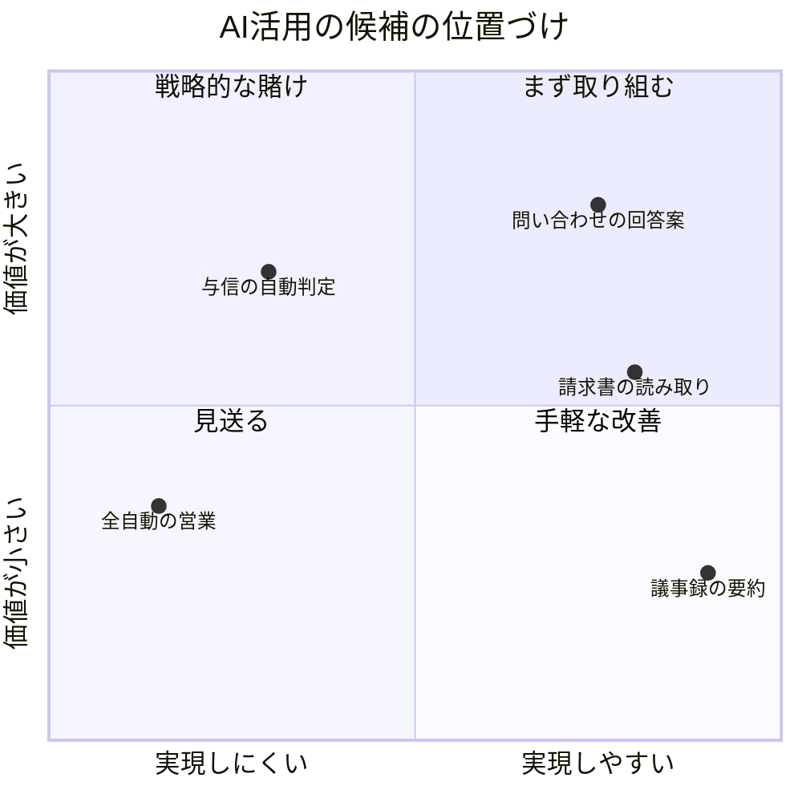
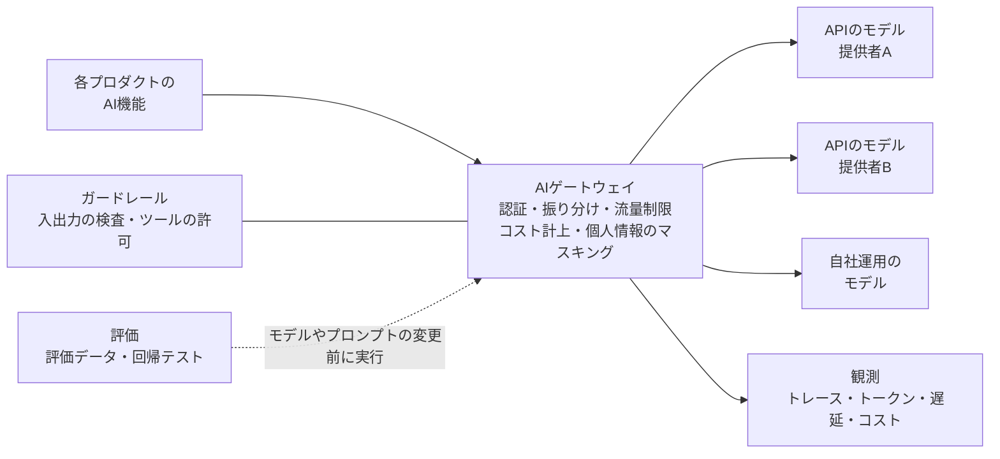
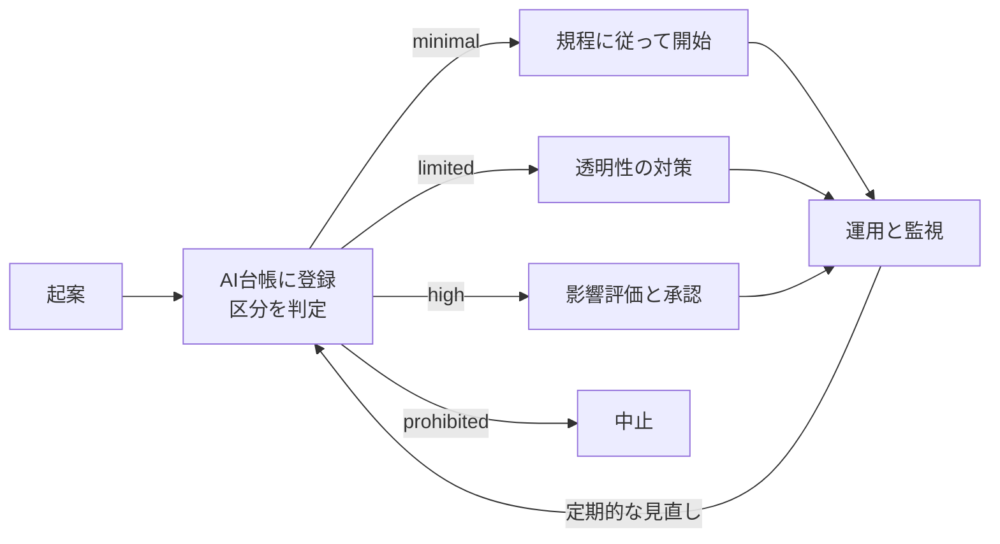

# 14.8 AI戦略とAIガバナンス

> 生成 AI は、製品の作り方、業務の進め方、ソフトウェアの書き方、そして事業の収益構造まで変えつつあります。CTO には、どこに AI を使えば価値が出て、どこに使ってはいけないかを見極め、投資を判断し、組織を育て、同時に法令とリスクに備える「アクセルとブレーキの両方」が求められます。この章では、機会の見極め、製品の競争優位、調達（作る・買う・組む）、AI 基盤、社内活用と人材、ガバナンスと規制、ROI の測り方までを、判断の枠組みと道具として身につけます。

| 項目 | 内容 |
|---|---|
| 学習時間の目安 | 本文 4h ＋ 演習 6h |
| 前提となる章 | [12.4 LLMアプリケーション開発](../../12-data-and-ai/04-llm-applications/README.md)、[12.5 AIシステムの本番運用（MLOps/LLMOps）](../../12-data-and-ai/05-mlops-llmops/README.md)、[14.2 技術戦略の立て方](../02-technology-strategy/README.md)、[14.5 ガバナンス・リスク・コンプライアンスと法務](../05-governance-risk-compliance/README.md) |
| 演習 | [exercises/](exercises/)（Python）＋ 記述演習 |
| キーワード | 機会のマッピング, 堀（moat）, API とオープンウェイト, AI ゲートウェイ, 評価（evals）, ガードレール, AI 利用規程, AI 台帳, リスク区分, 人による監督, NIST AI RMF, ISO/IEC 42001, EU AI 法, AI 推進法, AI 事業者ガイドライン, 著作権法 30 条の 4, ROI, 感度分析 |

## この章のゴール

- [ ] AI が製品・業務・エンジニアリング・ビジネスモデルをどう変えるかを、自社の文脈で説明できる
- [ ] AI の活用候補を価値と実現性で評価し、LLM を使うべきでない仕事を見分けられる
- [ ] モデルがコモディティ化する前提で、製品の競争優位（堀）と調達の方針（API・自前運用・ファインチューニング）を選べる
- [ ] AI 基盤（ゲートウェイ・評価・観測・ガードレール）と、社内の AI 活用の方針（セキュリティ・知財・生産性の測り方）を設計できる
- [ ] AI 利用規程・AI 台帳・リスク区分・人による監督からなるガバナンスの仕組みを作り、主要な規制（EU AI 法、日本の AI 推進法と関連ガイドライン、著作権法）の要点を説明できる
- [ ] AI 機能の ROI をモデル化し、シナリオ・損益分岐点・感度分析をもとに投資を判断できる

## なぜ学ぶのか

AI の失敗は、技術そのものの限界より、「会社としての仕組みの欠如」から起きることが少なくありません。

- **チャットボットの回答は会社の約束になる**: 2024 年 2 月、カナダのブリティッシュコロンビア州の民事紛争の審判所は、航空会社 Air Canada のウェブサイトのチャットボットが忌引の割引運賃について誤った案内をした件で、「チャットボットは独立した存在だ」という会社側の主張を退け、同社に差額の支払いを命じました（Moffatt v. Air Canada）。
- **検証なしの出力は信用を壊す**: 2023 年、米国の弁護士が ChatGPT の作り出した実在しない判例を引用した書面を連邦地方裁判所に提出し、制裁を受けました（Mata v. Avianca）。
- **社内利用のルールがなければ情報は流出する**: 2023 年、サムスン電子で従業員が社内のソースコードを外部の生成 AI サービスに入力していたことが問題になり、同社は社内での生成 AI の利用を制限したと報じられました。

一方で、AI を避けていても安全ではありません。競合が AI で業務のコストを下げ、製品の体験を変えれば、何もしないこと自体がリスクになります。規制も動いています。EU の AI 法は 2025 年から段階的に適用が始まり、日本でも 2025 年に AI に関する初めての法律（AI 推進法）が成立しました。CTO の仕事は、**価値の出る場所に速く投資し、同時に、事故が起きても会社が揺らがない仕組みを先に作ること** です。

## 1. AIは何を変えるのか

| 領域 | 何が変わるか | CTO が考えること |
|---|---|---|
| 製品 | 自然言語のインターフェース、要約・検索・生成、利用者の代わりに作業するエージェント | 顧客のどの仕事が変わるか。どこまでの精度が求められるか |
| 業務 | 問い合わせ対応、営業資料の作成、経理の照合、社内の知識の検索 | 業務プロセスごとに、置き換えるのか、支援するのか |
| エンジニアリング | コーディング支援とエージェント、テストの生成、レビュー、運用の自動化 | 生産性の測り方、品質とセキュリティ、人の育て方 |
| ビジネスモデル | 席数に応じた課金から、利用量や成果に応じた課金へ。推論のコストが売上原価に入る | 価格の設計と粗利（[14.3 事業と財務のリテラシー](../03-business-and-finance/README.md)） |

最後の行は見落とされがちです。従来の SaaS は、利用者が 1 人増えても追加のコストがほとんどかかりませんでした。LLM を使う機能は、**使われるほどコストが増えます**。たとえば 1 回 5 円かかる機能を、月額 3,000 円のプランの利用者が 1 日 100 回使えば、1 か月で 5 × 100 × 30 = 15,000 円のコストになり、売上の 5 倍です。利用量の上限、重い利用者向けの上位プラン、安いモデルへの振り分け（4.3 節）といった設計を、価格と一緒に考える必要があります。

## 2. 機会のマッピング — どこに使い、どこに使わないか

### 2.1 価値と実現性で並べる

社内から集まる「AI でこれをやりたい」という案は、価値（節約できる時間 × 件数、売上への効果、リスクの低減）と実現性（データの入手のしやすさ、求められる精度、既存のシステムとの統合の難しさ）の 2 軸で並べると、議論が整理されます。



右上（価値が大きく実現しやすい）から着手し、左上（価値は大きいが難しい）は、段階的な投資を前提にした「戦略的な賭け」として扱います。ただしこの図には 3 つ目の軸が欠けています。**リスク** です。「与信の自動判定」は価値が大きくても、個人に重大な影響を与える判断なので、規制上も高リスクに分類されうる用途です（7 節・8 節）。

### 2.2 LLM が向く仕事・向かない仕事

| LLM が向く仕事 | LLM が向かない仕事 |
|---|---|
| 入力が非構造（文章・画像・音声） | 決定的な正しさが必要（金額の計算、会計の数字、権限の判定） |
| 下書き・要約・分類・抽出など、完璧でなくても価値がある | 誤りの影響が大きく、しかも誤りに気づきにくい |
| 誤りを人や仕組みで検出・修正できる | ルールで書ける（従来のプログラムの方が安く、速く、確実） |
| 件数が多く、1 件あたりの人手のコストが大きい | 件数が少なく、自動化の効果が小さい |
| 表現の揺れを吸収したい（言い換え、多言語） | 判断の根拠を説明する責任があり、その根拠を示せない |

実用的な設計の型は、**「理解は LLM、判断はコード、重大な決定は人」** です。たとえば請求書の処理なら、LLM が PDF から金額や取引先を抽出し、プログラムが合計の検算や発注データとの照合を決定的に行い、不一致や高額のものだけを人が確認します。LLM に計算そのものを任せるより、安く、速く、確実です。LLM アプリケーションの設計の詳細は [12.4 LLMアプリケーション開発](../../12-data-and-ai/04-llm-applications/README.md) で扱います。

## 3. AIプロダクト戦略と「堀」

### 3.1 モデルはコモディティ化する前提で考える

基盤モデルは複数の提供者が競い合い、性能は上がり続け、同じ性能あたりの価格は下がる傾向が続いてきました。この前提に立つと、「最新のモデルを API で呼んでいるだけ」の機能は、競合もすぐに同じものを作れます。いわゆる **薄いラッパー（thin wrapper）** のリスクです。さらに、モデル自体が賢くなることで、自社が苦労して作った機能が不要になることもあります。

長く続く競争優位（堀）は、モデルの外側にあります。

| 堀の源泉 | 内容 | 注意点 |
|---|---|---|
| 独自のデータ | 他社が入手できない、継続的に更新される、利用の中で正解が付くデータ | 「データがある」だけでは堀にならない。権利・品質・活用の仕組みがそろって初めて効く |
| ワークフローへの統合 | 顧客の日々の業務の流れや記録のシステムに組み込まれている | 乗り換えのコストが高いほど強い |
| 流通 | 既存の顧客基盤、販売チャネル、ブランド | 新規参入者が最も持っていないもの |
| 体験（UX） | 不確かさを前提にした設計（出典の表示、修正のしやすさ、確信度の提示） | 精度の差を体験で埋められることは多い |
| 評価の能力 | 自社の領域で「良い出力とは何か」を測れるデータとテスト | 新しいモデルに素早く安全に乗り換えられる。見えにくいが強い堀 |
| 信頼とコンプライアンス | 規制産業での実績、監査への対応力 | 時間をかけて積み上げるもの |

特に **評価の能力** は、CTO が最初から投資すべき資産です。評価データとテストがあれば、新しいモデルが出たときに「本当に良くなったか」を数日で確かめて乗り換えられます。なければ、モデルの更新のたびに勘に頼ることになり、改善の速度で負けます。

### 3.2 モデルの進歩を味方にする設計

- モデルが賢くなったら自動的に良くなる部分（推論・要約の質）と、モデルに依存しない部分（データ、統合、体験、評価）を分けて設計する
- プロンプトや処理の流れを、特定のモデルの癖に過度に合わせない
- 「今のモデルでは 80% しかできない」機能は、人の確認と組み合わせて先に市場に出し、利用の中でデータと評価を育てる

## 4. 作る・買う・組む — 調達の方針

### 4.1 選択肢

| 選択肢 | 向いている場面 | 注意点 |
|---|---|---|
| AI 機能付きの SaaS を買う | 差別化にならない社内業務 | データの扱いの条件、ロックイン |
| API でモデルを使う | 多くの製品機能の出発点 | データの扱い（学習への利用、保存期間、処理する地域）、料金の改定、モデルの提供終了 |
| オープンウェイトのモデルを自社で運用する | データを外部に出せない、低い遅延が必要、大量で定常的な負荷、深いカスタマイズ | 運用の負担、GPU の確保、性能の差、モデルのライセンスの条件 |
| ファインチューニング | 特定の形式や文体、狭いタスクの精度 | 評価データが前提。基盤モデルの更新のたびに作り直しが必要になりうる |
| 基盤モデルを一から学習する | ほとんどの会社には不要 | 莫大な費用とデータ |

一般的な順序は、**プロンプトの工夫 → 検索拡張生成（RAG）→ ファインチューニング** です。前の手段で足りない理由を評価データで示せたときに、次の手段に進みます。

### 4.2 コストを見積もる

API の 1 件あたりのコストは、次の式で見積もれます。

```text
1 件あたりのコスト = 呼び出し回数 × (入力トークン数 × 入力単価 + 出力トークン数 × 出力単価) ÷ 1,000,000
（単価は 100 万トークンあたり）
```

自社でモデルを運用する場合、1 トークンあたりのコストは **稼働率** とモデルの大きさで大きく変わります。次の例では、すべての数値を仮定として置いています（実際の価格と性能は、見積もりとベンチマークで確認してください）。また、入力と出力のトークンを区別せず、1 台の処理能力を 1 つの数値（トークン/秒）で近似する簡略化をしています。実際には、入力の処理は出力の生成よりずっと速く、同時に処理する件数（バッチの大きさ）や遅延の要件によっても処理能力は変わります。

```python
# すべて仮定の数値（実際の価格・性能は見積もりとベンチマークで確認すること）
api_in, api_out = 300, 1_500           # API の単価（円 / 100万トークン）
tok_in, tok_out = 3_000, 500           # 1 回の呼び出しの入出力トークン
api = (api_in * tok_in + api_out * tok_out) / (tok_in + tok_out)
print(f"API の実効単価: {api:,.0f} 円/Mtok")

fixed = 1_500_000 + 1_000_000          # GPU サーバー 1 台の月額 ＋ 運用の人件費（円/月）
seconds = 3600 * 24 * 30
for model, tps in (("大きめのモデル", 2_000), ("小さなモデル", 10_000)):   # 1 台の処理能力（トークン/秒）
    for util in (0.2, 0.5, 0.8):                                         # 平均稼働率
        capacity = tps * util * seconds / 1e6                            # Mtok/月
        print(f"{model} 稼働率 {util:.0%}: {capacity:>6,.0f} Mtok/月 → {fixed / capacity:>5,.0f} 円/Mtok")
```

```text
API の実効単価: 471 円/Mtok
大きめのモデル 稼働率 20%:  1,037 Mtok/月 → 2,411 円/Mtok
大きめのモデル 稼働率 50%:  2,592 Mtok/月 →   965 円/Mtok
大きめのモデル 稼働率 80%:  4,147 Mtok/月 →   603 円/Mtok
小さなモデル 稼働率 20%:  5,184 Mtok/月 →   482 円/Mtok
小さなモデル 稼働率 50%: 12,960 Mtok/月 →   193 円/Mtok
小さなモデル 稼働率 80%: 20,736 Mtok/月 →   121 円/Mtok
```

この仮定のもとでは、大きめのモデルを自社で運用すると、稼働率を 80% に保っても API より高くつきます。小さなモデルで足りるタスクを、ある程度以上の稼働率で大量に処理できるときに、ようやく自社運用が安くなります（ただし、API でも小さなモデルは安く提供されていることが多いので、比較の相手も揃える必要があります）。自社運用を選ぶ理由は、多くの場合コストよりも **データの管理、遅延、カスタマイズ** です。コストだけで判断するなら、稼働率・運用の人件費・性能の差まで含めて比較します。

### 4.3 ロックインとマルチモデル戦略

モデルの提供者への依存は、価格の改定、利用規約の変更、モデルの提供終了という形でリスクになります。一方で、あらゆるモデルに共通の最小限の機能だけを使う抽象化は、各モデルの強みを捨てることになります。バランスの取り方は次のとおりです。

- **持ち運べる資産を自社で持つ**: 評価データ、プロンプト、RAG の索引と元データ、ファインチューニングのデータ
- **呼び出しを 1 か所に集める**: 後述の AI ゲートウェイを通すことで、モデルの切り替えや振り分けをアプリケーションの変更なしに行える
- **振り分け（ルーティング）**: 簡単な処理は安いモデルに、難しい処理だけ高性能なモデルに送る。障害時には別の提供者に切り替える
- **提供終了に備える**: 提供者は古いモデルを定期的に廃止する。評価データによる回帰テストがあれば、切り替えは計画的な作業になる
- **契約で守る**: データの利用条件、変更の事前通知、価格の改定の条件

## 5. AIプラットフォーム

AI を使う機能が 2 つ、3 つと増えると、各チームが同じ仕組みを別々に作り始めます。共通の **AI プラットフォーム** を用意すると、速度・コスト・安全性を同時に改善できます。



| 構成要素 | 役割 |
|---|---|
| AI ゲートウェイ | モデル呼び出しの一元化。認証、APIキーの管理、振り分け、流量制限、チームごとのコストの計上、個人情報のマスキング、ログ |
| 評価（evals） | 評価データによるオフラインの評価、変更前の回帰テスト、LLM を評価者に使う場合の人の判定との照合、本番での A/B テスト |
| 観測 | リクエストごとのトレース、トークン数、遅延、コスト、品質の兆候（利用者の修正率、低評価の率） |
| ガードレール | 入力と出力の検査（個人情報、有害な内容）、プロンプトインジェクションへの対策、エージェントが使えるツールの許可リスト、重要な操作の前の人の承認 |
| 管理 | プロンプトとモデルのバージョン管理、AI 台帳（7 節）との連携 |

プラットフォームを作る時期は、共通の必要が **実際に 2〜3 回繰り返されてから** が目安です。最初から壮大な基盤を作ると、使われない機能に投資することになります。運用の詳細は [12.5 AIシステムの本番運用（MLOps/LLMOps）](../../12-data-and-ai/05-mlops-llmops/README.md)、プロンプトインジェクションなどの攻撃は [11.4 Webアプリケーションセキュリティ](../../11-security/04-web-security/README.md) も参照してください。

## 6. 社内のAI活用と組織・人材

### 6.1 コーディング支援とエージェントの方針

コーディング支援の AI や、コードを書いて実行までするエージェントは、多くの開発組織で最初に広がる AI です。禁止しても、便利なので個人で使われます（シャドー AI）。**承認された安全な道を用意し、その道を一番楽にする** のが方針の基本です。

| 論点 | 方針の例 |
|---|---|
| ツールと契約 | 企業向けの契約（入力を学習に使わない、保存期間、管理機能）のあるツールを承認し、一覧にして公開する |
| データの区分 | 公開情報・社内情報・機密情報・個人情報・顧客データのそれぞれを、どのツールに入力してよいかを表にする |
| 秘密情報 | API キーやパスワードをプロンプトやコードに含めない。秘密情報のスキャンを CI に入れる |
| エージェントの権限 | 最小権限。本番環境の認証情報を渡さない。隔離した環境で実行し、削除やデータ移行など取り返しのつかない操作は人が承認する |
| 外部の入力 | Issue の本文、Web ページ、依存パッケージの文書などに埋め込まれた指示（プロンプトインジェクション）を前提に、外部の内容は信頼しない |
| 知財 | 既存の OSS のコードと酷似した出力に注意する。ツールの重複検出の機能や、提供者の知財の補償の条件を確認する |
| 品質と責任 | AI が書いたコードでも、コミットした人とレビューした人が責任を持つ。レビューとテストの基準は変えない |

### 6.2 生産性をどう測るか

AI による生産性の向上は、測り方によって結果が大きく変わります。

- Peng らの実験（2023 年）では、JavaScript で HTTP サーバーを実装する課題で、GitHub Copilot を使えたグループは、使えないグループより 55.8% 速く課題を終えました。
- 一方、METR が 2025 年に行ったランダム化比較試験では、自分がよく知る大規模な OSS リポジトリで作業する熟練の開発者が、2025 年初めの AI ツールを使えた場合、作業に 19% 長くかかりました。しかも参加者は、作業後に「AI で 20% 速くなった」と感じていました。

二つの結果は矛盾しているわけではなく、**課題の種類と文脈によって効果が違う** こと、そして **本人の実感はあてにならない** ことを示しています。ツールの進歩で結果が変わりうることにも注意が必要です。METR は 2026 年 2 月、2025 年後半のツールを使った追試の途中経過として、速くなった可能性を示す結果も出ている一方で、AI なしで作業したくない開発者が参加や課題の提出を避ける偏りがあり、推定は信頼できないと報告しています。自社で効果を知りたければ、コード行数や「AI の提案を採用した率」ではなく、変更のリードタイム、変更による障害の率、レビューの手戻り、開発者への調査を組み合わせ、段階的な導入で比較します（[13.7 デリバリーと生産性](../../13-technical-leadership/07-delivery-and-productivity/README.md)）。

### 6.3 知識の検索と業務の自動化

社内文書を AI で検索できるようにする取り組み（社内向けの RAG）は効果が見えやすい一方で、落とし穴もあります。

- **権限を守る**: 検索の段階で、利用者が本来見られない文書（人事評価、役員会の資料）を回答に使ってはいけない。元の文書のアクセス権を検索に反映させる
- **鮮度**: 古い規程を根拠に回答しないよう、更新と削除を索引に反映する
- **出典の表示**: 回答の根拠となった文書を示し、利用者が確かめられるようにする

経理の照合や契約書の確認の補助などの業務の自動化も、2.2 節の「理解は LLM、判断はコード、重大な決定は人」の型で設計します。

### 6.4 組織と人材

| 役割 | 内容 |
|---|---|
| プロダクトエンジニア | LLM を部品として使い、製品の機能を作る。評価データを作り、結果を測る力が必要 |
| ML エンジニア | モデルの選定・ファインチューニング・自社運用・性能の最適化 |
| AI 基盤チーム | ゲートウェイ・評価・観測・ガードレールを共通の仕組みとして提供する |
| ドメインの専門家 | 「良い出力」の基準を定義し、評価データを作る（医療・法務・会計など） |

全員に高度な機械学習の知識は要りませんが、**全員が AI の出力を疑い、確かめる力** は必要です。全員向けの基礎（仕組み・限界・規程）、職種ごとの実践、社内の成功例と失敗例の共有、の 3 層で育成を計画します。採用の面接でも、AI の使用を前提に「出力が正しいかをどう確かめるか」を見る方が、実務の力をよく表します。

### 6.5 若手の育成パイプライン

AI が若手向けの仕事（小さな修正、定型のコード、調査）を肩代わりするほど、若手が経験を積む機会は減ります。今の若手は、5〜10 年後のシニアです。育成の仕組みを意図的に作らなければ、将来の組織の中核が育ちません。

- 学習のための課題では、あえて AI を使わずに書く時間を設ける
- レビューで「このコードはなぜ正しいのか」を本人に説明させる。説明できないコードはマージしない
- シニアとのペア作業、オンコールの見学、ポストモーテムへの参加で、判断の仕方を学ぶ機会を作る
- 若手の採用を止めない（短期の効率のために将来の人材の供給を断たない）

## 7. AIガバナンスと責任あるAI

### 7.1 仕組みの全体像

AI ガバナンスの目的は、AI の利用を止めることではなく、**リスクに見合った速度で安全に進めること** です。リスクの低い用途は速く、高い用途は慎重に通す仕組みを作ります。



構成要素は次のとおりです。

| 要素 | 内容 |
|---|---|
| AI 利用規程 | 何に使ってよいか・いけないか、データの区分ごとの扱い、人の確認、表示の義務（演習 6） |
| AI 台帳 | 社内のすべての AI のユースケースの一覧と、責任者・区分・評価の結果 |
| リスク区分 | 用途に応じて必要な管理の強さを決める（演習 1） |
| 人による監督 | 重大な判断を人が行う、または覆せるようにする |
| 評価と監視 | 導入前の評価と、本番での継続的な監視 |
| AI インシデントの対応 | AI に起因する事故の報告・停止・調査の手順 |
| ベンダーの評価 | AI を提供する事業者のデータの扱いやセキュリティの確認 |
| 教育 | 全従業員への AI リテラシーの教育 |

体制としては、CTO・法務・セキュリティ・事業部門・人事からなる小さな委員会が、高リスクの用途の承認と規程の改訂を担い、それ以外は台帳への登録と規程の遵守で進める、という軽い形から始めるのが現実的です。

### 7.2 AI 台帳

| 項目 | 記入例 |
|---|---|
| ユースケース | 問い合わせへの回答案の作成 |
| 責任者 | カスタマーサポート部長 |
| 目的と効果の指標 | 一次回答の時間の短縮。回答案がそのまま使える率 |
| 利用者と影響を受ける人 | サポート担当者（利用者）、顧客（回答を受け取る人） |
| モデルと提供者 | API のモデル（提供者と契約の種類を記載） |
| 扱うデータと区分 | 問い合わせの本文（顧客の個人情報を含みうる）→ 入力前にマスキング |
| リスク区分 | limited（顧客は回答案をそのまま受け取らず、担当者が確認して送る） |
| 人の関与 | 全件を担当者が確認してから送信 |
| 評価と監視 | 評価データでの正答率、担当者の修正率を週次で監視 |
| 最終見直し日 | 2026-09-01 |

### 7.3 人による監督と自動化バイアス

人の関与には、1 件ずつ人が承認する形（human-in-the-loop）と、AI が処理し人が監視して必要なら介入する形（human-on-the-loop）があります。どちらでも注意すべきなのが **自動化バイアス**、つまり人が AI の出力を鵜呑みにしてしまう傾向です。「人が確認している」ことが、形だけになっていないかを確かめます。

- 出典や確信度を表示し、確認すべき点を示す
- 人が AI の提案を修正・却下した率を測る（ほぼ 0% なら、確認が形骸化している可能性がある）
- 定期的に抜き取りで、確認済みの結果を別の人が監査する

### 7.4 AI インシデントへの備え

AI に起因する事故には、有害な出力や誤った回答による損害、AI を経由した情報の漏えい、プロンプトインジェクションによる不正な操作、偏った判断、想定外のコストの急増などがあります。

- AI の機能を即座に止めて人の対応に戻せる **停止スイッチ**（機能フラグ）を用意する
- 入力・出力・使ったモデルとプロンプトのバージョンを、調査できる形で記録する（個人情報の扱いに注意）
- 通常のインシデント対応と危機管理の手順（[10.5](../../10-cloud-and-sre/05-incident-management/README.md)、[14.6](../06-crisis-management/README.md)）に AI 特有の論点を加えておく

### 7.5 ベンダーの評価

| 確認項目 | 問い |
|---|---|
| データの利用 | 入力や出力をモデルの学習に使うか。既定の設定は何か |
| 保存と削除 | どれだけの期間保存するか。削除を求められるか |
| 処理の場所 | どの国・地域で処理・保存されるか |
| 再委託 | 下請けの事業者はどこか |
| セキュリティ | 第三者の認証や監査の報告書はあるか |
| 変更の管理 | モデルの変更や提供終了は、どれだけ前に通知されるか |
| 知財 | 出力に関する権利侵害の申し立てに、補償はあるか。その条件は |
| 事故の通知 | インシデントの際、いつ、どう通知されるか |

### 7.6 参照すべきフレームワーク

| フレームワーク | 概要 |
|---|---|
| NIST AI RMF 1.0（2023 年 1 月） | 米国 NIST の AI リスク管理の枠組み。Govern（統治）・Map（把握）・Measure（測定）・Manage（対処）の 4 機能で整理する。2024 年 7 月には生成 AI 向けのプロファイル（NIST AI 600-1）も公表された |
| ISO/IEC 42001:2023 | AI マネジメントシステムの国際規格。ISMS（ISO/IEC 27001）と同様に、組織の仕組みとして第三者の認証を受けられる |
| AI 事業者ガイドライン（総務省・経済産業省） | 日本の AI ガバナンスの中心となる指針。AI の開発者・提供者・利用者のそれぞれに向けて、人間中心、安全性、公平性、プライバシー保護、セキュリティ確保、透明性、アカウンタビリティなどの共通の指針を示す。2024 年 4 月に第 1.0 版が公表され、2026 年 3 月の第 1.2 版では AI エージェントなどに関する記述が追加された |

### 7.7 責任ある AI を実務に落とす

「公平性」や「透明性」は、原則を掲げるだけでは実現しません。

- **公平性**: 評価データを利用者の属性（年齢層、言語、地域など）ごとに分けて、精度の差を測る
- **透明性**: 利用者が AI とやりとりしていること、AI が生成した内容であることを表示する
- **説明可能性**: 個人に影響する判断では、理由を人が説明できるようにする。説明できない用途には使わない
- **安全性**: 公開前に、意図的に悪用を試みるテスト（レッドチーミング）を行う
- **説明責任**: ユースケースごとに責任者を 1 人決め、AI 台帳に記録する

## 8. 規制と法務の動向（2026年時点）

この節は 2026 年 9 月時点の情報に基づく一般的な解説です。AI の規制は変化が速いので、必ず一次情報（条文、公式のガイダンス）を確認し、具体的な判断は専門家に確認してください。

### 8.1 EU の AI 法

EU の AI 法（Regulation (EU) 2024/1689）は、AI の用途をリスクに応じて分類し、リスクが高いほど重い義務を課す **リスクベースのアプローチ** をとります。

| 区分 | 例 | 主な扱い |
|---|---|---|
| 許容できないリスク（禁止） | 人の弱みにつけこむ操作的な手法、ソーシャルスコアリング、顔画像の無差別な収集による顔認識データベースの作成、職場や教育の場での感情の推定（医療・安全目的の例外あり）など | 禁止 |
| 高リスク | 採用・人事評価、教育の評価、与信などの不可欠なサービスへのアクセス、重要インフラ、生体識別、法執行など（附属書 III）、および規制された製品の安全部品（附属書 I） | リスク管理、データの品質、記録、人による監督、正確性などの要件と適合性の評価 |
| 透明性の義務 | チャットボット、ディープフェイク、AI が生成したコンテンツ | AI であることの表示、生成物の表示 |
| 最小限のリスク | 多くの一般的な用途 | 特別な義務はない（自主的な取り組み） |

これとは別に、汎用目的 AI モデル（GPAI）の提供者にも、技術文書の作成や著作権に関する方針などの義務があります。EU 域外の企業でも、EU 市場に AI システムを提供する場合や、AI の出力が EU で使われる場合などには適用されうるため、日本企業にも無関係ではありません。違反に対する制裁金は、禁止された行為については最大で 3,500 万ユーロまたは全世界の年間売上高の 7% のいずれか高い方とされています。

適用は段階的です。

| 時期 | 主な内容 |
|---|---|
| 2024 年 8 月 1 日 | 発効 |
| 2025 年 2 月 2 日 | 禁止行為の規定、AI リテラシーの規定の適用 |
| 2025 年 8 月 2 日 | 汎用目的 AI モデルの義務、制裁金などの規定の適用 |
| 2026 年 8 月 2 日 | 多くの規定の適用開始（透明性の義務の多くを含む） |
| 2026 年 12 月 2 日 | 改正で追加された禁止行為の適用。2026 年 8 月より前に市場に出た生成 AI システムの、生成物の表示の経過措置の終了 |
| 2027 年 12 月 2 日 | 附属書 III の高リスク AI の義務（当初の予定は 2026 年 8 月） |
| 2028 年 8 月 2 日 | 附属書 I の高リスク AI の義務（当初の予定は 2027 年 8 月） |

高リスク AI の適用時期は、2026 年 7 月 27 日に発効した改正（Regulation (EU) 2026/1744。いわゆる AI オムニバス）で後ろ倒しになりました。この改正では、同意のない性的な画像や児童の性的虐待の画像を生成する AI の禁止の追加、既存の生成 AI システムの生成物の表示に関する経過措置、AI リテラシーの規定の緩和なども行われたとされます。今後も運用の指針や標準が順次示されるので、最新の状況を確認してください。

### 8.2 日本の法制度とガイドライン

**AI 推進法**: 2025 年 5 月に「人工知能関連技術の研究開発及び活用の推進に関する法律」が成立し、同年 9 月に全面施行されました。規制を中心とする EU の AI 法とは異なり、研究開発と活用の推進を基本とする法律で、罰則の規定はありません。内閣に AI 戦略本部を置き、政府が AI 基本計画を定めること（2025 年 12 月に閣議決定）、事業者が国の施策に協力するよう努めること、国が AI による権利侵害の事案などを調査し、必要に応じて指導・助言などを行うことなどを定めています。

**AI 事業者ガイドライン**: 7.6 節のとおり、法的な拘束力を持たない指針（ソフトロー）ですが、国内の取引先や監査から、これに沿った対応を求められる場面が増えています。

**個人情報保護法**: 個人情報保護委員会は 2023 年 6 月に、生成 AI サービスの利用に関する注意喚起を公表しました。個人情報取扱事業者が、本人の同意なく個人データを含むプロンプトを生成 AI サービスに入力し、その個人データが応答の出力以外の目的（たとえばモデルの学習）で取り扱われる場合、法律の規定に違反する可能性があると指摘しています。社内規程のデータ区分（6.1 節）と、ベンダーの契約の確認（7.5 節）が必要になる理由です。

**著作権法**: 日本の著作権法は、AI の **開発・学習の段階** と、**生成・利用の段階** を分けて考えます。

- **学習の段階（30 条の 4）**: 著作物に表現された思想や感情を自ら享受したり他人に享受させたりすることを目的としない利用（情報解析など）は、原則として権利者の許諾なく行えます。ただし、著作権者の利益を不当に害することとなる場合は除かれます。また、学習データの中の特定の作品の表現を出力させる目的がある場合など、享受の目的が併存すると判断される場合には適用されません。
- **生成・利用の段階**: AI で生成した物の利用が著作権侵害になるかは、人が創作した場合と同じく、既存の著作物との **類似性** と **依拠性** で判断されます。文化審議会著作権分科会法制度小委員会の「AI と著作権に関する考え方について」（2024 年 3 月）は、AI の利用者が既存の著作物を知らなかったとしても、その AI の学習データに当該著作物が含まれていた場合は、通常、依拠性があったと推認されるとの考え方を示しています（学習した著作物の創作的な表現が出力されないよう技術的に担保されている場合などには、依拠性が否定されうるとも述べています）。なお、侵害の差止めの請求は故意や過失がなくても可能ですが、損害賠償には故意または過失が必要とされます。

実務では、特定の作品や作家の名前を指定して似たものを生成させる使い方を避ける、商用で使う生成物は既存の作品との類似性を確認する、提供者の知財に関する補償の条件を確認する、といった対策をとります。文化庁は 2024 年 7 月に、立場ごとの対策をまとめた「AI と著作権に関するチェックリスト＆ガイダンス」も公表しています。

### 8.3 そのほかの地域

米国では、2026 年時点で連邦レベルの包括的な AI 規制法はなく、州ごとの AI 関連法と、既存の法律（消費者保護、差別の禁止など）の執行が中心です。州法を連邦の枠組みで置き換えるべきかという議論も続いています。中国などでも独自の規制があります。**事業を展開する市場ごとに、規制の枠組みが異なる** ことを前提に、進出する地域の要件を個別に確認します。

## 9. ROIと投資判断

### 9.1 ROI をモデル化する

AI 機能の損益は、トークンの単価だけでは決まりません。演習で実装するモデルは、次の要素を含みます。

```text
AI で処理する件数 = 対象の件数 × 利用率
価値   = 正しく処理できた件数 × (節約できた人手の時間 × 時給 ＋ 追加の収益)
コスト = モデルの利用料 ＋ 人のレビューの時間 × 時給
       ＋ レビューをすり抜けた誤りの件数 × 誤り 1 件あたりのコスト ＋ 固定費（評価・監視・運用）
```

問い合わせへの回答案を作る機能を例に、次の仮定を置きます。月 2 万件の問い合わせのうち 6 割で AI を使い（利用率 0.6）、1 件あたり 2 回モデルを呼び出し（入力 3,000・出力 500 トークン、単価は 100 万トークンあたり 300 円と 1,500 円）、回答案がそのまま使える率（精度）は 85%、3 割を人がレビュー（1 件 2 分。残りの 7 割はレビューせずに顧客へ送る設計とします）、正しい回答案 1 件で 6 分の作業を節約、人件費は時給 4,000 円、顧客に届いた誤り 1 件のコストは 1,000 円、固定費は月 80 万円、初期開発費は 600 万円です。

| 項目 | 月額 |
|---|---|
| モデルの利用料（12,000 件 × 3.3 円） | 39,600 円 |
| レビューの人件費（3,600 件 × 2 分） | 480,000 円 |
| 顧客に届いた誤り（1,260 件 × 1,000 円） | 1,260,000 円 |
| 固定費 | 800,000 円 |
| 節約できた人手（10,200 件 × 6 分） | 4,080,000 円 |
| **差し引き** | **1,500,400 円** |

この例で最も目を引くのは、**モデルの利用料が全体のコストの 2% に満たない** ことです。損益を左右するのは、精度、節約できる時間、利用率、そして誤りのコストです。演習の関数で、シナリオ・損益分岐点・回収期間・感度を求めると、次のようになります（演習 2〜4 を解くと再現できます）。

```text
シナリオ   悲観（利用率 0.3・精度 0.75）:   -309,800 円/月
           基本:                            1,500,400 円/月
           楽観（利用率 0.8・精度 0.92）:   3,499,200 円/月
損益分岐   精度 0.736 / 利用率 0.209
回収       利用率が 3 か月かけて立ち上がる場合、6 か月目に初期開発費を回収

感度分析（各パラメータを ±20% 動かしたときの月次の損益。割合は 1 で頭打ち）
accuracy                 -743,600 〜    3,480,400
minutes_saved             684,400 〜    2,316,400
adoption                1,040,320 〜    1,960,480
error_cost              1,752,400 〜    1,248,400
fixed_monthly           1,660,400 〜    1,340,400
review_minutes          1,596,400 〜    1,404,400
price_in_per_mtok       1,504,720 〜    1,496,080
price_out_per_mtok      1,504,000 〜    1,496,800
```

感度分析の上位にあるものほど、見積もりの精度を上げる価値があります。つまり **PoC（概念実証）で測るべきなのは、精度・節約できる時間・利用率** であって、トークン単価ではありません。精度が 0.736 を下回ると赤字になるので、本番の問い合わせに近い評価データで精度を測ることが、投資判断の中心になります。

レビューの範囲も、モデルで比べて決める設計の変数です。7.2 節の台帳の例のように全件を人が確認してから送る設計（review_rate = 1）にすると、この仮定ではレビューの人件費は 160 万円に増えますが、顧客に届く誤りがなくなり、損益は 1,640,400 円/月とむしろ改善します。1 件の回答案に含まれる誤りの期待コスト（15% × 1,000 円 = 150 円）が、1 件のレビューの人件費（約 133 円）を上回るからです。

### 9.2 段階的に投資する

| 段階 | 期間の目安 | 目的 | 次に進む条件の例 |
|---|---|---|---|
| PoC | 2〜6 週間 | 技術的に可能か、評価データで精度を測る | 評価データでの精度が損益分岐点を十分に上回る |
| パイロット | 1〜3 か月 | 限られた利用者で、実際の利用率・節約時間・誤りを測る | 実測の値で ROI モデルが黒字、重大な事故がない |
| 本番 | — | 全面展開、監視とコストの管理 | 定期的な見直しで指標を確認 |

各段階の開始前に、**やめる条件** も決めておきます。日本でよく聞かれる「PoC 止まり」は、PoC を本番につなげる道筋（本番のシステムとの統合、運用の担当者、予算）を最初から計画しないことで起きます。PoC の段階から、事業部門の責任者と、本番で運用するチームを巻き込みます。

### 9.3 ポートフォリオとして管理する

AI への投資は、1 件ずつの判断ではなく、ポートフォリオとして管理します。

- 社内の生産性向上などの **確実な改善**、製品の中核を変える **事業の賭け**、新しい技術を試す **実験** を組み合わせる
- 四半期ごとに、各案件の段階・実測の効果・コスト・リスク区分を一覧にして見直す
- 取締役会には、投資額と実現した効果（実測）、主なリスクと管理の状況、規制への対応を報告する（[14.4 経営陣・取締役会・投資家とのコミュニケーション](../04-executive-communication/README.md)）

## よくある落とし穴

1. **「AI で何かやれ」から始める**。技術を起点にすると、価値の小さい用途に投資が散らばります。顧客や業務の問題から始め、2.1 節の軸で評価します。
2. **デモの成功を本番の成功と取り違える**。うまくいった例をいくつか見て判断すると、本番の多様な入力で精度が落ちます。本番に近い評価データを作り、数値で判断します。
3. **トークンの単価だけでコストを見積もる**。人のレビュー、誤りのコスト、評価と運用の固定費を含めて、損益を見ます（9.1 節）。
4. **決定的な正しさが必要な処理を LLM に任せる**。計算や権限の判定はコードで行い、LLM は理解と下書きに使います。
5. **禁止するだけのガバナンス**。便利なツールは禁止しても使われ、管理の目の届かない場所に広がります（シャドー AI）。承認された安全な道を用意し、それを一番使いやすくします。
6. **規制を他人事にする、または恐れすぎる**。EU 向けの事業がある会社は EU の AI 法を無視できません。一方で、低リスクの用途まで重い審査にかけると、何も進みません。リスク区分で管理の強さを変えます。
7. **特定のモデルに密結合する**。評価データがなく、プロンプトが特定のモデルに依存していると、価格の改定やモデルの提供終了のたびに振り回されます。
8. **生産性の効果を本人の実感で測る**。METR の研究のように、実感と実測は逆方向にずれることがあります。指標と比較で測ります。
9. **若手の育成を考えずに AI で置き換える**。短期の効率と引き換えに、将来のシニアが育たなくなります。

## 演習

コードの演習は [exercises/ai_usecase_tier.py](exercises/ai_usecase_tier.py) と [exercises/ai_roi.py](exercises/ai_roi.py) にあります。関数の docstring に仕様が書いてあるので、`raise NotImplementedError(...)` を実装に置き換えてください。解答例は [solutions/](solutions/) にあります。

```bash
python3 tools/check.py 14.8        # リポジトリのルートで実行
python3 tools/check.py -v 14.8     # 詳しい出力
```

| # | 難易度 | 内容 | 対象 |
|---|---|---|---|
| 1 | ★☆☆ | 質問票によるユースケースのリスク区分（教育用の簡易版。法令上の分類ではない） | `classify_use_case`, `summarize_inventory` |
| 2 | ★☆☆ | 1 件あたりの利用料、月次の損益の内訳、シナリオ比較 | `cost_per_request`, `monthly_result`, `run_scenarios` |
| 3 | ★★☆ | 二分法による損益分岐点と、利用率の立ち上がりを考慮した回収期間 | `break_even`, `payback_month` |
| 4 | ★★☆ | 感度分析（トルネード図のデータ） | `sensitivity` |
| 5 | ★★☆ | 記述: AI 活用の機会のポートフォリオ | — |
| 6 | ★★☆ | 記述: AI 利用規程（AUP）の草案 | — |

### 演習 5（記述）: AI 活用の機会のポートフォリオ

次の会社の CTO として、今後 2 四半期の AI 活用のポートフォリオを作ってください。

- 会社: 中小企業向けの請求書・経費精算の SaaS。従業員 400 名（開発 120 名、サポート 60 名、営業 80 名）、顧客 8,000 社
- 集まった案: ①請求書 PDF からの項目の読み取り ②サポートの回答案の作成 ③経費の不正の検知 ④営業の提案書の下書き ⑤社内規程の検索 ⑥与信の自動判定（新機能） ⑦開発者向けのコーディング支援 ⑧顧客向けの経営分析チャットボット

各案を、価値・実現性・リスク区分で評価し、着手する 3〜4 件と見送る案を選び、それぞれの成功の指標とやめる条件を書いてください。

<details>
<summary>解答例と採点の観点</summary>

| 案 | 価値 | 実現性 | リスク区分の見込み | 判断 |
|---|---|---|---|---|
| ①請求書の読み取り | 大（製品の中核の作業を削減。全顧客に効く） | 高（入力は非構造、検算はコードでできる） | minimal〜limited | **着手**（製品の賭け） |
| ②サポートの回答案 | 中〜大（60 名の作業） | 高（過去の回答と FAQ がある） | limited（担当者が確認して送る） | **着手**（確実な改善） |
| ⑦コーディング支援 | 中（120 名）。効果は測らないと分からない | 高 | minimal（規程とツールの承認が前提） | **着手**（規程の整備とセット） |
| ⑤社内規程の検索 | 小〜中 | 高（ただし権限の反映が必要） | minimal | 着手してもよい（小さく） |
| ③不正の検知 | 中 | 中（正解データが少ない） | 誤検知で顧客に不利益の可能性 | 次の四半期に検討（データの準備から） |
| ④提案書の下書き | 小〜中 | 高 | minimal | 既製の SaaS で十分（作らない） |
| ⑥与信の自動判定 | 大 | 低（データと説明責任） | high（個人事業主を含むなら、個人の与信に当たりうる） | **見送り**。やるなら人が最終判断する設計と法務の確認から |
| ⑧経営分析チャットボット | 中 | 中（数字の正しさが必須） | limited | 見送り。数字は決定的な計算で出し、LLM は説明文の生成に限る設計なら再検討 |

**成功の指標とやめる条件の例**

- ①請求書の読み取り: 評価データ 1,000 件での項目の正答率 95% 以上、顧客の手入力時間 50% 減。PoC で正答率が 90% に届かなければ、対象の帳票を絞って再評価し、それでも届かなければ中止。
- ②回答案: 担当者が修正なしで使える率 60% 以上、一次回答までの時間 30% 短縮、誤回答による苦情が増えないこと。パイロットで顧客満足度が下がれば中止。
- ⑦コーディング支援: 変更のリードタイムと変更による障害率を導入前後で比較。障害率が悪化すれば、使い方の規程を見直す。

**採点の観点**

- 合格ライン: 価値・実現性だけでなくリスク区分を考慮し、⑥を安易に「価値が大きいので着手」としていない。指標が測定可能で、やめる条件がある。
- よくできている: 「作る」だけでなく「既製品を買う」（④）という選択肢を使っている。⑧のように、LLM に向く部分と向かない部分を分けて設計を変える発想がある。⑦で規程やセキュリティ（秘密情報、エージェントの権限）とセットで導入している。

</details>

### 演習 6（記述）: AI 利用規程（AUP）の草案

演習 5 の会社のための、全従業員向けの AI 利用規程（Acceptable Use Policy）の草案を、A4 で 2 ページ程度で書いてください。目的、適用範囲、承認されたツール、データの区分ごとの扱い、禁止事項、人による確認、表示、知財、セキュリティ、事故の報告、例外の申請、見直しの周期を含めます。

<details>
<summary>解答例と採点の観点</summary>

```text
AI 利用規程（草案 v0.1）

1. 目的
   AI を安全かつ効果的に活用し、顧客と会社の情報、権利、信頼を守る。
   禁止ではなく、安全な使い方を示すことを目的とする。

2. 適用範囲
   全従業員・業務委託者。業務で使うすべての AI（社外のサービス、社内の AI 機能、
   コーディング支援、エージェント）。

3. 承認されたツール
   情報システム部が承認したツールの一覧（社内ポータルに掲載）のみを業務に使う。
   一覧にないツールは、12 の手続きで申請する。

4. データの区分ごとの扱い
   | 区分              | 例                       | 承認ツール（企業契約） | 個人向けの無料ツール |
   | 公開情報          | 公開済みの記事・資料     | 可                     | 可                   |
   | 社内情報          | 社内資料、議事録         | 可                     | 不可                 |
   | 機密情報          | 未発表の財務、ソースコード | 可（ツールごとに指定） | 不可                 |
   | 個人情報・顧客データ | 顧客の請求書、従業員情報 | 原則不可。承認された製品機能のみ | 不可         |

5. 禁止事項
   ・区分表に反するデータの入力
   ・AI の出力のみを根拠とした、人事・与信・契約など個人や取引先に重大な影響を与える判断
   ・他人の著作物や作家名を指定して、似た作品を生成させること
   ・AI が生成した内容を、事実確認をせずに社外へ出すこと
   ・本番環境の認証情報をエージェントに渡すこと

6. 人による確認
   AI の出力を社外に出す場合、または業務の判断に使う場合は、担当者が内容を確認し、
   その内容に責任を持つ。コードは通常のレビューとテストの基準に従う。

7. 表示
   顧客が AI とやりとりする機能、AI が生成した内容を顧客に示す場合は、その旨を表示する。

8. 知的財産
   商用で使う生成物（画像・文章・コード）は、既存の著作物との類似性を確認する。
   疑義がある場合は法務に相談する。

9. セキュリティ
   API キーやパスワードを入力しない。外部の文書やWebページに含まれる指示に従わせない。
   エージェントは隔離された環境で、最小の権限で使う。

10. 新しい AI 機能・ユースケース
   製品や業務に AI を組み込む場合は、事前に AI 台帳に登録し、リスク区分の判定を受ける。
   高リスクと判定されたものは、AI 委員会の承認を得る。

11. 事故の報告
   誤った入力（区分表に反するデータの入力）、有害・誤った出力による問題、
   AI 機能の不具合に気づいたら、直ちにセキュリティ窓口に報告する。報告者を責めない。

12. 例外と相談
   この規程に当てはまらない場合や例外が必要な場合は、AI 委員会に申請する。

13. 教育と見直し
   全員が年 1 回の研修を受ける。規程は半年ごとに見直す（技術と規制の変化が速いため）。
```

**採点の観点**

- 合格ライン: データの区分ごとに「どのツールに入力してよいか」が具体的に書かれている。人による確認と責任の所在、禁止事項、事故の報告の窓口がある。
- よくできている: 禁止だけでなく「承認された道」と例外の申請の手続きがある（シャドー AI を防ぐ）。エージェントの権限や外部の文書に埋め込まれた指示など、コーディング支援とエージェント特有のリスクに触れている。報告者を責めない姿勢と、短い見直しの周期が明記されている。個人に重大な影響を与える判断を AI の出力だけで行わない、という原則がある。

</details>

## 理解度チェック

**Q1. 請求書の処理に LLM を使う場合、「理解は LLM、判断はコード、重大な決定は人」という型で、処理をどう分担させますか。なぜ LLM に合計金額の計算や支払いの可否の判定を任せないのですか。**

<details>
<summary>解答</summary>

LLM には、形式がばらばらの請求書 PDF から、取引先・日付・品目・金額などの項目を抽出させます（非構造の入力の理解）。抽出した値の検算（品目の合計と総額の一致）、発注データとの照合、支払い条件の判定は、プログラムで決定的に行います。不一致や高額の案件、確信度の低い抽出結果だけを人が確認し、支払いを最終的に承認します。

LLM の出力は確率的で、同じ入力でも誤ることがあり、しかも誤りがもっともらしく見えます。金額の計算や支払いの判定は、決定的な正しさと説明責任が求められ、コードなら安く確実に行えるため、LLM に任せる理由がありません。

</details>

**Q2. 基盤モデルがコモディティ化していく前提で、AI 製品の長く続く競争優位（堀）になりうるものを 3 つ挙げ、それぞれ理由を説明してください。**

<details>
<summary>解答</summary>

- **ワークフローへの統合**: 顧客の日々の業務や記録のシステムに組み込まれていれば、同じ性能のモデルを使った競合が現れても、乗り換えのコストが高い。
- **評価の能力**: 自社の領域で「良い出力」を測る評価データとテストがあれば、新しいモデルに素早く安全に乗り換え、改善の速度で競合を上回れる。
- **独自のデータ**: 他社が入手できず、継続的に更新され、利用の中で正解が付くデータは、精度の差の源泉になる（ただし権利と品質と活用の仕組みがそろうことが前提）。

ほかに、流通（既存の顧客基盤）、不確かさを前提にした体験の設計、規制産業での信頼と実績も挙げられます。

</details>

**Q3. オープンウェイトのモデルを自社で運用するか、API を使うかを判断するとき、コスト以外に考えるべき要素と、コストの比較で見落としやすい点を挙げてください。**

<details>
<summary>解答</summary>

コスト以外の要素: データを外部に出せるか（契約・規制・顧客の要求）、遅延の要件、カスタマイズの必要性（ファインチューニング、独自の制約）、性能の差、モデルのライセンスの条件、GPU の確保のしやすさ、運用できる人材の有無。

コストの比較で見落としやすい点: 自社運用の 1 トークンあたりのコストは **稼働率** で大きく変わる（夜間や谷間は GPU が遊ぶ）。運用・監視・更新の人件費。モデルの大きさ（小さなモデルで足りるなら安くなるが、API の小さなモデルも安い）。性能の差による品質のコスト（誤りの増加）。

</details>

**Q4. 9.1 節の ROI の例で、モデルの利用料が全体のコストの 2% 未満だったことは、PoC の設計にどんな示唆を与えますか。**

<details>
<summary>解答</summary>

損益を左右するのはトークン単価ではなく、精度・節約できる時間・利用率・誤りのコストであることを示しています。感度分析でもこれらが上位に来ます。したがって PoC では、安いモデルを探すことより、本番に近い評価データで **精度** を測り、実際の業務で **節約できる時間** と **利用率** の見込みを確かめ、**誤りが顧客に与える影響** を見積もることに力を注ぐべきです。この例では精度が約 0.736 を下回ると赤字になるので、精度の測定が投資判断の中心になります。

</details>

**Q5. 生成 AI の利用を全面的に禁止する社内規程が、かえってリスクを高めうるのはなぜですか。**

<details>
<summary>解答</summary>

便利なツールは、禁止しても個人のアカウントや私物の端末で使われるからです（シャドー AI）。その結果、会社は誰がどのツールに何を入力しているかを把握できず、入力を学習に使う設定の個人向けサービスに機密情報や個人情報が入力されるなど、管理の目の届かないところでリスクが広がります。企業向けの契約のある承認済みのツールを用意し、データの区分ごとの使い方を示し、それを一番使いやすい道にする方が、リスクを下げられます。

</details>

**Q6. EU の AI 法の「リスクベースのアプローチ」とは何ですか。日本の企業にも関係しうるのはなぜですか。2026 年時点の適用時期の状況も説明してください。**

<details>
<summary>解答</summary>

AI の用途をリスクに応じて分類し、リスクが高いほど重い義務を課す考え方です。ソーシャルスコアリングなどの許容できないリスクは禁止、採用・与信・教育などの高リスクの用途にはリスク管理・データの品質・記録・人による監督などの要件、チャットボットや生成物には透明性の義務、その他の多くの用途には特別な義務なし、という段階になっています。

EU 域外の企業でも、EU 市場に AI システムを提供する場合や、AI の出力が EU で使われる場合などには適用されうるため、日本企業にも関係します。

適用は段階的で、禁止行為は 2025 年 2 月、汎用目的 AI モデルの義務は 2025 年 8 月、多くの規定は 2026 年 8 月から適用されています。高リスク AI の義務は、2026 年 7 月に発効した改正で、附属書 III の用途は 2027 年 12 月、附属書 I の製品は 2028 年 8 月に後ろ倒しされました。変化が速いので、最新の一次情報を確認します。

</details>

**Q7. 社員が生成 AI で作った広告の画像が、ある作家の既存のイラストに酷似していました。社員はその作家もイラストも知りませんでした。日本の著作権法の考え方では、どのように評価されうるでしょうか。**

<details>
<summary>解答</summary>

生成物の利用が著作権侵害になるかは、既存の著作物との類似性と依拠性で判断されます。社員がイラストを知らなかったとしても、「AI と著作権に関する考え方について」（2024 年 3 月）は、使った AI の学習データに当該イラストが含まれていた場合、通常、依拠性があったと推認されるとの考え方を示しています。酷似しているなら類似性も認められうるため、侵害と評価される可能性があります。ただし、学習した著作物の創作的な表現が出力されないよう技術的に担保されていたことなどを示せれば、依拠性が否定される場合もありうるとされています。

故意や過失がなくても差止めの請求は受けうるので、少なくともその画像の利用を止める必要が出てきます。損害賠償には故意または過失が必要です。実務では、商用の生成物の類似性の確認、提供者の補償の条件の確認、法務への相談を行います。個別の判断は専門家に確認してください。

</details>

**Q8. AI のコーディング支援の導入効果を測るとき、開発者へのアンケートの「速くなった」という回答だけで判断してはいけない理由を、研究の例を挙げて説明してください。**

<details>
<summary>解答</summary>

METR が 2025 年に行ったランダム化比較試験では、熟練の開発者が自分のよく知る大規模なリポジトリで作業したとき、AI ツールを使えた場合に作業時間が 19% 長くなった一方で、本人たちは「20% 速くなった」と感じていました。実感と実測が逆方向にずれることがあるのです。また、Peng らの 2023 年の実験のように、特定の課題では 55.8% 速くなったという結果もあり、効果は課題と文脈によって大きく変わります。

そのため、自社の文脈で、変更のリードタイム、変更による障害の率、レビューの手戻りなどの指標を、段階的な導入による比較と組み合わせて測る必要があります。アンケートは、指標と合わせて使う補助的な情報です。

</details>

## さらに学ぶために

- NIST "Artificial Intelligence Risk Management Framework (AI RMF 1.0)"（NIST AI 100-1、2023 年）と "Generative Artificial Intelligence Profile"（NIST AI 600-1、2024 年）— AI のリスク管理の考え方と、生成 AI 特有のリスクへの対策の一覧。ガバナンスの仕組みを作るときの骨格になる。
- ISO/IEC 42001:2023 — AI マネジメントシステムの国際規格。認証の取得を検討する会社や、顧客から AI の管理体制を問われる会社向け。
- 総務省・経済産業省「AI 事業者ガイドライン」（第 1.2 版、2026 年 3 月）— 日本の AI ガバナンスの基本文書。開発者・提供者・利用者ごとの指針と、実践のための別添がある。
- 文化審議会著作権分科会法制度小委員会「AI と著作権に関する考え方について」（2024 年 3 月）と、文化庁「AI と著作権に関するチェックリスト＆ガイダンス」（2024 年 7 月）— 学習と生成・利用の段階ごとの著作権の考え方と、立場ごとの対策。
- EU AI 法（Regulation (EU) 2024/1689）と改正（Regulation (EU) 2026/1744）の本文、欧州委員会の AI 法のページ — 改正と運用の指針が続いているので、要約ではなく一次情報で確認する習慣をつける。
- Ajay Agrawal, Joshua Gans, Avi Goldfarb "Prediction Machines"（邦訳『予測マシンの世紀』早川書房）— AI を「予測のコストを下げる技術」として捉え、事業と組織への影響を経済学の視点で整理した本。技術の流行に左右されない判断の軸が得られる。
- Chip Huyen "AI Engineering: Building Applications with Foundation Models"（O'Reilly、2025）— 評価・RAG・ファインチューニング・運用まで、基盤モデルを使った製品開発を体系的に解説している。

## まとめ

- AI は製品・業務・エンジニアリング・ビジネスモデルを変える。特に、使われるほどコストが増える構造は、価格と粗利の設計を変える。
- 活用の候補は価値・実現性・リスクで評価する。LLM は非構造の入力の理解と下書きに強く、決定的な正しさが必要な判断には向かない。「理解は LLM、判断はコード、重大な決定は人」の型で設計する。
- モデルはコモディティ化する前提で、堀をワークフローへの統合・評価の能力・独自のデータ・流通・体験・信頼に求める。評価データは最初から投資すべき資産である。
- 調達は、プロンプト → RAG → ファインチューニングの順に検討し、API と自社運用は稼働率と運用の人件費まで含めて比べる。持ち運べる資産とゲートウェイで、ロックインに備える。
- 社内の活用は、禁止ではなく承認された安全な道を用意して広げる。生産性は実感ではなく指標と比較で測り、若手の育成の機会を意図的に守る。
- ガバナンスは、AI 利用規程・AI 台帳・リスク区分・人による監督・インシデント対応・ベンダーの評価で構成し、リスクに見合った速度で進める。NIST AI RMF、ISO/IEC 42001、AI 事業者ガイドラインを参照する。
- 規制は変化が速い（2026 年時点）。EU の AI 法の段階的な適用と改正、日本の AI 推進法とガイドライン、個人情報保護法、著作権法（30 条の 4、類似性と依拠性）の要点を押さえ、一次情報と専門家で確認する。
- 投資は ROI をモデル化して判断する。損益を左右するのは多くの場合トークン単価ではなく、精度・節約時間・利用率・誤りのコストであり、PoC ではそれを測る。段階ごとに進む条件とやめる条件を決める。
