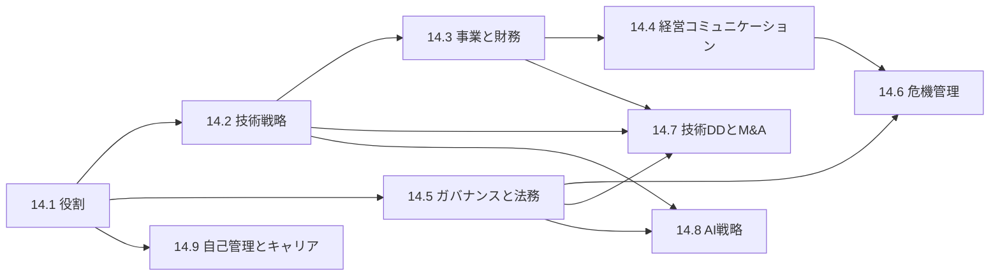

# 第14部 CTOの仕事

> 優れたエンジニアが CTO になって最初に戸惑うのは、「正しい技術判断」だけでは会社が動かないことです。予算、取締役会、契約、法令、危機、そして自分自身の持続可能性。この部では、技術を事業の成果につなげる経営者として、戦略・組織・財務・ガバナンス・危機管理の各領域で CTO の責務を自信をもって果たせるようになることを目指します。

## この部で身につくこと

- **役割を設計する**: 会社のステージと事業に合わせて CTO の責務を定義し、隣接する役職（VPoE・CIO・CISO・CPO）との境界を合意し、着任後の 90 日を計画できる。
- **戦略を立てる**: 事業の課題の診断から技術戦略を導き、Build／Buy／Partner やレガシー刷新を、現在価値と感度分析で判断できる。
- **お金で語る**: 財務三表・SaaS の指標・ソフトウェアの資産計上・人員計画とランウェイ・NPV を使い、技術投資を事業の言葉で提案できる。
- **経営と対話する**: CEO・経営陣・取締役会・投資家に、結論から、選択肢とトレードオフと推奨を添えて伝え、悪い知らせを早く正直に届けられる。
- **統制を効かせる**: リスクマネジメント、セキュリティの認証、個人情報保護法と GDPR、OSS ライセンス、開発契約、IT 全般統制を理解し、技術の仕組みで統制を実装できる。
- **危機に備え、率いる**: 重大障害・ランサムウェア・情報漏えいに備えた計画と訓練を整え、最初の数時間の判断と対外コミュニケーションを指揮できる。
- **見極め、統合する**: 技術デューデリジェンスで価値とリスクを評価し、買収後の統合を計画できる。
- **AI を経営する**: AI の機会とリスクを見極め、投資・組織・ガバナンス・規制対応の方針を立てられる。
- **自分を持続させる**: 時間・エネルギー・学び・キャリアを設計し、後継者を育て、倫理的な判断を貫ける。

## 章の一覧

| 章 | タイトル | 学習時間 | 主な演習 | キーワード |
|---|---|---|---|---|
| 14.1 | [CTOの役割 — ステージ別の責務](01-role-of-cto/README.md) | 本文 3h ＋ 演習 3h | 記述: ステージ自己診断、着任 90 日計画、カレンダー監査 | CTO の類型, VPoE・CIO・CISO, ステージ別の責務, 共同創業者, 最初の 90 日 |
| 14.2 | [技術戦略の立て方](02-technology-strategy/README.md) | 本文 4h ＋ 演習 5h | `tco.py`（TCO の現在価値比較とトルネード型の感度分析）、記述: Wardley マップ、2 ページの技術戦略 | 戦略のカーネル, Wardley マップ, Build/Buy/Partner, 3 つのホライズン, 技術レーダー, 7R |
| 14.3 | [事業と財務のリテラシー](03-business-and-finance/README.md) | 本文 5h ＋ 演習 5h | `npv.py`・`saas_metrics.py`・`budget_model.py`、記述: 技術投資の 1 ページ提案書 | 財務三表, 粗利率, ソフトウェアの資産計上, NRR/GRR, CAC/LTV, フルロードコスト, ランウェイ, NPV/IRR |
| 14.4 | [経営陣・取締役会・投資家とのコミュニケーション](04-executive-communication/README.md) | 本文 3h ＋ 演習 4h | `kpi_report.py`（信号表示の KPI サマリー）、記述: 取締役会報告、障害の経営向け要約、ピラミッド構造のメモ、投資家の想定問答 | CEO との関係, 取締役会報告, 信号表示, ピラミッド原則, SCQA, 悪い知らせ |
| 14.5 | [ガバナンス・リスク・コンプライアンスと法務](05-governance-risk-compliance/README.md) | 本文 6h ＋ 演習 6h | `license_policy.py`（SPDX 式の構文解析とポリシー判定）・`breach_notice.py`（漏えい報告の整理。教育用）、記述: IT 全般統制のコントロールマトリクス、契約書のレビュー | リスク登録簿, ISMS/SOC 2, 個人情報保護法, GDPR, OSS ライセンス, SBOM, 偽装請負, J-SOX |
| 14.6 | [危機管理 — 重大障害とセキュリティ事故](06-crisis-management/README.md) | 本文 4h ＋ 演習 5h | `sla_credit.py`（障害時間の集計・稼働率・SLA クレジットの計算）、記述: ランサムウェアの机上演習の台本、危機コミュニケーションの文面 | 危機管理計画, 危機対応チーム, 机上演習, ランサムウェア, 情報漏えい, ホールディング・ステートメント |
| 14.7 | [技術デューデリジェンスとM&A](07-due-diligence-and-ma/README.md) | 本文 4h ＋ 演習 6h | `dd_scorecard.py`（DD のスコアカードと是正の優先順位）、記述: 質問票の絞り込み、OSS プロジェクトの模擬 DD | 技術 DD, データルーム, レッドフラグ, 表明保証, PMI, 100 日計画 |
| 14.8 | [AI戦略とAIガバナンス](08-ai-strategy/README.md) | 本文 4h ＋ 演習 6h | `ai_usecase_tier.py`（ユースケースのリスク区分）・`ai_roi.py`（ROI・損益分岐点・感度分析）、記述: AI 活用の機会のポートフォリオ、AI 利用規程の草案 | 機会のマッピング, 堀（moat）, AI ゲートウェイ, AI 台帳, EU AI 法, ROI |
| 14.9 | [CTOの自己管理とキャリア](09-sustaining-yourself/README.md) | 本文 3h ＋ 演習 6h | 記述: 自分の取扱説明書、年間の学習計画、カレンダー監査、支援のネットワーク、後継者計画 | 支援のネットワーク, 委任, 意思決定の疲労, 燃え尽き, 後継者計画, 倫理 |

合計の目安は、本文 約 36 時間、演習 約 46 時間です。コード演習は `python3 tools/check.py 14` でまとめてテストできます（章を指定するなら `python3 tools/check.py 14.3` のように）。

## 学習の進め方

### 章の順序と依存関係

- **まず 14.1 で地図を手に入れる**: 以降の章は、14.1 で示す CTO の責務の各領域を深掘りしたものです。自分の会社のステージを意識しながら読み進めてください。
- **14.2 → 14.3 → 14.4 は一続きで読む**: 「何をすべきかを決める（戦略）→ 数字で裏づける（財務）→ 経営を動かす（コミュニケーション）」という流れになっています。14.2 の TCO と 14.3 の NPV は同じ考え方（現在価値）を使います。
- **14.5 は 14.6 と 14.7 の土台**: 漏えい時の報告義務、知的財産の帰属、OSS ライセンスは、危機対応と DD の両方で前提になります。
- **14.8 は第 12 部と合わせて**: AI の技術的な基礎は [第12部 データとAI](../12-data-and-ai/README.md) で扱います。
- **14.9 はいつ読んでもよい**: ただし一度で終わりにせず、四半期ごとに演習（カレンダー監査、学習計画）を繰り返すと効果があります。

### この部の学び方

- **記述演習こそが本体**: この部の多くの演習は、正解が 1 つではない記述演習です。できれば自分の会社（または志望する会社）を題材にし、解答例と比べたあと、信頼できる先輩やメンターに読んでもらってください。書いたものは、そのまま実務の文書（役割定義書、技術戦略、取締役会資料、統制の一覧）の下書きになります。
- **コード演習は実務の道具になる**: TCO と感度分析、SaaS の指標、人員計画とランウェイ、KPI の信号表示、ライセンスのポリシー判定などは、自分の会社のデータを入れれば実務でそのまま使える形にしてあります。解答例を読んで終わりにせず、自分の数字で動かしてみてください。
- **数字や条文を暗記しない**: 法令・規格・会計基準は改正されます。覚えるべきは「どんな論点があり、どこを確認し、誰に相談すべきか」という構造です。本文の「2026 年時点」の記述は、実務で使う前に必ず一次資料で確認してください。

### つまずきやすい点

- **財務の用語に慣れていない**: 14.3 の 1 節（財務三表）を先に読み、自社の決算書や予算を実際に見ながら進めると理解が早まります。
- **法務の章の情報量**: 14.5 は、すべてを一度に理解しようとせず、自社に関係の深い節（BtoC なら個人情報、受託開発が多いなら契約、上場準備中なら内部統制）から読んで構いません。
- **立場による重点の違い**: スタートアップの CTO は 14.1〜14.4 と 14.9、上場準備中の会社は 14.5〜14.6、大企業で DX を率いる人は 14.1 の 3.7 節・14.2 のレガシー刷新・14.5 の契約の節を特に重点的に読んでください。

## 到達度チェック

この部を修了したと言えるのは、次のことができるときです。

- [ ] 自社のステージにおける CTO の責務を定義した 1 ページの役割定義書を書き、CEO と合意できる
- [ ] Rumelt のカーネルに沿った 2 ページの技術戦略を書き、Build／Buy／Partner の判断を TCO の現在価値と感度分析で説明できる
- [ ] 自社の P/L で技術の費用がどこに現れるかを示し、粗利率・NRR・CAC 回収期間・ランウェイを計算して解釈できる
- [ ] 技術投資を、売上・コスト・リスク・スピードの言葉で、前提と幅を示した 1 ページの提案書にできる
- [ ] 取締役会向けの四半期技術報告を、事前に決めた基準の信号表示と、主要なリスクと依頼事項を含めて作れる
- [ ] 漏えい等が起きたときに、個人情報保護法と GDPR の報告・通知の要否と期限の考え方を説明し、専門家に正しい問いを投げられる
- [ ] 提供形態に応じた OSS ライセンスのポリシーと SBOM の運用を設計できる
- [ ] 業務委託契約書の主要なリスク（偽装請負、著作権の帰属、再委託、個人情報）を指摘できる
- [ ] IT 全般統制を満たしつつ DevOps の速度を保つ統制と証跡を設計できる
- [ ] 危機管理計画と机上演習を設計し、重大事故の最初の数時間の動き方を説明できる
- [ ] 技術 DD の質問票とスコアカードで、対象会社の技術的な価値とリスクを評価できる
- [ ] AI の活用の機会を価値と実現性で整理し、AI 利用規程とガバナンスの仕組みの草案を作れる
- [ ] 自分の時間の使い方を監査して改善し、後継者計画と年間の学習計画を持っている

## この部の推薦図書・教材

- Camille Fournier『エンジニアのためのマネジメントキャリアパス』（オライリー・ジャパン）— テックリードから CTO・VP of Engineering まで、技術組織のリーダーの役割の違いを段階ごとに解説した定番書。
- Will Larson "The Engineering Executive's Primer"（O'Reilly, 2024）— 技術組織のトップが直面する着任・計画・取締役会・採用・組織運営を網羅した実務書。同じ著者の『エレガントパズル』（日経BP）も合わせて。
- Richard P. Rumelt『良い戦略、悪い戦略』（日本経済新聞出版）— 戦略のカーネルと悪い戦略の兆候。技術戦略を書く前の必読書。
- Barbara Minto『考える技術・書く技術』（ダイヤモンド社）— 経営陣・取締役会・投資家向けの文章の基本となるピラミッド原則。
- 朝倉祐介『ファイナンス思考』（ダイヤモンド社）と、國貞克則『決算書がスラスラわかる 財務3表一体理解法』（朝日新書）— 技術者が経営の数字に慣れるための 2 冊。
- Andrew S. Grove『HIGH OUTPUT MANAGEMENT』（日経BP）— マネージャーの成果は組織の成果であるという考え方と、委任・会議・意思決定の技術。CTO の時間の使い方の基礎。
- 経済産業省・IPA「サイバーセキュリティ経営ガイドライン Ver 3.0」と、個人情報保護委員会の「個人情報の保護に関する法律についてのガイドライン（通則編）」— 経営としてのセキュリティとプライバシーの一次資料。
- 一般社団法人日本CTO協会「DX Criteria」— 自社の技術組織とデジタル経営の状況を多面的に自己診断できる。

## 次に進む

- [第15部 総仕上げ](../15-capstone/README.md) の [15.3 CTOシミュレーション — 戦略・組織・予算](../15-capstone/03-leadership-capstone/README.md) で、この部で学んだ戦略・財務・組織・リスクの判断を、1 つの架空の会社の中で統合して実践します。[15.4 CTOケーススタディ集](../15-capstone/04-case-studies/README.md) では、CTO が実際に直面する状況を題材に判断の練習を重ねます。
- 技術の判断力を保つために、第 1〜12 部の「CTOの視点」の節を読み返すことを勧めます。役職が上がるほど、原理の理解が判断の質を支えます（[14.9](09-sustaining-yourself/README.md) の「このカリキュラムを螺旋のように使う」も参照）。
- 法令・規格・会計に関する記述は 2026 年時点のものです。実務で使う前に、必ず一次資料を確認し、具体的な判断は専門家に相談してください。
