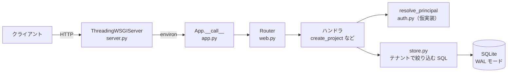
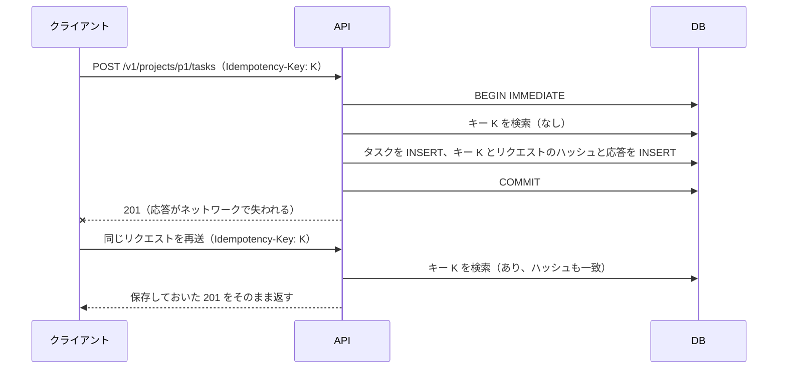
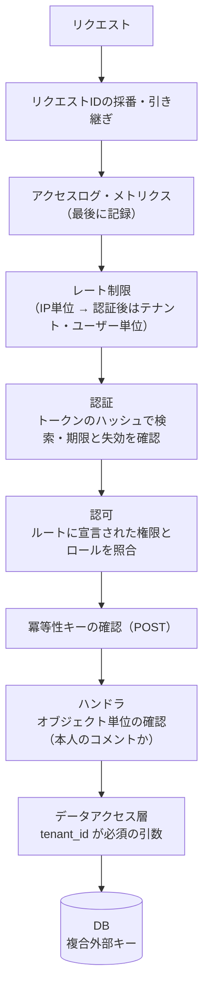

# 15.1 実装プロジェクト — 本番品質のミニサービス

> 「動くコード」と「本番で運用できるサービス」の間には、認証・テナント分離・観測・障害への備え・自動化・運用手順という長い距離があります。この章では、チーム向けタスク管理 API を題材に、その距離を自分の手で埋めます。第1〜12部で学んだ原理を 1 つのサービスに統合し、「本番品質とは何か」をコード・テスト・文書で示せるようになることが目標です。

| 項目 | 内容 |
|---|---|
| 学習時間の目安 | 本文 2h ＋ 演習 60h |
| 形式 | 個人プロジェクト（7 つのマイルストーン）。言語・フレームワークは自由 |
| 前提となる章 | Stage II（第6〜12部）が目安。詳しくは下の「前提となる章」 |
| スターター | [starter/](starter/)（Python 3.10 以上の標準ライブラリのみ。使うかどうかは任意） |
| キーワード | マルチテナント, ADR, 脅威モデル, 構造化ログ, SLO, 冪等性キー, レート制限, グレースフルシャットダウン, CI, 負荷試験, キャパシティ計画, Runbook, 障害注入, ポストモーテム |

## 目的

このプロジェクトを終えたとき、次のことができる状態を目指します。

- [ ] 要件を測定可能な形に落とし込み、設計ドキュメントと ADR（アーキテクチャ決定記録）で判断の理由を残せる
- [ ] マルチテナントの Web API を、テナント間のデータ漏えいが起きない構造で実装し、それをテストで示せる
- [ ] 脅威モデルを書き、認証・認可・入力検証の対策を「どの脅威に対するものか」と結びつけて説明できる
- [ ] ログ・メトリクス・SLO を設計し、障害時に「何が・どれくらい・誰に」起きているかを数分で答えられる
- [ ] タイムアウト・冪等性・レート制限・グレースフルシャットダウンで、失敗が連鎖しないサービスにできる
- [ ] CI・負荷試験・キャパシティ見積もり・Runbook・ポストモーテムまで含めて、他人に運用を引き継げる

機能の数は評価しません。タスク管理 API という題材はありふれていて、機能そのものは数日で書けます。このプロジェクトの本体は、その周りにある **非機能要件と運用の仕組み** です。

CTO を目指す人にとっての意味もあります。このプロジェクトの受け入れ基準とルーブリックは、そのまま「チームのサービスを本番に出してよいか」を判断するプロダクションレディネス・レビュー（本番投入前の審査）のチェックリストとして使えます。自分で一度すべてを作った経験があると、レビューで「どこが手抜きになりやすいか」「どの質問をすれば実態が分かるか」が分かるようになります。

## 前提となる章

すべてを修了していなくても始められます。M1〜M2 は第6部と第8部を終えた段階で着手でき、残りは該当する部を学びながら進めてもかまいません。

| 領域 | 主に使う章 | 使うマイルストーン |
|---|---|---|
| データの表現 | [1.1 情報の表現](../../01-computer-systems/01-data-representation/README.md)（ID・日時・文字列の型設計） | M1, M2 |
| 並行処理 | [4.4 並行処理と同期](../../04-operating-systems/04-concurrency/README.md) | M5 |
| HTTP とネットワーク | [5.2 TCPとUDP](../../05-networking/02-tcp-and-udp/README.md)、[5.3 DNS・HTTP・TLS](../../05-networking/03-dns-http-tls/README.md)、[5.4 Webの仕組みとネットワーク構成](../../05-networking/04-web-architecture/README.md) | M2, M5, M6 |
| データベース | [6.1 リレーショナルモデルとSQL](../../06-databases/01-relational-model-and-sql/README.md)、[6.2 インデックスとクエリ処理](../../06-databases/02-indexes-and-query-processing/README.md)、[6.3 トランザクションと同時実行制御](../../06-databases/03-transactions/README.md)、[6.4 ストレージエンジンと障害回復](../../06-databases/04-storage-and-recovery/README.md) | M2, M5, M7 |
| 分散システム | [7.1 分散システムの本質](../../07-distributed-systems/01-fundamentals/README.md)、[7.5 メッセージングとイベント駆動](../../07-distributed-systems/05-messaging-and-events/README.md) | M5 |
| ソフトウェアエンジニアリング | [8.1 良いコードと設計原則](../../08-software-engineering/01-code-quality-and-design/README.md)、[8.2 テスト戦略](../../08-software-engineering/02-testing/README.md)、[8.4 CI/CDとリリースエンジニアリング](../../08-software-engineering/04-ci-cd-and-release/README.md)、[8.6 開発プロセスとドキュメンテーション](../../08-software-engineering/06-process-and-documentation/README.md) | M1, M2, M6 |
| アーキテクチャ | [9.1 ソフトウェアアーキテクチャの基礎](../../09-architecture/01-architecture-fundamentals/README.md)、[9.4 API設計](../../09-architecture/04-api-design/README.md)、[9.5 スケーラビリティとパフォーマンス](../../09-architecture/05-scalability-and-performance/README.md) | M1, M2, M6 |
| SRE | [10.3 信頼性設計とSLO](../../10-cloud-and-sre/03-reliability-engineering/README.md)、[10.4 オブザーバビリティ](../../10-cloud-and-sre/04-observability/README.md)、[10.5 インシデント対応とポストモーテム](../../10-cloud-and-sre/05-incident-management/README.md) | M4, M7 |
| セキュリティ | [11.1 セキュリティの基本原則と脅威モデリング](../../11-security/01-security-principles/README.md)、[11.2 暗号技術の基礎](../../11-security/02-cryptography/README.md)、[11.3 認証と認可](../../11-security/03-authn-authz/README.md)、[11.4 Webアプリケーションセキュリティ](../../11-security/04-web-security/README.md)、[11.5 セキュリティ運用とサプライチェーン](../../11-security/05-security-operations/README.md) | M3, M6 |
| 統計 | [2.2 確率・統計と定量的思考](../../02-math-and-algorithms/02-probability-statistics/README.md)（パーセンタイル・分布） | M4, M6 |
| 意思決定 | [13.2 技術的意思決定と設計レビュー](../../13-technical-leadership/02-technical-decisions/README.md)（ADR・レビュー） | M1 |

## シナリオ

> 本章の企業・製品・数値はすべて架空です。

あなたは、中小企業向けの業務 SaaS を作る創業 2 年目のスタートアップに、2 人目のバックエンドエンジニアとして入社しました。次の製品として「チーム向けタスク管理」を出すことが決まり、Web とモバイルのクライアントが使う **API を、あなたが 1 人で設計・実装・運用する** ことになりました。3 か月後に 30 社でパイロット運用を始め、1 年後に 300 社、3 年後に 3,000 社での利用を見込んでいます。

顧客企業（テナント）ごとにデータを完全に分ける必要があります。営業からは「他社のタスクが 1 件でも見えたら、その時点で事業が終わる」と念を押されています。

### 機能要件

| ID | 要件 |
|---|---|
| FR-1 | テナント: 顧客企業ごとにテナントを作る。作成は運用者だけが行う（CLI または管理用の手段で） |
| FR-2 | ユーザー: テナントの owner と admin が、ユーザーを招待・ロール変更・無効化できる。招待メールの送信は不要（招待用のトークンを返せばよい） |
| FR-3 | プロジェクト: 作成・一覧・取得・名前変更・アーカイブ |
| FR-4 | タスク: 作成・取得・一覧（状態・担当者・期限で絞り込み、ページ送り）・更新・削除。同時に編集されたときに、後から保存した人が先の変更を黙って上書きしない |
| FR-5 | コメント: タスクへのコメントの追加・一覧・削除 |
| FR-6 | 監査ログ: ユーザーの招待・ロール変更・無効化、プロジェクトのアーカイブ、タスクの削除を記録し、owner と admin が閲覧できる |
| FR-7（発展） | 通知: タスクに担当者が設定されたら、テナントが登録した Webhook の URL に通知する |

権限はロール（役割）で決めます。これが M3 で実装する認可の仕様です。

| 操作 | owner | admin | member | viewer |
|---|---|---|---|---|
| 閲覧（プロジェクト・タスク・コメント） | ○ | ○ | ○ | ○ |
| タスクの作成・更新、コメントの追加 | ○ | ○ | ○ | × |
| タスクの削除 | ○ | ○ | 自分が作成したものだけ | × |
| コメントの削除 | ○ | ○ | 自分のものだけ | × |
| プロジェクトの作成・名前変更・アーカイブ | ○ | ○ | × | × |
| ユーザーの招待・ロール変更・無効化 | ○ | ○（owner は対象外） | × | × |
| 監査ログの閲覧 | ○ | ○ | × | × |
| owner の譲渡 | ○ | × | × | × |

### 非機能要件

| ID | 要件 |
|---|---|
| NFR-1 可用性 | API の月間可用性 99.9%（成功した応答の割合で測る。定義は M4 で決める） |
| NFR-2 レイテンシ | ピーク負荷時に、サーバー側で計測した読み取りの p95 が 200 ms 未満、書き込みの p95 が 400 ms 未満 |
| NFR-3 規模 | 1 年後: 300 テナント・6,000 ユーザー・ピーク 50 req/s。3 年後: 3,000 テナント・60,000 ユーザー・ピーク 500 req/s。リクエストの約 80% は読み取り。1 ユーザーは 1 営業日に平均 2 件のタスクを作り、10 回更新し、3 件のコメントを書く |
| NFR-4 テナント分離 | 他テナントのデータを読み書きできる経路が 1 つもない。それを確かめる自動テストがある |
| NFR-5 セキュリティ | パスワードや資格情報を安全に保存する。OWASP ASVS（アプリケーションセキュリティ検証標準）のレベル 1 を目安にする |
| NFR-6 データ保全 | RPO（失ってよいデータの時間幅）1 日以内、RTO（復旧までの時間）1 時間以内。リストアの手順を実際に試してある |
| NFR-7 運用性 | 任意の 1 リクエストをログで追跡できる。主要な指標をメトリクスで見られる。アラートごとに対応手順がある |
| NFR-8 変更容易性 | main ブランチへの変更はすべて CI を通る。スキーマ変更はマイグレーションで行い、ロールバックの方針がある |
| NFR-9 個人情報 | メールアドレスなどの個人情報をログに出さない。ユーザーの削除・テナントの解約時にデータを消す手順がある |

### 制約とスコープ外

- 言語・フレームワーク・データベースは自由です。最初は 1 台・1 プロセス・SQLite で始めてよく、M6 で限界を評価してから移行を判断してもかまいません（その判断自体が評価の対象です）。
- クラウドへのデプロイは必須ではありません。ローカルやコンテナで再現できれば十分です。有料のサービスは使わなくても全マイルストーンを完了できます。
- スコープ外: 画面（UI）、課金、SSO（SAML などのシングルサインオン）、メール送信、全文検索。ただし「将来 SSO を入れるときに困らない設計か」は M1 の設計で触れてください。

## 成果物

リポジトリ 1 つにまとめます。GitHub などで公開すると、他人にレビューしてもらいやすく、ポートフォリオにもなります（公開する場合は、秘密情報をコミットしないよう特に注意してください）。

| 成果物 | 置き場所の例 | マイルストーン |
|---|---|---|
| ソースコードとテスト | `src/`, `tests/` | M2〜M5 |
| README（概要・起動方法・構成図・設計の要点） | `README.md` | M1 で作り、以後更新 |
| 要件定義と設計ドキュメント | `docs/design.md` | M1 |
| ADR（5 本以上） | `docs/adr/0001-*.md` | M1〜M6 |
| API 仕様（OpenAPI などの形式でも表でもよい） | `docs/api.md` | M2 |
| 脅威モデル | `docs/threat-model.md` | M3 |
| SLO の定義とアラートの方針 | `docs/slo.md` | M4 |
| CI の設定 | `.github/workflows/ci.yml` など | M6（最小限のものは M2 で） |
| 負荷試験レポートとキャパシティ計画 | `docs/capacity.md` | M6 |
| Runbook（運用手順書） | `docs/runbook.md` | M7 |
| 障害注入の記録とポストモーテム | `docs/postmortems/` | M7 |

## スターターコード

[starter/](starter/) に、Python 3.10 以上の標準ライブラリだけで書いた骨組みがあります。WSGI（Python の Web サーバーとアプリの間の標準インターフェース、PEP 3333）・SQLite・JSON だけを使い、ルーティング、エラー処理、マイグレーション、テナントで絞り込むデータアクセス、テストの土台を用意しています。

使うかどうかは自由です。別の言語で書く場合も、「きれいな骨組みとはどういうものか」の参考として一度読んでください。スターターを使う場合は、`starter/` の中身を自分のリポジトリの直下にコピーして始めます。

### 動かしてみる

```bash
cd 15-capstone/01-engineering-capstone
python3 -m unittest discover -s starter      # テスト（47 件）
cd starter
python3 -m taskapi migrate                   # スキーマを作る（DB は ./taskapi.db）
python3 -m taskapi create-tenant "Acme"      # 表示されたテナント ID を控えておく
python3 -m taskapi serve                     # http://127.0.0.1:8000（Ctrl-C で停止）
```

DB ファイル（`taskapi.db` と、WAL モードで作られる `taskapi.db-wal`・`taskapi.db-shm`）はコミットしないよう、`.gitignore` に加えておきます。置き場所は環境変数 `TASKAPI_DB_PATH` で変えられます。

別の端末で、控えたテナント ID を変数に入れてから呼び出した結果です（ID と時刻は実行ごとに変わります）。

```text
$ TENANT=ten_f48390e9ebc647259ce0b7bdef5fffdd
$ curl -i -X POST http://127.0.0.1:8000/v1/projects \
    -H "X-Tenant-Id: $TENANT" -H 'Content-Type: application/json' -d '{"name": "ウェブサイト刷新"}'
HTTP/1.0 201 Created
Date: Mon, 28 Sep 2026 23:44:36 GMT
Server: WSGIServer/0.2 CPython/3.11.15
Content-Type: application/json
Location: /v1/projects/prj_8d8807a6d55b4229b91433ac6f523d18
Content-Length: 119

{"id":"prj_8d8807a6d55b4229b91433ac6f523d18","name":"ウェブサイト刷新","created_at":"2026-09-28T23:44:36.452Z"}

$ curl -i http://127.0.0.1:8000/v1/projects
HTTP/1.0 401 Unauthorized
Date: Mon, 28 Sep 2026 23:44:36 GMT
Server: WSGIServer/0.2 CPython/3.11.15
Content-Type: application/problem+json
WWW-Authenticate: Bearer realm="taskapi"
Content-Length: 93

{"type":"about:blank","title":"Unauthorized","status":401,"detail":"authentication required"}
```

### 構成



```text
starter/
├── taskapi/
│   ├── __main__.py      # CLI: migrate / create-tenant / serve
│   ├── config.py        # 環境変数 → Config（TASKAPI_DB_PATH・TASKAPI_HOST・TASKAPI_PORT など）
│   ├── web.py           # Request / Response / HTTPError / Router（エラーは RFC 9457 形式）
│   ├── app.py           # ルートの定義・ハンドラ・入力検証
│   ├── auth.py          # 認証（※開発用の仮実装。M3 で置き換える）
│   ├── store.py         # データアクセス層（すべての関数がテナントIDを取る）
│   ├── db.py            # 接続・トランザクション・マイグレーション
│   ├── timeutil.py      # UTC・ISO 8601
│   ├── server.py        # wsgiref ＋ スレッドの HTTP サーバー
│   └── migrations/0001_initial.sql   # tenants / users / projects / tasks / comments
└── tests/               # 単体テスト・WSGI を直接呼ぶ結合テスト・実ソケットのスモークテスト・CLI のテスト
```

実装済みのエンドポイントは `GET /healthz`、`POST /v1/projects`、`GET /v1/projects`、`GET /v1/projects/{project_id}` の 4 つだけです。タスク・コメント・ユーザーのテーブルはスキーマにありますが、API は M2 であなたが作ります。

### スターターに込めた設計判断

スターターの判断は「正解」ではなく、たたき台です。M1 で自分の ADR として採用するか、変えるかを決めてください。

| 判断 | 理由 | 見直すきっかけ |
|---|---|---|
| 層を web / app / store に分ける | HTTP の関心事と SQL の関心事を混ぜない。ハンドラに SQL を書かない | 層をまたぐ変更が毎回必要になったら、分け方を見直す |
| テナントが所有するすべての表に `tenant_id` を持たせ、子は `(tenant_id, 親id)` の複合外部キーで参照する | WHERE 句の書き忘れがあっても、「別テナントの親を指す行」だけは DB が拒否する（`test_db.py` で確認） | テナントごとに DB を分ける要件（専用環境・データ所在地）が出たとき |
| 他テナントのリソースには 403 ではなく 404 を返す | 403 だと「その ID が存在する」ことが漏れる | 同じテナント内の権限不足は 403 でよい（M3 で区別する） |
| ID はプレフィックス付きのランダム値（`prj_` ＋ UUIDv4） | 連番と違い、件数や作成順を推測されない。ログで種類が一目で分かる | 時刻順に並ぶ ID が必要になったとき（インデックスの局所性） |
| 日時は UTC・ミリ秒精度の ISO 8601 文字列 | 桁数固定なので文字列順 ＝ 時刻順。タイムゾーンの混乱を防ぐ（1.1 章） | DB を変えるとき（PostgreSQL なら `timestamptz`） |
| リクエストごとに DB 接続を開き、書き込みは `BEGIN IMMEDIATE` | SQLite の接続をスレッド間で共有しない。後からの書き込みロックの昇格で起きる `SQLITE_BUSY` を避ける | 接続プールのある DB に移行したとき |
| エラーは RFC 9457（Problem Details）形式。構文の誤りは 400、値の誤りは 422 | クライアントが機械的に扱える一貫した形式 | API 設計ガイドラインを組織で決めたとき |
| 名前は NFC に正規化してから長さと一意性を検査する | 見た目が同じ「が」の 2 通りの表現を同一に扱う（1.1 章） | — |
| 時計を注入し、テストでは固定する。テストは `wsgiref.validate` で WSGI 仕様違反も検出する | テストを決定的にする。仕様違反を早く見つける | — |
| 未適用のマイグレーションがあると `serve` を拒否する | 古いスキーマのまま動き出す事故を防ぐ（fail fast） | デプロイの仕組みでマイグレーションを管理するようになったとき |
| ルート表を列挙して「認証なしで通る /v1 のルートがない」ことを確かめるテスト | ルートを追加するたびにテストを書き足さなくても、認証のかけ忘れを検出できる | M3 で「越境テスト」に一般化する |

### 意図的に残した穴

スターターには、マイルストーンで埋めるべき穴が `TODO(M番号)` の印つきで残してあります。`grep -rn "TODO(M" starter/` で一覧できます。

| 穴 | 埋めるマイルストーン |
|---|---|
| **`X-Tenant-Id` ヘッダをそのまま信用する仮の認証**。テナント ID を知っていれば誰でもなりすませる | M3 |
| タスク・コメント・ユーザーの API、カーソル方式のページ送り | M2 |
| リクエスト ID・構造化ログ・メトリクス・readiness | M4 |
| レート制限・冪等性キー・グレースフルシャットダウン（今は `daemon_threads = True` で、終了時に処理中のリクエストが打ち切られる） | M5 |
| 本番用ではない HTTP サーバー（wsgiref は HTTP/1.0 で接続を使い回さず、TLS もない） | M6 で限界を測り、必要なら置き換える |

仮の認証が残っている間は、このサービスをインターネットに公開してはいけません。

## マイルストーン


時間は目安です。各マイルストーンの **受け入れ基準** をすべて満たしたら次へ進みます。CI は M6 で完成させますが、テストを自動で回すだけの最小限のものは M2 の時点で作っておくことを強く勧めます。

### M1 要件定義・設計ドキュメント・ADR（目安 6h）

**ゴール**: 何を作り、何を作らないか、どんな品質を目指すかを、他人がレビューできる文書にする。

やること:

1. **要件の整理**: 上の FR・NFR を、ユースケースと受け入れ条件に分解します。数値の NFR には測定方法を添えます（「p95 < 200 ms」は、どこで・何を・どの期間で測るのか）。スコープ外も明記します。
2. **設計ドキュメント**: 背景、ゴールと非ゴール、API の設計（リソースとエンドポイントの一覧、エラー形式、ページ送り、バージョニング）、データモデル（ER 図）、テナント分離の方式、認証方式の候補、検討した代替案、未解決の問題を書きます。[15.2 の設計書テンプレート](../02-architecture-capstone/README.md) を小さくして使ってもかまいません。
3. **ADR**: 重要な決定を 3 本以上の ADR にします。候補は、テナント分離の方式、ID の方式、データベースの選定、認証方式、ページ送りの方式、エラー形式、言語とフレームワークです。

テナント分離の方式は、このプロジェクトで最も重い決定です。代表的な 3 つを比べておきます（詳しくは [9.2 アーキテクチャスタイル](../../09-architecture/02-architecture-styles/README.md) と [7.3 パーティショニング](../../07-distributed-systems/03-partitioning/README.md)）。

| 方式 | 分離の強さ | 運用コスト | テナント単位のバックアップ・削除 | 大口テナントの影響（ノイジーネイバー） |
|---|---|---|---|---|
| 共有スキーマ（全表に `tenant_id`） | 弱い（アプリの正しさに依存） | 低い（マイグレーションは 1 回） | 面倒（`tenant_id` で抽出） | 受けやすい |
| テナントごとのスキーマ | 中 | 中（テナント数だけマイグレーション） | 比較的容易 | 受けやすい |
| テナントごとの DB | 強い | 高い（接続・監視・マイグレーションが N 倍） | 容易 | 分離できる |

ADR は短くてかまいません。Michael Nygard が 2011 年のブログ記事 "Documenting Architecture Decisions" で提案した形式が広く使われています。

```markdown
# ADR-0002: （決定を一文で。例: テナント分離は共有スキーマ＋tenant_id で行う）

- 状態: 提案 / 承認 / 廃止 / ADR-00xx により置き換え
- 日付: 2026-10-01

## 状況（Context）
決定が必要になった背景・制約・前提。数値があれば書く。

## 決定（Decision）
何をするか。検討した選択肢と、選ばなかった理由も短く。

## 結果（Consequences）
良くなること・悪くなること・新たに必要になること。どうなったら見直すか。
```

受け入れ基準:

- [ ] すべての NFR が数値と測定方法で書かれている
- [ ] 設計ドキュメントに、代替案と却下の理由が 2 つ以上ある
- [ ] ADR が 3 本以上あり、それぞれに状況・決定・結果（トレードオフと見直しの条件）がある
- [ ] ER 図とエンドポイントの一覧がある
- [ ] 他の人（いなければ、数日置いた自分）がレビューし、指摘への対応が記録されている

参照: [8.6](../../08-software-engineering/06-process-and-documentation/README.md)、[9.1](../../09-architecture/01-architecture-fundamentals/README.md)、[9.3](../../09-architecture/03-domain-driven-design/README.md)、[9.4](../../09-architecture/04-api-design/README.md)、[13.2](../../13-technical-leadership/02-technical-decisions/README.md)

### M2 コア API とテスト（目安 12h）

**ゴール**: FR-2〜FR-5 の API を、仕様・実装・テストが一致した状態で作る。

やること:

1. **エンドポイントの実装**: プロジェクト・タスク・コメント・ユーザーの API を作ります（ユーザーの招待やロール変更の認可は M3 で仕上げます）。
2. **ページ送り**: 一覧はカーソル方式（前のページの最後の行を起点に次を読む）にします。オフセット方式（`OFFSET 10000`）が、深いページで遅くなる理由と、途中で行が追加・削除されると重複や欠落が起きる理由を説明できるようにしてください。
3. **更新の競合**: 同じタスクを 2 人が同時に編集したとき、後から保存した人が先の変更を黙って消す「ロストアップデート」を防ぎます。`version` 列を使った楽観的ロックが基本です（HTTP では `ETag` と `If-Match` で表し、不一致なら 412 を返すのが標準的です）。
4. **入力検証とエラー形式** をすべてのエンドポイントで統一します。
5. **テスト**: ドメインのルール（状態の遷移など）の単体テストと、HTTP から DB までを通す結合テストを書きます。時計・ID の生成・乱数は注入して、テストを決定的にします。
6. **マイグレーション**: スキーマの変更は新しいマイグレーションファイルで行います（スターターなら `0002_*.sql`）。適用済みのファイルは編集しません。

受け入れ基準:

- [ ] FR-2〜FR-5 のエンドポイントがすべてあり、API 仕様と一致している
- [ ] 一覧 API がカーソル方式に対応し、ページの境目で重複・欠落がないことをテストで確かめている
- [ ] 同じタスクへの競合する更新で、後の更新が 412（または 409）になることをテストで確かめている
- [ ] テストが 1 コマンドで実行でき、30 秒以内に終わり、何度実行しても同じ結果になる
- [ ] 主要な一覧クエリの実行計画（SQLite なら `EXPLAIN QUERY PLAN`）を確認し、インデックスが使われている

参照: [6.1](../../06-databases/01-relational-model-and-sql/README.md)、[6.2](../../06-databases/02-indexes-and-query-processing/README.md)、[6.3](../../06-databases/03-transactions/README.md)、[8.1](../../08-software-engineering/01-code-quality-and-design/README.md)、[8.2](../../08-software-engineering/02-testing/README.md)、[9.4](../../09-architecture/04-api-design/README.md)

### M3 認証・認可・テナント分離と脅威モデル（目安 10h）

**ゴール**: 仮の認証を取り除き、「誰が・どのテナントで・何をしてよいか」をすべてのリクエストで強制する。その対策が、どの脅威に対するものかを説明できるようにする。

やること:

1. **認証**: ログイン（メールアドレスとパスワード）でセッショントークンを発行する方式か、ユーザーごとの API トークン方式を選び、ADR に残します。トークンは十分に長いランダム値（例: 256 ビット）にし、DB にはトークンそのものではなくハッシュ値を保存します。有効期限と失効（ログアウト・ユーザーの無効化）を実装します。
2. **パスワードの保存**: 総当たりに強い、意図的に遅いハッシュ関数（Argon2id・scrypt・bcrypt・PBKDF2 など）とソルトを使います。推奨パラメータは年々変わるので、OWASP の Password Storage Cheat Sheet の最新版を確認してください。Python の標準ライブラリなら `hashlib.scrypt` や `hashlib.pbkdf2_hmac` が使えます。
3. **認可**: シナリオの権限表を、コードの 1 か所に宣言として書き、すべてのルートに適用します。ハンドラごとに `if` 文を書くと、必ずどこかで漏れます。ロールの確認に加えて、「このコメントは本人のものか」のようなオブジェクト単位の確認も必要です。オブジェクト単位の認可の欠陥（BOLA: Broken Object Level Authorization）は、OWASP API Security Top 10（2023 年版）で 1 位に挙げられています。
4. **テナント分離**: テナント ID は認証済みの主体からだけ導出します。データアクセス層はテナント ID を必須の引数に取ります。そのうえで、すべてのルートに対して「別テナントのリソース ID を指定すると 404 になる」ことを確かめるテストを、ルート表から自動で生成します（スターターの `test_every_v1_route_requires_authentication` を一般化します）。
5. **脅威モデル**: データフロー図（DFD）を描いて信頼境界（信頼度の異なる領域の境目）を示し、境界ごとに STRIDE（なりすまし・改ざん・否認・情報漏えい・サービス拒否・権限昇格）で脅威を洗い出します。各脅威に対策（実装済みか未実装か）と残存リスクを書きます。

受け入れ基準:

- [ ] `X-Tenant-Id` の仮実装が削除され、テナントは認証済みの資格情報からのみ導出される
- [ ] 権限表のすべての組み合わせ（ロール × 操作）をテストしている
- [ ] 全ルートについて、別テナントのリソースを指定すると 404 になることを自動で確かめている
- [ ] パスワードとトークンが、ログ・エラーレスポンス・DB（平文）のどこにも現れない
- [ ] 脅威モデルに 10 件以上の脅威があり、それぞれに対策の状態と残存リスクがある
- [ ] ログインの試行回数の制限について方針がある（実装は M5 のレート制限と合わせてよい）

参照: [11.1](../../11-security/01-security-principles/README.md)、[11.2](../../11-security/02-cryptography/README.md)、[11.3](../../11-security/03-authn-authz/README.md)、[11.4](../../11-security/04-web-security/README.md)

### M4 オブザーバビリティと SLO（目安 8h）

**ゴール**: 障害が起きたとき、「何が・どれくらい・誰に」起きているかを数分で答えられるようにする。信頼性の目標を、測れる形で約束する。

やること:

1. **構造化ログ**: 1 リクエストにつき 1 行の JSON（アクセスログ）を出します。少なくとも時刻・レベル・リクエスト ID・テナント ID・ユーザー ID・メソッド・ルート（`/v1/tasks/{task_id}` のようなテンプレート）・ステータス・所要時間を含めます。クライアントから `X-Request-Id` が来たら検証して引き継ぎ、なければ採番して、レスポンスヘッダとエラー本文にも入れます。
2. **メトリクス**: `/metrics` で Prometheus のテキスト形式（多くの監視基盤が読める事実上の標準形式）を返します。リクエスト数のカウンター、所要時間のヒストグラム、処理中のリクエスト数、DB のロック待ちの回数などです。ラベルにユーザー ID や生のパスを入れてはいけません。値の種類（カーディナリティ）が無制限に増え、監視基盤を壊します。
3. **ヘルスチェック**: `/healthz`（生存確認。プロセスが応答できるか）と `/readyz`（受け入れ準備。DB に接続でき、マイグレーションが適用済みか）を分けます。
4. **SLO**: SLI（何を測るか。分子・分母・除外条件）、目標値、期間、エラーバジェット（目標を下回ってよい量）、バーンレート（予算を消費する速さ）に基づくアラート、エラーバジェットを使い切ったときの方針を `docs/slo.md` に書きます。
5. **ダッシュボードの設計**: ルートごとの RED（Rate: 流量、Errors: エラー、Duration: 所要時間）と、CPU・メモリ・DB などの資源の USE（Utilization: 使用率、Saturation: 飽和、Errors）を、どのパネルでどう見るかを決めます（描画ツールの導入は任意です）。

受け入れ基準:

- [ ] 任意の 1 リクエストを、リクエスト ID でログから追跡できる。エラーのレスポンスにもリクエスト ID が含まれる
- [ ] ログに秘密情報・個人情報（パスワード・トークン・メールアドレス）が出ないことをテストで確かめている
- [ ] `/metrics` の出力が Prometheus のテキスト形式として正しく、ラベルの値の種類が有界である
- [ ] SLO の文書に、SLI の正確な定義（除外条件を含む）・目標値・エラーバジェットの計算・アラート条件がある
- [ ] `/readyz` が DB の到達性とマイグレーションの状態を反映する

参照: [10.3](../../10-cloud-and-sre/03-reliability-engineering/README.md)、[10.4](../../10-cloud-and-sre/04-observability/README.md)、[2.2](../../02-math-and-algorithms/02-probability-statistics/README.md)

### M5 レジリエンス（目安 10h）

**ゴール**: ネットワークの再送、過剰なリクエスト、遅い依存先、プロセスの停止といった「必ず起きること」が起きても、データが壊れず、障害が連鎖しないようにする。

やること:

1. **タイムアウト**: すべての外部呼び出し（DB・HTTP）にタイムアウトを設定し、値と根拠を一覧にします。リクエスト全体にも期限を設けます。
2. **冪等性キー**: 作成系の POST に `Idempotency-Key` ヘッダを受け付けます。クライアントがタイムアウトして同じリクエストを再送しても、タスクが 2 つ作られないようにします。同じキーで内容が違うリクエストはエラーにし、処理中のキーへの同時リクエストも正しく扱います。この方式は決済 API などで広く使われており、IETF でもヘッダの標準化が議論されてきました（2026 年時点の状況は一次情報で確認してください）。
3. **レート制限**: テナント単位・ユーザー単位にトークンバケットで制限し、超えたら `429 Too Many Requests` と `Retry-After` ヘッダを返します。ログインは IP アドレスとアカウントの単位で、より厳しく制限します。
4. **グレースフルシャットダウン**: SIGTERM を受けたら、readiness を 503 にし、少し待ってから新規の受け付けを止め、処理中のリクエストを期限付きで待ってから終了します。
5. **過負荷からの保護**（任意）: 同時に処理するリクエスト数に上限を設け、超えたら待たせずに 503 を返します（ロードシェディング）。
6. **発展（FR-7）**: Webhook 通知を、トランザクショナル・アウトボックス（業務データと同じトランザクションで「送るべき通知」を表に書き、別のワーカーが送る方式）で実装します。失敗したら指数バックオフとジッター（ランダムな揺らぎ）で再送し、一定回数で諦めて記録します。

受け入れ基準:

- [ ] 同じ `Idempotency-Key` のリクエストを 2 回（順番にでも同時にでも）送っても、タスクは 1 つしか作られない（テストあり）
- [ ] レート制限を、注入した時計でテストしている。429 に `Retry-After` が付く
- [ ] 処理中のリクエストがあるときに SIGTERM を送っても、そのリクエストは最後まで応答され、新しい接続は受け付けないことを確かめている
- [ ] すべての外部呼び出しのタイムアウト値が一覧になっており、根拠がある
- [ ] （発展）Webhook の送信先が 30 秒応答しなくても、API のレイテンシが悪化しない

参照: [4.4](../../04-operating-systems/04-concurrency/README.md)、[5.2](../../05-networking/02-tcp-and-udp/README.md)、[7.1](../../07-distributed-systems/01-fundamentals/README.md)、[7.5](../../07-distributed-systems/05-messaging-and-events/README.md)、[9.5](../../09-architecture/05-scalability-and-performance/README.md)、[10.3](../../10-cloud-and-sre/03-reliability-engineering/README.md)

### M6 CI・負荷試験・キャパシティ見積もり（目安 8h）

**ゴール**: 変更を安全に取り込む仕組みを作り、このサービスがどこまでの負荷に耐え、どこで壊れ、3 年後に何が必要になるかを、数字と証拠で示す。

やること:

1. **CI**: push とプルリクエストのたびに、静的解析・型チェック（言語による）・テスト・依存関係の脆弱性チェック・スモークテスト（実際にサーバーを起動して呼び出す）を実行します。main ブランチを保護し、CI の成功をマージの条件にします。例は「ヒント」にあります。
2. **負荷試験**: ワークロードのモデル（読み書きの比率、テナントごとの偏り、データ量）を決め、負荷を段階的に上げて飽和点を探します。p50・p95・p99、スループット、エラー率、CPU などの使用率を記録します。
3. **ボトルネックの分析**: プロファイラ（Python なら `cProfile`）、DB のロック待ち、カーネルの統計などで、推測ではなく証拠でボトルネックを特定します。
4. **キャパシティの見積もり**: NFR-3 の 1 年後・3 年後の負荷に対して、必要な台数・DB の構成・ストレージの増え方を、計算式と前提を示して見積もります。SQLite の限界（書き込みは同時に 1 つ、1 台のマシンのファイル）を評価し、別の DB に移行すべき条件を ADR にします。

受け入れ基準:

- [ ] プルリクエストごとに CI が走り、失敗したらマージできない。CI は 10 分以内に終わる
- [ ] CI に、実際にサーバーを起動して呼び出すスモークテストが含まれる
- [ ] 負荷試験のレポートに、方法（ツール・負荷のモデル・環境）、結果の表、飽和点、ボトルネックとその証拠がある
- [ ] キャパシティ計画に計算式と前提があり、3 年後の負荷に対する構成案と、DB を移行すべき条件がある

参照: [8.4](../../08-software-engineering/04-ci-cd-and-release/README.md)、[11.5](../../11-security/05-security-operations/README.md)、[9.5](../../09-architecture/05-scalability-and-performance/README.md)、[6.4](../../06-databases/04-storage-and-recovery/README.md)、[10.6](../../10-cloud-and-sre/06-finops/README.md)

### M7 運用 — Runbook・障害注入・ポストモーテム（目安 6h）

**ゴール**: 自分がいなくても運用できる状態にする。障害を意図的に起こして、仕組みの弱点を本番の前に見つける。

やること:

1. **Runbook**: サービスの概要と依存関係、ログとダッシュボードの場所、アラートごとの対応手順（症状 → 確認すること → 対処 → エスカレーション）、定常作業（デプロイ、ロールバック、マイグレーション、バックアップとリストア、秘密情報のローテーション、テナントの削除）を書きます。
2. **リストアの訓練**: バックアップから実際に復元し、RTO と RPO を実測します。バックアップは、復元できることを確かめるまでバックアップではありません。
3. **障害注入**: 「仮説 → 注入 → 観測 → 学び」の形で、少なくとも 3 つの実験をします。例: 長時間の書き込みトランザクションによる DB のロック、ディスクフル、Webhook の送信先の遅延、負荷中の `kill -9`、同時接続の急増。
4. **ポストモーテム**: 障害注入で見つかった最も学びの多い問題（または開発中に実際に起きた問題）について、非難しない（blameless）形式でポストモーテムを書きます。

受け入れ基準:

- [ ] Runbook のすべてのアラートに対応手順がある
- [ ] 他の人が Runbook だけを見てリストアを実行できた（または自分で手順どおりに実行し、所要時間を記録した）
- [ ] 障害注入を 3 件以上実施し、仮説と結果の違いが記録されている
- [ ] ポストモーテムに、タイムライン・影響（エラーバジェットの消費量）・要因・担当者と期限つきのアクションアイテムがある

参照: [10.5](../../10-cloud-and-sre/05-incident-management/README.md)、[10.3](../../10-cloud-and-sre/03-reliability-engineering/README.md)、[6.4](../../06-databases/04-storage-and-recovery/README.md)、[14.6 危機管理](../../14-cto/06-crisis-management/README.md)

## 評価基準（ルーブリック）

各観点を 3 段階で評価します。**合格ラインは、すべての観点で 2 以上** です。3 が半分以上あれば、ポートフォリオとして「本番を任せられる」ことを示せる水準です。自己評価に加えて、できれば他の人に評価してもらってください。

| M | 観点 | 1 要改善 | 2 合格 | 3 優秀 |
|---|---|---|---|---|
| M1 | 要件 | NFR が「速い」「安全」のような測れない言葉 | すべての NFR に数値と測定方法がある | 数値の根拠（利用者数からの見積もり）と、要件どうしの衝突（例: 可用性とコスト）まで書いている |
| M1 | 設計と ADR | 決定だけが書かれ、代替案やトレードオフがない | 主要な決定 3 件以上に代替案・結果・見直しの条件がある | 取り返しのつかない決定（一方通行のドア）を見分け、そこに検討の時間をかけている |
| M2 | API とデータ | エラー形式やページ送りがエンドポイントごとにばらばら | 一貫したエラー形式、カーソル方式、楽観的ロック | 仕様と実装の一致を自動で検査し、後方互換性のルールがある |
| M2 | テスト | 手動・順序依存・ときどき失敗する | 単体と結合があり、決定的で、1 コマンド 30 秒以内 | 境界値・競合・異常系を網羅し、失敗メッセージから原因が分かる |
| M3 | 認証・認可・分離 | 認可がハンドラに散在し、漏れてもテストで気づけない | 権限表を 1 か所で宣言し、全組み合わせと全ルートの越境をテスト | 新しいルートを追加すると、認可の宣言がなければテストが失敗する |
| M3 | 脅威モデル | 一般的な脆弱性の列挙で、このシステムの構成と結びついていない | DFD と信頼境界に基づき、STRIDE で 10 件以上、対策と残存リスクつき | 優先順位づけと、受容したリスクの理由・見直しの時期がある |
| M4 | ログとメトリクス | 非構造のログ。ID がメトリクスのラベルに入っている | リクエスト ID で追跡でき、RED の指標が取れ、秘密情報がログに出ない | W3C Trace Context（`traceparent` ヘッダ）への対応など、分散トレースへの拡張を考えている |
| M4 | SLO | 「99.9%」だけで SLI の定義がない | SLI の分子・分母・除外条件、エラーバジェット、バーンレートのアラートがある | エラーバジェットを使い切ったときの方針（機能開発を止める条件など）まで合意の形で書いている |
| M5 | 冪等性・レート制限 | 再送で重複が作られる | 順番の再送・同時の再送で重複しないことをテストし、429 に Retry-After | 同時の同一キーを DB の制約で保証し、キーの保存期間と容量も見積もっている |
| M5 | タイムアウトと停止 | タイムアウトのない呼び出しがある。SIGTERM で処理中のリクエストが失われる | すべてにタイムアウトがあり、グレースフルシャットダウンを検証した | 過負荷時の振る舞い（ロードシェディング・優先度）まで設計し、実験で確かめた |
| M6 | CI | CI がない、または失敗してもマージできる | テスト・静的解析・スモークテストが PR ごとに 10 分以内に走り、必須になっている | 依存関係と秘密情報のスキャン、アクションのバージョン固定、キャッシュでの高速化 |
| M6 | 負荷試験とキャパシティ | 「○○ req/s 出た」だけで、条件も分布もない | 方法・p50/p95/p99・飽和点・ボトルネックの証拠・計算式つきの見積もり | 負荷生成器側の限界や測定の偏りを検証し、移行の判断基準を ADR にしている |
| M7 | Runbook と障害注入 | 手順が「ログを見て対応する」程度 | アラートごとの手順、リストアの実測、3 件以上の実験 | 他人が Runbook だけでリストアに成功し、実験から改善が生まれている |
| M7 | ポストモーテム | 個人の責任で終わる。アクションが「気をつける」 | 非難しない形式で、タイムライン・影響・要因・担当と期限つきのアクション | 技術・プロセス・組織の複数の層で要因を分析し、類似の障害の予防まで導いている |
| 全体 | 文書 | 書いた本人にしか分からない | 初めて見た人が README から 15 分で起動できる | 設計の「なぜ」を文書だけから再構築できる |

## ヒント

### 進め方

- **最初に「歩くスケルトン」を作る**: 1 つのエンドポイントが、テスト・CI・起動手順まで端から端まで通る状態を最初に作ります。スターターはその状態から始まっています。
- **縦に切って進める**: 「全部のテーブルを作ってから、全部の API を作る」のではなく、「タスクの作成を、スキーマ・API・テスト・ドキュメントまで仕上げる」単位で進めます。
- **作業ログをつける**: 日付・やったこと・詰まったこと・判断したことを 1 日数行ずつ書きます。ADR とポストモーテムの材料になり、見積もりと実績の差（計画錯誤）の振り返りにも使えます。
- **時間を区切る**: 1 つのマイルストーンが目安の 2 倍を超えたら、スコープを削るか、受け入れ基準を満たす最小の形にして次へ進みます。後で戻ってこられます。

### テストを決定的にする

時刻・ID・乱数を関数の外から注入できるようにすると、テストが決定的になります。スターターの `FakeClock` が例です。`time.sleep` で「待てば終わるはず」と書いたテストは、遅いマシンや CI で必ず不安定になります。スレッドを使うテストは、`threading.Event` などで順序を明示し、すべての待ちにタイムアウトを付けます。

### SQLite で始める場合の注意

- 書き込みは同時に 1 つだけです。書き込みのトランザクションは短く保ち、`BEGIN IMMEDIATE` で始めます。
- `ALTER TABLE` でできることは限られています（列の追加・名前変更・削除など）。制約の変更は、SQLite の公式ドキュメントにある手順（新しい表を作ってデータを移し、入れ替える）が必要です。M2 で `status` の値を増やしたくなったときに出会います。
- 実行計画は `EXPLAIN QUERY PLAN` で確認します。スターターのスキーマで、状態で絞り込むタスク一覧を調べると次のようになります（SQLite 3.45）。

```text
EXPLAIN QUERY PLAN SELECT id FROM tasks WHERE tenant_id = ? AND status = ? ORDER BY created_at
SEARCH tasks USING INDEX sqlite_autoindex_tasks_2 (tenant_id=?)
USE TEMP B-TREE FOR ORDER BY
```

`USE TEMP B-TREE FOR ORDER BY` は、並べ替えにインデックスが使えず、結果を一時的な木構造に入れて並べ直していることを示します。テナントの全タスクを読んでから絞り込んで並べ替えるので、データが増えると遅くなります。絞り込みの条件と並び順に合ったインデックスを追加するのが対策です（[6.2](../../06-databases/02-indexes-and-query-processing/README.md)）。

### カーソル方式のページ送り

前のページの最後の行の `(created_at, id)` をカーソルとして返し、次のページはそれより後ろから読みます。`id` を加えるのは、同じ時刻の行があっても順序を一意にするためです。

```sql
SELECT id, title, status, created_at FROM tasks
 WHERE tenant_id = ? AND project_id = ?
   AND (created_at, id) > (?, ?)          -- 行値の比較（SQLite 3.15 以降）
 ORDER BY created_at, id
 LIMIT ?                                   -- 要求された件数＋1 件を読み、次のページがあるかを判定する
```

スターターのインデックス `tasks_by_project (tenant_id, project_id, created_at, id)` があれば、実行計画は `SEARCH tasks USING INDEX tasks_by_project (tenant_id=? AND project_id=? AND (created_at,id)>(?,?))` となり、何ページ目でも同じ速さで読めます。カーソルはクライアントから見て不透明な文字列（例: JSON を base64url でエンコードしたもの）にし、受け取ったら形式を検証します。カーソルの中身を信用してテナントの絞り込みを省いてはいけません。

### 楽観的ロック

```sql
UPDATE tasks SET title = ?, status = ?, version = version + 1, updated_at = ?
 WHERE tenant_id = ? AND id = ? AND version = ?   -- If-Match で送られてきた version
```

更新された行が 0 件なら、「タスクが存在しない（404）」のか「他の人が先に更新した（412）」のかを区別して返します。`If-Match` なしの更新を拒否するなら、`428 Precondition Required` が使えます。

### 冪等性キーの流れ



SQLite のように書き込みが直列化される DB なら、キーの記録と業務データの書き込みを **同じトランザクション** に入れるだけで、同時の再送も含めて重複を防げます。外部の決済 API を呼ぶなど、1 つのトランザクションに収まらない処理では、「処理中」の状態を先に記録し、処理中のキーへのリクエストには 409 を返す設計が必要になります。キーの主キーは `(tenant_id, key)` にし、保存期間（例: 24 時間）を決めて古いものを消します。

### レート制限（トークンバケット）

「平均 `rate` 回/秒、瞬間的には `burst` 回まで」を許す方式です。時計を注入できるようにしておくと、テストで時間を自由に進められます。

```python
import math
import threading
import time
from typing import Callable


class TokenBucket:
    """平均 rate 回/秒、最大 burst 回まで連続で許すトークンバケット。"""

    def __init__(self, rate: float, burst: float, clock: Callable[[], float] = time.monotonic) -> None:
        self.rate, self.burst, self.clock = rate, burst, clock
        self.tokens, self.updated = burst, clock()
        self.lock = threading.Lock()

    def try_acquire(self) -> tuple[bool, int]:
        """(許可するか, 拒否した場合の Retry-After 秒数) を返す。"""
        with self.lock:
            now = self.clock()
            self.tokens = min(self.burst, self.tokens + (now - self.updated) * self.rate)
            self.updated = now
            if self.tokens >= 1:
                self.tokens -= 1
                return True, 0
            return False, math.ceil((1 - self.tokens) / self.rate)


t = [0.0]
bucket = TokenBucket(rate=2, burst=3, clock=lambda: t[0])   # 平均 2 回/秒、瞬間的には 3 回まで
print([bucket.try_acquire() for _ in range(4)])
t[0] += 0.5                                                  # 0.5 秒で 1 トークン回復
print(bucket.try_acquire(), bucket.try_acquire())
```

```text
[(True, 0), (True, 0), (True, 0), (False, 1)]
(True, 0) (False, 1)
```

テナントごと・ユーザーごとにバケットを持つと、メモリ上の辞書が増え続けます。長く使われていないバケットを捨てる仕組みが必要です。また、この実装は 1 プロセスの中でしか効きません。複数台に増やしたときにどうするか（共有ストアに置く、台数で割る）は、M6 のキャパシティ計画で扱ってください。

### メトリクスの形式

Prometheus のテキスト形式では、ヒストグラムを「上限 `le` 以下だった回数の累積」で表します。自分で実装する場合も、この形を出力すれば一般的な監視基盤で読めます（下は形式の例で、値は架空です）。

```text
# HELP http_request_duration_seconds Time spent handling HTTP requests.
# TYPE http_request_duration_seconds histogram
http_request_duration_seconds_bucket{method="GET",route="/v1/projects",le="0.05"} 1102
http_request_duration_seconds_bucket{method="GET",route="/v1/projects",le="0.1"} 1190
http_request_duration_seconds_bucket{method="GET",route="/v1/projects",le="0.2"} 1236
http_request_duration_seconds_bucket{method="GET",route="/v1/projects",le="0.4"} 1247
http_request_duration_seconds_bucket{method="GET",route="/v1/projects",le="+Inf"} 1250
http_request_duration_seconds_sum{method="GET",route="/v1/projects"} 31.6
http_request_duration_seconds_count{method="GET",route="/v1/projects"} 1250
```

バケットの境界は、SLO のしきい値（NFR-2 の 0.2 秒と 0.4 秒）を必ず含むように選びます。上の例なら、200 ms 以内に応答した割合は 1236 ÷ 1250 ≈ 98.9% と計算できます。境界がしきい値とずれていると（例えば 0.1 の次が 0.25）、この割合を正確に計算できません。

### グレースフルシャットダウン

順序が重要です。Kubernetes などでは、SIGTERM の送信とロードバランサーの振り分け先の更新が並行して進むため、SIGTERM を受けた直後に受け付けを止めると、まだ振り分けられてくるリクエストが接続を拒否されます。

1. SIGTERM を受けたら `/readyz` を 503 にする
2. 振り分け先から外れるまで数秒待つ（その間も新しいリクエストを処理する）
3. 受け付けを止め、待ち受けソケットを閉じる
4. 処理中のリクエストを期限付きで待ち、終了する（期限は、Kubernetes の既定の猶予期間 30 秒より短く）

処理中のリクエストの数え方に落とし穴があります。**WSGI のアプリが return した時点では、レスポンスはまだ送られていません**。サーバーが戻り値を受け取ってから本文を書き込むからです。アプリの中で数えると、本文を送る前に「処理中 0 件」と判断して終了し、クライアントには本文のない応答が届きます（この章を準備するための実験でも、実際にこの現象が起きました）。リクエストを処理するスレッドの入口から出口までを数えます。

```python
import signal
import threading
import time

from wsgiref.simple_server import make_server

from taskapi.server import RequestHandler, ThreadingWSGIServer


class InFlight:
    """処理中のリクエスト数を数え、0 になるまで待てるようにする。"""

    def __init__(self) -> None:
        self._count = 0
        self._cond = threading.Condition()

    def __enter__(self) -> None:
        with self._cond:
            self._count += 1

    def __exit__(self, *exc: object) -> None:
        with self._cond:
            self._count -= 1
            self._cond.notify_all()

    def wait_idle(self, timeout: float) -> bool:
        with self._cond:
            return self._cond.wait_for(lambda: self._count == 0, timeout)


class GracefulWSGIServer(ThreadingWSGIServer):
    """リクエストを処理するスレッドの入口から出口まで（本文の送信と切断を含む）を数える。"""

    def __init__(self, *args, **kwargs) -> None:
        super().__init__(*args, **kwargs)
        self.in_flight = InFlight()

    def process_request_thread(self, request, client_address) -> None:
        with self.in_flight:
            super().process_request_thread(request, client_address)


draining = threading.Event()   # アプリの /readyz はこれが立っていたら 503 を返す


def serve_gracefully(app, host: str, port: int, *, grace: float = 5.0, drain_timeout: float = 20.0) -> None:
    server = make_server(host, port, app, server_class=GracefulWSGIServer, handler_class=RequestHandler)
    signal.signal(signal.SIGTERM, lambda signum, frame: draining.set())   # (1)
    threading.Thread(target=server.serve_forever, daemon=True).start()
    while not draining.wait(0.2):
        pass
    time.sleep(grace)                                  # (2) まだ新しいリクエストも処理する
    server.shutdown()                                  # (3) 受け付けループを止め、
    server.server_close()                              #     待ち受けソケットを閉じる
    if not server.in_flight.wait_idle(drain_timeout):  # (4)
        print("drain timeout: 処理中のリクエストを残して終了します")
```

2 秒かかるリクエストの処理中に SIGTERM を送る実験（`grace=1.0`、`drain_timeout=5.0`）で、実験用のクライアントが出力した結果です。猶予期間中は `/readyz` が 503 を返し、猶予の後の新しい接続は拒否され、処理中だったリクエストは本文まで返ってから、SIGTERM の約 1.7 秒後にプロセスが終了しています。

```text
readyz during grace: 503
new connection after grace: ConnectionRefusedError
in-flight request: (200, b'done')
server: drained exit code 0 after 1.7s
```

### 負荷試験の例と、結果の読み方

次の小さな負荷生成器は、N 本のスレッドが「送る → 応答を待つ → また送る」を繰り返すクローズドモデル（同時に出ているリクエストの数が一定になる方式）です。

```python
"""簡易負荷生成器（クローズドモデル）。使い方: python3 loadgen.py <テナントID> <同時数>"""
import http.client
import statistics
import sys
import threading
import time

HOST, PORT, TENANT = "127.0.0.1", 8765, sys.argv[1]
CONCURRENCY, DURATION = int(sys.argv[2]), 10.0
latencies: list[float] = []
errors = 0
lock = threading.Lock()


def worker(deadline: float) -> None:
    global errors
    while time.monotonic() < deadline:
        start = time.perf_counter()
        try:
            conn = http.client.HTTPConnection(HOST, PORT, timeout=5)
            conn.request("GET", "/v1/projects?limit=20", headers={"X-Tenant-Id": TENANT})
            response = conn.getresponse()
            response.read()
            conn.close()
            ok = response.status == 200
        except OSError:
            ok = False
        elapsed = time.perf_counter() - start
        with lock:
            if ok:
                latencies.append(elapsed)
            else:
                errors += 1


deadline = time.monotonic() + DURATION
threads = [threading.Thread(target=worker, args=(deadline,)) for _ in range(CONCURRENCY)]
for t in threads:
    t.start()
for t in threads:
    t.join()
q = statistics.quantiles(latencies, n=100)  # 1〜99 パーセンタイルの区切り
print(f"N={CONCURRENCY:3d}  {len(latencies) / DURATION:6.0f} req/s  errors={errors}  "
      f"p50={q[49] * 1000:6.1f}ms  p95={q[94] * 1000:6.1f}ms  p99={q[98] * 1000:6.1f}ms")
```

スターターのサーバー（`TASKAPI_PORT=8765` で起動し、プロジェクトを 30 件作成）に対して、筆者の環境（4 コアの Linux コンテナ、Python 3.11、負荷生成器とサーバーが同じマシン）で同時数を変えて実行した結果です。数値は環境によって大きく変わるので、傾向だけを読んでください。

```text
N=  1     737 req/s  errors=0  p50=   1.3ms  p95=   1.6ms  p99=   1.7ms
N=  4     603 req/s  errors=0  p50=   6.6ms  p95=   9.6ms  p99=  11.1ms
N= 16     385 req/s  errors=0  p50=  38.2ms  p95=  52.7ms  p99=  59.3ms
N= 64     402 req/s  errors=0  p50=  53.7ms  p95=1074.3ms  p99=2079.7ms
```

この表から、少なくとも 3 つのことが読み取れます。

1. **飽和**: 同時数を増やしてもスループットは約 400 req/s で頭打ちになり、増やした分はそのまま待ち時間になります。N=16 では、リトルの法則（処理中の数 L ＝ 到着率 λ × 平均の滞在時間 W）から W ≈ 16 ÷ 385 ≈ 42 ms と計算でき、実測の分布（p50 38 ms、p95 53 ms）と整合します。同時数が 1 のときの方がスループットが高いのは、負荷生成器とサーバーが同じ 4 コアを奪い合い、どちらも Python のスレッドで動いているためと考えられます。負荷生成器自身がボトルネックになっていないかを確かめるのも、負荷試験の一部です。
2. **1 秒と 2 秒に張り付くテールレイテンシ**: N=64 で p95 が約 1.07 秒、p99 が約 2.08 秒になりました。きりの良い値に遅延が集まるのは、TCP の再送タイムアウト（初期値は 1 秒）が関わっているサインです。Python の `socketserver` は接続待ちの行列（listen backlog）の長さ `request_queue_size` が既定で 5 しかなく、あふれた接続要求をカーネルが捨てているのが原因でした。同じ実験をもう一度行い、実行の前後でカーネルの統計（`/proc/net/netstat` の `ListenOverflows`）を比べると 657 増えていました（N=64 の p95 は 1.06 秒、p99 は 2.10 秒で再現）。`request_queue_size` を 128 にして同じ実験をすると、N=64 の p99 は 187 ms に下がり、`ListenOverflows` は増えませんでした（[5.2](../../05-networking/02-tcp-and-udp/README.md)）。
3. **クローズドモデルの限界**: このモデルでは、サーバーが遅くなると次のリクエストの送信も遅れるので、本来なら遅延を経験したはずのリクエストが測定から抜け落ちます（coordinated omission と呼ばれる測定の偏り）。SLO を満たせるかを確かめる本番の負荷試験では、到着率を固定するオープンモデルで負荷をかけられるツール（k6 の `constant-arrival-rate`、wrk2 など）を、サーバーとは別のマシンから使ってください。

### CI の例（GitHub Actions）

スターターをリポジトリの直下にコピーした場合の例です。`.github/workflows/ci.yml` に置きます。

```yaml
name: ci

on:
  pull_request:
  push:
    branches: [main]

permissions:
  contents: read            # GITHUB_TOKEN の権限を最小にする

concurrency:                # 同じブランチの古い実行は取り消す
  group: ci-${{ github.ref }}
  cancel-in-progress: true

jobs:
  test:
    runs-on: ubuntu-latest
    timeout-minutes: 10
    strategy:
      fail-fast: false
      matrix:
        python-version: ["3.10", "3.x"]   # サポートする最古のバージョンと最新版
    steps:
      # アクションのバージョンは 2026 年時点の最新を確認し、可能ならコミット SHA で固定する（11.5 章）
      - uses: actions/checkout@v4
      - uses: actions/setup-python@v5
        with:
          python-version: ${{ matrix.python-version }}
      - name: Syntax check
        run: python -m compileall -q taskapi tests
      - name: Unit and integration tests
        run: python -m unittest discover -v
      - name: Smoke test (start the server and call it)
        env:
          TASKAPI_DB_PATH: ${{ runner.temp }}/smoke.db
        run: |
          python -m taskapi migrate
          python -m taskapi serve &
          for i in $(seq 1 20); do
            curl -fsS http://127.0.0.1:8000/healthz && exit 0
            sleep 0.5
          done
          echo "server did not become healthy" >&2
          exit 1
```

実際のプロジェクトでは、これに静的解析（リンター・型チェッカー）、依存関係の脆弱性チェック、秘密情報のスキャン、コンテナイメージのビルドを加えます。負荷試験は時間がかかり結果も揺れるので、プルリクエストごとではなく、夜間などに定期実行して性能の劣化を追跡するのが一般的です。ブランチ保護で「このジョブの成功をマージの条件にする」設定も忘れずに行ってください。

### 障害注入のやり方

- **DB のロック**: 別の端末で `sqlite3 taskapi.db` を開き、`BEGIN IMMEDIATE;` を実行したまま放置すると、他の書き込みは busy timeout（スターターでは 5 秒）まで待ってから失敗します。そのとき API は何を返すべきでしょうか（500 か、`Retry-After` 付きの 503 か）。
- **遅い依存先**: `time.sleep` で応答を遅らせる小さな HTTP サーバーを Webhook の送信先にします。
- **ディスクフル**: SQLite なら、`PRAGMA max_page_count` で DB ファイルの最大ページ数を今の大きさに制限すると、root 権限なしで「database or disk is full」を再現できます（小さな tmpfs に DB を置く方法もありますが、マウントに root 権限が必要です）。この実験は、正常系のテストでは通らないエラー処理の経路を試せるのが利点です。実際、この章の準備中にスターターでこの実験をしたところ、ディスクフルのとき SQLite が自動でロールバックした後に `transaction()` が `ROLLBACK` を重ねて実行し、「cannot rollback - no transaction is active」という別のエラーで本当の原因を隠してしまうバグが見つかりました（修正し、`test_db.py` に回帰テストを追加しています）。
- **プロセスの強制終了**: 負荷をかけている最中に `kill -9` し、再起動後に件数や整合性を突き合わせます。
- **設定で障害を起こせるようにする**: 環境変数で「一定の割合で 500 を返す」「応答を N ms 遅らせる」ミドルウェアを有効にできるようにしておくと、アラートや Runbook の検証が繰り返しできます。本番で誤って有効にならないよう、既定は無効にし、有効なときはログに警告を出します。

### Python 以外で取り組む場合

マイルストーンは言語に依存しません。対応する仕組みの例を挙げます（2026 年時点。各フレームワークの最新のドキュメントを確認してください）。

- **Go**: `net/http` と `database/sql`（接続プールが組み込み）。グレースフルシャットダウンは `http.Server.Shutdown(ctx)` が担う。
- **Node.js（TypeScript）**: Fastify や Express など。`server.close()` で新規の受け付けを止め、処理中の接続を待つ。
- **Java / Kotlin**: Spring Boot なら、グレースフルシャットダウンは設定（`server.shutdown=graceful`）で有効になる。

どの言語でも、スターターの「層の分け方」「テナント ID を必須の引数にするデータアクセス」「ルート表を列挙するテスト」はそのまま使えます。

## 模範解答の骨子

自分で各マイルストーンを終えてから開いてください。これは唯一の正解ではなく、合格水準を満たす 1 つの形です。

<details>
<summary>M1: ADR の一覧と、ADR の例</summary>

ADR の候補と結論の例:

| ADR | 結論の例 | 主なトレードオフ |
|---|---|---|
| 0001 言語とフレームワーク | 自分とチームが最もよく知る言語（ここでは Python） | 採用市場・性能より、学習と保守の速さを優先 |
| 0002 テナント分離 | 共有スキーマ＋`tenant_id`＋複合外部キー（下に全文） | 運用の単純さと引き換えに、アプリの正しさに依存する |
| 0003 ID | プレフィックス付きのランダム ID。API では文字列 | 連番より推測されにくいが、インデックスの局所性は悪い |
| 0004 データベース | SQLite で開始。M6 の測定結果で移行を判断 | 運用の手間ゼロと引き換えに、1 台構成の制約 |
| 0005 認証 | 不透明なランダムトークン（ハッシュを保存）。JWT は使わない | 毎回 DB を引くが、失効が即座に効く |
| 0006 ページ送り | `(created_at, id)` のカーソル方式 | 任意のページへのジャンプはできない |

ADR の全文の例:

```markdown
# ADR-0002: テナント分離は共有スキーマ＋tenant_id＋複合外部キーで行う

- 状態: 承認
- 日付: 2026-10-01

## 状況
B2B のタスク管理 API。1 年後に 300 テナント、3 年後に 3,000 テナントを見込む。
テナントあたりのデータは小さい（平均 1 万タスク程度）。運用するのは 1〜2 名で、
テナントごとの DB を運用する余力はない。テナント間のデータ漏えいは事業を揺るがす
事故であり、最も重い非機能要件である。

## 決定
全テーブルに tenant_id を持つ共有スキーマを採用する。テナントごとのスキーマ・DB は、
運用コスト（マイグレーション・監視・接続が N 倍）に見合わないため採用しない。
漏えいは多層で防ぐ:
(a) tenant_id は認証済みの主体からのみ導出する
(b) データアクセス層の関数は tenant_id を必須の引数に取る
(c) 子テーブルは (tenant_id, 親 id) の複合外部キーで親を参照する
(d) 全ルートに対して、別テナントのリソースを指定すると 404 になることを自動でテストする

## 結果
- 良い点: マイグレーションも接続も 1 つで済む。テナント横断の集計が容易。
- 悪い点: WHERE 句の付け忘れが漏えいに直結する（→ (b)(d) で緩和）。
  大口テナントの負荷が他に波及する（→ テナント単位のレート制限）。
  テナント単位のリストア・削除が面倒（→ 手順を Runbook に書き、訓練する）。
- 見直す条件: 1 テナントのデータが全体の 30% を超えたとき、または顧客から
  専用環境・テナント単位の暗号鍵・データの所在地の指定を求められたとき。
  PostgreSQL に移行する場合は、行レベルセキュリティ（RLS）で DB 側でも強制することを検討する。
```

</details>

<details>
<summary>M2: エンドポイントの一覧と設計の要点</summary>

| メソッド | パス | 用途 | 主なステータス |
|---|---|---|---|
| POST / GET | `/v1/projects` | 作成 / 一覧 | 201, 409, 422 / 200 |
| GET / PATCH | `/v1/projects/{project_id}` | 取得 / 名前変更・アーカイブ | 200, 404 / 200, 412, 428 |
| POST / GET | `/v1/projects/{project_id}/tasks` | 作成 / 一覧（`status`・`assignee_id`・`due_before`・`cursor`・`limit`） | 201, 404, 422 / 200 |
| GET / PATCH / DELETE | `/v1/tasks/{task_id}` | 取得（`ETag` 付き） / 更新（`If-Match` 必須） / 削除 | 200, 404 / 200, 412, 428 / 204, 403 |
| POST / GET | `/v1/tasks/{task_id}/comments` | 追加 / 一覧 | 201 / 200 |
| DELETE | `/v1/comments/{comment_id}` | 削除 | 204, 403, 404 |
| POST / GET | `/v1/users` | 招待 / 一覧 | 201, 409 / 200 |
| PATCH | `/v1/users/{user_id}` | ロール変更・無効化 | 200, 403 |
| GET | `/v1/audit-events` | 監査ログ | 200, 403 |

設計の要点:

- 一覧は `{"items": [...], "next_cursor": "..."}` の形で返す。配列をそのまま返さずに包んでおくと、後からフィールドを追加しても互換性が壊れない（スターターの一覧 API がこの形になっているのはそのため）。
- タスクの `version` を `ETag: "7"` として返し、`If-Match: "7"` の条件付き更新にする。
- 監査ログは、業務データの変更と **同じトランザクション** で書く。別々に書くと、片方だけが残る。
- 削除は、タスクは物理削除（コメントは複合外部キーの `ON DELETE CASCADE` で一緒に消える）、プロジェクトはアーカイブ（論理削除）にした。理由を ADR に残す。

よくある弱い解答: テストが DB をモックしていて、複合外部キーやトランザクションの振る舞いを一度も確かめていない。テナント越境のバグは、まさにこの「本物の DB を通したとき」にしか現れません。

</details>

<details>
<summary>M3: 認証・認可の構成と脅威モデルの抜粋</summary>

リクエストが通る順序（ミドルウェアの連鎖）:



要点:

- トークンは `tapi_` ＋ 32 バイトのランダム値（`secrets.token_urlsafe(32)`）。DB には SHA-256 のハッシュだけを保存する。十分に長いランダム値なので、パスワードと違って遅いハッシュ関数は要らない。固有のプレフィックスを付けると、誤ってコミットしたときに秘密情報のスキャンで検出しやすくなる。
- ルートの登録時に権限を宣言させる（例: `add("PATCH", "/v1/tasks/{task_id}", self.update_task, permission="task:update")`）。宣言のないルートがあれば起動時にエラーにし、公開ルート（`/healthz` など）は明示的な許可リストにする。
- 越境テストは、テナント A のリソースを一通り作り、ルート表のすべての `{..._id}` を A の ID に置き換えて、テナント B のトークンで呼ぶ。期待値はすべて 404。

脅威モデルの抜粋（STRIDE の頭文字で分類）:

| # | 分類 | 脅威 | 対策 | 状態 |
|---|---|---|---|---|
| 1 | S なりすまし | `X-Tenant-Id` の偽装で他テナントになりすます | テナントは資格情報からのみ導出 | 対策済み |
| 2 | S | パスワードリスト攻撃 | ログインのレート制限、漏えい済みパスワードの拒否 | 一部（多要素認証は将来） |
| 3 | T 改ざん | 他テナントのタスク ID を指定して更新する（BOLA） | tenant_id での絞り込み、複合外部キー、越境テスト | 対策済み |
| 4 | R 否認 | 管理者が「ユーザーを無効化していない」と主張する | 監査ログ（誰が・いつ・何を・どこから） | 対策済み |
| 5 | I 情報漏えい | エラーにスタックトレースや SQL が含まれる | 汎用メッセージとリクエスト ID だけを返す | 対策済み |
| 6 | I | ログにトークンやメールアドレスが出る | 出力前のマスキングと、それを確かめるテスト | 対策済み |
| 7 | I | `Server` ヘッダからソフトウェアとバージョンが分かる | ヘッダを削る | 未対応（リスク低、受容） |
| 8 | D サービス拒否 | 巨大なボディや深い入れ子の JSON | 1 MiB の上限、深い入れ子は 400 | 対策済み |
| 9 | D | 1 テナントの大量リクエストが全体を遅くする | テナント単位のレート制限 | 対策済み |
| 10 | E 権限昇格 | member が自分のロールを admin に変える | 権限表の強制、全組み合わせのテスト | 対策済み |

</details>

<details>
<summary>M4: ログ・SLO・アラートの例</summary>

アクセスログ（1 リクエスト 1 行。値は例で、ID は短縮して表記）:

```json
{"ts":"2026-10-05T01:23:45.678Z","level":"info","msg":"request","request_id":"req_4f1c2d9e","tenant_id":"ten_5d296aa0","user_id":"usr_a1b2c3d4","method":"PATCH","route":"/v1/tasks/{task_id}","status":412,"duration_ms":7.4}
```

SLO の例:

| SLI | 定義 | 目標 | 期間 |
|---|---|---|---|
| 可用性 | 5xx 以外で応答したリクエスト数 ÷ 全リクエスト数。`/healthz`・`/readyz`・`/metrics` は除く。4xx（429 を含む）はクライアント側の問題または意図した制限として成功に数える | 99.9% | 30 日（移動窓） |
| 読み取りのレイテンシ | 200 ms 未満で応答した読み取りリクエスト数 ÷ 全読み取りリクエスト数（NFR-2 の「p95 < 200 ms」を割合の形に言い換えたもの） | 95% | 30 日（移動窓） |
| 書き込みのレイテンシ | 400 ms 未満で応答した書き込みリクエスト数 ÷ 全書き込みリクエスト数 | 95% | 30 日（移動窓） |

エラーバジェットは、可用性 99.9% なら 30 日間のリクエストの 0.1% です。全停止に換算すると 30 × 24 × 60 × 0.001 ＝ 43.2 分です。

アラートは、Google の『The Site Reliability Workbook』が示す多窓・多段のバーンレートの考え方に従います（バーンレート 1 ＝ ちょうど 30 日で予算を使い切る速さ）。

| 条件 | 意味 | 通知 |
|---|---|---|
| 直近 1 時間と直近 5 分のバーンレートがともに 14.4 超 | 1 時間で予算の 2% を消費する速さ | 呼び出し（ページ） |
| 直近 6 時間と直近 30 分のバーンレートがともに 6 超 | 6 時間で予算の 5% を消費する速さ | 呼び出し（ページ） |
| 直近 3 日と直近 6 時間のバーンレートがともに 1 超 | このままでは予算を使い切る | チケット |

エラーバジェットの方針の例: 「予算を使い切ったら、信頼性の改善以外の機能リリースを止める。止めるかどうかの判断者はプロダクトの責任者と開発の責任者」。4xx を成功に数えるかどうかは議論の分かれる点で、理由を SLO の文書に残しておくことが大切です。

</details>

<details>
<summary>M5: 冪等性キー・タイムアウト・停止の設計</summary>

冪等性キーの表:

```sql
CREATE TABLE idempotency_keys (
    tenant_id       TEXT NOT NULL,
    key             TEXT NOT NULL,
    request_hash    TEXT NOT NULL,       -- メソッド・パス・本文の SHA-256
    response_status INTEGER NOT NULL,
    response_body   BLOB NOT NULL,
    created_at      TEXT NOT NULL,
    PRIMARY KEY (tenant_id, key)
);
```

処理: (1) `BEGIN IMMEDIATE` (2) キーを検索し、あってハッシュが一致すれば保存した応答を返す。ハッシュが違えば 422 (3) なければ業務データを書き、応答をキーとともに INSERT (4) `COMMIT`。同じキーの同時リクエストは、書き込みロックと主キー制約で直列化される。24 時間を過ぎたキーは定期的に消す。

タイムアウトの一覧の例:

| 呼び出し | タイムアウト | 根拠 |
|---|---|---|
| リクエスト全体 | 10 秒 | クライアントのタイムアウト（15 秒）より短くし、無駄な処理を残さない |
| SQLite の busy timeout | 2 秒（スターターの 5 秒から短縮） | 書き込みトランザクションは数 ms。2 秒待っても取れないなら異常とみなし、`Retry-After` 付きの 503 を返す |
| Webhook の送信 | 接続 2 秒・全体 5 秒 | 送信はワーカーで行い、API の応答時間には影響させない |
| グレースフルシャットダウン | 猶予 5 秒＋排出 20 秒 | Kubernetes の既定の猶予期間 30 秒に収める |

</details>

<details>
<summary>M6: キャパシティ見積もりの例</summary>

前提（NFR-3 の 3 年後）: ピーク 500 req/s（読み取り 400・書き込み 100）。

1. **1 台あたりの能力**: 本番に近い構成で測り、p95 が目標を満たす最大スループットが 300 req/s だったとする（自分の測定値に置き換える）。使用率 60% を上限にすると、1 台あたり 180 req/s。
2. **台数**: 500 ÷ 180 ≈ 2.8 → 3 台。1 台が落ちても耐えるように 1 台足して 4 台（N+1）。
3. **ここで制約が見つかる**: SQLite は 1 台のマシンのファイルなので、4 台から共有できない（ネットワーク越しのファイルシステムでは SQLite のロックが信頼できないと、SQLite の公式ドキュメントも注意している）。つまり水平スケールの前提は、PostgreSQL などのクライアント・サーバー型の DB への移行である。
4. **書き込み性能は移行の理由ではない**: 100 件/秒の短い書き込みトランザクションは、SQLite の単一ライターでも処理できる可能性が高い（実測で確かめる）。移行の本当の理由は、複数台構成と可用性である。この区別ができるかどうかが、見積もりの質を分ける。
5. **同時処理数**: リトルの法則で、平均応答時間 50 ms なら処理中のリクエストは 500 × 0.05 ＝ 25。スレッド数や DB の接続プールはこれに余裕を持たせて決める。
6. **ストレージ**: 3 年後の規模では、60,000 ユーザー × 2 タスク × 250 営業日 ＝ 年 3,000 万タスク、コメントは年 4,500 万件。インデックス込みで 1 行 1 KB・0.5 KB と置くと、年に約 50 GB 増える（利用者が少ない 1〜2 年目はこれより少ないので、上限の見積もり）。容量よりも、バックアップとリストアの時間が RTO 1 時間に収まるかが先に問題になる。

移行の条件を ADR にする例: 「次のいずれかを満たしたら PostgreSQL に移行する: (a) 可用性の目標のために 2 台以上が必要になった (b) ピーク時の書き込みで busy のエラーが 1 日 10 件を超えた (c) リストアの実測が RTO の半分（30 分）を超えた」。

</details>

<details>
<summary>M7: 障害注入の記録とポストモーテムの型</summary>

障害注入の記録の例（1 と 4 はスターターで実際に確かめた結果、2 と 3 は架空の例です）:

| # | 仮説 | 注入 | 結果と学び |
|---|---|---|---|
| 1 | 長い書き込みトランザクションがあっても、他の書き込みは busy timeout 内に成功する | 別プロセスで `BEGIN IMMEDIATE` したまま 10 秒放置 | 5 秒後に 500 が多発した。→ 503 と `Retry-After` に変換し、ロック待ちのメトリクスとアラートを追加 |
| 2 | Webhook の送信先が 30 秒応答しなくても、API の p95 は変わらない | 応答を遅らせるスタブ | p95 は変わらなかったが、アウトボックスの滞留に気づく手段がなかった。→ 滞留件数のメトリクスを追加 |
| 3 | 負荷中に `kill -9` しても、コミット済みのデータは失われない | 負荷中にプロセスを強制終了 | データは無事。ただし再起動に手作業が必要だった。→ Runbook に手順を追加し、プロセス管理を自動再起動に |
| 4 | ディスクフルになっても、原因がエラーとログから分かる | `PRAGMA max_page_count` で DB ファイルの拡大を禁止 | 「cannot rollback - no transaction is active」という別のエラーで原因が隠れた。→ SQLite が自動でロールバック済みかを確かめてから `ROLLBACK` する修正と、回帰テストを追加 |

ポストモーテムの型: 要約（3 行）、影響（期間・影響を受けたテナント・消費したエラーバジェット）、検知（どうやって気づいたか、気づくまでの時間）、タイムライン、要因（直接の要因と寄与した要因。技術・プロセス・組織）、うまくいったこと、うまくいかなかったこと、運が良かったこと、アクションアイテム（予防・検知・緩和の種別、担当、期限）。

よくある弱い解答: 要因が「確認不足」、アクションが「今後は気をつける」。人の注意力に頼る対策は、同じ障害を必ず繰り返します。「なぜ確認しなくても安全な仕組みになっていなかったのか」まで掘り下げてください（[10.5](../../10-cloud-and-sre/05-incident-management/README.md)）。

</details>

<details>
<summary>全体を通じて多い弱い解答</summary>

- 機能の追加に時間を使い、M3〜M7 が薄い。この章で評価されるのは、機能ではなく本番品質の仕組みです。
- 認可をハンドラごとの `if` 文で書き、1 か所だけ漏れる。宣言とテストで「漏れようがない」構造にするのが本題です。
- メトリクスのラベルにユーザー ID や生のパスを入れる。
- 負荷試験を開発マシンで 1 回だけ行い、条件を書かずに結論を出す。
- ADR を、決定の後から「正当化の文書」として書く。ADR は、決める前に選択肢を比べるための道具です。

</details>

## 振り返り

終わったら、次の問いに答えを書いてください。文章にすることで、経験が判断力に変わります。

1. 7 つのマイルストーンのうち、見積もりと実績の差が最も大きかったのはどれですか。なぜ見誤ったのでしょうか。
2. 最初の設計（M1）から最も大きく変わった決定は何ですか。その変更を早く知るには、何をすればよかったでしょうか。
3. 「本番品質」を 5 つの項目で定義するとしたら、何を選びますか。このプロジェクトの前と後で、その答えは変わりましたか。
4. あなたがテックリードで、チームのメンバーがこのサービスを作ったとします。プロダクションレディネス・レビューで最初に聞く 3 つの質問は何ですか。
5. 3,000 テナントの規模になったとき、最初に壊れるのはどこだと考えますか。その根拠となる測定は何ですか。

成果物は、そのまま面接やポートフォリオで使えます。README の冒頭に「何を、どこまで、なぜそう作ったか」を 1 画面でまとめ、設計ドキュメント・脅威モデル・負荷試験レポート・ポストモーテムへのリンクを置いてください。採用する側は、コードの量よりも、判断の理由と失敗からの学びを書けるかを見ています（[13.4 採用](../../13-technical-leadership/04-hiring/README.md)）。

このプロジェクトで作った仕組みが、現実の事故でどう効くかを考えるには、15.4 の [ケース05 決済の二重課金](../04-case-studies/cases/05-double-charge-sev1.md)（冪等性とインシデント対応）と [ケース17 個人情報のログ出力](../04-case-studies/cases/17-pii-in-logs.md)（M4 のログの設計）が良い題材です。

次は [15.2 設計プロジェクト](../02-architecture-capstone/README.md) で、1 人で作れる規模を超えたシステムの設計に取り組みます。
