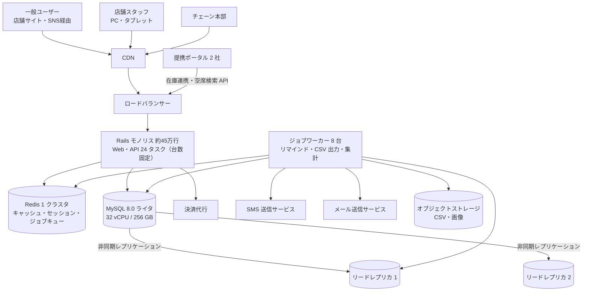
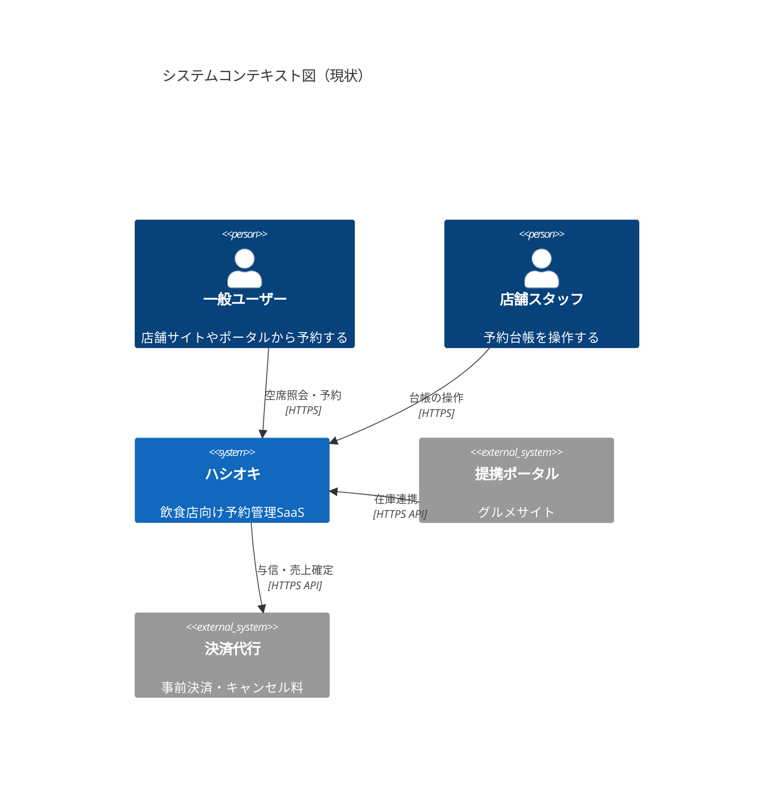
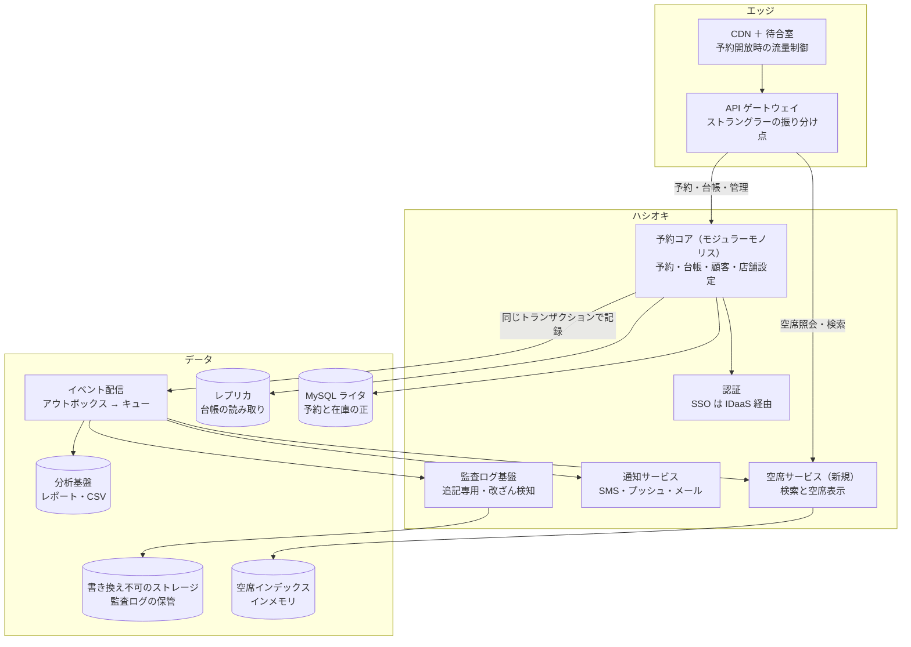
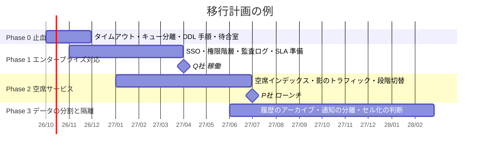

# 15.2 設計プロジェクト — 設計書とレビュー

> 1 人では作りきれない規模のシステムでは、設計の質は「書かれた設計書」と「それが受けたレビュー」で決まります。この章では、急成長と大企業向けの展開を同時に迎える飲食店予約 SaaS を題材に、現状の分析から容量とコストの見積もり、目標アーキテクチャ、データの分割、移行計画、リスク分析、ADR までを 1 つの設計書にまとめ、設計レビューのロールプレイで検証します。

| 項目 | 内容 |
|---|---|
| 学習時間の目安 | 本文 3h ＋ 演習 40h |
| 形式 | 設計書を 1 人（またはペア）で書き、3〜6 人で設計レビューのロールプレイを行う。1 人で取り組む方法も後述 |
| 前提となる章 | 第9部を中心に、第6・7・10・11部。詳しくは下の「前提となる章」 |
| キーワード | 設計書, C4 モデル, キャパシティ見積もり, SLA と SLO, エラーバジェット, ホットスポット, 読み取りモデル, パーティショニング, ストラングラー, CDC, 監査ログ, SSO, ADR, 設計レビュー |

## 目的

- [ ] 散らばったデータ（トラフィック・障害・コスト・組織）から、本当のボトルネックと解くべき問題を特定し、数字で説明できる
- [ ] 容量とコストを、前提と計算式を明示して見積もれる。「どの前提が外れると結論が変わるか」を言える
- [ ] 目標アーキテクチャを C4 モデルの図と文章で示し、代替案と比べたトレードオフを説明できる
- [ ] SLA・SLO・エラーバジェットを、依存先の可用性や変更のリスクと結びつけて設計できる
- [ ] ビッグバンの書き直しをせずに、事業を止めずに段階的に移行する計画（ストラングラー）を、各段階の完了条件と戻し方つきで書ける
- [ ] 設計レビューで、レビュアーとして鋭い質問ができ、著者として指摘を設計の改善につなげられる

この課題に唯一の正解はありません。評価されるのは、結論そのものよりも **結論に至る推論の筋道** です。数字で裏づけられているか、制約（期限・予算・人）を守っているか、トレードオフを自覚しているか、そして他人が読んで検証できる形になっているか、です。

[学習ガイド](../../00-guide/README.md) では、この設計書を他の人にレビューしてもらうことを Stage II 修了の条件にしています。

## 前提となる章

| 領域 | 主に使う章 |
|---|---|
| アーキテクチャ | [9.1 ソフトウェアアーキテクチャの基礎](../../09-architecture/01-architecture-fundamentals/README.md)（C4・品質特性・ADR）、[9.2 アーキテクチャスタイル](../../09-architecture/02-architecture-styles/README.md)、[9.3 ドメイン駆動設計とモジュール分割](../../09-architecture/03-domain-driven-design/README.md)、[9.4 API設計](../../09-architecture/04-api-design/README.md)、[9.5 スケーラビリティとパフォーマンス](../../09-architecture/05-scalability-and-performance/README.md)、[9.6 システム設計ケーススタディ](../../09-architecture/06-system-design-cases/README.md) |
| データ | [6.2 インデックスとクエリ処理](../../06-databases/02-indexes-and-query-processing/README.md)、[6.3 トランザクションと同時実行制御](../../06-databases/03-transactions/README.md)、[6.4 ストレージエンジンと障害回復](../../06-databases/04-storage-and-recovery/README.md)、[6.5 データモデルの多様性とデータストアの選定](../../06-databases/05-beyond-relational/README.md)、[12.1 データ基盤とデータエンジニアリング](../../12-data-and-ai/01-data-engineering/README.md) |
| 分散システム | [7.2 レプリケーションと一貫性](../../07-distributed-systems/02-replication-and-consistency/README.md)、[7.3 パーティショニング](../../07-distributed-systems/03-partitioning/README.md)、[7.5 メッセージングとイベント駆動](../../07-distributed-systems/05-messaging-and-events/README.md) |
| 運用と信頼性 | [8.4 CI/CDとリリースエンジニアリング](../../08-software-engineering/04-ci-cd-and-release/README.md)、[8.5 リファクタリングと技術的負債](../../08-software-engineering/05-refactoring-and-tech-debt/README.md)、[10.3 信頼性設計とSLO](../../10-cloud-and-sre/03-reliability-engineering/README.md)、[10.5 インシデント対応とポストモーテム](../../10-cloud-and-sre/05-incident-management/README.md)、[10.6 クラウドコスト管理（FinOps）](../../10-cloud-and-sre/06-finops/README.md) |
| セキュリティ | [11.1 セキュリティの基本原則と脅威モデリング](../../11-security/01-security-principles/README.md)、[11.3 認証と認可](../../11-security/03-authn-authz/README.md) |
| 意思決定 | [13.2 技術的意思決定と設計レビュー](../../13-technical-leadership/02-technical-decisions/README.md)、[14.3 事業と財務のリテラシー](../../14-cto/03-business-and-finance/README.md)、[14.5 ガバナンス・リスク・コンプライアンスと法務](../../14-cto/05-governance-risk-compliance/README.md) |

## シナリオ

> 本章の企業・製品・人物・数値はすべて架空です。実在の企業やサービスとは関係ありません。

### 会社と事業

株式会社ハシオキは、飲食店向けの予約管理 SaaS「ハシオキ」を 2016 年から提供しています。あなたは 1 か月前に入社した Principal エンジニアで、CTO から「18 か月後に向けたアーキテクチャの設計書を書き、6 週間後の設計レビューにかけてほしい」と依頼されました。

ハシオキの主な機能は次の通りです。

- **予約台帳**: 店舗スタッフが、電話や来店の予約を含むすべての予約を管理する画面。席の割り当て、コース、来店の記録。
- **ネット予約**: 店舗の Web サイトや SNS に埋め込むウィジェット。空席を照会し、その場で予約できる。
- **ポータル連携**: 提携するグルメポータル 2 社と、空席（在庫）と予約を同期する。ポータル側からのエリア横断の空席検索にも応答する。
- **顧客台帳**: 店舗ごとの顧客情報（氏名・電話番号・メールアドレス・来店履歴・アレルギーなどのメモ）。
- **事前決済とキャンセル料**: 決済代行会社を通じた与信と売上確定。
- **リマインド**: 予約の前日に SMS またはメールで通知し、無断キャンセルを減らす。

### 今後 18 か月の事業計画

2 つの大きな契約が決まり、事業の規模と性質が同時に変わります。

1. **大手決済アプリ「P 社」との提携**（2027 年 7 月開始）: P 社のアプリ内の「グルメ予約」機能の裏側を、ハシオキが担います。P 社の会員がアプリから空席を検索して予約すると、ハシオキの会員として連携されます。P 社は、開始後半年で 400 万人以上の利用を見込んでいます。
2. **大手外食チェーン「Q 社」（620 店舗）の全店導入**（2027 年 4 月稼働）: ハシオキにとって初めての本格的なエンタープライズ顧客です。さらに 2 社（合計約 1,200 店舗）と商談中で、Q 社での実績が受注の条件になっています。

| 指標 | 現在（2026 年 8 月） | 18 か月後の計画（2028 年 2 月） |
|---|---|---|
| 契約店舗数 | 8,200 | 20,000（うちエンタープライズ 3 社・約 1,800 店舗） |
| 会員数（ネット予約の登録ユーザー） | 12 万人 | 500 万人（P 社会員の連携を含む） |
| 月間予約件数 | 180 万件 | 900 万件 |
| 月間のエリア横断の空席検索 | 300 万回 | 1 億 2,000 万回（うち P 社 約 1 億 1,000 万回） |
| 月次売上 | 約 1.1 億円 | 約 2.6 億円 |
| インフラ費用（SMS を含む） | 1,250 万円/月（売上比 約 11%） | 売上比 10% 以下（取締役会の方針） |
| エンジニア | 28 名 | 34 名（採用計画） |

### 現在のアーキテクチャ



- 東京リージョンの 1 リージョン構成。アプリはマネージドのコンテナ実行基盤で動き、DB はマネージドの MySQL 8.0（ライタは複数のアベイラビリティゾーンに待機系を持つ）。
- 空席は `seat_inventories`（店舗 × 日付 × 時間枠 × 席タイプの在庫行。180 日先まで事前生成）から計算する。ポータルからのエリア横断検索では、1 回の検索で平均 180 店舗分の在庫行を読む。
- 障害 INC-3（下の表）以降、「レプリカの遅延で二重予約が起きる」ことを恐れて、台帳と空席照会の読み取りをすべてライタに戻した。レプリカを使っているのは夜間の CSV 一括出力と集計だけで、本部や店舗が管理画面から日中に実行するレポートはライタで動いている。
- デプロイは毎週木曜のリリーストレイン。CI に 42 分、手動の回帰テストに 2 日かかる。ロールバックは再デプロイで約 35 分。

### データ

**トラフィック**（2026 年 8 月。ピークは平日 12〜13 時と金土の 17〜20 時）

| 系統 | 平均 req/s | ピーク req/s | 主な利用者 | 18 か月後の伸び（事業計画から） |
|---|---|---|---|---|
| 店舗サイト経由の空席照会・予約（ウィジェット） | 30 | 110 | 一般ユーザー | 店舗数に比例（2.4 倍） |
| エリア横断の空席検索（ポータル・P 社） | 1.2 | 12 | ポータル | P 社の開始で 40 倍 |
| 予約の作成・変更・取消（全チャネル） | 1.2 | 9 | 全員 | 予約件数に比例（5 倍） |
| 予約台帳・顧客台帳（店舗スタッフ） | 45 | 170 | 店舗 | 店舗数に比例（2.4 倍） |
| 管理画面・レポート・CSV | 4 | 25 | 店舗・本部 | エンタープライズ化で 3 倍 |
| 在庫連携 API（ポータルとの同期） | 25 | 40 | ポータル | 連携先の数に比例（1.5 倍） |

**予約開放のスパイク**: 人気店の中には「毎月 1 日 10:00 に 2 か月先の予約を開放する」店があります。現在は最大 2,800 req/s の空席照会と予約が約 90 秒続きます。P 社はアプリのプッシュ通知で人気店の予約開放を告知する予定で、その場合は最大 30,000 req/s が約 60 秒続くと見込まれます。

**DB（ライタ）の状況**: CPU 使用率は平均 48%、ピーク時 92%、予約開放時 100%。現在のサイズの 1 段上（64 vCPU）が、このクラウドで選べる最大です。ピーク時の CPU 時間の内訳（クエリの種類別の集計）は次の通りです。

| クエリの系統 | CPU 時間の割合 |
|---|---|
| 空席照会（ウィジェット 6 割・エリア横断検索 4 割） | 43% |
| 予約台帳・顧客台帳の読み取り | 24% |
| レポート・CSV（日中に管理画面から実行されるもの） | 16% |
| その他 | 7% |
| 在庫連携 | 6% |
| 予約の書き込み（在庫・履歴の更新を含む） | 4% |

**データ量**

| テーブル | 行数 | サイズ（インデックス込み） | 月間の増加 | 備考 |
|---|---|---|---|---|
| `reservations` | 2.1 億 | 310 GB | 180 万行 | 2016 年以降の全予約。論理削除 |
| `reservation_histories` | 9.4 億 | 1.1 TB | 1,500 万行 | 予約の変更のたびに全列をコピーした履歴。監査ログの代わりに使われている |
| `customers` | 4,600 万 | 95 GB | 60 万行 | 店舗ごとの顧客台帳。電話番号・メール・自由記述のメモ（アレルギーなど）を含む |
| `seat_inventories` | 1.2 億 | 60 GB | — | 店舗 × 日付 × 時間枠 × 席タイプの在庫（180 日先まで） |
| `notifications` | 6.8 億 | 420 GB | 2,000 万行 | SMS・メールの送信記録 |
| その他 | — | 120 GB | — | |

**費用**（月額、2026 年 8 月）

| 項目 | 月額 | 備考 |
|---|---|---|
| アプリ（Web・API のコンテナ） | 190 万円 | ピークに合わせて 24 タスクを常時稼働 |
| ジョブワーカー | 60 万円 | |
| DB（ライタ・待機系・レプリカ 2・ストレージ・I/O・バックアップ） | 430 万円 | I/O の従量課金が DB 費用の約 3 割 |
| キャッシュ（Redis） | 55 万円 | |
| CDN・データ転送 | 45 万円 | |
| ログ・監視 SaaS | 140 万円 | アクセスログを全量転送している |
| SMS | 230 万円 | 月 29 万通 × 約 8 円（架空の契約単価）。予約の約 16% に送信 |
| メール | 10 万円 | |
| 開発・検証環境 | 90 万円 | 本番と同じ構成で 24 時間稼働 |
| 合計 | 1,250 万円 | 売上比 約 11% |

**過去 12 か月の主な障害**

| ID | 日時 | 継続時間 | 影響 | 概要 |
|---|---|---|---|---|
| INC-1 | 2025-12-01 10:00 | 47 分 | 全店舗で台帳とネット予約が停止 | 人気店 3 店の予約開放。予約作成のトランザクションが在庫行を `SELECT ... FOR UPDATE` でロックしたまま、決済代行の与信（外部 API、平均 800 ms）を呼んでいた。ロック待ちが連鎖して DB の接続が枯渇し、ヘルスチェックに失敗したアプリのタスクが再起動を繰り返した |
| INC-2 | 2025-12-24 19:00 | 18 分 | 空席表示の遅延・タイムアウト | 空席照会の急増。キャッシュのキーに検索条件（人数・時間帯）を丸ごと含めていたためヒット率が低く、在庫が変わるたびに関連キーを一斉に消していたため、DB にリクエストが殺到した |
| INC-3 | 2026-03-02 19:30 | 22 分（影響は数時間） | 二重予約 37 件 | 本部向けの CSV 一括出力がレプリカに重いクエリを流し、レプリカの遅延が最大 9 分に。当時レプリカから読んでいた台帳で空いて見えた席に、スタッフが電話予約を入れた |
| INC-4 | 2026-05-19 14:10 | 25 分 | 全停止 | `reservation_histories` への列の追加。実行中の長い集計クエリがメタデータロックを持っており、`ALTER TABLE` がその解放を待つ間、後続のクエリもすべて待ちに入った |
| INC-5 | 2026-07-10 | 約 3 時間（部分的） | SMS リマインドの遅延、無断キャンセルの苦情 | リマインドと CSV 出力が同じジョブキューを共有しており、大量の CSV ジョブの後ろにリマインドが詰まった |
| INC-6 | 2026-08-08 12:20 | 12 分 | 事前決済つきの予約が失敗 | 決済代行の API が遅延。HTTP クライアントにタイムアウトがなく、アプリのスレッドが枯渇した |

**開発の状況**（DORA の 4 指標。直近 3 か月）

| 指標 | 値 |
|---|---|
| デプロイ頻度 | 週 1 回（木曜のリリーストレイン） |
| 変更のリードタイム（中央値） | 12 日 |
| 変更失敗率 | 28% |
| 復旧時間（中央値） | 3 時間 |

**組織**: エンジニア 28 名。予約チーム 7 名、店舗管理チーム 6 名、連携チーム（ポータル・決済・P 社）5 名、顧客チーム 4 名、基盤チーム 4 名（うち SRE 1 名、DB に詳しい人 1 名）、QA 2 名。全員が同じモノリスを変更しており、コードの所有者が曖昧です。Go の経験者が 3 名いますが、Kubernetes の運用経験者はいません。2024 年に「新しい予約エンジンへの全面的な書き直し」を試みましたが、8 か月で中止しています。

### エンタープライズ顧客（Q 社）の要求

Q 社の提案依頼書（RFP）から、技術に関係する要求を抜き出したものです。

| # | 要求 | 必須 / 希望 |
|---|---|---|
| E-1 | 本部とエリアマネージャーのログインを、Q 社の IdP（ID プロバイダ）による SAML 2.0 のシングルサインオン（SSO）にする | 必須 |
| E-2 | 権限を本部・エリア・店舗の階層で設定できる。本部は全店舗、エリアマネージャーは担当エリアの店舗だけを見られる | 必須 |
| E-3 | 店舗の共用タブレットは、個人アカウントではなく端末単位でログインでき、操作者を記録できる | 必須 |
| E-4 | 予約・顧客情報の閲覧・変更・出力、権限の変更を監査ログに記録する。1 年間は検索でき、5 年間保管する。Q 社の SIEM（セキュリティ監視基盤）に取り込める | 必須 |
| E-5 | 予約台帳と予約受付の月間稼働率 99.95% の SLA。下回った場合はサービスクレジット（利用料の一部返金） | 必須 |
| E-6 | 目標復旧時点（RPO）5 分、目標復旧時間（RTO）1 時間。大規模災害時の対応方針を示すこと | 必須 |
| E-7 | データを国内に保管する。契約終了時にデータを返却・削除する | 必須 |
| E-8 | 計画メンテナンスは営業時間外（2〜6 時）に限り、14 日前に通知する | 必須 |
| E-9 | 本部の管理画面への接続元 IP アドレスを制限できる | 必須 |
| E-10 | POS・CRM と連携する API（持続 50 req/s）と、予約の作成・変更・取消を通知する Webhook | 必須 |
| E-11 | 全店舗を横断した予約・来店のレポート（翌朝までに更新されればよい） | 必須 |
| E-12 | SCIM によるユーザーの自動プロビジョニング | 希望 |
| E-13 | 第三者によるセキュリティ評価（ペネトレーションテスト）の報告書、ISMS 認証または SOC 2 報告書 | 希望（2 年以内に必須化の予定） |

### 制約

- **ビッグバンの書き直しは禁止**（2024 年の失敗を受けた取締役会の決定）。事業を止めずに、段階的に移行すること。
- **期限は動かない**: Q 社の稼働は 2027 年 4 月、P 社の開始は 2027 年 7 月。
- **予算**: インフラ費用（SMS を含む）は売上比 10% 以下。移行のための一時費用として、外部の専門家や一時的な増強に 8,000 万円まで使える。
- **人**: エンジニアは 12 か月で 6 名増える計画だが、採用は遅れがち。既存の機能開発も止められない（設計に使える人員は全体の 3〜4 割が上限）。
- **運用**: 営業時間（10〜24 時）に計画停止はできない。データは国内に置く。

### 経営陣の声

- CEO: 「P 社と Q 社は、会社の次のステージを決める契約です。どちらも落とせません。ただ、2024 年のような書き直しの失敗は二度と許されない」
- CFO: 「売上が倍になるのに、インフラ費用が 3 倍になるなら事業計画が成り立ちません。どこにいくらかかるのか、根拠を見せてほしい」
- 営業責任者: 「Q 社は SLA と監査ログを特に気にしています。次の 2 社も同じことを聞いてきます」
- 現場のエンジニア: 「毎月 1 日の 10 時が怖いです。あと、木曜のリリースのたびに何かが壊れる気がします」

## 成果物

| 成果物 | 内容 | 分量の目安 |
|---|---|---|
| 設計書 | 下のテンプレートに沿った本文 | 本文 10〜20 ページ相当（付録は別） |
| C4 の図 | システムコンテキスト図、コンテナ図（現状と目標）、最も重要なコンテナのコンポーネント図 | 4〜5 枚 |
| 容量とコストの見積もり | 計算式・前提・感度（前提が外れたときの影響）つき | 表と計算 |
| SLO | SLI の定義、目標、エラーバジェットの方針、SLA との関係 | 1〜2 ページ |
| データモデルと分割の計画 | 主要なエンティティ、分割のキー、ホットスポットへの対処、データのライフサイクル | 2〜3 ページ |
| 移行計画 | 段階・各段階の完了条件と戻し方・切り替えの方法・スケジュール | 2〜3 ページ |
| リスク分析 | リスク登録簿（可能性・影響・対策・兆候・担当） | 表 |
| ADR | 3 本以上 | 各 1 ページ程度 |
| レビューの記録 | 受けた指摘と対応（採用・不採用とその理由）、改訂版 | 表 |

## 設計書テンプレート

````markdown
# （システム名）アーキテクチャ設計書

- 著者 / レビュアー / 状態（草稿・レビュー中・承認） / 最終更新日

## 1. 要約（1 ページ以内）
何を・なぜ・どう変えるか。最も重要な 3 つの決定と、最大のリスク。読者が 1 ページで判断できるように。

## 2. 背景と課題
現状の説明と、データに基づく問題の診断。「何が本当のボトルネックか」を数字で示す。

## 3. ゴールと非ゴール
この設計で達成すること（測れる形で）と、やらないこと。

## 4. 要件
機能要件、非機能要件（規模・性能・可用性・セキュリティ・コンプライアンス・コスト）、制約（期限・予算・人）。

## 5. 容量とコストの見積もり
前提 → 計算 → 結果。前提が外れたときの感度。

## 6. 提案するアーキテクチャ
C4 の図（コンテキスト・コンテナ・コンポーネント）と、各要素の責務。主要なシナリオ（予約開放など）の流れ。

## 7. データ設計
データモデル、所有者（どのコンポーネントが書き込むか）、一貫性の要件、分割の方針、ライフサイクル（保存期間・アーカイブ・削除）。

## 8. 信頼性
SLI / SLO / エラーバジェット、SLA との関係、障害の影響範囲の限定、依存先が落ちたときの振る舞い、災害対策（RPO / RTO）。

## 9. セキュリティ・プライバシー・コンプライアンス
認証・認可（SSO・権限の階層）、監査ログ、個人情報の扱い、脅威モデルの要点。

## 10. 移行計画
段階ごとの範囲・完了条件・戻し方・切り替えの方法。スケジュールと期限との関係。

## 11. 検討した代替案
案ごとに、長所・短所・却下した理由。

## 12. リスクと対策
リスク登録簿。

## 13. 運用と組織
オンコール・監視・Runbook。チームの境界とコンポーネントの所有者。必要なスキルと採用・育成。

## 14. 未解決の問題
まだ決めていないこと、レビューで意見がほしいこと。

## 付録
ADR の一覧、計算の詳細、用語集。
````

## マイルストーン

| # | 内容 | 目安 | 受け入れ基準 |
|---|---|---|---|
| D1 | **現状分析と問題の定義**: データを読み、障害の根本的な原因を分類し、ボトルネックを特定する。要件と制約を整理する | 6h | 6 件の障害それぞれについて、直接の原因と構造的な原因を区別して書いている。「最も大きな問題は何か」を数字で示し、根拠のない思い込み（例: 書き込みが多すぎる）を検証している |
| D2 | **容量とコストの見積もり**: 18 か月後のピーク負荷、DB の負荷、ストレージ、費用を見積もる | 6h | 計算式と前提が明示され、他人が再計算できる。何もしなかった場合と提案の場合を比べている。感度の高い前提を 2 つ以上挙げている |
| D3 | **目標アーキテクチャとデータ設計**: C4 の図、コンポーネントの責務、データの所有者、一貫性、分割、ホットスポットへの対処 | 10h | 予約開放のスパイク、二重予約の防止、エリア横断検索、レポートの 4 つのシナリオについて、処理の流れを説明できる。代替案を 2 つ以上比べている |
| D4 | **信頼性とセキュリティ**: SLO・エラーバジェット・SLA との関係、災害対策、SSO・権限の階層・監査ログ・個人情報 | 6h | 99.95% の SLA を守れる根拠（依存先の可用性、変更起因の障害の抑制）がある。Q 社の必須要求 E-1〜E-11 への対応が一覧になっている |
| D5 | **移行計画とリスク**: 段階・完了条件・戻し方・スケジュール、リスク登録簿 | 6h | すべての段階に完了条件と戻し方がある。Q 社と P 社の期限との関係が明確。リスクが 8 件以上あり、兆候と担当がある |
| D6 | **ADR と仕上げ**: 重要な決定を ADR にし、要約を書く | 3h | ADR が 3 本以上。要約だけを読んで、決定とリスクが分かる |
| D7 | **設計レビューと改訂**: ロールプレイでレビューを受け、改訂する | 3h | すべての指摘に対応（採用・不採用と理由）が記録され、改訂版がある |

設計の途中で [9.6 システム設計ケーススタディ](../../09-architecture/06-system-design-cases/README.md) の進め方（要件 → 見積もり → 大まかな設計 → 深掘り → ボトルネックの検討）を思い出すと、手が止まりにくくなります。

## 設計レビューのロールプレイ

設計書は、他人に読まれて初めて強くなります。ここでは、実務の設計レビューを模した 90 分のロールプレイの進め方を示します。レビュー全般の考え方は [13.2 技術的意思決定と設計レビュー](../../13-technical-leadership/02-technical-decisions/README.md) を参照してください。

### 役割

| 役割 | 担当すること |
|---|---|
| 著者 | 設計書を事前に配り、冒頭で 5 分だけ要点を話す。指摘には防御せず、まず質問の意図を確かめる |
| ファシリテーター | 時間の管理、論点の整理、発言の偏りの是正。結論を「決定・保留・宿題」に分けて確認する |
| 書記 | 指摘・回答・決定・宿題を、その場で記録する |
| レビュアー（帽子をかぶる） | 次の観点のどれか 1 つを担当する。1 人で 2 つまで兼ねてよい |

| 帽子（観点） | 主な関心 |
|---|---|
| SRE・信頼性 | SLO、障害の影響範囲、依存先が落ちたときの振る舞い、運用の負荷、変更の安全性 |
| データ・DB | 一貫性、トランザクション、分割、スキーマの変更、データの移行と整合性の検証 |
| セキュリティ・プライバシー | 認証・認可、監査ログ、個人情報、テナントの分離、脅威モデル |
| コスト・財務（CFO の視点） | 費用の見積もりの根拠、単価の変化、固定費と変動費、一時費用 |
| 事業・プロダクト（CEO・営業の視点） | 期限、顧客への約束（SLA）、機能開発への影響、優先順位 |
| 現場の実行者 | 今のチームで作れるか・運用できるか、学習コスト、段階の粒度 |

### 進め方（90 分）

1. **事前（3 営業日前まで）**: 著者が設計書を配布します。レビュアーは読んで、コメントを事前に書き込んでおきます。「会議で初めて読む」ことをなくすのが目的です。事前に配れない場合は、Amazon の「6 ページのメモを会議の冒頭で黙読する」慣行として知られるように、最初の 15〜20 分を黙読にあてます。
2. **0〜10 分**: 著者が要点（問題・3 つの決定・最大のリスク）を説明します。スライドは使わず、設計書そのものを画面に出します。
3. **10〜20 分**: 理解のための質問だけを受けます（賛否はまだ言わない）。
4. **20〜70 分**: 「必須」の指摘から順に議論します。1 つの論点に 10 分以上かかったら、ファシリテーターが宿題にして次へ進めます。
5. **70〜85 分**: 書記が決定・保留・宿題を読み上げ、全員で確認します。
6. **85〜90 分**: 次のステップ（改訂の期限、再レビューが必要か）を決めます。
7. **事後**: 著者は、すべての指摘に「採用・不採用・保留」と理由を書いて返し、決定は ADR にします。「必須」の指摘が残るなら再レビューします。

### コメントの書き方

コメントには重みのラベルを付けます。ラベルがないと、著者はすべての指摘を同じ重さで受け止めてしまい、細部の議論に時間を取られます。

| ラベル | 意味 |
|---|---|
| 必須 | 解決しないと承認できない（正しさ・安全性・期限・予算に関わる） |
| 重要 | 強く推奨するが、理由があれば不採用でもよい |
| 提案 | 別の選択肢の提示。採否は著者に任せる |
| 質問 | 理解のための質問 |
| 細部 | 表記・言葉づかいなど |

良いコメントは、**設計に向けられ、根拠があり、次の行動が分かる** ものです。

- 悪い例: 「このキャッシュ設計は危ないと思います」
- 良い例: 「［必須］空席インデックスが最大何秒古くなりうるかが書かれていません。予約開放の直後に、インデックス上は空いているのに DB では満席、という状態が何件起きると見込んでいますか。予約確定の時点で DB を再検証しているなら、その流れを 6 章の図に追加してください」

### レビュアーのチェックリスト

| 観点 | 確かめること |
|---|---|
| 問題設定 | 解く問題が 1 文で言えるか。成功を測る指標があるか。やらないことが明記されているか |
| 数字 | ピーク負荷・データ量・費用に、計算式と前提があるか。桁が合っているか（自分で概算して確かめる） |
| 一貫性 | 二重予約はどこで防いでいるか。古いデータを読んでよい場所と、いけない場所が区別されているか |
| 障害 | 各依存先（DB・キャッシュ・決済代行・SMS・P 社）が落ちたら何が起きるか。影響範囲は限定されているか |
| 変更 | スキーマ変更・デプロイ・切り替えの手順と、戻し方と、その所要時間があるか |
| セキュリティ | 他のチェーンのデータに届く経路はないか。監査ログは改ざんできないか。個人情報の扱いは最小限か |
| 移行 | 最初の段階で何が良くなるか。どこで後戻りできなくなるか（一方通行のドア）。期限に間に合わない場合の代替案 |
| コスト | 18 か月後の月額の見込みと根拠。最も効く施策。単価が変わったときの影響 |
| 組織 | 誰が作り、誰が運用し、誰がオンコールを持つか。今のチームのスキルで足りるか |

### 質問集

レビュアーは、ここから自分の帽子に合う質問を選び、設計書の具体的な箇所に当てはめて使ってください。

**問題と要件**

1. この設計がなかったら、18 か月後に最初に壊れるのはどこですか。その根拠となる数字は何ですか。
2. P 社と Q 社の要求が衝突したら、どちらを優先しますか。その判断は誰がしますか。
3. 「やらないこと」に入れた項目のうち、後で最も困りそうなものはどれですか。

**規模と性能**

4. ピーク負荷の見積もりで、最も自信のない前提はどれですか。それが 2 倍外れたら、どこから壊れますか。
5. 予約開放の 60 秒間に、1 つの在庫行へ毎秒何件の更新が来る想定ですか。そのとき行ロックはどれくらいの時間保持されますか。
6. エリア横断検索 1 回あたりの処理コストはいくらですか。P 社の検索が想定の 3 倍になったら、何が起きますか。

**データと一貫性**

7. 空席検索の結果は、最大で何秒古くなりえますか。そのせいで利用者に起きる最悪のことは何ですか。
8. 書いた直後に読む画面（予約を入れた直後の台帳）は、どのデータを読みますか。
9. 分割のキーを変えたくなったら、どれくらいの作業になりますか。

**信頼性**

10. 99.95% の SLA は、どの依存先の可用性を前提にしていますか。掛け算は合っていますか。
11. Redis が 10 分止まったら、予約受付はどうなりますか。
12. 過去 12 か月の障害のうち、この設計で防げるものはどれで、防げないものはどれですか。

**変更と移行**

13. 移行のどの時点で、後戻りできなくなりますか。そこに至る前に、何を確かめますか。
14. 新旧の空席計算の結果が食い違ったら、どうやって気づき、どちらを正としますか。
15. 最初の段階が終わったとき、利用者から見て何が良くなっていますか。

**セキュリティとプライバシー**

16. エリアマネージャーが担当外の店舗の顧客情報を見られないことを、どうやって保証し、どうやってテストしますか。
17. 監査ログを管理者権限で消されたら、どうやって気づきますか。
18. SAML の応答の署名検証は、どこで誰が実装しますか。自前で実装するなら、その理由は何ですか。

**コストと組織**

19. 提案の中で、最も費用対効果の高い施策はどれですか。
20. 新しいコンポーネントのオンコールは誰が持ちますか。今のチームの構成とコンポーネントの境界は一致していますか。
21. この計画に必要なスキルのうち、今のチームにないものは何ですか。採用が遅れたら、どの段階を削りますか。

**代替案**

22. 分散 SQL（MySQL 互換の分散データベースや、Vitess のようなシャーディング基盤）を選ばなかった理由は何ですか。どうなったら再検討しますか。
23. 自前の空席インデックスではなく、マネージドの検索サービスを使わない理由は何ですか。
24. 技術ではなく、業務や商品の工夫で解ける問題はありませんか（例: 人気店の予約開放を抽選にする）。

### 1 人で取り組む場合

- 書き上げてから **2 日以上空けて**、自分の設計書を「別人として」レビューします。帽子を 1 つずつ変えて、チェックリストと質問集で読み直します。
- 質問集の各質問に、設計書のどこで答えているかを書き込みます。答えられない質問が、設計の穴です。
- AI アシスタントに、特定の帽子のレビュアー役を頼むのも有効です（例: 「あなたは SRE の立場のレビュアーです。この設計書に、必須・重要・提案のラベルを付けてコメントしてください」）。ただし、AI は同意に傾きやすく、もっともらしい誤りも言います。指摘の妥当性は、自分で数字と一次資料に当たって確かめてください。AI の評価を合否の判定に使ってはいけません。
- 可能なら、勉強会や社内で 30 分だけ時間をもらい、要約と最大のリスクだけでも他人に説明してください。説明しようとした瞬間に、自分の理解の穴が見えます。

## 評価基準（ルーブリック）

合格ラインは **すべての観点で 2 以上**。3 が半分以上あれば、実務で設計レビューを主導できる水準です。

| 観点 | 1 要改善 | 2 合格 | 3 優秀 |
|---|---|---|---|
| 問題の診断 | 障害や不満を並べただけ。ボトルネックが思い込み（「書き込みが多い」など） | データから主要なボトルネックを特定し、障害を構造的な原因で分類している | 「何が問題ではないか」も示し（例: 書き込みの量）、的外れな対策を事前に退けている |
| 見積もり | 数字がない、または前提と計算式がない | 前提・計算・結果があり、再計算できる。何もしない場合と比べている | 感度分析があり、「この前提が外れたらこの決定を見直す」と結びつけている |
| アーキテクチャ | 流行の構成の当てはめ（全面マイクロサービス化など）で、課題との対応がない | 各コンポーネントが特定の課題に対応し、代替案と比べたトレードオフがある | 分けないもの（モノリスに残すもの）とその理由も明確で、チームの境界と整合している |
| データと一貫性 | 二重予約やレプリカの遅延に触れていない | 強い一貫性が必要な箇所と、古くてよい箇所を区別し、それぞれの仕組みがある | ホットスポット・分割・ライフサイクルまで一貫した設計で、分割のキーを変えるコストも見積もっている |
| 信頼性（SLO と SLA） | 「99.95% を目指す」だけ | SLI の定義、SLA より厳しい社内の SLO、依存先の可用性の掛け算、エラーバジェットの方針がある | 変更起因の障害（変更失敗率 28%）への対策を、SLA を守る主要な手段として設計している |
| セキュリティと顧客要求 | SSO や監査ログを「対応する」とだけ書いている | E-1〜E-11 への対応が一覧になり、方式と理由がある | 脅威モデルに基づき、監査ログの改ざん検知や共用端末のような難しい点を具体的に解いている |
| 移行計画 | 最終形だけで道筋がない。またはビッグバン | 段階・完了条件・戻し方・期限との関係がある | 各段階が単独で価値を生み、一方通行のドアの前に検証の関門を置いている |
| コスト | 費用に触れていない | 18 か月後の月額の見込みと主要な施策がある | 単位あたりのコスト（予約 1 件・検索 1 回あたり）で考え、P 社との契約条件（流量の上限など）まで提案している |
| ADR と文書 | 決定の理由が追えない | ADR が 3 本以上あり、要約で判断できる | 読者ごと（経営・現場・レビュアー）に必要な情報へすぐたどり着ける構成 |
| レビューへの対応 | 指摘に反論するか、無視している | すべての指摘に採否と理由を返し、改訂している | レビューで設計が明確に良くなり、その経緯が記録されている |

## ヒント

### 見積もりは「桁」から始める

最初から正確な数字を求める必要はありません。桁（10 倍単位）が合っていれば、設計の判断はたいてい変わりません。次の順で進めます。

1. データの表から、18 か月後の系統ごとのピーク負荷を出す（伸び率を掛けるだけ）
2. 系統ごとに、DB の負荷がどう伸びるかを考える（CPU 時間の内訳の表を使う）
3. 「どの系統が、どのくらいの倍率で、何を超えるか」を見る
4. 超えるものだけを深掘りする

特に、エリア横断検索は 1 回で平均 180 店舗の在庫を読むことに注意してください。リクエスト数が小さくても、裏側の処理量は大きくなります。

### 障害の原因を 2 層で書く

INC-1 の直接の原因は「人気店の予約開放」ですが、構造的な原因は「外部 API の呼び出しをトランザクションの中で行い、ロックを 800 ms 以上持ち続けたこと」と「1 つの店舗の問題が全店舗に波及する構造（共有の接続プール、ヘルスチェックの設計）」です。対策は構造的な原因に向けます。6 件の障害を構造的な原因で分類すると、いくつかは同じ根から生えていることに気づくはずです。

### 空席の一貫性は 2 段階で考える

「検索で見せる空席」と「予約を確定するときの在庫」は、同じ一貫性を必要としません。検索は少し古くてもよい（数秒前の空席を見せても、確定時に再確認すればよい）が、確定は厳密でなければなりません。この区別ができると、検索の負荷を DB から切り離す設計の自由度が一気に広がります（読み取り専用のモデルを別に持つ考え方は CQRS と呼ばれます。[7.5](../../07-distributed-systems/05-messaging-and-events/README.md)）。

### ホットスポットは分割では解けない

予約開放の問題は「特定の数店舗の、特定の在庫行」に更新が集中することです。データを多くのサーバーに分割（シャーディング）しても、1 つの行への集中は分散されません。考えるべきは、(1) 行ロックを持つ時間を短くする（外部呼び出しをトランザクションの外に出す、条件付きの `UPDATE` 1 文で在庫を減らす）、(2) そもそも DB に届くリクエストを減らす（待合室による流量制御、CDN での空席表示）、(3) 業務の工夫（抽選、開放時刻の分散）です。

### SLA・SLO・依存先の可用性

- **SLA は顧客との契約、SLO は社内の目標** です。SLA を守るために、SLO は SLA より厳しく置きます（例: SLA 99.95% に対して SLO 99.97%）。30 日で換算すると、99.95% は約 21.6 分、99.97% は約 13 分の停止に相当します。
- 直列につながる依存先の可用性は掛け算になります。99.99% のコンポーネントが 3 つと 99.95% のコンポーネントが 1 つ直列に並ぶと、全体は約 99.92% です。99.95% を約束するなら、クリティカルパス上の依存先を減らすか、冗長化するか、落ちても縮退して動くようにする必要があります。
- 実際の停止の多くは、ハードウェアの故障ではなく変更（デプロイ・設定・スキーマ変更）から生まれます。Google の『SRE サイトリライアビリティエンジニアリング』は、障害のおよそ 70% が稼働中のシステムへの変更によるものだとしています。変更失敗率 28% のままで 99.95% を約束するのは、根拠がありません（[10.3](../../10-cloud-and-sre/03-reliability-engineering/README.md)、[8.4](../../08-software-engineering/04-ci-cd-and-release/README.md)）。

### スキーマ変更の安全策

INC-4 のようなメタデータロックの連鎖は、MySQL で繰り返し起きる典型的な事故です。MySQL の `lock_wait_timeout`（メタデータロックの待ち時間の上限）の既定値は 31,536,000 秒（1 年）なので、何もしなければ `ALTER TABLE` は長いクエリが終わるまで待ち続け、その後ろに全クエリが並びます。DDL を実行するセッションだけ `lock_wait_timeout` を数秒に下げて失敗させ再試行する、長時間のクエリを本番のライタで流さない、gh-ost や pt-online-schema-change のようなオンラインのスキーマ変更ツールを使う、といった手順を設計書の運用の節に書きます（2026 年時点の MySQL 8.0 系の挙動。実際のバージョンのドキュメントで確認してください）。

### ストラングラーの進め方

ストラングラー（Strangler Fig）は、Martin Fowler が名付けた移行の型で、古いシステムの前に振り分けの層（ゲートウェイなど）を置き、機能を 1 つずつ新しい実装へ移していきます。

1. 振り分けの層を置く（最初は 100% を旧システムへ）
2. 新しい実装に **影のトラフィック**（本番のリクエストの複製）を流し、応答は捨てて、旧システムとの結果の違いを記録する
3. 違いがなくなったら、店舗の一部（社内の店舗 → 小さな店舗 → 大きな店舗）から順に切り替える
4. 問題があれば振り分けを戻す（戻すのに何分かかるかを事前に測る）
5. すべて移ったら、旧システムの該当部分を削除する（ここを忘れると、両方を保守し続けることになる）

データの移し替えには、DB の変更ログを読み取って別のストアに反映する CDC（Change Data Capture。MySQL ならバイナリログを読む）や、アプリが同じトランザクションで「送るべきイベント」を書くトランザクショナル・アウトボックスを使います。アプリから 2 つのストアに別々に書く「二重書き込み」は、片方だけが失敗したときに不整合が残るので、避けるのが原則です。

### C4 の図

C4 モデル（Simon Brown が提唱）は、コンテキスト → コンテナ → コンポーネント → コードの 4 段階の縮尺でシステムを描く方法です（[9.1](../../09-architecture/01-architecture-fundamentals/README.md)）。ここでの「コンテナ」は Docker のコンテナではなく、「単独で動かす・デプロイする単位（アプリ・DB・キューなど）」を指します。関係の矢印には、目的と方式（例: 「空席の照会 / HTTPS」）を書きます。Mermaid には C4 の記法もあります。現状のコンテキスト図の例です。



Mermaid の C4 記法は試験的な機能で、配置の調整が難しいことがあります。見づらい場合は、`flowchart` のサブグラフで C4 の考え方に沿って描いてもかまいません。

### コストの見積もり

費用の各項目が、何に比例して増えるか（リクエスト数・データ量・予約件数・固定）を見極めてから、伸び率を掛けます。SMS のように予約件数に比例する従量課金は、事業の成長とともに確実に増えます。「予約 1 件あたりのインフラ費用」「検索 1 回あたりの費用」のような単位あたりのコストで考えると、P 社との契約条件（流量の上限や超過料金）の提案にもつながります（[10.6](../../10-cloud-and-sre/06-finops/README.md)、[14.3](../../14-cto/03-business-and-finance/README.md)）。

## 模範解答の骨子

自分の設計書とレビューを終えてから開いてください。これは合格水準を満たす 1 つの解で、唯一の正解ではありません。数字は、シナリオのデータから計算した概算です。

<details>
<summary>1. 診断: 本当のボトルネックはどこか</summary>

**書き込みの量は問題ではありません**。予約の書き込みは現在ピークで 9 req/s、18 か月後でも 45 req/s 程度で、DB の CPU の 4% しか使っていません。ここを見誤って「書き込みを分散するためにシャーディングする」と結論する設計書は、的外れです。

ピーク時のライタの CPU（32 vCPU × 92% ≈ 29.4 vCPU）を内訳ごとに 18 か月後へ伸ばすと、次のようになります。

| 系統 | 現在 | 伸び | 18 か月後（何もしない場合） |
|---|---|---|---|
| 空席照会: ウィジェット | 7.6 vCPU | 2.4 倍 | 18 vCPU |
| 空席照会: エリア横断検索 | 5.1 vCPU | 40 倍 | 約 200 vCPU |
| 台帳の読み取り | 7.1 vCPU | 2.4 倍 | 17 vCPU |
| レポート・CSV | 4.7 vCPU | 3 倍 | 14 vCPU |
| 在庫連携・書き込み・その他 | 5.0 vCPU | 1.5〜5 倍 | 約 13 vCPU |
| 合計 | 29.4 vCPU | | 約 265 vCPU（選べる最大の 64 vCPU の 4 倍） |

問題の中心は、エリア横断の空席検索を、取引用の DB（OLTP）で毎回計算していることです。これを DB から切り離し、レポートも分析基盤へ移すと、ライタに残るのは約 30 vCPU。さらに台帳の読み取りの 7 割を、遅延を意識してレプリカへ振り分けると約 19 vCPU になり、使用率 60% を上限としても現在の 32 vCPU で足ります。**18 か月の間、シャーディングは必要ない** というのが、数字から導かれる結論です。

障害を構造的な原因で分類すると、次の 4 つの根に集約されます。

| 構造的な原因 | 該当する障害 |
|---|---|
| 性質の違う負荷が 1 つの資源を共有している（DB・ジョブキュー・接続プール） | INC-1, INC-2, INC-3, INC-5 |
| 外部呼び出しや長い処理が、ロックやスレッドを長く握る（タイムアウト・隔離がない） | INC-1, INC-6 |
| 変更の手順が安全でない（スキーマ変更・週 1 回の大きなリリース） | INC-4（と変更失敗率 28%） |
| 一貫性の要件が整理されていない（どこで古いデータを読んでよいか） | INC-2, INC-3 |

</details>

<details>
<summary>2. 容量とコストの見積もり</summary>

18 か月後のピーク負荷（伸び率を掛けたもの）: ウィジェット 264、エリア横断検索 480、書き込み 45、台帳 408、管理・レポート 75、在庫連携 60、合計 約 1,330 req/s（現在の約 3.6 倍）。予約開放のスパイクは別枠で最大 30,000 req/s × 60 秒。

エリア横断検索の裏側の処理量: 480 req/s × 180 店舗 ≈ 86,000 店舗分の空席の確認/秒。DB で計算するのは現実的でなく、専用の空席インデックスが必要です。インデックスの大きさは、20,000 店舗 × 180 日 × 40 時間枠 × 2 席タイプ ≈ 2.9 億枠。1 枠 32〜64 バイトとして 9〜18 GB で、メモリに載ります。

費用（月額の概算）:

| 項目 | 現在 | 何もしない場合 | 提案 | 主な施策 |
|---|---|---|---|---|
| アプリ | 190 | 680 | 350 | 負荷に応じた自動スケール、常時稼働分にコミットメント割引 |
| 空席サービス（新規） | — | — | 180 | インメモリのインデックスとサービスの実行基盤 |
| ジョブワーカー | 60 | 300 | 150 | キューの分離と自動スケール |
| DB | 430 | 1,300 | 480 | ライタは据え置き、レプリカを 1 台追加、履歴のアーカイブで容量と I/O を削減 |
| 分析基盤・監査ログ基盤（新規） | — | — | 120 | レポートと監査ログを取引用 DB から分離 |
| キャッシュ・CDN・待合室 | 100 | 300 | 150 | 待合室と CDN での空席表示 |
| ログ・監視 | 140 | 500 | 200 | サンプリングと保存期間の階層化 |
| SMS・通知 | 230 | 1,150 | 410 | リマインドの 7 割をアプリのプッシュ通知などへ（単価は契約次第） |
| メール | 10 | 50 | 50 | |
| 開発・検証環境 | 90 | 90 | 50 | 夜間・休日の停止、縮小構成 |
| 災害対策（大阪リージョン） | — | — | 60 | バックアップの複製と待機系 |
| 合計（万円/月） | 1,250 | 約 4,370（売上比 約 17%） | 約 2,200（売上比 約 8.5%） | |

感度の高い前提: (1) P 社の検索量（3 倍になると空席サービスの費用がほぼ比例して増えるが、DB には波及しない設計なので致命的ではない）、(2) SMS からプッシュ通知への移行率（7 割の想定が 3 割にとどまると、SMS だけで約 460 万円/月増える）。この 2 つを P 社との契約（検索の流量の上限と超過時の料金）と、通知の設計（アプリ通知を既定にする）で抑えます。

</details>

<details>
<summary>3. 目標アーキテクチャ（コンテナ図）</summary>



要点:

- **分けるもの**: 空席（負荷の性質と伸び方がまったく違う）、通知（外部サービスへの依存と送信量）、監査ログ（書き換え不可・長期保存という別の要件）、分析（重いクエリを取引用 DB から隔離）。
- **分けないもの**: 予約・台帳・顧客・店舗設定は、同じトランザクションで整合させたいデータが多く、チームも密に協調しているので、モノリスの中でモジュールの境界を明確にする（モジュラーモノリス）にとどめます。全面的なマイクロサービス化は、28 人のチームと 10 か月の期限では、利益より運用の負担が大きいと判断します。
- **予約の確定の流れ**: (1) 空席サービスで検索（数秒古くてよい）→ (2) 予約コアが在庫を条件付き更新で減らし、有効期限つきの仮押さえを作る（短いトランザクション。外部呼び出しなし）→ (3) トランザクションの外で決済代行の与信（タイムアウトとサーキットブレーカーつき）→ (4) 確定。与信に失敗したか期限が切れた仮押さえは、ジョブが在庫を戻す。在庫の変更はアウトボックス経由で空席インデックスに反映される。
- **予約開放**: 待合室が、人気店ごとに毎秒一定数（例: 200 人）だけを通し、残りには順番待ちの画面を CDN から返す。空席の表示は CDN で 1〜2 秒キャッシュする。在庫の更新は `UPDATE seat_inventories SET remaining = remaining - ? WHERE id = ? AND remaining >= ?` の 1 文で、行ロックは数ミリ秒で解放される。

</details>

<details>
<summary>4. データ設計と分割の計画</summary>

| データ | 所有者 | 一貫性 | 方針 |
|---|---|---|---|
| 予約・在庫 | 予約コア | 強い一貫性（二重予約は許されない） | ライタで条件付き更新。確定はライタだけで判断する |
| 空席インデックス | 空席サービス | 結果整合（数秒の遅れを許容） | アウトボックスのイベントで更新。定期的に DB と全件照合し、不一致率をメトリクスにする |
| 台帳の表示 | 予約コア | 自分が書いた直後は最新、それ以外は数秒の遅れを許容 | 直前に書いた利用者の読み取りと、レプリカの遅延が 2 秒を超えたときはライタから読む |
| 変更履歴・監査ログ | 監査ログ基盤 | 追記のみ | `reservation_histories` の役割を監査ログ基盤に移し、1 年分を検索可能に、それ以前は書き換え不可のストレージへ |
| レポート | 分析基盤 | 翌朝まで（E-11） | CDC で分析基盤へ複製し、CSV もそこから作る |
| 会員の「自分の予約一覧」 | 予約コア | 数秒の遅れを許容 | 会員 ID をキーにした索引を、イベントから非同期に作る（将来テナント単位で分割しても、会員は複数のテナントの店舗を予約するので、会員ごとに引ける索引が別に要る） |

分割（シャーディング）は 18 か月の間は行いませんが、将来に備えて次を決めておきます。

- **分割のキーは契約企業（テナント）**: 店舗単位の操作も、チェーン本部の全店舗横断の操作も、1 つの区画で完結するからです。店舗 ID で分けると、チェーン本部のクエリが全区画にまたがります。
- **テナントと区画の対応表（ディレクトリ）を持つ**: ハッシュで機械的に決めると、大きなテナントだけを移すことができません。
- **セル化は条件つきで判断する**: エンタープライズのチェーンを専用の区画（セル）に収容すると、障害の影響範囲と「うるさい隣人」の問題を限定でき、専用環境として価格にも反映できます。一方で運用の単位が増えます。「次の 2 社の受注が決まり、エンタープライズの店舗が全体の 15% を超えたら」を判断の条件にします。
- **MySQL のパーティショニングの制約に注意**: パーティショニングの式に使う列は、すべての一意キー（主キーを含む）に含めなければなりません。`reservations` を日付で分けるなら主キーの変更が必要で、これ自体が大きな移行になります。まずは履歴テーブルの役割を移すことで、最大のテーブル（1.1 TB）を小さくする方が効果的です。

</details>

<details>
<summary>5. SLO と信頼性の設計</summary>

| 対象 | SLI | 社内の SLO | 顧客への SLA |
|---|---|---|---|
| 予約台帳・予約受付 | 5xx 以外で応答した割合（1 分ごとの外形監視と、サーバー側の成功率の両方） | 99.97%（30 日） | 99.95%（月間） |
| 予約台帳の表示 | 300 ms 未満で応答した割合 | 99% | なし |
| レポート | 翌朝 6 時までに前日分が反映された日の割合 | 99% | なし |

- 予約受付のクリティカルパスに置く自前のコンポーネントは、ゲートウェイ・予約コア・ライタ（複数ゾーンの待機系つき）に絞り、それ以外は落ちても縮退して動くようにします。キャッシュが落ちたらライタから読み（流量を制限して）、決済代行が落ちたら事前決済が必要な予約だけを一時停止し、SMS の遅延は予約受付に影響させません。IDaaS が止まっても発行済みのセッションは有効期限まで使えるので、影響は新規のログインに限られます（セッションの有効期限の設計が可用性に効きます）。
- 変更起因の障害を減らすことが、SLA を守る最大の手段です。週 1 回の大きなリリースをやめて小さく頻繁に出し、機能フラグで新機能の公開とデプロイを分け、カナリアリリースで一部の店舗から出し、5 分以内にロールバックできるようにします。スキーマ変更は前述の手順に従います。
- エラーバジェットの方針: 「社内の SLO を下回ったら、その 30 日間は信頼性の改善以外のリリースを止める。判断はプロダクト責任者と基盤チームのリーダー」。
- 災害対策: RPO 5 分に対しては、大阪リージョンへの DB の非同期複製（通常は数秒の遅れ）。RTO 1 時間に対しては、大阪にアプリを素早く起動できる手順とインフラのコードを用意し、年 2 回訓練します。

</details>

<details>
<summary>6. セキュリティとエンタープライズ対応</summary>

| 要求 | 方式 | 理由 |
|---|---|---|
| E-1 SSO | IDaaS（または SSO の仲介サービス）で SAML を受け、アプリとは OIDC でつなぐ。テナントごとに IdP の設定を持つ | SAML の署名検証は落とし穴が多く、XML 署名の検証の不備（署名ラッピング攻撃など）は SAML の実装の脆弱性として繰り返し報告されてきた。自前で実装する利益が小さい |
| E-2 権限の階層 | 本部・エリア・店舗の階層を持つロールと、「どの店舗の集合に対する権限か」を組み合わせる。認可の判定を 1 か所に集める | 階層の判定をハンドラごとに書くと漏れる |
| E-3 共用端末 | 端末を店舗に紐づけて登録し、端末のセッションは店舗の権限に限定。操作者は短い PIN などで切り替えて記録 | 共用端末に個人の SSO を強いると、ログアウト忘れで他人の名前の操作が残る |
| E-4 監査ログ | 業務データと同じトランザクションでアウトボックスに書き、監査ログ基盤へ。各レコードに直前のレコードのハッシュを含めて連鎖させ（ハッシュチェーン）、定期的に先頭のハッシュを別の場所に記録。保管は書き換え不可のストレージ。SIEM へはエクスポート | 管理者でも痕跡なく消せないことを示せる |
| E-5〜E-8 | 5. の SLO・変更管理・災害対策 | |
| E-9 IP 制限 | テナントごとの許可リストを、エッジと認証の両方で確認 | |
| E-10 API と Webhook | テナントごとのレート制限、Webhook はアウトボックスから送信し、署名と再送つき | |
| E-11 レポート | 分析基盤から提供 | 取引用 DB に重いクエリを流さない（INC-3 の再発防止） |

顧客台帳には電話番号や、アレルギーのような配慮を要する情報を含みうる自由記述のメモがあります。閲覧の権限を最小にし、閲覧自体も監査ログに残し、分析基盤には必要な列だけを渡します。個人情報保護法上の扱い（利用目的、委託先の監督、漏えい時の報告など）は法務と確認してください。具体的な判断は専門家に確認してください（[14.5](../../14-cto/05-governance-risk-compliance/README.md)）。

</details>

<details>
<summary>7. 移行計画</summary>



| 段階 | 範囲 | 完了条件 | 戻し方 |
|---|---|---|---|
| Phase 0（2 か月） | すべての外部呼び出しにタイムアウトとサーキットブレーカー、在庫の条件付き更新と仮押さえ、ジョブキューの分離、DDL の手順、CSV を分析用のレプリカへ、予約開放時の待合室、SLO の計測、リリースを週 1 回から小さく頻繁に | 次の 1 日 10:00 を無停止で乗り切る。変更失敗率 20% 未満 | 機能フラグで個別に無効化 |
| Phase 1（5 か月） | SSO・権限の階層・共用端末・監査ログ・IP 制限・API と Webhook。SLA の前提となる SLO を 3 か月実測 | Q 社の受け入れ試験に合格。社内の SLO を 3 か月連続で達成 | テナント単位で旧ログイン方式に戻せるよう、並行期間を置く |
| Phase 2（6 か月） | 空席サービス。影のトラフィックで旧計算との一致率を測り、一致率 99.9% 以上で、社内の店舗 → 小規模店 → 全店の順に切り替え。P 社は最初から新しい経路 | P 社の開始を新しい経路で迎える。旧経路の空席計算を削除 | ゲートウェイの振り分けを戻す（5 分以内） |
| Phase 3（9 か月） | 履歴テーブルの役割の移行とアーカイブ、通知サービスの分離、セル化の判断 | ライタのデータ量 40% 削減。セル化するかどうかの ADR | 段階ごとに判断 |

一方通行のドアは「旧経路の空席計算の削除」と「履歴データのアーカイブ」です。どちらも、その前に一定期間の並行運用と照合を完了条件にしています。

</details>

<details>
<summary>8. リスク登録簿（抜粋）</summary>

| # | リスク | 可能性 | 影響 | 対策 | 兆候 | 担当 |
|---|---|---|---|---|---|---|
| R1 | P 社の開始までに空席サービスが間に合わない | 中 | 大 | 最小の範囲（検索と表示だけ）を先に作る。影のトラフィックを 2027 年 4 月に開始。開始時の流量の上限を P 社と合意 | 4 月時点で一致率 99.9% 未満 | 空席チームのリード |
| R2 | 空席インデックスと DB の不整合による誤表示 | 中 | 中 | 確定時は DB で再検証。定期的な全件照合と不一致率のアラート | 不一致率 0.1% 超 | 空席チーム |
| R3 | Q 社の最初の 3 か月で SLA 違反 | 中 | 大 | 稼働前の 3 か月の SLO 実測、稼働直後の変更凍結、カナリア | バーンレートのアラート | 基盤チーム |
| R4 | 予約開放のスパイクで待合室が機能しない | 中 | 大 | P 社の告知前に本番相当の負荷試験。人気店の開放予定の事前把握 | 開放時の 5xx 率 | 基盤チーム |
| R5 | イベント配信・CDC の遅延や欠落 | 中 | 中 | 遅延の監視、冪等な適用、再同期の手順 | 遅延 30 秒超 | 基盤チーム |
| R6 | 新しい基盤を運用する経験の不足 | 高 | 中 | マネージドサービスの採用、外部の専門家（一時費用から）、オンコールの訓練 | 障害の復旧時間の悪化 | CTO |
| R7 | P 社の検索量が想定の 3 倍 | 中 | 中 | 検索 1 回あたりのコストの監視、契約に流量の上限と超過料金 | 月次の検索数 | 事業責任者 |
| R8 | 監査ログ・SSO の不備によるセキュリティ事故 | 低 | 大 | 第三者のペネトレーションテスト（Q 社の稼働前）、脅威モデルのレビュー | — | セキュリティ担当 |
| R9 | 採用の遅れで Phase 3 に人が割けない | 高 | 小〜中 | Phase 3 は条件つきの判断に留め、削れる範囲を事前に決めておく | 採用の進捗 | CTO |

</details>

<details>
<summary>9. ADR の例（タイトルと結論）</summary>

| ADR | 結論 | 却下した案とその理由 |
|---|---|---|
| 空席検索を専用の読み取りモデルに分離する | インメモリの空席インデックスを持つ空席サービスを新設し、イベントで更新する | DB のレプリカを増やす案: 読み取りの計算量そのものが問題で、台数に比例して費用が増える。汎用の検索エンジン: 空席の計算（時間枠と席の組み合わせ）に合わず、更新の頻度も高い |
| 在庫の確保は条件付き更新と仮押さえで行い、外部呼び出しをトランザクションの外に出す | 仮押さえに有効期限を付け、確定・取消をジョブで整合させる | 悲観的ロックのまま最適化する案: 外部 API の遅延がロック時間に直結する構造が残る |
| 18 か月の間はシャーディングしない | ライタの垂直スケールと、空席・レポート・台帳の読み取りの分離でまかなう。再検討の条件は、ライタのピーク CPU が 60% を 1 か月超える、またはデータ量が 3 TB を超える | 今すぐシャーディング・分散 SQL へ移行: 書き込みの量は問題ではなく、移行のリスクと人手に見合わない |
| SSO は IDaaS 経由で提供する | テナントごとの IdP 設定を IDaaS に持たせる | 自前実装: 署名検証などの落とし穴が多く、期限に対してリスクが大きい |
| 監査ログは追記専用の基盤とハッシュチェーンで改ざんを検知できるようにする | アウトボックス経由、書き換え不可のストレージに保管 | 既存の `reservation_histories` を使い続ける: 取引用 DB を肥大化させ、管理者が消せる |

</details>

<details>
<summary>10. よくある弱い解答</summary>

- **流行の全部入り**: 「全機能をマイクロサービスに分割し、Kubernetes に移し、NoSQL に移行する」。28 人のチームで、10 か月後の期限に、運用経験のない技術をまとめて導入する計画は、2024 年の書き直しの失敗の再現です。
- **数字のない設計**: 「スケーラブルな構成にする」「キャッシュを入れる」だけで、どの負荷がどこまで伸びるかを示していない。
- **書き込みのためのシャーディング**: 書き込みは DB の CPU の 4% です。本当のボトルネック（エリア横断検索）を見落としています。
- **キャッシュで二重予約を招く**: 空席をキャッシュすると書きながら、予約確定の時点での再検証がない。
- **SLA と SLO の混同**: 顧客に約束する数字と同じ値を社内の目標にしている。依存先の可用性の掛け算がない。
- **移行の道筋がない**: 最終形の図だけで、Q 社の稼働（2027 年 4 月）と P 社の開始（2027 年 7 月）に、それぞれ何が間に合うのかが分からない。
- **コストを無視**: 費用が売上比 17% になる設計で、CFO の問いに答えていない。
- **組織を無視**: 新しいコンポーネントの所有者とオンコールが決まっていない。

</details>

## 振り返り

1. 最初に「問題だ」と思ったことと、データを分析した後の診断は同じでしたか。違ったなら、何があなたの見方を変えましたか。
2. レビューで受けた指摘のうち、最も設計を良くしたものはどれですか。なぜ自分では気づけなかったのでしょうか。
3. あなたの設計の中で、最も自信のない前提は何ですか。それを早く確かめるには、何をすればよいでしょうか。
4. この設計を CFO と CEO に 5 分で説明するとしたら、何を話し、何を話しませんか（[14.4 経営陣・取締役会・投資家とのコミュニケーション](../../14-cto/04-executive-communication/README.md)）。
5. 18 か月後、この設計のどの判断が「間違いだった」と言われる可能性が最も高いですか。そのとき、どう軌道修正しますか。

同じ論点を、CTO として判断する立場から練習するには、15.4 の [ケース01 マイクロサービス化の提案](../04-case-studies/cases/01-microservices-proposal.md)、[ケース02 フルリプレイスの提案](../04-case-studies/cases/02-legacy-rewrite.md)、[ケース19 99.99% の SLA とマルチリージョンの要求](../04-case-studies/cases/19-four-nines-sla.md) に取り組んでください。

設計書とレビューの記録は、そのまま「設計を主導できる」ことを示すポートフォリオになります。次は [15.3 CTO シミュレーション](../03-leadership-capstone/README.md) で、技術の判断を、組織・予算・経営の判断に広げます。
