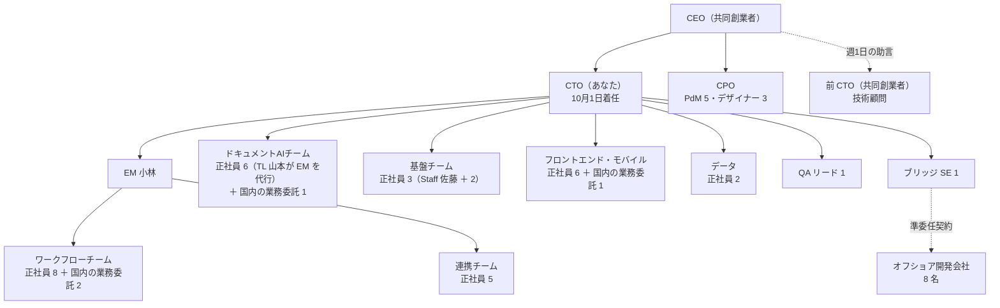
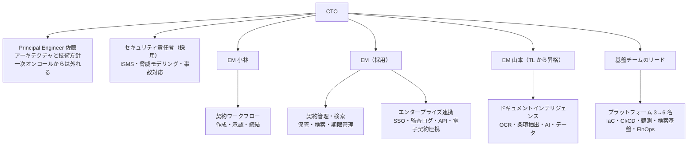

# 15.3 CTOシミュレーション — 戦略・組織・予算

> CTO として着任した初日、机の上には障害の一覧、下がり続ける開発の指標、膨らむクラウドの請求書、「AI で何か出してほしい」という CEO のメモが並んでいます。この章では、架空の B2B SaaS 企業の CTO になりきり、限られた時間・予算・人で何を優先し、何をやらないかを決め、90 日計画・技術戦略・組織・採用と予算・取締役会資料・リスク登録簿・AI 利用方針にまとめます。

| 項目 | 内容 |
|---|---|
| 学習時間の目安 | 本文 3h ＋ 演習 40h |
| 形式 | 個人で成果物を作り、CEO・CFO への説明をロールプレイする（1 人で取り組む方法も後述） |
| 前提となる章 | 第13部・第14部の全章が目安。詳しくは下の「前提となる章」 |
| キーワード | 90 日計画, 診断, 良い戦略の核（kernel）, チームトポロジー, キーパーソンリスク, 採用計画, 予算, FinOps, 取締役会, リスク登録簿, AI 利用方針, ISMS, SOC 2 |

## 目的

- [ ] 大量の断片的な情報から、組織が直面している本当の課題を診断し、根拠とともに 1 段落で書ける
- [ ] Richard Rumelt の「良い戦略の核（診断・基本方針・一貫した行動）」の形で、2 ページの技術戦略を書ける
- [ ] 着任後 90 日の計画を、「聞く → 決める → 動かす」の順序と、測れる成果で書ける
- [ ] 組織の設計・採用計画・予算を、戦略と矛盾しない形でつなげ、CFO の制約の中に収められる
- [ ] 取締役会に、悪いニュースを隠さずに、判断してほしいことを明確にして説明できる
- [ ] リスク登録簿と AI 利用方針の骨子を書き、技術・法務・人のリスクを経営の言葉で扱える

この章には、第13部と第14部で学んだことのほぼすべてが登場します。完璧な答えはありません。評価されるのは、**限られた資源の中で、何を選び、何を捨て、その理由を関係者に説明できるか** です。

## 前提となる章

| 成果物 | 主に使う章 |
|---|---|
| 診断・90 日計画 | [14.1 CTOの役割](../../14-cto/01-role-of-cto/README.md)、[13.3 エンジニアリングマネジメントの基礎](../../13-technical-leadership/03-engineering-management/README.md)、[13.7 デリバリーと生産性](../../13-technical-leadership/07-delivery-and-productivity/README.md) |
| 技術戦略 | [14.2 技術戦略の立て方](../../14-cto/02-technology-strategy/README.md)、[13.2 技術的意思決定と設計レビュー](../../13-technical-leadership/02-technical-decisions/README.md)、[8.5 リファクタリングと技術的負債](../../08-software-engineering/05-refactoring-and-tech-debt/README.md) |
| 組織・採用 | [13.6 チームと組織の設計](../../13-technical-leadership/06-team-and-org-design/README.md)、[13.4 採用](../../13-technical-leadership/04-hiring/README.md)、[13.5 育成・評価・キャリアラダー](../../13-technical-leadership/05-growth-and-evaluation/README.md)、[13.1 テックリードとStaffエンジニア](../../13-technical-leadership/01-tech-lead-and-staff/README.md) |
| 予算・コスト | [14.3 事業と財務のリテラシー](../../14-cto/03-business-and-finance/README.md)、[10.6 クラウドコスト管理（FinOps）](../../10-cloud-and-sre/06-finops/README.md) |
| 取締役会 | [14.4 経営陣・取締役会・投資家とのコミュニケーション](../../14-cto/04-executive-communication/README.md) |
| リスク・セキュリティ・法務 | [14.5 ガバナンス・リスク・コンプライアンスと法務](../../14-cto/05-governance-risk-compliance/README.md)、[14.6 危機管理](../../14-cto/06-crisis-management/README.md)、[11.1 セキュリティの基本原則と脅威モデリング](../../11-security/01-security-principles/README.md)、[11.5 セキュリティ運用とサプライチェーン](../../11-security/05-security-operations/README.md) |
| 信頼性 | [10.3 信頼性設計とSLO](../../10-cloud-and-sre/03-reliability-engineering/README.md)、[10.5 インシデント対応とポストモーテム](../../10-cloud-and-sre/05-incident-management/README.md) |
| AI | [14.8 AI戦略とAIガバナンス](../../14-cto/08-ai-strategy/README.md)、[12.4 LLMアプリケーション開発](../../12-data-and-ai/04-llm-applications/README.md)、[12.5 AIシステムの本番運用](../../12-data-and-ai/05-mlops-llmops/README.md) |
| 自分自身 | [14.9 CTOの自己管理とキャリア](../../14-cto/09-sustaining-yourself/README.md) |

## シナリオ

> 本章の企業・製品・人物・数値はすべて架空です。人名は仮名で、実在の人物とは関係ありません。

### 会社のプロフィール

株式会社クラウゼルは、企業の法務部門向けに契約管理 SaaS「クラウゼル」を提供しています。契約書の作成・レビュー・社内承認のワークフロー、電子契約サービスとの連携、締結後の保管・全文検索・期限管理（更新や解約の通知）、紙の契約書の OCR による取り込み、条項の自動抽出（ルールと小さな機械学習モデル）が主な機能です。

| 項目 | 値 |
|---|---|
| 設立 | 2019 年 |
| 資金調達 | 2025 年 6 月にシリーズ B で 30 億円。現預金 32 億円、営業赤字は月 1.1 億円。シリーズ C を 2027 年後半に予定し、2029 年ごろの株式上場を目指している |
| ARR（年間経常収益） | 15 億円（前年比 +42%。前々年は +85%） |
| 顧客 | 約 1,100 社（中堅企業が中心。大企業は 60 社） |
| 売上継続率（NRR） | 108% |
| 解約 | 過去 12 か月で 42 社。理由は、障害・性能 38%、価格 24%、機能不足 21%、先方の組織変更 17% |
| 売上総利益率 | 71%（前年 78%。クラウドと外部 API の費用の増加による） |
| 従業員 | 160 名。うちエンジニアリング組織 45 名（正社員 33 名・業務委託 12 名。CTO を除く） |
| 決算期 | 12 月 |

### あなたの立場

あなたは 2026 年 10 月 1 日に、外部から CTO として入社します。共同創業者で前任の CTO は、8 月に退任して技術顧問（週 1 日）になりました。前任者は技術的には優秀でしたが、組織が 20 名を超えたころから「全部を自分で判断する」やり方が限界に達していた、というのが CEO の見立てです。12 月 10 日に取締役会があり、CEO はそこで「新 CTO の方針」と「AI 戦略」を示したいと考えています。

### データ

**開発の状況**（DORA の 4 指標と、ロードマップの達成率）

| 指標 | 1 年前 | 現在（直近 3 か月） |
|---|---|---|
| デプロイ頻度 | 1 日 2〜3 回 | 週 2 回 |
| 変更のリードタイム（中央値） | 2 日 | 11 日 |
| 変更失敗率 | 9% | 24% |
| 復旧時間（中央値） | 1.5 時間 | 6 時間 |
| 四半期に約束した項目の完了率 | 75% | 45% |

**過去 6 か月の障害**

| 日付 | 継続時間 | 深刻度 | 概要 | 現状 |
|---|---|---|---|---|
| 2026-04-30 | 2 時間 | 高 | 月末の締結ピークに承認ワークフローが停止。デプロイに含まれた DB のマイグレーションが大きなテーブルをロックした | ポストモーテムは未実施 |
| 2026-06-12 | 9 時間 | 高 | 全文検索クラスタのディスクがあふれ、検索が停止。復旧できるのが佐藤さんだけで、休暇中に呼び戻した | ポストモーテムは実施。アクションアイテム 7 件のうち完了 1 件 |
| 2026-07-22 | 発覚まで 11 日 | 最高 | 共有リンクのプレビュー画像のキャッシュのキーにテナントが含まれておらず、3 社の契約書の件名とサムネイルが、別の 2 社のユーザーに表示された（計 41 件）。顧客からの問い合わせで発覚した | 影響した顧客への説明は完了。個人情報保護委員会への報告の要否は、法務と外部の弁護士が検討中。再発防止策は「キャッシュのキーの修正」だけ |
| 2026-08-18 | 26 時間（処理の遅延） | 中 | 四半期末に OCR のジョブが滞留。調べると、再処理ジョブのバグで 2 か月間すべての文書を 2 回 OCR にかけていた（OCR の API 費用も 2 倍に） | バグは修正済み |
| 2026-09-03 | 40 分 | 中 | 電子契約サービスの API の仕様変更に追随できておらず、締結済み契約の取り込みが失敗 | 修正済み |
| 2026-09-15 | 25 分 | 中 | API 連携用ドメインの TLS 証明書が期限切れになり、API 連携を使う 12 社の連携が停止。更新の通知が、佐藤さんの個人のメールアドレスに届いていた | 修正済み |

**組織図**（2026 年 9 月）

- セキュリティの専任者はいません。佐藤さんと前任の CTO が兼務していました。
- EM は小林さん 1 人で、直属と間接を合わせて 15 名を見ています。1on1 は月 1 回が精一杯です。
- オフショア開発会社の 8 名は、主に回帰テストの手作業と、ワークフロー機能の一部の実装を担当しています。社員がオフショアのメンバーに Slack で直接作業を依頼することが常態化しています。

**エンゲージメント調査**（2026 年 8 月。回答率 82%、5 段階の平均）

| 項目 | 6 か月前 | 現在 |
|---|---|---|
| 仕事のやりがい | 4.1 | 3.9 |
| 成長の機会 | 3.8 | 3.3 |
| 上司（EM・TL）からの支援 | 3.7 | 3.2 |
| 心理的安全性 | 3.9 | 3.4 |
| 業務量・オンコールの負担 | 3.2 | 2.4（基盤チームは 1.7） |
| 技術的負債への対処 | 2.9 | 2.3 |
| 報酬の納得感 | 3.1 | 2.8 |
| 会社の方向性への信頼 | 3.8 | 3.1（ドキュメント AI チームは 2.6） |
| eNPS（推奨者の割合 − 批判者の割合） | +5 | −18 |

自由記述から（抜粋）:

- 「何を優先すべきかが毎週変わる。CEO から Slack で直接頼まれることも多い」
- 「障害が起きると結局、佐藤さん頼み。佐藤さんが倒れたら終わる」
- 「オフショアのコードのレビューに時間を取られて、自分の仕事が進まない」
- 「AI、AI と言われるが、何を作るのかは誰も決めていない」
- 「給料を上げてほしいというより、やったことを正当に評価してほしい」

**採用**（過去 12 か月）

| 指標 | 値 |
|---|---|
| 募集中のポジション | 12 |
| 入社 | 4 名 |
| 退職 | 5 名（うちシニア 3 名。1 名は競合 X 社へ） |
| 内定の承諾率 | 35% |
| 募集から入社までの平均日数 | 110 日 |
| 辞退の主な理由 | シニアへの提示額が市場より 10〜15% 低い。オンコールの負担。面接で技術的負債について正直に話すと、懸念される |

**顧客からの要望**（関係する ARR は重複を含む）

| 要望 | 要望した顧客 | 関係する ARR | 備考 |
|---|---|---|---|
| SAML による SSO | 23 社 | 既存と商談で 3.1 億円 | 大企業の商談 8 件で必須 |
| ISMS 認証または SOC 2 報告書 | 上位の商談 10 件中 7 件 | 商談 4.2 億円 | 営業が「来期中に取得予定」と回答済み（技術部門とは合意していない） |
| 監査ログ・IP アドレス制限 | 15 社 | 1.8 億円 | |
| AI による契約書のリスクの指摘 | 31 社 | 不明（支払い意思は未確認） | 競合 X 社が 2026 年 7 月に同様の機能を発表 |
| 検索の性能の改善 | 40 社 | 既存 2.2 億円 | 解約理由の上位 |
| 電子契約サービスの連携先の追加 | 12 社 | 0.9 億円 | |

大企業の顧客のうち 18 社とは、個別の契約で「顧客のデータを機械学習の学習に使わない」と約束しています。

**クラウド費用**（月額、万円）

| 項目 | 1 年前 | 現在 | 増減 | メモ |
|---|---|---|---|---|
| Kubernetes のワーカーノード | 380 | 540 | +42% | CPU 使用率の平均 21%。ノードの種類は 2 年前のまま |
| マネージド PostgreSQL | 240 | 330 | +38% | 本番は複数ゾーン構成。検証環境も本番と同じサイズ |
| 全文検索クラスタ | 170 | 320 | +88% | 7 年分の全文書を高速なストレージに保持。レプリカは 2 |
| OCR・生成 AI の API | 70 | 290 | +314% | 再処理バグによる重複分（約 100 万円/月）を含む。AI 機能の試作も |
| オブジェクトストレージ | 150 | 160 | +7% | 全文書が標準のストレージクラス。古いバージョンを無期限に保持 |
| NAT ゲートウェイ・データ転送 | 80 | 170 | +113% | OCR の API への文書の送信が NAT ゲートウェイを経由している |
| ログ・監視 | 110 | 150 | +36% | 本番でデバッグレベルのログを出している |
| 非本番環境 | 90 | 150 | +67% | プルリクエストごとのプレビュー環境が削除されずに残っている（平均 60 個） |
| その他 | 60 | 50 | −17% | |
| 合計 | 1,350 | 2,160 | +60% | 月次売上（約 1 億 2,500 万円）の 17.3% |

取締役会は「クラウド費用を売上比 12% 以下に」と求めています。

**予算**（エンジニアリング関連の年額、2026 年の見込み）

| 項目 | 年額 |
|---|---|
| 正社員の人件費（33 名。法定福利費などを含む） | 3 億 2,000 万円 |
| 業務委託（国内 4 名） | 6,700 万円 |
| 業務委託（オフショア 8 名、準委任） | 6,000 万円 |
| クラウド | 2 億 3,000 万円 |
| SaaS ツール（監視・CI・開発ツールなど） | 3,200 万円 |
| 採用費（人材紹介の手数料など） | 1,800 万円 |
| 研修・カンファレンス | 300 万円 |
| 合計 | 7 億 3,000 万円 |

CFO からの条件: 「2027 年のエンジニアリング関連の総額は、2026 年の見込みの +12%（約 8 億 1,800 万円）まで。シリーズ C の前に、売上総利益率を 75% 以上に戻したい」。

**キーパーソン**: 佐藤さん（仮名）は創業メンバーの Staff エンジニアで、文書処理のパイプラインと全文検索の設計者です。クラウドの管理者アカウント（ルートアカウントの多要素認証の端末を含む）、ドメインと DNS の管理アカウント（佐藤さんの個人のメールアドレスで登録）を 1 人で握っており、すべての障害のエスカレーション先です。6 月には休暇中に呼び戻されました。最近、同僚に「疲れた」と漏らしており、他社からの誘いを 2 件断ったという噂があります。

### CEO からのメモ

> 着任おめでとう。最初にお願いしたいことを書いておきます。
>
> 1. 12 月の取締役会で AI 戦略を話したい。X 社が AI レビュー機能を出して、商談で比べられている。3 か月で何か出せないだろうか。
> 2. 採用がまったく進まない。エンジニアが増えれば、もっと速く作れるはず。
> 3. CFO からクラウド費用が高すぎると言われている。
> 4. 営業が「ISMS か SOC 2 は来期に取る」と大口の見込み客に言ってしまった。
> 5. 取締役の 1 人から「いっそ AI 前提で作り直したらどうか」と言われた。どう思う？
> 6. 佐藤さんが辞めたら本当に困る。
> 7. 例のデータの件（7 月の表示の件）は、もう落ち着いたと思っている。
>
> とにかく、以前のスピードを取り戻してほしい。期待しています。

## 成果物

| # | 成果物 | 形式と分量の目安 |
|---|---|---|
| 1 | **診断メモ**: 何が起きていて、なぜか。根拠のデータ | 1〜2 ページ |
| 2 | **90 日計画**: 0〜30 日・31〜60 日・61〜90 日ごとの目的・行動・成果（測れる形で）・やらないこと | 表 1 枚＋補足 |
| 3 | **技術戦略**: Rumelt の核（診断・基本方針・一貫した行動）に沿って | A4 で 2 ページ（2,500〜3,000 字程度） |
| 4 | **組織設計**: チームの構成・責務・レポートライン・移行の手順と時期 | 図 1 枚＋説明 1 ページ |
| 5 | **採用計画と予算**: 役割・時期・人数・費用・根拠。採用以外の手段（育成・契約の見直し）も。2027 年の予算が CFO の条件に収まることを示す | 表 2 枚 |
| 6 | **取締役会資料の構成**: 10〜12 枚の各スライドの見出しとキーメッセージ、1 枚目の要約の全文 | 1〜2 ページ |
| 7 | **リスク登録簿**: 10 件以上。可能性・影響・対策・兆候・担当 | 表 |
| 8 | **AI 利用方針の骨子**: 社内での AI ツールの利用と、製品への AI 機能の組み込みの両方 | 見出しと要点で 1〜2 ページ |
| 9 | （任意）**CEO のメモへの返信**: 7 つの項目それぞれへの回答 | 1 ページ |

## マイルストーン

| # | 内容 | 目安 | 受け入れ基準 |
|---|---|---|---|
| L1 | **診断**: データをすべて読み、症状と原因を分け、原因どうしの因果関係を図にする。仮説と、それを確かめるために着任後に集める情報を書く | 8h | 症状（遅い・壊れる・辞める）と構造的な原因が区別されている。すべての主張にデータの根拠がある。「データからは分からないこと」が明記されている |
| L2 | **90 日計画** | 5h | 最初の 30 日に「聞く」活動と、待てない安全上の対応が両方ある。組織変更の時期が診断の後になっている。各期間の成果が測れる |
| L3 | **技術戦略** | 6h | 診断・基本方針・一貫した行動の 3 部構成。基本方針から「やらないこと」が導かれている。行動どうしが互いを強め合っている |
| L4 | **組織設計・採用計画・予算** | 8h | チームの境界と責務が戦略と一致している。採用の人数が受け入れ能力（オンボーディング）と整合している。2027 年の予算の合計が CFO の上限以内 |
| L5 | **リスク登録簿・AI 利用方針** | 6h | リスクが 10 件以上で、技術・人・法務・財務にまたがっている。AI 利用方針にデータの分類と顧客との約束（学習に使わない）の扱いがある |
| L6 | **取締役会資料と説明のロールプレイ** | 5h | 1 枚目で結論と「取締役会に決めてほしいこと」が分かる。悪いニュースが隠されていない。CEO 役・CFO 役からの質問に答えた記録がある |

**ロールプレイの進め方**: 3 人以上なら、CEO 役・CFO 役・（取締役の）投資家役を決め、あなたが 15 分で説明し、30 分の質疑を受けます。CEO 役は「3 か月で AI を出したい」、CFO 役は「予算は増やせない」、投資家役は「作り直した方が早いのでは」という立場を崩さずに質問してください。1 人の場合は、[15.2 の 1 人で取り組む方法](../02-architecture-capstone/README.md) と同じく、日を置いて役ごとに読み直すか、AI アシスタントに役を頼みます（その場合も、評価の妥当性は自分で確かめます）。

## 評価基準（ルーブリック）

合格ラインは **すべての観点で 2 以上**。3 が半分以上あれば、実際の CTO の着任時の計画として通用する水準です。

| 観点 | 1 要改善 | 2 合格 | 3 優秀 |
|---|---|---|---|
| 診断 | 症状の列挙（障害が多い・遅い・人が辞める）で終わっている | 症状と構造的な原因を分け、データで裏づけている | 原因どうしの因果関係（悪循環）を示し、どこを断てば全体が改善するかを特定している |
| 戦略 | 目標やスローガンの羅列（「AI ファースト」「品質向上」） | 診断・基本方針・一貫した行動がそろい、やらないことが明記されている | 行動どうしが資源と効果の面で互いを強め合い、数字で進捗を測れる |
| 優先順位とトレードオフ | CEO のメモの 7 項目すべてに「はい」と答えている | 優先順位があり、後回しにするものとその理由を関係者に説明できる | 優先順位の判断基準を明示し、状況が変わったら見直す条件まで書いている |
| 90 日計画 | 初日から大きな変更（組織変更・書き直し）を始める | 聞く → 決める → 動かすの順序で、待てない安全対策は初週に行う | 各期間の成果の指標と、関係者ごとの対話の計画（誰と・いつ・何を）がある |
| 組織設計 | 図の書き換えだけで、理由と移行の手順がない | チームの境界が価値の流れと戦略に沿い、EM の管理範囲が現実的 | キーパーソンへの依存の解消・オンコールの持続性・業務委託の契約上の注意まで設計に入っている |
| 採用と予算 | 採用人数が根拠なく多い。予算の上限を無視 | 役割ごとの根拠と時期、受け入れ能力との整合、上限内の予算 | クラウドの削減などで原資を作り、採用以外の手段（報酬の見直し・正社員化・育成）と組み合わせている |
| 取締役会への説明 | 技術の用語が多く、結論と依頼が分からない | 1 枚目で結論と依頼が分かり、悪いニュースも事実として示している | 事前の根回しの計画があり、質問を予測した補足資料を用意している |
| リスク管理 | 技術的なリスクだけ | 技術・人・法務・財務にまたがり、兆候と担当がある | 優先度の根拠があり、受容するリスクとその理由・見直しの時期が明記されている |
| AI 方針 | 「AI を活用する」だけ、または一律禁止 | データの分類・承認済みツール・顧客との約束・人のレビューを扱っている | 製品の AI 機能の評価（精度の測り方）・費用の上限・法的な論点・事故時の対応まで含む |
| 人への配慮 | キーパーソンや疲弊したチームへの対応がない | キーパーソンとの対話・負荷の軽減・引き継ぎの計画がある | 人の尊厳と組織のリスクの両方を扱い、本人の動機に沿った役割の再設計を提案している |

## ヒント

### よくある罠

1. **ビッグバンの書き直しを提案する**: 取締役の「作り直したら」に乗りたくなりますが、書き直しの間は既存の製品が止まり、顧客の要望（SSO・ISMS・検索の性能）が 1 年以上放置されます。書き直しは、終わるまで価値を生まない最も大きな賭けです。問題の大半は、コードではなく組織・プロセス・運用にあります。
2. **診断する前に組織を変える**: 着任 2 週目に組織図を書き換えると、現場の信頼を失い、しかも間違った境界を引きがちです。組織変更は、1on1 と診断を終えた 60〜75 日目ごろが目安です。ただし、安全に関わること（キーパーソンの負荷、データ事故の後始末）は待てません。
3. **すべてに「はい」と言う**: AI・ISMS・SSO・検索・コスト・採用のすべてを同時に最優先にすると、何も終わりません。戦略とは、やらないことを決めることです。
4. **データ事故を終わったことにする**: CEO は「落ち着いた」と思っていますが、報告の要否の判断は未了で、再発防止は表面的な修正だけです。テナント分離の仕組みそのもの（テストや設計）の欠陥として扱い、法務と連携して手続きを完了させるのは、CTO の最初の責任の 1 つです（[14.6](../../14-cto/06-crisis-management/README.md)）。
5. **キーパーソンの問題を「文書化」だけで解こうとする**: 佐藤さんに「全部書いておいて」と頼むのは、疲れている人にさらに仕事を積むことです。まず本人と話し、負荷を下げ、役割を本人の動機に合わせて再設計し、アクセス権を会社の管理下に移し、2 人目の担当者をペアで育てます。
6. **信頼性を削ってコストを下げる**: 冗長構成やバックアップを削れば費用は下がりますが、データ事故と障害で揺らいでいる信頼をさらに失います。まずは明らかな無駄（使われていない環境、過剰なログ、NAT 経由の転送、重複処理）から手を付けます。
7. **人を増やせば速くなると考える**: 受け入れの仕組み（オンボーディング、レビュー、ドキュメント）がないまま採用を急ぐと、既存のメンバーの時間が奪われ、短期的にはむしろ遅くなります（Fred Brooks が『人月の神話』で指摘した、遅れているプロジェクトに人を足すとさらに遅れる、という現象）。
8. **AI 機能を「3 か月で出す」ことに同意する**: 顧客の機密文書を扱う製品で、評価の仕組み・データの取り扱いの合意・人のレビューなしに AI の指摘を出すと、誤りが顧客の損害につながります。出すなら、範囲を絞った β 版を、協力してくれる顧客と、測れる基準つきで。
9. **取締役会で悪いニュースを隠す**: 障害・データ事故・離職は、後から知られるほど信頼を失います。事実と対策と依頼をセットで示します。

### 診断の進め方

- 症状を集める: 遅い（リードタイム 2 日 → 11 日）、壊れる（変更失敗率 9% → 24%）、辞める（eNPS +5 → −18、シニアの退職）、高い（クラウド +60%）。
- 症状の間の因果をつなぐ: たとえば「障害が増える → 佐藤さんと基盤チームが割り込みに追われる → 基盤の改善が進まない → さらに障害が増える」「オンコールが重い → 辞める・採用で断られる → 残った人の負荷が増える」。こうした悪循環（自己強化するループ）を見つけたら、どこを断てば他も改善するかを考えます。
- データからは分からないことを書く: 障害の原因の分布、コードベースの状態、各メンバーの本音、顧客の本当の優先順位。これらは最初の 30 日の「聞く」活動で確かめます。

### 技術戦略の書き方

Rumelt は『良い戦略、悪い戦略』で、良い戦略の核を次の 3 つとしています。

| 要素 | 問い | 悪い例 |
|---|---|---|
| 診断 | 何が本当の課題か。なぜ難しいのか | 「成長のため、あらゆる面でエンジニアリングを強化する必要がある」（何も診断していない） |
| 基本方針 | その課題にどういう方針で立ち向かうか。何をしないか | 「AI ファースト・品質ファースト・スピードファースト」（すべてが一番では方針にならない） |
| 一貫した行動 | 方針を実現する、互いに強め合う具体的な行動 | 無関係な施策の一覧（施策どうしが資源を奪い合う） |

2 ページに収めるには、診断を 1 段落、基本方針を 3〜5 文、行動を 5〜7 項目にします。各行動には、担当・時期・成果の指標を 1 行で添えます（[14.2](../../14-cto/02-technology-strategy/README.md)）。

### 90 日計画のテンプレート

| 期間 | 目的 | 主な行動 | 成果（測れる形） | やらないこと |
|---|---|---|---|---|
| 0〜30 日 | 聞く・止血する | | | |
| 31〜60 日 | 決める | | | |
| 61〜90 日 | 動かす | | | |

「聞く」活動では、全員に同じ質問をすると、答えを比べられます。例: 「今、最も時間を奪っているものは何ですか」「あなたが CTO なら最初に何を変えますか」「変えてほしくないものは何ですか」「私が知っておくべきなのに、誰も言わないことは何ですか」。

### 予算の組み立て方

1. 2026 年の見込み（7 億 3,000 万円）を出発点に、項目ごとに 2027 年の値を置く
2. 採用は、入社の月から数える（年の途中に入社する人の費用は、その年は一部だけ）。人件費には給与だけでなく法定福利費などを含める（給与のおおむね 15% 前後とされることが多いが、会社の実績で確かめる）
3. 人材紹介会社の手数料は、成功報酬として理論年収の 30〜35% 程度とされることが多い（契約による）
4. クラウドの削減は、月額の推移（四半期ごとにいくらまで下がるか）で年額にする
5. 合計が上限（約 8 億 1,800 万円）に収まるか確かめ、予備費を残す

具体的な金額や契約の条件、労務・税務の扱いは、財務・人事・専門家に確認してください（[14.3](../../14-cto/03-business-and-finance/README.md)）。

### 業務委託との付き合い方

「社員がオフショアのメンバーに Slack で直接作業を依頼する」状態には、品質とコミュニケーションの問題に加えて、契約上のリスクがあります。一般に、請負でも準委任でも、発注者が受託側の作業者に直接指揮命令すると、実態は労働者派遣だとみなされる（いわゆる偽装請負）おそれがあります。依頼は受託側の責任者（ここではブリッジ SE の窓口）を通し、成果物と受け入れの基準で管理します。具体的な判断は専門家に確認してください（[14.5](../../14-cto/05-governance-risk-compliance/README.md)）。

### ISMS と SOC 2

どちらも「情報セキュリティの管理の仕組みが整っていること」を第三者が確認するものですが、性質が違います（2026 年時点の一般的な整理です。実際の取得計画は認証機関・監査法人・専門家と相談してください）。

| | ISMS 認証（ISO/IEC 27001） | SOC 2 報告書 |
|---|---|---|
| 形式 | 認証機関による認証（合否） | 監査人による保証報告書（統制の記述と評価） |
| 国内での通じやすさ | 国内の企業には広く知られている | 外資系企業や海外との取引で求められることが多い |
| 期間の考え方 | 仕組みを作って運用し、審査を受ける | Type I はある時点の設計、Type II は一定の期間（数か月〜1 年）の運用状況を評価する |

商談の要求は「ISMS または SOC 2」なので、両方を同時に追う必要はありません。どちらを先にするか、範囲をどこまでにするかは、戦略上の判断です。上場準備で求められる IT 全般統制の整備とも重なる部分があります。

### AI 利用方針で扱う論点

- **データの分類と入力のルール**: 公開情報・社内情報・機密情報・顧客データのそれぞれを、どの AI ツールに入力してよいか。顧客データは、学習に使われず保存期間が限定される契約を結んだ、承認済みのサービスだけに限る、など。
- **顧客との約束**: 18 社との「学習に使わない」約束を守れる構成か。利用規約や DPA（データ処理契約）をどう改めるか。
- **製品の AI 機能の要件**: 根拠（どの条項か）の提示、人による確認、誤りの種類ごとの評価、テナントの分離、費用の上限、機能を無効にできる設定、事故時の対応。
- **法令とガイドライン**: 個人情報保護法（外部のサービスに個人データを含む文書を送る場合の扱い）、弁護士法第 72 条（弁護士でない者の法律事務の取り扱いの制限。2023 年に法務省が、AI を使った契約書の審査を支援するサービスと同条の関係についての考え方を公表している）、著作権、総務省・経済産業省の「AI 事業者ガイドライン」。いずれも 2026 年時点の最新版を確認し、具体的な判断は専門家に確認してください（[14.8](../../14-cto/08-ai-strategy/README.md)）。

## 模範解答の骨子

自分の成果物を作り終えてから開いてください。これは合格水準を満たす 1 つの解で、唯一の正解ではありません。

1. 診断メモ（要約）

クラウゼルは、中堅企業向けの「便利な契約管理ツール」から、大企業の法務部門が機密文書を預ける「信頼される基盤」へと、顧客の期待が変わる転換点にいる。しかし開発組織の仕組みは 20 名規模の創業期のままで、次の 2 つの悪循環に陥っている。

1. **信頼の悪循環**: テナント分離のテストや変更管理の仕組みがないまま機能を追加してきた結果、障害とデータ事故が増え（変更失敗率 9% → 24%）、大企業の受注（商談 4.2 億円）と既存顧客の継続（解約理由の 38% が障害・性能）を妨げている。
2. **人の悪循環**: 障害対応が佐藤さんと基盤チームに集中し（オンコールの負担 2.4、基盤チームは 1.7）、基盤の改善が進まず障害がさらに増える。負荷と報酬（市場より 10〜15% 低い）への不満がシニアの退職と採用の辞退を招き、残った人の負荷がさらに増える。

クラウド費用の急増（+60%）の大半は成長ではなく無駄（CPU 使用率 21%、重複した OCR、NAT 経由の転送、残されたプレビュー環境、デバッグログ）で、放置されてきたのは所有者がいないからである。AI への期待は正当だが、顧客の機密文書を扱う以上、信頼の仕組みを欠いた AI 機能は、機会より大きなリスクになる。

データからは分からないこと（最初の 30 日で確かめる）: 障害の原因の分布、コードベースのどこが変更を遅くしているか、各メンバーの本音と佐藤さんの意向、顧客が本当に支払う機能、データ事故の法的な評価の状況。

2. 技術戦略（2 ページの骨子）

**診断**: 上の診断メモを 1 段落に要約したもの。

**基本方針**: 今後 12 か月は「信頼を製品の中心に置く」。新しい投資は、(a) 大企業が安心して文書を預けられる仕組み（セキュリティ・信頼性・監査）と、(b) それを支える開発の基盤（基盤チームの強化とキーパーソンへの依存の解消）に集中する。AI は、既存の文書処理の強みの上で、測定できる小さな賭けから始める。全面的な作り直しと、エンタープライズ対応と解約の防止に関係しない新機能の追加は、この期間は行わない。

**一貫した行動**:

| 行動 | 内容 | 成果の指標（12 か月後） |
|---|---|---|
| 1. セキュリティと監査の基盤 | セキュリティ責任者の採用、ISMS 認証の取得（範囲は製品と開発組織）、SSO（SAML）・監査ログ・IP 制限、全 API へのテナント越境テストの導入 | ISMS 認証の取得、SSO の必須な商談の失注ゼロ |
| 2. 信頼性の回復 | SLO の導入、小さく頻繁なデプロイと安全なマイグレーションの手順、月末の締結ピーク前の変更凍結、ポストモーテムのアクションの完遂 | 変更失敗率 10% 以下、復旧時間の中央値 1 時間以下 |
| 3. 基盤とキーパーソン依存の解消 | 基盤チームを 3 名から 6 名へ、主要な 5 システムにそれぞれ 2 名以上の担当者、オンコールを 6 名以上の輪番に、管理者権限を会社の管理下へ | 主要な 5 システムの担当者が 2 名以上 |
| 4. コストの規律 | クラウド費用に所有者と予算を付け、明らかな無駄から削減（月額を約 35% 下げる）。浮いた原資を 1〜3 と採用に回す | クラウド費用の売上比 12% 以下、売上総利益率 75% 以上 |
| 5. AI の小さな賭け | 「AI による契約リスクの指摘」の β 版を、協力顧客 3 社と 12 週間で検証。評価用のデータセット、根拠の提示、人の確認、学習に使わない構成 | 協力顧客の継続利用の意向、指摘の精度の目標値の達成、1 文書あたりの費用 |
| 6. 組織と人 | 価値の流れに沿ったチームへの再編、EM の増員、報酬の見直し、業務委託の範囲の明確化 | eNPS をプラスに、シニアの退職ゼロ、内定の承諾率 50% 以上 |

行動どうしの関係: 4 のコスト削減が 1〜3 と採用の原資を生み、3 の基盤の強化が 2 の信頼性と 1 の監査に必要な運用を支え、1 と 2 が大企業の受注と解約の防止につながり、その成果が 5 の AI 機能を顧客に信頼してもらう前提になる。

3. 90 日計画

| 期間 | 目的 | 主な行動 | 成果 | やらないこと |
|---|---|---|---|---|
| 0〜30 日 | 聞く・止血する | 全メンバー（業務委託の窓口を含む）との 1on1。上位 10 社と、データ事故で影響を受けた顧客への訪問（CS と同行）。CEO・CFO・CPO との週次の場。**初週に**: 佐藤さんとの対話と一次オンコールからの解放、ドメイン・DNS・クラウドの管理者権限を会社の管理下へ（緊急用アカウントの手順も）、データ事故の法的な評価の状況の確認と、テナント越境の仕組み的な原因の調査の開始。リスクのないコスト削減（残ったプレビュー環境の削除、ログのレベル） | 診断メモを CEO と開発組織に共有。オンコールの輪番が 4 名以上 | 組織変更の発表、AI 機能のリリース日の約束、書き直しの検討 |
| 31〜60 日 | 決める | 技術戦略の草案を CEO・CPO・CFO・リーダーとレビュー。ISMS を先に取る判断と、営業の約束の修正（時期を現実的に再設定し、商談ごとに説明）。AI の 2 週間の検証（協力顧客 3 社、評価用データ、法務の確認）。報酬レンジの見直し案。FinOps の体制（費用の所有者とタグ付け） | 戦略の合意。ISMS のプロジェクト開始。セキュリティ責任者と EM の募集開始 | 大規模な採用の一斉開始（受け入れの仕組みがまだない） |
| 61〜90 日 | 動かす | 組織の再編の発表（所有者の地図つき）と移行。12 月 10 日の取締役会（事前に CEO・CFO・主要な投資家と個別に根回し）。CPO と次の四半期のロードマップを、人員の配分（例: エンタープライズ対応 40%・信頼性と負債 20%・既存機能 25%・AI 15%）で再計画 | 取締役会で予算と優先順位の承認。クラウドの月額 −10%（重複 OCR の解消分、プレビュー環境の削除、ログの削減）。主要な 5 システムのうち 3 つで担当者 2 名以上 | 承認前の予算の執行 |

4. 組織設計

- 顧客に価値が届く流れ（作る → 締結する → 保管して探す → 大企業の要件を満たす → 文書を理解する）に沿って、4 つのチームに分けます。フロントエンドのメンバーは各チームに入り、横断の勉強会（ギルド）で技術を揃えます。『チームトポロジー』の言葉では、4 つが価値の流れに沿ったチーム（stream-aligned team）、基盤がプラットフォームチーム、セキュリティ責任者は当面、各チームを支援するイネーブリングの役割です。
- 検索は解約理由の上位で、大企業の要件とも関係が深いので、独立したチームにして EM を採用で補います。それまでは小林さんが兼務しないよう、CTO が一時的に見ます。
- 佐藤さんは、本人と話した上で、人のマネジメントではなく技術方針と設計に集中する Principal Engineer の役割を提案します（本人が望まなければ別の形を考えます）。
- オフショア開発会社への依頼は、ワークフローチームの EM と受託側の責任者の間で、作業の範囲（テストの自動化、明確に切り出せる実装）と受け入れの基準で管理します。社員から個々の作業者への直接の依頼はやめます。
- 発表は 75 日目ごろ。事前に、影響を受けるメンバー全員と個別に話します。

5. 採用計画と予算

採用（12 か月で 8 名。うち 2 名は国内の業務委託からの正社員化）:

| 役割 | 人数 | 入社の目安 | 理由 |
|---|---|---|---|
| セキュリティ責任者 | 1 | 2027 年 1〜3 月 | ISMS・SSO・事故対応の責任者がいない |
| EM（契約管理・検索とエンタープライズ連携） | 1 | 2027 年 1〜3 月 | 小林さんの管理範囲（15 名）を減らす |
| SRE | 2 | 2027 年 1〜6 月 | オンコールの輪番とキーパーソン依存の解消 |
| シニアバックエンド（検索） | 1 | 2027 年 4〜6 月 | 解約理由の上位 |
| ML / LLM エンジニア | 1 | 2027 年 4〜6 月 | AI の β 版の評価と改善 |
| 業務委託からの正社員化 | 2 | 2027 年 1〜3 月 | 本人が希望する場合。知識の定着 |

受け入れ能力: 1 チームに 1 四半期あたり新メンバー 2 名までを目安にし、オンボーディングの担当者を事前に決めます。報酬: シニアの報酬レンジを市場水準に合わせる（対象 15 名に平均 +8%）。

予算（年額、万円）:

| 項目 | 2026 年の見込み | 2027 年の計画 | 根拠 |
|---|---|---|---|
| 正社員の人件費 | 32,000 | 38,080 | 報酬の見直し 1,240、新規 8 名（1 人 1,100 万円 × 平均 55% の期間）4,840 |
| 業務委託（国内） | 6,700 | 3,350 | 4 名 → 2 名（2 名は正社員化） |
| 業務委託（オフショア） | 6,000 | 3,600 | 8 名 → 5 名。範囲をテストの自動化などに限定 |
| クラウド | 23,000 | 19,530 | 月額 2,160 → 四半期ごとの平均 1,950・1,700・1,450・1,410 |
| AI 機能の API・評価の基盤 | — | 1,500 | β 版の検証と運用 |
| SaaS ツール | 3,200 | 3,600 | セキュリティのツールを追加、重複を整理 |
| セキュリティ認証の外部費用 | — | 2,500 | ISMS の取得支援・審査・ツール（見積もりの例） |
| 採用費 | 1,800 | 2,400 | 外部からの 6 名分の紹介手数料と採用広報 |
| 研修 | 300 | 600 | EM の研修を含む |
| オンコール手当・リテンション | — | 600 | オンコールの負担を報酬で認める |
| 合計 | 73,000 | 75,760 | 2026 年比 +3.8%。上限 81,760 に対して 6,000 の予備（採用が順調なら 2 名の追加や、AI の検証の拡大に充てる） |

クラウドの削減（月額、2027 年 6 月までに）: ノードの適正化と自動スケール −180、全文検索の保存階層化（直近 1 年だけ高速ストレージ）−120、OCR の重複分の解消など −120、NAT を経由しない接続への変更 −100、非本番環境の整理と夜間停止 −80、ログの削減 −60、DB の検証環境の縮小 −50、オブジェクトストレージのライフサイクル設定 −40。合計 −750（約 −35%）で月額 1,410 万円、売上比 約 11%。年換算の削減額 約 9,000 万円は ARR の約 6% に当たり、クラウド費用の大半が売上原価に計上されているなら、CFO の求める売上総利益率 75% の回復に大きく寄与します。削減の前後で、可用性と障害の件数を必ず比べます。

6. 取締役会資料の構成

| # | 見出し | キーメッセージ |
|---|---|---|
| 1 | 要約 | 信頼の回復を最優先に、コストの削減で原資を作り、AI は小さく確実に。取締役会に決めてほしいことは 3 つ |
| 2 | エンジニアリングの現状 | DORA の 4 指標・障害・コスト・人の数字をそのまま示す（悪化している事実を隠さない） |
| 3 | 診断 | 成長が仕組みを追い越した。2 つの悪循環 |
| 4 | 戦略 | 基本方針と、やらないこと（作り直しをしない理由を含む） |
| 5 | エンタープライズ対応 | SSO・監査ログ・ISMS の時期と、商談 4.2 億円・既存顧客への効果 |
| 6 | 7 月のデータ事故 | 事実・顧客対応・法的な手続きの状況・仕組みとしての再発防止 |
| 7 | AI 戦略 | 賭けの範囲、守るべき一線（顧客データ・人の確認）、成功の指標、費用、次の判断の時期 |
| 8 | 信頼性 | SLO と、変更失敗率・復旧時間の目標 |
| 9 | コスト | クラウド費用の推移と削減計画（売上比 17% → 11%）、売上総利益率への効果 |
| 10 | 組織と採用 | 新しいチーム構成、採用計画、報酬の見直し、キーパーソンの対策 |
| 11 | 予算 | 2027 年の総額と内訳（CFO の上限内） |
| 12 | リスクと取締役会へのお願い | 上位 5 件のリスク。決めてほしいこと: (1) 予算の承認 (2) 12 か月の優先順位の合意（新機能より信頼） (3) AI のリスク許容度（β 版の範囲） |

1 枚目の要約の例: 「開発組織は、成長に仕組みが追いつかず、障害とデータ事故、人の疲弊が互いを悪化させる状態にあります。今後 12 か月は信頼の回復を最優先とし、クラウド費用を約 35% 削減して原資を作り、セキュリティ・信頼性・基盤に再投資します。AI は協力顧客との 12 週間の検証から始めます。本日は、予算・優先順位・AI のリスク許容度の 3 点について、ご判断をお願いします」。

事前の根回し: CEO とは 2 回（診断の共有と資料の確認）、CFO とは予算の数字を事前に合意、主要な投資家とは 30 分の個別説明。取締役会の場で初めて聞く悪いニュースがないようにします。

7. リスク登録簿（抜粋）

| # | リスク | 可能性 | 影響 | 対策 | 兆候 | 担当 |
|---|---|---|---|---|---|---|
| 1 | 佐藤さんの離職・長期不在で、重大な障害から復旧できない | 中 | 大 | 本人との対話、負荷の軽減、役割の再設計、管理者権限の移管、ペアでの 2 人目の育成 | 1on1 での発言、休暇が取れない状態 | CTO |
| 2 | 他社のデータの表示などのデータ事故の再発 | 中 | 大 | 全 API へのテナント越境テスト、キャッシュの設計のレビュー、セキュリティ責任者の採用 | テストの網羅率、脆弱性の報告 | セキュリティ責任者 |
| 3 | 7 月のデータ事故の法的な手続きの不備 | 低〜中 | 大 | 法務・外部の弁護士と手続きを完了させ、記録を残す | 判断の期限 | CTO・法務 |
| 4 | ISMS の取得が遅れ、大型の商談を失う | 中 | 大 | 範囲を絞った取得計画、営業の約束の修正、商談ごとの説明資料 | 進捗の遅れ | セキュリティ責任者 |
| 5 | 採用の遅れで計画全体が遅れる | 高 | 中 | 報酬の見直し、紹介の制度、正社員化、削れる計画の事前の特定 | 内定の承諾率 | CTO・人事 |
| 6 | AI の誤った指摘による顧客の損害と信頼の失墜 | 中 | 大 | β 版の範囲の限定、根拠の提示、人の確認、免責の表示、評価の基準、法務の確認 | 誤りの報告 | EM 山本 |
| 7 | AI の API 費用の超過 | 中 | 中 | 1 文書あたりの費用の上限、利用量の上限、キャッシュ | 月次の費用 | EM 山本 |
| 8 | コスト削減の過程での可用性の低下 | 中 | 中 | 変更ごとの SLO の確認、段階的な実施、戻す手順 | エラーバジェットの消費 | 基盤チームのリード |
| 9 | 業務委託の契約上のリスク（偽装請負を含む）と品質 | 中 | 中 | 依頼の経路の是正、成果物と受け入れ基準の明確化、法務の確認 | 直接の依頼の再発 | EM 小林 |
| 10 | 月末の締結ピークでのワークフローの停止 | 中 | 大 | 月末の変更凍結、マイグレーションの手順、負荷試験 | 月末の障害 | EM 小林 |
| 11 | 前任 CTO（技術顧問）との指揮系統の混乱 | 中 | 中 | 顧問の役割（助言のみ・決定権なし）を CEO と文書で合意 | 現場が顧問に判断を仰ぐ | CTO・CEO |
| 12 | 資金調達の環境の悪化による予算の削減 | 低〜中 | 大 | 優先順位の明確化（削る順番を決めておく）、コスト削減の前倒し | 市況・CFO の見通し | CTO・CFO |

8. AI 利用方針の骨子

1. **目的と範囲**: 社内での AI ツールの利用と、製品の AI 機能の両方を対象にする。
2. **原則**: 顧客の信頼を最優先にする。重要な判断は人が行う。AI を使っていることを利用者に示す。効果とリスクを測って改善する。
3. **データの分類と入力のルール**:

| データ | 承認済みの企業向け AI ツール | 個人向けの一般の AI サービス |
|---|---|---|
| 公開情報 | 可 | 可 |
| 社内の一般情報 | 可 | 不可 |
| 機密情報（未公開の財務・戦略・ソースコード） | 可（ソースコードは承認済みの開発支援ツールのみ） | 不可 |
| 顧客データ（契約書など） | 製品の AI 機能として、契約と顧客の同意の範囲でのみ | 不可 |

4. **ツールの承認の審査**: 学習への利用の有無、データの保存期間、処理の場所、再委託先、セキュリティ認証、契約の条項。
5. **開発での利用**: 生成されたコードもレビューの対象。秘密情報を入力しない。ライセンスと脆弱性を確認する。
6. **製品の AI 機能の要件**: 顧客との契約（DPA）と「学習に使わない」約束の遵守、テナントの分離、根拠（どの条項か）の提示、人による確認を前提とした画面、評価（正解データでの精度、誤りの種類ごとの率）、監視、1 文書あたりの費用の上限、顧客が機能を無効にできる設定、事故時の対応。
7. **法令とガイドライン**: 個人情報保護法、弁護士法第 72 条と法務省の考え方、著作権、AI 事業者ガイドライン。最新の内容と具体的な判断は専門家に確認する。
8. **ガバナンス**: AI の利用の台帳、リスクの評価と承認者（CTO・セキュリティ責任者・法務）、半年ごとの見直し、全社員の研修。
9. **例外と違反**: 例外の申請の手順と、違反があった場合の対応。

9. CEO のメモへの返信の要点

1. **AI**: 「3 か月で一般公開」ではなく、「3 か月で協力顧客 3 社との β 版の検証を始め、取締役会では検証の設計と判断の基準を示す」と提案します。競合との比較への対応は、営業資料での「データを学習に使わない、根拠を示す」という信頼の訴求を含めて考えます。
2. **採用**: 人を増やすだけでは速くならない理由（受け入れの負荷）を説明し、報酬の見直しと、受け入れ能力に合わせた 8 名の計画を示します。
3. **クラウド費用**: 大半が無駄であることを数字で示し、2027 年 6 月まで（約 9 か月）に月額を約 35% 下げる計画を提示します。
4. **ISMS か SOC 2**: ISMS を先に、範囲を絞って進めると決め、営業とともに商談ごとに現実的な時期を説明し直します。今後、技術部門と合意していない約束を顧客にしない仕組み（事前の確認の窓口）を作ります。
5. **作り直し**: しない、と明確に答えます。問題の大半は組織と運用にあり、作り直しの間に顧客の要望が放置されるからです。ただし、検索の基盤のように、段階的に置き換えるべき部分は戦略に含めます。
6. **佐藤さん**: 着任の初週に本人と話すこと、負荷を下げることを約束し、CEO にも協力を依頼します（CEO から佐藤さんへの直接の依頼を減らすなど）。
7. **データの件**: 落ち着いていない、と率直に伝えます。法的な手続きの完了と、仕組みとしての再発防止が必要で、取締役会でも報告すべき事項です。

10. よくある弱い解答

- 成果物が施策の一覧になっていて、なぜそれを選び、何を捨てたのかが書かれていない。
- 診断に「エンジニアのスキルが足りない」「オフショアの品質が悪い」など、個人や外部の責任に帰する記述が多い。仕組みの問題として捉え直すと、打ち手が見えてきます。
- 採用計画が 20 名以上で、受け入れの能力と予算を無視している。
- AI 利用方針が「業務での AI の利用を禁止する」だけ。禁止すると、個人向けのサービスを隠れて使う人が増え、かえってリスクが高まります。
- 取締役会資料が技術の説明で埋まり、「何を決めてほしいのか」が最後まで分からない。
- 90 日計画の最初の週に、全社への戦略の発表や組織図の変更がある。
- 自分自身の持続可能性（CTO 自身の時間の使い方、相談相手）がどこにも出てこない（[14.9](../../14-cto/09-sustaining-yourself/README.md)）。

## 振り返り

1. CEO のメモの 7 項目のうち、あなたが「いいえ」または「今ではない」と答えたものはどれですか。その判断に最も影響したデータは何でしたか。
2. あなたの戦略で、最も不確かな前提は何ですか。90 日の間に、それをどうやって確かめますか。
3. 佐藤さんの立場で、あなたの計画を読んだらどう感じるでしょうか。オフショアの開発会社の立場ではどうでしょうか。
4. 取締役会で最も厳しく問われるのはどの点だと思いますか。その質問に、30 秒でどう答えますか。
5. 1 年後にこの計画を振り返ったとき、「最初の 90 日でこれをやっておけばよかった」と後悔しそうなことは何ですか。
6. あなた自身がこの会社の CTO を 3 年続けるために、どんな支え（相談相手、時間の使い方、休み方）が必要ですか。

このシミュレーションの論点の多くは、15.4 のケースで 1 つずつ深く練習できます。クラウド費用は [ケース03](../04-case-studies/cases/03-cloud-cost-doubled.md)、SOC 2／ISMS と SSO は [ケース04](../04-case-studies/cases/04-enterprise-security-requirements.md)、キーパーソンは [ケース07](../04-case-studies/cases/07-key-engineer-resignation.md)、CEO の AI 宣言は [ケース08](../04-case-studies/cases/08-ceo-ai-announcement.md)、業務委託と偽装請負は [ケース13](../04-case-studies/cases/13-vendor-quality-and-disguised-contracting.md)、共同創業者 CTO の役割は [ケース22](../04-case-studies/cases/22-cofounder-cto-and-vpoe.md) です。

この章の成果物は、実際に CTO の候補として面接を受けるとき、「着任したら何をするか」を具体的に語るための練習になります。次は [15.4 CTOケーススタディ集](../04-case-studies/README.md) で、より多様な状況での判断を繰り返し練習します。
