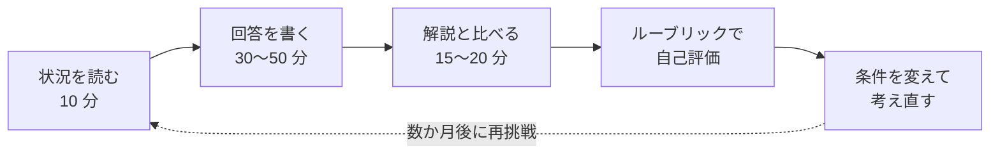

# 15.4 CTOケーススタディ集

> CTO の仕事の多くは、正解の用意されていない状況で、限られた情報と時間の中で判断し、人を動かすことです。この章では、CTO が実際に直面しうる 22 の状況を、架空の会社を舞台に再現しました。まず自分の答えを書き、次に解説と比べ、仲間と議論する。この繰り返しで、第 13 部・第 14 部で学んだ知識を「判断する力」に変えていきます。

| 項目 | 内容 |
|---|---|
| 学習時間の目安 | 本文 6h ＋ 演習 30h |
| 前提となる章 | [第 13 部 技術リーダーシップ](../../13-technical-leadership/README.md)、[第 14 部 CTO の仕事](../../14-cto/README.md)。各ケースの関連章は[ケース一覧](#3-ケース一覧)を参照 |
| 演習 | 22 のケース（記述式、解説付き）: [cases/](cases/) |
| キーワード | ケースメソッド, 意思決定, トレードオフ, ステークホルダー, 危機対応, 組織設計, ガバナンス |

学習時間の内訳は、この README と各ケースの解説を読む時間が「本文」（1 ケース 15 分程度）、各ケースに回答を書いて振り返る時間が「演習」（1 ケース 60〜90 分程度）です。勉強会の時間は含みません。

## この章のゴール

- [ ] 曖昧で情報の足りない状況から「本当の問題」を定義し直し、確かめるべき事実を挙げられる
- [ ] 関係者ごとの表の要求と、その奥にある関心や恐れを区別し、合意の段取りを設計できる
- [ ] 3 つ以上の選択肢を、前提条件とトレードオフを明示して比較できる
- [ ] 判断を、24 時間・1 週間・1 か月といった時間軸の実行計画に落とし込み、見直しの条件を置ける
- [ ] 法務・会計・労務が絡む場面で、専門家に確認すべきことと、自分で判断すべきことを区別できる
- [ ] 同じ判断を、CEO・取締役会・現場・顧客のそれぞれに合わせて説明できる

## なぜケースで学ぶのか

第 13 部と第 14 部では、採用、組織設計、技術戦略、財務、ガバナンス、危機管理などを学びました。しかし、知識があることと、現実の状況で判断できることの間には、大きな距離があります。

現実の CTO の判断が難しいのは、知らない事実があるからというより、次のような条件が重なるからです。

- **情報が足りない**: 判断に必要な事実の半分は、まだ分かっていない。
- **時間がない**: 深夜の障害、3 か月後の契約判断、来月の取締役会。
- **利害がぶつかる**: CEO、CFO、PM、顧客、現場のエンジニアが、それぞれ正しいことを言っている。
- **人が関わる**: 同じ結論でも、伝え方を誤れば、優秀な人が辞めていく。
- **やり直せない**: 一度下した判断や、一度口にした約束の多くは、取り消しにくい。

こうした状況は、実務で経験するまで練習できません。そして実務の失敗は高くつきます。経営大学院などで、実際の企業の状況を題材に議論する「ケースメソッド」が広く使われているのは、判断の経験を安全に積むためです。この章のケースは、CTO が直面しやすい状況を、技術・組織・事業・法務・危機対応の各領域から選んでいます。

## 1. ケーススタディの使い方

### 1.1 ケースの構成

各ケースは、次の順番で書かれています。

| 部分 | 内容 |
|---|---|
| 状況 | 架空の会社の概要、起きていること、関係者の発言、数字 |
| 制約 | 動かせない条件（期限、予算、人員、契約、法令など） |
| 問い | あなたが答える 3〜4 の問い |
| 考えるヒント | 行き詰まったときの手がかり |
| 解説（折りたたみ） | 検討の観点、選択肢とトレードオフ、推奨アプローチの一例、避けるべき対応、条件が変わると、関連章 |

解説の「推奨アプローチ」は、**正解ではなく、経験のある CTO が考えうる一つの答え** です。あなたの結論が解説と違っても、前提と理由が明確で、リスクと伝え方まで考え抜かれていれば、それは良い答えです。逆に、結論が同じでも、理由が浅ければ、条件が少し変わっただけで判断を誤ります。各解説の「条件が変わると」の節は、そのことを確かめるためにあります。

### 1.2 1 人で取り組む場合



1. **状況・制約・問いを読む（10 分）**。分からない用語があれば、関連章で確認します。
2. **タイマーを 30〜60 分にセットし、回答を書く**。頭の中で考えるだけでなく、必ず文字にします。「考えるヒント」は、最初の 15 分は見ずに考え、その後に確認します。
3. **解説は、回答を書き終えるまで開かない**。解説を先に読むと、「自分もそう考えていた」と思い込みやすくなります（後知恵バイアス）。書き終えた回答は、自分の判断力の正直な記録です。
4. **解説と比べる**。自分の答えとの違いを、「見落とし（考えていなかった）」「判断の違い（考えたが、別の結論にした）」「前提の違い（状況の読み方が違った）」の 3 つに分けて書き出します。学びが大きいのは、1 つ目と 3 つ目です。
5. **ルーブリック（[2. 回答の評価ルーブリック](#2-回答の評価ルーブリック)）で自己評価する**。
6. **「条件が変わると」を読み、条件を 1 つ変えた場合の答えを 5 分で考える**。

回答には、次のシートを使うと便利です。コピーして、ケースごとにファイルやノートに残してください。

```text
ケース番号:            日付:            所要時間:

1. 状況の要約（3 行以内）
2. 本当の問題は何か（問題の定義し直し）
3. 分かっていること／分かっていないこと（確かめる方法と、置く仮定）
4. 関係者と、それぞれの表の要求・本当の関心
5. 選択肢（3 つ以上）とトレードオフ
6. 推奨する案と、その理由（何が変われば判断を変えるか）
7. 実行計画（24 時間／1 週間／1 か月）
8. リスクと対策、見直しの条件
9. 伝え方（誰に、いつ、何を、どの順で）
```

ケースに書かれていない事実が必要になったら、「〜と仮定する」と明記したうえで仮定を置いてかまいません。現実の CTO も、仮定を置いて判断し、事実が分かり次第見直します。

### 1.3 勉強会で取り組む場合

4〜8 名程度の勉強会で取り組むと、1 人では気づけない視点に出会えます。CTO やエンジニアリングマネージャーの勉強会、社内のリーダー育成の場などで使ってください。

**事前の準備**

- 参加者は、状況を読んで回答を書いてくる（解説は開かない）。
- ファシリテーターだけが、事前に解説を読んでおく。

**役割**

| 役割 | すること |
|---|---|
| ファシリテーター | 時間を管理し、議論が結論の当て合いにならないよう、理由と前提に焦点を当てる |
| CTO 役（発表者） | 自分の回答をもとに、推奨案をステークホルダー役に説明する。回ごとに交代する |
| ステークホルダー役 | ケースの登場人物（CEO、CFO、PM、顧客、現場のエンジニアなど）を演じ、質問し、反論する。手加減しない（本物の CEO は遠慮しない） |
| 記録係 | 論点、選択肢、意見の分かれた点をホワイトボードなどに整理する |
| 評価者 | ルーブリックに沿って、発表者に短いフィードバックを返す |

**90 分の進行例**

| 時間 | 内容 |
|---|---|
| 0〜5 分 | ファシリテーターが、ケースの要点と今日の役割を確認する |
| 5〜15 分 | 各自の回答の要点を、1 人 1 分で共有する（結論と、最も迷った点） |
| 15〜45 分 | ロールプレイ。CTO 役が、ステークホルダー役（例: CEO と CFO）に 3 分で推奨案を説明し、質問と反論を受ける。CTO 役を交代して 2〜3 回繰り返す |
| 45〜70 分 | 全体で議論する。選択肢とトレードオフ、順番、伝え方の違いを比べる |
| 70〜80 分 | 解説を一緒に読み、自分たちの議論との違いを確認する |
| 80〜90 分 | 評価者がフィードバックし、最後に 1 人ずつ「考えが変わった点」を話す |

**進め方のコツ**

- 正解を当てる場にしない。「なぜそう判断したか」「何が分かれば判断が変わるか」を問う。
- 事実と仮定を分ける。仮定を置いた人には、その仮定を明示してもらう。
- 少数意見を歓迎する。全員の意見が一致したときこそ、ファシリテーターが反対の立場から問いかける。
- 職場の実例を持ち込むときは、会社名や個人が特定されないよう配慮し、勉強会の外に持ち出さないルールを決めておく。

### 1.4 繰り返し取り組む

ケースは一度解いて終わりではありません。次のような節目で、同じケースにもう一度取り組むことを勧めます。

- 1 回目: 第 13 部を読み終えたころ
- 2 回目: 第 14 部を読み終えた後
- 3 回目: 実務で似た状況を経験した後、または 1 年後

以前の回答を残しておき、新しい回答と比べてください。考慮する関係者が増えた、選択肢の幅が広がった、順番と伝え方が具体的になった、といった変化が、あなたの成長の記録になります。

さらに、**自分でケースを作る** ことも良い訓練です。自分や自社の経験を、会社名・人名・数字を変えて匿名化し、この章と同じ形式（状況・制約・問い・解説）で書きます。経験を他の人が考えられる形に書き直す過程で、その経験から何を学ぶべきだったのかが、はっきりします。

## 2. 回答の評価ルーブリック

回答は、次の 6 つの観点で評価します。各観点を 1〜3 点で採点します。

| 観点 | 1（要改善） | 2（標準） | 3（CTO の水準） |
|---|---|---|---|
| 問題の捉え方 | 提示された要望や症状を、そのまま解くべき問題として扱う。事実・推測・意見が混ざっている | 症状と原因を分け、確かめるべき事実を挙げている | 問題を定義し直し（「本当は何を解決すべきか」）、判断に必要な情報と、それが得られないときに置く仮定を明示している |
| ステークホルダーの視点 | 技術の観点か、自分の立場からだけ考えている | 主な関係者（経営、現場、顧客など）の関心を挙げている | 各関係者の表の要求と、その奥にある関心や恐れを区別し、誰の合意が、いつ、どの順で必要かまで設計している |
| 選択肢とトレードオフ | 案が 1 つだけ、または「やる・やらない」の二択 | 3 つ以上の選択肢の利点と欠点を比べている | 選択肢ごとの前提条件と「何が変われば判断を変えるか」を示し、組み合わせや段階的な案まで検討している |
| 順序立て | やることは書かれているが、順番と時期がない | 時間軸（24 時間・1 週間・1 か月など）に沿った計画がある | 引き返せる施策と情報収集を先に、引き返しにくい決定を後に置き、見直しの時期と基準を決めている |
| リスク | リスクに触れていない、または列挙しただけ | 主なリスクと対策を挙げている | 最悪の事態、二次被害、「何もしないリスク」まで考え、専門家（法務・会計・労務など）に確認すべき点を特定している |
| コミュニケーション | 誰に何を伝えるかが書かれていない | 主な相手に伝える内容がある | 相手ごとに、伝える順番・時期・言い方・まだ言えないこと（不確かなこと）を設計し、相手の言葉（事業の数字、顧客への影響）で説明している |

### 2.1 採点の使い方

- 合計は 6〜18 点です。目安として、10 点以下なら「1」の付いた観点を 1 つ選び、次のケースで意識して取り組みます。11〜14 点は標準的な水準、15 点以上なら CTO として説得力のある回答です。
- 点数そのものより、**どの観点が弱いかの傾向** をつかむことが目的です。5 ケースほど解くと、自分の癖が見えてきます。技術出身の人は「ステークホルダーの視点」と「コミュニケーション」が、若いリーダーは「リスク」と「順序立て」が弱くなりがちです。
- 勉強会では、評価者がこのルーブリックに沿って、良かった点を 1 つ、伸ばせる点を 1 つ伝えます。

### 2.2 よくある弱点

1. **解決策に飛びつく**。問題の定義を飛ばして、最初に思いついた解決策の詳細を書いてしまう。
2. **「専門家に相談する」で思考を止める**。何を相談し、専門家の意見を受けて何を自分で決めるのかまで書く。
3. **完璧な情報を待つ**。危機の場面では、不確かなまま決め、事実が分かり次第見直す計画を立てる。
4. **正しい結論を、相手を傷つける形で伝える**。提案の却下、退職の申し出への対応、CEO への反対などで特に起きやすい。
5. **CTO がすべてを自分でやる計画になっている**。委任と役割の分担がない計画は、実行できない。
6. **「何もしない」ことのコストを考えない**。現状維持にもリスクと費用がある。
7. **数字を使わない**。規模、費用、時間、影響を受ける人数の見積もりがないと、経営の判断材料にならない。

## 3. ケース一覧

| 番号 | タイトル | テーマ | 難易度 | 主な関連章 |
|---|---|---|---|---|
| 01 | [チームが「マイクロサービス化」を提案してきた](cases/01-microservices-proposal.md) | アーキテクチャ判断、技術提案への向き合い方 | ★☆☆ | [9.2 アーキテクチャスタイル](../../09-architecture/02-architecture-styles/README.md)、[13.2 技術的意思決定](../../13-technical-leadership/02-technical-decisions/README.md) |
| 02 | [「フルリプレイスしたい」— レガシー刷新の提案](cases/02-legacy-rewrite.md) | レガシー刷新、投資判断、取締役会への説明 | ★★★ | [8.5 技術的負債](../../08-software-engineering/05-refactoring-and-tech-debt/README.md)、[14.2 技術戦略](../../14-cto/02-technology-strategy/README.md) |
| 03 | [クラウド費用が半年で 2 倍に](cases/03-cloud-cost-doubled.md) | FinOps、ユニットエコノミクス | ★★☆ | [10.6 FinOps](../../10-cloud-and-sre/06-finops/README.md)、[14.3 事業と財務](../../14-cto/03-business-and-finance/README.md) |
| 04 | [大型商談で SOC 2／ISMS と SAML SSO を求められた](cases/04-enterprise-security-requirements.md) | エンタープライズ対応、セキュリティ認証 | ★★☆ | [11.3 認証と認可](../../11-security/03-authn-authz/README.md)、[14.5 ガバナンスと法務](../../14-cto/05-governance-risk-compliance/README.md) |
| 05 | [SEV1 — 決済の二重課金が発生した](cases/05-double-charge-sev1.md) | インシデント対応、冪等性、顧客対応 | ★★☆ | [10.5 インシデント対応](../../10-cloud-and-sre/05-incident-management/README.md)、[7.5 メッセージング](../../07-distributed-systems/05-messaging-and-events/README.md) |
| 06 | [金曜深夜、ランサムウェア感染の疑い](cases/06-ransomware-friday-night.md) | セキュリティ事故、危機管理、法的な報告義務 | ★★★ | [14.6 危機管理](../../14-cto/06-crisis-management/README.md)、[11.5 セキュリティ運用](../../11-security/05-security-operations/README.md) |
| 07 | [エースエンジニアが退職を切り出した](cases/07-key-engineer-resignation.md) | 属人化、リテンション、引き継ぎ | ★★☆ | [13.3 マネジメントの基礎](../../13-technical-leadership/03-engineering-management/README.md)、[13.5 育成・評価](../../13-technical-leadership/05-growth-and-evaluation/README.md) |
| 08 | [CEO が取締役会で「3 か月で AI 機能を出す」と宣言した](cases/08-ceo-ai-announcement.md) | AI 機能の企画と品質、CEO との期待値の調整 | ★★★ | [14.8 AI 戦略](../../14-cto/08-ai-strategy/README.md)、[12.4 LLM アプリ](../../12-data-and-ai/04-llm-applications/README.md) |
| 09 | [採用が半年間ほぼ止まっている](cases/09-hiring-stalled.md) | 採用ファネル、報酬と働き方の方針 | ★★☆ | [13.4 採用](../../13-technical-leadership/04-hiring/README.md)、[13.5 育成・評価](../../13-technical-leadership/05-growth-and-evaluation/README.md) |
| 10 | [「開発が遅い」— 事業部の不満と DORA 指標](cases/10-delivery-speed-complaints.md) | デリバリーの計測、仕掛かり、事業部との協働 | ★★☆ | [13.7 デリバリーと生産性](../../13-technical-leadership/07-delivery-and-productivity/README.md)、[14.4 経営コミュニケーション](../../14-cto/04-executive-communication/README.md) |
| 11 | [技術的負債か新機能か — PM とテックリードの対立](cases/11-tech-debt-vs-features.md) | 負債と機能の配分、対立の扱い方 | ★☆☆ | [8.5 技術的負債](../../08-software-engineering/05-refactoring-and-tech-debt/README.md)、[10.3 信頼性と SLO](../../10-cloud-and-sre/03-reliability-engineering/README.md) |
| 12 | [買収候補企業の技術 DD を 1 週間で](cases/12-tech-dd-in-one-week.md) | 技術デューデリジェンス、M&A | ★★★ | [14.7 技術 DD と M&A](../../14-cto/07-due-diligence-and-ma/README.md)、[14.5 ガバナンスと法務](../../14-cto/05-governance-risk-compliance/README.md) |
| 13 | [外部委託先の品質問題と偽装請負のリスク](cases/13-vendor-quality-and-disguised-contracting.md) | 外部委託の管理、契約形態と労働法、品質 | ★★★ | [14.5 ガバナンスと法務](../../14-cto/05-governance-risk-compliance/README.md)、[13.6 組織の設計](../../13-technical-leadership/06-team-and-org-design/README.md) |
| 14 | [製品に AGPL のライブラリが含まれていた](cases/14-agpl-in-product.md) | OSS ライセンスのコンプライアンス | ★★☆ | [11.5 セキュリティ運用](../../11-security/05-security-operations/README.md)、[14.5 ガバナンスと法務](../../14-cto/05-governance-risk-compliance/README.md) |
| 15 | [オンコールの疲弊と離職の兆候](cases/15-oncall-burnout.md) | オンコールの設計、アラートの品質、働き方 | ★★☆ | [10.3 信頼性と SLO](../../10-cloud-and-sre/03-reliability-engineering/README.md)、[10.5 インシデント対応](../../10-cloud-and-sre/05-incident-management/README.md) |
| 16 | [KPI の数字が部署ごとに違う](cases/16-conflicting-kpis.md) | 指標の定義とガバナンス、データ基盤 | ★★☆ | [12.1 データ基盤](../../12-data-and-ai/01-data-engineering/README.md)、[14.3 事業と財務](../../14-cto/03-business-and-finance/README.md) |
| 17 | [個人情報がログに平文で出力されていた](cases/17-pii-in-logs.md) | 個人情報の取扱い、委託先の責務、再発防止 | ★★★ | [14.5 ガバナンスと法務](../../14-cto/05-governance-risk-compliance/README.md)、[14.6 危機管理](../../14-cto/06-crisis-management/README.md) |
| 18 | [1 年でエンジニア 20 名 → 60 名に](cases/18-scaling-20-to-60.md) | 組織設計、マネジメント層の構築 | ★★★ | [13.6 組織の設計](../../13-technical-leadership/06-team-and-org-design/README.md)、[13.4 採用](../../13-technical-leadership/04-hiring/README.md) |
| 19 | [エンタープライズ顧客が 99.99% の SLA とマルチリージョンを要求](cases/19-four-nines-sla.md) | SLA と SLO、可用性の計算、契約のリスク | ★★★ | [10.3 信頼性と SLO](../../10-cloud-and-sre/03-reliability-engineering/README.md)、[7.2 レプリケーション](../../07-distributed-systems/02-replication-and-consistency/README.md) |
| 20 | [評価制度への不満と、報酬の市場との乖離](cases/20-evaluation-and-pay-gap.md) | 評価制度、報酬、原資の配分 | ★★★ | [13.5 育成・評価](../../13-technical-leadership/05-growth-and-evaluation/README.md)、[14.3 事業と財務](../../14-cto/03-business-and-finance/README.md) |
| 21 | [AI コーディングツールを全社導入するか](cases/21-ai-coding-tools-rollout.md) | AI ツールのガバナンス、効果の測定 | ★★☆ | [14.8 AI 戦略](../../14-cto/08-ai-strategy/README.md)、[11.5 セキュリティ運用](../../11-security/05-security-operations/README.md) |
| 22 | [共同創業者 CTO の役割の変化 — VPoE を採用すべきか](cases/22-cofounder-cto-and-vpoe.md) | CTO の役割の再定義、自己理解 | ★★★ | [14.1 CTO の役割](../../14-cto/01-role-of-cto/README.md)、[14.9 自己管理とキャリア](../../14-cto/09-sustaining-yourself/README.md) |

各ケースの解説の末尾には、ここに挙げた章を含む、より詳しい関連章の一覧があります。

### 3.1 難易度の目安

| 難易度 | 目安 |
|---|---|
| ★☆☆ | 論点が比較的はっきりしていて、第 13 部までの知識で取り組める。最初の 1 ケースに向く |
| ★★☆ | 複数の関係者とトレードオフが絡み、順番と伝え方の設計が問われる |
| ★★★ | 法務・財務・危機対応など複数の領域にまたがり、不確実性と時間の制約が大きい。自分の役割や立場そのものが問われるものも含む |

### 3.2 目的別の進め方

| 目的 | おすすめの順番 |
|---|---|
| まず 1 つ試したい | 01 → 11 → 03 |
| 危機対応を鍛えたい | 05 → 17 → 06 |
| 人と組織 | 07 → 15 → 09 → 20 → 18 → 22 |
| 経営陣・顧客・投資家との対話 | 03 → 10 → 16 → 04 → 19 → 08 |
| 法務・ガバナンス | 14 → 04 → 13 → 17 → 12 |
| 技術戦略とアーキテクチャ | 01 → 11 → 02 → 19 |
| AI の活用とガバナンス | 21 → 08 |

勉強会ですべてのケースを回すなら、上の進行例のとおり 90 分で 1 ケース、週 1 回のペースで 22 回（約 5 か月）が目安です。時間が限られる場合は、目的別の進め方から 6〜8 ケースを選んで取り組むのも良い方法です。

## 4. ケースを読むうえでの注意

- **登場する会社・人物・製品はすべて架空です**。実在の組織や人物とは関係ありません。数字も架空ですが、現実にありうる水準になるよう設定しています。
- **法令・制度・規格・サービスの条件は、2026 年時点の一般的な説明です**。個人情報保護法、労働関係の法令、OSS ライセンス、セキュリティ認証の制度などは改正や変更がありえます。実務では一次情報を確認し、具体的な判断は弁護士・社会保険労務士・公認会計士などの専門家に確認してください。
- **解説は一例です**。会社の文化、財務の状況、関係者の性格、あなた自身の信頼の蓄積によって、最善の答えは変わります。解説と違う答えでも、理由が明確なら、それを大切にしてください。

## 5. 次に進む

- ルーブリックで弱かった観点に対応する章に戻りましょう。例えば「コミュニケーション」が弱ければ [14.4 経営陣・取締役会・投資家とのコミュニケーション](../../14-cto/04-executive-communication/README.md)、「リスク」が弱ければ [14.5 ガバナンス・リスク・コンプライアンスと法務](../../14-cto/05-governance-risk-compliance/README.md) と [14.6 危機管理](../../14-cto/06-crisis-management/README.md) です。
- [15.3 CTO シミュレーション — 戦略・組織・予算](../03-leadership-capstone/README.md) と組み合わせると、個々の判断（ケース）と、それらを束ねる戦略・計画（シミュレーション）の両方を練習できます。
- 第 15 部の全体像は、[第 15 部の README](../README.md) を参照してください。

## まとめ

- CTO の判断の難しさは、知識の不足より、情報の不足・時間の制約・利害の衝突・人の感情・取り消しにくさが重なることにある。ケースは、その状況を安全に練習する場である。
- 解説を開く前に、必ず自分の回答を書く。書いた回答だけが、自分の判断力の正直な記録になる。
- 良い回答は、問題を定義し直し、関係者の本当の関心を捉え、3 つ以上の選択肢を比べ、時間軸に沿った計画と見直しの条件を置き、相手に合わせて伝える。
- 解説は正解ではなく一例である。「条件が変わると」で、判断が前提にどう依存しているかを確かめる。
- 勉強会では、ロールプレイで CEO や顧客の反論を受け、自分の説明の弱さに気づく。
- 同じケースに、学習や経験の節目で繰り返し取り組み、自分でもケースを書く。回答の変化が、CTO としての成長の記録になる。

