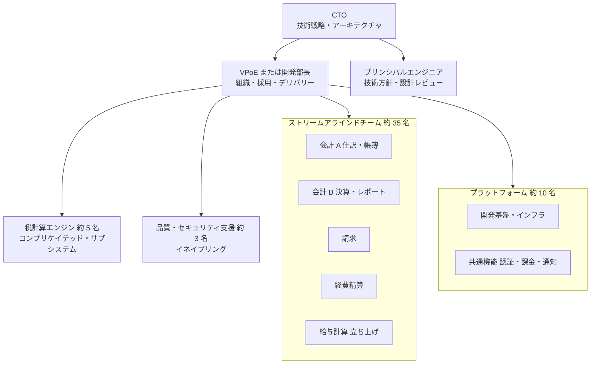

# ケース18: 1 年でエンジニア 20 名 → 60 名に

> シリーズ C で 60 億円を調達しました。CEO は「1 年でエンジニアを 60 名にして、経費精算を出し、給与計算にも着手したい」と言います。今は、あなたの直下に 18 名がぶら下がり、EM は 1 人もいません。評価と給与は、CEO とあなたが個別に決めています。

| 項目 | 内容 |
|---|---|
| あなたの立場 | 中小企業向け会計 SaaS の CTO（創業メンバー） |
| テーマ | 組織設計、マネジメント層の構築、採用とオンボーディングの仕組み化 |
| 難易度 | ★★★ |
| 目安時間 | 回答 60 分 ＋ 解説の検討 30 分 |

## 状況

### 会社の概要

| 項目 | 内容 |
|---|---|
| 会社 | 株式会社コトノハ（架空）。中小企業向けの会計・請求の統合 SaaS を提供 |
| ステージ | シリーズ C で 60 億円を調達したばかり。ARR 26 億円 |
| 人員 | 従業員 210 名、エンジニア 20 名 |
| 製品 | 会計、請求（既存）。経費精算（開発中）。給与計算（来年着手の予定） |

### 今の開発組織

- CTO（あなた）の直下に 18 名。うち 2 名はテックリード。EM はいない。
- ゆるやかな 3 つのチーム（会計、請求、経費精算）。インフラは、有志の 2 名が兼務で見ている。
- 評価と給与は、CEO と CTO が個別に決めている。キャリアラダー（等級ごとの期待を示したもの）はない。
- オンボーディングは、3 週間「先輩の横で見て学ぶ」だけ。
- 会計の中核のロジック（仕訳の生成、税の計算）を深く理解しているのは 2 名だけ。
- 直近 1 年の採用実績は 6 名。

### 計画の数字

- 1 年後に 60 名。年間の離職率を 10% と見込むと、約 44 名の採用が必要（月に 3〜4 名）。
- 新製品の経費精算を半年後にリリースし、給与計算の開発を 1 年以内に始める。

### 関係者の声

- CEO の早瀬さん: 「調達した資金は、エンジニアへの投資を最優先にしたい。1 年で 60 名にして、経費精算を出し、給与計算にも着手したい」
- テックリードの 1 人（寺田さん）: 「マネジメントにも興味があります」
- もう 1 人のテックリード（林さん）: 「僕は技術を極めたい。マネージャーにはなりたくないです」
- 社外取締役（投資家）: 「採用のペースに対して、マネジメントの層は大丈夫ですか」

## 制約

- 採用市場は厳しく、直近 1 年の採用実績は 6 名。
- 仕訳・税計算のロジックは、法令の改正に合わせた更新が毎年必要で、誤りは顧客の決算に影響する。
- 60 億円の資金は、エンジニアの採用以外（営業、マーケティング）にも使う計画がある。

## 問い

1. 60 名の時点のチームの構成を設計してください。どんな原理で、チームの境界を引きますか。
2. マネジメントの層（EM、テックリード、VPoE など）を、いつ、どう作りますか。内部からの登用と外部からの採用のバランスはどう取りますか。
3. 採用、オンボーディング、評価の仕組みを、成長の速度に耐えられるようにどう作りますか。
4. 急拡大で起きがちな失敗を 3 つ以上挙げ、それぞれの予防策を示してください。

## 考えるヒント

- 今の構造のまま 60 名になると、あなたの直下は何名になるでしょうか。
- コンウェイの法則は、システムの構造が、それを作る組織のコミュニケーションの構造を映すことを示します。どんなシステムを作りたいでしょうか。
- 44 名を採用するには、面接に何時間必要でしょうか。
- 新しく入った人が、最初の 1 か月で成果を出せる環境はあるでしょうか。
- 60 名は、1 年後に突然実現するわけではありません。30 名、45 名の時点では、どうなっているべきでしょうか。

## 解説

解説を開く

### 検討の観点

**1. 最終形ではなく、段階で設計する。** 20 名から 60 名への道のりには、30 名、45 名といった中間の段階があります。組織は各段階で機能していなければなりません。60 名の組織図だけを描いても、その途中で組織が壊れれば意味がありません。

**2. チームの境界は、価値の流れに沿って引く。** マシュー・スケルトンとマニュエル・パイスの『チームトポロジー』は、チームを 4 つの型で整理しています。

| 型 | 役割 | この会社での例 |
|---|---|---|
| ストリームアラインドチーム | 顧客への価値の流れ（製品・業務）に沿って、企画から運用までを担う | 会計、請求、経費精算、給与計算 |
| プラットフォームチーム | 他のチームが速く安全に開発できる基盤を、内部の製品として提供する | 開発基盤とインフラ、共通機能（認証、課金、通知） |
| コンプリケイテッド・サブシステムチーム | 高度な専門知識が必要な部分を担う | 仕訳の生成と税の計算のエンジン |
| イネイブリングチーム | 他のチームの能力の向上を一時的に支援する | 品質・テストの自動化、セキュリティ |

チームの大きさは 5〜9 名程度が扱いやすく、1 つのチームが理解し運用すべき範囲（認知負荷）が大きすぎないように境界を決めます。

**3. アーキテクチャとチームを一緒に設計する。** チームが独立して開発・リリースできるためには、システムにもそれに見合った境界（モジュールと、その所有者）が必要です。逆に、作りたいシステムの境界に合わせてチームを作る考え方は、「逆コンウェイ戦略」と呼ばれます（[ケース01](01-microservices-proposal.md) も参照）。

**4. マネジメントの層の計算。** 1 人の EM が直接見られる人数は、5〜8 名程度が目安とされます。60 名なら EM は 7〜9 名になり、その EM を束ねる層（ディレクターや VPoE）も必要になります。CTO の直下に 60 名がぶら下がる状態は、どんな CTO にも運営できません。

**5. 内部からの登用と外部からの採用を混ぜる。** 内部からの登用は、文化の継承と、社員に成長の道を示す点で価値があります。外部からの採用は、急拡大の経験を持ち込めます。寺田さんのようにマネジメントに関心のある人は登用の候補ですが、初めての EM には研修やコーチングが欠かせません。林さんのように技術を極めたい人には、マネージャーにならずに昇進できる道（技術職のキャリアラダー）を用意します。

**6. 採用は「仕組み」にする。** 1 名の採用あたり、書類選考と、不採用となった候補者を含む面接に延べ 20〜30 時間かかるとすると、44 名の採用には 900〜1,300 時間程度が必要です。年間の労働時間を 1,900 時間程度とすると、これはフルタイムのエンジニア 1 人の、およそ半年から 8 か月分にあたります。面接官の育成、評価の観点をそろえた構造化面接、採用の専任担当者、採用の基準を守る仕組み（採用委員会や、基準を守る役割の面接官）が必要です。

**7. オンボーディングの容量には上限がある。** 1 つのチームが同時に受け入れられる新しいメンバーは、1〜2 名程度が目安です。採用のペースは、受け入れられるペースに合わせる必要があります。

**8. 評価と報酬の仕組みがないと、急拡大で必ず揉める。** 個別に決めていた給与は、人数が増えると説明できなくなり、新しく入った人の方が高いという逆転も起きます。キャリアラダーと等級ごとの給与の幅（レンジ）を、早い段階で作ります。

**9. 知識の偏りを早めに解消する。** 仕訳と税計算を 2 名しか理解していない状態で人数だけが増えると、その 2 名が新メンバーからの質問とレビューで埋もれ、全体が遅くなります。

### 60 名の時点の構成の例

各チームには EM またはテックリードがつき、EM は合計 7〜8 名程度になります。これは一例です。製品の数や採用の進み具合によって変わります。

### 選択肢とトレードオフ

**マネジメントの層の作り方**

| 選択肢 | 主な利点 | 主なリスク | 向いている条件 |
|---|---|---|---|
| A. 内部のテックリードやシニアを EM に登用する | 文化の継承、社員の成長の道 | 初めての EM の失敗。優秀なエンジニアを失う（マネジメントに向かない人を登用した場合） | 意欲と適性のある候補者がいる |
| B. 経験のある EM を外部から採用する | 早く機能する。急拡大の経験 | 文化の不一致。採用の難しさ | 急拡大の経験が社内にない |
| C. 先に VPoE（またはディレクター）を採用し、その人が EM の層を作る | 仕組みづくりを任せられる | 採用に時間がかかる。CTO との役割分担の設計が必要（[ケース22](22-cofounder-cto-and-vpoe.md) 参照） | CTO が組織運営より技術に集中したい |

多くの場合、A と B を混ぜ、40 名前後の段階で C を検討するのが現実的です。

### 推奨アプローチの一例

**0〜3 か月（20 名 → 28 名程度）**

- チームを 4 つ（会計、請求、経費精算、基盤）にし、EM を 2 名置く（寺田さんの登用と、外部からの採用 1 名）。林さんをプリンシパルエンジニアの候補として、技術方針と設計レビューを任せる。
- キャリアラダーの第 1 版（技術職とマネジメント職の 2 本立て）と、等級ごとの給与の幅を作る。
- 採用の仕組みを作る。採用の専任担当者、構造化面接、面接官の研修、評価の会議。
- オンボーディングの仕組みを作る。初日に開発環境が動く、1 週目に最初のプルリクエストがマージされる、相談相手（バディ）をつける、30 日・60 日・90 日の期待を示す。
- 仕訳と税計算の知識を分散させる。ペア作業と設計文書を増やす。

**3〜6 か月（→ 40 名程度）**

- チームを 6 つにし、EM を 4〜5 名にする。プラットフォームチームを独立させる。
- VPoE（またはディレクター）の採用を始める。
- 書く文化を定着させる。設計文書、アーキテクチャ決定記録（ADR）、全体会。

**6〜12 か月（→ 60 名程度）**

- チームを 8〜9 つにし、EM を 7〜8 名にする。給与計算のチームを立ち上げる。
- 四半期ごとに組織を見直す。ただし、頻繁な再編は避ける。
- 採用のペースが計画を下回る場合は、製品の優先順位を絞る判断を CEO と行う。

### 急拡大で起きがちな失敗と予防策

| 失敗 | 予防策 |
|---|---|
| 採用の基準の低下（人数を追って、基準に満たない人を採る） | 構造化面接、採用委員会、基準を守る役割の面接官。採用目標は「質の条件付き」にする |
| 初めての EM の失敗 | 研修、社外のコーチ、EM どうしの学び合いの場。プレイングマネージャーの負荷を管理する |
| コミュニケーションの崩壊と文化の希薄化 | 書く文化、ADR、全体会、オンボーディングで文化と原則を伝える |
| 生産性の低下（人を増やしても速くならない。フレデリック・ブルックスは「遅れているプロジェクトに人を追加すると、さらに遅れる」と述べた） | 段階的な増員、オンボーディングの容量の管理、開発基盤への投資 |
| アーキテクチャがチームの独立を妨げる | モジュールの境界と所有者を明確にする |
| 給与の不整合（新しく入った人の方が高い） | 等級ごとの給与の幅と、既存の社員の調整 |

### 避けるべき対応

- **60 名時点の組織図だけを描き、途中の段階を考えない**。
- **最も優秀なエンジニアを、全員マネージャーにする**。技術の力が失われ、本人も不幸になることがあります。
- **毎月のように組織を再編する**。チームが落ち着いて成果を出す時間がなくなります。
- **採用を人事と人材紹介会社に任せきりにする**。
- **文化や原則を「自然に伝わる」と考えて放置する**。人数が 3 倍になれば、新しい人の方が多数派になります。

### 条件が変わると

- 採用市場が厳しく、60 名が現実的でないなら、30〜40 名でも回るように、製品の優先順位を絞り（例: 給与計算の着手を遅らせる）、開発基盤で効率を上げる判断が必要です。
- 開発拠点が複数の国にまたがるなら、時差をまたがないようにチームの境界を引きます。
- M&A で一度に人数が増えるなら、統合の設計が中心の課題になります（[ケース12](12-tech-dd-in-one-week.md) 参照）。

### 関連章

- [13.6 チームと組織の設計](../../../13-technical-leadership/06-team-and-org-design/README.md) — チームトポロジー、コンウェイの法則、組織の段階的な設計
- [13.4 採用](../../../13-technical-leadership/04-hiring/README.md) — 採用の仕組み化、構造化面接
- [13.3 エンジニアリングマネジメントの基礎](../../../13-technical-leadership/03-engineering-management/README.md) — EM の役割と育成
- [13.5 育成・評価・キャリアラダー](../../../13-technical-leadership/05-growth-and-evaluation/README.md) — キャリアラダーと給与の幅
- [14.1 CTO の役割 — ステージ別の責務](../../../14-cto/01-role-of-cto/README.md) — 組織の成長に伴う CTO の役割の変化
- [9.3 ドメイン駆動設計とモジュール分割](../../../09-architecture/03-domain-driven-design/README.md) — チームの境界とシステムの境界

