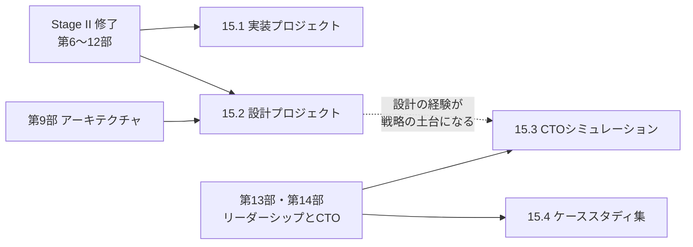

# 第15部 総仕上げ

> ここまでの 14 部で学んだ原理と判断の型を、実際に「作る・設計する・率いる」形で使い切る部です。本番品質のサービスを 1 人で作り、大規模なシステムの設計書を書いてレビューを受け、架空の会社の CTO として戦略と組織と予算を決め、CTO が直面する 22 の状況で判断を練習します。どれも正解の用意された試験ではなく、あなたの判断と、その理由を説明する力を鍛えるための課題です。

## この部で身につくこと

- 要件を測れる形にし、設計・実装・テスト・観測・運用までを 1 つのサービスでやり切る力（15.1）
- データから本当のボトルネックを見つけ、容量・コスト・信頼性・移行を数字と図で説明する設計書を書き、レビューで磨く力（15.2）
- 断片的な情報から組織の課題を診断し、戦略・90 日計画・組織・採用・予算・取締役会への説明を一貫させる力（15.3）
- 情報も時間も足りない状況で、関係者の関心を捉え、選択肢を比べ、決めて伝える力（15.4）
- 自分の成果物を他人に見せ、フィードバックを受けて改善する習慣

## 章の一覧

| 章 | タイトル | 学習時間 | 主な成果物 | 始める目安 |
|---|---|---|---|---|
| 15.1 | [実装プロジェクト — 本番品質のミニサービス](01-engineering-capstone/README.md) | 本文 2h ＋ 演習 60h | マルチテナントの API、テスト、ADR、脅威モデル、SLO、CI、負荷試験レポート、Runbook、ポストモーテム | Stage II（第6〜12部）の後。M1〜M2 は第6部と第8部の後から始めてよい |
| 15.2 | [設計プロジェクト — 設計書とレビュー](02-architecture-capstone/README.md) | 本文 3h ＋ 演習 40h | 設計書、C4 の図、容量とコストの見積もり、移行計画、リスク登録簿、ADR、レビューの記録 | 第9部の後（第7部と第10部も終えているとなお良い） |
| 15.3 | [CTOシミュレーション — 戦略・組織・予算](03-leadership-capstone/README.md) | 本文 3h ＋ 演習 40h | 診断メモ、90 日計画、技術戦略、組織設計、採用計画と予算、取締役会資料の構成、リスク登録簿、AI 利用方針 | 第13部・第14部の後 |
| 15.4 | [CTOケーススタディ集](04-case-studies/README.md) | 本文 6h ＋ 演習 30h | 22 のケースへの回答と振り返り | 第13部・第14部の後。関連する章を終えたケースから、1 つずつ始めてもよい |

合計は本文 14h ＋ 演習 170h です。すべてを完全にやり切ると、週 10 時間のペースで 4〜5 か月かかります。時間が限られる場合は、下の「最小の完走ライン」から始めてください。

## 学習の進め方

### いつ始めるか

- **15.1 は Stage II の後に**。ただし、コア API とテスト（M1〜M2）は第6部と第8部を終えた時点で始められます。以降のマイルストーンは、第10部・第11部を学びながら並行して進めると、学んだことをすぐ使えて定着が早まります。
- **15.2 は第9部の後に**。第7部（分散システム）と第10部（クラウドと SRE）を終えていると、信頼性とデータの節が格段に書きやすくなります。[学習ガイド](../00-guide/README.md) では、15.2 の設計書を他人にレビューしてもらうことを Stage II 修了の条件にしています。
- **15.3 と 15.4 は第13部・第14部の後に**。15.4 のケースは 1 つずつ独立しているので、関連する章を終えたものから少しずつ取り組み、15.3 は最後にまとめて取り組むのがお勧めです。15.4 で個々の判断を練習してから 15.3 で判断を束ねると、戦略に一貫性を持たせやすくなります。
- **CTO 準備トラック** の人は、15.3 と 15.4 を優先し、15.2 は時間があれば取り組みます（[学習ガイド](../00-guide/README.md) の優先章リストと同じ位置づけです）。15.1 は、実装の経験から離れて久しい人ほど、最小の完走ラインだけでも取り組む価値があります。レビューで「どこが手抜きになりやすいか」が肌で分かるようになるからです。

### 最小の完走ライン

完璧を目指して途中で止まるより、範囲を絞って最後までやる方が、はるかに多くを学べます。

| 章 | 最小の完走ライン | 目安 |
|---|---|---|
| 15.1 | M1〜M4（設計・コア API・認証と分離と脅威モデル・観測と SLO）。CI は最小限のものを M2 で作る | 約 36h |
| 15.2 | D1〜D4 と D7（現状分析・見積もり・目標アーキテクチャ・信頼性とセキュリティ・レビュー） | 約 31h |
| 15.3 | 診断メモ、90 日計画、技術戦略、取締役会資料の構成 | 約 24h |
| 15.4 | 難易度の異なる 8 ケース（15.4 の「目的別の進め方」から選ぶ） | 約 12h |

最小ラインを終えたら、残りのマイルストーンに戻ってかまいません。数か月後に戻ると、前回の自分の成果物の粗が見えるはずです。それも成長の記録になります。

### 1 人で取り組む場合

- **期限を自分で決めて公言する**: 「15.1 の M2 を 2 週間後の日曜までに終える」のように、日付と範囲を決め、誰かに伝えるか、公開の場所に書きます。
- **書いてから、日を置いて読み直す**: 設計書や戦略は、書いた直後には穴が見えません。2 日以上空けて、ルーブリックと各章の質問集で「別人として」読み直します。
- **AI アシスタントは、採点者ではなく質問者として使う**: 「SRE の立場のレビュアーとして、この設計書に質問を 10 個出して」のように頼むと、自分では思いつかない観点が得られます。ただし、AI は同意に傾きやすく、もっともらしい誤りも言います。指摘の妥当性は、数字と一次資料で自分で確かめてください（[学習ガイド](../00-guide/README.md) の「AI アシスタントを学習に使う」も参照）。

### 仲間と取り組む場合

3〜6 人の勉強会で取り組むと、1 人では得られない学びがあります。この部の課題は、どれも「他人に見せる・説明する・反論を受ける」ことで完成するように作ってあります。

| 章 | 勉強会での進め方の例 |
|---|---|
| 15.1 | 各自が自分のサービスを作り、マイルストーンごとにプルリクエストを相互にレビューする。M7 では、**お互いのサービスに障害を注入し合う**（相手の Runbook だけで復旧できるかを試す） |
| 15.2 | 1 人が著者、残りが帽子（SRE・セキュリティ・データ・コスト・事業）をかぶったレビュアーになり、90 分の設計レビューを行う。著者を交代して繰り返す |
| 15.3 | CEO 役・CFO 役・投資家役を決め、取締役会のロールプレイを行う。役は、あえて譲らない立場を演じる |
| 15.4 | 週 1 回、2 ケースずつ。各自が回答を書いてから集まり、解説を読む前に議論する（進め方は 15.4 の README を参照） |

進行の例: 15.1 は 8〜10 週間（2 週間ごとに進捗の共有）、15.2 は 5〜6 週間（最終週にレビュー）、15.3 は 4 週間（最終週に取締役会のロールプレイ）、15.4 は並行して毎週。

## フィードバックを得る

この部の成果物は、他人の目を通して初めて完成します。

- **ピアレビュー**: 各章のルーブリックを使い、「良い点 3 つ・改善点 3 つ・質問 1 つ」の形で返すと、受け取る側が次の行動に移しやすくなります。指摘には、15.2 の「必須・重要・提案・質問・細部」のラベルを付けましょう。
- **公開して書く**: 成果物や、そこから得た学び（設計判断の理由、負荷試験で見つけたボトルネック、ポストモーテム）を、GitHub の公開リポジトリ、技術ブログ、社内の勉強会で発表します。人に読まれる前提で書くと、説明の穴に自分で気づけます。読んだ人からの質問は、最良のレビューです。
- **経験者に具体的に頼む**: 「設計書を見てください」ではなく、「この設計書の要約（1 ページ）と、最も自信のない判断（6 章の空席インデックスの一貫性）について、30 分で意見をください」のように、範囲と時間を絞って頼むと、忙しいシニアや CTO からも返事をもらいやすくなります。
- **判断の記録をつける**: 15.3 と 15.4 では、自分の判断とその理由を日付つきで残しておきます。数か月後に同じ課題に取り組んで比べると、判断力の変化が見えます。

公開するときの注意:

- 題材が架空であることを明記します。
- **勤務先の情報を含めない**: 15.3 と 15.4 は、自分の職場に当てはめて考えると学びが深まりますが、その内容（数値・人物・組織の状況・障害）を公開してはいけません。社内で共有する場合も、機密の扱いのルールに従ってください。
- 15.1 のリポジトリに、秘密情報（API キー・パスワード・個人情報）をコミットしないようにします。コミットしてしまった場合は、履歴から消すだけでなく、その秘密情報を無効にして作り直します。

## 到達度チェック

- [ ] 15.1 のサービスを、初めて見た人が README だけで起動でき、Runbook だけでバックアップからリストアできる
- [ ] 15.1 のルーブリックで、すべての観点が 2 以上である
- [ ] 15.2 の設計書を他人にレビューしてもらい、すべての指摘への対応と改訂版がある
- [ ] 15.3 の成果物を CEO・CFO 役に説明し、質疑に答えた記録がある
- [ ] 15.4 のケースに、解説を読む前に回答を書く形で 10 件以上取り組んだ
- [ ] 成果物の少なくとも 1 つを公開または社内で共有し、受けたフィードバックを反映した

## この部の推薦図書・教材

- Martin Kleppmann "Designing Data-Intensive Applications"（邦訳『データ指向アプリケーションデザイン』オライリー・ジャパン）— 15.1 と 15.2 で出会うレプリケーション・分割・一貫性・ストリーム処理のトレードオフを、1 冊で深く理解できる。
- Betsy Beyer ほか編 "Site Reliability Engineering"（邦訳『SRE サイトリライアビリティエンジニアリング』オライリー・ジャパン）と "The Site Reliability Workbook"（邦訳『サイトリライアビリティワークブック』同）— SLO・エラーバジェット・アラート・ポストモーテムの原典。Google の公式サイトで英語版が無料公開されている（2026 年時点）。
- Mark Richards, Neal Ford "Fundamentals of Software Architecture"（邦訳『ソフトウェアアーキテクチャの基礎』オライリー・ジャパン）— 品質特性とトレードオフで設計を語るための語彙が身につく。15.2 の設計書を書く前に。
- Sam Newman "Monolith to Microservices"（邦訳『モノリスからマイクロサービスへ』オライリー・ジャパン）— ストラングラーをはじめとする段階的な移行の型と、データを分けるときの具体的な手順。15.2 の移行計画に直結する。
- Richard P. Rumelt "Good Strategy Bad Strategy"（邦訳『良い戦略、悪い戦略』日本経済新聞出版）— 15.3 の技術戦略の骨格（診断・基本方針・一貫した行動）の出典。
- Matthew Skelton, Manuel Pais "Team Topologies"（邦訳『チームトポロジー』日本能率協会マネジメントセンター）— 15.3 の組織設計で、チームの種類と相互作用を考えるための共通言語。
- Nicole Forsgren, Jez Humble, Gene Kim "Accelerate"（邦訳『LeanとDevOpsの科学』インプレス）— 15.2 と 15.3 のデータに出てくる DORA の指標の背景にある研究。

## 次に進む

この部を終えたら、カリキュラムの外で同じことを繰り返します。

- **職場で使う**: 設計レビューを主導する、チームの 90 日計画を書く、ポストモーテムの進行役を引き受ける。15.1〜15.3 の成果物とルーブリックは、そのまま職場の型として使えます。
- **定期的に戻る**: [自己診断](../00-guide/self-assessment.md) をやり直し、弱い部に戻ります。15.4 のケースには、半年や 1 年の節目にもう一度取り組むと、自分の判断の変化が分かります。
- **教える**: 後輩のメンターになる、勉強会を主催する、このカリキュラムを改善する（[執筆ガイド](../CONTRIBUTING.md)）。人に教えることは、最も深い学び方の 1 つです。

CTO への道に終わりはありませんが、原理を理解し、数字で考え、判断の理由を言葉にし、人とともに実行する、という型はここで身につけたはずです。あとは、それを実際の組織と事業の中で使い続けてください。
