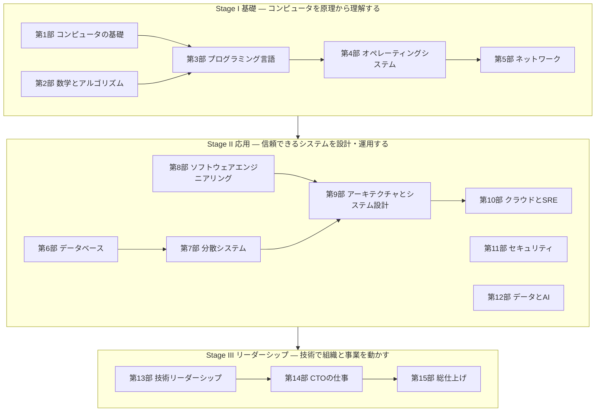

# study-cs — 基礎から CTO まで、コンピュータサイエンスの体系的カリキュラム

> コンピュータがビットを扱う仕組みから、分散システムの設計、そして技術組織を率いる CTO の意思決定まで。一本の道として学べるように設計した、日本語の学習カリキュラムです。

## このカリキュラムの特徴

- **基礎から積み上げる**: ビット・論理回路・OS・ネットワーク・データベース・分散システムといった、数十年使える原理から始めます。流行の技術は、原理の上に乗った「応用」として学びます。
- **手を動かして理解する**: 技術系の章には自動テスト付きの演習があります。Python 3.10 以上の標準ライブラリだけで動くので、`pip install` は不要です。UTF-8 デコーダ、キャッシュシミュレータ、インタプリタ、B+木、MVCC、Raft のリーダー選出、レートリミッタ、自動微分エンジン、RAG の検索器などを自分の手で実装します。
- **原理を意思決定につなげる**: 各章の「CTOの視点」で、その知識が設計レビュー・障害対応・技術選定・採用・予算のどこで効くのかを具体的に示します。
- **経営と組織まで扱う**: 技術リーダーシップ（第13部）と CTO の仕事（第14部）では、採用・評価・組織設計・技術戦略・財務・ガバナンス・危機管理・AI 戦略を扱います。日本の法制度や商習慣（請負と準委任、個人情報保護法、IPO 準備の IT 全般統制など）にも触れます。
- **総仕上げで実践する**: 実装・設計・CTO シミュレーションの 3 つのプロジェクトと、CTO が実際に直面する状況を題材にしたケーススタディ集で、学んだことを統合します。

## 全体像



| ステージ | 部 | 到達目標 |
|---|---|---|
| **Stage I 基礎** | 第1〜5部 | プログラムが CPU・メモリ・OS・ネットワークの上でどう動くかを、ビットのレベルから説明できる。アルゴリズムとデータ構造で問題を解き、計算量で効率を議論できる。 |
| **Stage II 応用** | 第6〜12部 | データベース・分散システム・アーキテクチャ・クラウド・セキュリティ・AI の原理とトレードオフを理解し、信頼性とコストのバランスが取れたシステムを設計・運用できる。シニア〜Staff エンジニアとして設計議論をリードできる。 |
| **Stage III リーダーシップ** | 第13〜15部 | チームと組織を設計し、採用・育成・評価・デリバリーを回せる。事業戦略と結びついた技術戦略を立て、経営陣・取締役会と対話し、リスクと危機に責任を持てる。 |

## 章の一覧

<!-- BEGIN:CURRICULUM（この範囲は tools/build_index.py が自動生成します） -->

全 15 部・82 章（コード演習付き 75 章）、学習時間の目安は合計 **約 934 時間** です（本文と演習のみ。推薦図書による深掘りは含みません）。

### Stage I 基礎（約 244 時間）

**[第1部 コンピュータの基礎](01-computer-systems/README.md)** — 約 36 時間

| 章 | タイトル | 学習時間 | 演習 |
|---|---|---|---|
| 1.1 | [情報の表現 — ビット・整数・小数・文字](01-computer-systems/01-data-representation/README.md) | 3h ＋ 4h | コード |
| 1.2 | [論理回路とCPUの仕組み](01-computer-systems/02-logic-and-cpu/README.md) | 4h ＋ 6h | コード |
| 1.3 | [メモリ階層とキャッシュ](01-computer-systems/03-memory-hierarchy/README.md) | 4h ＋ 5h | コード |
| 1.4 | [プログラムが動く仕組み](01-computer-systems/04-how-programs-run/README.md) | 4h ＋ 6h | コード |

**[第2部 数学とアルゴリズム](02-math-and-algorithms/README.md)** — 約 78 時間

| 章 | タイトル | 学習時間 | 演習 |
|---|---|---|---|
| 2.1 | [計算機科学のための離散数学](02-math-and-algorithms/01-discrete-math/README.md) | 4h ＋ 5h | コード |
| 2.2 | [確率・統計と定量的思考](02-math-and-algorithms/02-probability-statistics/README.md) | 5h ＋ 5h | コード |
| 2.3 | [計算量とアルゴリズム解析](02-math-and-algorithms/03-complexity/README.md) | 4h ＋ 5h | コード |
| 2.4 | [基本データ構造](02-math-and-algorithms/04-basic-data-structures/README.md) | 4h ＋ 6h | コード |
| 2.5 | [木・ヒープ・グラフ](02-math-and-algorithms/05-trees-heaps-graphs/README.md) | 5h ＋ 8h | コード |
| 2.6 | [アルゴリズム設計技法](02-math-and-algorithms/06-algorithm-design/README.md) | 5h ＋ 9h | コード |
| 2.7 | [計算理論 — 計算できること・できないこと](02-math-and-algorithms/07-theory-of-computation/README.md) | 5h ＋ 8h | コード |

**[第3部 プログラミング言語](03-programming-languages/README.md)** — 約 40 時間

| 章 | タイトル | 学習時間 | 演習 |
|---|---|---|---|
| 3.1 | [プログラミングパラダイムと抽象化](03-programming-languages/01-paradigms/README.md) | 3h ＋ 5h | コード |
| 3.2 | [型システム](03-programming-languages/02-type-systems/README.md) | 3h ＋ 6h | コード |
| 3.3 | [メモリ管理とランタイム](03-programming-languages/03-memory-management/README.md) | 3.5h ＋ 6h | コード |
| 3.4 | [言語処理系を作る](03-programming-languages/04-build-an-interpreter/README.md) | 3.5h ＋ 10h | コード |

**[第4部 オペレーティングシステム](04-operating-systems/README.md)** — 約 50 時間

| 章 | タイトル | 学習時間 | 演習 |
|---|---|---|---|
| 4.1 | [プロセス・スレッド・システムコール](04-operating-systems/01-processes-and-syscalls/README.md) | 4h ＋ 6h | コード |
| 4.2 | [仮想メモリ](04-operating-systems/02-virtual-memory/README.md) | 4h ＋ 5h | コード |
| 4.3 | [ファイルシステムとI/O](04-operating-systems/03-filesystems-and-io/README.md) | 4h ＋ 6h | コード |
| 4.4 | [並行処理と同期](04-operating-systems/04-concurrency/README.md) | 4h ＋ 7h | コード |
| 4.5 | [仮想化とコンテナ](04-operating-systems/05-virtualization-and-containers/README.md) | 4h ＋ 6h | コード |

**[第5部 コンピュータネットワーク](05-networking/README.md)** — 約 40 時間

| 章 | タイトル | 学習時間 | 演習 |
|---|---|---|---|
| 5.1 | [階層モデルとIP](05-networking/01-layers-and-ip/README.md) | 4h ＋ 5h | コード |
| 5.2 | [TCPとUDP](05-networking/02-tcp-and-udp/README.md) | 4h ＋ 5h | コード |
| 5.3 | [DNS・HTTP・TLS](05-networking/03-dns-http-tls/README.md) | 5h ＋ 7h | コード |
| 5.4 | [Webの仕組みとネットワーク構成](05-networking/04-web-architecture/README.md) | 4h ＋ 6h | コード |

### Stage II 応用（約 366 時間）

**[第6部 データベース](06-databases/README.md)** — 約 49 時間

| 章 | タイトル | 学習時間 | 演習 |
|---|---|---|---|
| 6.1 | [リレーショナルモデルとSQL](06-databases/01-relational-model-and-sql/README.md) | 4h ＋ 5h | コード |
| 6.2 | [インデックスとクエリ処理](06-databases/02-indexes-and-query-processing/README.md) | 4h ＋ 6h | コード |
| 6.3 | [トランザクションと同時実行制御](06-databases/03-transactions/README.md) | 4h ＋ 6h | コード |
| 6.4 | [ストレージエンジンと障害回復](06-databases/04-storage-and-recovery/README.md) | 4h ＋ 7h | コード |
| 6.5 | [データモデルの多様性とデータストアの選定](06-databases/05-beyond-relational/README.md) | 4h ＋ 5h | コード |

**[第7部 分散システム](07-distributed-systems/README.md)** — 約 52 時間

| 章 | タイトル | 学習時間 | 演習 |
|---|---|---|---|
| 7.1 | [分散システムの本質 — 故障・時間・順序](07-distributed-systems/01-fundamentals/README.md) | 4h ＋ 6h | コード |
| 7.2 | [レプリケーションと一貫性](07-distributed-systems/02-replication-and-consistency/README.md) | 4h ＋ 6h | コード |
| 7.3 | [パーティショニング](07-distributed-systems/03-partitioning/README.md) | 3.5h ＋ 5h | コード |
| 7.4 | [合意と協調](07-distributed-systems/04-consensus-and-coordination/README.md) | 5h ＋ 8h | コード |
| 7.5 | [メッセージングとイベント駆動](07-distributed-systems/05-messaging-and-events/README.md) | 4h ＋ 7h | コード |

**[第8部 ソフトウェアエンジニアリング](08-software-engineering/README.md)** — 約 61 時間

| 章 | タイトル | 学習時間 | 演習 |
|---|---|---|---|
| 8.1 | [良いコードと設計原則](08-software-engineering/01-code-quality-and-design/README.md) | 4h ＋ 6h | コード |
| 8.2 | [テスト戦略](08-software-engineering/02-testing/README.md) | 4h ＋ 7h | コード |
| 8.3 | [バージョン管理とコードレビュー](08-software-engineering/03-version-control-and-review/README.md) | 4h ＋ 6h | コード |
| 8.4 | [CI/CDとリリースエンジニアリング](08-software-engineering/04-ci-cd-and-release/README.md) | 4h ＋ 7h | コード |
| 8.5 | [リファクタリングと技術的負債](08-software-engineering/05-refactoring-and-tech-debt/README.md) | 4h ＋ 6h | コード |
| 8.6 | [開発プロセスとドキュメンテーション](08-software-engineering/06-process-and-documentation/README.md) | 4h ＋ 5h | コード |

**[第9部 アーキテクチャとシステム設計](09-architecture/README.md)** — 約 57 時間

| 章 | タイトル | 学習時間 | 演習 |
|---|---|---|---|
| 9.1 | [ソフトウェアアーキテクチャの基礎](09-architecture/01-architecture-fundamentals/README.md) | 3h ＋ 4h | コード |
| 9.2 | [アーキテクチャスタイル](09-architecture/02-architecture-styles/README.md) | 4h ＋ 5h | コード |
| 9.3 | [ドメイン駆動設計とモジュール分割](09-architecture/03-domain-driven-design/README.md) | 4h ＋ 5h | コード |
| 9.4 | [API設計](09-architecture/04-api-design/README.md) | 4h ＋ 6h | コード |
| 9.5 | [スケーラビリティとパフォーマンス](09-architecture/05-scalability-and-performance/README.md) | 4h ＋ 6h | コード |
| 9.6 | [システム設計ケーススタディ](09-architecture/06-system-design-cases/README.md) | 6h ＋ 6h | コード |

**[第10部 クラウドとSRE](10-cloud-and-sre/README.md)** — 約 50 時間

| 章 | タイトル | 学習時間 | 演習 |
|---|---|---|---|
| 10.1 | [クラウドコンピューティングとIaC](10-cloud-and-sre/01-cloud-and-iac/README.md) | 4h ＋ 5h | コード |
| 10.2 | [コンテナオーケストレーションとKubernetes](10-cloud-and-sre/02-containers-and-kubernetes/README.md) | 4h ＋ 5h | コード |
| 10.3 | [信頼性設計とSLO](10-cloud-and-sre/03-reliability-engineering/README.md) | 4h ＋ 4h | コード |
| 10.4 | [オブザーバビリティ](10-cloud-and-sre/04-observability/README.md) | 4h ＋ 5h | コード |
| 10.5 | [インシデント対応とポストモーテム](10-cloud-and-sre/05-incident-management/README.md) | 3.5h ＋ 4h | コード |
| 10.6 | [クラウドコスト管理（FinOps）](10-cloud-and-sre/06-finops/README.md) | 3.5h ＋ 4h | コード |

**[第11部 セキュリティ](11-security/README.md)** — 約 43 時間

| 章 | タイトル | 学習時間 | 演習 |
|---|---|---|---|
| 11.1 | [セキュリティの基本原則と脅威モデリング](11-security/01-security-principles/README.md) | 4h ＋ 4h | コード |
| 11.2 | [暗号技術の基礎](11-security/02-cryptography/README.md) | 4h ＋ 5h | コード |
| 11.3 | [認証と認可](11-security/03-authn-authz/README.md) | 4h ＋ 5h | コード |
| 11.4 | [Webアプリケーションセキュリティ](11-security/04-web-security/README.md) | 4h ＋ 5h | コード |
| 11.5 | [セキュリティ運用とサプライチェーン](11-security/05-security-operations/README.md) | 4h ＋ 4h | コード |

**[第12部 データとAI](12-data-and-ai/README.md)** — 約 54 時間

| 章 | タイトル | 学習時間 | 演習 |
|---|---|---|---|
| 12.1 | [データ基盤とデータエンジニアリング](12-data-and-ai/01-data-engineering/README.md) | 4h ＋ 5h | コード |
| 12.2 | [機械学習の基礎](12-data-and-ai/02-machine-learning/README.md) | 4h ＋ 6h | コード |
| 12.3 | [深層学習とTransformer](12-data-and-ai/03-deep-learning/README.md) | 5h ＋ 7h | コード |
| 12.4 | [LLMアプリケーション開発](12-data-and-ai/04-llm-applications/README.md) | 5h ＋ 8h | コード |
| 12.5 | [AIシステムの本番運用（MLOps/LLMOps）](12-data-and-ai/05-mlops-llmops/README.md) | 4h ＋ 6h | コード |

### Stage III リーダーシップ（約 323 時間）

**[第13部 技術リーダーシップ](13-technical-leadership/README.md)** — 約 57 時間

| 章 | タイトル | 学習時間 | 演習 |
|---|---|---|---|
| 13.1 | [テックリードとStaffエンジニア](13-technical-leadership/01-tech-lead-and-staff/README.md) | 3h ＋ 3h | 記述 |
| 13.2 | [技術的意思決定と設計レビュー](13-technical-leadership/02-technical-decisions/README.md) | 4h ＋ 4h | コード |
| 13.3 | [エンジニアリングマネジメントの基礎](13-technical-leadership/03-engineering-management/README.md) | 4h ＋ 4h | コード |
| 13.4 | [採用](13-technical-leadership/04-hiring/README.md) | 4h ＋ 4h | コード |
| 13.5 | [育成・評価・キャリアラダー](13-technical-leadership/05-growth-and-evaluation/README.md) | 4h ＋ 5h | コード |
| 13.6 | [チームと組織の設計](13-technical-leadership/06-team-and-org-design/README.md) | 4h ＋ 5h | コード |
| 13.7 | [デリバリーと生産性](13-technical-leadership/07-delivery-and-productivity/README.md) | 4h ＋ 5h | コード |

**[第14部 CTOの仕事](14-cto/README.md)** — 約 82 時間

| 章 | タイトル | 学習時間 | 演習 |
|---|---|---|---|
| 14.1 | [CTOの役割 — ステージ別の責務](14-cto/01-role-of-cto/README.md) | 3h ＋ 3h | 記述 |
| 14.2 | [技術戦略の立て方](14-cto/02-technology-strategy/README.md) | 4h ＋ 5h | コード |
| 14.3 | [事業と財務のリテラシー](14-cto/03-business-and-finance/README.md) | 5h ＋ 5h | コード |
| 14.4 | [経営陣・取締役会・投資家とのコミュニケーション](14-cto/04-executive-communication/README.md) | 3h ＋ 4h | コード |
| 14.5 | [ガバナンス・リスク・コンプライアンスと法務](14-cto/05-governance-risk-compliance/README.md) | 6h ＋ 6h | コード |
| 14.6 | [危機管理 — 重大障害とセキュリティ事故](14-cto/06-crisis-management/README.md) | 4h ＋ 5h | コード |
| 14.7 | [技術デューデリジェンスとM&A](14-cto/07-due-diligence-and-ma/README.md) | 4h ＋ 6h | コード |
| 14.8 | [AI戦略とAIガバナンス](14-cto/08-ai-strategy/README.md) | 4h ＋ 6h | コード |
| 14.9 | [CTOの自己管理とキャリア](14-cto/09-sustaining-yourself/README.md) | 3h ＋ 6h | 記述 |

**[第15部 総仕上げ](15-capstone/README.md)** — 約 184 時間

| 章 | タイトル | 学習時間 | 演習 |
|---|---|---|---|
| 15.1 | [実装プロジェクト — 本番品質のミニサービス](15-capstone/01-engineering-capstone/README.md) | 2h ＋ 60h | プロジェクト（スターター付き） |
| 15.2 | [設計プロジェクト — 設計書とレビュー](15-capstone/02-architecture-capstone/README.md) | 3h ＋ 40h | 記述 |
| 15.3 | [CTOシミュレーション — 戦略・組織・予算](15-capstone/03-leadership-capstone/README.md) | 3h ＋ 40h | 記述 |
| 15.4 | [CTOケーススタディ集](15-capstone/04-case-studies/README.md) | 6h ＋ 30h | 記述 |

<!-- END:CURRICULUM -->

## 基本の本棚

各章の「さらに学ぶために」で多くの教材を紹介していますが、その中でも **カリキュラムの背骨になる本** を挙げます。すべてを読む必要はありません。章を学んで「もっと深く知りたい」と感じた部から手に取ってください。

| ステージ | 書籍 | 対応する部 |
|---|---|---|
| Stage I | Randal E. Bryant, David R. O'Hallaron "Computer Systems: A Programmer's Perspective"（邦訳『コンピュータ・システム プログラマの視点から』） | 第1・3・4部 |
| Stage I | Noam Nisan, Shimon Schocken "The Elements of Computing Systems"（邦訳『コンピュータシステムの理論と実装』） | 第1部 |
| Stage I | 大槻兼資『問題解決力を鍛える!アルゴリズムとデータ構造』 | 第2部 |
| Stage I | Remzi H. Arpaci-Dusseau, Andrea C. Arpaci-Dusseau "Operating Systems: Three Easy Pieces"（[無料で公開](https://pages.cs.wisc.edu/~remzi/OSTEP/)） | 第4部 |
| Stage I | Robert Nystrom "Crafting Interpreters"（[無料で公開](https://craftinginterpreters.com/)） | 第3部 |
| Stage I | James F. Kurose, Keith W. Ross "Computer Networking: A Top-Down Approach" | 第5部 |
| Stage II | Martin Kleppmann "Designing Data-Intensive Applications"（邦訳『データ指向アプリケーションデザイン』） | 第6・7部 |
| Stage II | John Ousterhout "A Philosophy of Software Design" | 第8部 |
| Stage II | Titus Winters ほか "Software Engineering at Google"（邦訳『Google のソフトウェアエンジニアリング』） | 第8部 |
| Stage II | Mark Richards, Neal Ford "Fundamentals of Software Architecture"（邦訳『ソフトウェアアーキテクチャの基礎』） | 第9部 |
| Stage II | Betsy Beyer ほか "Site Reliability Engineering"（邦訳『SRE サイトリライアビリティエンジニアリング』） | 第10部 |
| Stage II | 徳丸浩『体系的に学ぶ 安全なWebアプリケーションの作り方 第2版』 | 第11部 |
| Stage II | Chip Huyen "Designing Machine Learning Systems"（邦訳『機械学習システムデザイン』） | 第12部 |
| Stage III | Camille Fournier "The Manager's Path"（邦訳『エンジニアのためのマネジメントキャリアパス』） | 第13部 |
| Stage III | Matthew Skelton, Manuel Pais "Team Topologies"（邦訳『チームトポロジー』） | 第13部 |
| Stage III | Nicole Forsgren, Jez Humble, Gene Kim "Accelerate"（邦訳『LeanとDevOpsの科学』） | 第13部 |
| Stage III | Andrew S. Grove "High Output Management"（邦訳『HIGH OUTPUT MANAGEMENT』） | 第13・14部 |
| Stage III | 広木大地『エンジニアリング組織論への招待』 | 第13・14部 |
| Stage III | Richard Rumelt "Good Strategy Bad Strategy"（邦訳『良い戦略、悪い戦略』） | 第14部 |

## 学習トラック

目的と経験に合わせて、3 つの進め方を用意しています。詳しくは [学習ガイド](00-guide/README.md) を参照してください。

| トラック | 対象 | 進め方 |
|---|---|---|
| **フルトラック** | CS を体系的に学んだことがない人 | 第1部から順番に。第1部と第2部、第8部は並行して進めてよい |
| **経験者トラック** | 実務経験のあるエンジニア | [自己診断](00-guide/self-assessment.md) で既知の部分を見極め、理解度チェックに答えられる章は演習だけ解いて先へ進む |
| **CTO 準備トラック** | 1〜2 年以内に技術責任者を目指すシニアエンジニア | [学習ガイド](00-guide/README.md) の優先章リストに沿って、各部の要点と第13〜15部を重点的に |

## 使い方

```bash
# 1. このリポジトリを自分のアカウントに fork して clone する（進捗を自分のリポジトリに記録できる）
git clone https://github.com/<あなたのアカウント>/study-cs.git
cd study-cs

# 2. Python 3.10 以上があることを確認する
python3 --version

# 3. 章の README を読み、exercises/ の演習を解いてテストを実行する
python3 tools/check.py 1.1     # 1.1 章の演習をテスト
python3 tools/check.py 1       # 第1部の全演習をテスト
python3 tools/check.py         # すべての演習の進捗を表示
```

- 各章は「本文を読む → 本文中のコードを実際に動かす → 演習を解く → 理解度チェックに答える」の順で進めます。
- 解答例は各章の `solutions/` にありますが、まず自力で取り組んでください。詰まったら、解答例の該当部分だけを見て、自分の言葉で説明できるようになってから先へ進みます。
- 進捗は [PROGRESS.md](PROGRESS.md) のチェックボックスで管理できます。
- 環境構築の詳細は [環境構築ガイド](00-guide/setup.md)、効果的な学び方は [学習法ガイド](00-guide/how-to-learn.md) を参照してください。

## リポジトリの構成

```text
study-cs/
├── README.md              # このファイル（全体の地図）
├── PROGRESS.md            # 進捗チェックリスト
├── CONTRIBUTING.md        # 教材の執筆ガイド
├── 00-guide/              # 学習ガイド（学び方・環境構築・自己診断）
├── 01-computer-systems/   # 第1部 … 各部に README（概要）と章ディレクトリ
│   └── 01-data-representation/
│       ├── README.md      #   章の本文
│       ├── exercises/     #   演習（あなたが編集する）
│       └── solutions/     #   解答例
├── …
├── 15-capstone/           # 第15部 総仕上げ
└── tools/
    ├── check.py           # 演習のテストランナー
    ├── lint_content.py    # 教材の体裁チェック
    └── build_index.py     # 章一覧・進捗表の生成
```

## 教材についての注意

- 法令・規格・クラウドサービス・ツールに関する記述は、執筆時点（2026 年）の情報です。実務で使う前に一次情報を確認してください。
- 法務・会計・税務・労務に関する章は一般的な解説であり、個別の判断は専門家に相談してください。
- 誤りや改善点を見つけたら、[執筆ガイド](CONTRIBUTING.md) を参考に修正してください。
