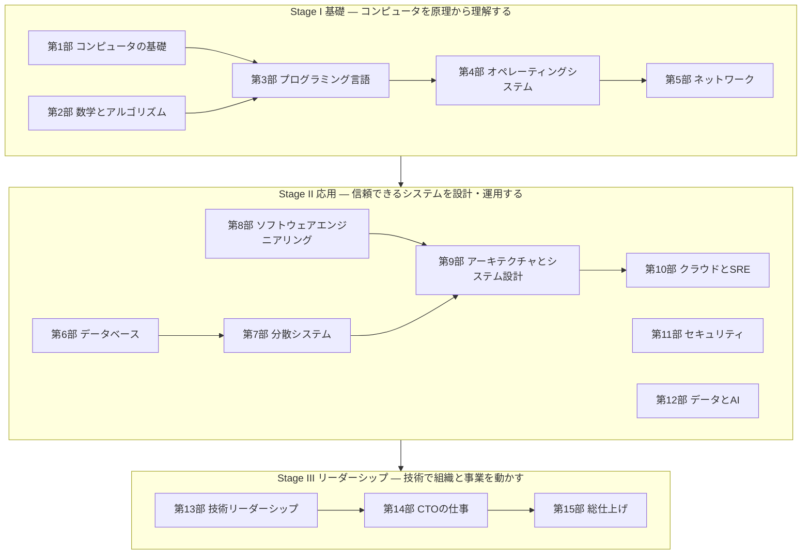

# study-cs — 基礎から CTO まで、コンピュータサイエンスの体系的カリキュラム

> コンピュータがビットを扱う仕組みから、分散システムの設計、そして技術組織を率いる CTO の意思決定まで。一本の道として学べるように設計した、日本語の学習カリキュラムです。

## このカリキュラムの特徴

- **基礎から積み上げる**: ビット・論理回路・OS・ネットワーク・データベース・分散システムといった、数十年使える原理から始めます。流行の技術は、原理の上に乗った「応用」として学びます。
- **手を動かして理解する**: 技術系の章には自動テスト付きの演習があります。Python 3.10 以上の標準ライブラリだけで動くので、`pip install` は不要です。UTF-8 デコーダ、キャッシュシミュレータ、インタプリタ、B+木、MVCC、Raft のリーダー選出、レートリミッタ、自動微分エンジン、RAG の検索器などを自分の手で実装します。
- **原理を意思決定につなげる**: 各章の「CTOの視点」で、その知識が設計レビュー・障害対応・技術選定・採用・予算のどこで効くのかを具体的に示します。
- **経営と組織まで扱う**: 技術リーダーシップ（第13部）と CTO の仕事（第14部）では、採用・評価・組織設計・技術戦略・財務・ガバナンス・危機管理・AI 戦略を扱います。日本の法制度や商習慣（請負と準委任、個人情報保護法、IPO 準備の IT 全般統制など）にも触れます。
- **総仕上げで実践する**: 実装・設計・CTO シミュレーションの 3 つのプロジェクトと、CTO が実際に直面する状況を題材にしたケーススタディ集で、学んだことを統合します。

## 全体像



| ステージ | 部 | 到達目標 |
|---|---|---|
| **Stage I 基礎** | 第1〜5部 | プログラムが CPU・メモリ・OS・ネットワークの上でどう動くかを、ビットのレベルから説明できる。アルゴリズムとデータ構造で問題を解き、計算量で効率を議論できる。 |
| **Stage II 応用** | 第6〜12部 | データベース・分散システム・アーキテクチャ・クラウド・セキュリティ・AI の原理とトレードオフを理解し、信頼性とコストのバランスが取れたシステムを設計・運用できる。シニア〜Staff エンジニアとして設計議論をリードできる。 |
| **Stage III リーダーシップ** | 第13〜15部 | チームと組織を設計し、採用・育成・評価・デリバリーを回せる。事業戦略と結びついた技術戦略を立て、経営陣・取締役会と対話し、リスクと危機に責任を持てる。 |

## 章の一覧

<!-- BEGIN:CURRICULUM（この範囲は tools/build_index.py が自動生成します） -->
| 部 | 章 |
|---|---|
| [第0部 学習ガイド](00-guide/README.md) | 学び方・環境構築・自己診断 |
| [第1部 コンピュータの基礎](01-computer-systems/README.md) | 1.1 情報の表現 / 1.2 論理回路とCPUの仕組み / 1.3 メモリ階層とキャッシュ / 1.4 プログラムが動く仕組み |
| [第2部 数学とアルゴリズム](02-math-and-algorithms/README.md) | 2.1 離散数学 / 2.2 確率・統計 / 2.3 計算量 / 2.4 基本データ構造 / 2.5 木・ヒープ・グラフ / 2.6 アルゴリズム設計技法 / 2.7 計算理論 |
| [第3部 プログラミング言語](03-programming-languages/README.md) | 3.1 パラダイム / 3.2 型システム / 3.3 メモリ管理 / 3.4 言語処理系を作る |
| [第4部 オペレーティングシステム](04-operating-systems/README.md) | 4.1 プロセス / 4.2 仮想メモリ / 4.3 ファイルシステムとI/O / 4.4 並行処理 / 4.5 仮想化とコンテナ |
| [第5部 コンピュータネットワーク](05-networking/README.md) | 5.1 階層モデルとIP / 5.2 TCPとUDP / 5.3 DNS・HTTP・TLS / 5.4 Webの仕組み |
| [第6部 データベース](06-databases/README.md) | 6.1 リレーショナルモデルとSQL / 6.2 インデックス / 6.3 トランザクション / 6.4 ストレージと障害回復 / 6.5 データストアの選定 |
| [第7部 分散システム](07-distributed-systems/README.md) | 7.1 故障・時間・順序 / 7.2 レプリケーション / 7.3 パーティショニング / 7.4 合意と協調 / 7.5 メッセージング |
| [第8部 ソフトウェアエンジニアリング](08-software-engineering/README.md) | 8.1 設計原則 / 8.2 テスト / 8.3 バージョン管理とレビュー / 8.4 CI/CD / 8.5 技術的負債 / 8.6 開発プロセス |
| [第9部 アーキテクチャとシステム設計](09-architecture/README.md) | 9.1 基礎 / 9.2 スタイル / 9.3 DDD / 9.4 API設計 / 9.5 スケーラビリティ / 9.6 ケーススタディ |
| [第10部 クラウドとSRE](10-cloud-and-sre/README.md) | 10.1 クラウドとIaC / 10.2 Kubernetes / 10.3 信頼性とSLO / 10.4 オブザーバビリティ / 10.5 インシデント対応 / 10.6 FinOps |
| [第11部 セキュリティ](11-security/README.md) | 11.1 原則と脅威モデリング / 11.2 暗号 / 11.3 認証と認可 / 11.4 Webセキュリティ / 11.5 セキュリティ運用 |
| [第12部 データとAI](12-data-and-ai/README.md) | 12.1 データ基盤 / 12.2 機械学習 / 12.3 深層学習 / 12.4 LLMアプリ / 12.5 MLOps/LLMOps |
| [第13部 技術リーダーシップ](13-technical-leadership/README.md) | 13.1 テックリード / 13.2 意思決定 / 13.3 マネジメント / 13.4 採用 / 13.5 評価と育成 / 13.6 組織設計 / 13.7 生産性 |
| [第14部 CTOの仕事](14-cto/README.md) | 14.1 CTOの役割 / 14.2 技術戦略 / 14.3 事業と財務 / 14.4 経営コミュニケーション / 14.5 ガバナンスと法務 / 14.6 危機管理 / 14.7 技術DD / 14.8 AI戦略 / 14.9 自己管理とキャリア |
| [第15部 総仕上げ](15-capstone/README.md) | 実装プロジェクト / 設計プロジェクト / CTOシミュレーション / ケーススタディ集 |
<!-- END:CURRICULUM -->

## 学習トラック

目的と経験に合わせて、3 つの進め方を用意しています。詳しくは [学習ガイド](00-guide/README.md) を参照してください。

| トラック | 対象 | 進め方 |
|---|---|---|
| **フルトラック** | CS を体系的に学んだことがない人 | 第1部から順番に。第1部と第2部、第8部は並行して進めてよい |
| **経験者トラック** | 実務経験のあるエンジニア | [自己診断](00-guide/self-assessment.md) で既知の部分を見極め、理解度チェックに答えられる章は演習だけ解いて先へ進む |
| **CTO 準備トラック** | 1〜2 年以内に技術責任者を目指すシニアエンジニア | [学習ガイド](00-guide/README.md) の優先章リストに沿って、各部の要点と第13〜15部を重点的に |

## 使い方

```bash
# 1. このリポジトリを自分のアカウントに fork して clone する（進捗を自分のリポジトリに記録できる）
git clone https://github.com/<あなたのアカウント>/study-cs.git
cd study-cs

# 2. Python 3.10 以上があることを確認する
python3 --version

# 3. 章の README を読み、exercises/ の演習を解いてテストを実行する
python3 tools/check.py 1.1     # 1.1 章の演習をテスト
python3 tools/check.py 1       # 第1部の全演習をテスト
python3 tools/check.py         # すべての演習の進捗を表示
```

- 各章は「本文を読む → 本文中のコードを実際に動かす → 演習を解く → 理解度チェックに答える」の順で進めます。
- 解答例は各章の `solutions/` にありますが、まず自力で取り組んでください。詰まったら、解答例の該当部分だけを見て、自分の言葉で説明できるようになってから先へ進みます。
- 進捗は [PROGRESS.md](PROGRESS.md) のチェックボックスで管理できます。
- 環境構築の詳細は [環境構築ガイド](00-guide/setup.md)、効果的な学び方は [学習法ガイド](00-guide/how-to-learn.md) を参照してください。

## リポジトリの構成

```text
study-cs/
├── README.md              # このファイル（全体の地図）
├── PROGRESS.md            # 進捗チェックリスト
├── CONTRIBUTING.md        # 教材の執筆ガイド
├── 00-guide/              # 学習ガイド（学び方・環境構築・自己診断）
├── 01-computer-systems/   # 第1部 … 各部に README（概要）と章ディレクトリ
│   └── 01-data-representation/
│       ├── README.md      #   章の本文
│       ├── exercises/     #   演習（あなたが編集する）
│       └── solutions/     #   解答例
├── …
├── 15-capstone/           # 第15部 総仕上げ
└── tools/
    ├── check.py           # 演習のテストランナー
    ├── lint_content.py    # 教材の体裁チェック
    └── build_index.py     # 章一覧・進捗表の生成
```

## 教材についての注意

- 法令・規格・クラウドサービス・ツールに関する記述は、執筆時点（2026 年）の情報です。実務で使う前に一次情報を確認してください。
- 法務・会計・税務・労務に関する章は一般的な解説であり、個別の判断は専門家に相談してください。
- 誤りや改善点を見つけたら、[執筆ガイド](CONTRIBUTING.md) を参考に修正してください。
